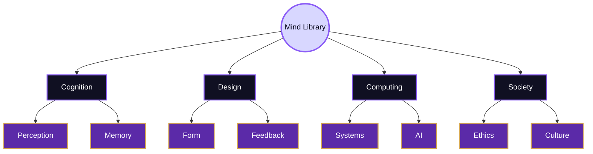
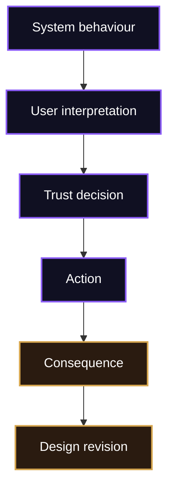

# Connections

> [!abstract] Bridge Map
> This page maps the bridges between the Mind Library and the wider territory of HCI. Understanding users is not owned by one discipline. It is built from cognitive science, psychology, design, computer science, accessibility, ethics, AI, organisational studies, and social research.

The Mind Library becomes useful only when its ideas travel. A mental model matters because it changes interface structure. Cognitive load matters because it changes task performance. Accessibility matters because it changes who can participate. Trust matters because automated systems increasingly ask users to accept, contest, or override machine judgement.

## Bridge Compass

## Cognitive And Psychological Bridges

HCI borrows from cognitive science and psychology because interaction depends on perception, attention, memory, learning, decision-making, and emotion. These fields help explain why users overlook visible controls, why they rely on familiar patterns, why multitasking damages performance, and why feedback changes confidence. [[Activities/Theory]] stores these ideas as concepts; [[Activities/Experiment]] tests whether they explain real behaviour.

The bridge is not a one-way import. HCI also changes psychological questions by placing cognition inside interactive artefacts. Users do not solve abstract puzzles in empty rooms. They work with screens, mobile devices, AI systems, institutional forms, assistive technologies, and social platforms. The interface becomes part of the cognitive environment.

| Bridge | What HCI takes from it | What HCI adds |
|---|---|---|
| Cognitive science | Attention, memory, perception, mental models | Interaction with designed artefacts |
| Psychology | Error, learning, decision-making, motivation | Situated tasks and interface feedback |
| Ergonomics | Human abilities, workload, fit | Digital and sociotechnical systems |
| Communication | Meaning, language, interpretation | Interface labels, prompts, warnings |

## Design And Form Bridges

Design is where user understanding becomes visible. If a system assumes that users remember every previous step, the design will hide state. If it assumes users can infer meaning from icons alone, the design will produce ambiguity. If it assumes perfect perception, it may ignore contrast, focus order, or screen reader structure.

[[Activities/Design]] is therefore the form-making bridge. It turns theory into layout, language, hierarchy, affordance, signifier, constraint, and feedback. Design also feeds back into theory: when a prototype fails, the failure may reveal a mistaken assumption about users.

> [!example] Bridge Example
> A student portal may fail because its information architecture follows administrative departments rather than student goals. The issue is not only layout. It is a mismatch between institutional structure and user mental model.

## Computing, AI, And System Bridges

Computer science gives HCI the systems that users encounter: databases, algorithms, networks, sensors, recommender systems, and AI models. The Mind Library asks what these systems mean to users. Does the user understand what changed? Can they predict what will happen next? Do they know how to recover? Can they challenge an automated decision?

This bridge becomes especially important in human-AI interaction. AI systems are probabilistic, adaptive, and often opaque. Users may overtrust them, undertrust them, misunderstand their limits, or treat generated output as more certain than it is. The [Microsoft Human-AI Interaction Guidelines](https://www.microsoft.com/en-us/research/articles/guidelines-for-human-ai-interaction-eighteen-best-practices-for-human-centered-ai-design) and Google’s [People + AI Guidebook](https://pair.withgoogle.com/guidebook-v2/) are useful anchors for this route.

## Ethics, Accessibility, And Society

The Mind Library also connects to ethics because representing “the user” is never neutral. A study may overrepresent confident, urban, technically fluent, able-bodied users and then treat their behaviour as universal. A design may optimise speed while ignoring dignity, privacy, or accessibility. A model of the user may become a stereotype if it turns human variation into a single average profile.

The [[../04_Inclusive_Gate/Overview|Inclusive Gate]] is the strongest companion room here. Accessibility work from the [W3C Web Accessibility Initiative](https://www.w3.org/WAI/) and [WCAG 2.2](https://www.w3.org/TR/WCAG22/) shows that interaction must be perceivable, operable, understandable, and robust. The Mind Library adds the cognitive and experiential question: how does exclusion feel, where does it appear, and what assumptions created it?

## Synthesis

Connections make the Mind Library more than a psychology shelf. It is a bridge map through which HCI links human cognition to designed form, implemented systems, social contexts, and ethical responsibility. Every route returns to the same academic demand: explain the user carefully, design from that explanation, and test whether the explanation holds.

Related routes: [[Overview]], [[Activities/Theory]], [[Activities/Design]], [[Activities/Experiment]], [[Important People]], [[Important Venues]], [[Local and Global]], [[Open Problems]].

^connections-end
