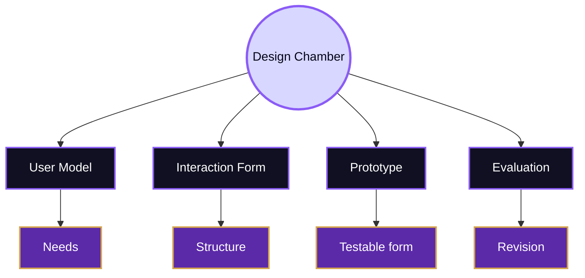
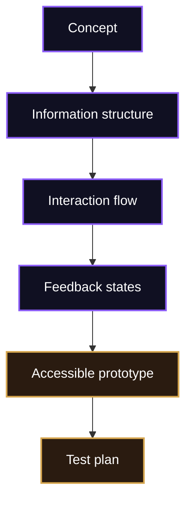
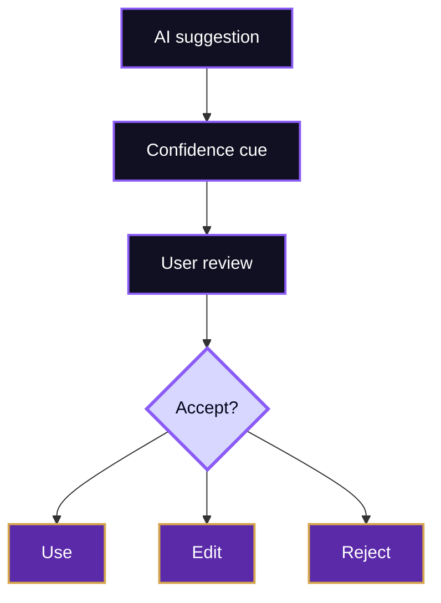

# Design

> [!abstract] Form-Making Chamber
> Design is the chamber where the Mind Library turns knowledge about users into interaction form. It converts theory about cognition, attention, memory, accessibility, and trust into labels, layouts, feedback, flows, constraints, and prototypes.

Design in HCI is not decoration after engineering. It is the disciplined shaping of possible action. A design tells users what matters, what can be done, what has happened, what is risky, and how to recover. If [[01_Core_Area_HCI/001_Subareas/05_Oracle_Engine/Activities/Theory]] explains human interaction and [[01_Core_Area_HCI/001_Subareas/05_Oracle_Engine/Activities/Experiment]] tests it, Design is the chamber that makes those claims visible.

## Chamber Map

## From Understanding To Form

The first design act is interpretation. A designer reads user research, theory, constraints, and evidence, then decides what the interface must make easier. If users forget steps, the design may expose progress and history. If users misunderstand terminology, the design may replace institutional labels with user-centred language. If users cannot perceive status, the design must strengthen feedback. If users depend on assistive technologies, the design must provide semantic structure and keyboard operation.

This movement from understanding to form is the reason human-centred design matters. [ISO 9241-210](https://www.iso.org/standard/77520.html) frames human-centred design as an approach to interactive systems that considers users, tasks, environments, and iterative evaluation. The [Stanford d.school](https://dschool.stanford.edu/) provides practical design learning resources around empathy, prototyping, and iteration, while HCI venues such as [ACM CHI](https://dl.acm.org/conference/chi) examine how such practices work in research.

| User insight | Design decision | Evidence to check |
|---|---|---|
| Users search by goal, not department | Reorganise navigation around user tasks | Fewer wrong turns and faster finding |
| Users hesitate before clicking | Strengthen signifiers and labels | Reduced hesitation and fewer misclicks |
| Users forget prior state | Keep progress and selected options visible | Fewer repeated actions |
| Users cannot recover from errors | Add undo, prevention, and plain-language messages | Better recovery and lower frustration |
| Users rely on screen readers | Use semantic headings, labels, and focus order | Successful assistive technology navigation |

## Interaction Form

Interaction form includes layout, sequence, navigation, wording, feedback, constraints, and state. The Mind Library cares about these because they are cognitive tools. A clear form reduces interpretation work. A confusing form transfers work to the user.

Good design makes system state visible. It does not require users to remember hidden conditions or decode technical vocabulary. It also creates constraints that prevent invalid action. A date picker, for example, can prevent impossible dates; an upload flow can show allowed formats before failure; a form can validate input near the field rather than after a full submission.

## Prototyping As Inquiry

In the Design chamber, a prototype is not merely a preview of the final product. It is a question made tangible. A low-fidelity sketch can test information structure. A clickable prototype can test navigation and feedback. A coded prototype can test keyboard access, responsive layout, screen reader structure, performance, and dynamic states.

> [!important] Prototype Rule
> The prototype should be only as detailed as the question requires. Extra polish can hide conceptual weakness, while too little structure can make evaluation meaningless.

| Prototype type | Best question | Risk |
|---|---|---|
| Paper sketch | Does the structure make sense? | Cannot test real interaction states |
| Wireframe | Is the layout and hierarchy understandable? | May underrepresent content and feedback |
| Clickable prototype | Can users follow the flow? | May fake system behaviour |
| Coded prototype | Does the interaction work with real constraints? | Takes more effort to revise |
| Accessibility prototype | Can diverse users operate it? | Requires assistive technology checks |

## Designing For Accessibility

Accessibility belongs inside design, not after design. If a team waits until the end, structure is already fixed and barriers become expensive to repair. The [W3C Web Accessibility Initiative](https://www.w3.org/WAI/) and [WCAG 2.2](https://www.w3.org/TR/WCAG22/) provide essential criteria, but the design question is broader: can users perceive, operate, understand, and recover within the system?

Accessibility design affects colour contrast, focus indicators, headings, form labels, captions, target sizes, error messages, keyboard order, screen reader names, motion, and cognitive clarity. It also affects language. Plain instructions and predictable patterns help many users, including users under stress, users working in a second language, and users with cognitive disabilities.

## Designing For Trust

Trust becomes a design material when systems automate, recommend, classify, or generate. Human-AI systems must show what they can do, what they cannot do, when they are uncertain, and how users can contest or correct them. Google’s [People + AI Guidebook](https://pair.withgoogle.com/guidebook-v2/) and Microsoft’s [Human-AI Interaction Guidelines](https://www.microsoft.com/en-us/research/articles/guidelines-for-human-ai-interaction-eighteen-best-practices-for-human-centered-ai-design) are useful routes for this problem.

## Synthesis

Design is the Mind Library’s form-making chamber. It translates user understanding into interface structure and turns theory into something users can perceive, operate, and judge. A good design is not simply attractive; it is a testable claim about human action. It should reduce needless effort, support accessibility, make feedback clear, help users recover, and prepare evidence for [[01_Core_Area_HCI/001_Subareas/05_Oracle_Engine/Activities/Experiment]].

Related routes: [[../Overview]], [[01_Core_Area_HCI/001_Subareas/05_Oracle_Engine/Activities/Theory]], [[01_Core_Area_HCI/001_Subareas/05_Oracle_Engine/Activities/Experiment]], [[../Connections]], [[../Important People]], [[../Important Venues]], [[../Open Problems]].

^design-end
