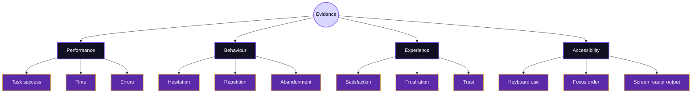
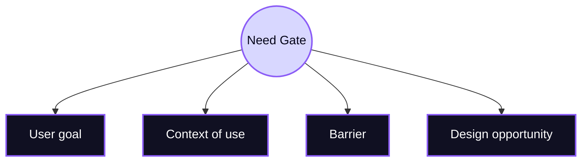
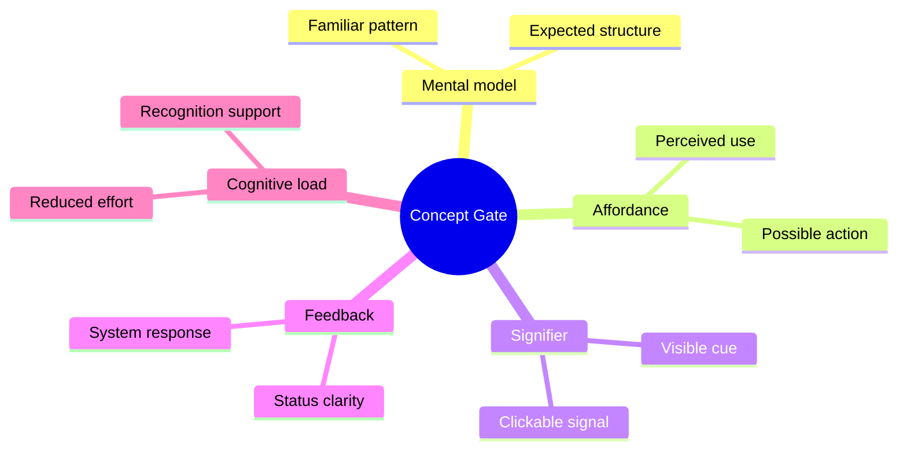
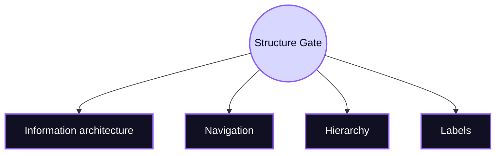
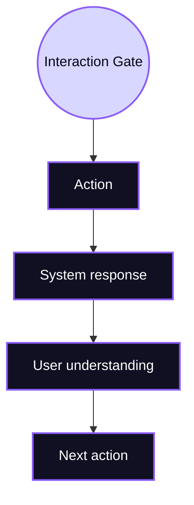
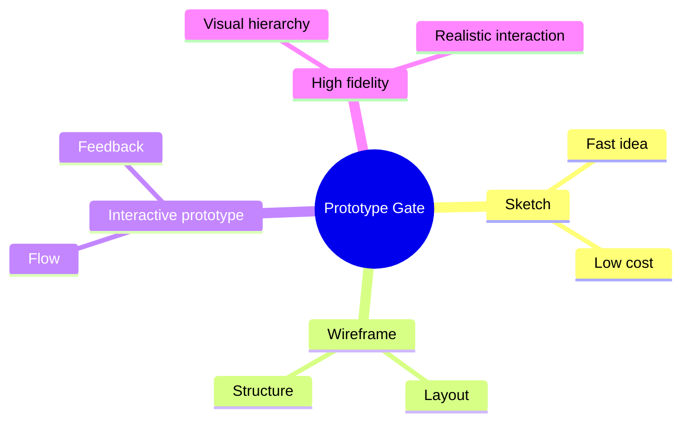
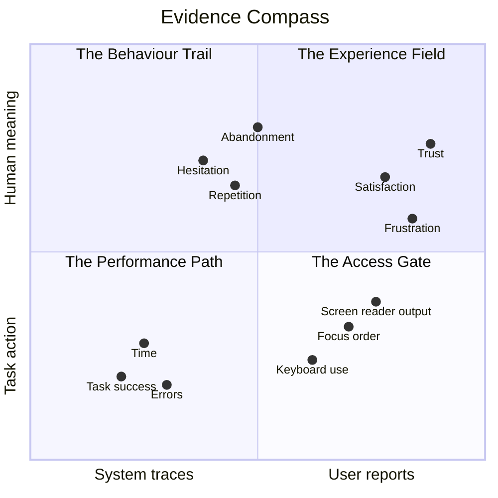
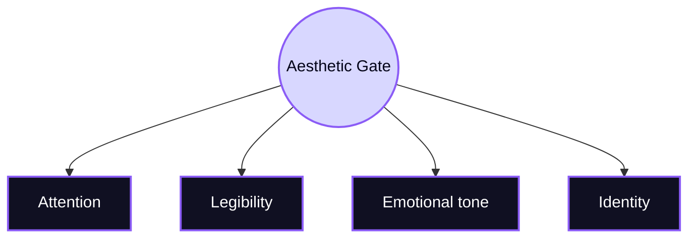
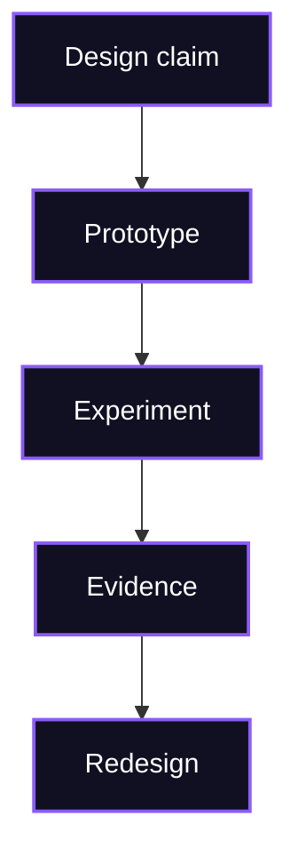

# Design

> [!abstract] Chamber of Form
> This chamber explains how Human-Computer Interaction transforms human needs, theoretical concepts, and research evidence into interactive systems. In the Mind Library, Design is not decoration. It is the disciplined shaping of possible actions, meanings, feedback, access, and experience.

The Design chamber stands between [[Theory]] and [[Experiment]]. Theory explains how people understand and act through systems. Experiment tests what happens when real users meet those systems. Design is the chamber where both become material. It turns concepts into interfaces, structures, flows, prototypes, and interaction possibilities.

In HCI, design is academic because it is not based only on taste. It is grounded in human-centred reasoning, usability principles, accessibility standards, cognitive constraints, social context, and iterative evaluation. A design choice should therefore be explainable. The researcher or designer should be able to say why an element exists, what human problem it addresses, and how it can be tested.


```

> [!note] Core academic principle
> HCI design is the construction of interaction conditions. It determines what users notice, understand, attempt, recover from, and experience while using a system.

## The need gate

Design begins before the screen. The first gate is the user need, which must be understood in context. A system is not designed for an abstract human being but for people with goals, limitations, habits, environments, cultures, tools, and pressures.

Human-centred design treats this context as part of the design material. The designer investigates who the users are, what they are trying to accomplish, what prevents them from succeeding, and what would count as a meaningful improvement. This approach is consistent with ISO 9241-210, which frames human-centred design as a process for making interactive systems more usable and useful across the system life cycle.



A weak design process begins with a preferred visual style. A stronger HCI design process begins with a human problem. If a student cannot find course requirements, the design issue is not merely visual organisation. It may involve information architecture, terminology, navigation, expectation, and cognitive load.

The main academic anchors for this gate are [ISO 9241-210](https://www.iso.org/standard/77520.html), [NIST Human-Centered Design](https://www.nist.gov/itl/iad/human-centered-technologies/human-factors-human-centered-design), and the [Stanford d.school Design Thinking Bootleg](https://dschool.stanford.edu/tools/design-thinking-bootleg).

## The concept gate

After the need is identified, the designer enters the concept gate. This is where HCI theory becomes design direction. Mental models guide how the system should be structured. Affordances and signifiers guide how actions should become visible. Feedback guides how the system should respond. Cognitive load guides how much information should be shown and how much memory the user must carry.



> [!important] Concept rule
> A design element should not be present only because it looks attractive. In HCI, the stronger question is what interaction function the element performs.

For example, a button is not only a rectangle with text. It is a signified possibility for action. Its position, colour, size, label, state, and feedback all participate in whether the user understands what can be done. A navigation menu is not only a list of destinations. It is a visible model of the system’s structure.

This gate connects directly to [[Theory]], where mental models, affordances, feedback, accessibility, cognitive load, and human-AI interaction are treated as explanatory tools.

## The structure gate

The structure gate concerns the organisation of the system. In HCI, structure is not neutral. It shapes what users expect, where they look, what they remember, and how easily they recover from mistakes.

Information architecture, navigation, grouping, labelling, and hierarchy all belong to this gate. A system with strong structure allows users to build a stable understanding of where they are, what is available, and how to move forward.



A user should not need to reverse-engineer the designer’s logic. If the structure is clear, users can form an accurate mental model. If the structure is unclear, they may search randomly, repeat errors, or abandon the task.

Nielsen Norman Group’s work on [usability heuristics](https://www.nngroup.com/articles/ten-usability-heuristics/) is especially relevant here because principles such as consistency, recognition rather than recall, error prevention, and visibility of system status all affect structural clarity.

## The interaction gate

The interaction gate concerns what users can do and how the system responds. It includes actions, states, feedback, constraints, transitions, and error recovery.

An interaction is not complete when the user acts. It is complete when the user understands the result of that action. A form submission without confirmation, a loading process without status, or an error message without recovery guidance leaves the interaction unresolved.



> [!example] Interaction reading
> If a user clicks a filter and nothing visibly changes, the problem may not be the filter logic. The problem may be the absence of clear feedback. The system acted, but the interaction failed because the user could not interpret the result.

This gate is closely related to [[Experiment]], because interaction quality is often discovered through observation. A designer may believe the response is obvious, but a usability test can reveal uncertainty, repeated clicking, or misinterpretation.

## The prototype gate

The prototype gate is where design becomes testable. A prototype is not merely an unfinished product. It is a research instrument. It allows the designer to explore an idea before committing to a full implementation.

Low-fidelity prototypes can test structure and task flow. High-fidelity prototypes can test visual hierarchy, interaction feedback, and perceived realism. Interactive prototypes can reveal whether users understand possible actions and transitions.



> [!tip] Prototype principle
> A prototype should be detailed enough to answer the current research question, but not so detailed that it becomes expensive to change.

The Stanford d.school’s design process resources are useful at this gate because they treat prototyping as a way of thinking, not merely as a production step. In HCI, this matters because prototypes allow design assumptions to be externalised and challenged.

## The accessibility gate

The accessibility gate asks whether the design can be used by people with different bodies, abilities, technologies, and contexts. Accessibility is not a final check after visual design. It is a design condition from the beginning.

A design that relies only on colour may exclude users with colour-vision differences. A design that requires precise mouse movement may exclude users with motor impairments. A design that lacks semantic structure may fail for screen reader users. A design with unclear language may increase cognitive barriers.

The W3C accessibility framework describes accessibility through the principles of being perceivable, operable, understandable, and robust. These principles are developed in the [W3C Accessibility Principles](https://www.w3.org/WAI/fundamentals/accessibility-principles/) and formalised in [WCAG 2.2](https://www.w3.org/TR/WCAG22/).

> [!warning] Inclusion boundary
> A design that works only for the designer’s imagined average user is not fully human-centred. HCI design must consider the diversity of human perception, movement, attention, language, and technology.

This gate connects to [[Local and Global]] because accessibility is also affected by infrastructure, language, culture, device availability, and social context.

## The aesthetic gate

Aesthetics matter in HCI, but not as surface decoration alone. Visual style influences attention, trust, legibility, emotional tone, perceived difficulty, and the identity of a system. In this project, the RPG style is not merely decorative. It frames the user as a traveller moving through a knowledge map, which can support orientation and motivation if the interaction remains readable and academically controlled.



> [!note] Aesthetic rule
> Visual style becomes academically defensible when it supports interaction, orientation, memory, motivation, or meaning. It becomes weak when it distracts from comprehension.

A visual system should therefore be evaluated through [[Experiment]]. If users enjoy the theme but fail to understand the content, the aesthetic layer is not successful. If the theme increases engagement while preserving readability, structure, and accessibility, it becomes part of the interaction design rather than a cosmetic shell.

## The redesign gate

Design in HCI is iterative. A first version is not expected to be perfect. It is expected to become visible enough to be tested, criticised, and improved. Redesign is therefore not failure. It is the normal academic movement of HCI.



The designer should use evidence to revise structure, labels, feedback, visual hierarchy, accessibility, and task flow. A strong redesign is not simply a new visual version. It is a reasoned response to observed interaction problems.

This gate completes the bridge between [[Design]] and [[Experiment]]. Design creates the testable form. Experiment reveals the limits of that form. Redesign turns those limits into improvement.

## Design synthesis

Design is the form-making chamber of HCI. It begins with human need, passes through theory, becomes structure and interaction, enters prototype form, and returns through evaluation into redesign. It is creative, but it is not arbitrary. It is aesthetic, but it is not merely visual. It is technical, but it is not only engineering.

In the wider map, this chamber connects backward to [[Theory]], because every design decision should be explainable through concepts, and forward to [[Experiment]], because every important design claim should be tested. It also connects to [[Open Problems]], where unresolved challenges in accessibility, human-AI interaction, dark patterns, inclusion, and long-term use continue to shape the future of HCI.

## Academic anchors

For human-centred design, the central institutional route begins with [ISO 9241-210](https://www.iso.org/standard/77520.html), which gives requirements and recommendations for human-centred design across the life cycle of interactive systems. [NIST Human-Centered Design](https://www.nist.gov/itl/iad/human-centered-technologies/human-factors-human-centered-design) provides another applied research route into human factors and human-centred technologies. The [Stanford d.school Design Thinking Bootleg](https://dschool.stanford.edu/tools/design-thinking-bootleg) offers practical design methods for moving from problem framing to prototyping.

For usability principles, [Nielsen Norman Group](https://www.nngroup.com/) is a central practical source, especially its pages on [Ten Usability Heuristics](https://www.nngroup.com/articles/ten-usability-heuristics/), [Design Thinking](https://www.nngroup.com/articles/design-thinking/), and [UX research methods](https://www.nngroup.com/articles/which-ux-research-methods/).

For accessibility, the strongest route begins with the [W3C Web Accessibility Initiative](https://www.w3.org/WAI/), the [W3C Accessibility Principles](https://www.w3.org/WAI/fundamentals/accessibility-principles/), [WCAG 2.2](https://www.w3.org/TR/WCAG22/), and [WebAIM](https://webaim.org/).

For academic HCI research, this chamber connects to [ACM SIGCHI](https://sigchi.org/), the [ACM CHI Conference](https://dl.acm.org/conference/chi), and the [ACM Digital Library](https://dl.acm.org/).

## Connected chambers

This chamber connects to [[Theory]] because design decisions need conceptual explanation. It connects to [[Experiment]] because design claims need evidence. It connects to [[Connections]] because design links cognitive, social, technical, and ethical dimensions. It connects to [[Local and Global]] because design changes across cultures, infrastructures, languages, and access conditions. It connects to [[Open Problems]] because HCI design still struggles with fairness, attention, autonomy, long-term effects, and responsible AI interaction.

^design-end