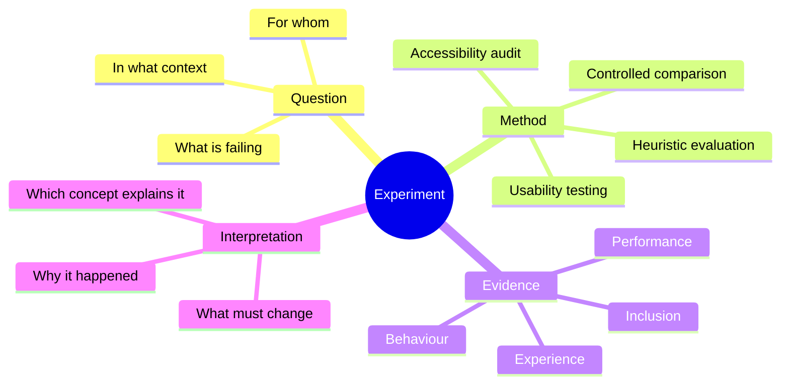
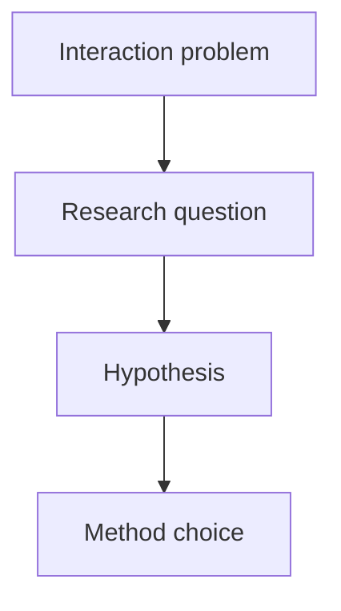
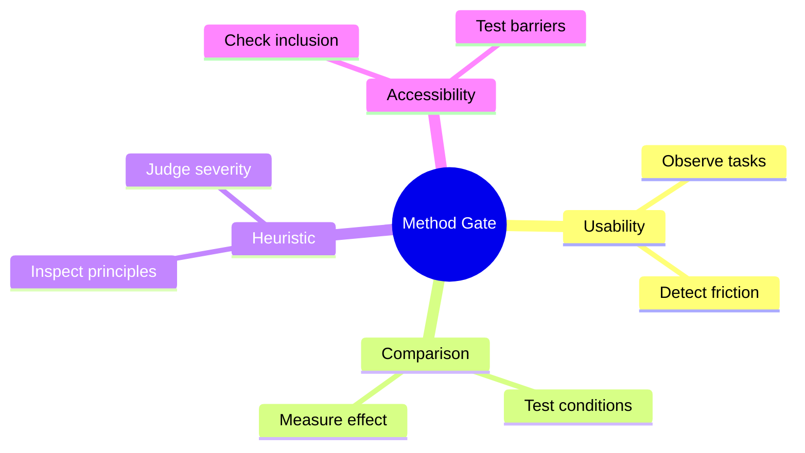
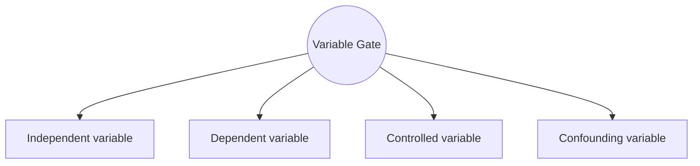
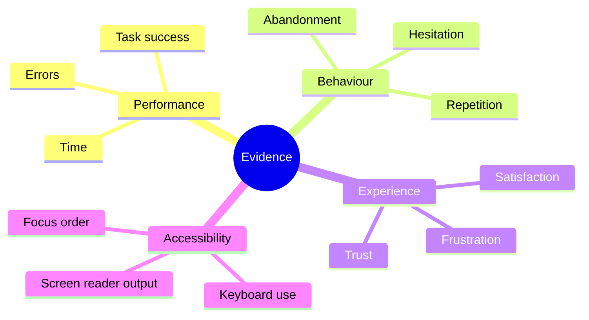
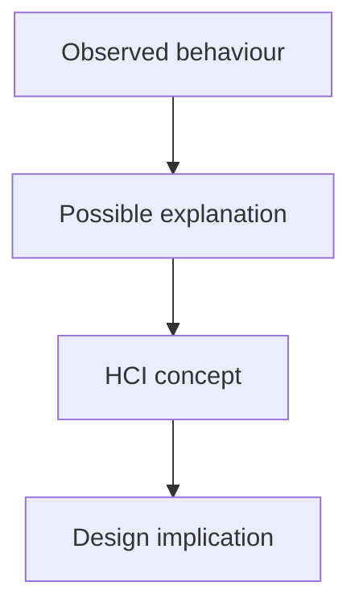
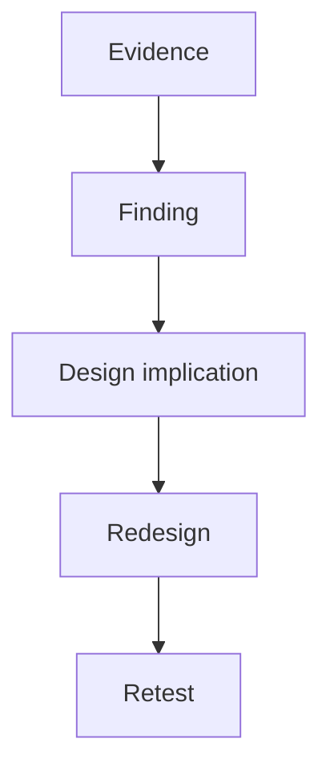
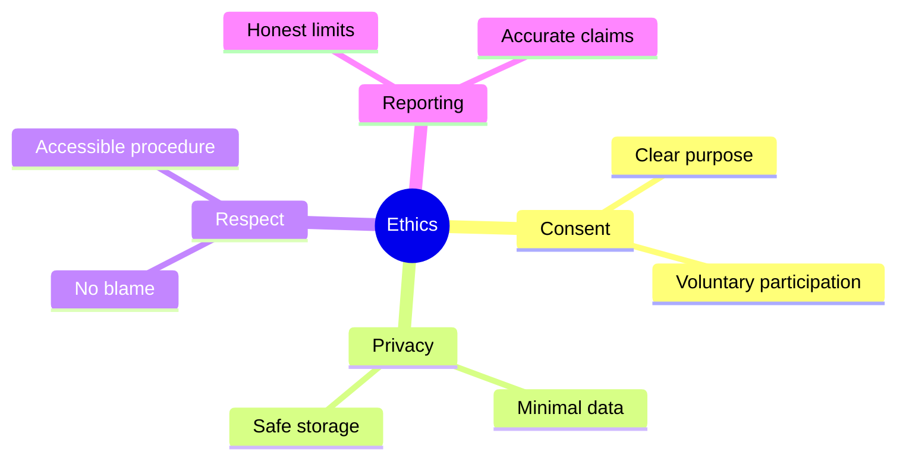

# Experiment

> [!abstract] Chamber of Evidence
> This chamber explains how Human-Computer Interaction turns uncertainty into evidence. In the Mind Library, Experiment is the route where an idea is no longer only imagined or designed. It is tested against real human behaviour.

The Experiment chamber stands between [[Theory]] and [[Design]]. Theory offers concepts such as mental models, feedback, cognitive load, and accessibility. Design turns those concepts into interfaces, systems, and experiences. Experiment is the passage that determines whether those ideas actually survive contact with users.

In HCI, experimentation is broader than the narrow image of a laboratory test. It includes usability testing, controlled comparison, heuristic evaluation, accessibility auditing, cognitive walkthroughs, and other structured forms of inquiry. What unites them is not the format but the principle: a design claim must be examined through evidence.

%%{init: {'theme':'base','themeVariables': {
  'primaryColor':'#0b1028',
  'primaryBorderColor':'#8b5cf6',
  'primaryTextColor':'#ffffff',
  'secondaryColor':'#1b1535',
  'secondaryTextColor':'#ffffff',
  'tertiaryColor':'#10271d',
  'tertiaryTextColor':'#ffffff',
  'lineColor':'#d9d9d9',
  'fontSize':'20px'
}}}%%

> [!note] Core academic principle
> An HCI experiment does not ask whether a system merely functions. It asks whether people can understand it, use it, recover from errors, and achieve goals within a real context of use.

## The research gate

Every experiment begins with a problem. That problem must be translated into a researchable form. A vague concern such as “the interface feels confusing” is not enough. HCI requires the confusion to be anchored to a user group, a task, a context, and an observable outcome.

A strong experiment therefore starts with a research question. The question must connect a design condition with a human consequence. Instead of asking whether a menu looks better, the researcher asks whether a revised menu structure reduces task completion time, improves comprehension, or lowers navigation errors for a given group of users.

%%{init: {'theme':'base','themeVariables': {
  'primaryColor':'#0b1028',
  'primaryBorderColor':'#8b5cf6',
  'primaryTextColor':'#ffffff',
  'secondaryColor':'#1b1535',
  'secondaryTextColor':'#ffffff',
  'tertiaryColor':'#10271d',
  'tertiaryTextColor':'#ffffff',
  'lineColor':'#d9d9d9',
  'fontSize':'20px'
}}}%%

This gate gives the chamber its direction. Without it, evidence becomes scattered and interpretation becomes weak.

## The method gate

Once the problem is clear, the traveller must choose the route through which evidence will be gathered. HCI does not rely on a single method because interaction itself is multidimensional. Some questions concern performance, some concern understanding, some concern accessibility, and some concern trust or long-term use.

Usability testing is often the most direct route because it observes users attempting meaningful tasks. It reveals hesitation, misinterpretation, repeated actions, and failure points. Controlled comparison becomes useful when the researcher wants to test whether one design performs better than another. Heuristic evaluation provides an expert inspection based on recognised usability principles. Accessibility evaluation investigates whether the system remains usable for diverse bodies, devices, and assistive technologies. Cognitive walkthroughs focus on whether a new user can understand what to do at each step.

%%{init: {'theme':'base','themeVariables': {
  'primaryColor':'#0b1028',
  'primaryBorderColor':'#8b5cf6',
  'primaryTextColor':'#ffffff',
  'secondaryColor':'#1b1535',
  'secondaryTextColor':'#ffffff',
  'tertiaryColor':'#10271d',
  'tertiaryTextColor':'#ffffff',
  'lineColor':'#d9d9d9',
  'fontSize':'20px'
}}}%%

> [!important] Method rule
> The method must serve the question. A study becomes stronger when the route of inquiry matches the nature of the human problem being investigated.

The most practical starting points for this gate are [Nielsen Norman Group’s guide to usability testing](https://www.nngroup.com/articles/usability-testing-101/), [their overview of UX research methods](https://www.nngroup.com/articles/which-ux-research-methods/), the [ACM SIGCHI community](https://sigchi.org/), and the [ACM CHI Conference](https://dl.acm.org/conference/chi), where empirical HCI work is regularly published.

## The variable gate

At this point, the chamber becomes more precise. Variables allow the researcher to distinguish what is being changed from what is being measured. They also reveal what must remain stable and what may distort the interpretation.

An independent variable is the condition changed by the researcher. In HCI this might be a different layout, navigation style, button size, feedback mechanism, or explanation strategy. A dependent variable is the human outcome measured by the researcher, such as time on task, task success, error rate, satisfaction, trust, or comprehension. Controlled variables are the contextual elements kept stable across the study, while confounding variables are unwanted influences that threaten the clarity of the conclusion.

%%{init: {'theme':'base','themeVariables': {
  'primaryColor':'#0b1028',
  'primaryBorderColor':'#8b5cf6',
  'primaryTextColor':'#ffffff',
  'secondaryColor':'#1b1535',
  'secondaryTextColor':'#ffffff',
  'tertiaryColor':'#10271d',
  'tertiaryTextColor':'#ffffff',
  'lineColor':'#d9d9d9',
  'fontSize':'20px'
}}}%%

This gate matters because experimental claims are only as strong as the researcher’s ability to explain what was changed, what was measured, and what else might have influenced the result.

## The evidence gate

In HCI, evidence is not just numerical output. Evidence includes the visible traces of interaction. A user who pauses, repeats an action, asks for help, abandons a task, or misunderstands a label is already producing evidence. Timing, success, and error counts add another layer. Satisfaction, frustration, trust, and perceived ease provide a further experiential layer. Accessibility evidence enters when screen readers fail, focus order breaks, contrast becomes insufficient, or keyboard navigation collapses.

%%{init: {'theme':'base','themeVariables': {
  'primaryColor':'#0b1028',
  'primaryBorderColor':'#8b5cf6',
  'primaryTextColor':'#ffffff',
  'secondaryColor':'#1b1535',
  'secondaryTextColor':'#ffffff',
  'tertiaryColor':'#10271d',
  'tertiaryTextColor':'#ffffff',
  'lineColor':'#d9d9d9',
  'fontSize':'20px'
}}}%%

The value of this gate lies in richness. A design can appear successful if only completion is measured, yet still produce high mental effort, weak understanding, or exclusion. Experiment in HCI becomes most convincing when it captures interaction from more than one angle.

The [W3C Web Accessibility Initiative](https://www.w3.org/WAI/), [WCAG 2.2](https://www.w3.org/TR/WCAG22/), and [WebAIM](https://webaim.org/) are especially important at this stage because they show how evidence can reveal whether a system is inclusive, not merely usable for a narrow ideal user.

## The interpretation gate

Evidence does not speak by itself. The researcher must interpret what the traces mean. This is where Experiment reconnects with [[Theory]]. A pause before clicking may suggest weak signifiers. Repeated errors may suggest poor feedback or a mismatch with the user’s mental model. Slow completion may reflect cognitive overload. Accessibility failures may indicate that the interface assumes a limited form of perception or action.

%%{init: {'theme':'base','themeVariables': {
  'primaryColor':'#0b1028',
  'primaryBorderColor':'#8b5cf6',
  'primaryTextColor':'#ffffff',
  'secondaryColor':'#1b1535',
  'secondaryTextColor':'#ffffff',
  'tertiaryColor':'#10271d',
  'tertiaryTextColor':'#ffffff',
  'lineColor':'#d9d9d9',
  'fontSize':'20px'
}}}%%

> [!example] Interpretation in practice
> If users repeatedly open the wrong menu while searching for admission requirements, the issue is not simply that they “made mistakes.” A stronger interpretation is that the current information structure does not match the users’ mental model of how academic information should be organised.

This is why HCI experiments must never stop at description. The real academic power of the chamber lies in explanation.

## The redesign gate

The chamber does not end with a finding. It ends with movement back into design. A useful experiment generates implications. It tells the designer what should be changed, why it should be changed, and what should be tested again.

%%{init: {'theme':'base','themeVariables': {
  'primaryColor':'#0b1028',
  'primaryBorderColor':'#8b5cf6',
  'primaryTextColor':'#ffffff',
  'secondaryColor':'#1b1535',
  'secondaryTextColor':'#ffffff',
  'tertiaryColor':'#10271d',
  'tertiaryTextColor':'#ffffff',
  'lineColor':'#d9d9d9',
  'fontSize':'20px'
}}}%%

This return loop is what makes HCI iterative. An experiment is not a final judgement but a passage within a longer cycle of improvement. In this sense, the Experiment chamber is the bridge that prevents design from becoming mere intuition.

## The ethical chamber within the chamber

Because HCI experiments involve people, they also involve responsibility. The participant is not a device to be measured but a human being to be treated with respect. Consent, privacy, accessibility of the study procedure, and honest reporting are therefore part of experimental quality, not external decoration.

%%{init: {'theme':'base','themeVariables': {
  'primaryColor':'#0b1028',
  'primaryBorderColor':'#8b5cf6',
  'primaryTextColor':'#ffffff',
  'secondaryColor':'#1b1535',
  'secondaryTextColor':'#ffffff',
  'tertiaryColor':'#10271d',
  'tertiaryTextColor':'#ffffff',
  'lineColor':'#d9d9d9',
  'fontSize':'20px'
}}}%%

The [ACM Code of Ethics](https://www.acm.org/code-of-ethics) provides a strong foundation for this dimension, while the [British Psychological Society’s human research ethics guidance](https://www.bps.org.uk/guideline/bps-code-human-research-ethics) extends the broader logic of responsible participant research.

## Chamber synthesis

Experiment is the evidence route of HCI. It begins with a problem, passes through a chosen method, gathers behavioural and experiential traces, interprets them through theory, and returns them to design as implications for change. It is therefore neither a decorative add-on nor a purely technical step. It is the mechanism through which HCI justifies its claims about human interaction.

In the wider map, this chamber remains closely connected to [[Theory]], because explanation depends on concepts, and to [[Design]], because findings must be turned into redesign. It also leads naturally toward [[Open Problems]], where persistent difficulties in accessibility, trust, inclusion, automation, and long-term use become visible as unresolved questions rather than isolated flaws.

^experiment-end