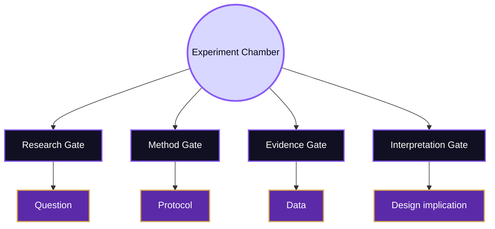
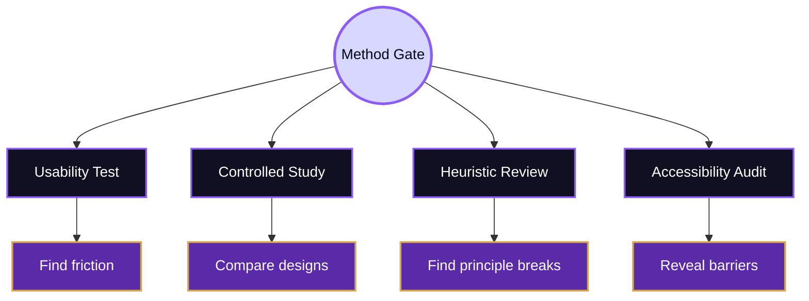
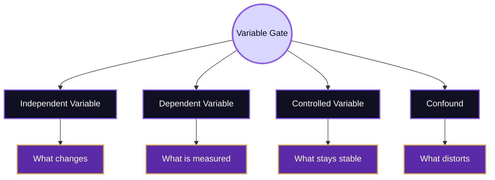
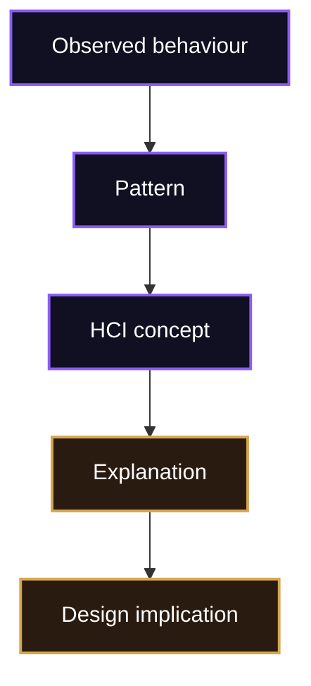

# Experiment

> [!abstract] Evidence Chamber
> Experiment is the chamber where a design claim is tested against human behaviour. In the Mind Library, experimentation means gathering evidence about understanding, effort, error, trust, accessibility, and task success.

The Experiment chamber stands between [[01_Core_Area_HCI/001_Subareas/05_Oracle_Engine/Activities/Theory]] and [[Design]]. Theory gives the concepts: mental models, feedback, cognitive load, accessibility, trust, and situated action. Design gives the prototype, screen, workflow, or system. Experiment asks whether the theory and the design survive contact with real users in a real or carefully simulated context.

## Chamber Map

## The Research Gate

Every experiment begins by translating a vague design concern into a researchable question. “The interface is confusing” is not yet a question. A stronger version names the user group, task, design condition, context, and outcome. For example: does reorganising a course page around student goals reduce navigation errors for first-year students looking for assessment requirements?

| Weak concern | Research-ready question |
|---|---|
| The menu is confusing. | Does task-based navigation reduce wrong turns compared with department-based navigation? |
| Users do not notice errors. | Does inline feedback reduce repeated form submission failures? |
| The dashboard feels heavy. | Does progressive disclosure reduce perceived effort and scanning time? |
| The AI answer seems trusted too much. | Do uncertainty cues improve calibration of trust in generated answers? |

> [!note] Research Gate Rule
> A good HCI question connects a design condition with a human consequence.

## The Method Gate

HCI does not rely on one method because interaction has multiple dimensions. Usability testing observes users doing tasks. Controlled comparison tests whether one design condition performs differently from another. Heuristic evaluation inspects a design through recognised principles. Accessibility evaluation checks whether diverse users and assistive technologies can operate the system.

The practical starting points for this gate include Nielsen Norman Group’s [Usability Testing 101](https://www.nngroup.com/articles/usability-testing-101/), their [10 usability heuristics](https://www.nngroup.com/articles/ten-usability-heuristics/), [ACM SIGCHI](https://www.acm.org/special-interest-groups/sigs/sigchi), and the [ACM CHI Conference](https://dl.acm.org/conference/chi).

## The Variable Gate

Variables clarify what changes and what is measured. The independent variable is the design condition changed by the researcher: layout, navigation, feedback, explanation style, button size, or AI uncertainty cue. The dependent variable is the human outcome: task success, time, errors, confidence, satisfaction, perceived effort, trust, or comprehension.

Good variables prevent weak interpretation. If one version of a page has different wording, layout, colour, and task instructions, the researcher cannot know which difference caused the outcome. HCI experiments are often messy because real use is messy, but the study still needs a defensible structure.

## The Evidence Gate

Evidence in HCI is broader than numbers. It includes task success, completion time, error count, hesitation, repeated actions, comments, confusion, satisfaction, confidence, accessibility failures, and recovery behaviour. A strong study often combines behavioural evidence with experiential evidence.

| Evidence type | What it reveals | Example |
|---|---|---|
| Performance | Whether the task was completed efficiently | Time on task, success rate |
| Behaviour | Where interaction breaks down | Hesitation, backtracking, repeated clicks |
| Experience | How the user interprets the system | Confidence, frustration, perceived effort |
| Accessibility | Who is excluded and why | Keyboard trap, missing label, poor focus order |
| Interpretation | Which HCI concept explains the pattern | Mental model mismatch, weak signifier, overload |

For accessibility evidence, the [W3C Web Accessibility Initiative](https://www.w3.org/WAI/), [WCAG 2.2](https://www.w3.org/TR/WCAG22/), and [WebAIM](https://webaim.org/) are important routes. A system is not usable in the full HCI sense if it only works for a narrow ideal user.

## The Interpretation Gate

Evidence does not explain itself. If users repeatedly click the wrong menu item, the researcher must ask why. The answer may be a mental model mismatch, an unclear label, weak hierarchy, hidden state, poor feedback, or a conflict between institutional vocabulary and user goals.

> [!example] Interpretation In Practice
> If users open the wrong academic menu while searching for admission requirements, the issue is not simply “user error.” A stronger interpretation is that the information structure does not match the user’s mental model of academic tasks.

## Ethics And Reporting

Because HCI experiments involve people, experimental quality includes consent, privacy, respect, accessibility of the study procedure, and honest reporting. Participants should not be treated as devices for extracting data. They are collaborators whose actions reveal how the system supports or fails them.

The [ACM Code of Ethics](https://www.acm.org/code-of-ethics) is a useful anchor for responsible computing research and practice. The ethical chamber also connects to [[../Open Problems]], because many unresolved HCI problems involve power: who is studied, who is ignored, whose data is collected, and whose difficulties are interpreted as design failures rather than personal failures.

## Synthesis

Experiment is the Mind Library’s evidence chamber. It begins with a researchable question, chooses a method, defines variables, collects behavioural and experiential evidence, interprets the pattern through theory, and returns the result to design. It prevents HCI from becoming pure opinion by requiring claims about users to be tested, explained, and revised.

Related routes: [[../Overview]], [[01_Core_Area_HCI/001_Subareas/05_Oracle_Engine/Activities/Theory]], [[Design]], [[../Connections]], [[../Important Venues]], [[../Open Problems]].

^experiment-end
