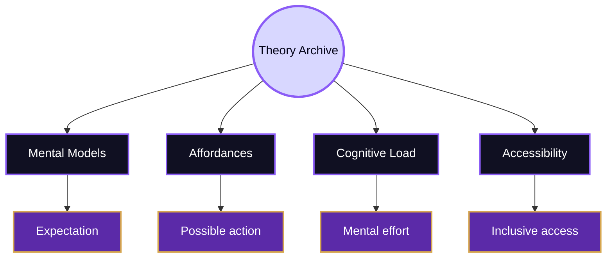
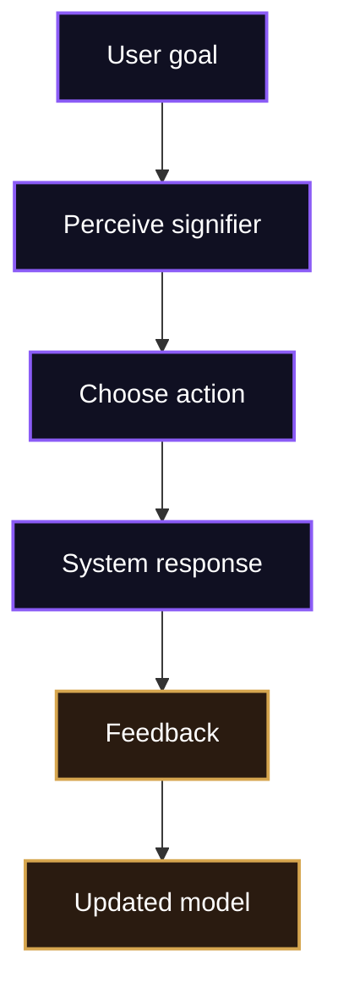
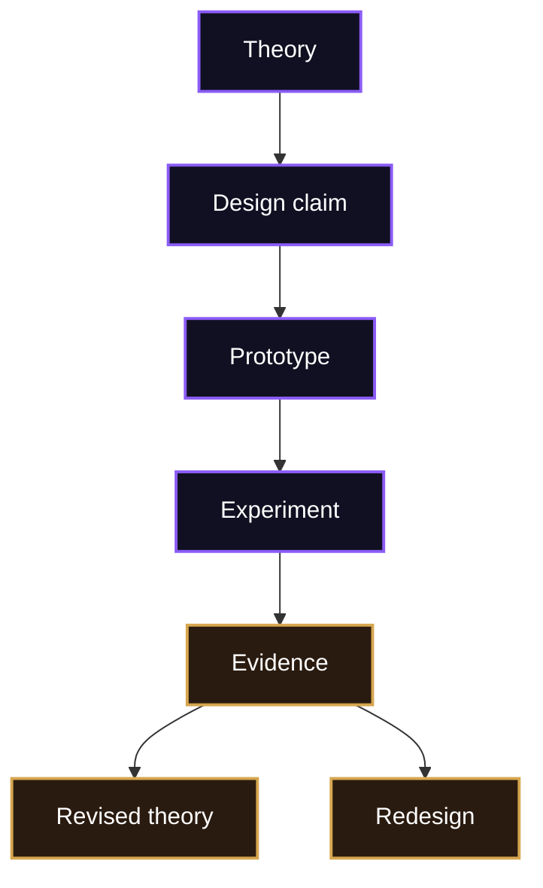

# Theory

> [!abstract] Conceptual Archive
> Theory is the archive of the Mind Library. It stores the concepts that explain why people understand, ignore, trust, misunderstand, enjoy, reject, or struggle with interactive systems.

In HCI, theory is not ornamental vocabulary. It gives researchers and designers a way to move beyond taste. Instead of saying that an interface “feels confusing,” theory asks whether the interface violates a mental model, hides an affordance, overloads memory, gives weak feedback, ignores accessibility, or asks users to trust a system without enough evidence.

Theory connects the Mind Library to [[Activities/Design]] and [[Activities/Experiment]]. Design uses concepts to shape interaction. Experiment uses concepts to interpret evidence. Without theory, findings become isolated observations. With theory, a pause, error, repeated click, or abandoned task can become an explanation.

## Archive Map

## Mental Models

A mental model is what a user believes about how a system works. It can be accurate, partial, or wrong, but it shapes action. A student using a search box may expect it to behave like a web search engine. A patient reading a health portal may expect “normal” to mean safe, even if the clinical meaning is more specific. A user deleting a file may expect a reversible trash system rather than permanent removal.

The design implication is direct: interfaces need conceptual models that users can form and repair. Labels, navigation, feedback, icons, grouping, and error messages all teach the user what the system is.

> [!note] Archive Rule
> A system has an implementation model, but users act through a mental model. HCI studies the gap between them.

## Affordances, Signifiers, And Feedback

Affordances describe possible actions. Signifiers make those actions perceivable. Feedback tells users what happened after action. These concepts are central because interactive systems are full of invisible states. A button, link, field, slider, menu, or drag handle must communicate what it allows and whether the system has responded.

Donald Norman’s work on design concepts is useful here, especially his explanation of signifiers and conceptual models in *The Design of Everyday Things*. Nielsen Norman Group’s [10 usability heuristics](https://www.nngroup.com/articles/ten-usability-heuristics/) also give practical inspection language for status visibility, consistency, error prevention, and recognition rather than recall.

## Cognitive Load

Cognitive load refers to the mental effort required to understand information and complete a task. Interfaces increase load when they force users to remember hidden information, compare too many options, decode jargon, switch attention repeatedly, or recover from unclear errors. They reduce load when they support recognition, grouping, visible state, progressive disclosure, and clear feedback.

This concept matters because usability is not only speed. A task can be completed and still be exhausting, fragile, or inaccessible. [[Activities/Experiment]] should therefore observe behaviour and measure outcomes that reveal effort: hesitation, repeated scanning, error recovery, self-correction, confidence, and perceived difficulty.

## Accessibility Theory

Accessibility is part of theory because it changes the model of the user. The user is not a single body with perfect vision, hearing, motor control, memory, reading fluency, device access, and network quality. Human users vary, and their abilities can be permanent, temporary, or situational.

The [W3C Web Accessibility Initiative](https://www.w3.org/WAI/) and [WCAG 2.2](https://www.w3.org/TR/WCAG22/) organise accessibility around content and interaction that can be perceived, operated, understood, and interpreted robustly by assistive technologies. For the Mind Library, these are not just compliance terms. They are theoretical reminders that interaction depends on the relation between body, device, environment, and system.

| Concept | What it explains | Design consequence |
|---|---|---|
| Mental model | How users believe the system works | Use clear labels, structure, and feedback |
| Affordance | What actions are possible | Make controls visibly actionable |
| Signifier | How possible action is communicated | Use labels, states, icons, and layout cues |
| Cognitive load | How much mental effort the task demands | Reduce recall, clutter, and unnecessary choice |
| Accessibility | Who can perceive and operate the system | Support keyboard, screen readers, contrast, captions |
| Trust | When users rely on system behaviour | Show limits, status, confidence, and recovery paths |

## Human-AI Theory

Human-AI interaction extends the archive because AI systems behave differently from conventional interfaces. They may be probabilistic, adaptive, opaque, and fluent even when wrong. Users need help forming calibrated trust: enough trust to use a system when useful, enough scepticism to question it when uncertain.

The [Microsoft Human-AI Interaction Guidelines](https://www.microsoft.com/en-us/research/articles/guidelines-for-human-ai-interaction-eighteen-best-practices-for-human-centered-ai-design) and Google’s [People + AI Guidebook](https://pair.withgoogle.com/guidebook-v2/) provide current design guidance for this territory. In the Map of HCI, this route connects the Mind Library to the [[../../05_Oracle_Engine/Overview|Oracle Engine]].

## Theory, Design, And Experiment

Theory should not remain abstract. If theory says that users rely on recognition rather than recall, then [[Activities/Design]] should make options visible. If theory says feedback builds system understanding, then [[Activities/Experiment]] should test whether users notice and correctly interpret feedback. If theory says accessibility is a condition of usability, then testing must include assistive technologies and diverse bodies.

## Synthesis

Theory is the Mind Library’s conceptual archive. It gives HCI disciplined explanations for interaction rather than loose opinion. Mental models explain expectation, affordances and signifiers explain possible action, feedback explains system response, cognitive load explains effort, accessibility explains diversity of use, and human-AI theory explains trust under uncertainty. The rest of the library depends on this archive: design draws from it, experiment tests it, and open problems revise it.

Related routes: [[../Overview]], [[Design]], [[Experiment]], [[../Connections]], [[../Important People]], [[../Open Problems]].

^theory-end
