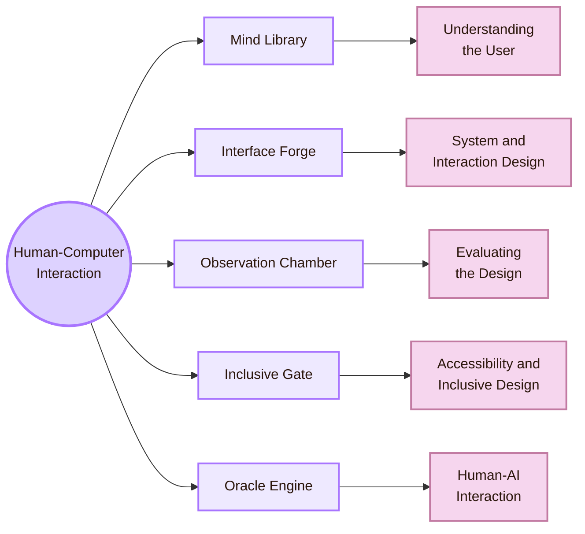

![[entrance.jpg|1000]]

> [!dialogue] Lyra Mapwell
> ![[zelda.jpg|100]]
>
> Welcome to **Cognishire**. This map is your starting point for studying Human-Computer Interaction. The room names are light fantasy labels, but the content is academic. Use the map to move between the main HCI areas, understand what each area studies, and build a clearer path toward research or professional work.

> [!abstract] Starting Point
> **Human-Computer Interaction** studies how people use, understand, design, evaluate, and live with interactive computer systems.
>
> This guide links **Computer Science**, where systems are built, with **Cognitive Science**, where perception, attention, memory, reasoning, behaviour, and learning are studied.
>
> The map below leads to five selected HCI areas. Each area has its own overview page and supporting pages for theory, design, experiment, connections, people, venues, local/global context, and open problems.

## Five Rooms of HCI

| Room | Academic area | Main question |
|---|---|---|
| **Mind Library** | Understanding the User | How do people perceive, think, remember, decide, and form mental models while using technology? |
| **Interface Forge** | System and Interaction Design | How are interfaces, interaction flows, prototypes, feedback, and visual structures designed? |
| **Observation Chamber** | Evaluating the Design | How do we test whether an interface works for real users and real tasks? |
| **Inclusive Gate** | Accessibility and Inclusive Design | Who is excluded by a system, and how can the design remove barriers? |
| **Oracle Engine** | Human-AI Interaction | How should people understand, verify, trust, control, and remain responsible when using AI systems? |

---

> [!note] Room I: The Mind Library
> **Academic area:** Understanding the User  
> This room studies users: perception, attention, memory, mental models, needs, goals, context, and cognitive load.
>
> [[01_Core_Area_HCI/001_Subareas/01_Understanding_the_User/Overview|Enter the Mind Library]]

> [!example] Room II: The Interface Forge
> **Academic area:** System and Interaction Design  
> This room studies how interactive systems are shaped: interface structure, navigation, layout, feedback, prototypes, visual hierarchy, and design decisions.
>
> [[01_Core_Area_HCI/001_Subareas/02_System_Design/Overview|Enter the Interface Forge]]

> [!info] Room III: The Observation Chamber
> **Academic area:** Evaluating the Design  
> This room studies how designs are tested with evidence: usability testing, experiments, interviews, surveys, observations, metrics, accessibility checks, and validity limits.
>
> [[01_Core_Area_HCI/001_Subareas/03_Evaluating_the_Design/Overview|Enter the Observation Chamber]]

> [!tip] Room IV: The Inclusive Gate
> **Academic area:** Accessibility and Inclusive Design  
> This room studies how systems can support people with different abilities, tools, contexts, languages, bodies, and access needs.
>
> [[01_Core_Area_HCI/001_Subareas/04_Accessibility_and_Accountability/Overview|Enter the Inclusive Gate]]

> [!question] Room V: The Oracle Engine
> **Academic area:** Human-AI Interaction  
> This room studies how people work with AI systems that predict, recommend, rank, classify, generate, explain, adapt, or act under uncertainty.
>
> [[01_Core_Area_HCI/001_Subareas/05_Human_AI_Interaction/Overview|Enter the Oracle Engine]]

## How to Use This Map

| If you want to... | Start here |
|---|---|
| Understand users before designing | [[01_Core_Area_HCI/001_Subareas/01_Understanding_the_User/Overview|Mind Library]] |
| Build clearer interfaces | [[01_Core_Area_HCI/001_Subareas/02_System_Design/Overview|Interface Forge]] |
| Test whether a design works | [[01_Core_Area_HCI/001_Subareas/03_Evaluating_the_Design/Overview|Observation Chamber]] |
| Check accessibility and inclusion | [[01_Core_Area_HCI/001_Subareas/04_Accessibility_and_Accountability/Overview|Inclusive Gate]] |
| Work critically with AI systems | [[01_Core_Area_HCI/001_Subareas/05_Human_AI_Interaction/Overview|Oracle Engine]] |

> [!important] Reading rule
> The fantasy labels are only navigation aids. For academic work, always use the real HCI area name together with the room name.
