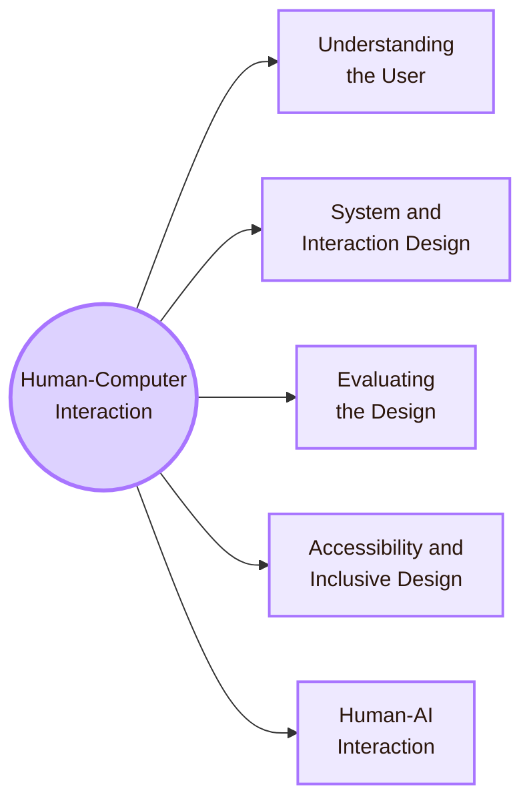

![[entrance.jpg|1000]]

# Human-Computer Interaction

**Human-Computer Interaction** studies how people use, understand, design, evaluate, and live with interactive computer systems.

HCI connects Computer Science with cognitive science, psychology, design, accessibility, social science, ethics, software engineering, and artificial intelligence.

## Main Areas

| Area | Main question |
|---|---|
| [[01_Core_Area_HCI/001_Subareas/01_Understanding_the_User/Overview|Understanding the User]] | How do people perceive, think, remember, decide, and form mental models while using technology? |
| [[01_Core_Area_HCI/001_Subareas/02_System_Design/Overview|System and Interaction Design]] | How are interfaces, interaction flows, prototypes, feedback, and visual structures designed? |
| [[01_Core_Area_HCI/001_Subareas/03_Evaluating_the_Design/Overview|Evaluating the Design]] | How do we test whether an interface works for real users and real tasks? |
| [[01_Core_Area_HCI/001_Subareas/04_Accessibility_and_Accountability/Overview|Accessibility and Inclusive Design]] | Who is excluded by a system, and how can the design remove barriers? |
| [[01_Core_Area_HCI/001_Subareas/05_Human_AI_Interaction/Overview|Human-AI Interaction]] | How should people understand, verify, trust, control, and remain responsible when using AI systems? |

## Study Order

1. Start with **Understanding the User** to learn how human perception, memory, attention, goals, and context shape interaction.
2. Move to **System and Interaction Design** to study interface structure, feedback, prototypes, visual hierarchy, and interaction flows.
3. Use **Evaluating the Design** to learn usability testing, experiments, interviews, surveys, metrics, accessibility checks, and validity limits.
4. Study **Accessibility and Inclusive Design** to understand disability, barriers, assistive technologies, standards, and inclusive practice.
5. Finish with **Human-AI Interaction** to examine trust, uncertainty, explanation, verification, control, responsibility, and AI literacy.
