![[deisgn.jpg|1000]]
# Design

> [!abstract] Form-Making Section
> Design is the part of HCI where knowledge about people becomes interaction form. It turns theory, evidence, and constraints into layouts, labels, flows, feedback, prototypes, accessibility decisions, and recoverable actions.

Design in HCI is not decoration added after engineering. It is the disciplined shaping of possible action. A design tells users what matters, what can be done, what has changed, what is risky, and how they can recover from mistakes.

A visual style can make a system memorable, but style is not enough. In HCI, a design choice is stronger when it can be connected to a user need, a theoretical concept, an accessibility requirement, or empirical evidence.

> [!quote] Section rule

## Section map

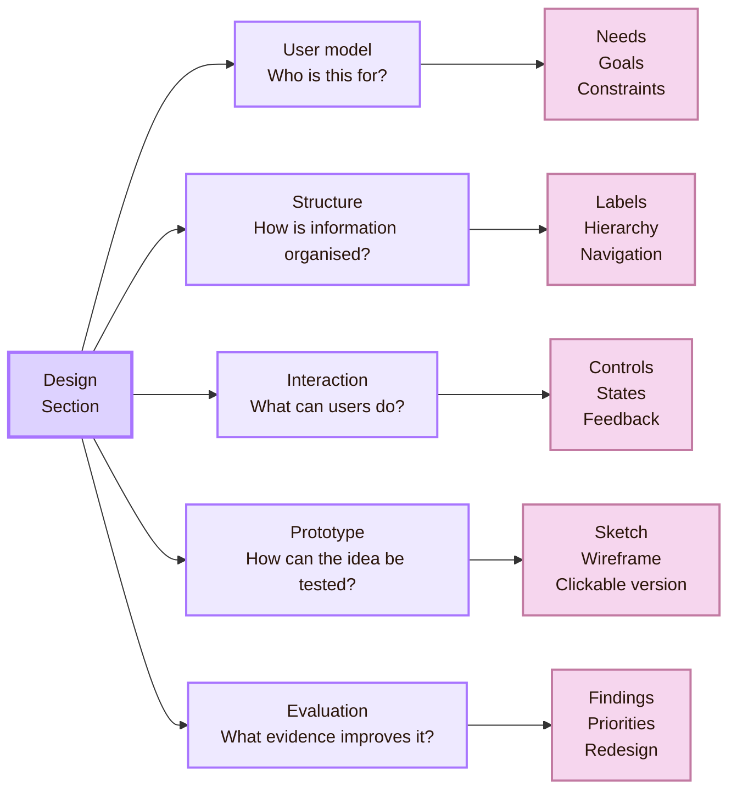

## The User Model Gate

The first design act is interpretation. A designer studies users, tasks, environments, constraints, and evidence. Then the designer decides what the interface must make easier.

This follows the logic of human-centred design. ISO 9241-210 defines human-centred design as an approach to interactive systems that focuses on users, their needs, and usability knowledge. NIST summarises the same approach as a way to make systems usable and useful by focusing on users, tasks, environments, and evaluation.

In practice, the user model asks simple but important questions.

- **Who uses the system?:** Different users have different knowledge, abilities, devices, and expectations.
- **What are they trying to do?:** The interface should support real goals, not only internal categories.
- **Where does use happen?:** Context affects attention, stress, time, lighting, mobility, and device choice.
- **What can go wrong?:** Good design supports prevention, feedback, and recovery.
- **What counts as success?:** Design decisions need measurable evaluation criteria.

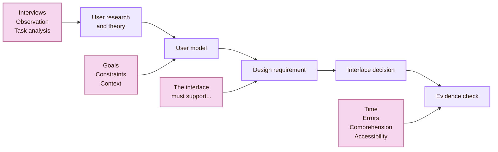

- **Users search by goal, not by department:** design decision: Reorganise navigation around user tasks (check: Fewer wrong turns and faster finding)
- **Users hesitate before clicking:** design decision: Improve labels, signifiers, and button placement (check: Less hesitation and fewer misclicks)
- **Users forget prior state:** design decision: Keep progress and selected options visible (check: Fewer repeated actions)
- **Users cannot recover from errors:** design decision: Add undo, prevention, and plain-language error messages (check: Better recovery and lower frustration)
- **Users rely on assistive technologies:** design decision: Use semantic headings, labels, and logical focus order (check: Successful keyboard and screen reader navigation)

## The Translation System Design

Design translates ideas into form. A mental model becomes navigation. Cognitive load becomes grouping and progressive disclosure. Feedback becomes visible system status. Accessibility becomes semantic structure, contrast, keyboard support, and clear error recovery.

The key academic idea is traceability. A design choice should not appear as personal taste only. It should have a reason that can be explained and tested.

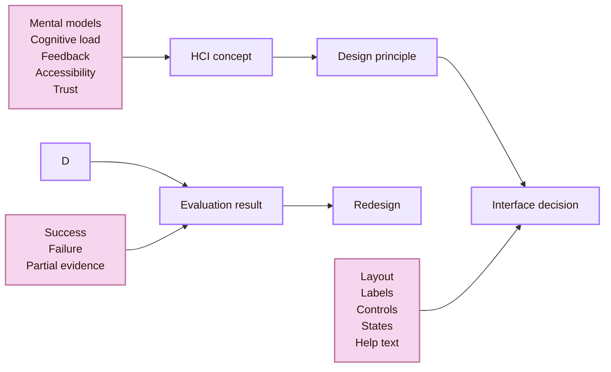

- **Mental models:** design translation: Structure the interface around user expectations (test: Do users choose the expected path?)
- **Affordances and signifiers:** design translation: Make possible actions visible and understandable (test: Do users notice and use controls correctly?)
- **Feedback:** design translation: Show the result of actions clearly (test: Do users stop repeating actions unnecessarily?)
- **Cognitive load:** design translation: Reduce memory demand and unnecessary clutter (test: Do users complete tasks with less hesitation?)
- **Accessibility:** design translation: Support diverse modes of perception and action (test: Can users operate the system with keyboard and assistive technology?)
- **Trust:** design translation: Show limits, uncertainty, and user control (test: Do users rely on the system appropriately?)

> [!important] Translation rule
> A design choice becomes academically strong when it can be traced back to a user problem, a theory, or evidence.

## The Structure Gate

The Structure Gate controls how information is grouped, named, prioritised, and navigated. Structure is cognitive architecture. It shapes what users expect, what they notice first, what they believe belongs together, and how they recover when lost.

A system can fail even when it looks visually polished. One common reason is that the structure follows the organisation's internal logic instead of the user's task logic.

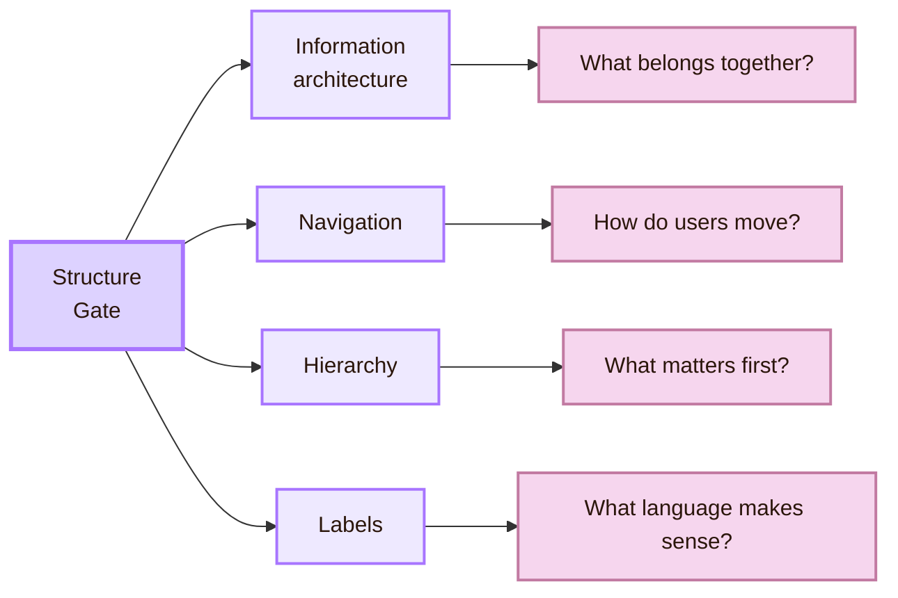

- **Categories follow internal departments:** user experience: Users open the wrong section (repair: Group around user goals)
- **Labels use institutional jargon:** user experience: Users cannot predict content (repair: Use plain, user-centred language)
- **Hierarchy is visually flat:** user experience: Users do not know what matters (repair: Strengthen headings, spacing, and priority)
- **Navigation hides current location:** user experience: Users lose orientation (repair: Show active states, breadcrumbs, or progress)
- **Related information is separated:** user experience: Users scan repeatedly (repair: Place related content and actions near each other)

Nielsen Norman Group's usability heuristics are useful here. Visibility of system status, consistency, recognition rather than recall, error prevention, and recovery from errors all depend on clear structure.

## The Interaction Gate

Interaction form includes layout, sequence, controls, wording, feedback, constraints, and state. These are not small details. They are cognitive tools. A clear form reduces interpretation work. A confusing form transfers work to the user.

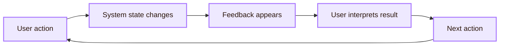

Good interaction design makes system state visible. It does not force users to remember hidden conditions or decode technical vocabulary. It also uses constraints to reduce invalid actions.

For example, a date picker can prevent impossible dates. An upload flow can show allowed file formats before failure. A form can validate input near the relevant field rather than waiting until the full form is submitted.

> [!example] Interaction reading
> If a user clicks a filter and nothing visibly changes, the problem may not be the filter logic. The problem may be the absence of clear feedback. The system acted, but the user could not interpret the result.

## The Feedback Vault

Feedback is one of the most important design materials in HCI. It tells users what happened after an action. Without feedback, the user must guess whether the system is processing, frozen, finished, saving, rejecting input, or waiting.

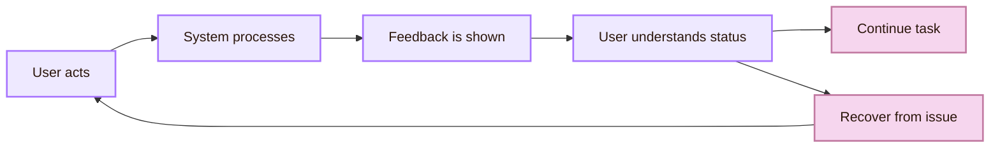

- **Confirmation:** design purpose: Shows success (example: “Your changes were saved.”)
- **Progress:** design purpose: Shows ongoing process (example: Upload percentage or progress indicator)
- **Error:** design purpose: Shows what failed and how to fix it (example: “Password must include at least 8 characters.”)
- **Empty state:** design purpose: Shows what to do next (example: “No files yet. Upload your first document.”)

Feedback should be visible, specific, and timed appropriately. It should help the user decide what to do next.

## The Prototype Gate

A prototype is not only a preview of the final product. In HCI, a prototype is a question made tangible.

A low-fidelity sketch can test information structure. A wireframe can test hierarchy. A clickable prototype can test navigation and feedback. A coded prototype can test real behaviour, keyboard access, responsive layout, screen reader structure, performance, and dynamic states.

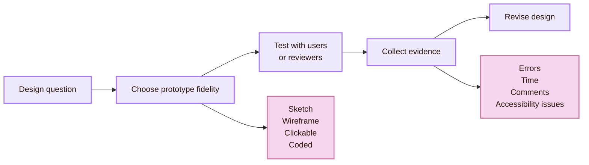

> [!important] Prototype rule
> The prototype should be only as detailed as the question requires. Extra polish can hide conceptual weakness. Too little structure can make evaluation meaningless.

- **Paper sketch:** best question: Does the structure make sense?; risk: Cannot test real interaction states
- **Wireframe:** best question: Is the layout and hierarchy understandable?; risk: May underrepresent content and feedback
- **Clickable prototype:** best question: Can users follow the flow?; risk: May fake system behaviour
- **Coded prototype:** best question: Does the interaction work with real constraints?; risk: Takes more effort to revise
- **Accessibility prototype:** best question: Can diverse users operate it?; risk: Requires assistive technology checks

## The Accessibility Gate

Accessibility belongs inside design, not after design. If accessibility is left until the end, the structure may already contain barriers that are expensive to repair.

WCAG 2.2 organises accessibility around four principles: perceivable, operable, understandable, and robust. These principles are supported by guidelines and testable success criteria. In HCI terms, accessibility is not only checklist compliance. It is about whether people can perceive, operate, understand, and recover within the system.

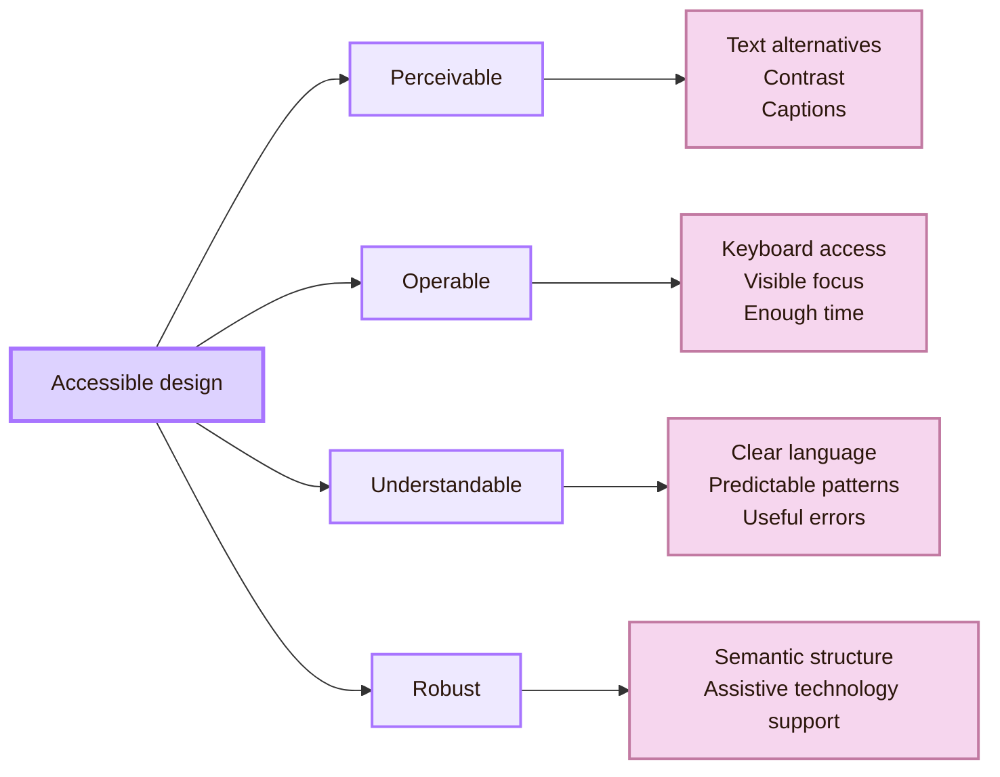

Accessibility design affects colour contrast, focus indicators, headings, form labels, captions, target sizes, error messages, keyboard order, screen reader names, motion, and cognitive clarity.

It also affects language. Plain instructions and predictable patterns help many users, including users under stress, users working in a second language, and users with cognitive disabilities.

## The Trust Gate

Trust becomes a design material when systems automate, recommend, classify, or generate. This is especially important for human-AI systems.

A human-AI system should help users understand what it can do, what it cannot do, when it may be uncertain, and how users can correct, contest, or reject its output. Microsoft’s Human-AI Interaction Guidelines group design guidance around four moments: initial interaction, regular interaction, situations where the system is wrong, and behaviour over time.

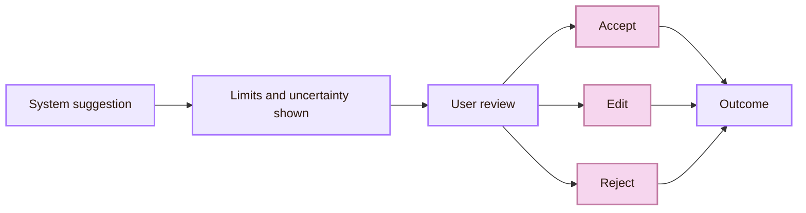

- **The system sounds confident when uncertain:** design risk: Overtrust; design response: Show uncertainty and verification paths
- **The system gives unexplained recommendations:** design risk: Suspicion or blind acceptance; design response: Explain relevant factors in plain language
- **The system automates high-stakes action:** design risk: Loss of agency; design response: Provide review, override, and escalation
- **The system personalises content invisibly:** design risk: Hidden influence; design response: Show data use and user controls

Trust should not mean blind belief. In academic HCI, a better goal is appropriate reliance: users should know when to trust, when to verify, and when to take control.

## The Aesthetic Gate

Aesthetics matter, but they must serve interaction. Visual atmosphere can guide attention, create identity, support memory, and increase motivation. It can also damage usability if it lowers contrast, hides structure, overloads the page, or makes controls unclear.

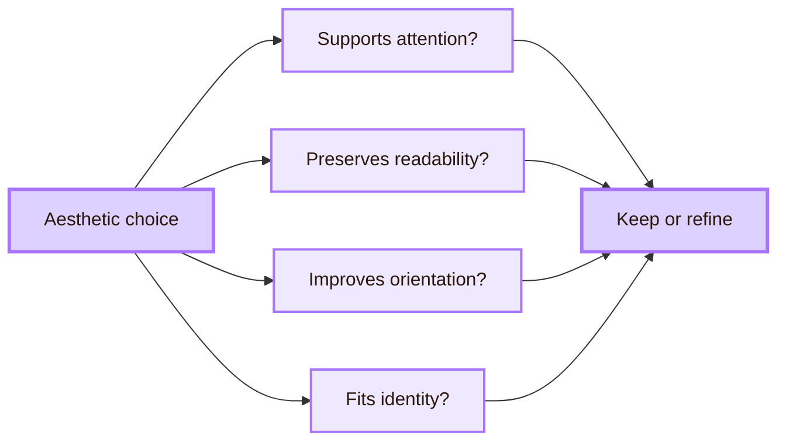

## The Design Evaluation Loop

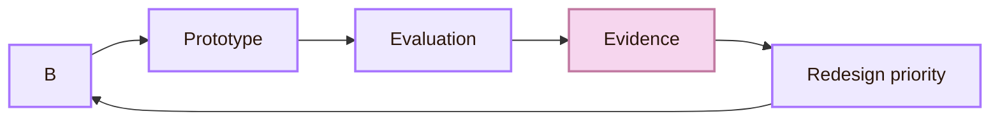

- **Can users find the right area?:** evidence to collect: Wrong turns, time, hesitation; possible redesign: Rename sections or change navigation
- **Can users understand system status?:** evidence to collect: Repeated clicks, uncertainty, comments; possible redesign: Add clearer feedback states
- **Can users recover from mistakes?:** evidence to collect: Error repetition and repair time; possible redesign: Improve error messages and undo
- **Can users use assistive technology?:** evidence to collect: Keyboard path and screen reader output; possible redesign: Repair semantics, focus order, and labels
- **Does the style support learning?:** evidence to collect: Recall, engagement, comprehension; possible redesign: Adjust visual hierarchy and density

## Fact-check notes

|---|---|---|
| Human-centred design focuses on users, their needs, usability, human factors, and evaluation. | Supported | ISO 9241-210 and NIST HCD descriptions. |
| WCAG 2.2 is organised around perceivable, operable, understandable, and robust. | Supported | W3C WCAG 2 overview. |
| Nielsen Norman Group’s 10 heuristics include visibility of system status, match with the real world, user control, consistency, error prevention, recognition rather than recall, and help with recovery. | Supported | NN/g 10 Usability Heuristics. |
| Microsoft’s Human-AI Interaction Guidelines organise guidance around initial interaction, regular interaction, errors, and behaviour over time. | Supported | Microsoft Research HAI Guidelines. |
| The Google People + AI Guidebook is a practical guide for human-centred AI products. | Supported | Google PAIR Guidebook. |
| ACM SIGCHI is a central HCI research community and CHI is its flagship conference. | Supported | ACM SIGCHI and CHI conference materials. |

## Academic anchors

| Route | Trusted source | Why it supports this page |
|---|---|---|
| Human-centred design | [ISO 9241-210:2019](https://www.iso.org/standard/77520.html) | Defines requirements and recommendations for human-centred design activities across the life cycle of interactive systems. |
| Human-centred technologies | [NIST Human-Centered Design](https://www.nist.gov/itl/iad/human-centered-technologies/human-factors-human-centered-design) | Summarises HCD as focused on users, needs, requirements, usability, human factors, evaluation, and iteration. |
| Design practice | [Stanford d.school Starter Kit](https://dschool.stanford.edu/tools/starter-kit) | Provides design abilities, methods, and mindsets for human-centred design practice. |
| Usability principles | [Nielsen Norman Group: 10 Usability Heuristics](https://www.nngroup.com/articles/ten-usability-heuristics/) | Supports visibility of system status, match with user language, user control, consistency, recognition, error prevention, and recovery. |
| Accessibility standards | [W3C WCAG 2 Overview](https://www.w3.org/WAI/standards-guidelines/wcag/) | Confirms WCAG 2.2 is organised under the principles perceivable, operable, understandable, and robust. |
| Accessibility guidance | [W3C Web Accessibility Initiative](https://www.w3.org/WAI/) | Gives practical guidance for making digital systems accessible. |
| Human-AI design | [Microsoft Human-AI Interaction Guidelines](https://www.microsoft.com/en-us/research/project/guidelines-for-human-ai-interaction/) | Provides validated design guidelines for AI systems across initial use, regular use, errors, and change over time. |
| AI design practice | [Google People + AI Guidebook](https://pair.withgoogle.com/guidebook/) | Gives practical guidance for human-centred AI products. |
| HCI research community | [ACM SIGCHI](https://sigchi.org/) | Identifies a central international HCI research community and its conference ecosystem. |

^design-end

> [!abstract]
> [[../Connections|Next: Connections]]
