![[experiment0.jpg|1000]]
# Experiment

> [!abstract] Evidence Section

The Experiment section connects [[Theory]] with [[Design]]. Theory gives the concepts: mental models, feedback, cognitive load, accessibility, trust, and situated action. Design gives the prototype, workflow, page, interface, or system. Experiment asks whether the design actually supports users under observable conditions.

A design can look convincing in a designer’s mind and still fail in use. HCI therefore does not treat appearance as proof. It asks what users actually do, where they hesitate, how they recover, what they misunderstand, and which design assumptions break when interaction begins.

> [!quote] Section rule
> An HCI experiment does not test whether the designer was clever. It tests whether the interaction supports human goals under observable conditions.

## Section map

The section works as a sequence. A vague concern becomes a research question. The research question determines the method. The method determines what evidence can be collected. Evidence is then interpreted through theory and converted into redesign.

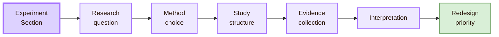

## The Research Gate

Every experiment begins by turning a vague design concern into a researchable question. “The interface is confusing” is not yet enough. A stronger question names the user group, task, design condition, context, and outcome.

For example, instead of writing “the course page is confusing,” a research-ready question would be: **Does task-based navigation reduce wrong turns for first-year students trying to find assessment requirements?** This version can be studied because it identifies a design condition, a user group, a task, and a measurable outcome.

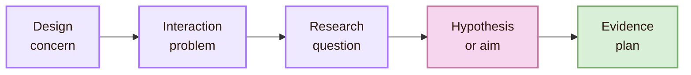

- **The menu is confusing:** Does task-based navigation reduce wrong turns compared with department-based navigation?
- **Users do not notice errors:** Does inline feedback reduce repeated form-submission failures?
- **The dashboard feels heavy:** Does progressive disclosure reduce perceived effort and scanning time?
- **The AI answer seems trusted too much:** Do uncertainty cues improve trust calibration for generated answers?

> [!note] Research Gate rule
> A good HCI question connects a design condition with a human consequence.

## The Method Gate

HCI does not rely on one universal method because interaction has several layers. Usability testing observes people doing tasks. Controlled studies compare design conditions. Heuristic evaluation inspects an interface through recognised principles. Accessibility evaluation checks whether people using different abilities, devices, and assistive technologies can operate the system.

The method should follow the question. A study about lived confusion should involve users. A study about comparative performance should compare conditions. A study about inclusion must evaluate accessibility directly.

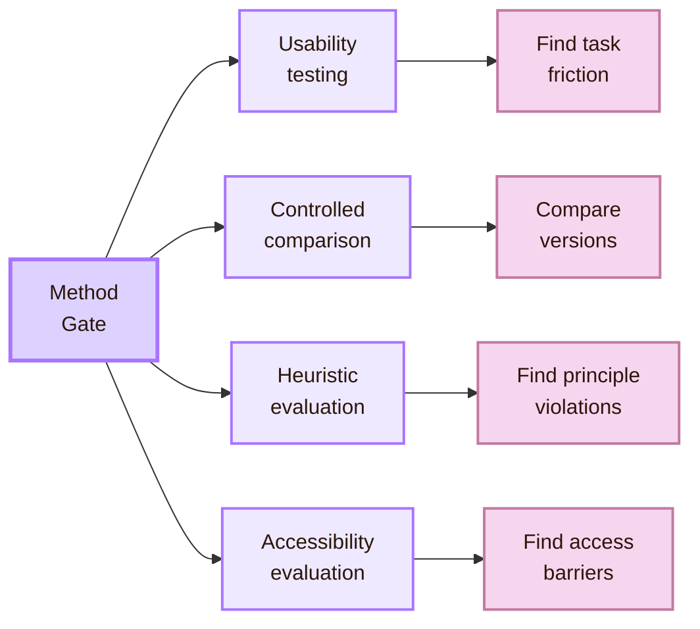

- **Usability testing:** best question: Where do users struggle during a task?; evidence produced: Errors, hesitation, task success, comments
- **Controlled comparison:** best question: Which version performs better?; evidence produced: Measured comparison between conditions
- **Heuristic evaluation:** best question: Which usability principles are violated?; evidence produced: Expert issue list and severity judgement
- **Cognitive walkthrough:** best question: Can a new user understand the next step?; evidence produced: Learnability problems and conceptual gaps
- **Accessibility evaluation:** best question: Who is excluded by the system?; evidence produced: WCAG issues, keyboard barriers, focus problems, screen-reader issues

Nielsen Norman Group defines usability testing as a method where a researcher asks a participant to perform tasks and observes behaviour. NN/g also stresses that different UX methods answer different kinds of questions, so method choice must be matched to the research goal.

## The Method Compass

The Method Compass prevents the study from becoming method-driven. The researcher should first ask what must be known, then choose the evidence route.

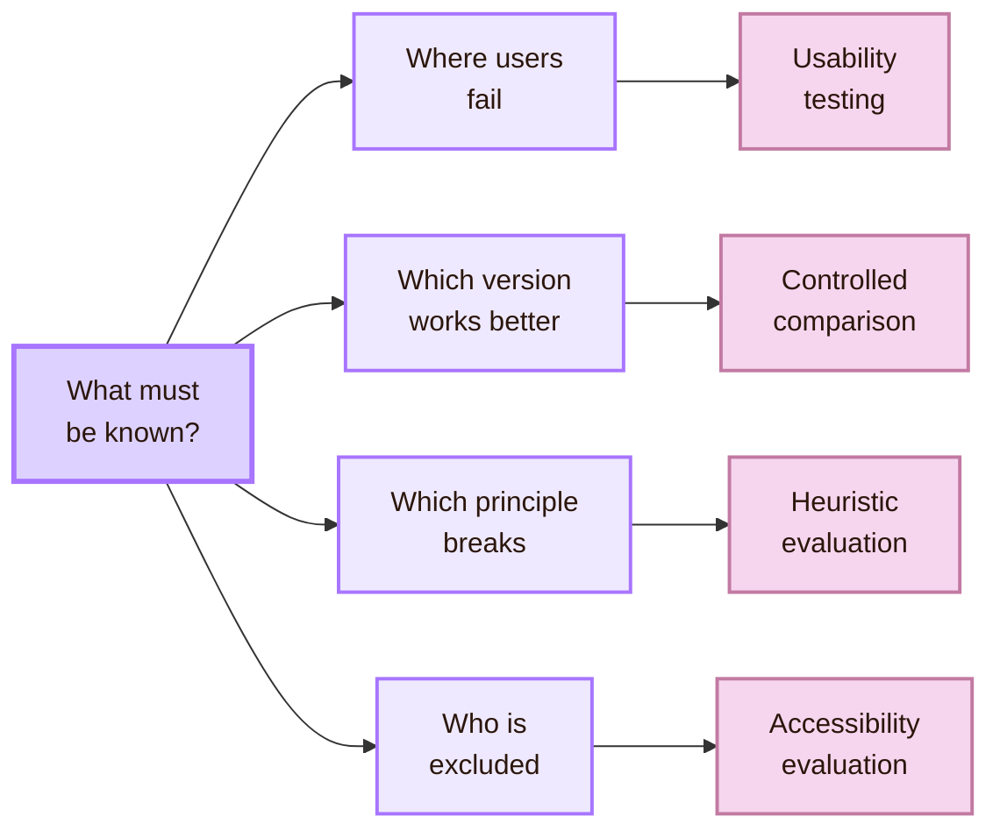

The 10 usability heuristics are especially useful for expert review. WCAG and W3C Web Accessibility Initiative materials are central for accessibility evaluation. A general usability test cannot replace an accessibility evaluation, because many barriers only appear when keyboard navigation, screen-reader behaviour, contrast, timing, captions, or semantic structure are checked directly.

## The Variable Gate

Variables clarify what changes and what is measured. The independent variable is the design condition changed by the researcher. The dependent variable is the human outcome. Controlled variables are kept stable so that comparison is fair. A confound is an uncontrolled factor that may distort the conclusion.

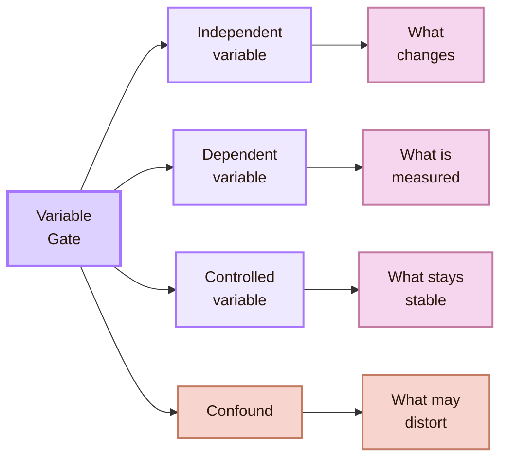

- **Independent variable:** hci example: Sidebar navigation versus top navigation (why: Defines the design difference being tested)
- **Dependent variable:** hci example: Time to find assessment requirements (why: Defines the human outcome)
- **Controlled variable:** hci example: Same task, device, instructions, and time limit (why: Keeps comparison fair)
- **Confound:** hci example: One group has more prior experience (why: May distort the conclusion)

Good variables prevent weak interpretation. If one version of a page changes wording, layout, colour, and instructions at the same time, the researcher cannot know which difference caused the result. Real HCI studies are often messy, but the study still needs a defensible structure.

## The Evidence Gate

Evidence in HCI is broader than numbers. It includes task success, completion time, error count, hesitation, repeated actions, comments, confidence, frustration, accessibility failures, and recovery behaviour. A strong study often combines performance evidence with behavioural and experiential evidence.

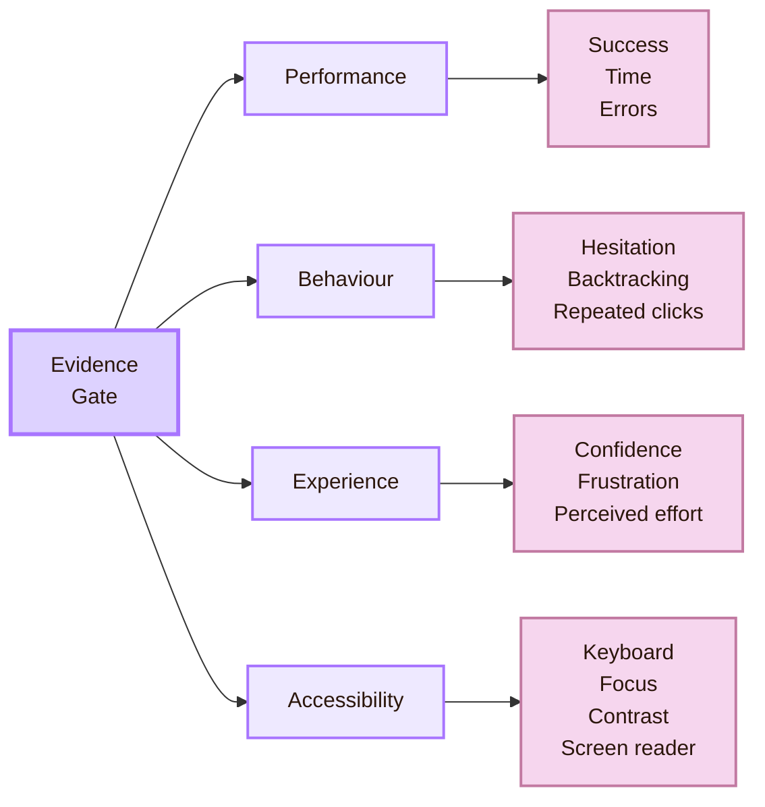

- **Performance:** what it reveals: Whether the task was completed efficiently (example: Time on task, success rate, error count)
- **Behaviour:** what it reveals: Where interaction breaks down (example: Hesitation, backtracking, repeated clicks)
- **Experience:** what it reveals: How the user interprets the system (example: Confidence, frustration, perceived effort)
- **Accessibility:** what it reveals: Who is excluded and why (example: Keyboard trap, missing label, poor focus order)
- **Interpretation:** what it reveals: Which HCI concept explains the pattern (example: Mental model mismatch, weak signifier, cognitive overload)

> [!tip] Evidence rule
> A single metric can describe an outcome, but it rarely explains an interaction. HCI becomes stronger when performance evidence is combined with observed behaviour and user meaning.

## Evidence Balance

Evidence balance is not a fixed formula. It is a planning principle. A study that only records task time may miss confusion. A study that only asks for opinions may miss behaviour. A study that ignores accessibility may produce evidence only for a narrow group of users.

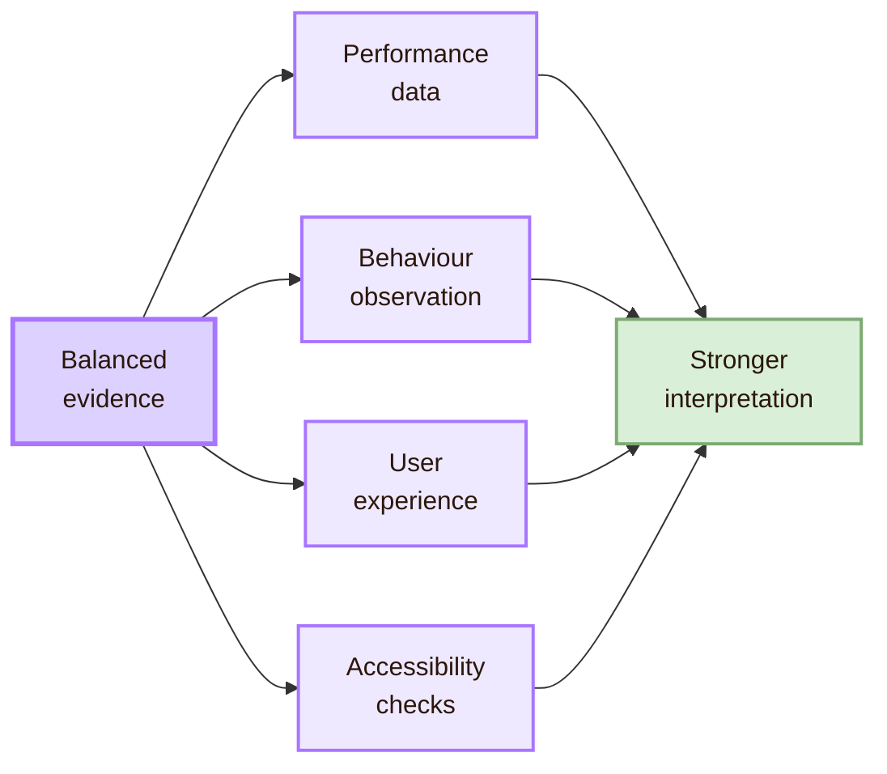

## The Data Trail

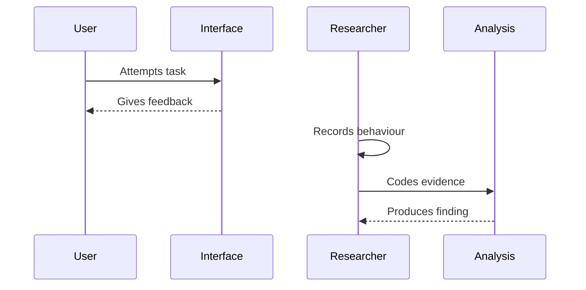

The trail also reminds the researcher that a finding is not the same as a raw observation. “The user clicked three times” is an observation. “Feedback was insufficient because the user could not tell whether the action had been accepted” is an interpretation.

## The Interpretation Gate

Evidence does not explain itself. If users repeatedly click the wrong menu item, the researcher must ask why. The cause may be a mental model mismatch, an unclear label, weak hierarchy, hidden state, poor feedback, or a conflict between institutional language and user goals.

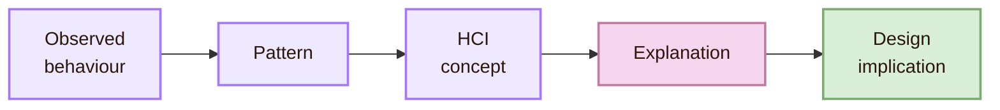

- **User pauses before clicking:** possible explanation: The signifier may be weak (implication: Make action cues stronger)
- **User repeats a failed action:** possible explanation: Feedback may be unclear (implication: Add clear confirmation or recovery)
- **User forgets previous steps:** possible explanation: Cognitive load may be too high (implication: Support recognition instead of recall)
- **User avoids AI output:** possible explanation: Trust may be poorly calibrated (implication: Explain uncertainty and limits)

> [!example] Interpretation in practice
> If users open the wrong academic menu while searching for assessment requirements, the issue is not simply “user error.” A stronger interpretation is that the information structure does not match the user’s mental model of academic tasks.

## The Severity System Design

Severity turns findings into priorities. Not every problem deserves the same redesign effort. A cosmetic issue may be noted, while a task-blocking or exclusionary issue should be treated as urgent.

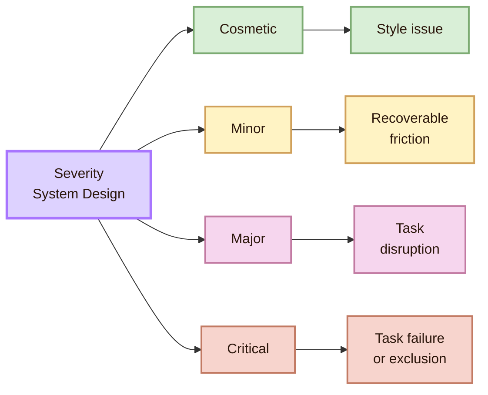

- **Cosmetic:** meaning: Does not block use (priority: Low)
- **Minor:** meaning: Causes hesitation, but recovery is easy (priority: Medium)
- **Major:** meaning: Disrupts task completion (priority: High)
- **Critical:** meaning: Blocks task completion or excludes users (priority: Immediate)

## The Accessibility Lock

Accessibility is not a decorative final check. It is part of experimental quality because an interface that excludes users gives incomplete evidence about human interaction.

WCAG organises accessibility around the principles of perceivable, operable, understandable, and robust. In HCI experimentation, these principles become practical research questions about whether the interface can actually be used across different abilities, technologies, and contexts.

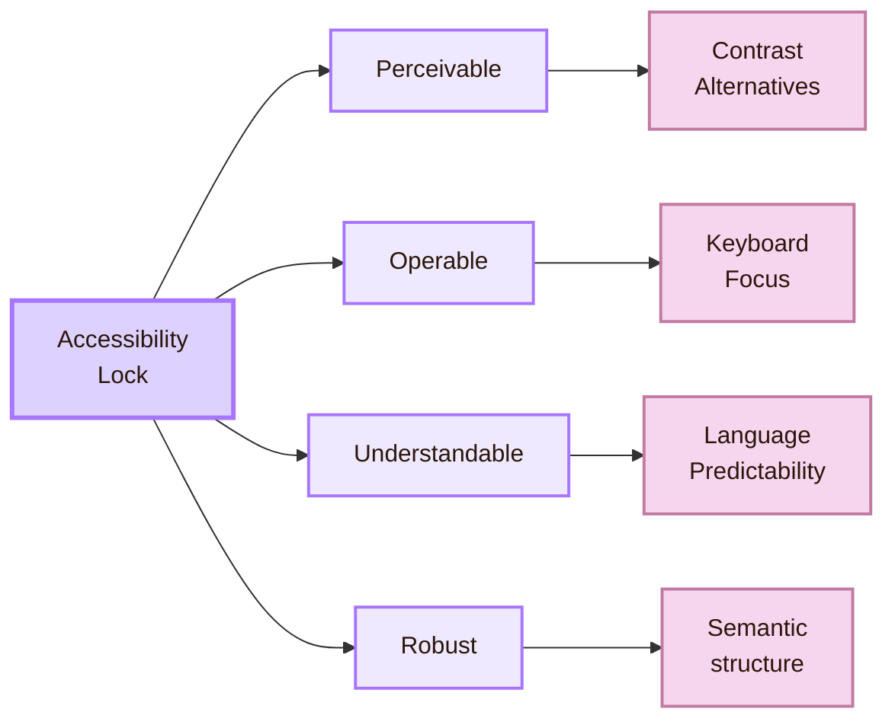

- **Perceivable:** Can users access information through available senses?
- **Operable:** Can users act through available input methods?
- **Understandable:** Can users predict and interpret the interaction?
- **Robust:** Does the system work across user agents and assistive technologies?

## Ethics and Reporting

Because HCI experiments involve people, research quality includes consent, privacy, respect, accessibility of the study procedure, and honest reporting. Participants should not be treated as devices for extracting data. They are collaborators whose actions reveal how the system supports or fails them.

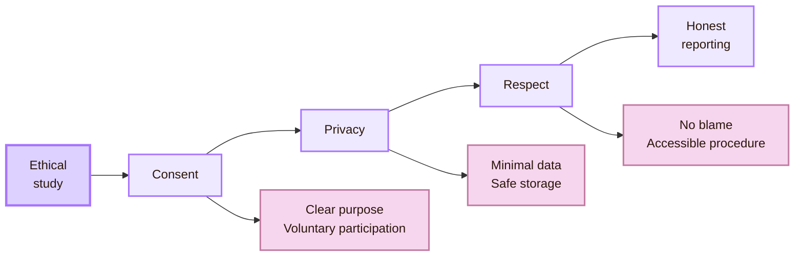

The ACM Code of Ethics is a useful anchor for responsible computing work. It includes principles such as contributing to society and human well-being, avoiding harm, being honest and trustworthy, being fair, respecting privacy, and honouring confidentiality. For HCI, these principles matter because user studies involve people, behaviour, personal data, and sometimes vulnerable contexts.

## Academic anchors

| Route | Trusted source | Why it supports this page |
|---|---|---|
| Usability testing | [NN/g: Usability Testing 101](https://www.nngroup.com/articles/usability-testing-101/) | Defines usability testing as task-based observation of participants using a design. |
| UX research methods | [NN/g: Which UX Research Methods to Use](https://www.nngroup.com/articles/which-ux-research-methods/) | Supports choosing research methods according to the question and stage of design. |
| Usability principles | [NN/g: 10 Usability Heuristics](https://www.nngroup.com/articles/ten-usability-heuristics/) | Provides expert-review principles such as visibility of system status, consistency, error prevention, and recognition rather than recall. |
| Accessibility standards | [W3C WCAG 2.2](https://www.w3.org/TR/WCAG22/) | Defines the four accessibility principles and success criteria for web accessibility. |
| Accessibility practice | [W3C Web Accessibility Initiative](https://www.w3.org/WAI/) | Provides accessibility guidance and explanatory resources. |
| Web accessibility education | [WebAIM](https://webaim.org/) | Provides practical accessibility evaluation and implementation resources. |
| HCI academic community | [ACM SIGCHI](https://sigchi.org/) | Identifies the main international HCI research community. |
| HCI academic venue | [ACM CHI Conference](https://dl.acm.org/conference/chi) | Represents a major peer-reviewed venue for HCI research. |
| Ethics | [ACM Code of Ethics](https://www.acm.org/code-of-ethics) | Grounds consent, privacy, honesty, harm reduction, fairness, and responsible reporting. |

^experiment-end
