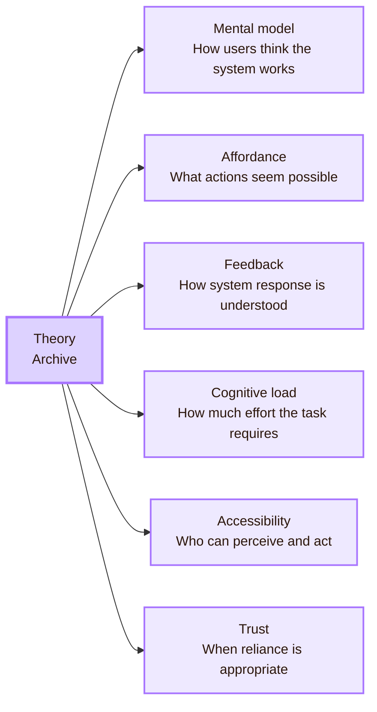
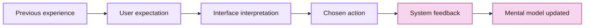
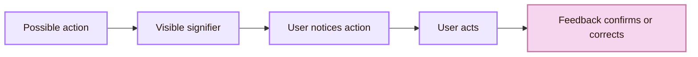
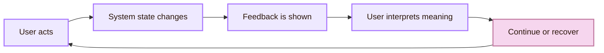
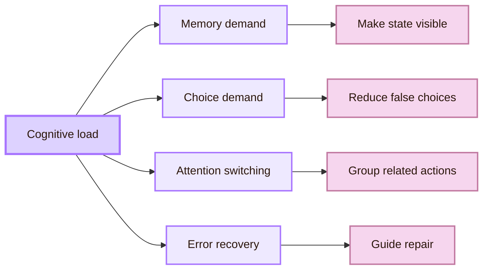
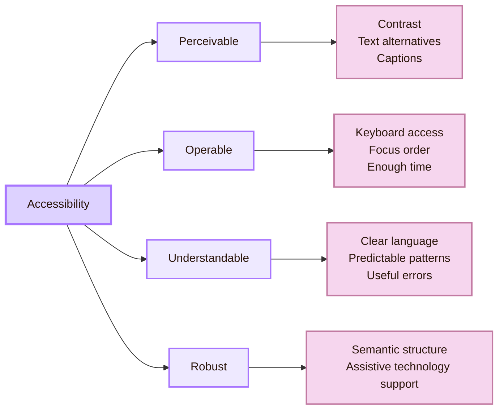
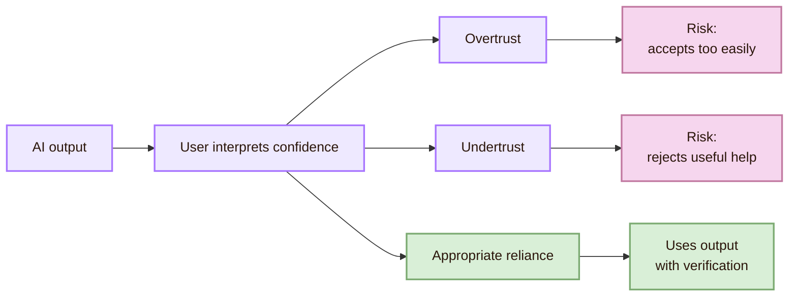
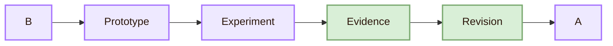

![[thoery.png|1000]]
# Theory

> [!abstract] Conceptual Archive
> Theory is the part of HCI that gives interaction an explanation. It turns hesitation, confusion, error, trust, effort, and exclusion into concepts that can guide design and evaluation.

Theory in Human-Computer Interaction is not decorative vocabulary. It is the intellectual structure that helps researchers explain why an interaction succeeds or fails. Without theory, an observer can only say that a user paused, clicked the wrong object, abandoned a task, or mistrusted a system. With theory, those behaviours can be interpreted more precisely: the user's mental model may not match the interface, an affordance may be poorly signified, feedback may be weak, cognitive load may be too high, accessibility barriers may block action, or trust may be miscalibrated.

Theory connects directly to [[Design]], because design turns concepts into interface form. It also connects to [[Experiment]], because experiments test whether those concepts explain real user behaviour.

> [!quote] Archive rule
> A theory in HCI is useful when it helps explain a real interaction and guides a better design decision.

## Archive compass

The Theory chamber is organised as a set of conceptual lenses. Each lens helps explain a different layer of interaction.

| Lens | What it explains | What it changes in design |
|---|---|---|
| Mental model | How users believe the system works | Structure, labels, navigation, conceptual clarity |
| Affordance and signifier | What actions users perceive as possible | Controls, states, cues, interaction wording |
| Feedback | How users understand system response | Confirmation, progress, errors, recovery |
| Cognitive load | How much mental effort a task requires | Grouping, simplification, recognition support |
| Accessibility | Who can perceive, understand, and operate the system | Keyboard access, contrast, semantics, alternatives |
| Trust | When users rely on system behaviour | Transparency, uncertainty, control, accountability |

## The mental model chamber

A **mental model** is the user's internal explanation of how a system works. It may be accurate, incomplete, or wrong, but it strongly shapes action. Users do not act on the system's implementation model. They act on what they believe the system is doing.

A student using a search field may expect it to behave like a web search engine. A user deleting a file may expect the action to be reversible. A patient reading a health portal may interpret “normal” as safe, even when the clinical meaning is narrower. These expectations guide behaviour before the interface has fully explained itself.

> [!important] Mental model rule
> The user's model does not need to match the code perfectly. It needs to be accurate enough to support successful action, prediction, and recovery.

| Design element | How it teaches the model |
|---|---|
| Navigation | Shows how the system is organised |
| Labels | Names objects and actions in the system |
| Icons | Suggest category or possible action |
| Feedback | Confirms what the system understood |
| Error messages | Explains the boundary between valid and invalid action |
| Empty states | Shows what the system expects next |

The academic point is not simply that users “have opinions.” The stronger point is that users build working explanations from the interface, prior experience, visible cues, and system feedback. Design should therefore make the right model easier to form.

## The affordance gate

An **affordance** is a possible action offered by an object or environment. In digital interfaces, the action is often not physically visible, so designers also need **signifiers**: visible cues that show where and how action is possible.

A button must not only allow clicking. It must appear clickable. A draggable object must not only support movement. It must signal that movement is possible. A disabled control must not only be unavailable. It should help users understand why it cannot currently be used.

| Interaction failure | Theoretical explanation | Design repair |
|---|---|---|
| User does not click a button | The signifier is weak | Strengthen contrast, label, border, or placement |
| User clicks decorative graphics | False affordance | Avoid making decoration look like a control |
| User cannot find a draggable object | The action is hidden | Add a handle, visual cue, or short instruction |
| User repeats an action | Feedback is insufficient | Show confirmation, progress, or state change |

This lens connects theory to visible interface decisions. It asks whether the user can perceive the action that the system technically supports.

## The feedback loop

Feedback tells the user what happened after an action. It is central in HCI because interactive systems often hide their internal state. Without feedback, users must guess whether the system heard them, rejected them, saved their work, loaded content, or failed silently.

> [!note] Feedback rule
> A system response is not enough. The response must be visible and interpretable.

| Feedback type | What it explains to the user | Example |
|---|---|---|
| Confirmation | The action succeeded | “Your changes were saved.” |
| Progress | The action is still happening | Upload percentage or progress bar |
| Error | The action failed and needs repair | “Password must include at least 8 characters.” |
| Empty state | The system has no content yet and suggests next action | “No files yet. Upload your first document.” |

Nielsen Norman Group's visibility of system status heuristic is a practical anchor here. The principle is that users should know what is going on within a reasonable time. In theoretical terms, feedback supports prediction, trust, recovery, and mental model repair.

## The cognitive load chamber

**Cognitive load** refers to the mental effort needed to process information and complete a task. The term comes from cognitive psychology and instructional design, but it is useful in HCI because interfaces can increase or reduce the effort needed to act.

An interface increases load when it requires users to remember hidden information, decode jargon, compare too many choices, switch attention repeatedly, or recover from unclear errors. It reduces load when it groups related information, supports recognition rather than recall, uses consistent patterns, and makes system state visible.

| Load source | Interface symptom | Possible evidence |
|---|---|---|
| Memory demand | User must remember previous steps | Backtracking, repeated checking, hesitation |
| Choice overload | Too many similar options appear at once | Long decision time, random selection, avoidance |
| Poor grouping | Related items are separated | Scanning, missed information, repeated movement |
| Jargon | Labels do not match user language | Questions, wrong paths, abandonment |
| Weak recovery | Errors do not explain repair | Repeated failure, frustration, help-seeking |

This lens gives experiments a way to study effort, not only success. A user can complete a task and still experience excessive cognitive load. Useful evidence includes hesitation, repeated scanning, task time, self-correction, confidence, and perceived difficulty.

## The accessibility chamber

Accessibility theory changes the model of the user. The user is not a single ideal body with perfect vision, hearing, motor control, working memory, reading fluency, device access, and network quality. Human ability varies permanently, temporarily, and situationally.

Accessibility is therefore not a separate technical checklist. It is a correction to the idea of the “average user.” It forces HCI to design for variation rather than for a narrow default.

| Accessibility principle | HCI interpretation | Design consequence |
|---|---|---|
| Perceivable | Information must be available through the user's senses. | Provide contrast, text alternatives, captions, and readable structure. |
| Operable | Users must be able to act through available input methods. | Support keyboard access, focus order, target size, and enough time. |
| Understandable | Users must be able to predict and interpret interaction. | Use clear language, consistent behaviour, and helpful errors. |
| Robust | The system must work across technologies. | Use semantic structure and assistive technology compatibility. |

WCAG 2.2 organises accessibility under these four principles and provides guidelines and testable success criteria. For the Mind Library, the principles are not only compliance terms. They are conceptual reminders that interaction depends on the relationship between body, device, environment, and system.

## The trust and AI chamber

Human-AI interaction extends HCI theory because AI systems often behave differently from conventional interfaces. They may be probabilistic, adaptive, opaque, fluent, and wrong in ways that sound confident. This changes how users form trust.

The theoretical goal is not to make users trust AI more. A better goal is **appropriate reliance**: users should rely on a system when reliance is justified and question it when uncertainty, risk, or error is present.

| AI interaction issue | Theoretical problem | Design implication |
|---|---|---|
| Fluent but wrong output | Users may confuse fluency with accuracy | Show uncertainty, sources, and verification paths |
| Opaque recommendation | Users may not understand why something appears | Explain relevant factors and allow correction |
| Automated decision | Users may lack meaningful control | Provide contestability, override, and escalation |
| Personalisation | Users may not know what data shaped the result | Make data use visible and adjustable |

Microsoft's Human-AI Interaction Guidelines organise design guidance around initial interaction, regular interaction, situations where the AI system is wrong, and system behaviour over time. Google’s People + AI Guidebook gives related practical guidance for human-centred AI products. In the Map of HCI, this topic connects the Mind Library to [[../../05_Human_AI_Interaction/Overview|Human-AI Interaction]] and to [[../Open Problems]].

## Theory in motion

> [!example] Theory in practice
> If theory says that users rely on recognition rather than recall, then [[Design]] should make important options visible. [[Experiment]] should then test whether users find those options faster and with fewer errors.

This is why theory is not academic decoration. It is a tool for generating design decisions and interpreting empirical results.

## Concept relation matrix

| Concept | Closest design concern | Closest experimental trace | Connected page |
|---|---|---|---|
| Mental model | Information architecture and conceptual clarity | Wrong path, hesitation, repeated search | [[Design]] |
| Affordance and signifier | Action visibility | Missed control, false click | [[Design]] |
| Feedback | System status and recovery | Repeated action, uncertainty, repair time | [[Experiment]] |
| Cognitive load | Task complexity and information density | Long time, scanning, self-correction | [[Experiment]] |
| Accessibility | Inclusive perception and operation | Keyboard failure, contrast issue, screen reader problem | [[../Local and Global]] |
| Trust | Reliance, uncertainty, and control | Overacceptance, rejection, verification behaviour | [[01_Core_Area_HCI/001_Subareas/05_Human_AI_Interaction/Open Problems]] |

## Academic anchors

| Route | Trusted source | Why it supports this page |
|---|---|---|
| HCI research community | [ACM SIGCHI](https://sigchi.org/) | Identifies the main international HCI research community and its conference ecosystem. |
| HCI literature | [ACM Digital Library](https://dl.acm.org/) | Provides the main research archive for HCI and computing literature. |
| Mental models | [NN/g: Mental Models](https://www.nngroup.com/articles/mental-models/) | Explains how users rely on internal representations of how systems work. |
| Conceptual models and signifiers | [Don Norman: The Design of Everyday Things](https://jnd.org/books/the-design-of-everyday-things-revised-and-expanded-edition/) | Anchors the distinction between system design, perceived cues, affordances, and signifiers. |
| Usability heuristics | [NN/g: 10 Usability Heuristics](https://www.nngroup.com/articles/ten-usability-heuristics/) | Supports visibility of system status, match with user language, user control, recognition, error prevention, and recovery. |
| Cognitive load | [Sweller: Cognitive Load During Problem Solving](https://onlinelibrary.wiley.com/doi/10.1207/s15516709cog1202_4) | Provides a foundational source for cognitive load theory. |
| Accessibility standards | [W3C WCAG 2.2](https://www.w3.org/TR/WCAG22/) | Defines the four accessibility principles and testable success criteria. |
| Accessibility guidance | [W3C Web Accessibility Initiative](https://www.w3.org/WAI/) | Provides practical and conceptual guidance for accessible digital systems. |
| Human-AI interaction | [Microsoft Human-AI Interaction Guidelines](https://www.microsoft.com/en-us/research/project/guidelines-for-human-ai-interaction/) | Provides design guidance for AI systems across initial use, regular use, errors, and change over time. |
| AI design practice | [Google People + AI Guidebook](https://pair.withgoogle.com/guidebook/) | Provides practical human-centred guidance for AI product design. |

## Connected chambers

This chamber connects to [[../Overview]] because it explains the conceptual purpose of the Mind Library. It connects to [[Design]] because theory becomes interface form. It connects to [[Experiment]] because theory becomes evidence interpretation. It connects to [[../Connections]] because HCI theory travels across cognition, design, computing, accessibility, ethics, and AI. It connects to [[../Important People]] because many theoretical ideas come from named scholars and research traditions. It connects to [[../Open Problems]] because new technologies continually stress and revise existing theory.

^theory-end
