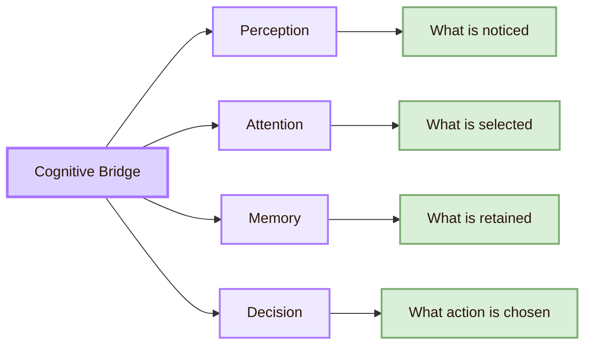
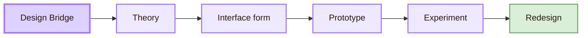
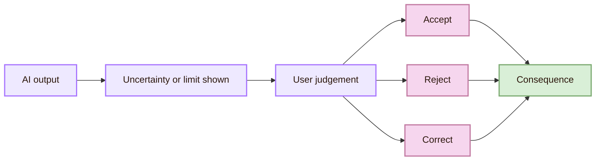
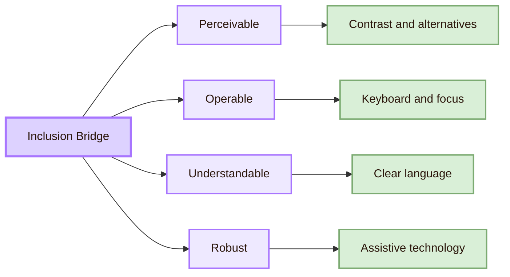
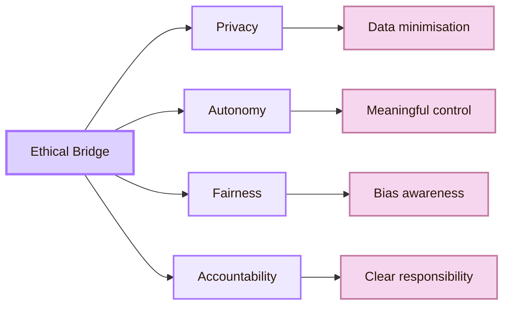
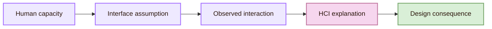

![[connections11.webp|1000]]
# Connections

Connections is therefore the bridge atlas of this area. It shows how ideas move from [[Activities/Theory]] into [[Activities/Design]], how they are tested in [[Activities/Experiment]], and how they expand into [[Important People]], [[Important Venues]], [[Local and Global]], and [[Open Problems]].

> [!quote] Bridge rule
> In HCI, an interaction problem is rarely only technical. It is also cognitive, social, material, ethical, and situated.

## Bridge compass

- **Cognition:** central question: How do users perceive, remember, decide, and learn?; hci consequence: Interfaces must respect attention, memory, and mental models.
- **Design:** central question: How should interaction become visible and usable?; hci consequence: Systems need structure, signifiers, feedback, and recovery paths.
- **Computing:** central question: How does system behaviour become interpretable?; hci consequence: Users need transparency, control, reliability, and understandable outcomes.
- **Society:** central question: Who is included, excluded, influenced, or harmed?; hci consequence: HCI must address accessibility, ethics, culture, and power.

## The cognitive bridge

The cognitive bridge connects HCI with cognitive science and psychology. Interaction depends on perception, attention, memory, learning, decision-making, emotion, and expectation. Users do not approach interfaces as blank minds. They bring previous patterns, learned conventions, goals, fears, habits, and partial knowledge.

This bridge explains why people miss visible controls, rely on familiar layouts, misunderstand icons, forget multi-step processes, or trust confident system responses. It also explains why interface design cannot be separated from cognition. A search bar, menu, error message, filter, notification, or chatbot response becomes part of the user's thinking environment.

- **Mental model:** interface translation: System structure should match user expectation.; possible experimental trace: Users choose the expected route more quickly.
- **Cognitive load:** interface translation: Interfaces should reduce unnecessary mental effort.; possible experimental trace: Users complete tasks with fewer pauses and corrections.
- **Attention:** interface translation: Important actions should be visually discoverable.; possible experimental trace: Users notice primary actions without searching.
- **Feedback:** interface translation: System response should make action outcomes clear.; possible experimental trace: Users stop repeating actions after receiving confirmation.

Useful anchors for this bridge include [NN/g on mental models](https://www.nngroup.com/articles/mental-models/), [NN/g on recognition rather than recall](https://www.nngroup.com/articles/recognition-and-recall/), and the [Interaction Design Foundation overview of HCI](https://www.interaction-design.org/literature/topics/human-computer-interaction).

## The design bridge

A design is not just a visual layer. It is a theory of the user made visible. A layout implies what matters first. A menu implies how information is grouped. A button implies what action is possible. An error message implies how the system understands failure. A prototype implies what kind of interaction is being imagined.

> [!example] Bridge example
> A student portal may fail because its information architecture follows administrative departments rather than student goals. The issue is not only layout. It is a mismatch between institutional structure and user mental model.

The design bridge is closely linked to [[Activities/Design]]. Human-centred design makes this connection explicit by treating user needs, context of use, prototyping, and evaluation as part of the design process.

Useful anchors include [ISO 9241-210](https://www.iso.org/standard/77520.html), [NIST Human-Centered Design](https://www.nist.gov/itl/iad/human-centered-technologies/human-factors-human-centered-design), [Stanford d.school tools](https://dschool.stanford.edu/tools), and [NN/g on design thinking](https://www.nngroup.com/articles/design-thinking/).

## The computing bridge

The computing bridge connects HCI with the systems that execute, store, calculate, recommend, sense, predict, and automate. Users do not directly experience code as code. They experience system behaviour: delay, error, recommendation, notification, prediction, search result, chatbot answer, interface state, and data trace.

This bridge asks how technical behaviour becomes human meaning. A database result becomes a search page. Algorithmic ranking becomes perceived relevance. A model output becomes advice. A network delay becomes uncertainty. A permission request becomes trust or suspicion.

```mermaid
flowchart LR
    A["Technical system"] --> B["System behaviour"]
    B --> C["Interface state"]
    C --> D["User interpretation"]
    D --> E["Trust or action"]
    E --> F["Design responsibility"]

    classDef system fill:#eee9ff,stroke:#a875ff,color:#2b160b,stroke-width:2px;
    classDef meaning fill:#f6d6ee,stroke:#c27aa2,color:#2b160b,stroke-width:2px;
    classDef result fill:#d9efd7,stroke:#7cab72,color:#2b160b,stroke-width:2px;

    class A,B,C system;
    class D,E meaning;
    class F result;
```

- **Delay:** user interpretation problem: Is the system broken or still working?; design responsibility: Show progress, status, and recovery.
- **Recommendation:** user interpretation problem: Why was this shown to me?; design responsibility: Explain relevance and allow control.
- **Error:** user interpretation problem: What happened and how do I fix it?; design responsibility: Provide clear, actionable recovery.
- **Automation:** user interpretation problem: Should I trust this decision?; design responsibility: Show uncertainty, limits, and override paths.

This bridge is especially important for human-AI interaction. AI systems can be probabilistic, adaptive, and opaque. Users may overtrust them, undertrust them, misunderstand their limits, or treat generated output as more certain than it is.

Useful anchors include the [Microsoft Human-AI Interaction Guidelines](https://www.microsoft.com/en-us/research/project/guidelines-for-human-ai-interaction/), the [Microsoft HAX Toolkit](https://www.microsoft.com/en-us/haxtoolkit/ai-guidelines/), and Google's [People + AI Guidebook](https://pair.withgoogle.com/guidebook/).

## The AI trust gate

AI adds a special gate to the Connections map because it changes the relation between system behaviour and user interpretation. Traditional interfaces often respond through fixed rules. AI systems may produce uncertain, generated, personalised, or context-sensitive responses.

This route connects directly to [[Open Problems]], because explainability, accountability, contestability, bias, automation dependence, and human agency remain difficult research and design problems.

## The accessibility and inclusion bridge

The accessibility bridge asks who can cross the system at all. A design that works only for a narrow imagined user is incomplete. HCI must account for differences in vision, hearing, movement, cognition, language, age, device access, network conditions, and social context.

Accessibility is not only a legal or technical checklist. It is a theory of participation. It asks whether people can perceive information, operate controls, understand interaction, and use the system with current and future technologies.

## The ethical bridge

The ethical bridge appears whenever a system shapes attention, action, access, privacy, or judgement. HCI cannot treat the user as a data point alone. The user is a person situated in a social world, and interaction design can support or weaken autonomy, dignity, safety, fairness, and trust.

- **Privacy:** hci question: Does the user understand what data is collected? (implication: Make data practices visible and controllable.)
- **Autonomy:** hci question: Can the user refuse, undo, or override? (implication: Provide meaningful exits and alternatives.)
- **Fairness:** hci question: Who receives poorer outcomes? (implication: Test across groups and contexts.)
- **Accountability:** hci question: Who is responsible when the system harms? (implication: Make responsibility and escalation paths clear.)

The [ACM Code of Ethics](https://www.acm.org/code-of-ethics) is a strong professional anchor for this bridge. For AI-mediated systems, the ethical bridge also connects to the [ACM FAccT Conference](https://facctconference.org/), where fairness, accountability, and transparency are treated as sociotechnical research problems.

## The social and organisational bridge

Many HCI problems are not located only inside the interface. They also come from organisations, institutions, work practices, social norms, and economic incentives. A hospital system, school platform, government portal, or workplace dashboard does not exist as an isolated screen. It exists inside procedures, roles, rules, deadlines, and responsibilities.

This bridge matters because an interface can be locally usable but globally frustrating. A form may be easy to complete, but the institutional process behind it may be opaque. A chatbot may answer quickly, but the organisation may provide no human escalation. HCI therefore studies micro-interactions and larger sociotechnical systems.

This route connects directly to [[Local and Global]], where the same design may function differently across cultures, languages, institutions, infrastructures, and legal environments.

## Bridge atlas

The following atlas summarises the major crossings inside the Connections section.

- **Cognitive bridge:** connected discipline: Cognitive science; what enters hci: Attention, memory, perception; what hci transforms it into: Interface structure and mental model support
- **Psychological bridge:** connected discipline: Psychology; what enters hci: Error, motivation, learning; what hci transforms it into: Task design, feedback, and evaluation
- **Design bridge:** connected discipline: Design studies; what enters hci: Form, prototyping, visual hierarchy; what hci transforms it into: Interaction flows and usability principles
- **Computing bridge:** connected discipline: Computer science; what enters hci: Algorithms, systems, data; what hci transforms it into: Interpretable and controllable user experience
- **Accessibility bridge:** connected discipline: Disability studies and standards; what enters hci: Human diversity and assistive technology; what hci transforms it into: Inclusive interaction and WCAG-based evaluation
- **Ethical bridge:** connected discipline: Applied ethics; what enters hci: Autonomy, privacy, fairness, accountability; what hci transforms it into: Responsible design and transparent systems
- **Social bridge:** connected discipline: Sociology and organisational studies; what enters hci: Institutions, roles, practices; what hci transforms it into: Sociotechnical analysis of real-world use

## Connection patterns

This section does not connect ideas randomly. Most HCI bridges follow recurring patterns.

For example, limited working memory becomes an interface assumption about how much information users can hold. That assumption appears in navigation, form design, onboarding, and error recovery. Evaluation then shows whether the assumption holds. The design consequence may be a change in layout, feedback, labels, grouping, or task flow.

## Academic anchors

| Route | Trusted source | Why it supports this page |
|---|---|---|
| HCI research community | [ACM SIGCHI](https://sigchi.org/) | Identifies SIGCHI as a major international HCI community. |
| Academic HCI venue | [ACM CHI Conference](https://dl.acm.org/conference/chi) | Shows the central conference route for HCI research. |
| HCI publications | [ACM Digital Library](https://dl.acm.org/) | Provides access to peer-reviewed HCI research. |
| Human-centred design | [ISO 9241-210:2019](https://www.iso.org/standard/77520.html) | Defines human-centred design principles and activities for interactive systems. |
| Human-centred technologies | [NIST Human-Centered Design](https://www.nist.gov/itl/iad/human-centered-technologies/human-factors-human-centered-design) | Supports the link between usability, human factors, user needs, and evaluation. |
| Usability and UX research | [Nielsen Norman Group](https://www.nngroup.com/) | Provides practical guidance on mental models, recognition, design thinking, and usability. |
| Accessibility standards | [W3C Web Accessibility Initiative](https://www.w3.org/WAI/) | Provides standards and guidance for accessible web interaction. |
| Accessibility guidelines | [WCAG 2.2](https://www.w3.org/TR/WCAG22/) | Supports the four accessibility principles used in the inclusion bridge. |
| Human-AI interaction | [Microsoft Human-AI Interaction Guidelines](https://www.microsoft.com/en-us/research/project/guidelines-for-human-ai-interaction/) | Supports guidance on AI system behaviour across initial use, regular use, errors, and change over time. |
| AI design practice | [Google People + AI Guidebook](https://pair.withgoogle.com/guidebook/) | Provides practical guidance for human-centred AI products. |
| Computing ethics | [ACM Code of Ethics](https://www.acm.org/code-of-ethics) | Supports the ethical bridge through public good, harm reduction, privacy, honesty, and responsibility. |
| Fairness and accountability | [ACM FAccT](https://facctconference.org/) | Connects AI and computing systems to fairness, accountability, transparency, and sociotechnical analysis. |

> [!abstract]
> [[Open Problems|Next: Open Problems]]
