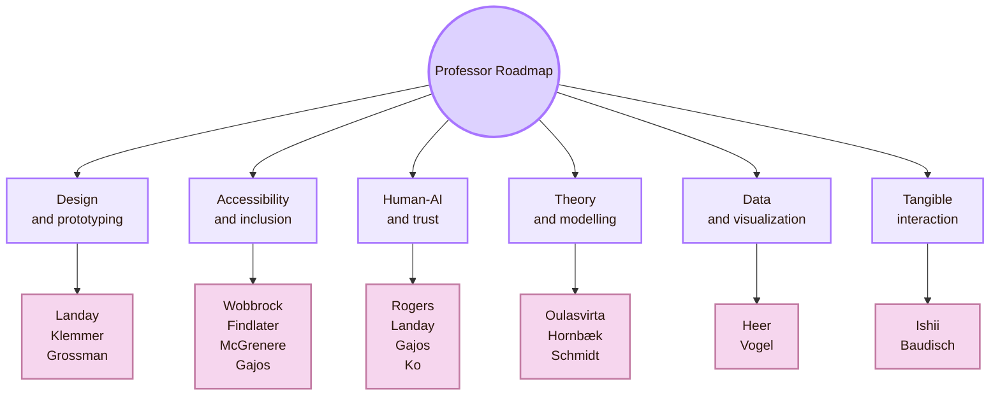
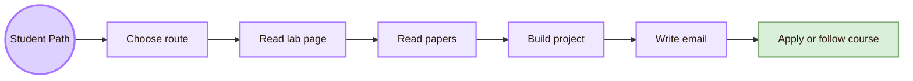
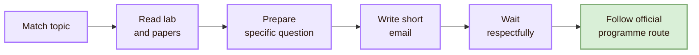

![[problems1.png|1000]]
# Important People

> [!abstract] Professor Roadmap
> This page is a practical roadmap. It helps a student find current HCI professors, labs, and university routes. It is not a historical hall of fame.

The goal of this chamber is orientation. If the Mind Library explains HCI concepts, this page shows where those concepts are taught, researched, and supervised. Each professor is treated as a route into a topic. The route includes an institution, a research focus, a public contact path, and a realistic way to study near that work.

## Roadmap compass

| Route | Best if you like | Study first |
|---|---|---|
| Design and prototyping | Interfaces, prototypes, design tools, mobile products | HCI design methods, sketching, prototyping, usability testing |
| Accessibility and inclusion | Disability, assistive technology, inclusive design | WCAG, assistive technologies, accessible computing, user studies |
| Human-AI and trust | AI systems, explanations, uncertainty, human judgement | Human-AI interaction, explainability, trust calibration, AI evaluation |
| Theory and modelling | Human performance, cognitive models, computational design | Mental models, cognitive load, computational interaction, empirical methods |
| Data and visualization | Data tools, dashboards, visual analytics | Data visualization, interaction techniques, human-centred data analysis |
| Tangible interaction | Physical computing, fabrication, shape-changing interfaces | Tangible interaction, prototyping, TEI/UIST/CHI papers |

## How to read this roadmap

A professor is more than a name. A professor has a lab, a topic area, publications, students, courses, and programme routes. Together, these show how a student can move from curiosity to academic preparation.

A weak email says: “I am interested in HCI. Can I work with you?”

A stronger email says: “I read your work on accessible interaction / computational HCI / human-AI trust. I am interested in X, and I am preparing by studying Y. Is there a paper, course, or programme route you would recommend for a student at my level?”

## Route I: Design and prototyping

This route is for students who want to make interaction visible: prototypes, design tools, interface techniques, mobile interfaces, and human-centred AI products.

### James Landay

| Field | Details |
|---|---|
| University | Stanford University |
| Current role | Professor of Computer Science; Denning Director of Stanford HAI, as listed by Stanford HAI |
| Public contact route | Use the Stanford profile contact route or Stanford HAI profile. Verify current contact details before writing. |
| Research focus | HCI, user interface design tools, mobile and ubiquitous computing, behaviour change, cross-cultural interface design, human-centred AI |
| Why follow this route | Useful for students who want to study HCI design, design tools, and human-centred AI in a research university context. |
| How to study near this route | Study Stanford-style HCI design courses, read work on design tools and behaviour-change technologies, then follow Stanford HAI work on human-centred AI. |
| Before emailing | Prepare a precise topic such as “human-centred AI design”, “mobile HCI”, or “interface design tools”. Mention one paper, course, or project route. |
| Official pages | [Stanford profile](https://profiles.stanford.edu/james-landay), [Stanford HAI profile](https://hai.stanford.edu/people/james-landay) |

### Scott Klemmer

| Field | Details |
|---|---|
| University | University of California San Diego |
| Current role | Professor of Cognitive Science |
| Public contact route | srk [at] ucsd.edu, listed on the UCSD profile |
| Research focus | HCI and design, example-based design tools, creativity, programming, learning, online social learning |
| Why follow this route | Useful for students who want to connect HCI, design education, prototyping, and creative tools. |
| How to study near this route | Start with interaction design and prototyping methods. Then examine how design tools support creative work and learning. |
| Before emailing | Show a specific interest in design research or HCI education. A small prototype or project idea helps. |
| Official pages | [UCSD profile](https://cogsci.ucsd.edu/people/faculty/scott-klemmer.html), [personal/lab page](https://d.ucsd.edu/srk/) |

### Tovi Grossman

| Field | Details |
|---|---|
| University | University of Toronto |
| Current role | Professor in the Department of Computer Science; Chief Scientist at AXL, as listed on his personal page |
| Public contact route | tovi [at] dgp.toronto.edu, listed on his personal page |
| Research focus | Intelligent user interfaces, input techniques, mixed reality, human-robot interaction, technology-assisted learning, computing education |
| Why follow this route | Useful for students who like concrete interface systems, input methods, design tools, and emerging interaction techniques. |
| How to study near this route | Study UI software, input techniques, mixed reality interaction, and research papers from CHI and UIST. |
| Before emailing | Mention a concrete interest such as input techniques, intelligent user interfaces, creativity tools, or mixed reality systems. |
| Official pages | [University of Toronto research profile](https://discover.research.utoronto.ca/4643-tovi-grossman), [personal page](https://www.tovigrossman.com/) |

## Route II: Accessibility and inclusion

This route is for students who care about disability, assistive technology, inclusive design, accessible computing, and systems that adapt to human diversity.

### Jacob O. Wobbrock

| Field | Details |
|---|---|
| University | University of Washington |
| Current role | Professor of HCI in the Information School; adjunct in the Paul G. Allen School of Computer Science & Engineering |
| Public contact route | wobbrock [at] uw.edu, listed on the UW profile |
| Research focus | Accessible computing, input and interaction techniques, human performance measurement, HCI research methods, mobile HCI |
| Why follow this route | Useful for students who want rigorous accessibility research and evidence-based HCI methods. |
| How to study near this route | Study ability-based design, accessible input, CHI papers, ASSETS papers, UW CREATE, and the DUB group. |
| Before emailing | Identify a concrete accessibility problem. Avoid writing only that you “like UX”. |
| Official pages | [UW profile](https://ischool.uw.edu/people/faculty/profile/wobbrock), [CREATE profile](https://create.uw.edu/people-directors-wobbrock/) |

### Leah Findlater

| Field | Details |
|---|---|
| University | University of Washington |
| Current role | Professor in Human Centered Design & Engineering; Associate Director at CREATE; Director of the Inclusive Design Lab |
| Public contact route | leahkf [at] uw.edu, listed on the UW HCDE and CREATE pages |
| Research focus | Accessible technologies, inclusive design, adaptive systems, mobile and wearable accessibility, human-centred machine learning |
| Why follow this route | Useful for students who want to study technologies that adapt to different bodies, senses, abilities, and contexts. |
| How to study near this route | Study accessibility, inclusive design, mobile/wearable HCI, assistive technology evaluation, and human-centred AI for accessibility. |
| Before emailing | Read one recent paper or lab project from the Inclusive Design Lab or CREATE. |
| Official pages | [UW HCDE profile](https://www.hcde.washington.edu/findlater), [CREATE profile](https://create.uw.edu/people-directors-findlater/) |

### Joanna McGrenere

| Field | Details |
|---|---|
| University | University of British Columbia |
| Current role | Co-Head and Professor, Department of Computer Science |
| Public contact route | joanna [at] cs.ubc.ca, listed on the UBC profile |
| Research focus | HCI, personalized user interfaces, universal usability, interactive technologies for older users and people with cognitive disorders, CSCW, mixed-methods evaluation |
| Why follow this route | Useful for students interested in personalization, universal usability, older adults, accessibility, and collaborative systems. |
| How to study near this route | Study personalized UI, adaptive and adaptable interfaces, universal usability, assistive technology, and qualitative plus quantitative evaluation. |
| Before emailing | State whether your interest is personalization, accessibility, older users, cognitive accessibility, or collaborative systems. |
| Official pages | [UBC Computer Science profile](https://www.cs.ubc.ca/people/joanna-mcgrenere), [personal page](https://www.cs.ubc.ca/~joanna/) |

### Krzysztof Z. Gajos

| Field | Details |
|---|---|
| University | Harvard University |
| Current role | Yahn W. Bernier and N. Elizabeth McCaw Professor of Computer Science at Harvard SEAS |
| Public contact route | kgajos [at] seas.harvard.edu, listed on his personal page |
| Research focus | Intelligent interactive systems, behavioural research at scale, design for equity and social justice, accessibility, creativity support tools, social computing |
| Why follow this route | Useful for students who want to connect adaptive interfaces, accessibility, intelligent systems, and human-centred AI methods. |
| How to study near this route | Study personalized UI, accessibility, human-AI interaction, LabintheWild-style behavioural studies, and intelligent interactive systems. |
| Before emailing | Check the “Join Our Group” page first. His page currently states that he does not expect to recruit new PhD students for Fall 2027. |
| Official pages | [personal page](https://kgajos.seas.harvard.edu/), [Intelligent Interactive Systems Group](https://iis.seas.harvard.edu/) |

### Amy J. Ko

| Field | Details |
|---|---|
| University | University of Washington |
| Current role | Professor and Associate Dean for Academics, Information School |
| Public contact route | ajko [at] uw.edu, listed on the UW profile |
| Research focus | Equitable and liberatory computing education, HCI, software engineering, accessibility, learning sciences |
| Why follow this route | Useful if your HCI interests connect to education, equity, programming tools, learning, and inclusive participation. |
| How to study near this route | Read her lab page, computing education papers, and writing on equity in computing. |
| Before emailing | Her official UW profile currently states she is not recruiting doctoral students for 2026-27. Treat this as a learning route unless the page changes. |
| Official pages | [UW profile](https://ischool.uw.edu/people/faculty/profile/ajko), [personal page](https://faculty.washington.edu/ajko/) |

## Route III: Theory, modelling, and computational interaction

This route is for students who like the theoretical side of HCI: cognitive models, human performance, interaction theory, computational design, and formal ways to study people using systems.

### Antti Oulasvirta

| Field | Details |
|---|---|
| University | Aalto University |
| Current role | Professor, ERC grantee |
| Public contact route | antti.oulasvirta [at] aalto.fi, listed on the Aalto profile |
| Research focus | HCI, user interfaces, human factors, human performance, interactive AI, computational design, computational modelling, cognitive modelling |
| Why follow this route | Useful for students who want HCI to be mathematically, computationally, and experimentally grounded. |
| How to study near this route | Study computational interaction, cognitive modelling, optimisation, human performance, and interactive AI. |
| Before emailing | Prepare technically. Be clear whether your interest is theory, modelling, computational design, or interactive AI. |
| Official pages | [Aalto people profile](https://www.aalto.fi/en/people/antti-oulasvirta), [Aalto HCI group page](https://www.aalto.fi/en/department-of-information-and-communications-engineering/human-computer-interaction) |

### Kasper Hornbæk

| Field | Details |
|---|---|
| University | University of Copenhagen |
| Current role | Professor in the Human-Centred Computing section |
| Public contact route | kash [at] di.ku.dk, listed on the University of Copenhagen HCI page |
| Research focus | HCI theory, interaction, human-centred computing, empirical HCI |
| Why follow this route | Useful for students who want to ask what interaction means and how HCI should define its core concepts. |
| How to study near this route | Read HCI theory papers, empirical HCI methods, and work from the University of Copenhagen HCI group. |
| Before emailing | Mention a theoretical question or methodological interest. Avoid writing only about a product idea. |
| Official pages | [University of Copenhagen HCI group](https://di.ku.dk/english/research/groups/hci/), [Kasper Hornbæk profile](https://di.ku.dk/english/research/groups/hci/?pure=en/persons/141851) |

### Albrecht Schmidt

| Field | Details |
|---|---|
| University | LMU Munich |
| Current role | Professor, Chair for Human-Centered Ubiquitous Media |
| Public contact route | Use the LMU profile contact route. Verify the full institutional email format before sending. |
| Research focus | Human-centred ubiquitous media, novel user interfaces, intelligent interactive systems, ubiquitous computing |
| Why follow this route | Useful for students interested in ubiquitous computing, future interfaces, and interaction beyond standard desktop or mobile screens. |
| How to study near this route | Study ubiquitous computing, HCI evaluation, intelligent interfaces, tangible interaction, and novel interaction techniques. |
| Before emailing | Check the LMU Media Informatics group, current courses, and student opportunities first. |
| Official page | [LMU profile](https://www.medien.ifi.lmu.de/team/albrecht.schmidt/) |

## Route IV: Data, visualization, and interaction tools

This route is for students interested in how people understand data through visual systems, analytics tools, interaction techniques, and human-in-the-loop workflows.

### Jeffrey Heer

| Field | Details |
|---|---|
| University | University of Washington |
| Current role | Jerre D. Noe Professor in Computer Science & Engineering |
| Public contact route | jheer [at] cs.washington.edu, listed on the UW profile |
| Research focus | Data visualization, data science, HCI, interactive data tools |
| Why follow this route | Useful for students who want to build tools that help people understand, communicate, and analyse data. |
| How to study near this route | Learn visualization grammar, data interaction, visual analytics, D3, Vega-Lite, and human-centred data tools. |
| Before emailing | Build a small visualization project and connect it to one system, paper, or lab theme. |
| Official pages | [UW faculty profile](https://www.cs.washington.edu/people/faculty/jeffrey-heer/), [personal page](https://homes.cs.washington.edu/~jheer/) |

### Daniel Vogel

| Field | Details |
|---|---|
| University | University of Waterloo |
| Current role | Professor, Cheriton School of Computer Science |
| Public contact route | dvogel [at] uwaterloo.ca, listed on the Waterloo profile |
| Research focus | HCI, interaction techniques, virtual and augmented reality, pointing, learning, manipulation, tangibles, mid-air gestures, whole-body input, large displays |
| Why follow this route | Useful for students who want to study input devices, large displays, gesture, and embodied interaction. |
| How to study near this route | Study interaction techniques, input devices, pointing, gestures, large-display HCI, and mixed reality systems. |
| Before emailing | Mention a concrete input or interaction technique interest. |
| Official pages | [Waterloo CS profile](https://cs.uwaterloo.ca/contacts/daniel-vogel), [Waterloo HCI profile](https://uwaterloo.ca/human-computer-interaction/contacts/daniel-vogel) |

## Route V: Tangible, physical, and post-screen interaction

This route is for students who want to move beyond screens into tangible interfaces, fabrication, shape-changing interfaces, embodied interaction, and physical-digital systems.

### Hiroshi Ishii

| Field | Details |
|---|---|
| University | Massachusetts Institute of Technology, MIT Media Lab |
| Current role | Jerome B. Wiesner Professor of Media Arts and Sciences; Associate Director of MIT Media Lab; Director of Tangible Media Group |
| Public contact route | Use the Tangible Media Group or MIT Media Lab contact routes. A direct email was not clearly listed on the checked official profile. |
| Research focus | Tangible user interfaces, Tangible Bits, Radical Atoms, shape-changing interfaces, physical-digital interaction |
| Why follow this route | Useful for students who want to understand tangible interaction and post-GUI visions of HCI. |
| How to study near this route | Study Tangible Bits, Radical Atoms, TEI papers, shape-changing interfaces, and Tangible Media projects. |
| Before emailing | Prepare a portfolio-style idea or prototype related to tangible media. |
| Official pages | [Tangible Media Group profile](https://tangible.media.mit.edu/person/hiroshi-ishii/), [Tangible Media Group](https://tangible.media.mit.edu/) |

### Patrick Baudisch

| Field | Details |
|---|---|
| University | Hasso Plattner Institute, University of Potsdam context |
| Current role | Professor and Head of Human Computer Interaction group |
| Public contact route | patrick.baudisch [at] hpi.de, listed on the HPI research group page |
| Research focus | Interaction devices and systems, haptics, physical virtual reality, fabrication technologies, 3D printing, laser cutting |
| Why follow this route | Useful for students interested in fabrication, physical computing, devices, and post-screen interaction. |
| How to study near this route | Study HPI HCI projects, fabrication papers, TEI/UIST/CHI work, haptics, and physical prototyping. |
| Before emailing | Prepare a technical prototype idea or fabrication-related research question. |
| Official pages | [HPI HCI group](https://hpi.de/en/research/research-groups/human-computer-interaction/), [HPI contact page](https://hpi.de/en/baudisch/contact.html) |

## Route VI: Human-centred AI, interaction design, and society

This route connects HCI to AI systems, human judgement, behaviour change, education, social responsibility, and human-centred design at institutional scale.

### Yvonne Rogers

| Field | Details |
|---|---|
| University | University College London, UCL Interaction Centre |
| Current role | Professor and Director of UCLIC, as listed on the UCLIC academics page |
| Public contact route | y.rogers [at] ucl.ac.uk, listed on the UCLIC academics page |
| Research focus | HCI, human-centred computing, design, artificial intelligence, information systems, cognitive and computational psychology |
| Why follow this route | Useful for students who want a broad interdisciplinary route into HCI, interaction design, human-centred AI, and human-data interaction. |
| How to study near this route | Study UCLIC programmes, interaction design textbooks, human-centred AI, human-data interaction, and interdisciplinary HCI projects. |
| Before emailing | Check UCLIC programmes and current supervision routes. Write around one research theme, not general interest. |
| Official pages | [UCL profile route](https://profiles.ucl.ac.uk/33314-yvonne-rogers), [UCLIC academics page](https://www.ucl.ac.uk/uclic/people/academics) |

## Study path map

The roadmap becomes useful only when it produces an action plan. A student should not try to contact everyone. The better approach is to select a route, study the field, build a small project, then contact a professor only when the connection is specific.

| Student interest | Good route to start |
|---|---|
| I like design, prototyping, and apps | Landay, Klemmer, Grossman |
| I like accessibility and disability inclusion | Wobbrock, Findlater, McGrenere, Gajos |
| I like AI and human judgement | Rogers, Landay, Gajos, Ko |
| I like theory and cognitive modelling | Oulasvirta, Hornbæk, Schmidt |
| I like data visualization | Heer |
| I like input devices and large displays | Vogel |
| I like tangible and physical interfaces | Ishii, Baudisch |

## Contact protocol

A professor email should be short, respectful, and specific. The point is not to ask them to teach you HCI from zero. The point is to show that you have already started.

| Email part | What to include |
|---|---|
| Subject | Short and specific: “Prospective student interested in accessible HCI” |
| Opening | Who you are and what you study |
| Research fit | One sentence connecting your interest to their work |
| Evidence | One paper, project, course, or lab page you actually read |
| Ask | A precise question about study route, programme fit, or reading path |
| Close | Thanks and your portfolio/GitHub link if relevant |

## Sample email structure

> [!example] Example message
> Dear Professor [Name],  
> I am a first-year student interested in HCI, especially [specific topic]. I read your work/page on [specific project or paper], and I am trying to understand how to prepare for research in this area. I am currently building a small project on [project], where I am testing [method or idea].  
>  
> Would you recommend a specific paper, course, or lab route for a student who wants to study this topic seriously?  
>  
> Best regards,  
> [Name]

## What to check before contacting

| Check | Why it matters |
|---|---|
| Recruitment status | A professor may not be taking students this year. |
| Department fit | The same topic may live in CS, information science, design, psychology, or engineering. |
| Recent papers | Recent papers show the current direction of the lab. |
| Method fit | Some labs expect coding, statistics, design research, fabrication, or qualitative methods. |
| Programme route | Many professors cannot supervise you unless you apply through the correct university programme. |

## Academic anchors

| Route | Official source |
|---|---|
| Stanford HCI and HAI | [James Landay Stanford profile](https://profiles.stanford.edu/james-landay), [Stanford HAI profile](https://hai.stanford.edu/people/james-landay) |
| UCSD design route | [Scott Klemmer UCSD profile](https://cogsci.ucsd.edu/people/faculty/scott-klemmer.html) |
| University of Toronto interaction systems | [Tovi Grossman personal page](https://www.tovigrossman.com/) |
| UW accessibility and HCI | [Jacob Wobbrock UW profile](https://ischool.uw.edu/people/faculty/profile/wobbrock), [UW CREATE](https://create.uw.edu/) |
| UW inclusive design | [Leah Findlater UW HCDE profile](https://www.hcde.washington.edu/findlater), [CREATE profile](https://create.uw.edu/people-directors-findlater/) |
| UBC personalized and inclusive HCI | [Joanna McGrenere UBC profile](https://www.cs.ubc.ca/people/joanna-mcgrenere) |
| Harvard intelligent interactive systems | [Krzysztof Gajos personal page](https://kgajos.seas.harvard.edu/) |
| UW computing education and HCI | [Amy Ko UW profile](https://ischool.uw.edu/people/faculty/profile/ajko) |
| Aalto computational HCI | [Antti Oulasvirta Aalto profile](https://www.aalto.fi/en/people/antti-oulasvirta) |
| Copenhagen HCI theory | [University of Copenhagen HCI group](https://di.ku.dk/english/research/groups/hci/) |
| LMU ubiquitous media | [Albrecht Schmidt LMU profile](https://www.medien.ifi.lmu.de/team/albrecht.schmidt/) |
| UW data visualization | [Jeffrey Heer UW profile](https://www.cs.washington.edu/people/faculty/jeffrey-heer/) |
| Waterloo interaction techniques | [Daniel Vogel Waterloo profile](https://cs.uwaterloo.ca/contacts/daniel-vogel) |
| MIT tangible media | [Hiroshi Ishii Tangible Media profile](https://tangible.media.mit.edu/person/hiroshi-ishii/) |
| HPI physical interaction | [Patrick Baudisch HPI group](https://hpi.de/en/research/research-groups/human-computer-interaction/) |
| UCL interaction centre | [UCLIC academics page](https://www.ucl.ac.uk/uclic/people/academics) |

^important-people-end
