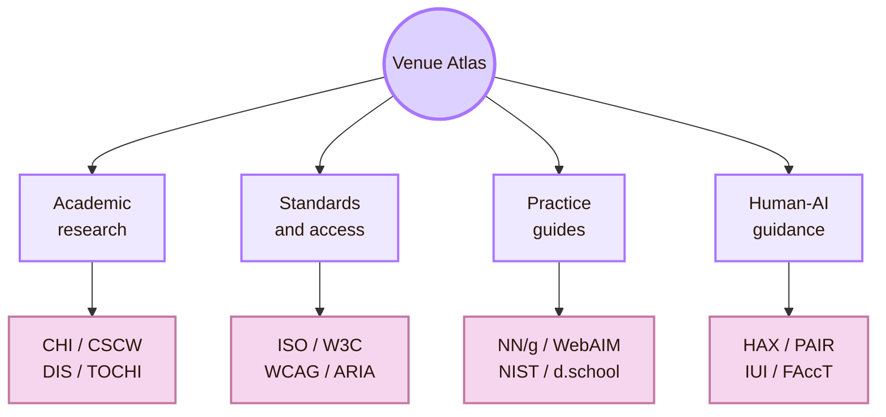
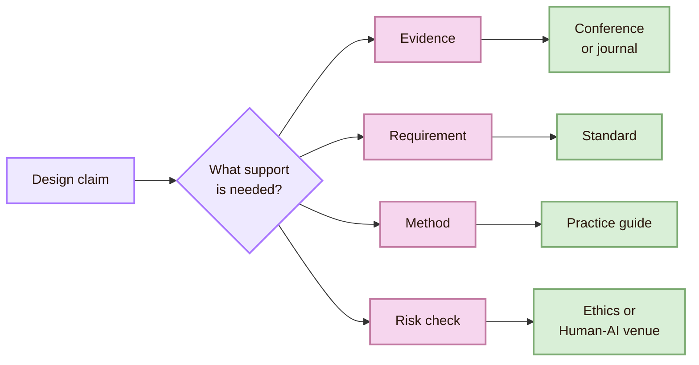
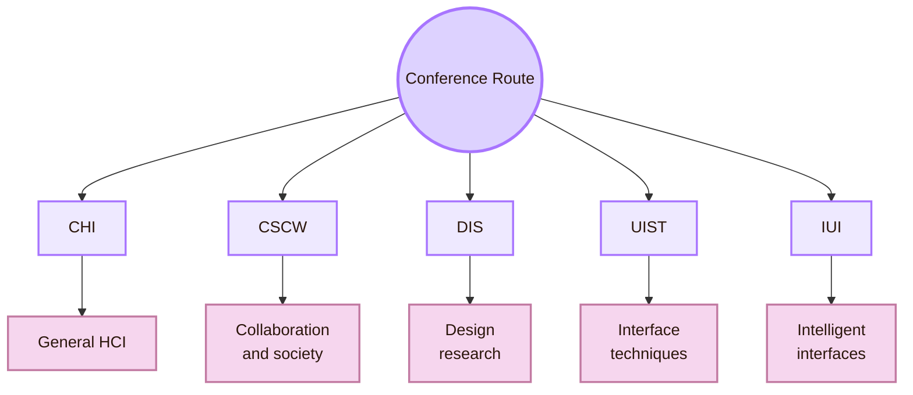
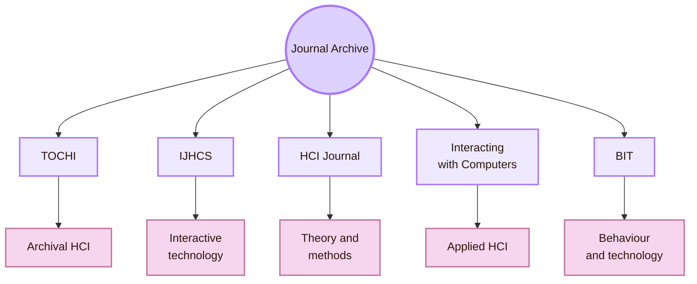
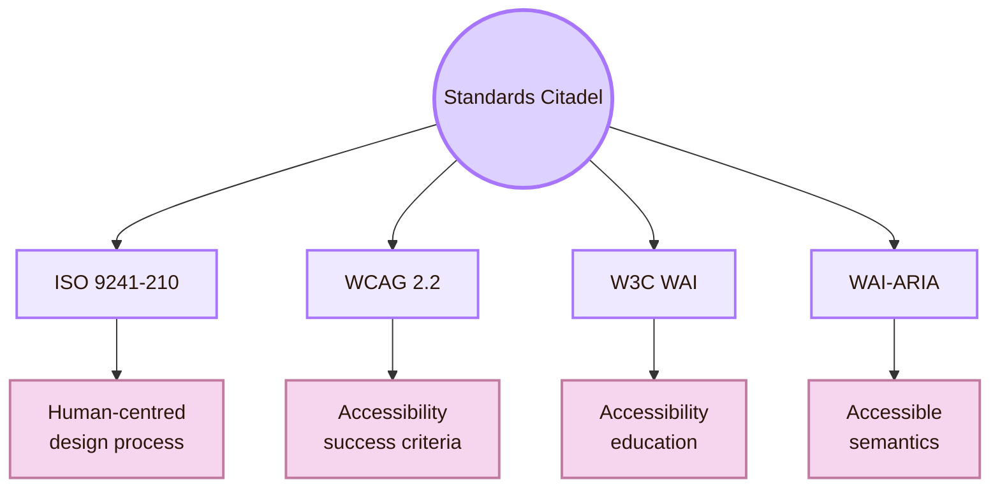
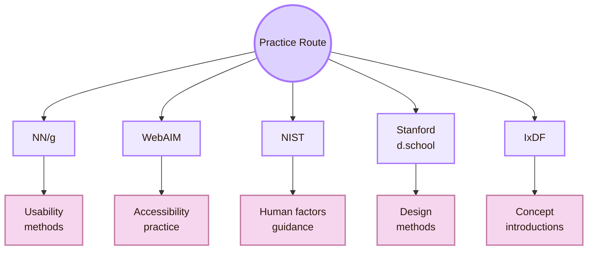
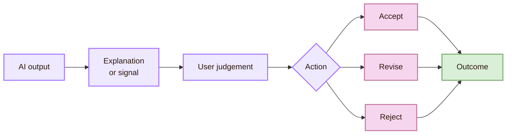
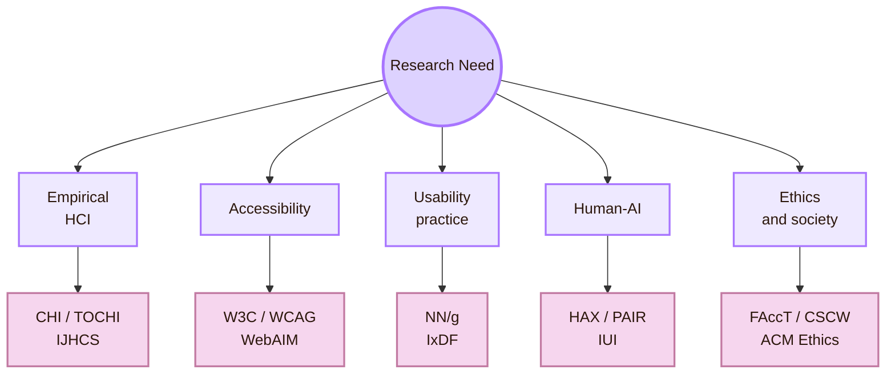
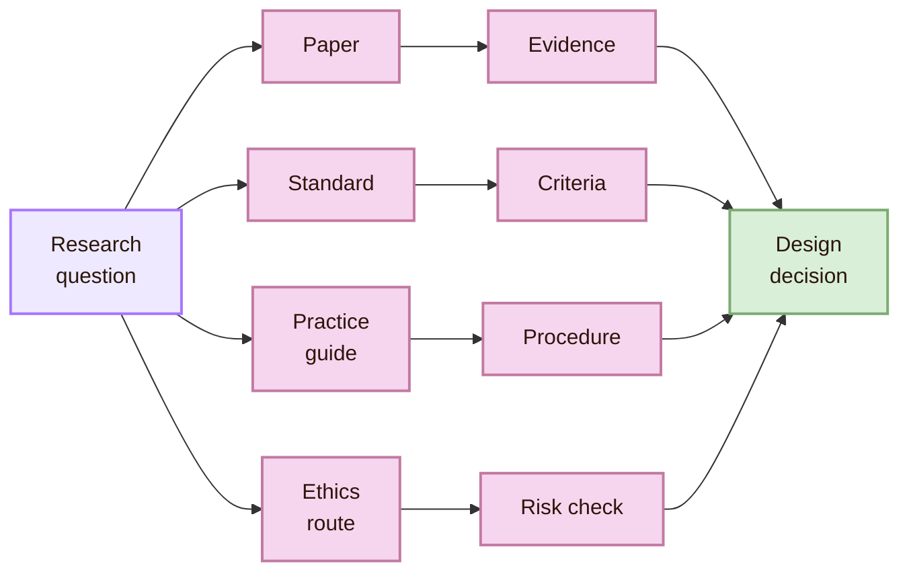
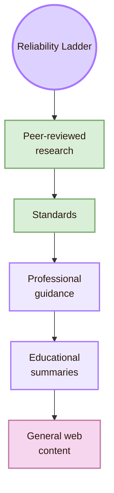

# Important Venues

> [!abstract] Academic Atlas
> This chamber maps the main places where Human-Computer Interaction knowledge is produced, reviewed, standardised, questioned, and translated into practice. In the Mind Library, venues are more than citation sources. They show what different communities accept as evidence, method, design knowledge, accessibility guidance, and responsible interaction.

HCI knowledge does not live in one textbook. It moves through conferences, journals, standards bodies, accessibility organisations, professional research groups, and human-AI laboratories. Each venue gives a different kind of authority.

A conference often shows current research problems. A journal usually gives more detailed and stable arguments. A standard defines requirements or criteria. A practice guide translates research into methods that a student can apply. A human-AI resource helps designers reason about uncertainty, automation, trust, and accountability.

This page helps a student decide where to search and how to use each source. It connects directly to [[01_Core_Area_HCI/001_Subareas/01_Understanding_the_User/Activities/Theory]], [[01_Core_Area_HCI/001_Subareas/01_Understanding_the_User/Activities/Design]], and [[01_Core_Area_HCI/001_Subareas/01_Understanding_the_User/Activities/Experiment]].

> [!quote] Atlas rule
> A venue is a research culture. It shows what kind of question, evidence, method, and contribution a community takes seriously.

## Atlas map

The venue atlas is divided into four practical territories: academic research, standards and accessibility, professional practice, and human-AI guidance.

| Atlas territory | Best used for | What it contributes to the Mind Library |
|---|---|---|
| Academic research | Peer-reviewed studies, theories, prototypes, and methods | Scholarly grounding for claims |
| Standards and accessibility | Requirements, criteria, and formal guidance | Stable design and evaluation checks |
| Practice guides | Method explanations and applied design guidance | Practical tools for small projects |
| Human-AI guidance | Trust, uncertainty, automation, explanation, and accountability | Safer thinking about AI systems |

## How to read this page

Do not use venues as random links. Ask what kind of support your claim needs.

A weak research note says, “Users need clear feedback.”  
A stronger note says, “Clear feedback is a usability principle, and this design will be checked through a short task test, error observation, and user comments.”

## The conference route

Conferences are a fast academic route in HCI. They are useful when a student needs recent studies, new prototypes, design research, evaluation methods, or current debates. HCI conferences matter because interactive systems change quickly.

| Venue | Use it when you need |
|---|---|
| [ACM CHI Conference](https://dl.acm.org/conference/chi) | Broad HCI research on interaction, design, users, accessibility, AI, and society |
| [ACM CSCW](https://cscw.acm.org/) | Research on collaboration, social computing, platforms, organisations, moderation, and group work |
| [ACM DIS](https://dis.acm.org/) | Design research, prototypes, interaction concepts, critical design, and design methods |
| [ACM UIST](https://uist.acm.org/) | Interface software, interaction techniques, input/output devices, tools, and emerging interaction systems |
| [ACM IUI](https://dl.acm.org/conference/iui) | Intelligent user interfaces, adaptive systems, recommender systems, and AI-supported interaction |

The conference route connects most strongly to [[01_Core_Area_HCI/001_Subareas/01_Understanding_the_User/Activities/Experiment]]. Conferences often publish studies, prototypes, evaluation methods, and evidence-based design claims. It also connects to [[01_Core_Area_HCI/001_Subareas/05_Human_AI_Interaction/Open Problems]], because recent conferences show what the field is still trying to solve.

## The journal archive

Journals are useful when a student needs depth. They often contain longer arguments, literature grounding, detailed methods, and mature theoretical work.

| Journal | Why it matters |
|---|---|
| [ACM Transactions on Computer-Human Interaction](https://dl.acm.org/journal/tochi) | ACM journal covering software, hardware, and human aspects of interaction with computers |
| [International Journal of Human-Computer Studies](https://www.sciencedirect.com/journal/international-journal-of-human-computer-studies) | Publishes research on the design and use of interactive computer technology |
| [Human-Computer Interaction](https://www.tandfonline.com/journals/hhci20) | Useful for conceptual, empirical, and methodological HCI work |
| [Interacting with Computers](https://academic.oup.com/iwc) | Useful for usability, interaction, and human-centred systems |
| [Behaviour & Information Technology](https://www.tandfonline.com/journals/tbit20) | Useful for technology use, organisations, behaviour, and applied HCI contexts |

The journal archive is slower than the conference route, but it helps when a project needs conceptual stability. For [[01_Core_Area_HCI/001_Subareas/01_Understanding_the_User/Activities/Theory]], journals are often better than quick summaries because they show how concepts are argued, tested, criticised, and refined.

## The standards citadel

Standards define requirements, principles, and criteria. They are not research papers. Their role is to stabilise practice across systems and organisations. In the Mind Library, standards are especially important for human-centred design and accessibility.

| Standard or body | Type | Why it matters |
|---|---|---|
| [ISO 9241-210](https://www.iso.org/standard/77520.html) | Human-centred design standard | Gives requirements and recommendations for human-centred design principles and activities across the life cycle of computer-based interactive systems |
| [W3C Web Accessibility Initiative](https://www.w3.org/WAI/) | Accessibility standards and education body | Provides accessibility standards, guidance, evaluation resources, and educational material |
| [WCAG 2.2](https://www.w3.org/TR/WCAG22/) | Accessibility standard | Defines recommendations and success criteria for making web content more accessible |
| [WAI-ARIA](https://www.w3.org/WAI/standards-guidelines/aria/) | Accessibility technical standard | Defines ways to make dynamic web content and advanced controls more accessible |
| [W3C Accessibility Principles](https://www.w3.org/WAI/fundamentals/accessibility-principles/) | Educational route | Explains the principles behind accessible web content |

> [!important] Standards rule
> Standards are strongest when used with evidence. Passing criteria is important, but HCI still needs user testing, assistive technology checks, and local context.

The standards citadel connects to [[01_Core_Area_HCI/001_Subareas/01_Understanding_the_User/Activities/Design]] because standards shape requirements. It connects to [[01_Core_Area_HCI/001_Subareas/01_Understanding_the_User/Activities/Experiment]] because standards help define what must be checked during evaluation.

## The practice route

Practice guides are useful when academic papers are too narrow and standards are too formal. They translate research knowledge into methods, design principles, and evaluation routines. They are helpful for student projects because they give usable language and small-scale procedures.

| Practice source | Best use |
|---|---|
| [Nielsen Norman Group](https://www.nngroup.com/articles/) | Usability testing, heuristics, UX methods, interaction design, and research-based explanations |
| [WebAIM](https://webaim.org/) | Practical accessibility explanation, testing tools, articles, and implementation guidance |
| [NIST Human-Centered Design](https://www.nist.gov/itl/iad/human-centered-technologies/human-factors-human-centered-design) | Human factors, human-centred technologies, measurement, evaluation, and applied research context |
| [Stanford d.school Tools](https://dschool.stanford.edu/tools) | Design methods, prototyping exercises, ideation, empathy work, and testing activities |
| [Interaction Design Foundation](https://www.interaction-design.org/literature) | Introductory HCI and interaction design concepts |

The practice route connects to Cognishire because this vault is a designed learning interface. Practice guides help translate academic HCI into decisions about layout, feedback, navigation, accessibility, and testing.

## The human-AI observatory

Human-AI interaction needs a separate route because AI systems create design problems that normal interfaces do not always have. These systems can predict, classify, rank, recommend, generate, personalise, and automate. Users often need to judge uncertain output without seeing the full process behind it.

| Human-AI source | Why it matters |
|---|---|
| [Microsoft Guidelines for Human-AI Interaction](https://www.microsoft.com/en-us/research/project/guidelines-for-human-ai-interaction/) | Evidence-based guidance for how AI systems should behave during first use, normal use, errors, and repeated use |
| [Microsoft Human-AI Experience Toolkit](https://www.microsoft.com/en-us/haxtoolkit/) | Practical tools for teams designing user-facing AI products |
| [Google People + AI Guidebook](https://pair.withgoogle.com/guidebook/) | Practical guidance for designing human-centred AI products |
| [ACM FAccT](https://facctconference.org/) | Research venue for fairness, accountability, transparency, and sociotechnical AI systems |
| [ACM IUI](https://dl.acm.org/conference/iui) | Research venue for intelligent user interfaces at the intersection of AI and HCI |
| [ACM Code of Ethics](https://www.acm.org/code-of-ethics) | General ethical guidance for computing professionals, students, and educators |

This observatory connects to [[01_Core_Area_HCI/001_Subareas/05_Human_AI_Interaction/Open Problems]] because human-AI systems make trust, control, accountability, explanation, and contestability harder. It also connects to [[01_Core_Area_HCI/001_Subareas/01_Understanding_the_User/Connections]] because AI sits between computing, cognition, ethics, design, and society.

## Venue selection compass

The atlas becomes useful when it helps a student choose where to search. The same topic may need different venues depending on the question.

| If the question is... | Start with... | Then check... |
|---|---|---|
| What does current HCI research say? | CHI, TOCHI, IJHCS, ACM Digital Library | Recent papers, methods, limitations |
| How do I evaluate usability? | NN/g, CHI methods papers | Task design, metrics, participant protocol |
| Is this accessible? | WCAG, W3C WAI, WebAIM | Assistive technology testing and real users |
| How do I design for AI? | Microsoft HAX, Google PAIR, IUI | Trust, uncertainty, control, accountability |
| What are the ethical risks? | ACM Code of Ethics, FAccT, CSCW | Harm, fairness, privacy, power, responsibility |

## Reading across venues

The atlas is strongest when venues are combined. A CHI paper may provide empirical evidence about user behaviour. WCAG may give accessibility criteria that the design must satisfy. NN/g may give a practical usability method for a small evaluation. ISO 9241-210 may frame the process as iterative human-centred design. FAccT may expose fairness and accountability risks.

This matters because user understanding is easy to oversimplify. A professional guideline may be clear but too general for a local research question. A conference paper may be rigorous but too narrow for a production interface. A standard may be authoritative but may not describe the lived experience of a specific user group. Reading across venues creates a stronger academic base.

## Venue reliability ladder

Not all sources have the same role. This ladder helps decide how carefully to use a source.

> [!warning] Source rule
> Do not treat every link as equal. A CHI paper, a W3C standard, and a blog post can all be useful, but they do different work. State what each source is being used for.

## Academic route examples

| Research task | Route through the atlas |
|---|---|
| Build a theory page about mental models | Start with a textbook or concept guide. Then search ACM Digital Library for empirical HCI papers. |
| Design an accessible learning interface | Start with WCAG and W3C WAI. Then use WebAIM and NN/g for practice. Then test with users. |
| Study AI trust | Start with Microsoft HAX and Google PAIR. Then search CHI, IUI, and FAccT for current research. |
| Explain collaboration tools | Start with CSCW. Then connect to CHI and organisational HCI literature. |
| Justify a human-centred process | Start with ISO 9241-210 and NIST. Then connect to DIS or CHI design research. |

## Venue synthesis

The academic atlas gives the Mind Library its research infrastructure. It shows where user understanding is created, reviewed, standardised, and translated into practice. It also protects the project from unsupported opinion.

A claim about users should connect to research. A claim about accessibility should connect to standards and testing. A claim about AI should connect to human-AI guidance, empirical evidence, and ethical risk analysis.

The atlas matters for [[01_Core_Area_HCI/001_Subareas/01_Understanding_the_User/Activities/Theory]] because theory needs scholarly grounding. It matters for [[01_Core_Area_HCI/001_Subareas/01_Understanding_the_User/Activities/Experiment]] because methods require evidence norms. It matters for [[01_Core_Area_HCI/001_Subareas/01_Understanding_the_User/Activities/Design]] because design decisions should connect to principles, standards, and practice. It matters for [[01_Core_Area_HCI/001_Subareas/05_Human_AI_Interaction/Open Problems]] because recent venues show where the field is still unstable.

## Academic anchors

| Route | Trusted source |
|---|---|
| HCI community | [ACM SIGCHI](https://sigchi.org/) |
| HCI flagship conference route | [ACM CHI Conference](https://dl.acm.org/conference/chi) |
| HCI research library | [ACM Digital Library](https://dl.acm.org/) |
| Archival HCI journal | [ACM TOCHI](https://dl.acm.org/journal/tochi) |
| Social computing | [ACM CSCW](https://cscw.acm.org/) |
| Design research | [ACM DIS](https://dis.acm.org/) |
| Interface techniques | [ACM UIST](https://uist.acm.org/) |
| Intelligent interfaces | [ACM IUI](https://dl.acm.org/conference/iui) |
| Human-centred design standard | [ISO 9241-210](https://www.iso.org/standard/77520.html) |
| Accessibility guidance | [W3C Web Accessibility Initiative](https://www.w3.org/WAI/) |
| Accessibility standard | [WCAG 2.2](https://www.w3.org/TR/WCAG22/) |
| Accessible rich web interfaces | [WAI-ARIA](https://www.w3.org/WAI/standards-guidelines/aria/) |
| Usability practice | [Nielsen Norman Group](https://www.nngroup.com/articles/) |
| Accessibility practice | [WebAIM](https://webaim.org/) |
| Human-centred technology guidance | [NIST Human-Centered Design](https://www.nist.gov/itl/iad/human-centered-technologies/human-factors-human-centered-design) |
| Design method practice | [Stanford d.school Tools](https://dschool.stanford.edu/tools) |
| Human-AI design | [Microsoft Human-AI Experience Toolkit](https://www.microsoft.com/en-us/haxtoolkit/) |
| AI design practice | [Google People + AI Guidebook](https://pair.withgoogle.com/guidebook/) |
| Fairness and accountability | [ACM FAccT](https://facctconference.org/) |
| Computing ethics | [ACM Code of Ethics](https://www.acm.org/code-of-ethics) |

## Connected chambers

This chamber connects to [[01_Core_Area_HCI/001_Subareas/01_Understanding_the_User/Overview]] because the Mind Library needs a research infrastructure. It connects to [[01_Core_Area_HCI/001_Subareas/01_Understanding_the_User/Important People]] because venues and scholars shape one another. It connects to [[01_Core_Area_HCI/001_Subareas/01_Understanding_the_User/Activities/Theory]] because theory depends on published research. It connects to [[01_Core_Area_HCI/001_Subareas/01_Understanding_the_User/Activities/Design]] because design decisions need recognised principles and standards. It connects to [[01_Core_Area_HCI/001_Subareas/01_Understanding_the_User/Activities/Experiment]] because experiments rely on accepted methods and evidence norms. It connects to [[01_Core_Area_HCI/001_Subareas/01_Understanding_the_User/Connections]] because venues link HCI to psychology, design, computing, accessibility, ethics, and AI. It connects to [[01_Core_Area_HCI/001_Subareas/01_Understanding_the_User/Local and Global]] because standards and conferences travel across cultures and institutions. It connects to [[01_Core_Area_HCI/001_Subareas/05_Human_AI_Interaction/Open Problems]] because venues reveal active research frontiers.

^important-venues-end
