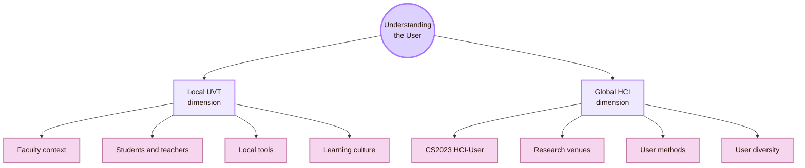
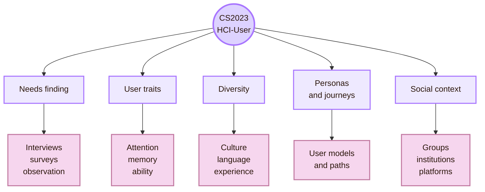
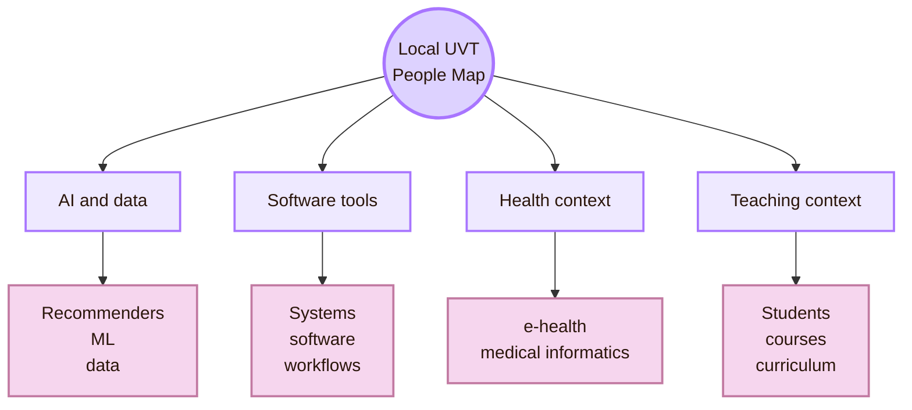
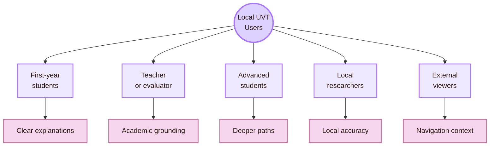
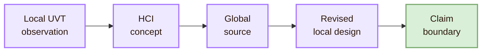
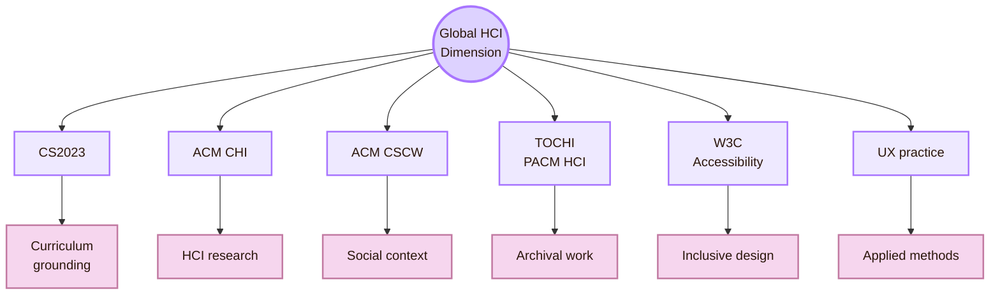
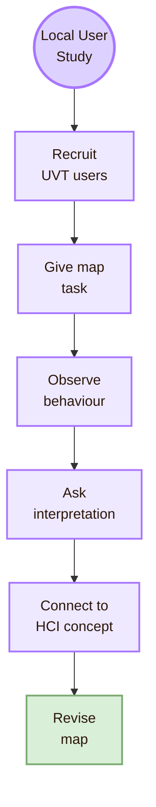
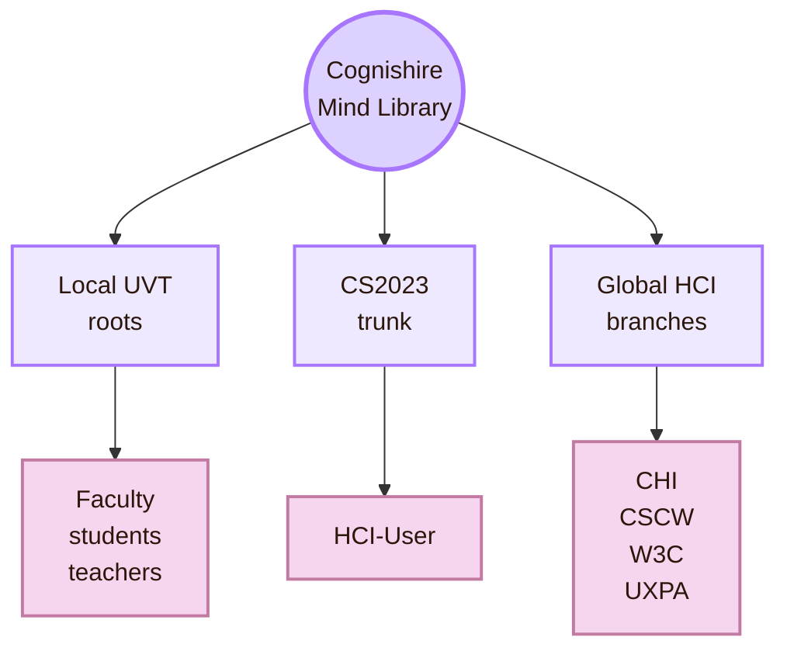

![[locala1.webp|1000]]
# Local and Global

Back to [[Overview|The Mind Library]].

> [!abstract] Local and Global User Map
> Local and Global in the Mind Library means that **Understanding the User** must be studied at two scales. The first scale is local: the real UVT setting where this project is built, read, evaluated, and used. The second scale is global: the wider HCI field, its curriculum models, research venues, methods, standards, and user populations.

The fantasy name is **Local and Global User Map**.  
The CS curriculum anchor is **HCI-User: Understanding the User**.  
The real-life meaning is simple: study users in the local UVT context, then interpret those observations through global HCI concepts.

In this page, **local** does not mean a vague nearby context. It means the academic environment around this project: Universitatea de Vest din Timișoara, the Faculty of Informatics, its departments, students, teachers, software tools, learning culture, and project expectations.

**Global** means the broader HCI field. It includes international curriculum guidance, conferences, journals, accessibility standards, user research methods, and users across different countries, languages, cultures, abilities, devices, and institutions.

> [!quote] Scale rule
> Start with UVT because that is the real context of use. Then connect outward to global HCI so the local observations are not treated as isolated opinions.

## Scale Map

| Scale | Meaning in this project | User-research question |
|---|---|---|
| Local UVT | The real faculty context, departments, students, teachers, courses, tools, and evaluation conditions around the project | What do UVT users need from this HCI map? |
| Global HCI | The international HCI field, CS2023, research venues, methods, and standards | Which global HCI concepts explain what happens locally? |
| Local users | UVT students, teachers, evaluators, classmates, and local project viewers | What do they understand, miss, value, and find confusing? |
| Global users | Learners, designers, researchers, accessibility users, and international HCI communities | Which findings might travel beyond UVT, and which remain local? |

## CS2023 Grounding

The curriculum anchor is **CS2023 HCI: Understanding the Users**. The CS2023 HCI material includes user-centred design and evaluation, needfinding, interviews, surveys, usability tests, personas, journey maps, physical and cognitive user characteristics, diverse user populations, culture, collaboration, and social computing.

This matters because the page should not define “user” only from intuition. It should connect the local project to recognised HCI curriculum language.

| CS2023 topic | Local UVT interpretation | Global HCI interpretation |
|---|---|---|
| Needs finding | What do UVT students need from a Cognishire HCI map? | How do HCI researchers identify user needs across contexts? |
| User characteristics | What prior knowledge do first-year CS students have? | How do cognition, ability, expertise, and attention shape interaction? |
| Personas | What learner types are relevant for this project? | How can personas model users without stereotyping them? |
| Journey maps | How does a student move through the Obsidian vault? | How do HCI methods map paths, goals, and breakdowns? |
| Diversity and culture | What languages, devices, learning styles, and expectations exist locally? | How do international users vary across language, culture, ability, and context? |
| Collaboration | How do students, teachers, and departments shape use? | How do groups, organisations, and communities shape interaction? |

## Local Anchor: Faculty of Informatics at UVT

The local institution for this map is the **Faculty of Informatics at UVT**. It defines the first real context of use: who may read the project, who may evaluate it, what computer-science language is expected, and which local tools shape the learning environment.

UVT’s Faculty of Informatics publicly lists two departments. These departments matter because they give the project a local computer-science frame.

| Local department | Why it matters for this map |
|---|---|
| Department of Computational Sciences and Artificial Intelligence | Connects the local map to AI, data, formal methods, intelligent systems, recommender systems, and computational modelling. |
| Department of Digital Technologies and Software Engineering | Connects the local map to software systems, digital technologies, software engineering, implementation, and tool-building. |

This does not mean that every department member works in HCI. It means that the local environment contains CS routes that can connect to HCI-User concerns: users, tools, data, AI systems, institutional software, learning contexts, and technical constraints.

## Local UVT People Map

This section is a local roadmap. It should not be read as a list of HCI professors. It identifies public UVT routes that may help connect the Mind Library to the local CS environment.

| Local route | Public UVT basis | How it can connect to Understanding the User |
|---|---|---|
| Horia Popa Andreescu | Listed by UVT with knowledge discovery and recommender systems. | Recommender systems connect to preferences, personalisation, user modelling, and explanation needs. |
| Gabriel Iuhasz | Listed by UVT with multiagent systems, machine learning, cloud computing, and strategic games. | Multiagent systems can help frame users as actors inside computational and social systems. |
| Todor Ivașcu | Listed by UVT with multi-agent systems, e-health systems, and machine learning. | E-health systems require attention to trust, monitoring, user needs, risk, and context. |
| Sebastian Ștefănigă | Listed by UVT with image processing, high-performance computing, medical informatics, and machine learning. | Medical informatics links technical systems to human users in health-related settings. |
| Daniel Pop | Listed by UVT with knowledge discovery, big data, and high-performance computing. | Knowledge discovery can support analysis of user traces and behavioural patterns. |
| Daniela Zaharie | Listed by UVT with evolutionary computing, machine learning, and data mining. | Data mining and ML can support user modelling, but they also raise interpretation and ethics questions. |
| Monica Sancira / Tirea | Listed by UVT with multiagent systems and financial modelling. | Decision contexts and modelled behaviour can support thinking about users under uncertainty. |
| Darian Onchiș | Listed by UVT with signal and image processing, bioinformatics, and machine learning. | Human-related data and ML can connect to measured human systems, but should not replace user research. |
| Mădălina Erașcu | Listed by UVT with formal verification, automated theorem proving, distributed computing, and symbolic computation. | Formal and trustworthy systems can support safer interaction when users depend on system behaviour. |
| Dana Petcu | Listed by UVT with distributed computing, grid computing, cloud computing, and parallel computing. | Digital infrastructure shapes what users can do in real systems. |
| Florin Fortiș | Listed by UVT with workflows, web technologies, and ontologies. | Workflow and web technology routes connect to user tasks, information structure, and tool use. |
| Ciprian Pungilă | Listed on the UVT department staff page. | Software and system work can help frame HCI decisions inside real implementation constraints. |
| Ioan Drăgan | Listed by UVT with cloud computing, formal verification, first-order logic, and automated theorem proving. | Local software and verification routes can connect system correctness to user-facing reliability. |
| Adrian Spătaru | Listed on the UVT department staff page. | Digital technology teaching routes can support local project positioning and tool-building context. |
| Alexandra Fortiș | Listed on the UVT department staff page. | Local teaching and CS context can help make the map understandable to student users. |

> [!warning] Local people note
> This table does not claim that these people are HCI specialists. It identifies local CS routes that can support user-related questions such as recommender systems, e-health, software tools, data, infrastructure, and trustworthy systems.

## Local User Groups at UVT

The Mind Library should identify real local users before making broad claims.

| Local user group | Likely need | Risk if ignored |
|---|---|---|
| First-year students | Clear explanations, simple definitions, examples, and readable diagrams | The page may look impressive but fail as a learning tool |
| Teacher or evaluator | CS2023 grounding, trusted sources, and academic structure | The project may look like fantasy content rather than curriculum work |
| Advanced CS students | Research routes, venues, people, and deeper links | The map may feel too basic |
| Local UVT researchers | Correct positioning of CS areas and local relevance | The map may misrepresent the institution |
| External GitHub viewer | Stable structure, setup notes, and explanation of metaphors | The vault may become confusing outside the author’s computer |

## Local Research Questions

These are the questions the Mind Library should ask first inside the UVT setting.

| Local research question | HCI-User method |
|---|---|
| Do UVT students understand the five fantasy room names? | Short interview and explanation task |
| Do students understand the real CS2023 label behind each room? | Comprehension check |
| What terms do students use for HCI, UX, usability, AI, and accessibility? | Vocabulary interview or card sort |
| Which pages feel too abstract for first-year learners? | Think-aloud reading task |
| Which diagrams help and which distract? | Comparative comprehension test |
| Does the teacher see the CS2023 structure clearly? | Expert review |
| Does the GitHub and Obsidian format work for local project submission? | Local workflow test |
| Which UVT research routes should be linked in the map? | Faculty and lab source review |

## Local-to-Global Bridge

The local UVT study becomes useful when it is connected to global HCI theory. Local evidence tells us what happens here. Global HCI helps explain why it happens, how it relates to prior work, and where the claim should stop.

| Local observation | Global HCI concept | Design implication |
|---|---|---|
| Students like the fantasy map but forget the official label | Mental models and terminology | Add a real-life translation under every metaphor |
| Students click the wrong room first | Information scent and navigation | Use clearer labels and overview routes |
| Students skim diagrams but miss definitions | Cognitive load and visual hierarchy | Make diagrams compact and pair them with definitions |
| The evaluator asks for CS2023 grounding | Academic credibility and source trust | Put the CS2023 label in frontmatter and opening callout |
| GitHub viewers do not see the same visual style | Context of use and platform constraints | Add setup notes or a web export route |
| Users confuse HCI with graphic design only | User-centred design and field boundaries | Add “what this is” and “what this is not” sections |

## Global HCI Dimension

The global dimension prevents the local project from becoming only a UVT classroom artifact. It links the local map to the international HCI field.

| Global source route | Why it matters for Understanding the User |
|---|---|
| CS2023 HCI-User | Gives curriculum language for user-centred methods and user characteristics |
| ACM CHI | Shows current international HCI research across users, interaction, design, AI, accessibility, and society |
| ACM CSCW | Shows how users act in groups, organisations, platforms, and collaborative systems |
| ACM TOCHI / PACM HCI | Provides archival and proceedings research for HCI |
| W3C WAI / WCAG | Connects user understanding to accessibility, disability, and assistive technology needs |
| UXPA / usability practice | Links academic user research to applied UX work |
| Nielsen Norman Group | Gives accessible practice guidance for personas, journey maps, usability testing, and user research |

## Local and Global Comparison Matrix

| Dimension | Local UVT version | Global HCI version |
|---|---|---|
| User population | UVT students, teachers, evaluator, local GitHub viewers | Learners, designers, researchers, and users across cultures and abilities |
| Institution | Faculty of Informatics, UVT | Universities, research labs, industry, public institutions |
| Research route | UVT departments, research centres, seminars, faculty pages, CS projects | CHI, CSCW, TOCHI, PACM HCI, UXPA, W3C, CS2023 |
| Language | English project content inside a Romanian university setting | International English plus localisation and multilingual users |
| Evidence | Local tests with classmates, professor, or UVT users | Cross-context studies, global literature, and standards |
| Design risk | The project becomes too fantasy-like or too local | The project becomes too generic and ignores UVT reality |
| Best solution | Start from UVT, then connect to global HCI | Use global theory to strengthen local observations |

## How to Study Users Locally at UVT

| Step | Local action |
|---|---|
| Recruit | Ask three to five UVT students or classmates to test the map |
| Task | Ask them to find “where HCI studies users” and “where interface design happens” |
| Observe | Record wrong turns, confusion, questions, and navigation paths |
| Ask | Ask what each room name means in normal language |
| Connect | Use mental models, information scent, cognitive load, and terminology theory |
| Revise | Add labels, source anchors, simpler diagrams, and clearer room descriptions |

## Local People Contact Protocol

The local contact protocol should be respectful and limited. Do not ask a UVT professor to “explain HCI from zero.” Ask a small, relevant question tied to the project.

| Email part | Local version |
|---|---|
| Subject | “Question about local CS/HCI map for a student project” |
| Opening | State that you are building a CS2023-based HCI map |
| Local fit | Explain why their UVT route is relevant |
| Specific ask | Ask for one local source, course connection, or research direction |
| Evidence | Mention the page you built and one official source you used |
| Close | Thank them and keep it short |

### Example local email

> [!example] Local UVT email
> Dear Professor [Name],  
> I am building a CS2023-based map of Human-Computer Interaction for a student project. I am currently working on the **Understanding the User** part and trying to connect global HCI concepts to the local UVT Computer Science context.  
>  
> I saw on the Faculty or Research page that your work connects to [specific area]. Could you recommend one local course, project, seminar, or reading direction that would help me represent this local dimension more accurately?  
>  
> Best regards,  
> [Name]

## What Not to Claim

Because the page includes local UVT people, the map must avoid overclaiming.

| Do not claim | Safer wording |
|---|---|
| “These are the HCI professors at UVT.” | “These are UVT CS local routes that may connect to HCI-User concerns.” |
| “This person studies users.” | “This person’s public research route can support user-related questions such as data, e-health, recommender systems, software tools, or trustworthy systems.” |
| “UVT represents all Romanian HCI.” | “UVT is the local institutional context for this project.” |
| “A test with classmates proves global usability.” | “A test with classmates gives local formative evidence.” |
| “The map is globally valid.” | “The map is globally grounded through CS2023 and HCI sources, but local evidence remains UVT-specific.” |

## Cognishire Application

In Cognishire, the Mind Library should not float in abstract fantasy. It should begin from UVT, then connect outward.

| Map decision | Local requirement | Global requirement |
|---|---|---|
| Room names | Must make sense to UVT students and evaluator | Must map clearly to CS2023 HCI units |
| User examples | Should include student and project examples from UVT | Should still connect to general HCI user types |
| People pages | Should include UVT local routes where relevant | Should also include global professors, labs, and research groups |
| Venue pages | Should include local seminars or research routes where relevant | Should include CHI, CSCW, TOCHI, PACM HCI, UXPA, W3C, and standards |
| Evaluation | Should test with local users first | Should state limits before making broader claims |

## Synthesis

Local and Global for **Understanding the User** means that the map starts with the real UVT setting and expands outward to global HCI. The local dimension is the faculty context, the students, the teacher, the language, the tools, and the project expectations. The global dimension is CS2023, HCI research, user-centred methods, accessibility standards, and international user diversity.

The central question is:

> How do UVT users understand and use this HCI map, and how can global HCI theory explain and improve that local experience?

This page connects to [[Activities/Theory]] because local observations need concepts. It connects to [[Activities/Design]] because user findings shape the map’s structure. It connects to [[Activities/Experiment]] because local user tests produce evidence. It connects to [[Important People]] because the local people route must include UVT as well as global HCI researchers. It connects to [[Important Venues]] because local seminars and global HCI venues both matter.

## Academic Anchors

| Route | Source |
|---|---|
| CS2023 HCI basis | [CS2023 HCI Knowledge Units](https://csed.acm.org/knowledge-areas-human-computer-interaction-hci-sigcse-2022-version/) |
| CS2023 Knowledge Areas | [CS2023 Knowledge Areas](https://csed.acm.org/knowledge-areas/) |
| UVT Faculty of Informatics | [Faculty of Informatics UVT](https://info.uvt.ro/en/) |
| UVT departments | [Faculty of Informatics Departments](https://info.uvt.ro/departamente/) |
| UVT Computational Sciences and AI Department | [CSAI Department](https://info.uvt.ro/departamente/csai/) |
| UVT Digital Technologies and Software Engineering Department | [DTSE Department](https://info.uvt.ro/departamente/dtse/) |
| UVT AI and ML research route | [Research Center: Artificial Intelligence and Machine Learning](https://research.info.uvt.ro/artificial-intelligence-and-machine-learning/) |
| UVT research routes | [Research Center Researchers](https://research.info.uvt.ro/researchers/) |
| HCI flagship research | [ACM CHI](https://dl.acm.org/conference/chi) |
| Social and collaborative HCI | [ACM CSCW](https://cscw.acm.org/) |
| HCI archival journal | [ACM TOCHI](https://dl.acm.org/journal/tochi) |
| HCI proceedings journal | [PACM HCI](https://dl.acm.org/journal/pacmhci) |
| Accessibility and user diversity | [W3C Web Accessibility Initiative](https://www.w3.org/WAI/) |
| Applied UX/user research | [UXPA International](https://uxpa.org/) |
| Practical user research guidance | [Nielsen Norman Group Articles](https://www.nngroup.com/articles/) |

^local-global-understanding-user-end
