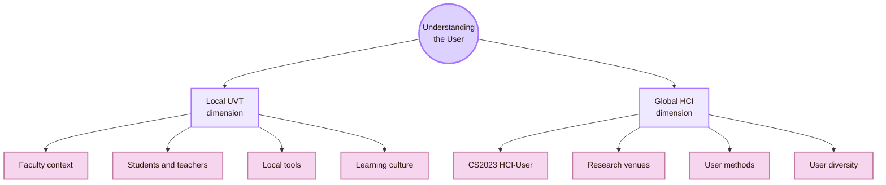
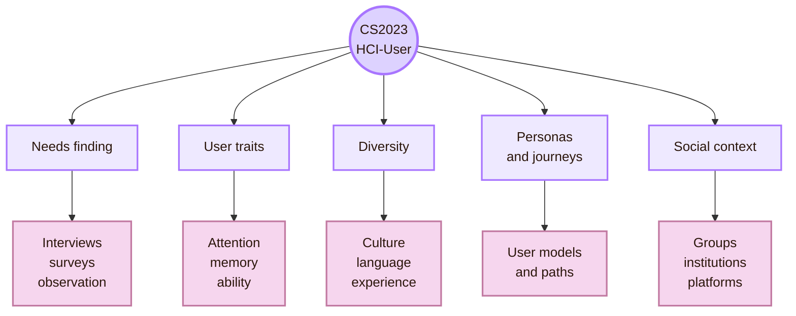
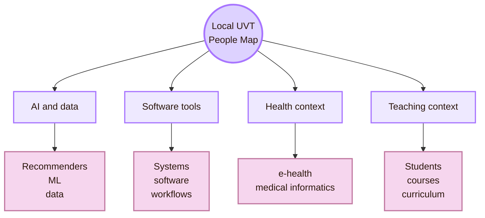
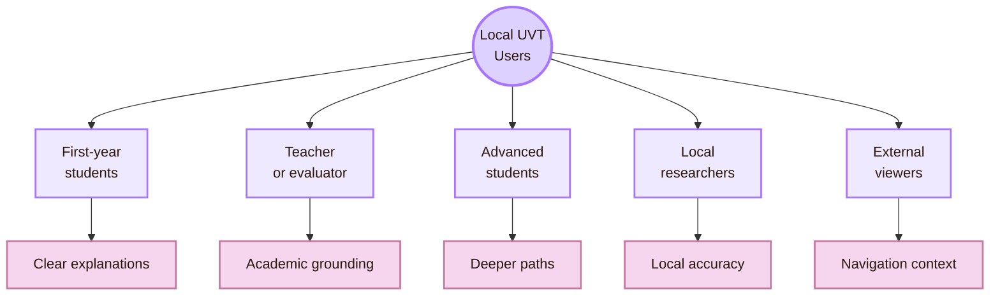
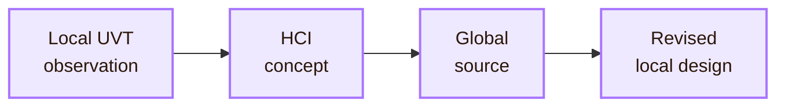
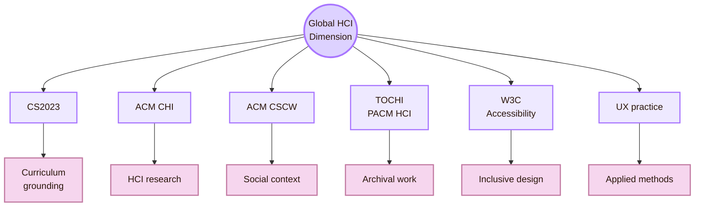
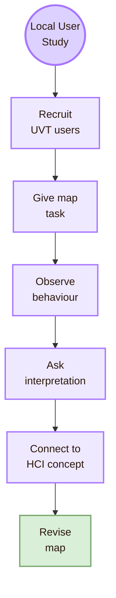

![[locala1.webp|1000]]
# Local and Global

The CS curriculum anchor is **HCI-User: Understanding the User**.  
The real-life meaning is simple: study users in the local UVT context, then interpret those observations through global HCI concepts.

**Global** means the broader HCI field. It includes international curriculum guidance, conferences, journals, accessibility standards, user research methods, and users across different countries, languages, cultures, abilities, devices, and institutions.

> [!quote] Scale rule
> Start with UVT because that is the real context of use. Then connect outward to global HCI so the local observations are not treated as isolated opinions.

## Scale Map

## CS2023 Grounding

The curriculum anchor is **CS2023 HCI: Understanding the Users**. The CS2023 HCI material includes user-centred design and evaluation, needfinding, interviews, surveys, usability tests, personas, journey maps, physical and cognitive user characteristics, diverse user populations, culture, collaboration, and social computing.

This matters because the page should not define “user” only from intuition. It should connect the local study to recognised HCI curriculum language.

## Local Anchor: Faculty of Informatics at UVT

UVT’s Faculty of Informatics publicly lists two departments. These departments matter because they give the study a local computer-science frame.

This does not mean that every department member works in HCI. It means that the local environment contains CS routes that can connect to HCI-User concerns: users, tools, data, AI systems, institutional software, learning contexts, and technical constraints.

## Local UVT People Map

## Local User Groups at UVT

## Local Research Questions

## Local-to-Global Bridge

## Global HCI Dimension

The global dimension prevents the local study from becoming only a UVT classroom artifact. It links the local map to the international HCI field.

| Global source route | Why it matters for Understanding the User |
|---|---|
| CS2023 HCI-User | Gives curriculum language for user-centred methods and user characteristics |
| ACM CHI | Shows current international HCI research across users, interaction, design, AI, accessibility, and society |
| ACM CSCW | Shows how users act in groups, organisations, platforms, and collaborative systems |
| ACM TOCHI / PACM HCI | Provides archival and proceedings research for HCI |
| W3C WAI / WCAG | Connects user understanding to accessibility, disability, and assistive technology needs |
| UXPA / usability practice | Links academic user research to applied UX work |
| Nielsen Norman Group | Gives accessible practice guidance for personas, journey maps, usability testing, and user research |

## Local and Global Comparison Matrix

## How to Study Users Locally at UVT

## Local People Contact Protocol

The local contact protocol should be respectful and limited. Do not ask a UVT professor to “explain HCI from zero.” Ask a small, relevant question tied to the study.

### Example local email

## Academic Anchors

| Route | Source |
|---|---|
| CS2023 HCI basis | [CS2023 HCI Knowledge Units](https://csed.acm.org/knowledge-areas-human-computer-interaction-hci-sigcse-2022-version/) |
| CS2023 Knowledge Areas | [CS2023 Knowledge Areas](https://csed.acm.org/knowledge-areas/) |
| UVT Faculty of Informatics | [Faculty of Informatics UVT](https://info.uvt.ro/en/) |
| UVT departments | [Faculty of Informatics Departments](https://info.uvt.ro/departamente/) |
| UVT Computational Sciences and AI Department | [CSAI Department](https://info.uvt.ro/departamente/csai/) |
| UVT Digital Technologies and Software Engineering Department | [DTSE Department](https://info.uvt.ro/departamente/dtse/) |
| UVT AI and ML research route | [Research Center: Artificial Intelligence and Machine Learning](https://research.info.uvt.ro/artificial-intelligence-and-machine-learning/) |
| UVT research routes | [Research Center Researchers](https://research.info.uvt.ro/researchers/) |
| HCI flagship research | [ACM CHI](https://dl.acm.org/conference/chi) |
| Social and collaborative HCI | [ACM CSCW](https://cscw.acm.org/) |
| HCI archival journal | [ACM TOCHI](https://dl.acm.org/journal/tochi) |
| HCI proceedings journal | [PACM HCI](https://dl.acm.org/journal/pacmhci) |
| Accessibility and user diversity | [W3C Web Accessibility Initiative](https://www.w3.org/WAI/) |
| Applied UX/user research | [UXPA International](https://uxpa.org/) |
| Practical user research guidance | [Nielsen Norman Group Articles](https://www.nngroup.com/articles/) |

^local-global-understanding-user-end

> [!abstract]
> [[Important Venues|Next: Important Venues]]
