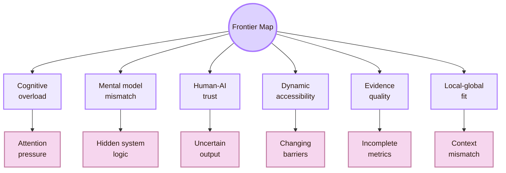
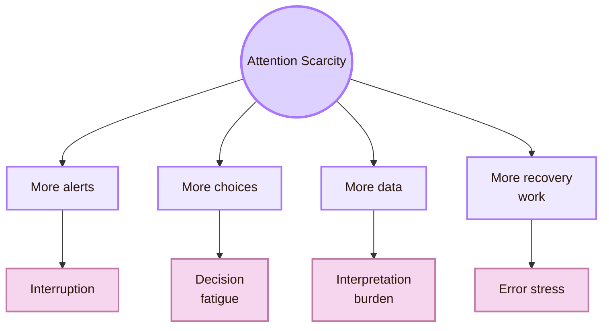
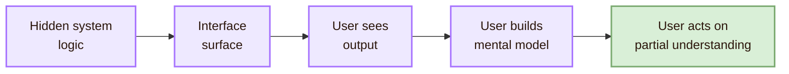
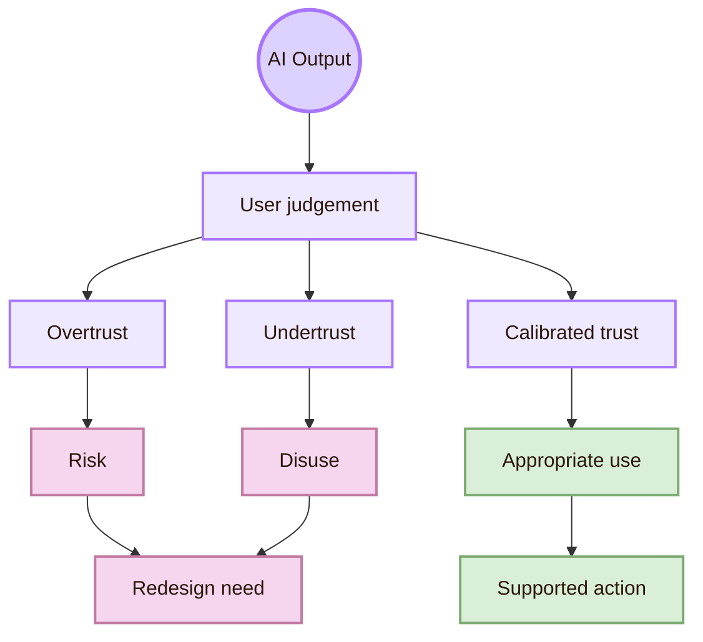
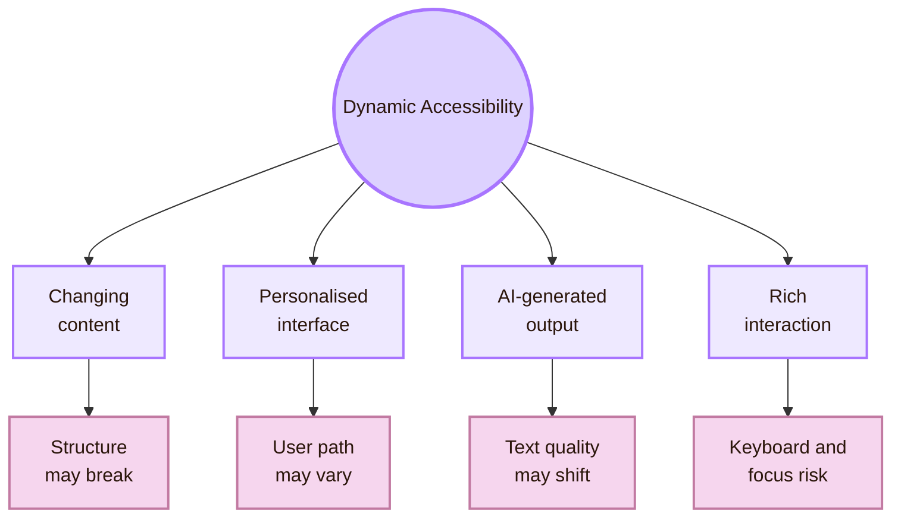
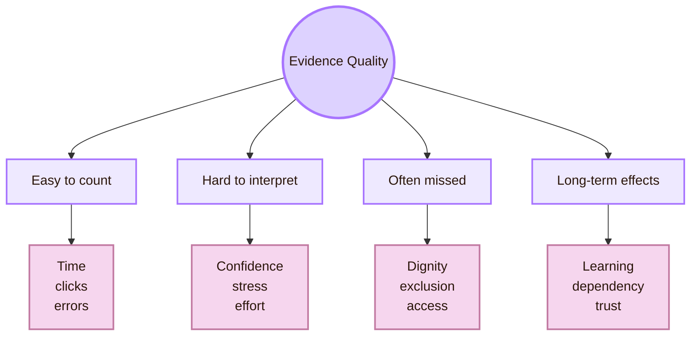
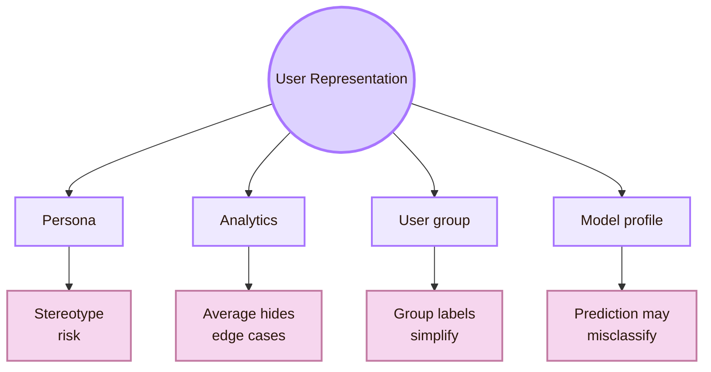
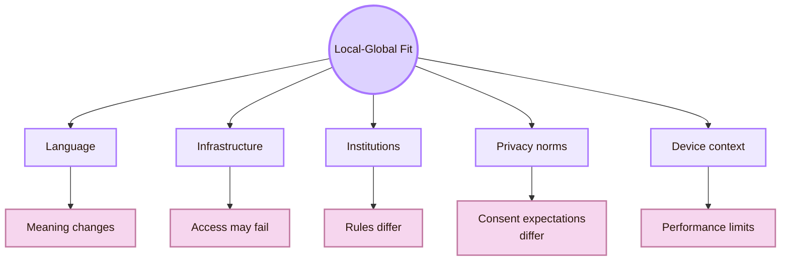
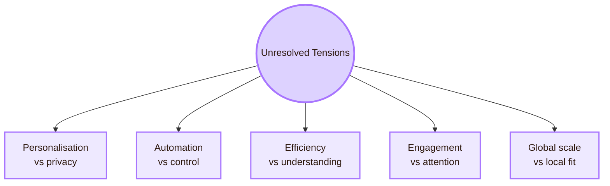
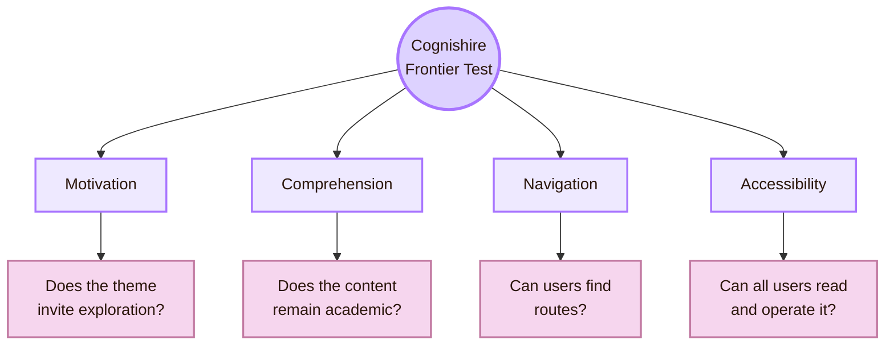

# Open Problems

> [!abstract] Frontier Map
> This chamber marks the unresolved frontiers of the Mind Library. HCI has strong concepts for cognition, usability, accessibility, and human-centred design. At the same time, interactive systems keep changing. New systems create new problems for understanding, access, trust, control, and evidence.

Open problems are not empty spaces. They are questions that remain difficult because people, technology, institutions, and social norms change together. In HCI, a problem often stays open when a design affects users in ways that are hard to measure, explain, or repair.

This page treats open problems as research directions. It does not claim that these problems have no answers. It shows where current HCI knowledge still needs careful design, stronger evidence, and more responsible practice.

This frontier connects to [[01_Core_Area_HCI/001_Subareas/01_Understanding_the_User/Activities/Theory]], because unresolved problems expose limits in existing concepts. It connects to [[01_Core_Area_HCI/001_Subareas/01_Understanding_the_User/Activities/Design]], because open problems require new interaction forms. It connects to [[01_Core_Area_HCI/001_Subareas/01_Understanding_the_User/Activities/Experiment]], because uncertain claims need better evidence. It connects to [[01_Core_Area_HCI/001_Subareas/01_Understanding_the_User/Connections]], because the hardest problems cross cognition, computing, accessibility, AI, ethics, institutions, and culture.

> [!quote] Frontier rule
> An open problem in HCI appears when a system changes what users can understand, trust, access, control, or contest faster than existing design knowledge can explain.

## Frontier compass

The main frontiers in this chamber are cognitive overload, mental model mismatch, calibrated trust, dynamic accessibility, evidence quality, user representation, and local-global fit.

| Frontier | Why it remains difficult | Connected chamber |
|---|---|---|
| Cognitive overload | Interfaces place many choices, alerts, and interpretations inside limited attention. | [[01_Core_Area_HCI/001_Subareas/01_Understanding_the_User/Activities/Theory]] |
| Mental model mismatch | Systems hide complex behaviour behind simple interface surfaces. | [[01_Core_Area_HCI/001_Subareas/01_Understanding_the_User/Activities/Design]] |
| Human-AI trust | Users may overtrust fluent output or reject useful automation. | [[01_Core_Area_HCI/001_Subareas/05_Human_AI_Interaction/Open Problems]] |
| Dynamic accessibility | Personalised, animated, and AI-generated interfaces can create changing barriers. | [[01_Core_Area_HCI/001_Subareas/01_Understanding_the_User/Local and Global]] |
| Evidence quality | Task success and time do not fully show understanding, dignity, or effort. | [[01_Core_Area_HCI/001_Subareas/01_Understanding_the_User/Activities/Experiment]] |
| User representation | Personas, analytics, and AI profiles can flatten diverse users into averages. | [[01_Core_Area_HCI/001_Subareas/01_Understanding_the_User/Connections]] |
| Local-global fit | Global systems may ignore language, infrastructure, law, culture, and social risk. | [[01_Core_Area_HCI/001_Subareas/01_Understanding_the_User/Local and Global]] |

## Frontier one: cognitive overload and attention scarcity

Modern interfaces often promise convenience while increasing hidden cognitive work. Users must compare options, manage notifications, interpret dashboards, understand privacy choices, evaluate automated suggestions, and recover from errors across devices.

The problem is larger than busy screens. The deeper issue is responsibility. A system may transfer too much judgement to the user while giving too little structure for making that judgement well.

This frontier links to [[01_Core_Area_HCI/001_Subareas/01_Understanding_the_User/Activities/Design]]. Good design does not only remove visible clutter. It reduces unnecessary memory burden, interruption, uncertainty, and interpretation work. It also links to [[01_Core_Area_HCI/001_Subareas/01_Understanding_the_User/Activities/Experiment]], because a design that looks simpler is not always easier to understand.

| Overload source | HCI risk | Research question |
|---|---|---|
| Notification density | Users lose task focus. | Which notification patterns preserve attention without hiding urgency? |
| Privacy decisions | Users consent without understanding. | How can privacy choices be understandable without becoming exhausting? |
| Dashboard complexity | Users see data but cannot judge meaning. | What visual structures support correct interpretation? |
| Multi-step forms | Users forget progress and dependencies. | Which progress cues reduce memory burden? |
| AI suggestions | Users must evaluate uncertain output. | Which uncertainty cues improve judgement? |

The open problem is not whether cognitive load exists. The open problem is how to design systems that respect attention when digital environments constantly compete for it.

## Frontier two: mental models of invisible systems

Many systems hide complex technical behaviour behind simple surfaces. Search engines rank information. Recommenders personalise feeds. AI assistants generate answers. Platforms moderate content. Smart devices sense environments. Users often see the result, not the system logic that produced it.

The design challenge is not to expose every technical detail. That would create overload. The challenge is to show the right amount of system logic for the task, the risk, and the user’s decision.

A user booking a train ticket may need clear availability, price, time, and cancellation rules. A user receiving an automated medical, financial, academic, or legal recommendation needs stronger explanation, uncertainty, and control.

| System type | Hidden behaviour | Mental model risk |
|---|---|---|
| Search | Ranking and filtering | User mistakes rank for truth. |
| Recommendation | Personalisation criteria | User cannot tell why content appears. |
| AI assistant | Probabilistic generation | User mistakes fluency for certainty. |
| Smart device | Sensing and inference | User does not know what is being captured. |
| Platform moderation | Rule enforcement | User cannot predict or contest outcomes. |

This frontier connects to human-AI design guidance from Microsoft and Google PAIR, because AI systems often require users to judge output that is uncertain or incomplete. It also connects to broader HCI research communities such as ACM SIGCHI and ACM CHI.

## Frontier three: calibrated trust in human-AI interaction

AI systems create a special frontier because their outputs can be useful, fluent, uncertain, wrong, persuasive, personalised, and difficult to inspect. Users may overtrust them, undertrust them, or use them without understanding their limits.

The open question is not whether users should trust AI. A stronger HCI question is how systems can support calibrated trust. Users need help deciding when to rely, when to question, when to verify, when to override, and how to recover.

| Trust failure | What happens | Possible design response |
|---|---|---|
| Overtrust | User accepts output without enough evidence. | Show uncertainty, sources, and verification steps. |
| Undertrust | User rejects useful automation. | Explain capability, reliability, and boundaries. |
| Misplaced trust | User trusts the system in the wrong context. | Match confidence cues to risk level. |
| Automation dependence | User stops checking the system. | Preserve meaningful human review. |
| Contestability failure | User cannot challenge a system decision. | Provide appeal, correction, and escalation paths. |

> [!warning] Trust frontier
> The goal of human-AI interaction is not maximum trust. The goal is appropriate trust.

This frontier links to [[01_Core_Area_HCI/001_Subareas/05_Human_AI_Interaction/Open Problems]] because it combines cognition, design, data, power, explanation, accountability, and social consequence.

## Frontier four: accessibility in dynamic systems

Accessibility remains open because interfaces are no longer static pages. They are dynamic, personalised, animated, voice-enabled, AI-assisted, collaborative, embedded, and constantly updated.

WCAG gives essential criteria for accessible web content. WAI-ARIA helps with dynamic content and advanced interface controls. These standards matter, but teams still need user testing, assistive technology testing, and maintenance as the system changes.

> [!important] Frontier rule
> Accessibility is not solved when a system passes a checklist once. It must be maintained as content changes, components evolve, and user contexts shift.

| Dynamic feature | Accessibility risk | Evaluation need |
|---|---|---|
| Live updates | Screen reader users may miss changes. | Test announcements and focus behaviour. |
| Personalisation | Users may receive different interface paths. | Test multiple user states and profiles. |
| Animation | Motion may distract or harm users. | Provide reduced-motion options. |
| AI-generated content | Text may be unclear, biased, or unstructured. | Test readability, structure, and alternatives. |
| Custom controls | Native semantics may be lost. | Test keyboard and assistive technology support. |

The strongest anchors for this frontier are the W3C Web Accessibility Initiative, WCAG 2.2, WAI-ARIA, the ARIA Authoring Practices Guide, and WebAIM.

## Frontier five: evidence beyond easy metrics

Another open problem is evidence itself. HCI often measures what is easy to count: time, clicks, task success, and error rate. These measures matter, but they do not fully capture understanding, dignity, anxiety, confidence, fatigue, exclusion, learning, or long-term adaptation.

A user may complete a task while feeling uncertain and unsupported. Another user may fail because the system assumes abilities, language, infrastructure, or prior knowledge they were never given. A third user may succeed in the short term but become dependent, distracted, or mistrustful over time.

| Evidence type | Why it matters | Why it is difficult |
|---|---|---|
| Completion time | Shows efficiency. | Can hide confusion and stress. |
| Error rate | Shows breakdowns. | May not explain cause. |
| Confidence | Shows perceived understanding. | Hard to compare across users. |
| Dignity | Shows whether the experience respects the user. | Often missing from metrics. |
| Accessibility | Shows inclusion or exclusion. | Requires diverse testing and tools. |
| Long-term adaptation | Shows habits and dependency. | Requires time and repeated observation. |

The Mind Library therefore needs richer evidence practices. [[01_Core_Area_HCI/001_Subareas/01_Understanding_the_User/Activities/Experiment]] should combine behavioural traces with interpretation, accessibility checks, and participant experience. [[01_Core_Area_HCI/001_Subareas/01_Understanding_the_User/Activities/Theory]] should explain why an outcome occurred. [[01_Core_Area_HCI/001_Subareas/01_Understanding_the_User/Activities/Design]] should turn that explanation into revised interaction form.

## Frontier six: representing users without flattening them

HCI often uses personas, analytics, user groups, behavioural clusters, and demographic categories. These tools can help designers reason about users. They can also flatten people into stereotypes or averages.

A persona can become a cartoon if it is not grounded in research. Analytics can hide minority experiences if the average looks acceptable. A user model can become harmful if it treats culture, disability, gender, age, language, or technical expertise as fixed assumptions instead of situated realities.

| Representation method | Useful when | Dangerous when |
|---|---|---|
| Persona | Grounded in real research. | Invented from assumptions. |
| Analytics | Combined with qualitative evidence. | Treated as complete truth. |
| User segment | Used to detect different needs. | Used to stereotype behaviour. |
| AI profile | Transparent and correctable. | Hidden, inaccurate, or hard to challenge. |

The open problem is how to represent users without reducing them to convenient myths. This frontier connects strongly to [[01_Core_Area_HCI/001_Subareas/01_Understanding_the_User/Connections]], [[01_Core_Area_HCI/001_Subareas/01_Understanding_the_User/Local and Global]], and [[01_Core_Area_HCI/001_Subareas/01_Understanding_the_User/Important People]] because representation has intellectual, social, and ethical history.

## Frontier seven: local-global fit

Many systems are built globally but used locally. A design may work in one language, institution, legal setting, device ecosystem, or cultural context and fail in another. Local-global fit is therefore more than translation. It includes infrastructure, norms, trust in institutions, disability support, education systems, payment systems, privacy expectations, and risk perception.

| Global assumption | Local complication | HCI response |
|---|---|---|
| Everyone has stable internet. | Rural or low-resource contexts may not. | Design offline, low-bandwidth, or resilient flows. |
| English labels are enough. | Meaning changes across languages. | Test terminology locally. |
| One privacy model fits all. | Laws and norms differ. | Adapt consent and data explanations. |
| Users trust institutions similarly. | Trust varies by history and context. | Study local trust conditions. |
| Devices are modern and powerful. | Hardware differs widely. | Design for performance and compatibility. |

This frontier is one reason [[01_Core_Area_HCI/001_Subareas/01_Understanding_the_User/Local and Global]] must exist as a separate route. HCI cannot study the user outside place.

## Frontier map: unresolved tensions

Some open problems remain difficult because they involve real tensions. Improving one side can damage another.

| Tension | Why it is hard |
|---|---|
| Personalisation vs privacy | Better adaptation often requires more data. |
| Automation vs control | Automation can reduce effort but weaken agency. |
| Efficiency vs understanding | Fast systems may hide important reasoning. |
| Engagement vs attention | Engaging systems may become manipulative. |
| Global scale vs local fit | Scalable systems often ignore local context. |

These tensions show why open problems cannot always be solved by a single design rule. They require judgement, evidence, ethics, and repeated evaluation.

## Frontier protocol for Cognishire

The Cognishire HCI map can itself be tested as an HCI object. It uses fantasy design, Obsidian navigation, academic writing, diagrams, CSS, and external links. The research question is whether this rich style supports learning or creates extra cognitive load.

| Study question | Possible evidence |
|---|---|
| Does the RPG map style improve motivation without reducing comprehension? | Engagement comments, recall, task success. |
| Do chamber names help orientation or confuse users? | Navigation errors, explanation quality. |
| Do diagrams support understanding or distract from text? | Comprehension questions, reading comments, task performance. |
| Are links and sources easy to follow? | Time to find a trusted source, wrong turns, user explanation. |
| Is the visual theme accessible enough? | Contrast checks, keyboard use, readability, assistive technology feedback. |

This protocol matters because a learning vault is still an interface. It should be evaluated with the same care as any other interactive system.

## Synthesis

The Mind Library’s frontier is the problem of representing users without simplifying them into convenient myths. Future HCI must explain cognition without ignoring culture. It must design for usability without ignoring power. It must measure behaviour without erasing experience. It must build AI systems that support human judgement rather than replacing it with opaque authority.

Open problems are not failures of the map. They are the edges of the map. They show where HCI must continue to test, revise, and expand its concepts.

This chamber therefore returns to [[01_Core_Area_HCI/001_Subareas/01_Understanding_the_User/Activities/Theory]], [[01_Core_Area_HCI/001_Subareas/01_Understanding_the_User/Activities/Design]], and [[01_Core_Area_HCI/001_Subareas/01_Understanding_the_User/Activities/Experiment]] as a loop: theory explains, design materialises, experiment tests, and open problems force the map to grow.

## Academic anchors

| Frontier route | Trusted source |
|---|---|
| HCI research community | [ACM SIGCHI](https://sigchi.org/) |
| HCI academic venue | [ACM CHI Conference](https://dl.acm.org/conference/chi) |
| HCI research library | [ACM Digital Library](https://dl.acm.org/) |
| Human-centred design | [ISO 9241-210](https://www.iso.org/standard/77520.html) |
| Human-AI interaction | [Microsoft Human-AI Interaction Guidelines](https://www.microsoft.com/en-us/research/project/guidelines-for-human-ai-interaction/) |
| Human-AI design toolkit | [Microsoft HAX Toolkit](https://www.microsoft.com/en-us/haxtoolkit/) |
| AI design practice | [Google People + AI Guidebook](https://pair.withgoogle.com/guidebook/) |
| Fairness and accountability | [ACM FAccT](https://facctconference.org/) |
| Accessibility practice | [W3C Web Accessibility Initiative](https://www.w3.org/WAI/) |
| Accessibility standards | [WCAG 2.2](https://www.w3.org/TR/WCAG22/) |
| Dynamic web accessibility | [WAI-ARIA Overview](https://www.w3.org/WAI/standards-guidelines/aria/) |
| Accessible widget patterns | [ARIA Authoring Practices Guide](https://www.w3.org/WAI/ARIA/apg/) |
| Web accessibility reference | [WebAIM](https://webaim.org/) |
| Human factors and HCD | [NIST Human-Centered Design](https://www.nist.gov/itl/iad/human-centered-technologies/human-factors-human-centered-design) |
| Usability testing | [Nielsen Norman Group: Usability Testing 101](https://www.nngroup.com/articles/usability-testing-101/) |
| Computing ethics | [ACM Code of Ethics](https://www.acm.org/code-of-ethics) |

## Connected chambers

This chamber connects to [[01_Core_Area_HCI/001_Subareas/01_Understanding_the_User/Overview]] because it defines the unfinished edge of the Mind Library. It connects to [[01_Core_Area_HCI/001_Subareas/01_Understanding_the_User/Activities/Theory]] because open problems expose where concepts are incomplete. It connects to [[01_Core_Area_HCI/001_Subareas/01_Understanding_the_User/Activities/Design]] because frontiers demand new design patterns. It connects to [[01_Core_Area_HCI/001_Subareas/01_Understanding_the_User/Activities/Experiment]] because uncertainty requires evidence. It connects to [[01_Core_Area_HCI/001_Subareas/01_Understanding_the_User/Connections]] because the hardest problems cross disciplines. It connects to [[01_Core_Area_HCI/001_Subareas/01_Understanding_the_User/Local and Global]] because many problems only appear when systems travel across contexts. It connects to [[01_Core_Area_HCI/001_Subareas/01_Understanding_the_User/Important Venues]] because research communities are where these frontiers are debated.

^open-problems-end
