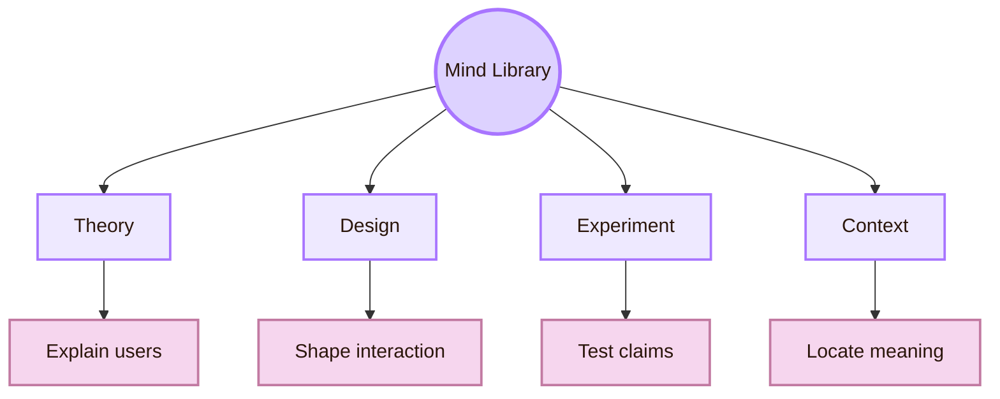
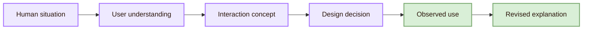
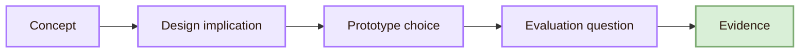

![[allview1.webp|1000]]
# Mind Library

> [!abstract] Entrance Map
> The Mind Library is the chamber of Human-Computer Interaction where the user becomes visible as a real person. It studies perception, attention, memory, learning, emotion, accessibility, trust, and social context so that interactive systems can be designed around human limits and abilities.

The Mind Library is the part of the HCI map that asks what a person brings into an encounter with technology. Users bring goals, habits, expectations, prior experience, cultural knowledge, language, bodily ability, uncertainty, and trust. A system can work technically and still fail as an interaction if people cannot understand it, access it, control it, or recover from mistakes.

This entrance page links the major routes through the chamber. [[Activities/Theory|Theory]] explains concepts such as perception, mental models, affordances, feedback, memory, and cognitive load. [[Activities/Design|Design]] turns user understanding into labels, flows, constraints, feedback, and prototypes. [[Activities/Experiment|Experiment]] tests whether claims about users survive contact with evidence. [[Connections]] shows how user understanding connects psychology, computing, design, accessibility, ethics, and AI.

The chamber also needs scholarly orientation. [[Important People]] points to researchers and academic routes. [[Important Venues]] shows where HCI research is published, reviewed, and standardised. [[Local and Global]] explains why user experience depends on place, language, culture, infrastructure, and institution. [[Open Problems]] marks the parts of user understanding that remain unsettled.

## Entrance compass

The compass has four directions. Theory asks why interaction succeeds or fails. Design asks how cognition and action can be supported by visible structure. Experiment asks what evidence can justify a claim about usability, comprehension, accessibility, or trust. Context asks whose user experience is being described, and under which social, cultural, organisational, and infrastructural conditions.

## What the chamber studies

| Library shelf | HCI question | Typical design consequence |
|---|---|---|
| Perception | What can users notice quickly and reliably? | Contrast, hierarchy, spacing, icons, and motion must guide attention without hiding meaning. |
| Attention | Where will users focus under pressure? | Interfaces need visual priority, interruption control, and progressive disclosure. |
| Memory | What must users remember across steps? | Systems should support recognition, visible state, history, defaults, and reminders. |
| Mental models | What do users think the system is doing? | Labels, feedback, navigation, and metaphors should make system behaviour understandable. |
| Error and recovery | How do users recover when action fails? | Designs need prevention, undo, clear diagnosis, safe exits, and repair paths. |
| Accessibility | Who is excluded by the interaction form? | Interfaces need keyboard access, semantic structure, captions, alternatives, and adaptable layouts. |
| Trust | When should users rely on the system? | Systems should show status, uncertainty, limits, accountability, and control. |

These shelves are connected. A confusing label can become a memory problem, a trust problem, an accessibility problem, and an evaluation problem. The Mind Library therefore treats interface behaviour as a human-system relation, not as a set of isolated screen elements.

## Core route

The route begins with a human situation rather than a screen. A student searches for course requirements. A patient reads a medical result. A driver receives an automated warning. A worker uses a dashboard under time pressure. Each situation contains goals, risks, language, expectations, and constraints. HCI research translates that situation into concepts, design decisions, and evaluation methods.

This is why the Mind Library connects to the other rooms of the map. The [[../02_System_Design/Overview|Interface Forge]] needs user understanding because visual and interactive form must support perception and action. The [[../03_Evaluating_the_Design/Overview|Observation Chamber]] needs it because evidence must be interpreted through human behaviour. The [[../04_Accessibility_and_Accountability/Overview|Inclusive Gate]] depends on it because sensory, cognitive, and motor diversity are part of user understanding. The [[../05_Human_AI_Interaction/Overview|Oracle Engine]] needs it because AI systems create new problems of explanation, trust, control, and error.

## From concept to design evidence

A Mind Library page should not stop at definition. Each concept should lead to a design implication and a possible test.

| Concept | Design implication | Possible evidence |
|---|---|---|
| Mental model | The interface should make system behaviour predictable. | Ask users to explain what the system will do next. |
| Recognition over recall | Important options should stay visible or easy to retrieve. | Compare errors and pauses in a task flow. |
| Feedback | The system should show whether an action worked. | Observe whether users notice success, failure, and next steps. |
| Cognitive load | The interface should avoid unnecessary memory and interpretation work. | Measure errors, hesitation, self-reported effort, and recovery. |
| Accessibility | The same task should be possible across different abilities and technologies. | Test keyboard use, screen reader structure, contrast, captions, and user feedback. |
| Trust calibration | Users should know when to rely on the system and when to verify. | Check whether users accept, reject, or question advice in suitable situations. |

## Academic ground

The Mind Library should use academic and professional sources rather than intuition alone. ACM SIGCHI and CHI represent major HCI research communities and venues. ACM TOCHI preserves archival HCI research. ISO 9241-210 gives requirements and recommendations for human-centred design across the life cycle of interactive systems. WCAG 2.2 and W3C WAI provide accessibility guidance and success criteria. Nielsen Norman Group is useful for applied usability methods and heuristics.

> [!important] Map rule
> The Mind Library does not ask whether a user is “smart enough” for a system. It asks whether the system gives human cognition, perception, action, language, and context a fair structure for success.

## Navigation table

| Route | Page | Function in the library |
|---|---|---|
| Conceptual archive | [[Activities/Theory]] | Explains mental models, affordances, feedback, cognition, accessibility, and human-AI concepts. |
| Form-making chamber | [[Activities/Design]] | Turns user understanding into labels, flows, feedback, constraints, and prototypes. |
| Evidence chamber | [[Activities/Experiment]] | Tests usability, comprehension, accessibility, performance, and interpretation. |
| Bridge map | [[Connections]] | Connects cognition with design, computing, AI, ethics, accessibility, and society. |
| Scholar roadmap | [[Important People]] | Locates researchers, labs, and study routes related to user understanding. |
| Academic atlas | [[Important Venues]] | Shows conferences, journals, standards, and organisations where HCI knowledge is developed. |
| Scale map | [[Local and Global]] | Compares local contexts with global systems and standards. |
| Frontier map | [[Open Problems]] | Identifies unresolved problems in user modelling, accessibility, AI, evidence, and context. |

## Academic anchors

| Route | Trusted source |
|---|---|
| HCI community | [ACM SIGCHI](https://sigchi.org/) |
| HCI flagship venue | [ACM CHI Conference](https://dl.acm.org/conference/chi) |
| Archival HCI research | [ACM Transactions on Computer-Human Interaction](https://dl.acm.org/journal/tochi) |
| Human-centred design | [ISO 9241-210](https://www.iso.org/standard/77520.html) |
| Accessibility guidance | [W3C Web Accessibility Initiative](https://www.w3.org/WAI/) |
| Accessibility criteria | [WCAG 2.2](https://www.w3.org/TR/WCAG22/) |
| Usability heuristics | [Nielsen Norman Group: 10 Usability Heuristics](https://www.nngroup.com/articles/ten-usability-heuristics/) |
| HCI evidence and literature | [ACM Digital Library](https://dl.acm.org/) |

## Synthesis

The Mind Library is the entrance to user understanding in the Map of HCI. It gives the rest of the project its human foundation. It explains why users interpret systems as they do, why design decisions help or harm action, why evidence matters, and why local context cannot be erased by universal interface patterns.

The library is not a side room before computing begins. It is the chamber that explains why computing must be studied as interaction.

> [!tip] Return Path
> [[00_Index/Human-Computer Interaction|Return to the Five Rooms of HCI]]  
> [[../../../00_Index/Human-Computer Interaction|Return to the Main Room]]

^mind-library-overview-end
