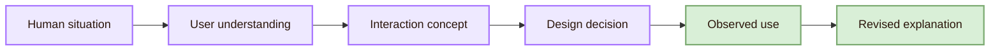
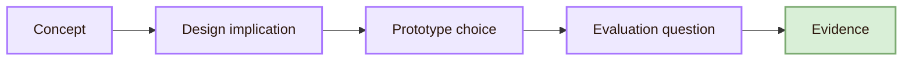

![[allview1.webp|1000]]
# Understanding the User

The section also needs scholarly orientation. [[Important People]] points to researchers and academic routes. [[Important Venues]] shows where HCI research is published, reviewed, and standardised. [[Local and Global]] explains why user experience depends on place, language, culture, infrastructure, and institution. [[Open Problems]] marks the parts of user understanding that remain unsettled.

## Entrance compass

## What the section studies

- **Perception:** hci question: What can users notice quickly and reliably?; typical design consequence: Contrast, hierarchy, spacing, icons, and motion must guide attention without hiding meaning.
- **Attention:** hci question: Where will users focus under pressure?; typical design consequence: Interfaces need visual priority, interruption control, and progressive disclosure.
- **Memory:** hci question: What must users remember across steps?; typical design consequence: Systems should support recognition, visible state, history, defaults, and reminders.
- **Mental models:** hci question: What do users think the system is doing?; typical design consequence: Labels, feedback, navigation, and metaphors should make system behaviour understandable.
- **Error and recovery:** hci question: How do users recover when action fails?; typical design consequence: Designs need prevention, undo, clear diagnosis, safe exits, and repair paths.
- **Accessibility:** hci question: Who is excluded by the interaction form?; typical design consequence: Interfaces need keyboard access, semantic structure, captions, alternatives, and adaptable layouts.
- **Trust:** hci question: When should users rely on the system?; typical design consequence: Systems should show status, uncertainty, limits, accountability, and control.

## Core route

## From concept to design evidence

- **Mental model:** design implication: The interface should make system behaviour predictable. (evidence: Ask users to explain what the system will do next.)
- **Recognition over recall:** design implication: Important options should stay visible or easy to retrieve. (evidence: Compare errors and pauses in a task flow.)
- **Feedback:** design implication: The system should show whether an action worked. (evidence: Observe whether users notice success, failure, and next steps.)
- **Cognitive load:** design implication: The interface should avoid unnecessary memory and interpretation work. (evidence: Measure errors, hesitation, self-reported effort, and recovery.)
- **Accessibility:** design implication: The same task should be possible across different abilities and technologies. (evidence: Test keyboard use, screen reader structure, contrast, captions, and user feedback.)
- **Trust calibration:** design implication: Users should know when to rely on the system and when to verify. (evidence: Check whether users accept, reject, or question advice in suitable situations.)

## Academic ground

## Academic anchors

| Route | Trusted source |
|---|---|
| HCI community | [ACM SIGCHI](https://sigchi.org/) |
| HCI flagship venue | [ACM CHI Conference](https://dl.acm.org/conference/chi) |
| Archival HCI research | [ACM Transactions on Computer-Human Interaction](https://dl.acm.org/journal/tochi) |
| Human-centred design | [ISO 9241-210](https://www.iso.org/standard/77520.html) |
| Accessibility guidance | [W3C Web Accessibility Initiative](https://www.w3.org/WAI/) |
| Accessibility criteria | [WCAG 2.2](https://www.w3.org/TR/WCAG22/) |
| Usability heuristics | [Nielsen Norman Group: 10 Usability Heuristics](https://www.nngroup.com/articles/ten-usability-heuristics/) |
| HCI evidence and literature | [ACM Digital Library](https://dl.acm.org/) |

> [!abstract]
> [[Activities/Theory|Next: Theory]]
