# Design

Back to [[../Overview|The Interface Forge]].

> [!abstract] Design Forge
> Design is the chamber where HCI knowledge becomes interface form. Concepts from the [[01_Core_Area_HCI/001_Subareas/01_Understanding_the_User/Activities/Theory|Mind Library]] are shaped into layouts, controls, labels, navigation paths, feedback states, forms, error handling, responsive frames, design systems, and prototypes.

The Interface Forge is different from the Mind Library. The Mind Library explains users, cognition, theory, and evidence. The Interface Forge builds the thing the user actually meets. It turns a mental model into a navigation structure. It turns an affordance into a control. It turns feedback into a status message. It turns accessibility into keyboard focus, semantic structure, contrast, captions, and adaptable layouts. It turns a design claim into a prototype that can be tested inside the [[../../03_Evaluating_the_Design/Overview|Observation Chamber]].

A design is not just a visual choice. It is a structured claim about how people will understand and act. If the interface is unclear, the user must repair the design with extra thinking. If the interface is well made, the system guides attention, supports action, shows state, prevents avoidable errors, and makes recovery possible.

> [!quote] Forge rule
> Interface design makes possible actions visible, understandable, accessible, and testable.

## Design Forge Map

The forge has several working stations. Each station shapes a different part of the interface.

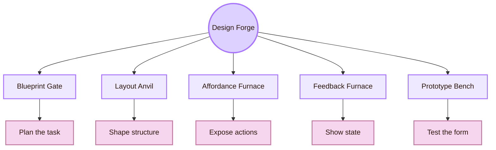

| Forge station | Interface material | HCI purpose |
|---|---|---|
| Blueprint Gate | User goals, task flows, requirements | Turn user research into a design plan |
| Layout Anvil | Spacing, alignment, grouping, hierarchy | Reduce search effort and support comprehension |
| Affordance Furnace | Buttons, links, fields, sliders, gestures | Make possible actions visible and interpretable |
| Feedback Furnace | Status, confirmation, loading, errors | Show what the system is doing |
| Navigation Rail | Menus, routes, breadcrumbs, labels | Help users know where they are and where they can go |
| Prototype Bench | Sketches, wireframes, clickable prototypes | Make the design testable |
| Refinement Loop | Evidence, critique, revision | Improve the interface through observation |

## The Blueprint Gate

The Blueprint Gate is where a designer translates user knowledge into an interface plan. It begins with a simple question: what must this interface help the user do?

A blueprint is not a finished screen. It is the design logic underneath the screen. It identifies the user goal, the task sequence, the information needed, the possible actions, the risk points, and the evidence needed to check whether the design works.

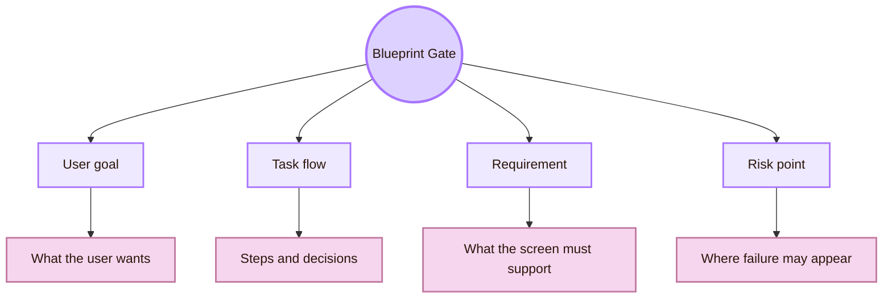

| Blueprint question | Design consequence |
|---|---|
| What is the user trying to accomplish? | The primary action should be visible and not buried. |
| What does the user need to know first? | The first screen should expose the right information hierarchy. |
| Where can the user make a mistake? | The interface should prevent error or provide recovery. |
| What must remain visible across steps? | State, progress, and selected options should not disappear. |
| What must be tested later? | The prototype should preserve the task path for evaluation. |

Human-centred design gives this gate an academic basis. ISO 9241-210 defines requirements and recommendations for human-centred design activities across the life cycle of interactive systems. The Stanford d.school tools are useful as practical learning material for moving from human needs to prototypes.

## The Layout Anvil

The Layout Anvil shapes space. It decides what appears first, what belongs together, what receives emphasis, and how the eye moves through the interface. Layout is cognitive organisation, not decoration.

Users interpret layout as meaning. Items placed together appear related. Larger headings appear more important. Repeated spacing creates rhythm. Alignment creates order. Broken alignment creates uncertainty. A good layout reduces searching and guessing.

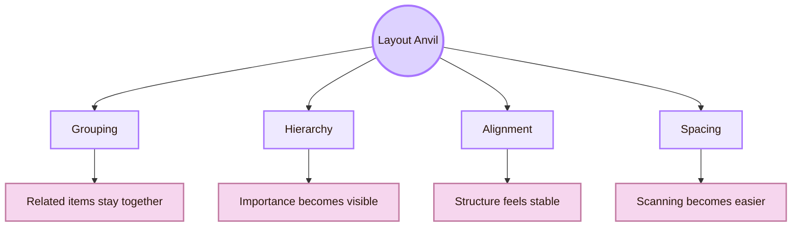

| Layout problem | User effect | Forge repair |
|---|---|---|
| Important action has weak visual priority | User misses the intended next step | Increase hierarchy through size, position, contrast, and label clarity |
| Related controls are separated | User scans repeatedly | Group related controls and content |
| Page has no clear sections | User cannot build a mental map | Use headings, spacing, and containers |
| Everything has equal visual weight | User cannot decide what matters | Establish primary, secondary, and tertiary hierarchy |
| Dense content has no breathing room | User feels overloaded | Use spacing and progressive disclosure |

The Layout Anvil connects to usability heuristics. Visibility of system status, recognition rather than recall, consistency, and error prevention all become visible through layout decisions.

## Visual Hierarchy

Visual hierarchy controls attention. It decides what the user sees first, what becomes secondary, and what stays in the background.

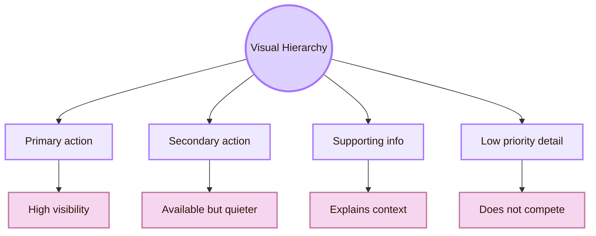

A login page should not make “Continue”, “Create account”, “Forgot password”, “Terms”, and “Help” visually identical. The hierarchy should express the task. If the main task is to continue, that action should be clearer than legal links. If account creation is the main path, that route should be primary.

## The Affordance Furnace

The Affordance Furnace shapes possible action. In interface design, it is not enough for an action to exist in the system. The action must be perceivable, interpretable, and safe to attempt.

A button should appear clickable. A text field should invite typing. A slider should suggest adjustment. A disabled control should make its condition understandable when the reason matters. A gesture should either be familiar or taught. A hidden affordance becomes a lost action. A false affordance becomes a trap.

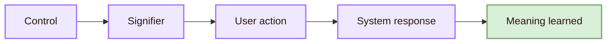

| Interface object | Affordance question | Design check |
|---|---|---|
| Button | Does it clearly invite pressing? | Shape, label, contrast, hover state, active state |
| Link | Does it clearly lead somewhere? | Text clarity, visual convention, destination meaning |
| Text field | Does it show the expected input? | Label, helper text, validation |
| Slider | Does it communicate range and adjustment? | Track, handle, values, feedback |
| Disabled action | Does the user understand why it is unavailable? | Disabled state with explanation when needed |

The furnace connects to [[01_Core_Area_HCI/001_Subareas/01_Understanding_the_User/Activities/Theory|Theory]], because affordances and signifiers are conceptual tools. It also connects to the [[../../03_Evaluating_the_Design/Overview|Observation Chamber]], because usability tests can reveal whether users actually perceive the intended actions.

## The Feedback Furnace

The Feedback Furnace shapes system response. Every user action changes the interaction state. The interface must show that change clearly enough for the user to continue, stop, correct, or recover.

Feedback is not only animation. It is the communication of state. A loading indicator tells the user to wait. A success message tells the user that an action worked. An error message tells the user what failed. A warning tells the user that an action has risk. A disabled state tells the user that an action is unavailable.

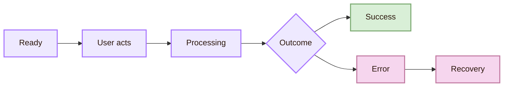

| Feedback state | User interpretation | Interface requirement |
|---|---|---|
| Ready | The system can receive action | Controls are visible and available |
| Loading | The system is working | Progress, spinner, skeleton, or message |
| Success | The action worked | Confirmation and next step |
| Error | Something failed | Plain explanation and repair path |
| Warning | Action has risk | Consequence shown before commitment |
| Empty state | Nothing exists yet | Explain what can be done next |

Nielsen Norman Group’s error-message guidance is useful here because effective error messages should be visible, constructive, and respectful of user effort. The same principle applies to other feedback states. Feedback should help the user act, not merely announce that something happened.

## The Navigation Rail

The Navigation Rail shapes movement. It answers three questions: where am I, where can I go, and what will I find there?

Good navigation is a wayfinding system. It includes labels, routes, active states, breadcrumbs, tabs, search, page titles, section headings, information scent, and the relation between local and global structure.

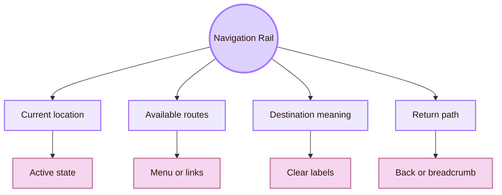

| Navigation failure | User behaviour | Repair |
|---|---|---|
| Labels are vague | User opens wrong sections | Use task-based, specific labels |
| Current location is hidden | User feels lost | Show active page and breadcrumbs |
| Routes are inconsistent | User cannot predict movement | Use stable navigation patterns |
| Important pages are buried | User relies on search or gives up | Improve hierarchy and entry points |
| Similar destinations compete | User hesitates | Clarify distinctions between routes |

In this vault, navigation is part of the learning experience. The five rooms of HCI should not feel like random folders. They should behave like a map: [[../../01_Understanding_the_User/Overview|Mind Library]] for concepts, [[../Overview|Interface Forge]] for making interfaces, [[../../03_Evaluating_the_Design/Overview|Observation Chamber]] for evidence, [[../../04_Accessibility_and_Accountability/Overview|Inclusive Gate]] for accessibility and accountability, and [[../../05_Human_AI_Interaction/Overview|Oracle Engine]] for human-AI systems.

## The Form and Error Bench

Forms are one of the most common places where interface design fails. A form asks the user to translate real life into system fields. If labels are unclear, input formats are hidden, errors appear too late, or recovery is difficult, the user experiences the system as hostile.

The Form and Error Bench shapes inputs, validation, helper text, constraints, recovery paths, and undo.

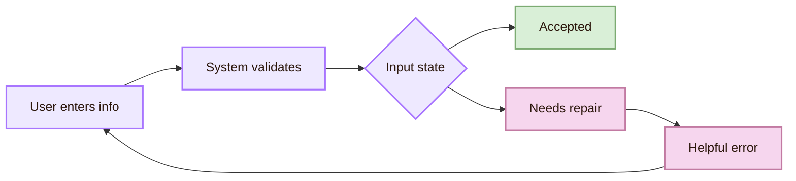

| Form element | Good design role | Failure mode |
|---|---|---|
| Label | Names the required information | User cannot interpret the field |
| Helper text | Explains format or expectation | User guesses and makes errors |
| Inline validation | Catches errors near the field | User submits repeatedly |
| Error message | Explains problem and repair | User sees blame but no solution |
| Confirmation | Shows completion | User repeats action unnecessarily |
| Undo | Allows safe recovery | User fears irreversible mistakes |

Error prevention is better than error repair. Repair still matters because users, systems, and contexts are imperfect. The interface should treat errors as design moments, not as user failures.

## The Responsive Frame

The Responsive Frame makes the interface adapt across devices, screen sizes, input modes, and contexts. A design that works on a large monitor may fail on a phone. A hover interaction may fail on touch. A dense dashboard may fail on a small screen. A desktop keyboard flow may fail for mobile users or screen reader users.

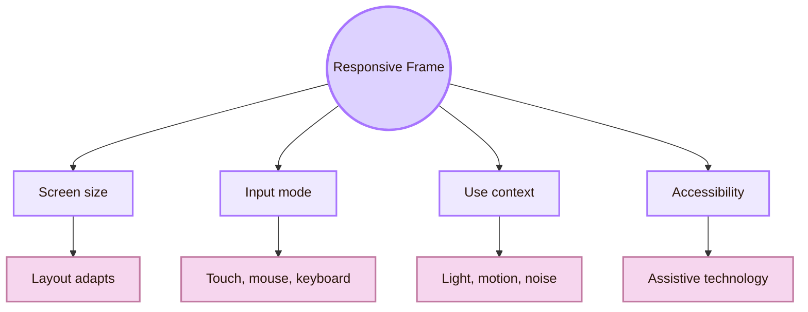

| Adaptation problem | Design risk | Forge response |
|---|---|---|
| Desktop layout copied to mobile | Content becomes cramped | Reflow hierarchy and simplify tasks |
| Hover-only controls | Touch users miss actions | Provide visible controls and touch states |
| Tiny targets | Motor errors increase | Increase target size and spacing |
| Motion-heavy transitions | Some users experience discomfort | Respect reduced-motion preferences |
| Low contrast in bright light | Reading becomes difficult | Test contrast and environmental context |

W3C accessibility guidance and WCAG 2.2 are important here because responsive design should remain perceivable, operable, understandable, and robust across contexts.

## The Design System Vault

The Design System Vault stores reusable interface materials. These include components, typography rules, colour tokens, spacing systems, interaction states, accessibility rules, documentation, and examples.

A design system is more than a UI kit. It is a shared contract between design, development, content, and accessibility. It helps teams build consistent interfaces without redesigning every button, form, modal, table, and navigation pattern from zero.

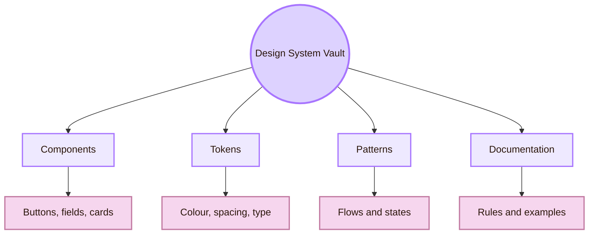

| Vault item | Purpose | Risk if missing |
|---|---|---|
| Component | Reusable interface object | Inconsistent buttons, forms, and states |
| Token | Reusable design value | Random colour, spacing, and typography |
| Pattern | Reusable interaction solution | Different flows solve the same problem differently |
| Documentation | Shared explanation | Designers and developers interpret components differently |
| Accessibility rule | Inclusive requirement | Components repeat barriers at scale |

Useful external routes include Material Design, Apple Human Interface Guidelines, and Microsoft Fluent 2. These sources are useful because they show how mature design systems document components, platform expectations, accessibility considerations, and interaction behaviour. They should be studied as references, not copied without context.

## The Prototype Bench

The Prototype Bench makes design testable. A prototype is a question made visible.

Low-fidelity prototypes are useful for structure and flow. Mid-fidelity wireframes are useful for hierarchy and content placement. High-fidelity prototypes are useful for interaction states, visual hierarchy, and user interpretation. Coded prototypes are useful when real constraints matter, such as keyboard navigation, responsive layout, performance, or assistive technology support.

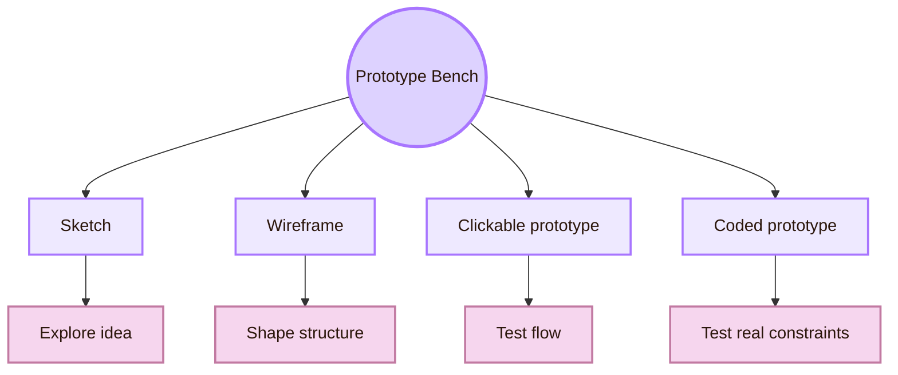

| Prototype type | Best question | Limitation |
|---|---|---|
| Sketch | Does the idea make structural sense? | Cannot test real interaction |
| Wireframe | Is hierarchy and layout understandable? | May hide visual and state problems |
| Clickable prototype | Can users follow the flow? | May fake system behaviour |
| Coded prototype | Does the interface work under real constraints? | More expensive to change |
| Accessibility prototype | Can diverse users operate it? | Requires assistive technology checks |

> [!important] Prototype rule
> A prototype should be only as detailed as the question requires. Too much polish can hide weak structure. Too little fidelity can make evaluation unreliable.

## The Refinement Loop

The forge does not end when a screen looks finished. It ends by returning to evidence. The Observation Chamber tests whether users understand, act, recover, and complete tasks. The Inclusive Gate checks whether the interface works across bodies, abilities, contexts, and technologies. The Oracle Engine matters when the interface includes AI, prediction, recommendation, generation, or automation.

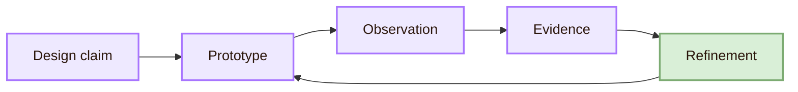

| Evidence from testing | Forge response |
|---|---|
| Users miss an action | Strengthen signifier, label, position, or hierarchy |
| Users repeat an action | Improve feedback or loading state |
| Users choose wrong route | Repair navigation labels or information architecture |
| Users abandon a form | Reduce field burden, improve validation, clarify errors |
| Keyboard users get stuck | Repair focus order and interactive semantics |
| AI output is overtrusted | Add uncertainty, source, review, and correction paths |

The refinement loop prevents the Interface Forge from becoming only visual production. It keeps design connected to the full HCI map: Mind Library concepts, Observation Chamber evidence, Inclusive Gate access, and Oracle Engine intelligence.

## Cognishire design check

This page can also guide the Cognishire vault itself. The vault is an interface, not just a collection of notes.

| Cognishire design question | What to check |
|---|---|
| Can users identify the five rooms? | Navigation labels, overview page, return links |
| Do fantasy names help or confuse? | Ask users to explain each room in normal language |
| Are diagrams readable in the theme? | Mermaid contrast, node spacing, text length |
| Do callouts support learning? | Check whether users read them or skip them |
| Is the vault accessible? | Keyboard navigation, readable contrast, image alternatives |
| Can GitHub viewers understand the structure? | README, setup instructions, source links |

## Forge Synthesis

Design inside the Interface Forge is practical interface construction. It turns user goals into blueprints, structure into layout, theory into affordance, action into feedback, movement into navigation, errors into recovery, and prototypes into testable design claims.

The strongest interface design is not the one with the most decoration. It is the one where the user can understand what matters, see what can be done, act safely, interpret system response, recover from failure, and move through the system with confidence. This chamber connects backward to [[01_Core_Area_HCI/001_Subareas/01_Understanding_the_User/Activities/Theory|Theory]], forward to [[../../03_Evaluating_the_Design/Overview|Observation Chamber]], across to [[../../04_Accessibility_and_Accountability/Overview|Inclusive Gate]], and outward to [[../../05_Human_AI_Interaction/Overview|Oracle Engine]] when intelligent systems become part of the interface.

## Academic anchors

| Route | Trusted source |
|---|---|
| Human-centred design | [ISO 9241-210](https://www.iso.org/standard/77520.html) |
| Prototyping and design process | [Stanford d.school Tools](https://dschool.stanford.edu/innovate/tools) |
| Usability heuristics | [NN/g: 10 Usability Heuristics](https://www.nngroup.com/articles/ten-usability-heuristics/) |
| Error messages | [NN/g: Error-Message Guidelines](https://www.nngroup.com/articles/error-message-guidelines/) |
| Accessibility principles | [W3C Web Accessibility Initiative](https://www.w3.org/WAI/) |
| Accessibility standards | [WCAG 2.2](https://www.w3.org/TR/WCAG22/) |
| Design system example | [Material Design](https://m3.material.io/) |
| Platform interface guidance | [Apple Human Interface Guidelines](https://developer.apple.com/design/human-interface-guidelines) |
| Microsoft design system | [Microsoft Fluent 2](https://fluent2.microsoft.design/) |
| Related learning chamber | [[01_Core_Area_HCI/001_Subareas/01_Understanding_the_User/Activities/Theory]] |
| Testing chamber | [[../../03_Evaluating_the_Design/Overview]] |
| Inclusion chamber | [[../../04_Accessibility_and_Accountability/Overview]] |
| AI chamber | [[../../05_Human_AI_Interaction/Overview]] |

^interface-forge-design-end
