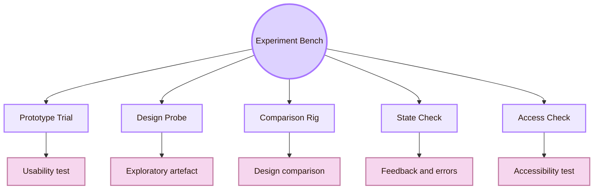
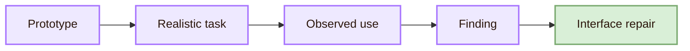
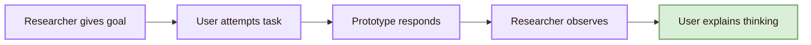
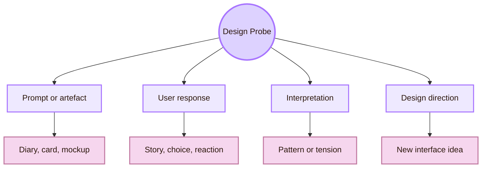
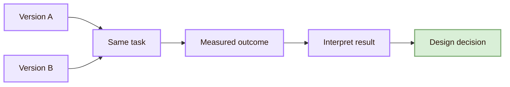
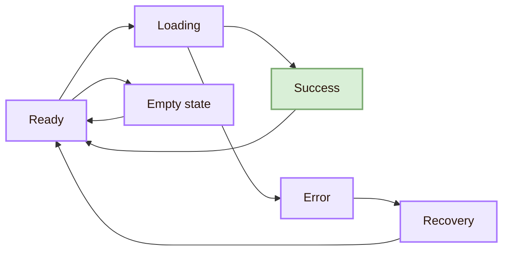
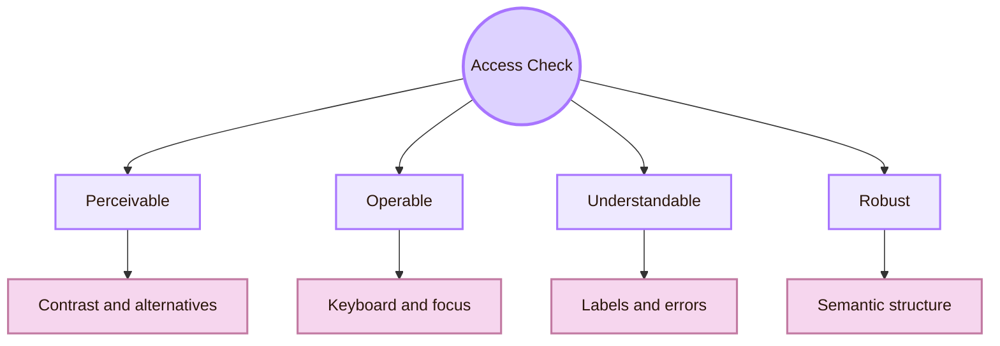
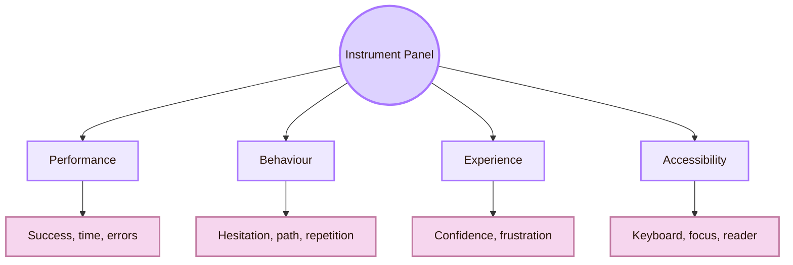
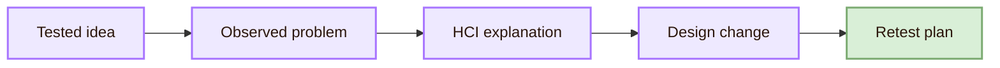
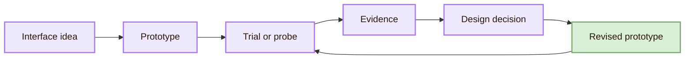

![[overvieww.gif|1000]]
# Experiment

> [!quote] Real-world translation
> **Real-life meaning:** a structured process for testing interface ideas before final implementation.

## Experiment Bench Map

## The Prototype Trial Bench

The Prototype Trial Bench is the usability test of an interface prototype. It asks users to attempt realistic tasks with a sketch, wireframe, clickable mockup, or coded prototype. The goal is to expose friction while the design is still cheap to change.

A prototype test treats the design as a research instrument. It does not ask only whether users like the screen. It asks whether they can understand the task, find the route, complete the action, notice feedback, and recover from problems.

- **Sketch:** best experimental question: Does the basic idea make sense?; risk if used badly: Users may react to missing detail rather than structure
- **Wireframe:** best experimental question: Is layout, hierarchy, and navigation understandable?; risk if used badly: Visual style and interaction states remain untested
- **Clickable prototype:** best experimental question: Can users follow the task flow?; risk if used badly: System behaviour may be fake or incomplete
- **Coded prototype:** best experimental question: Does the interface work under real constraints?; risk if used badly: It costs more to revise
- **Accessibility prototype:** best experimental question: Can users operate it with keyboard and assistive technology?; risk if used badly: It needs careful setup and testing tools

A useful prototype test has a clear task, a clear observation plan, and a reason for choosing that prototype fidelity. Too much polish can hide structural weakness. Too little fidelity can make the test unrealistic.

Useful routes: [NN/g Usability Testing 101](https://www.nngroup.com/articles/usability-testing-101/), [NN/g Which UX Research Methods to Use](https://www.nngroup.com/articles/which-ux-research-methods/), and [Stanford d.school Design Thinking Bootleg](https://dschool.stanford.edu/tools/design-thinking-bootleg).

## The Task Script Station

The Task Script Station is where a test becomes fair. A task script tells the participant what goal to pursue without revealing the exact interface path. If the task is too leading, it hides navigation problems. If it is too vague, it may test guessing rather than interface clarity.

- **Click the blue button to continue:** You want to submit your application. Show me how you would continue.
- **Open the accessibility page:** Find one trusted source that explains keyboard navigation.
- **Use the filter panel:** Find a course that matches your interest and explain why you chose it.
- **Press save:** You changed your settings. Make sure the changes are kept.

A good task creates a realistic reason to use the interface. The researcher then watches whether the user finds the route, understands labels, notices feedback, and repairs mistakes.

## The Design Probe Station

The Design Probe Station is exploratory. In HCI and design research, probes are used to invite responses from users before the final design direction is fixed. They can reveal context, values, routines, tensions, and possible futures.

Cultural probes were introduced by Gaver, Dunne, and Pacenti in the late 1990s as evocative materials for collecting fragmentary and inspirational responses from people’s lives. Technology probes, later described by Hutchinson and colleagues, use simple technologies to understand real use, field-test ideas, and inspire future design.

> [!important] Probe rule
> A probe is not a normal usability test. It is a way to provoke responses, reveal context, and generate design direction.

Useful routes: [ACM: Design: Cultural Probes](https://dl.acm.org/doi/10.1145/291224.291235), [ACM Interactions: Design: Cultural Probes](https://interactions.acm.org/archive/view/jan.-feb.-1999/design-cultural-probes1), [ACM: Technology Probes](https://dl.acm.org/doi/10.1145/642611.642616), and [ACM: Systematic Review of the Probes Method in HCI](https://dl.acm.org/doi/10.1145/3628516.3655814).

## The Comparison Rig

The Comparison Rig is the controlled comparison of interface alternatives. It is useful when the designer wants to compare two or more versions of a specific interface element or flow.

A/B testing is a quantitative method that compares design variations with a live audience and evaluates them against predetermined outcomes. It can be useful, but it has limits. A small improvement in one isolated metric does not always create a better whole experience.

- **Navigation label A vs B:** possible measure: Wrong turns, task completion, time; interpretation caution: Better wording may depend on user group
- **Button placement A vs B:** possible measure: First-click accuracy, hesitation; interpretation caution: Position may interact with visual hierarchy
- **Error message A vs B:** possible measure: Recovery time, repeated errors; interpretation caution: Faster recovery is not the same as lower frustration
- **Layout density A vs B:** possible measure: Scanning time, comprehension; interpretation caution: Dense layouts may help experts but harm beginners
- **AI confidence cue A vs B:** possible measure: Verification behaviour, trust calibration; interpretation caution: The goal is appropriate trust, not maximum trust

The Comparison Rig works best when the target variable is clear. If two versions change layout, colour, wording, and task instructions at the same time, the result becomes hard to interpret.

Useful routes: [NN/g A/B Testing 101](https://www.nngroup.com/articles/ab-testing/) and [NN/g A/B Testing, Usability Engineering, Radical Innovation](https://www.nngroup.com/articles/ab-testing-usability-engineering/).

## The State Check Bay

If the system is loading but gives no signal, the user may click repeatedly. If a save action succeeds without confirmation, the user may feel uncertain. If an error appears far from the relevant field, the user may not know what to fix.

- **Loading:** experimental check: Does the user know the system is processing?; evidence of failure: Repeated clicking, verbal uncertainty
- **Success:** experimental check: Does the user know the action worked?; evidence of failure: User checks again or repeats action
- **Error:** experimental check: Does the user know what to fix?; evidence of failure: Wrong repair, frustration, abandonment
- **Empty:** experimental check: Does the user know why nothing is shown?; evidence of failure: Confusion, search for missing content
- **Disabled:** experimental check: Does the user know why the action is unavailable?; evidence of failure: User tries unavailable path repeatedly

Useful routes: [NN/g 10 Usability Heuristics](https://www.nngroup.com/articles/ten-usability-heuristics/), [NN/g Error-Message Guidelines](https://www.nngroup.com/articles/error-message-guidelines/), and [Apple HIG: Feedback](https://developer.apple.com/design/human-interface-guidelines/feedback).

## The Access Check Bay

The Access Check Bay tests whether the interface can be operated by people using different abilities, devices, and technologies. In practice, this can include keyboard testing, screen reader testing, colour contrast inspection, focus order testing, automated checks, expert review, and user testing with disabled participants.

W3C describes accessibility evaluation as assessment, audit, and testing. WCAG 2.2 gives recommendations for making web content more accessible and organises guidance around perceivable, operable, understandable, and robust content.

- **Keyboard test:** real action: Navigate without a mouse; what it reveals: Whether controls are reachable and ordered
- **Focus order test:** real action: Move through interactive elements; what it reveals: Whether the path makes sense
- **Screen reader test:** real action: Listen to headings, labels, buttons, and states; what it reveals: Whether semantic meaning exists
- **Contrast check:** real action: Inspect text and UI contrast; what it reveals: Whether information is perceivable
- **Error recovery check:** real action: Try to repair invalid input; what it reveals: Whether error messages are understandable
- **Reduced motion check:** real action: Test motion-sensitive settings; what it reveals: Whether animation respects user needs

Useful routes: [W3C Evaluating Web Accessibility Overview](https://www.w3.org/WAI/test-evaluate/), [WCAG 2.2](https://www.w3.org/TR/WCAG22/), [W3C WCAG overview](https://www.w3.org/WAI/standards-guidelines/wcag/), and [WebAIM](https://webaim.org/).

## The Instrument Panel

The Instrument Panel defines what will be recorded. A prototype experiment without measures can become a loose conversation. Conversation can still help, but the System Design needs evidence that can guide design repair.

- **Performance:** example measure: task success, time, errors; what it helps decide: Whether the flow works efficiently
- **Behaviour:** example measure: hesitation, backtracking, repeated clicks; what it helps decide: Where the interface creates friction
- **Experience:** example measure: confidence, satisfaction, frustration; what it helps decide: How the interface feels to use
- **Accessibility:** example measure: focus order, labels, contrast, screen reader output; what it helps decide: Whether the interface includes diverse users
- **Interpretation:** example measure: user explanation after task; what it helps decide: Whether the user’s mental model is accurate

The instrument panel should not collect everything. It should collect what the design question requires. If the question is about navigation, wrong turns and route choice matter. If the question is about error messages, recovery time and repeated failures matter. If the question is about AI trust, verification behaviour and confidence matter.

## The Design Decision Log

The Design Decision Log is where evidence becomes design memory. It records what was tested, what was found, what changed, and why.

- **Tested idea:** Two navigation labels for the same route
- **Observed problem:** Users chose the wrong label three times
- **HCI explanation:** The label matched internal vocabulary, not user vocabulary
- **Design change:** Replace institutional label with task-based label
- **Retest plan:** Run a small prototype check with revised labels

This log prevents design changes from becoming random. It makes the interface easier to defend because each revision has a reason.

## Refinement Loop

When an interface idea fails, the failure is not wasted work. It shows which assumption was wrong: the label, layout, feedback, affordance, navigation structure, accessibility condition, or task model. The System Design improves when those failures become better interface form.

## Academic anchors

| Route | Trusted source |
|---|---|
| Usability testing | [NN/g: Usability Testing 101](https://www.nngroup.com/articles/usability-testing-101/) |
| UX research methods | [NN/g: Which UX Research Methods to Use](https://www.nngroup.com/articles/which-ux-research-methods/) |
| A/B testing | [NN/g: A/B Testing 101](https://www.nngroup.com/articles/ab-testing/) |
| A/B testing caution | [NN/g: A/B Testing, Usability Engineering, Radical Innovation](https://www.nngroup.com/articles/ab-testing-usability-engineering/) |
| Prototype and design process | [Stanford d.school: Design Thinking Bootleg](https://dschool.stanford.edu/tools/design-thinking-bootleg) |
| Cultural probes | [ACM: Design: Cultural Probes](https://dl.acm.org/doi/10.1145/291224.291235) |
| Technology probes | [ACM: Technology Probes](https://dl.acm.org/doi/10.1145/642611.642616) |
| Probes method review | [ACM: Systematic Review of the Probes Method in HCI](https://dl.acm.org/doi/10.1145/3628516.3655814) |
| Usability heuristics | [NN/g: 10 Usability Heuristics](https://www.nngroup.com/articles/ten-usability-heuristics/) |
| Error messages | [NN/g: Error-Message Guidelines](https://www.nngroup.com/articles/error-message-guidelines/) |
| Accessibility evaluation | [W3C: Evaluating Web Accessibility Overview](https://www.w3.org/WAI/test-evaluate/) |
| Accessibility standard | [WCAG 2.2](https://www.w3.org/TR/WCAG22/) |
| WCAG overview | [W3C: WCAG Overview](https://www.w3.org/WAI/standards-guidelines/wcag/) |
| Accessibility practice | [WebAIM](https://webaim.org/) |
| Interface feedback | [Apple HIG: Feedback](https://developer.apple.com/design/human-interface-guidelines/feedback) |

