# Experiment

Back to [[01_Core_Area_HCI/001_Subareas/02_System_Design/Overview|The Interface Forge]].

> [!abstract] Experiment Bench
> Experiment in the Interface Forge is the testing bench for interface ideas. It is where sketches, wireframes, clickable prototypes, coded components, design probes, and interaction patterns are checked against real user behaviour before they become final design decisions.

The [[01_Core_Area_HCI/001_Subareas/01_Understanding_the_User/Activities/Experiment|Mind Library experiment page]] explains evidence at a general HCI level. This page is narrower. It asks how interface builders test the things they are making: layout alternatives, navigation structures, feedback states, form designs, component behaviour, visual hierarchy, responsive patterns, and prototype flows.

In the Cognishire metaphor, the forge is a workshop. In real HCI, this page is about usability testing, prototype evaluation, design probes, comparative studies, accessibility checks, and evidence-based interface revision. The goal is not to prove that the first design was correct. The goal is to learn what the interface helps, what it blocks, and what must change.

> [!quote] Real-world translation
> **Fantasy name:** Experiment Bench.  
> **Real-life meaning:** a structured process for testing interface ideas before final implementation.

## Experiment Bench Map

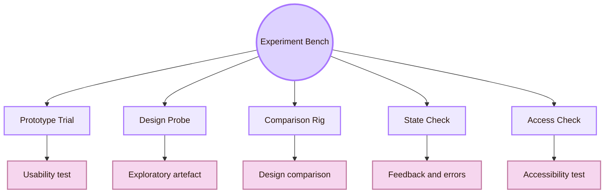

| Forge term | Real HCI method | What it tests |
|---|---|---|
| Prototype Trial | Moderated or unmoderated usability test | Whether users can complete tasks with a prototype |
| Design Probe | Cultural probe, technology probe, or design elicitation artefact | How users respond to possible futures, contexts, and values |
| Comparison Rig | A/B test or controlled design comparison | Whether one interface version performs better on defined outcomes |
| State Check | Feedback, loading, error, empty, and success-state evaluation | Whether users understand what the system is doing |
| Access Check | Accessibility audit and assistive technology test | Whether the interface works across abilities, devices, and technologies |
| Refinement Loop | Evidence-based iteration | What design must change next |

## The Prototype Trial Bench

The Prototype Trial Bench is the usability test of an interface prototype. It asks users to attempt realistic tasks with a sketch, wireframe, clickable mockup, or coded prototype. The goal is to expose friction while the design is still cheap to change.

A prototype test treats the design as a research instrument. It does not ask only whether users like the screen. It asks whether they can understand the task, find the route, complete the action, notice feedback, and recover from problems.

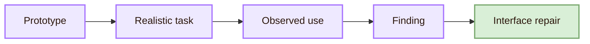

| Prototype level | Best experimental question | Risk if used badly |
|---|---|---|
| Sketch | Does the basic idea make sense? | Users may react to missing detail rather than structure |
| Wireframe | Is layout, hierarchy, and navigation understandable? | Visual style and interaction states remain untested |
| Clickable prototype | Can users follow the task flow? | System behaviour may be fake or incomplete |
| Coded prototype | Does the interface work under real constraints? | It costs more to revise |
| Accessibility prototype | Can users operate it with keyboard and assistive technology? | It needs careful setup and testing tools |

A useful prototype test has a clear task, a clear observation plan, and a reason for choosing that prototype fidelity. Too much polish can hide structural weakness. Too little fidelity can make the test unrealistic.

Useful routes: [NN/g Usability Testing 101](https://www.nngroup.com/articles/usability-testing-101/), [NN/g Which UX Research Methods to Use](https://www.nngroup.com/articles/which-ux-research-methods/), and [Stanford d.school Design Thinking Bootleg](https://dschool.stanford.edu/tools/design-thinking-bootleg).

## The Task Script Station

The Task Script Station is where a test becomes fair. A task script tells the participant what goal to pursue without revealing the exact interface path. If the task is too leading, it hides navigation problems. If it is too vague, it may test guessing rather than interface clarity.

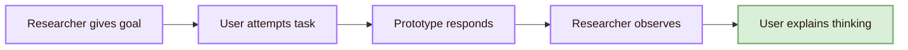

| Weak task | Stronger task |
|---|---|
| Click the blue button to continue. | You want to submit your application. Show me how you would continue. |
| Open the accessibility page. | Find one trusted source that explains keyboard navigation. |
| Use the filter panel. | Find a course that matches your interest and explain why you chose it. |
| Press save. | You changed your settings. Make sure the changes are kept. |

A good task creates a realistic reason to use the interface. The researcher then watches whether the user finds the route, understands labels, notices feedback, and repairs mistakes.

## The Design Probe Station

The Design Probe Station is exploratory. In HCI and design research, probes are used to invite responses from users before the final design direction is fixed. They can reveal context, values, routines, tensions, and possible futures.

Cultural probes were introduced by Gaver, Dunne, and Pacenti in the late 1990s as evocative materials for collecting fragmentary and inspirational responses from people’s lives. Technology probes, later described by Hutchinson and colleagues, use simple technologies to understand real use, field-test ideas, and inspire future design.

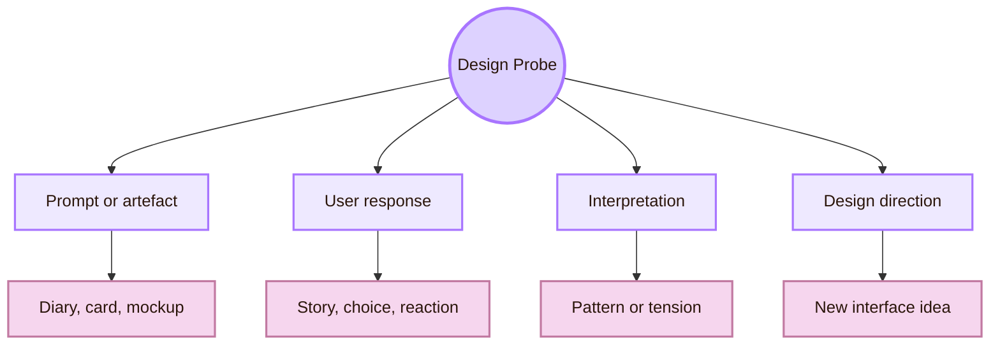

| Probe type | Real use | Example in Cognishire |
|---|---|---|
| Cultural probe | Explore user context, values, and feelings | Ask students to mark where they feel lost while learning HCI |
| Technology probe | Introduce a simple technology to study use and inspire design | Give users a small interactive map page and observe exploration |
| Visual design probe | Compare possible visual directions | Compare academic style, RPG style, and hybrid style |
| Data probe | Elicit how users want to inspect or correct data | Ask users how they would challenge an AI recommendation |
| Diary probe | Capture experience over time | Ask users to record when the vault helps or confuses them |

> [!important] Probe rule
> A probe is not a normal usability test. It is a way to provoke responses, reveal context, and generate design direction.

Useful routes: [ACM: Design: Cultural Probes](https://dl.acm.org/doi/10.1145/291224.291235), [ACM Interactions: Design: Cultural Probes](https://interactions.acm.org/archive/view/jan.-feb.-1999/design-cultural-probes1), [ACM: Technology Probes](https://dl.acm.org/doi/10.1145/642611.642616), and [ACM: Systematic Review of the Probes Method in HCI](https://dl.acm.org/doi/10.1145/3628516.3655814).

## The Comparison Rig

The Comparison Rig is the controlled comparison of interface alternatives. It is useful when the designer wants to compare two or more versions of a specific interface element or flow.

A/B testing is a quantitative method that compares design variations with a live audience and evaluates them against predetermined outcomes. It can be useful, but it has limits. A small improvement in one isolated metric does not always create a better whole experience.

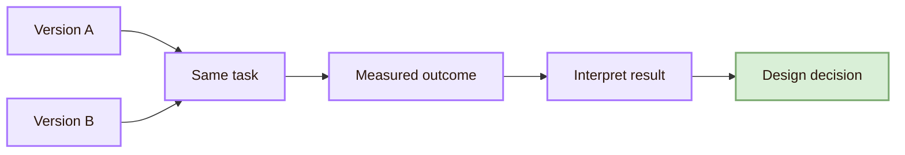

| Comparison target | Possible measure | Interpretation caution |
|---|---|---|
| Navigation label A vs B | Wrong turns, task completion, time | Better wording may depend on user group |
| Button placement A vs B | First-click accuracy, hesitation | Position may interact with visual hierarchy |
| Error message A vs B | Recovery time, repeated errors | Faster recovery is not the same as lower frustration |
| Layout density A vs B | Scanning time, comprehension | Dense layouts may help experts but harm beginners |
| AI confidence cue A vs B | Verification behaviour, trust calibration | The goal is appropriate trust, not maximum trust |

The Comparison Rig works best when the target variable is clear. If two versions change layout, colour, wording, and task instructions at the same time, the result becomes hard to interpret.

Useful routes: [NN/g A/B Testing 101](https://www.nngroup.com/articles/ab-testing/) and [NN/g A/B Testing, Usability Engineering, Radical Innovation](https://www.nngroup.com/articles/ab-testing-usability-engineering/).

## The State Check Bay

The State Check Bay tests whether users understand system status. Interfaces move through states: ready, loading, success, error, warning, empty, disabled, selected, and recovering.

If the system is loading but gives no signal, the user may click repeatedly. If a save action succeeds without confirmation, the user may feel uncertain. If an error appears far from the relevant field, the user may not know what to fix.

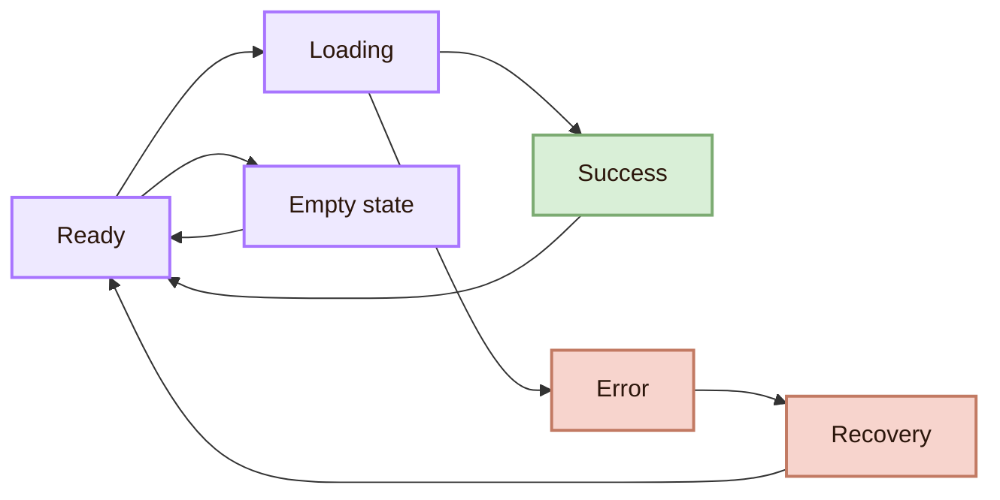

| State | Experimental check | Evidence of failure |
|---|---|---|
| Loading | Does the user know the system is processing? | Repeated clicking, verbal uncertainty |
| Success | Does the user know the action worked? | User checks again or repeats action |
| Error | Does the user know what to fix? | Wrong repair, frustration, abandonment |
| Empty | Does the user know why nothing is shown? | Confusion, search for missing content |
| Disabled | Does the user know why the action is unavailable? | User tries unavailable path repeatedly |
| Warning | Does the user understand the consequence? | User commits risky action unintentionally |

Useful routes: [NN/g 10 Usability Heuristics](https://www.nngroup.com/articles/ten-usability-heuristics/), [NN/g Error-Message Guidelines](https://www.nngroup.com/articles/error-message-guidelines/), and [Apple HIG: Feedback](https://developer.apple.com/design/human-interface-guidelines/feedback).

## The Access Check Bay

The Access Check Bay tests whether the interface can be operated by people using different abilities, devices, and technologies. In practice, this can include keyboard testing, screen reader testing, colour contrast inspection, focus order testing, automated checks, expert review, and user testing with disabled participants.

W3C describes accessibility evaluation as assessment, audit, and testing. WCAG 2.2 gives recommendations for making web content more accessible and organises guidance around perceivable, operable, understandable, and robust content.

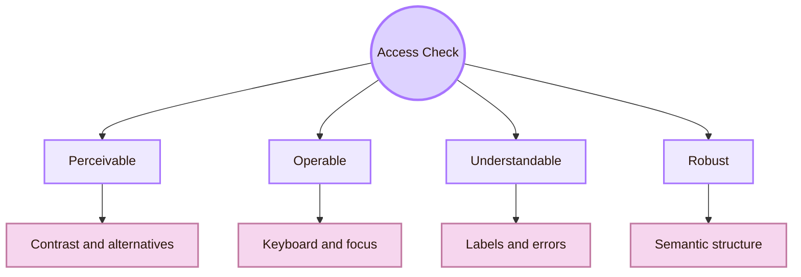

| Accessibility check | Real action | What it reveals |
|---|---|---|
| Keyboard test | Navigate without a mouse | Whether controls are reachable and ordered |
| Focus order test | Move through interactive elements | Whether the path makes sense |
| Screen reader test | Listen to headings, labels, buttons, and states | Whether semantic meaning exists |
| Contrast check | Inspect text and UI contrast | Whether information is perceivable |
| Error recovery check | Try to repair invalid input | Whether error messages are understandable |
| Reduced motion check | Test motion-sensitive settings | Whether animation respects user needs |

The Access Check Bay belongs in the Interface Forge because accessibility is built into components and states. If a button, dialog, form, or navigation component is inaccessible, every screen using it repeats the barrier.

Useful routes: [W3C Evaluating Web Accessibility Overview](https://www.w3.org/WAI/test-evaluate/), [WCAG 2.2](https://www.w3.org/TR/WCAG22/), [W3C WCAG overview](https://www.w3.org/WAI/standards-guidelines/wcag/), and [WebAIM](https://webaim.org/).

## The Instrument Panel

The Instrument Panel defines what will be recorded. A prototype experiment without measures can become a loose conversation. Conversation can still help, but the Forge needs evidence that can guide design repair.

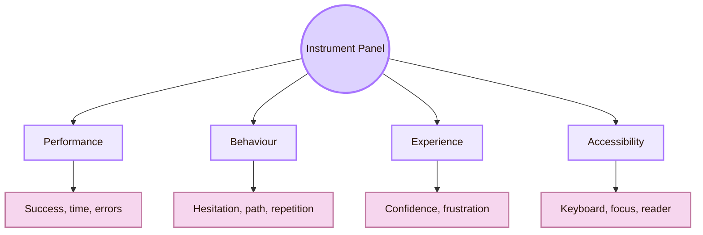

| Evidence layer | Example measure | What it helps decide |
|---|---|---|
| Performance | task success, time, errors | Whether the flow works efficiently |
| Behaviour | hesitation, backtracking, repeated clicks | Where the interface creates friction |
| Experience | confidence, satisfaction, frustration | How the interface feels to use |
| Accessibility | focus order, labels, contrast, screen reader output | Whether the interface includes diverse users |
| Interpretation | user explanation after task | Whether the user’s mental model is accurate |

The instrument panel should not collect everything. It should collect what the design question requires. If the question is about navigation, wrong turns and route choice matter. If the question is about error messages, recovery time and repeated failures matter. If the question is about AI trust, verification behaviour and confidence matter.

## The Design Decision Log

The Design Decision Log is where evidence becomes design memory. It records what was tested, what was found, what changed, and why.

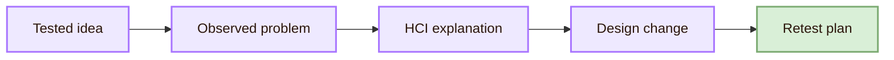

| Log entry | Example |
|---|---|
| Tested idea | Two navigation labels for the same route |
| Observed problem | Users chose the wrong label three times |
| HCI explanation | The label matched internal vocabulary, not user vocabulary |
| Design change | Replace institutional label with task-based label |
| Retest plan | Run a small prototype check with revised labels |

This log prevents design changes from becoming random. It makes the interface easier to defend because each revision has a reason.

## Mini Experiment: Testing the Interface Forge Page

This vault can test itself. The Interface Forge is content, but it is also an interface. A simple classroom experiment could evaluate whether the page helps students understand how interface design is tested.

| Protocol element | Study decision |
|---|---|
| Research aim | Test whether students can use the Interface Forge to understand interface evaluation |
| Participant group | First-year students unfamiliar with the vault |
| Prototype | Current Obsidian page with diagrams, links, and forge structure |
| Task one | Find the difference between prototype testing and design probes |
| Task two | Locate one accessibility check and explain why it matters |
| Task three | Choose which method would test a button placement change |
| Evidence | Time, wrong turns, comments, confidence, and link use |
| Output | Redesign priorities for headings, diagrams, links, and examples |

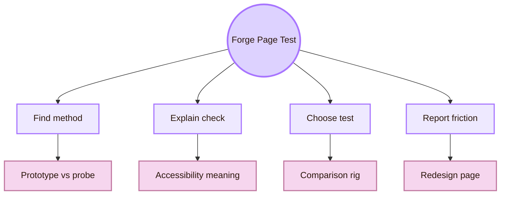

## Refinement Loop

The final step is refinement. The Interface Forge should not treat experiments as judgement from outside. Experiment is part of making.

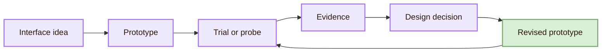

When an interface idea fails, the failure is not wasted work. It shows which assumption was wrong: the label, layout, feedback, affordance, navigation structure, accessibility condition, or task model. The Forge improves when those failures become better interface form.

## Cognishire application

For Cognishire, the Experiment Bench should test whether the RPG structure helps learning or adds extra work.

| Design question | Possible method |
|---|---|
| Do students understand the forge metaphor? | Short explanation task |
| Do diagrams clarify the page? | Compare page section with and without diagram |
| Can users find the right HCI room? | Navigation task |
| Do source links improve trust? | Ask users to identify the most academic source |
| Is the visual style readable? | Contrast check, keyboard check, and user feedback |
| Does the page support revision? | Use a design decision log after each test |

The important point is modesty. A test with a few classmates does not prove global usability. It gives local formative evidence. That evidence can still improve the vault.

## Forge Synthesis

Experiment inside the Interface Forge is practical design evidence. It tests prototypes, probes design possibilities, compares alternatives, checks interface states, verifies accessibility, and records design decisions. Its real meaning is disciplined evaluation before interface decisions become fixed.

This page connects backward to [[01_Core_Area_HCI/001_Subareas/01_Understanding_the_User/Activities/Theory]], because every experiment needs a design concept. It connects across to [[01_Core_Area_HCI/001_Subareas/02_System_Design/Activities/Design|Design]], because every finding should become a design change. It connects outward to the [[01_Core_Area_HCI/001_Subareas/03_Evaluating_the_Design/Overview|Observation Chamber]], where research methods become more formal, and to the [[01_Core_Area_HCI/001_Subareas/04_Accessibility_and_Accountability/Overview|Inclusive Gate]], where accessibility and ethics are treated more deeply.

## Academic anchors

| Route | Trusted source |
|---|---|
| Usability testing | [NN/g: Usability Testing 101](https://www.nngroup.com/articles/usability-testing-101/) |
| UX research methods | [NN/g: Which UX Research Methods to Use](https://www.nngroup.com/articles/which-ux-research-methods/) |
| A/B testing | [NN/g: A/B Testing 101](https://www.nngroup.com/articles/ab-testing/) |
| A/B testing caution | [NN/g: A/B Testing, Usability Engineering, Radical Innovation](https://www.nngroup.com/articles/ab-testing-usability-engineering/) |
| Prototype and design process | [Stanford d.school: Design Thinking Bootleg](https://dschool.stanford.edu/tools/design-thinking-bootleg) |
| Cultural probes | [ACM: Design: Cultural Probes](https://dl.acm.org/doi/10.1145/291224.291235) |
| Technology probes | [ACM: Technology Probes](https://dl.acm.org/doi/10.1145/642611.642616) |
| Probes method review | [ACM: Systematic Review of the Probes Method in HCI](https://dl.acm.org/doi/10.1145/3628516.3655814) |
| Usability heuristics | [NN/g: 10 Usability Heuristics](https://www.nngroup.com/articles/ten-usability-heuristics/) |
| Error messages | [NN/g: Error-Message Guidelines](https://www.nngroup.com/articles/error-message-guidelines/) |
| Accessibility evaluation | [W3C: Evaluating Web Accessibility Overview](https://www.w3.org/WAI/test-evaluate/) |
| Accessibility standard | [WCAG 2.2](https://www.w3.org/TR/WCAG22/) |
| WCAG overview | [W3C: WCAG Overview](https://www.w3.org/WAI/standards-guidelines/wcag/) |
| Accessibility practice | [WebAIM](https://webaim.org/) |
| Interface feedback | [Apple HIG: Feedback](https://developer.apple.com/design/human-interface-guidelines/feedback) |

^experiment-interface-forge-end
