![[regularShow.jpg|1000]]
# Theory

This page is therefore about design-facing theory. It does not replace general HCI theory. It applies it to screens, flows, components, feedback, and systems. It explains why layout guides attention, why controls need signifiers, why system state must be visible, why navigation must support wayfinding, and why accessibility must be built into interface components.

> [!quote] System Design theory rule
> Interface theory is useful when it tells the designer what to make visible, what to constrain, what to test, and what to repair.

## Theory System Design Map

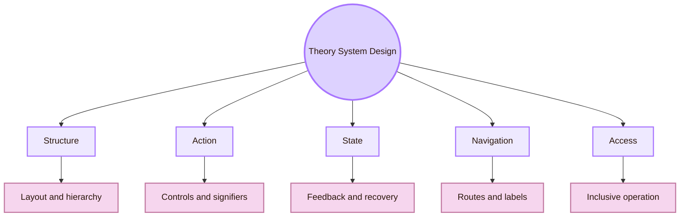

## Structure Theory: The Screen as an Organised Field

Visual hierarchy guides the eye toward important elements. In interface design, this is not only aesthetic. It affects whether users find the main action, understand the page, and predict the next step.

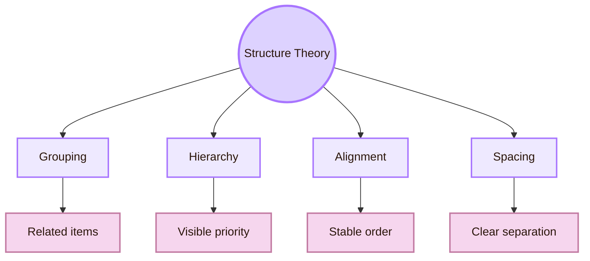

- **Proximity:** interface meaning: Nearby items are interpreted as related; failure pattern: Users group unrelated actions together
- **Similarity:** interface meaning: Similar-looking items are read as similar in function; failure pattern: Decorative elements look interactive
- **Contrast:** interface meaning: Strong difference signals importance; failure pattern: Primary actions disappear into the page
- **Alignment:** interface meaning: Ordered placement communicates structure; failure pattern: The page feels accidental or unstable
- **Progressive disclosure:** interface meaning: Detail appears when needed; failure pattern: Users are overloaded too early

The practical theory is that the interface should reduce unnecessary interpretation. If users must scan repeatedly, compare too many equal elements, or guess what belongs together, the structure is forcing them to do extra cognitive work.

Useful routes: [NN/g on visual hierarchy](https://www.nngroup.com/articles/visual-hierarchy-ux-definition/), [NN/g on visual design principles](https://www.nngroup.com/articles/principles-visual-design/), and [Apple Human Interface Guidelines: Layout](https://developer.apple.com/design/human-interface-guidelines/layout).

## Action Theory: Controls Must Explain Themselves

Action theory concerns how users understand possible actions. A control works well only when the user can recognise what it is, what it does, and whether it is available.

Affordances are the possible actions a system offers. Signifiers are the visible or perceivable cues that show those actions. A button may technically afford clicking, but if it does not look clickable, the action is hidden. A card may look tappable but do nothing, creating a false affordance. A disabled button may prevent action but fail to explain why the action is unavailable.

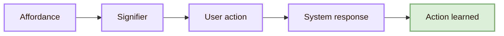

- **Button:** theoretical job: Makes a command visible; interface check: Label, contrast, state, and click target are clear
- **Link:** theoretical job: Signals movement to another place or resource; interface check: Text describes the destination
- **Text field:** theoretical job: Invites input; interface check: Label and expected format are visible
- **Toggle:** theoretical job: Represents binary state; interface check: Current state and change effect are clear
- **Slider:** theoretical job: Represents adjustable value; interface check: Range, value, and effect are understandable
- **Disabled control:** theoretical job: Communicates unavailable action; interface check: Reason and path to availability are shown when useful

The core theory is that users should not need accidental exploration to find basic actions. Exploration can be useful, but essential functions need strong signifiers, predictable behaviour, and immediate feedback.

Useful routes: [NN/g signifiers topic](https://www.nngroup.com/topic/signifiers/), [NN/g design-pattern guidelines](https://www.nngroup.com/articles/design-pattern-guidelines/), and Donald Norman’s writing on affordances and signifiers.

## State Theory: Interfaces Are Always Changing

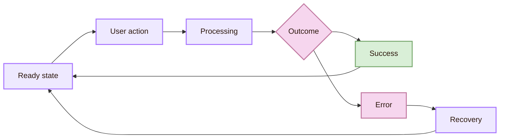

- **Idle:** user question: What can I do now?; design requirement: Available actions are visible
- **Loading:** user question: Is the system working?; design requirement: Progress or processing feedback appears
- **Success:** user question: Did it work?; design requirement: Confirmation and next step are clear
- **Error:** user question: What failed, and how do I repair it?; design requirement: Message is visible, constructive, and specific
- **Empty:** user question: Why is nothing here?; design requirement: Explain the state and offer the next action
- **Disabled:** user question: Why can I not do this?; design requirement: Show the condition or requirement when useful

State theory prevents silent change. If a system changes without clear feedback, the user must guess. That can create repeated clicking, duplicate submissions, anxiety, and mistrust.

Useful routes: [Apple HIG: Feedback](https://developer.apple.com/design/human-interface-guidelines/feedback), [NN/g 10 usability heuristics](https://www.nngroup.com/articles/ten-usability-heuristics/), and [NN/g error-message guidelines](https://www.nngroup.com/articles/error-message-guidelines/).

## Navigation Theory: Interfaces Need Wayfinding

Navigation theory treats the interface as a place the user moves through. The user needs to know where they are, what paths exist, what each path means, and how to return.

Navigation is more than a menu. It includes page titles, breadcrumbs, tabs, active states, search, internal links, labels, categories, cards, and information scent. Information scent means that users can predict whether a route is likely to lead to the desired content.

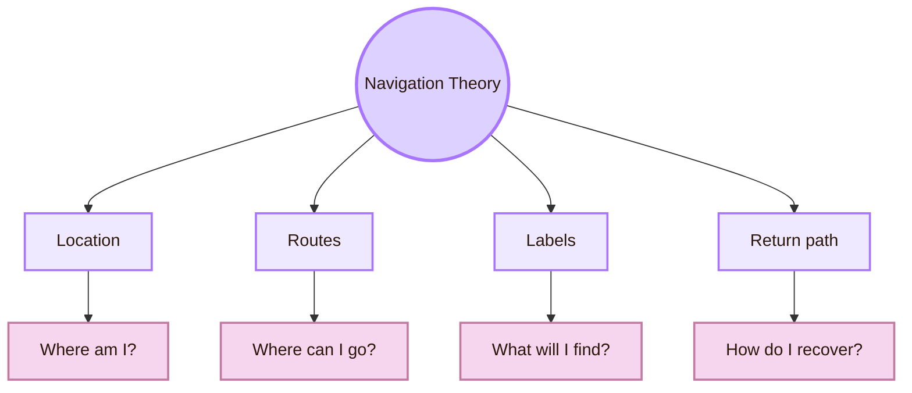

- **Current location is hidden:** user interpretation: “I am lost.”; repair: Add active states, headings, or breadcrumbs
- **Labels are vague:** user interpretation: “I cannot predict what is inside.”; repair: Use task-based, user-centred language
- **Too many routes compete:** user interpretation: “Everything looks equally important.”; repair: Prioritise primary paths
- **Back path is unclear:** user interpretation: “I might lose my work.”; repair: Support safe return, undo, and saved state
- **Search is the only usable navigation:** user interpretation: “The structure is not learnable.”; repair: Improve categories and information architecture

## Feedback and Error Theory: Failure Is Part of the Interface

Error theory begins with respect for the user. Errors are not only user mistakes. They often reveal mismatches between system expectations and human behaviour. A good interface prevents avoidable errors, detects problems early, and helps users recover without blame.

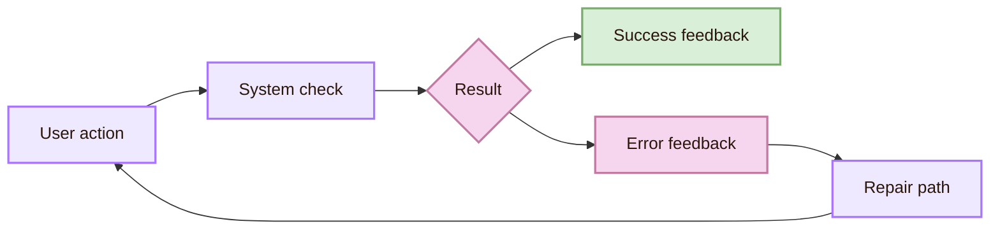

- **Prevention:** interface theory: Avoid the error before it happens (example: Disable impossible dates)
- **Visibility:** interface theory: Show the problem where it occurs (example: Inline field message)
- **Constructive language:** interface theory: Explain repair, not blame (example: “Use at least 8 characters”)
- **Efficiency:** interface theory: Let users fix without restarting (example: Keep valid fields filled)
- **Recovery:** interface theory: Provide undo or safe reversal (example: Restore deleted item)

NN/g’s error-message guidance recommends messages that are visible, constructive, and respectful of user effort. This belongs in theory because error design expresses the system’s attitude toward the user. A hostile error message makes the user feel like the problem. A good error message treats the problem as repairable.

Useful routes: [NN/g error-message guidelines](https://www.nngroup.com/articles/error-message-guidelines/) and [NN/g error-message scoring rubric](https://www.nngroup.com/articles/error-messages-scoring-rubric/).

## Component Theory: Interfaces Are Built From Reusable Parts

Component theory explains how modern interfaces scale. A product is not built from isolated screens. It is built from repeated components: buttons, fields, cards, dialogs, tabs, navigation bars, lists, tables, tooltips, modals, and forms.

When components are consistent, users can transfer learning from one part of the system to another. When components change behaviour randomly, the interface becomes unstable. Consistency is therefore cognitive, not only visual.

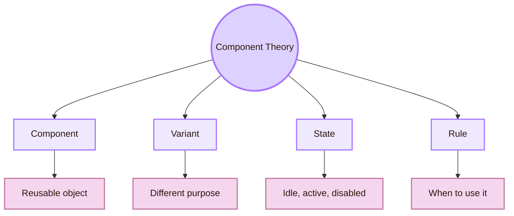

- **Component:** what it controls: The reusable interface object (why: Prevents rebuilding and inconsistency)
- **Variant:** what it controls: Different forms of that object (why: Supports different contexts without chaos)
- **State:** what it controls: The object’s behaviour over time (why: Shows availability, feedback, and response)
- **Token:** what it controls: The design value behind appearance (why: Keeps colour, spacing, and type consistent)
- **Documentation:** what it controls: The rule for use (why: Prevents misuse by designers and developers)

Useful routes: [Material Design components](https://m3.material.io/components), [Material Design foundations](https://m3.material.io/foundations), [Microsoft Fluent 2](https://fluent2.microsoft.design/), and [Fluent 2 design tokens](https://fluent2.microsoft.design/design-tokens).

## Design System Theory: Consistency Becomes Infrastructure

A design system is a theory of consistency made operational. It defines the shared language of an interface: components, tokens, patterns, accessibility rules, motion, content style, layout principles, and documentation.

Design systems matter because interface design often happens across teams, platforms, and time. Without shared rules, every screen becomes a new negotiation. With a stable system, designers and developers can build new flows while preserving predictable interaction.

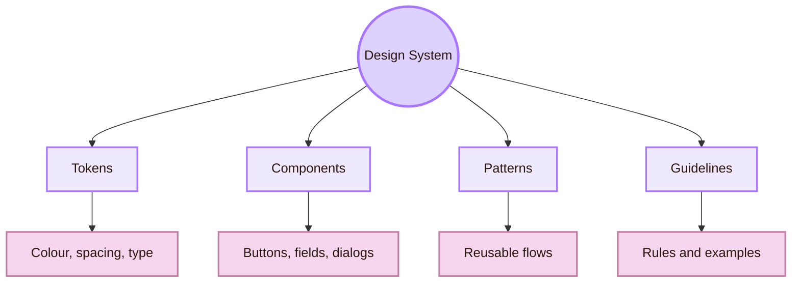

- **Token:** theory role: Stores a reusable design value; practical question: Is this colour or spacing used consistently?
- **Component:** theory role: Stores a reusable interface object; practical question: Does this button behave the same everywhere?
- **Pattern:** theory role: Stores a recurring interaction solution; practical question: Do similar tasks follow similar flows?
- **Guideline:** theory role: Stores the rule behind usage; practical question: Does the team know when to use this element?
- **Accessibility rule:** theory role: Stores inclusive requirements; practical question: Does every component support keyboard and screen reader use?

Fluent 2 describes design tokens as flexible and accessibility-supporting, including support for light, dark, high-contrast, and branded themes. Material Design describes components and foundations as reusable resources for building user interfaces. These sources are useful because they show how interface theory becomes maintainable infrastructure.

## Accessibility Theory Inside the System Design

WCAG organises accessibility around four principles: perceivable, operable, understandable, and robust. In interface construction, these principles become practical questions about every component and state.

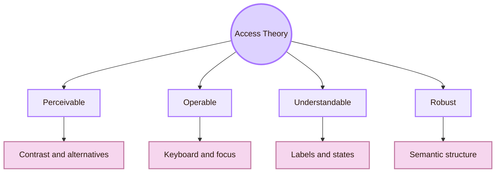

- **Perceivable:** interface theory: Users must be able to access information through available senses; design check: Contrast, labels, captions, alternatives
- **Operable:** interface theory: Users must be able to use controls through available input methods; design check: Keyboard access, focus order, target size
- **Understandable:** interface theory: Users must be able to predict and interpret interaction; design check: Clear language, consistent states, helpful errors
- **Robust:** interface theory: Interface must work with assistive technologies; design check: Semantic HTML, ARIA when needed, reliable structure

Accessibility cannot be added only at the end because inaccessible components reproduce barriers everywhere they are reused. A design system with inaccessible buttons, fields, dialogs, and menus becomes a barrier factory.

Useful routes: [W3C Accessibility Principles](https://www.w3.org/WAI/fundamentals/accessibility-principles/), [WCAG 2.2](https://www.w3.org/TR/WCAG22/), [WCAG overview](https://www.w3.org/WAI/standards-guidelines/wcag/), and [Fluent 2 accessibility](https://fluent2.microsoft.design/accessibility).

## Responsive Theory: One Interface, Many Conditions

Responsive theory explains how an interface remains coherent across screen sizes, input modes, user settings, contexts, and accessibility needs. A desktop layout cannot simply be squeezed into mobile form. A hover interaction cannot be assumed on touch. A dense data screen may not work under time pressure or poor lighting.

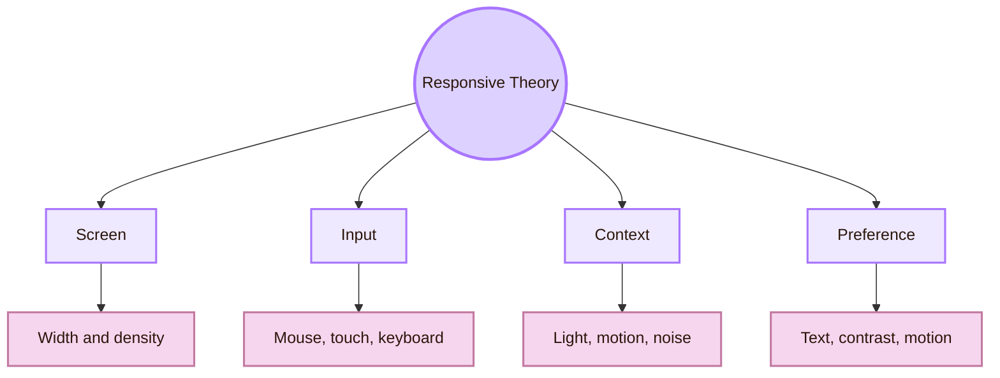

Material Design’s layout guidance discusses layout foundations and interaction patterns. Apple’s layout guidance emphasises designing for different Apple platforms and contexts. The theory is that responsiveness is not only resizing. It preserves task meaning across conditions.

## Platform Theory: Interfaces Live Inside Ecosystems

Platform theory explains why the same interface idea may need different expression on different systems. Users bring expectations from their operating system, device, and application ecosystem. A control that feels natural on iOS may feel foreign on desktop web. A keyboard shortcut may be expected by expert desktop users but irrelevant to a touch-first mobile flow.

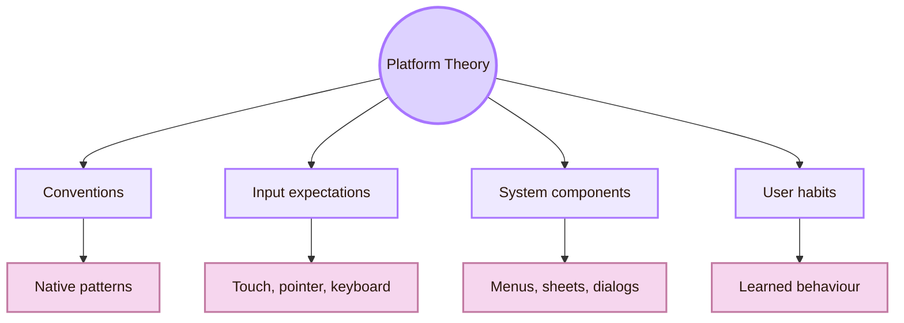

Platform guidance should not be copied mechanically, but it must be understood. Apple’s Human Interface Guidelines, Material Design, and Microsoft Fluent show how mature ecosystems document components, motion, layout, accessibility, and system behaviour.

## Theory-to-Prototype Loop

The final purpose of interface theory is not memorisation. It is better making. A theory becomes useful only when it generates a design choice that can be prototyped and tested.

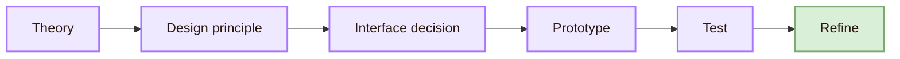

- **Visual hierarchy:** prototype decision: Make the primary action visually dominant; test question: Do users notice the correct action first?
- **Signifiers:** prototype decision: Add clearer button states and labels; test question: Do users understand what is clickable?
- **Feedback:** prototype decision: Add loading, success, and error states; test question: Do users know what happened?
- **Navigation:** prototype decision: Add active state and clearer labels; test question: Can users find the target page?
- **Accessibility:** prototype decision: Add keyboard focus and semantic labels; test question: Can assistive technology users operate the flow?
- **Design system:** prototype decision: Use consistent components; test question: Do repeated patterns behave predictably?

## Academic anchors

| Route | Trusted source |
|---|---|
| Human-centred design | [ISO 9241-210](https://www.iso.org/standard/77520.html) |
| Human-centred design context | [NIST Human-Centered Design](https://www.nist.gov/itl/iad/visualization-and-usability-group/human-factors-human-centered-design) |
| Usability heuristics | [NN/g: 10 Usability Heuristics](https://www.nngroup.com/articles/ten-usability-heuristics/) |
| Visual hierarchy | [NN/g: Visual Hierarchy in UX](https://www.nngroup.com/articles/visual-hierarchy-ux-definition/) |
| Visual design principles | [NN/g: 5 Principles of Visual Design](https://www.nngroup.com/articles/principles-visual-design/) |
| Interface patterns | [NN/g: Design-Pattern Guidelines](https://www.nngroup.com/articles/design-pattern-guidelines/) |
| Error messages | [NN/g: Error-Message Guidelines](https://www.nngroup.com/articles/error-message-guidelines/) |
| Accessibility principles | [W3C Accessibility Principles](https://www.w3.org/WAI/fundamentals/accessibility-principles/) |
| Accessibility standard | [WCAG 2.2](https://www.w3.org/TR/WCAG22/) |
| Material design foundations | [Material Design 3 Foundations](https://m3.material.io/foundations) |
| Material components | [Material Design 3 Components](https://m3.material.io/components) |
| Apple platform guidance | [Apple Human Interface Guidelines](https://developer.apple.com/design/human-interface-guidelines) |
| Apple feedback guidance | [Apple HIG: Feedback](https://developer.apple.com/design/human-interface-guidelines/feedback) |
| Microsoft design system | [Fluent 2 Design System](https://fluent2.microsoft.design/) |
| Design tokens | [Fluent 2 Design Tokens](https://fluent2.microsoft.design/design-tokens) |
| Prototyping and design practice | [Stanford d.school Tools](https://dschool.stanford.edu/innovate/tools) |

