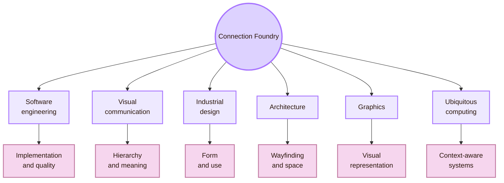
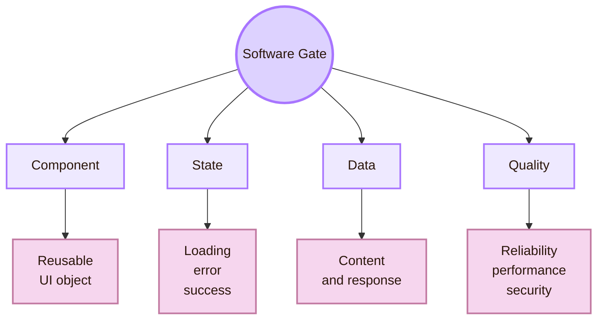
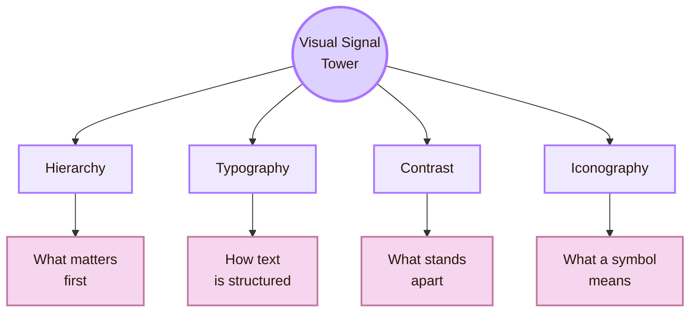
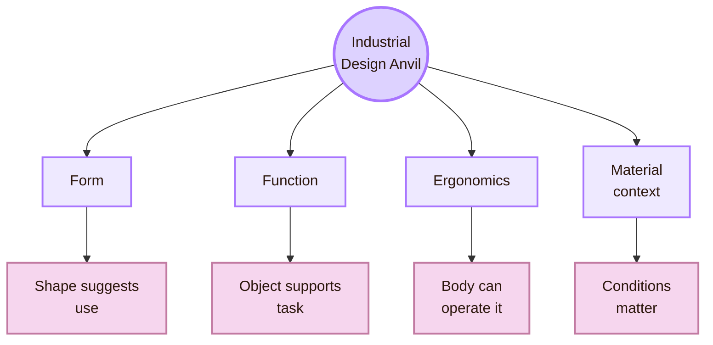
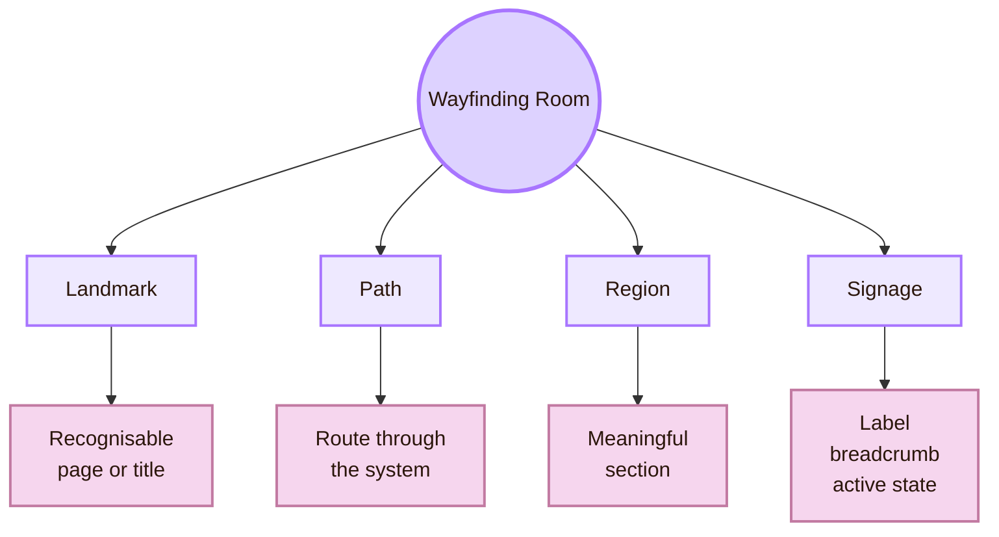
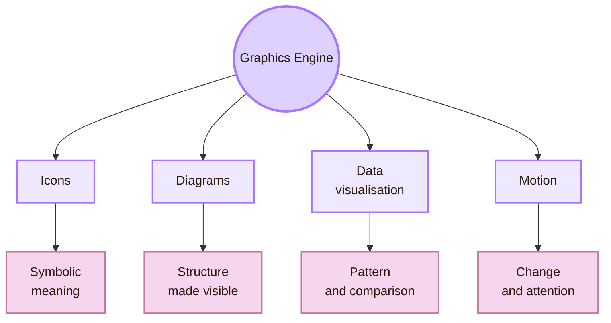
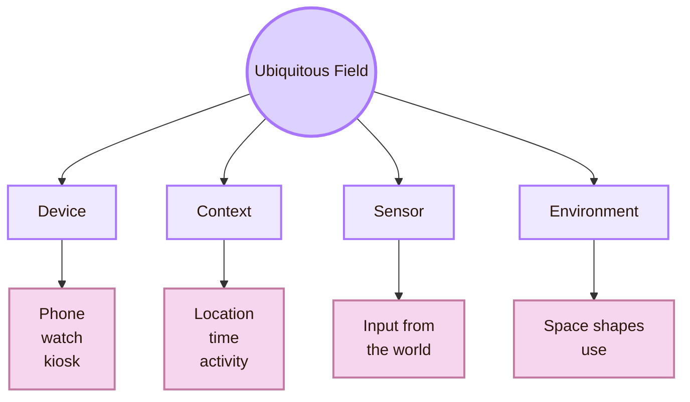
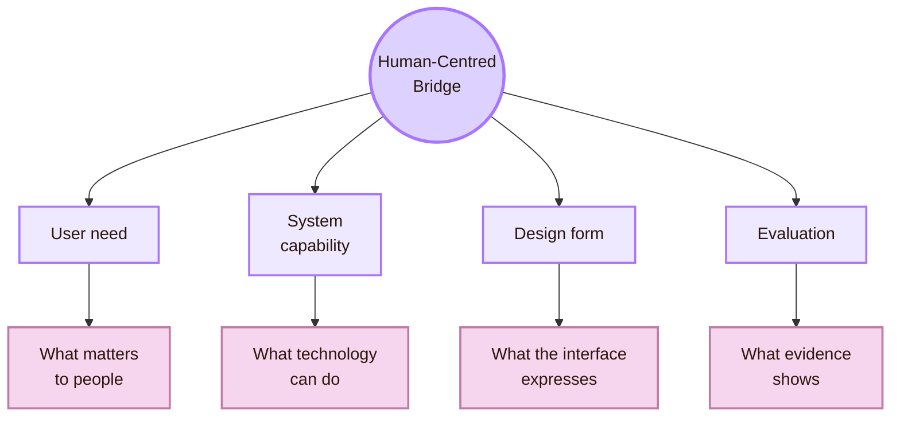
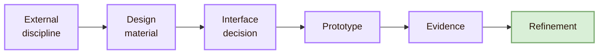
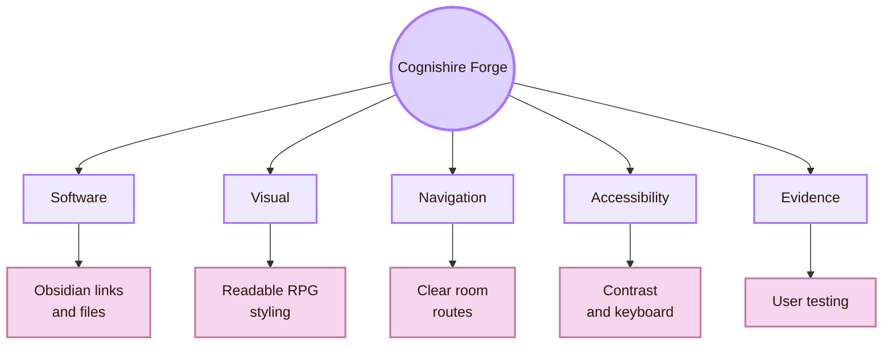

![[people_japan.gif|1000]]
# Connections

Back to [[Overview|The Interface Forge]].

> [!abstract] Connection Foundry
> Connections in the Interface Forge means mapping the real disciplines that shape interface construction. Interface design draws from software engineering, visual communication, industrial design, architecture, graphics, ubiquitous computing, accessibility, and human-centred systems.

The fantasy name is **Connection Foundry**. The real-life meaning is **interdisciplinary interface construction**.

This page explains how other fields give practical material to the Interface Forge. Software engineering explains implementation, state, and reliability. Visual communication explains hierarchy and meaning. Industrial design explains form, body, and device use. Architecture explains wayfinding and structure. Graphics explains visual representation. Ubiquitous computing explains interaction across devices and environments. Human-centred systems connect these fields back to user needs, evidence, accessibility, and ethics.

> [!quote] Foundry rule
> An interface is a meeting point between software behaviour, visual meaning, physical context, user goals, and social consequences.

## Connection map

| Forge route | Real-life area | What it contributes to interface design |
|---|---|---|
| Software Gate | Software engineering | Components, system states, reliability, constraints, maintainability |
| Visual Signal Tower | Visual communication | Hierarchy, contrast, typography, visual rhythm, attention |
| Product Anvil | Industrial design | Form, function, ergonomics, physical interaction, device context |
| Spatial Blueprint Room | Architecture and wayfinding | Navigation, structure, place, orientation, signage |
| Graphics Engine Room | Graphics and visual computing | Icons, diagrams, charts, motion, representation |
| Ambient Field | Ubiquitous computing | Context-aware systems, sensors, devices, environments |
| Human Systems Bridge | Human-centred systems | User needs, accessibility, evaluation, ethics, evidence |

## Software Engineering Gate

The Software Engineering Gate connects interface design to implementation. A screen is produced by code, components, data models, APIs, events, permissions, errors, performance limits, and deployment decisions.

Many interface qualities depend on system structure. A loading state requires the system to expose processing state. Undo requires action history. A helpful form error requires input validation. A design system requires reusable components. Accessibility requires semantic structure, keyboard behaviour, and reliable focus management.

| Interface decision | Software engineering dependency | Risk if ignored |
|---|---|---|
| Loading indicator | System exposes processing state | User thinks the system is frozen |
| Undo | System preserves action history | User fears irreversible mistakes |
| Form validation | System checks input and returns specific errors | User receives vague or late failure |
| Reusable component | Code shares behaviour across screens | Interface becomes inconsistent |
| Accessibility state | Code exposes roles, names, and focus order | Assistive technology cannot interpret the interface |
| Responsive layout | Front-end adapts to screen and input constraints | Interface breaks across devices |

The connection is practical. Interface design and software architecture constrain each other. A designer can draw an ideal interaction, but the implementation determines whether that interaction can be reliable, accessible, maintainable, and fast.

Useful route: the ACM EICS conference focuses on engineering interactive computing systems and their user interfaces.

## Visual Communication Tower

The Visual Communication Tower connects the forge to typography, hierarchy, contrast, composition, icons, colour, and information design. This area makes meaning visible.

Visual communication is not decoration. It arranges visual information so users can understand priority, relation, identity, state, and action. A good interface uses hierarchy to show what matters first. It uses contrast to separate actions. It uses typography to create levels of meaning. It uses icons carefully, usually with labels when meaning may be unclear.

| Visual communication concept | Interface role | Practical test |
|---|---|---|
| Hierarchy | Guides attention to the most important element | Can the user identify the primary action quickly? |
| Typography | Structures reading and meaning | Can headings, body text, and labels be distinguished? |
| Contrast | Separates elements and supports readability | Does important text remain perceivable? |
| Iconography | Communicates action or category | Does the user understand the icon without guessing? |
| Composition | Organises the page as a whole | Does the interface feel structured rather than scattered? |

Nielsen Norman Group defines visual hierarchy as a way of guiding the eye to the most important elements through contrast, scale, grouping, and placement. In the Interface Forge, this means visual choices should support task understanding.

## Industrial Design Anvil

The Industrial Design Anvil connects interface design to physical products, ergonomics, materials, device use, and the relation between form and function. This matters because interfaces appear on phones, watches, kiosks, medical devices, cars, appliances, controllers, wearables, and public systems.

Industrial design asks how the object supports use. Where does the hand go? What can the body reach? How does the user hold the device? What does the physical form suggest? Which input is comfortable, precise, and safe?

| Industrial design question | Interface implication |
|---|---|
| How is the device held? | Controls must fit thumb reach, grip, and posture |
| What environment is used? | Brightness, contrast, size, and durability matter |
| What bodily effort is required? | Interaction should avoid fatigue, strain, and unsafe movement |
| What does the form suggest? | Physical affordances should match digital affordances |
| What happens under stress? | Controls should remain clear and recoverable |

This connection is important for mobile interfaces, wearable devices, tangible interfaces, public kiosks, VR or AR devices, and embedded systems. It also connects to [[../04_Accessibility_and_Accountability/Overview|Inclusive Gate]], because body assumptions can exclude users.

## Architecture and Wayfinding Room

The Architecture and Wayfinding Room connects interface design to space, path, structure, orientation, and signage. Architecture is useful as an analogy because buildings and interfaces both need to help people understand where they are, what routes exist, and how to reach a goal.

In digital systems, this becomes information architecture. A website, app, or Obsidian vault can feel like a building. Pages are rooms. Menus are corridors. Breadcrumbs are signs. Search is a guide. Page titles mark location. Broken navigation feels like being lost in a badly planned building.

| Architectural idea | Interface translation | Example |
|---|---|---|
| Landmark | Recognisable point in the system | Overview page, section title, dashboard |
| Path | Route from one place to another | Navigation menu, wizard flow, internal links |
| Region | Meaningful zone | Mind Library, Interface Forge, Observation Chamber |
| Signage | Information that guides movement | Labels, breadcrumbs, active states |
| Exit | Safe way to leave or reverse | Back button, cancel, undo, home route |

This vault uses architectural thinking directly. The Interface Forge should not become a pile of disconnected notes. It should feel like a workshop with zones: [[Activities/Theory|Theory]] for principles, [[Activities/Design|Design]] for construction, [[Activities/Experiment|Experiment]] for tests, and this page for interdisciplinary links.

## Graphics Engine Room

The Graphics Engine Room connects interface design to images, icons, diagrams, data visualisation, rendering, motion, and graphical representation. Many interfaces communicate through visual form before users read detailed text.

A graph can make data understandable or misleading. An icon can clarify an action or create ambiguity. A diagram can reduce cognitive effort or become decoration. Motion can guide attention or distract. The theory here is simple: graphics should serve interpretation.

| Graphic element | Good use | Bad use |
|---|---|---|
| Icon | Reinforces a familiar action or category | Replaces text when meaning is unclear |
| Diagram | Explains relation or process | Adds visual noise without explanation |
| Chart | Shows comparison, pattern, or distribution | Distorts data or hides uncertainty |
| Motion | Shows transition, continuity, or state change | Distracts, delays, or harms sensitive users |
| Image | Creates recognition or context | Becomes decorative clutter |

The Graphics Engine connects strongly to this vault because many pages use Mermaid diagrams. A diagram should stay only when it helps the reader understand structure, relation, sequence, or decision. A decorative or unreadable diagram should be replaced with a table.

## Ubiquitous Computing Field

The Ubiquitous Computing Field connects the Interface Forge to systems that move beyond one screen. Mark Weiser’s classic vision of ubiquitous computing described computation becoming embedded into everyday life rather than staying isolated in one machine.

In modern interface design, this appears through wearables, smart homes, location-based systems, ambient displays, connected devices, sensors, voice assistants, and context-aware interfaces.

| Ubicomp condition | Interface consequence |
|---|---|
| Multiple devices | Interaction must stay coherent across screens |
| Context awareness | System behaviour may change by place, time, or activity |
| Sensors | Users need to understand what is detected and why |
| Ambient display | Information must be perceivable without becoming intrusive |
| Voice or gesture input | Feedback and recovery become more important |
| Smart environment | Privacy and control become interface problems |

This connection matters because interface design is no longer only desktop GUI design. The Interface Forge must account for interaction that is mobile, ambient, embodied, distributed, and sometimes invisible.

## Human-Centred Systems Bridge

The Human-Centred Systems Bridge connects all previous areas back to people. Software engineering can make a system reliable. Visual communication can make a page readable. Industrial design can make a device usable. Architecture can make navigation coherent. Graphics can make structure visible. Ubiquitous computing can make systems context-aware. HCI asks whether this actually serves human goals.

ISO 9241-210 describes human-centred design as an approach to interactive systems that focuses on users, their needs and requirements, and applies human factors, ergonomics, and usability knowledge. NIST also frames human-centred design around usability, usefulness, accessibility, sustainability, and the reduction of adverse effects on health, safety, and performance.

| Discipline | Without human-centred connection | With human-centred connection |
|---|---|---|
| Software engineering | System works technically but confuses users | System behaviour is reliable and interpretable |
| Visual communication | Page looks attractive but lacks task clarity | Visual structure supports user goals |
| Industrial design | Object is impressive but uncomfortable | Physical form supports use and access |
| Architecture | Structure exists but users feel lost | Navigation supports orientation |
| Graphics | Visuals decorate but do not explain | Graphics reduce cognitive effort |
| Ubiquitous computing | System senses context but feels intrusive | Context awareness remains controllable and understandable |

## Connection pattern

The Interface Forge uses a repeated connection pattern. A real-world discipline contributes material. HCI translates that material into interface form. Experiments test whether the result works.

| External discipline | Design material | Interface decision |
|---|---|---|
| Software engineering | State, data, architecture, components | Loading states, validation, reusable UI components |
| Visual communication | Hierarchy, contrast, typography | Page layout, button priority, readable structure |
| Industrial design | Ergonomics, physical form, device context | Target size, touch zones, physical-digital affordance |
| Architecture | Wayfinding, structure, spatial logic | Navigation systems, breadcrumbs, overview pages |
| Graphics | Symbols, charts, diagrams, motion | Icons, diagrams, data visualisation, transitions |
| Ubiquitous computing | Context, sensors, environments | Adaptive interfaces, ambient feedback, privacy controls |
| Human-centred systems | Needs, usability, accessibility, ethics | Design requirements, testing plans, inclusive patterns |

## Mini application: Cognishire Interface Forge

Cognishire can use the Connection Foundry as a practical design checklist. The Interface Forge should behave like a usable learning interface, not only as a collection of notes.

| Cognishire design concern | Connected discipline | Design action |
|---|---|---|
| Obsidian links must not break | Software engineering | Use consistent file names and relative links |
| RPG theme must stay readable | Visual communication | Keep strong contrast and clear hierarchy |
| Rooms must feel navigable | Architecture | Use overviews, breadcrumbs, and clear route labels |
| Diagrams must help learning | Graphics | Keep diagrams compact and readable |
| Theme must not exclude users | Accessibility | Test contrast, focus, motion, and screen readability |
| Pages must improve through feedback | Human-centred systems | Test with students and revise based on evidence |

## Academic anchors

| Route | Trusted source |
|---|---|
| Human-centred design | [ISO 9241-210](https://www.iso.org/standard/77520.html) |
| Human-centred systems | [NIST Human Centered Design](https://www.nist.gov/itl/iad/visualization-and-usability-group/human-factors-human-centered-design) |
| HCI research venue | [ACM CHI Conference](https://dl.acm.org/conference/chi) |
| Engineering interactive systems | [ACM EICS](https://eics.acm.org/) |
| Designing interactive systems | [ACM DIS](https://dis.acm.org/) |
| Visual hierarchy | [NN/g: Visual Hierarchy in UX](https://www.nngroup.com/articles/visual-hierarchy-ux-definition/) |
| Visual design principles | [NN/g: Visual Design Principles](https://www.nngroup.com/articles/principles-visual-design/) |
| Information architecture | [NN/g: Information Architecture Study Guide](https://www.nngroup.com/articles/ia-study-guide/) |
| Breadcrumbs and wayfinding | [NN/g: Breadcrumbs](https://www.nngroup.com/articles/breadcrumbs/) |
| Accessibility standards | [WCAG 2.2](https://www.w3.org/TR/WCAG22/) |
| Accessibility principles | [W3C Accessibility Principles](https://www.w3.org/WAI/fundamentals/accessibility-principles/) |
| Material design foundations | [Material Design 3](https://m3.material.io/) |
| Apple interface guidance | [Apple Human Interface Guidelines](https://developer.apple.com/design/human-interface-guidelines) |
| Apple motion guidance | [Apple HIG: Motion](https://developer.apple.com/design/human-interface-guidelines/motion) |
| Ubiquitous computing | [Mark Weiser: The Computer for the 21st Century](https://dl.acm.org/doi/10.1145/329124.329126) |

^connections-interface-forge-end
