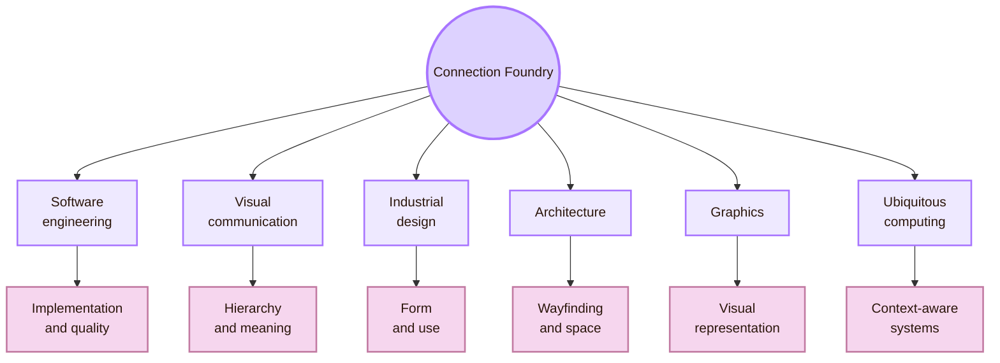
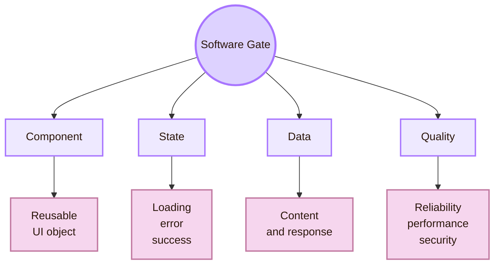
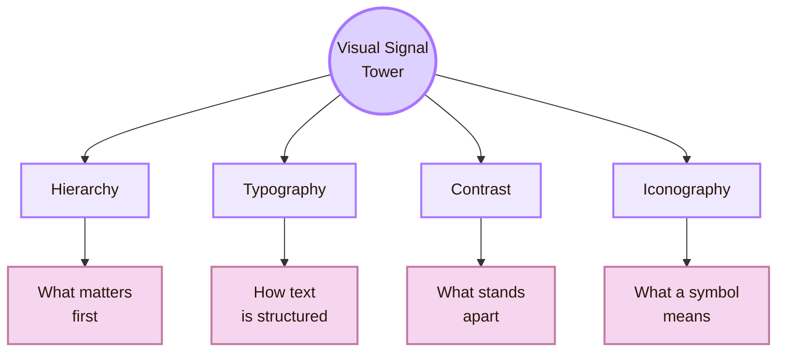
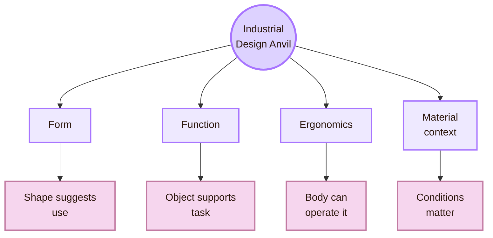
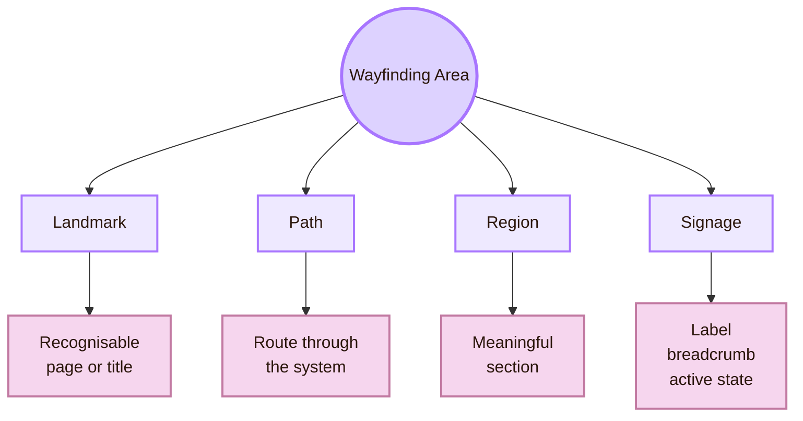
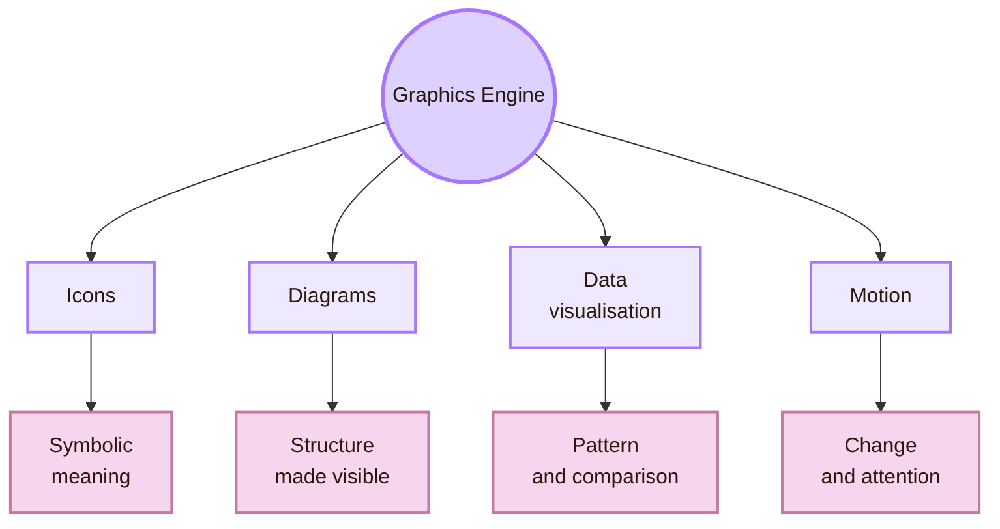
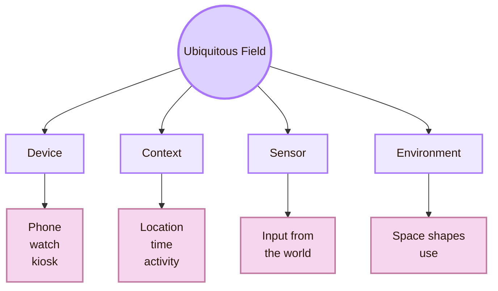
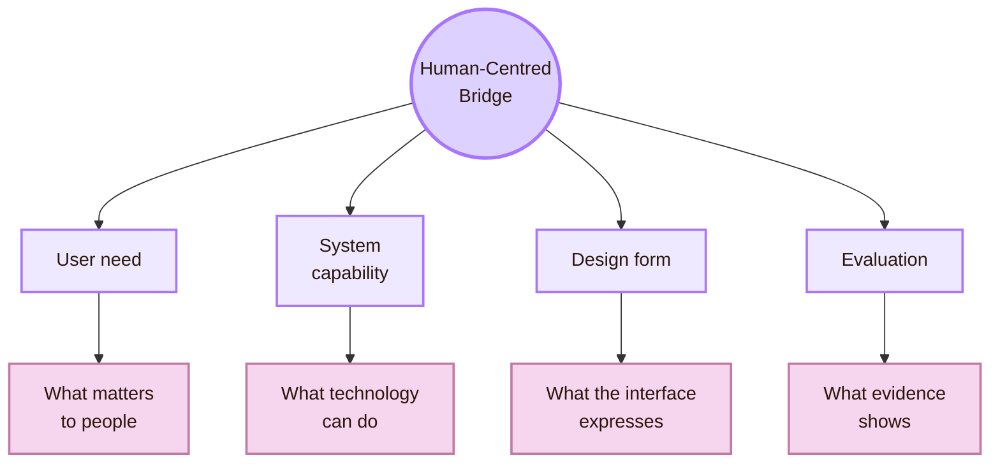
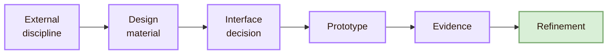

![[house.png|1000]]
# Connections

> [!quote] Foundry rule
> An interface is a meeting point between software behaviour, visual meaning, physical context, user goals, and social consequences.

## Connection map

## Software Engineering Gate

The Software Engineering Gate connects interface design to implementation. A screen is produced by code, components, data models, APIs, events, permissions, errors, performance limits, and deployment decisions.

Many interface qualities depend on system structure. A loading state requires the system to expose processing state. Undo requires action history. A helpful form error requires input validation. A design system requires reusable components. Accessibility requires semantic structure, keyboard behaviour, and reliable focus management.

- **Loading indicator:** software engineering dependency: System exposes processing state; risk if ignored: User thinks the system is frozen
- **Undo:** software engineering dependency: System preserves action history; risk if ignored: User fears irreversible mistakes
- **Form validation:** software engineering dependency: System checks input and returns specific errors; risk if ignored: User receives vague or late failure
- **Reusable component:** software engineering dependency: Code shares behaviour across screens; risk if ignored: Interface becomes inconsistent
- **Accessibility state:** software engineering dependency: Code exposes roles, names, and focus order; risk if ignored: Assistive technology cannot interpret the interface
- **Responsive layout:** software engineering dependency: Front-end adapts to screen and input constraints; risk if ignored: Interface breaks across devices

The connection is practical. Interface design and software architecture constrain each other. A designer can draw an ideal interaction, but the implementation determines whether that interaction can be reliable, accessible, maintainable, and fast.

Useful route: the ACM EICS conference focuses on engineering interactive computing systems and their user interfaces.

## Visual Communication Tower

The Visual Communication Tower connects the system design process to typography, hierarchy, contrast, composition, icons, colour, and information design. This area makes meaning visible.

Visual communication is not decoration. It arranges visual information so users can understand priority, relation, identity, state, and action. A good interface uses hierarchy to show what matters first. It uses contrast to separate actions. It uses typography to create levels of meaning. It uses icons carefully, usually with labels when meaning may be unclear.

- **Hierarchy:** interface role: Guides attention to the most important element; practical test: Can the user identify the primary action quickly?
- **Typography:** interface role: Structures reading and meaning; practical test: Can headings, body text, and labels be distinguished?
- **Contrast:** interface role: Separates elements and supports readability; practical test: Does important text remain perceivable?
- **Iconography:** interface role: Communicates action or category; practical test: Does the user understand the icon without guessing?
- **Composition:** interface role: Organises the page as a whole; practical test: Does the interface feel structured rather than scattered?

## Industrial Design Anvil

The Industrial Design Anvil connects interface design to physical products, ergonomics, materials, device use, and the relation between form and function. This matters because interfaces appear on phones, watches, kiosks, medical devices, cars, appliances, controllers, wearables, and public systems.

Industrial design asks how the object supports use. Where does the hand go? What can the body reach? How does the user hold the device? What does the physical form suggest? Which input is comfortable, precise, and safe?

- **How is the device held?:** Controls must fit thumb reach, grip, and posture
- **What environment is used?:** Brightness, contrast, size, and durability matter
- **What bodily effort is required?:** Interaction should avoid fatigue, strain, and unsafe movement
- **What does the form suggest?:** Physical affordances should match digital affordances
- **What happens under stress?:** Controls should remain clear and recoverable

## Architecture and Wayfinding Area

The Architecture and Wayfinding Area connects interface design to space, path, structure, orientation, and signage. Architecture is useful as an analogy because buildings and interfaces both need to help people understand where they are, what routes exist, and how to reach a goal.

## Graphics Engine Area

The Graphics Engine Area connects interface design to images, icons, diagrams, data visualisation, rendering, motion, and graphical representation. Many interfaces communicate through visual form before users read detailed text.

A graph can make data understandable or misleading. An icon can clarify an action or create ambiguity. A diagram can reduce cognitive effort or become decoration. Motion can guide attention or distract. The theory here is simple: graphics should serve interpretation.

- **Icon:** good use: Reinforces a familiar action or category; bad use: Replaces text when meaning is unclear
- **Diagram:** good use: Explains relation or process; bad use: Adds visual noise without explanation
- **Chart:** good use: Shows comparison, pattern, or distribution; bad use: Distorts data or hides uncertainty
- **Motion:** good use: Shows transition, continuity, or state change; bad use: Distracts, delays, or harms sensitive users
- **Image:** good use: Creates recognition or context; bad use: Becomes decorative clutter

## Ubiquitous Computing Field

In modern interface design, this appears through wearables, smart homes, location-based systems, ambient displays, connected devices, sensors, voice assistants, and context-aware interfaces.

- **Multiple devices:** Interaction must stay coherent across screens
- **Context awareness:** System behaviour may change by place, time, or activity
- **Sensors:** Users need to understand what is detected and why
- **Ambient display:** Information must be perceivable without becoming intrusive
- **Voice or gesture input:** Feedback and recovery become more important
- **Smart environment:** Privacy and control become interface problems

## Human-Centred Systems Bridge

The Human-Centred Systems Bridge connects all previous areas back to people. Software engineering can make a system reliable. Visual communication can make a page readable. Industrial design can make a device usable. Architecture can make navigation coherent. Graphics can make structure visible. Ubiquitous computing can make systems context-aware. HCI asks whether this actually serves human goals.

ISO 9241-210 describes human-centred design as an approach to interactive systems that focuses on users, their needs and requirements, and applies human factors, ergonomics, and usability knowledge. NIST also frames human-centred design around usability, usefulness, accessibility, sustainability, and the reduction of adverse effects on health, safety, and performance.

- **Software engineering:** without human-centred connection: System works technically but confuses users; with human-centred connection: System behaviour is reliable and interpretable
- **Visual communication:** without human-centred connection: Page looks attractive but lacks task clarity; with human-centred connection: Visual structure supports user goals
- **Industrial design:** without human-centred connection: Object is impressive but uncomfortable; with human-centred connection: Physical form supports use and access
- **Architecture:** without human-centred connection: Structure exists but users feel lost; with human-centred connection: Navigation supports orientation
- **Graphics:** without human-centred connection: Visuals decorate but do not explain; with human-centred connection: Graphics reduce cognitive effort
- **Ubiquitous computing:** without human-centred connection: System senses context but feels intrusive; with human-centred connection: Context awareness remains controllable and understandable

## Connection pattern

- **Software engineering:** design material: State, data, architecture, components; interface decision: Loading states, validation, reusable UI components
- **Visual communication:** design material: Hierarchy, contrast, typography; interface decision: Page layout, button priority, readable structure
- **Industrial design:** design material: Ergonomics, physical form, device context; interface decision: Target size, touch zones, physical-digital affordance
- **Architecture:** design material: Wayfinding, structure, spatial logic; interface decision: Navigation systems, breadcrumbs, overview pages
- **Graphics:** design material: Symbols, charts, diagrams, motion; interface decision: Icons, diagrams, data visualisation, transitions
- **Ubiquitous computing:** design material: Context, sensors, environments; interface decision: Adaptive interfaces, ambient feedback, privacy controls
- **Human-centred systems:** design material: Needs, usability, accessibility, ethics; interface decision: Design requirements, testing plans, inclusive patterns

## Academic anchors

| Route | Trusted source |
|---|---|
| Human-centred design | [ISO 9241-210](https://www.iso.org/standard/77520.html) |
| Human-centred systems | [NIST Human Centered Design](https://www.nist.gov/itl/iad/visualization-and-usability-group/human-factors-human-centered-design) |
| HCI research venue | [ACM CHI Conference](https://dl.acm.org/conference/chi) |
| Engineering interactive systems | [ACM EICS](https://eics.acm.org/) |
| Designing interactive systems | [ACM DIS](https://dis.acm.org/) |
| Visual hierarchy | [NN/g: Visual Hierarchy in UX](https://www.nngroup.com/articles/visual-hierarchy-ux-definition/) |
| Visual design principles | [NN/g: Visual Design Principles](https://www.nngroup.com/articles/principles-visual-design/) |
| Information architecture | [NN/g: Information Architecture Study Guide](https://www.nngroup.com/articles/ia-study-guide/) |
| Breadcrumbs and wayfinding | [NN/g: Breadcrumbs](https://www.nngroup.com/articles/breadcrumbs/) |
| Accessibility standards | [WCAG 2.2](https://www.w3.org/TR/WCAG22/) |
| Accessibility principles | [W3C Accessibility Principles](https://www.w3.org/WAI/fundamentals/accessibility-principles/) |
| Material design foundations | [Material Design 3](https://m3.material.io/) |
| Apple interface guidance | [Apple Human Interface Guidelines](https://developer.apple.com/design/human-interface-guidelines) |
| Apple motion guidance | [Apple HIG: Motion](https://developer.apple.com/design/human-interface-guidelines/motion) |
| Ubiquitous computing | [Mark Weiser: The Computer for the 21st Century](https://dl.acm.org/doi/10.1145/329124.329126) |

