![[important2.webp|1500]]
# Important Venues

Back to [[Overview|The Interface Forge]].

> [!abstract] System Design Venue Atlas
> This page maps where **CS2023 HCI-Design: System Design** appears as research, prototypes, tools, workshops, studios, papers, exhibitions, and design practice. It is not a generic list of HCI venues. It is a route map for the part of HCI concerned with building interaction.

This page treats conferences, journals, studios, labs, workshops, and communities as venues for interaction design knowledge. In CS2023 terms, it belongs to **HCI-Design: System Design**, the part of Human-Computer Interaction that includes prototyping, design patterns, design constraints, participatory and co-design processes, interaction techniques, GUIs, hardware design, error handling, visual UI design, immersive environments, fabrication, creativity support tools, and voice UI.

The fantasy name is **Interface Forge**.  
The real CS2023 label is **HCI-Design: System Design**.  
The real-life purpose is **knowing where system-design knowledge is created, reviewed, exhibited, engineered, and taught**.

> [!quote] Atlas rule
> A venue matters for System Design when it helps researchers or students build, critique, evaluate, document, or publish interactive systems.

## Venue Atlas Map

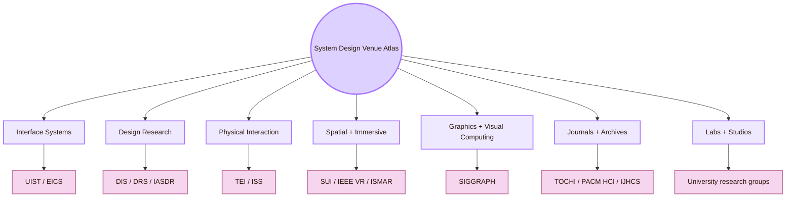

| Venue territory | Real-life meaning | System Design use |
|---|---|---|
| Interface Systems | Technical venues for interaction techniques, UI software, and engineered interactive systems | Publish new controls, tools, input methods, UI architectures, and prototypes |
| Design Research | Venues where design practice becomes research knowledge | Publish design methods, research-through-design, artifacts, process, and critique |
| Physical Interaction | Venues for tangible, embodied, surface, and spatial interaction | Publish post-screen interfaces, fabrication, haptics, touch spaces, and interactive objects |
| Spatial and Immersive | Venues for AR, VR, MR, 3D UI, and spatial interaction | Publish immersive interfaces, spatial input, world-anchored UI, and XR evaluation |
| Graphics and Visual Computing | Venues for visual representation, rendering, simulation, and interactive graphics | Publish visual systems that interface designers later use in tools, games, XR, and creative software |
| Journals and Archives | Long-form publication routes | Preserve mature HCI and interface-system research |
| Labs and Studios | University spaces where systems are built before publication | Learn how prototypes, papers, and research programmes are actually produced |

## CS2023 Alignment Gate

The first venue is not a conference. It is the curriculum source. CS2023 tells the student why this subarea exists inside computer science.

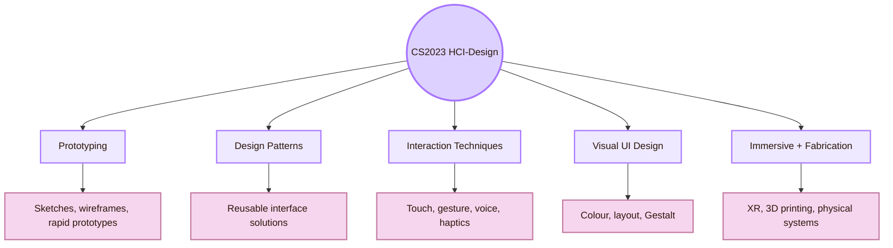

| CS2023 System Design topic | Venue territory to search first |
|---|---|
| Prototyping and rapid iteration | DIS, UIST, CHI, DRS |
| Design patterns and interactive systems | DIS, EICS, UIST, TOCHI |
| Interaction techniques | UIST, EICS, ISS, SUI |
| Graphical user interfaces | UIST, EICS, CHI, TOCHI |
| Error handling and visual UI design | CHI, DIS, EICS, IJHCS |
| Hardware design, haptics, and fabrication | TEI, UIST, SIGGRAPH, HCI labs |
| Immersive environments | IEEE VR, ISMAR, SUI, SIGGRAPH |
| Creativity support tools | UIST, DIS, CHI, TOCHI |

## Interface Systems Gate: UIST and EICS

The Interface Systems Gate is the technical core of System Design. It is where researchers publish new interaction techniques, UI software, input/output systems, toolkits, authoring systems, and engineered interactive systems.

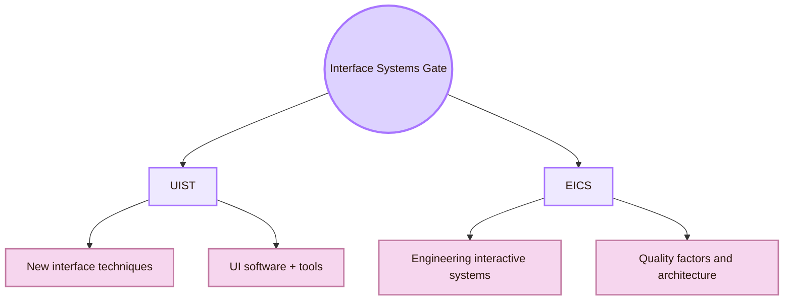

| Venue | What it is for | Use it when your page/project is about |
|---|---|---|
| [ACM UIST](https://uist.acm.org/) | A central ACM venue for innovations in human-computer interfaces, including graphical and web UI, tangible and ubiquitous computing, VR/AR, new input and output devices, multimedia, human-centred AI, and CSCW | Interface techniques, UI tools, input devices, authoring systems, interaction software, and novel prototypes |
| [ACM EICS](https://eics.acm.org/) | A SIGCHI conference devoted to engineering usable and effective interactive computing systems and their user interfaces | UI architecture, model-based UI, interactive-system quality, reliability, security, usability, and implementation constraints |

**Real-life translation:** this gate is not about whether a design looks nice. It is about whether an interaction can be technically built, controlled, measured, and reused.

## Design Research Studio: DIS, DRS, IASDR, Cumulus

The Design Research Studio connects interface systems to design knowledge. These venues matter when the contribution is not only a technique, but a designed artifact, process, method, critique, or theory of making.

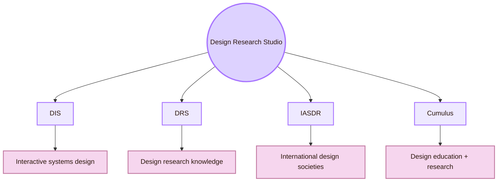

| Venue | What it is for | System Design value |
|---|---|---|
| [ACM DIS](https://dis.acm.org/) | ACM conference on Designing Interactive Systems | Useful route for design-led HCI, artifacts, research-through-design, interactive systems, design methods, and critical practice |
| [Design Research Society](https://www.designresearchsociety.org/cpages/conferences) | International design research society with large biennial conferences | Strong route for design research beyond computer science, including methods, practice, theory, and design knowledge |
| [IASDR](https://iasdr.net/) | International Association of Societies of Design Research | Broad global design research route, useful for connecting HCI to design schools and design theory |
| [Cumulus](https://cumulusassociation.org/) | Global association of art and design education and research | Useful for design education, studio culture, interdisciplinary design practice, and international art/design networks |

**Real-life translation:** this studio is where interface design is treated as research, not only implementation. It is useful when the page needs design reasoning, critique, visual systems, studio methods, or research-through-design.

## Physical Interaction Yard: TEI and ISS

The Physical Interaction Yard covers tangible, embedded, embodied, surface, and spatially distributed interaction. It is essential for System Design because CS2023 includes hardware design, haptics, 3D printing, fabrication, controllers, and non-standard interaction techniques.

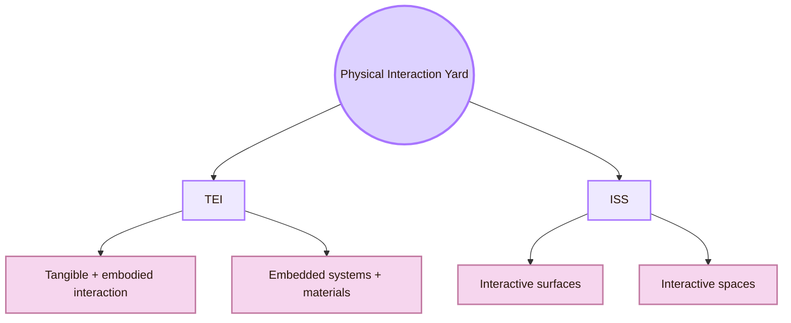

| Venue | What it is for | Use it when studying |
|---|---|---|
| [ACM TEI](https://tei.acm.org/) | Tangible, embedded, and embodied interaction | Physical-digital artifacts, haptics, embodied interaction, interactive materials, fabrication, post-screen interfaces |
| [ACM ISS](https://iss.acm.org/) | Interactive surfaces and spaces | Tabletops, walls, large displays, multi-surface systems, spatial workspaces, collaborative interaction spaces |

**Real-life translation:** this yard is where interface design leaves the flat screen. It is useful for kiosks, large displays, tangible objects, smart rooms, public installations, embodied tools, and physical computing.

## Spatial and Immersive Observatory: SUI, IEEE VR, ISMAR

The Spatial and Immersive Observatory covers interfaces in three-dimensional, augmented, virtual, and mixed environments. These venues matter because CS2023 explicitly includes immersive environments, 3D user interaction, and novel input/output channels under System Design.

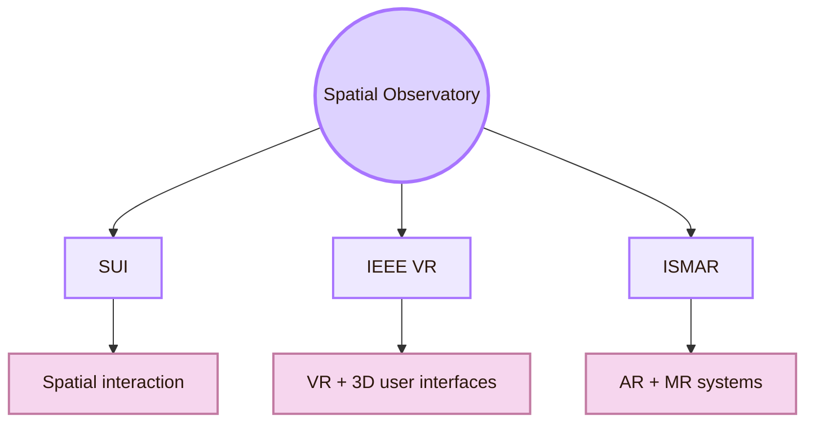

| Venue | What it is for | System Design value |
|---|---|---|
| [ACM SUI](https://sigchi.org/events/sui-2025/) | Spatial user interaction for VR, AR, MR, ubiquitous, smart, and real environments | Spatial menus, 3D input, embodied navigation, room-scale interaction, spatial evaluation |
| [IEEE VR](https://ieeevr.org/) | Virtual Reality and 3D User Interfaces | VR interaction, 3D UI, immersive systems, user studies, XR hardware and software |
| [IEEE ISMAR](https://www.ismar.net/) | Mixed and Augmented Reality | AR/MR systems, world-anchored interfaces, tracking, displays, mixed-reality interaction |

**Real-life translation:** this observatory is for interfaces where the “screen” becomes an environment. It is useful when studying AR glasses, VR workspaces, spatial UI, mixed-reality learning, 3D interaction, and immersive prototyping.

## Graphics and Interactive Techniques Gate: SIGGRAPH

SIGGRAPH is not only art or animation. For System Design, it is the route into computer graphics, simulation, rendering, interactive techniques, visual computing, and emerging display technologies that often become future interfaces.

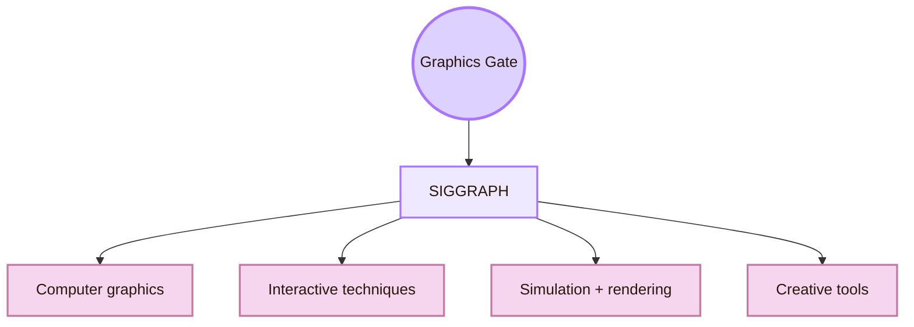

| Venue | What it is for | Interface Forge use |
|---|---|---|
| [ACM SIGGRAPH](https://www.siggraph.org/) | Premier conference and exhibition on computer graphics and interactive techniques | Visual systems, graphics tools, simulation, creative interfaces, XR rendering, interactive media |

**Real-life translation:** this gate is for the visual engine behind many interfaces: games, XR, data displays, creative software, simulation systems, visual tools, and interactive graphics.

## Journal Archive: Mature System Design Research

Journals matter when the student needs deeper, longer, or more mature research than a conference paper. In HCI, conferences are very important, but journals still preserve archival, integrative, and broad studies.

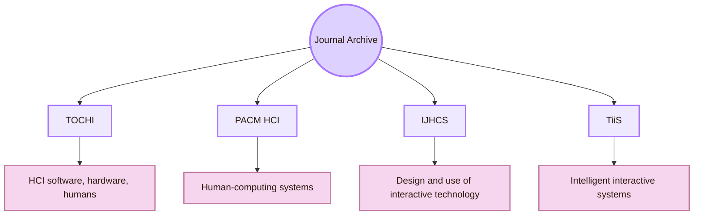

| Journal | Why it belongs here |
|---|---|
| [ACM TOCHI](https://dl.acm.org/journal/tochi) | Covers software, hardware, and human aspects of interaction with computers |
| [PACM HCI](https://dl.acm.org/journal/pacmhci) | Publishes research across the intersection between human factors and computing systems |
| [International Journal of Human-Computer Studies](https://www.sciencedirect.com/journal/international-journal-of-human-computer-studies) | Publishes research on the design and use of interactive computer technology |
| [ACM TiiS](https://dl.acm.org/journal/tiis) | Useful when System Design crosses into interactive intelligent systems, AI, adaptive UI, and human-centred automation |

**Real-life translation:** this archive is where you go when you need a more stable source than a web guide or conference landing page.

## Labs and Studios: Where System Design Is Built

A lab is a venue when it produces research culture, students, prototypes, papers, and public project archives. For System Design, labs matter because many interface contributions begin as prototypes inside university groups before they appear at UIST, DIS, TEI, EICS, or CHI.

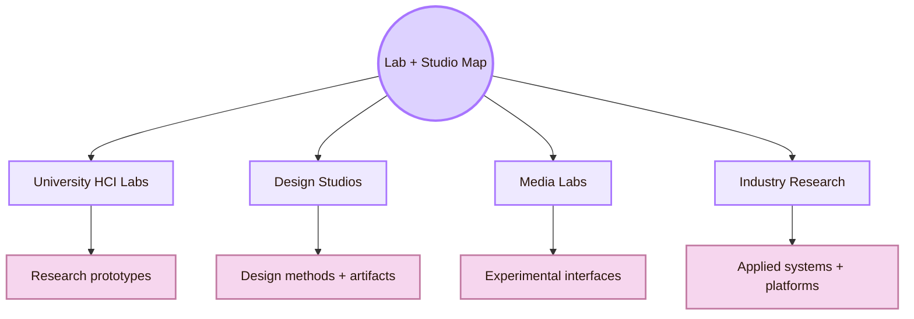

| Lab or studio route | What to look for |
|---|---|
| Stanford HCI / HAI routes | Human-centred AI, prototyping, design tools, behavior change, interface research |
| UCSD Design Lab | Design methods, creativity tools, learning systems, design education |
| UCL Interaction Centre | Interaction design, ubiquitous computing, human-centred AI, human-data interaction |
| MIT Tangible Media Group | Tangible interaction, physical-digital interfaces, Radical Atoms, post-screen systems |
| Aalto HCI group | Computational HCI, interactive AI, user interfaces, human performance |
| University of Toronto DGP / HCI groups | Graphics, input, UI techniques, design tools |
| UW DUB / CREATE | HCI, accessibility, design methods, inclusive technologies |
| HPI HCI group | Fabrication, haptics, physical interaction systems |

**Real-life translation:** labs are where a student learns what research actually looks like: project pages, prototypes, videos, papers, datasets, demos, students, and publication patterns.

## Venue Selection Route

Use this route when deciding where a System Design page should look for evidence.

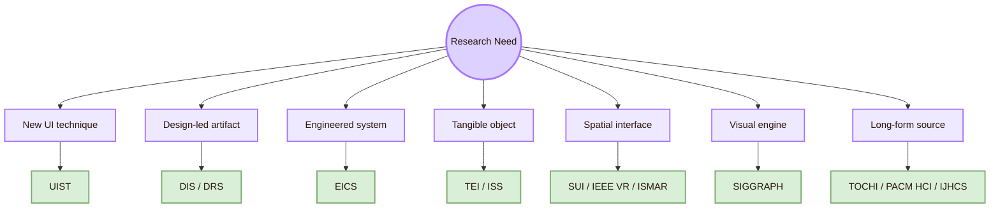

| If your question is... | Start here | Then broaden to |
|---|---|---|
| How do I invent or evaluate a new interaction technique? | UIST | EICS, CHI, ISS |
| How do I frame a design artifact as research? | DIS | DRS, IASDR, Cumulus |
| How do I engineer an interactive system properly? | EICS | UIST, TOCHI |
| How do I build tangible or embodied interaction? | TEI | UIST, ISS, SIGGRAPH |
| How do I design surfaces or multi-display spaces? | ISS | SUI, CHI, UIST |
| How do I design AR/VR/MR interaction? | IEEE VR, ISMAR, SUI | UIST, SIGGRAPH |
| How do I connect graphics to interface design? | SIGGRAPH | UIST, IEEE VR, ISMAR |
| How do I find mature HCI research? | TOCHI, IJHCS, PACM HCI | CHI, DIS, UIST |

## Reading Across the Atlas

Do not treat venues as interchangeable. Each one has its own research culture.

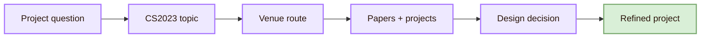

For example, a project about an interactive wall should not begin only with general UX articles. It should check ISS for surfaces and spaces, UIST for interaction techniques, EICS for engineering issues, and CHI or TOCHI for broader HCI evaluation. A project about a design-system component should check design-system documentation, EICS for engineered UI systems, and accessibility standards before finalising the component.

## Venue Reliability Ladder

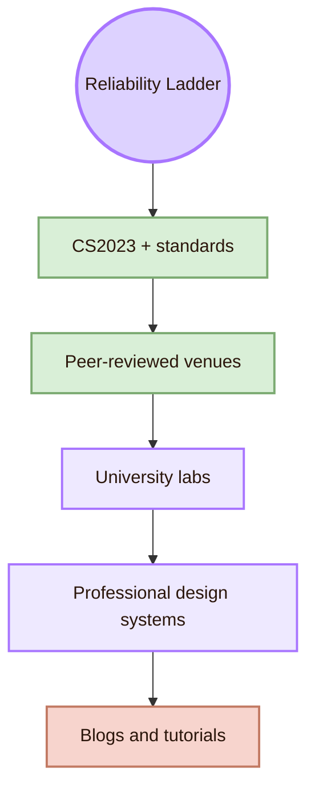

| Source type | Use it for | Caution |
|---|---|---|
| CS2023 | Curriculum grounding and official topic structure | It tells what to learn, not every detail |
| Peer-reviewed venues | Research evidence and methods | Papers may be narrow or hard to read |
| University labs | Project examples, prototypes, student pathways | Lab pages may be incomplete or outdated |
| Professional design systems | Practical components, patterns, and interface rules | They reflect platform priorities |
| Blogs and tutorials | Quick learning | Do not use them as the main academic source |

## Broad System Design Atlas

| Territory | Core venues | What they map |
|---|---|---|
| General HCI | CHI, TOCHI, PACM HCI, IJHCS | Human-computer interaction broadly |
| UI systems | UIST, EICS | Interaction techniques, UI software, engineered systems |
| Design research | DIS, DRS, IASDR, Cumulus | Design process, artifacts, research-through-design |
| Tangible and embodied | TEI | Physical, embedded, embodied interaction |
| Surfaces and spaces | ISS | Tabletop, wall, multi-surface, interactive spaces |
| Spatial interaction | SUI | Spatial UI across VR, AR, MR, smart spaces |
| Immersive systems | IEEE VR, ISMAR | VR, AR, MR, 3D UI, tracking, displays |
| Visual computing | SIGGRAPH | Graphics, simulation, rendering, interactive techniques |
| Intelligent interaction | TiiS, IUI, human-AI tracks | Adaptive, intelligent, AI-mediated systems |

## Mini Application: Mapping a Student Project

A project in the Interface Forge should choose venues according to what it actually builds.

| Student project | Best venue map |
|---|---|
| A clickable Obsidian HCI map | DIS for design framing, CHI for HCI relevance, EICS for interactive system structure |
| A new Mermaid/CSS diagram style | UIST for interaction technique, DIS for design artifact, SIGGRAPH if visual computing becomes central |
| A mobile app prototype | CHI, DIS, UIST, IJHCS |
| A design system for the vault | EICS, DIS, Material/Fluent/Apple documentation, WCAG |
| A tangible learning interface | TEI, UIST, CHI |
| A VR version of Cognishire | SUI, IEEE VR, ISMAR, SIGGRAPH |
| A wall display map for a classroom | ISS, UIST, CHI |
| An AI guide inside the vault | IUI, TiiS, CHI, UIST, Oracle Engine resources |

## What this page should not claim

Because the atlas covers many communities, it should avoid treating one venue as the only valid source for a topic. System Design is distributed across HCI, design research, graphics, engineering, accessibility, XR, and physical computing.

| Avoid this claim | Safer version |
|---|---|
| “UIST is the only place for interface systems.” | “UIST is a central route for UI software and interaction techniques.” |
| “DIS is only about visual design.” | “DIS is useful for design-led interactive systems, artifacts, methods, and critique.” |
| “SIGGRAPH is only animation.” | “SIGGRAPH is important for graphics and interactive techniques that often support interface work.” |
| “A lab page proves a claim.” | “A lab page can show projects and research direction, but claims still need papers, methods, or evaluation.” |
| “Professional design systems are academic evidence.” | “Design systems are useful practice references, but they should be separated from peer-reviewed research.” |

## Venue Synthesis

Important Venues for System Design is the atlas of where interface-building knowledge lives. It is broader than one HCI conference because system design crosses several worlds: software engineering, design research, physical interaction, spatial computing, visual computing, journals, labs, and professional design systems.

The central CS2023 anchor is **HCI-Design: System Design**. The practical meaning is that a student should know where to search depending on what they are building. UI techniques often start with UIST. Engineered interactive systems often start with EICS. Design-led artifacts often start with DIS and design research venues. Tangible and embodied systems often start with TEI. Interactive surfaces often start with ISS. Spatial and immersive systems often start with SUI, IEEE VR, and ISMAR. Graphics-heavy systems often start with SIGGRAPH. Mature written research often starts with journals such as TOCHI, PACM HCI, and IJHCS.

This page connects to [[Activities/Theory]] because venues define the concepts that system designers use. It connects to [[Activities/Design]] because venues publish design patterns, artifacts, systems, and methods. It connects to [[Activities/Experiment]] because many venues require evaluation. It connects to [[Connections]] because System Design is interdisciplinary by nature. It connects to [[Important People]] because professors and labs publish through these venues.

## Academic anchors

| Route | Source |
|---|---|
| CS2023 HCI System Design | [CS2023 HCI Knowledge Area](https://csed.acm.org/knowledge-areas-human-computer-interaction-hci-sigcse-2022-version/) |
| CS2023 Knowledge Areas | [CS2023 Knowledge Areas](https://csed.acm.org/knowledge-areas/) |
| General HCI flagship | [ACM CHI](https://dl.acm.org/conference/chi) |
| UI software and technology | [ACM UIST](https://uist.acm.org/) |
| Engineering interactive systems | [ACM EICS](https://eics.acm.org/) |
| Designing interactive systems | [ACM DIS](https://dis.acm.org/) |
| Tangible and embodied interaction | [ACM TEI](https://tei.acm.org/) |
| Interactive surfaces and spaces | [ACM ISS](https://iss.acm.org/) |
| Spatial user interaction | [ACM SUI](https://sigchi.org/events/sui-2025/) |
| Virtual reality and 3D UI | [IEEE VR](https://ieeevr.org/) |
| Mixed and augmented reality | [IEEE ISMAR](https://www.ismar.net/) |
| Graphics and interactive techniques | [ACM SIGGRAPH](https://www.siggraph.org/) |
| Design research | [Design Research Society](https://www.designresearchsociety.org/cpages/conferences) |
| International design research | [IASDR](https://iasdr.net/) |
| Art and design education research | [Cumulus Association](https://cumulusassociation.org/) |
| HCI journal | [ACM TOCHI](https://dl.acm.org/journal/tochi) |
| HCI proceedings journal | [PACM HCI](https://dl.acm.org/journal/pacmhci) |
| Human-computer studies journal | [International Journal of Human-Computer Studies](https://www.sciencedirect.com/journal/international-journal-of-human-computer-studies) |
| Interactive intelligent systems | [ACM TiiS](https://dl.acm.org/journal/tiis) |

^important-venues-system-design-end
