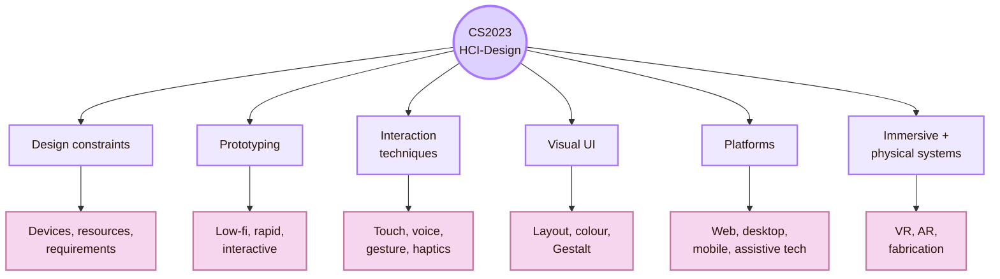
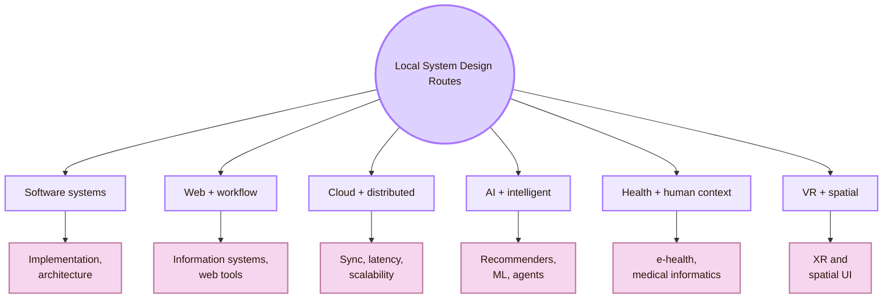
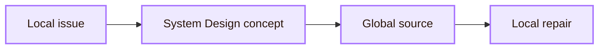
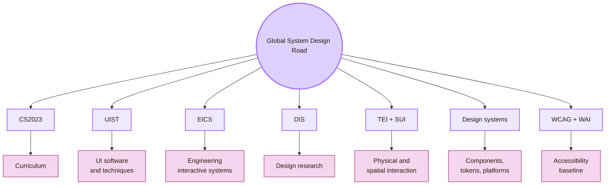

![[local11.jpg|1000]]
# Local and Global

**Real CS2023 label:** HCI-Design: System Design  
**Real-life meaning:** build and study interactive systems locally at UVT, then compare them with global HCI system-design knowledge.

The global side is the wider System Design field: CS2023 HCI-Design, interface software, engineered interactive systems, design research, tangible interaction, spatial interaction, design systems, accessibility standards, platform conventions, and international HCI venues.

> [!quote] Twin Gate rule

## Scale map

## CS2023 grounding

CS2023 places **System Design** inside the HCI knowledge area. This unit includes design patterns, design constraints, platform and device constraints, prototyping, iterative design, participatory design, co-design, interaction design, interaction techniques, graphical user interfaces, hardware design, haptics, error handling, visual UI design, immersive environments, fabrication, creativity support tools, and voice UI.

## Local System Design Root: UVT Faculty of Informatics

The local institution for this page is the **Faculty of Informatics at UVT**. The faculty publicly lists two departments that matter for this local System Design map:

## Local System Design Routes

- **Digital Technologies and Software Engineering:** public uvt basis: UVT DTSE department staff list; system design connection: Software architecture, implementation, maintainable systems, research workflows
- **Computational Sciences and AI:** public uvt basis: UVT CSAI department staff list; system design connection: Intelligent systems, data-driven systems, adaptive interfaces, AI-supported interaction
- **Web technologies and workflows:** public uvt basis: UVT researchers page lists workflows, web technologies, and ontologies for Teodor Florin Fortiș; system design connection: Web-like information systems, workflow tools, navigation structure
- **Distributed and cloud systems:** public uvt basis: UVT researchers page lists cloud computing, distributed computing, grid computing, and high-performance computing routes; system design connection: Portability, latency, synchronisation, cross-machine system behaviour
- **Machine learning and recommender systems:** public uvt basis: UVT AI and ML route lists recommender systems, machine learning, knowledge extraction, and data mining; system design connection: Adaptive interfaces, personalisation, recommendation, user modelling
- **Medical informatics and e-health:** public uvt basis: UVT AI and ML route lists health monitoring, healthcare systems, e-health systems, and medical informatics; system design connection: High-stakes interface reliability, trust, monitoring, recovery
- **Virtual reality route:** public uvt basis: UVT researchers page lists a PhD route in virtual reality; system design connection: Immersive interaction, spatial UI, XR system design
- **Cyber-physical systems:** public uvt basis: UVT AI and ML dissemination includes cyber-physical system work; system design connection: Sensor systems, real-world feedback, interactive infrastructure

## Local people links

Use this section as a **route board**, not a faculty label. It connects public UVT research/staff routes to System Design questions.

## Local systems to test first

## Local-to-global bridge

## Global System Design Road

The global road shows where the local system can be compared with wider System Design knowledge.

- **CS2023 HCI-Design:** Gives the official curriculum basis for System Design
- **ACM UIST:** Useful for interface software, tools, interaction techniques, input/output devices, AR/VR, tangible computing, and human-centred AI
- **ACM EICS:** Useful for engineering interactive systems, including design, development, validation, verification, deployment, maintenance, and quality factors
- **ACM DIS:** Useful for design research, design artifacts, design methods, critique, and interactive systems
- **ACM TEI:** Useful for tangible, embedded, and embodied interaction
- **ACM SUI / IEEE VR / ISMAR:** Useful for spatial, immersive, AR, VR, and MR interfaces
- **ACM SIGGRAPH:** Useful for graphics, visual computing, rendering, simulation, and interactive techniques
- **Material Design / Fluent / Apple HIG:** Useful for components, tokens, layout, platform conventions, and design-system documentation
- **W3C WAI / WCAG:** Baseline route for accessibility and inclusive interface structure

## Local and global comparison

## Portability trial

A local System Design study should test whether the built system survives movement.

## Local contact protocol

Local contact should be specific. Do not ask a UVT staff member to “help with HCI” in general. Ask about the route their public page actually supports.

## System Design checklist

## Academic anchors

| Route | Source |
|---|---|
| CS2023 HCI System Design basis | [CS2023 HCI SIGCSE 2022 version](https://csed.acm.org/knowledge-areas-human-computer-interaction-hci-sigcse-2022-version/) |
| CS2023 Knowledge Areas | [CS2023 Knowledge Areas](https://csed.acm.org/knowledge-areas/) |
| UVT Faculty of Informatics departments | [Faculty of Informatics Departments](https://info.uvt.ro/en/departamente/) |
| UVT CSAI Department | [Department of Computational Sciences and Artificial Intelligence](https://info.uvt.ro/en/departamente/csai/) |
| UVT DTSE Department | [Department of Digital Technologies and Software Engineering](https://info.uvt.ro/en/departamente/dtse/) |
| UVT Researcher routes | [UVT Informatics Researchers](https://research.info.uvt.ro/researchers/) |
| UVT AI and ML research route | [Artificial Intelligence and Machine Learning](https://research.info.uvt.ro/artificial-intelligence-and-machine-learning/) |
| UI software and technology | [ACM UIST](https://uist.acm.org/) |
| Engineering interactive systems | [ACM EICS](https://eics.acm.org/) |
| Designing interactive systems | [ACM DIS](https://dis.acm.org/) |
| Tangible and embodied interaction | [ACM TEI](https://tei.acm.org/) |
| Spatial user interaction | [ACM SUI](https://sigchi.org/events/sui-2025/) |
| Graphics and interactive techniques | [ACM SIGGRAPH](https://www.siggraph.org/) |
| Accessibility baseline | [W3C Web Accessibility Initiative](https://www.w3.org/WAI/) |
| Accessibility standard | [WCAG 2.2](https://www.w3.org/TR/WCAG22/) |
| Material design system | [Material Design 3](https://m3.material.io/) |
| Apple platform guidance | [Apple Human Interface Guidelines](https://developer.apple.com/design/human-interface-guidelines) |
| Microsoft design system | [Fluent 2](https://fluent2.microsoft.design/) |

^local-global-system-design-end
