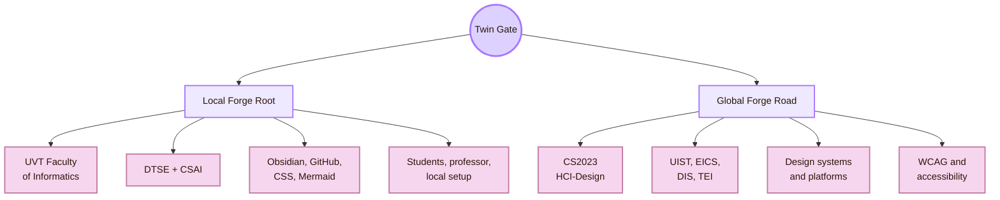
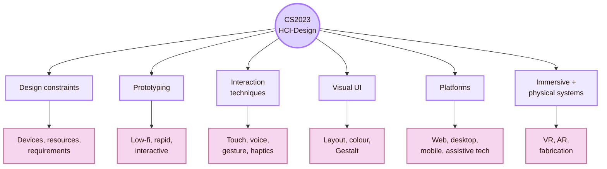
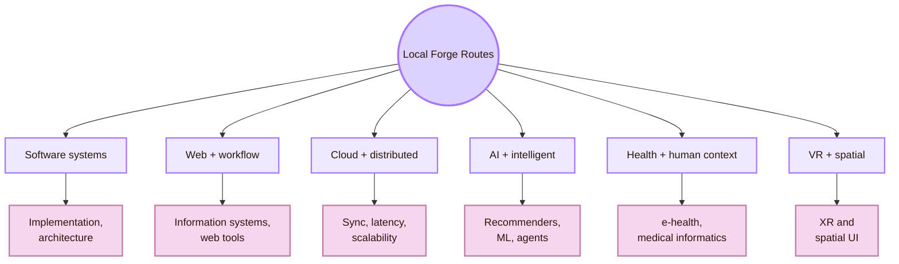
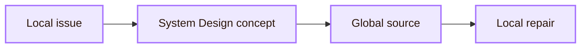
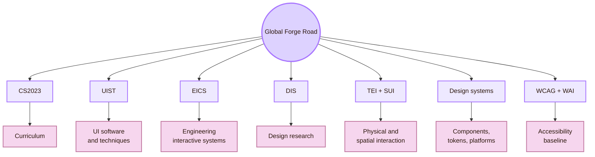
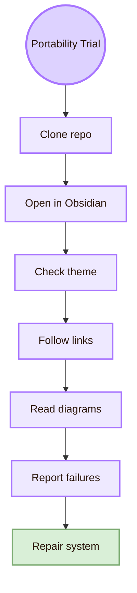
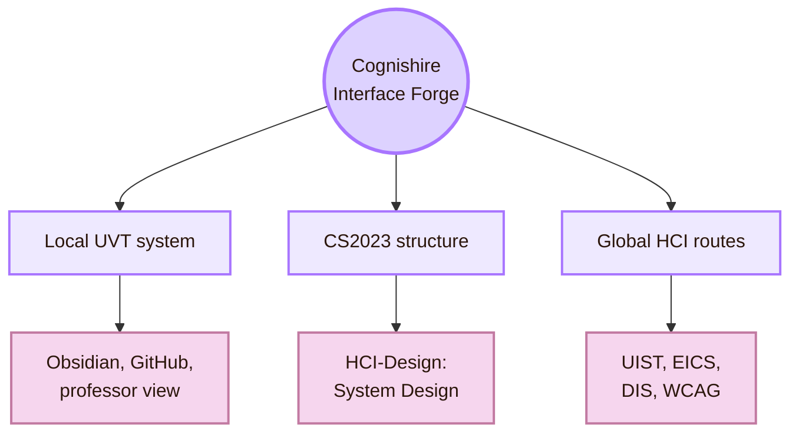

![[whitecity.gif|1000]]
# Local and Global

Back to [[Overview|The Interface Forge]].

> [!abstract] The Twin Gate
> **Local and Global** is the twin gate of the Interface Forge. It asks how **CS2023 HCI-Design: System Design** appears in one real place, the UVT Faculty of Informatics, and how that local work connects to global HCI research, interface systems, design systems, standards, and platform practice.

**Fantasy name:** Twin Gate  
**Real CS2023 label:** HCI-Design: System Design  
**Real-life meaning:** build and study interactive systems locally at UVT, then compare them with global HCI system-design knowledge.

This page keeps the RPG map feeling, but every fantasy term has a practical translation. The local side is the real academic environment around this project: **Universitatea de Vest din Timișoara**, especially the **Faculty of Informatics**, its departments, student projects, software tools, GitHub workflows, Obsidian vaults, classroom use, and local evaluation expectations.

The global side is the wider System Design field: CS2023 HCI-Design, interface software, engineered interactive systems, design research, tangible interaction, spatial interaction, design systems, accessibility standards, platform conventions, and international HCI venues.

> [!quote] Twin Gate rule

## Quick route

| RPG station | Real meaning | Use it when you need to |
|---|---|---|
| Twin Gate | Local and global scale | Compare UVT reality with global HCI research |
| Local Forge Root | UVT context | Ground the project in a real faculty, tools, and users |
| Global Forge Road | International HCI route | Find venues, standards, and design-system practices |
| Bridge Table | Local issue to global concept | Turn a local problem into a design lesson |
| Portability Trial | Clone and setup test | Check whether the system works beyond your computer |

## Scale map

| Scale | What it means in this project | System-design question |
|---|---|---|
| Local UVT | Faculty, departments, teachers, students, project workflow, software setup, and academic expectations | Can this system be built, opened, read, and evaluated in the UVT context? |
| Global HCI | International HCI design research, interface engineering, design systems, accessibility standards, and platform guidance | Which global concepts explain or improve the local system? |
| Local system | This Obsidian and GitHub HCI map, including CSS, links, diagrams, assets, and file structure | Does the vault behave like a usable interactive learning system? |
| Global system | Web, desktop, mobile, XR, design systems, assistive technologies, and research prototypes | Which local problems are examples of wider System Design problems? |

## CS2023 grounding

CS2023 places **System Design** inside the HCI knowledge area. This unit includes design patterns, design constraints, platform and device constraints, prototyping, iterative design, participatory design, co-design, interaction design, interaction techniques, graphical user interfaces, hardware design, haptics, error handling, visual UI design, immersive environments, fabrication, creativity support tools, and voice UI.

| CS2023 topic | Local UVT interpretation | Global HCI interpretation |
|---|---|---|
| Prototyping | Obsidian pages, GitHub repo, CSS theme, local web export, classroom demo | Low-fidelity prototypes, coded prototypes, design probes, interface tools |
| Design patterns | Repeated page templates, route tables, callouts, map pages | Reusable patterns, components, navigation structures, design-system rules |
| Platform constraints | Obsidian, GitHub, browsers, Fedora/Linux, Windows, classroom computers | Web, desktop, mobile, assistive technology, XR, platform conventions |
| Interaction techniques | Links, search, keyboard navigation, Markdown, diagrams, hover, click, file opening | Touch, gesture, voice, haptics, controllers, spatial input |
| Visual UI design | Readable RPG theme, Mermaid diagrams, CSS snippets, page hierarchy | Visual hierarchy, layout, colour, typography, Gestalt principles |
| Architecture | Folder structure, relative links, assets, `.obsidian`, release setup | UI architecture, cross-platform design, maintainability, synchronisation |
| Error handling | Broken links, missing CSS, unreadable diagrams, Git conflicts | System status, recovery, validation, undo, feedback states |

## Local Forge Root: UVT Faculty of Informatics

The local institution for this page is the **Faculty of Informatics at UVT**. The faculty publicly lists two departments that matter for this local System Design map:

| Local department | Why it matters for the Interface Forge |
|---|---|
| Department of Computational Sciences and Artificial Intelligence | Local route into AI, data-driven systems, recommender systems, medical informatics, machine learning, multi-agent systems, and intelligent interfaces |
| Department of Digital Technologies and Software Engineering | Local route into software engineering, web technologies, workflows, cloud systems, digital infrastructure, implementation, and maintainable tools |

## Local Forge Routes

The local routes below help this map connect System Design to the UVT environment. They are routes into possible topics, not guarantees of supervision or course availability.

| Local route | Public UVT basis | System Design connection |
|---|---|---|
| Digital Technologies and Software Engineering | UVT DTSE department staff list | Software architecture, implementation, maintainable systems, project workflows |
| Computational Sciences and AI | UVT CSAI department staff list | Intelligent systems, data-driven systems, adaptive interfaces, AI-supported interaction |
| Web technologies and workflows | UVT researchers page lists workflows, web technologies, and ontologies for Teodor Florin Fortiș | Web-like information systems, workflow tools, navigation structure |
| Distributed and cloud systems | UVT researchers page lists cloud computing, distributed computing, grid computing, and high-performance computing routes | Portability, latency, synchronisation, cross-machine system behaviour |
| Machine learning and recommender systems | UVT AI and ML route lists recommender systems, machine learning, knowledge extraction, and data mining | Adaptive interfaces, personalisation, recommendation, user modelling |
| Medical informatics and e-health | UVT AI and ML route lists health monitoring, healthcare systems, e-health systems, and medical informatics | High-stakes interface reliability, trust, monitoring, recovery |
| Virtual reality route | UVT researchers page lists a PhD route in virtual reality | Immersive interaction, spatial UI, XR system design |
| Cyber-physical systems | UVT AI and ML dissemination includes cyber-physical system work | Sensor systems, real-world feedback, interactive infrastructure |

## Local people links

Use this section as a **route board**, not a faculty label. It connects public UVT research/staff routes to System Design questions.

| Route board entry | Public UVT information | Useful System Design question |
|---|---|---|
| Florin Fortiș / web and workflows | DTSE staff route; researchers page lists workflows, web technologies, and ontologies | How can this vault behave like a clear information and workflow system? |
| Dana Petcu / distributed systems | DTSE staff route; public profile context connects to distributed and cloud systems | What makes an interactive system portable and scalable across machines? |
| Ciprian Pungilă / software engineering | DTSE staff route | What implementation constraints should shape interface decisions? |
| Ioan Drăgan / cloud and formal routes | DTSE staff route; researchers page lists cloud computing and formal verification | How can system behaviour be made more reliable and inspectable? |
| Adrian Spătaru / digital technologies | DTSE staff route | How can local digital systems support student project workflows? |
| Marc Frîncu / cloud and big data | DTSE staff route; researchers page lists cloud computing, task scheduling, and big data | How do infrastructure limits affect system responsiveness and use? |
| Mircea Marin / formal systems | DTSE staff route; researchers page lists formal languages, automated reasoning, and multi-agent systems | How can formal structure support reliable interaction systems? |
| Gabriel Iuhasz / multi-agent and cloud | CSAI staff route; AI and ML page lists multi-agent systems, machine learning, cloud computing, and strategic games | How might intelligent or agent-based systems interact with users? |
| Horia Popa Andreescu / knowledge discovery | CSAI staff route; AI and ML page lists knowledge discovery and recommender systems | How could recommendation or personalisation support navigation? |
| Daniela Zaharie / optimisation and ML | CSAI staff route; AI and ML page lists evolutionary computing, machine learning, and data mining | How can optimisation support adaptive system design? |
| Darian Onchiș / signal and image processing | CSAI staff route; AI and ML page lists signal/image processing, bioinformatics, and machine learning | How can visual or human-related data become usable system output? |
| Sebastian Ștefănigă / medical informatics | CSAI staff route; AI and ML page lists image processing, high-performance computing, medical informatics, and machine learning | What makes system design stricter in medical or high-stakes contexts? |
| Todor Ivașcu / e-health systems | DTSE staff route; AI and ML route lists multi-agent systems, e-health systems, and machine learning | How should monitoring and e-health systems show status, risk, and recovery? |
| Codruț Chiș / virtual reality route | Researchers page lists virtual reality as a PhD route | How could the map become a spatial or immersive interface? |

## Local systems to test first

The first System Design object is not an imaginary product. It is this vault.

| Local system object | System Design issue | Fast test |
|---|---|---|
| Obsidian vault | Navigation, page structure, CSS snippets, plugins, Mermaid rendering | Ask a user to open the vault and find one room |
| GitHub repository | Version control, clone behaviour, assets, `.obsidian` settings | Clone on a second computer |
| CSS theme | Visual identity, contrast, readability, portability | Check Reading View, dark mode, and another screen |
| Mermaid diagrams | Visual explanation and cognitive load | Ask whether the diagram helps or distracts |
| Internal links | Information architecture and route stability | Click through every room path |
| Classroom presentation | Projection, pacing, explanation, academic credibility | Show one page to a professor or classmate |
| Local web export | Access without Obsidian | Test GitHub Pages, Quartz, or exported HTML |
| Setup instructions | System onboarding | Ask another user to follow the README |

## Local-to-global bridge

| Local issue | Global concept | Local repair |
|---|---|---|
| CSS works on one computer but not another | Platform constraints and portability | Track `.obsidian`, snippets, theme settings, and setup steps |
| Mermaid diagrams overflow | Responsive layout and visual hierarchy | Use compact flowcharts and tables for detail |
| Fantasy naming confuses users | Signifiers and information scent | Pair every RPG name with the CS2023 term |
| Git conflicts appear | Software workflow and maintainability | Add a short Git workflow and avoid unstable file names |
| Pages are dense | Cognitive load and progressive disclosure | Use short route tables, callouts, and smaller diagrams |
| GitHub view differs from Obsidian | Cross-platform design | Decide the official viewing environment |
| Students do not know HCI terms | Learning interface design | Add “real-life meaning” translations |
| Professor asks for academic grounding | Source credibility | Keep CS2023, venues, standards, and official pages visible |

## Global Forge Road

The global road shows where the local system can be compared with wider System Design knowledge.

| Global route | Why it matters |
|---|---|
| CS2023 HCI-Design | Gives the official curriculum basis for System Design |
| ACM UIST | Useful for interface software, tools, interaction techniques, input/output devices, AR/VR, tangible computing, and human-centred AI |
| ACM EICS | Useful for engineering interactive systems, including design, development, validation, verification, deployment, maintenance, and quality factors |
| ACM DIS | Useful for design research, design artifacts, design methods, critique, and interactive systems |
| ACM TEI | Useful for tangible, embedded, and embodied interaction |
| ACM SUI / IEEE VR / ISMAR | Useful for spatial, immersive, AR, VR, and MR interfaces |
| ACM SIGGRAPH | Useful for graphics, visual computing, rendering, simulation, and interactive techniques |
| Material Design / Fluent / Apple HIG | Useful for components, tokens, layout, platform conventions, and design-system documentation |
| W3C WAI / WCAG | Baseline route for accessibility and inclusive interface structure |

## Local and global comparison

| Dimension | Local UVT System Design | Global System Design |
|---|---|---|
| Institution | UVT Faculty of Informatics, DTSE, CSAI | International HCI, CS, design, and software-engineering communities |
| Users | UVT students, professor, classmates, GitHub viewers | Learners, designers, developers, researchers, disabled users, cross-cultural users |
| System examples | Obsidian vault, GitHub repo, classroom project, local web export | Web apps, mobile apps, design systems, XR systems, tools, prototypes |
| Constraints | Local computer setup, Git workflow, Obsidian theme, professor requirements | Platforms, devices, networks, accessibility, localisation, design-system governance |
| People routes | UVT staff and research topics connected to software, AI, web, cloud, e-health, and VR | Global HCI professors, labs, and venues linked to system design |
| Evidence | Clone tests, local usability tests, professor review | Peer-reviewed HCI papers, standards, platform guides, design-system documentation |
| Risk | The map becomes dependent on one machine or one local interpretation | The map becomes generic and loses UVT relevance |
| Best move | Test the vault locally first | Use global HCI sources to explain and improve it |

## Portability trial

A local System Design study should test whether the built system survives movement.

| Test | What it checks |
|---|---|
| GitHub clone test | Files, assets, and settings survive download |
| Obsidian appearance test | Theme and CSS snippets apply correctly |
| Link test | Internal paths and media links still work |
| Mermaid test | Diagrams render and remain readable |
| Professor-view test | The map makes sense without private explanation |
| Student navigation test | Users know where to go and what each room means |
| Accessibility check | Large font, contrast, keyboard navigation, and readable diagrams |

## Local contact protocol

Local contact should be specific. Do not ask a UVT staff member to “help with HCI” in general. Ask about the route their public page actually supports.

| Local route | Better question |
|---|---|
| Web and workflows | “How should I think about this vault as a workflow or web-like information system?” |
| Software engineering | “What would make this repository more maintainable and portable?” |
| Cloud and distributed systems | “What should I consider when the same system must work across machines and setups?” |
| AI and recommender systems | “How could this map later support adaptive or recommender-like navigation?” |
| Medical or e-health systems | “What makes interface reliability important in high-stakes user contexts?” |
| VR or spatial systems | “How could this map be transformed into an immersive or spatial interface?” |

> [!example] Local UVT system-design email
> Dear Professor [Name],  
> I am building a CS2023-based HCI map for a student project. The current part is **HCI-Design: System Design**, which I call the Interface Forge. I want to connect global HCI system-design topics to the local UVT Computer Science context.  
>  
> I saw that your public UVT route connects to [web technologies / workflows / software engineering / cloud systems / AI / VR]. Could you recommend one local course, project, seminar, or reading direction that would help me represent this system-design dimension more accurately?  
>  
> Best regards,  
> [Name]

## Cognishire application

Cognishire’s Interface Forge should treat the vault itself as the first system.

| Map decision | Local UVT requirement | Global System Design requirement |
|---|---|---|
| File structure | Easy to open and inspect for the project | Reflect scalable information architecture |
| CSS theme | Display on the professor’s machine | Follow accessibility and design-system logic |
| Page names | Understandable to UVT students | Map to CS2023 official terms |
| Mermaid diagrams | Readable in Obsidian on local screens | Follow visual hierarchy and responsive layout principles |
| GitHub repository | Preserve files, assets, and settings after clone | Follow maintainability and portability principles |
| Sources | Satisfy academic expectations locally | Connect to global HCI venues and standards |

## System Design checklist

Use this checklist when editing future Interface Forge pages.

| Check | Pass condition |
|---|---|
| RPG clarity | The fantasy name is followed by a real HCI translation |
| Local grounding | UVT appears as a real context, not a vague “local” label |
| Cognitive load | Diagrams are compact and tables carry dense detail |
| Portability | GitHub, Obsidian, CSS, links, and assets are tested across machines |
| Accessibility | Text, contrast, focus, structure, and diagrams remain usable |

## Academic anchors

| Route | Source |
|---|---|
| CS2023 HCI System Design basis | [CS2023 HCI SIGCSE 2022 version](https://csed.acm.org/knowledge-areas-human-computer-interaction-hci-sigcse-2022-version/) |
| CS2023 Knowledge Areas | [CS2023 Knowledge Areas](https://csed.acm.org/knowledge-areas/) |
| UVT Faculty of Informatics departments | [Faculty of Informatics Departments](https://info.uvt.ro/en/departamente/) |
| UVT CSAI Department | [Department of Computational Sciences and Artificial Intelligence](https://info.uvt.ro/en/departamente/csai/) |
| UVT DTSE Department | [Department of Digital Technologies and Software Engineering](https://info.uvt.ro/en/departamente/dtse/) |
| UVT Researcher routes | [UVT Informatics Researchers](https://research.info.uvt.ro/researchers/) |
| UVT AI and ML research route | [Artificial Intelligence and Machine Learning](https://research.info.uvt.ro/artificial-intelligence-and-machine-learning/) |
| UI software and technology | [ACM UIST](https://uist.acm.org/) |
| Engineering interactive systems | [ACM EICS](https://eics.acm.org/) |
| Designing interactive systems | [ACM DIS](https://dis.acm.org/) |
| Tangible and embodied interaction | [ACM TEI](https://tei.acm.org/) |
| Spatial user interaction | [ACM SUI](https://sigchi.org/events/sui-2025/) |
| Graphics and interactive techniques | [ACM SIGGRAPH](https://www.siggraph.org/) |
| Accessibility baseline | [W3C Web Accessibility Initiative](https://www.w3.org/WAI/) |
| Accessibility standard | [WCAG 2.2](https://www.w3.org/TR/WCAG22/) |
| Material design system | [Material Design 3](https://m3.material.io/) |
| Apple platform guidance | [Apple Human Interface Guidelines](https://developer.apple.com/design/human-interface-guidelines) |
| Microsoft design system | [Fluent 2](https://fluent2.microsoft.design/) |

^local-global-system-design-end
