![[toamna.gif|1000]]
# Open Problems

> [!abstract] Frontier Workbench
> The Frontier Workbench tracks unresolved problems in **CS2023 HCI-Design: System Design**. It focuses on the hard questions that appear when interface ideas become real systems: tradeoffs, complexity, scale, prototype fidelity, new interaction techniques, accessibility drift, changing contexts, and AI-assisted design.

**Real CS2023 label:** HCI-Design: System Design.  
**Real-life meaning:** a research map of what remains difficult when people build, scale, adapt, and evaluate interactive systems.

> [!quote] Workbench rule
> A System Design open problem appears when an interface can be built, but it is still unclear how to make it understandable, scalable, accessible, adaptable, and defensible across real contexts.

## Frontier Map

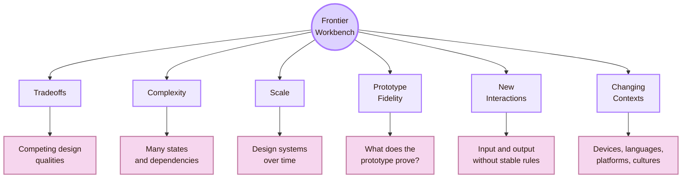

## CS2023 Gate

CS2023 places System Design inside the HCI knowledge area. The topics include prototyping, design patterns, design constraints, participatory and co-design processes, interaction techniques, graphical user interfaces, hardware design, error handling, visual UI design, layout, Gestalt principles, immersive environments, fabrication, creativity support tools, and voice UI.

This page uses those topics as the official gate into the workbench.

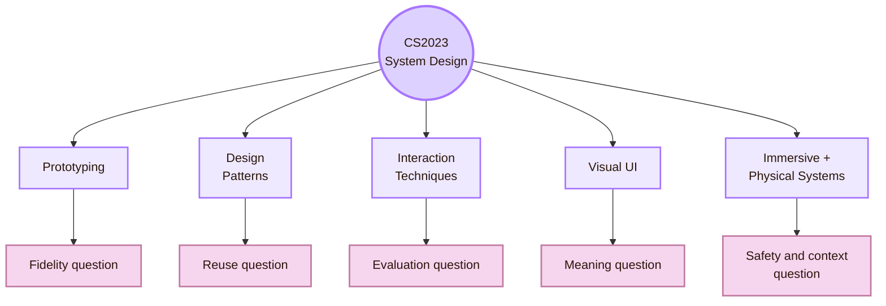

- **Prototyping:** How much fidelity is enough to test the right thing?
- **Design patterns:** How can a pattern stay reusable without becoming too generic?
- **Design constraints:** How should designers balance access, performance, platform rules, brand, cost, and context?
- **Interaction techniques:** How can new input methods be evaluated before users know the convention?
- **GUI and visual UI design:** How can clarity survive dense data, small screens, dark mode, and localisation?
- **Error handling:** How can systems prevent failure while still showing system limits?
- **Hardware, haptics, XR, and fabrication:** How can physical and spatial interfaces stay usable, safe, and inclusive?

## Frontier I: Tradeoff Crucible

The **Tradeoff Crucible** is the place where competing design qualities meet. A designer rarely optimises one value. Most real interface decisions balance clarity, speed, accessibility, aesthetics, engineering cost, privacy, platform convention, and business pressure.

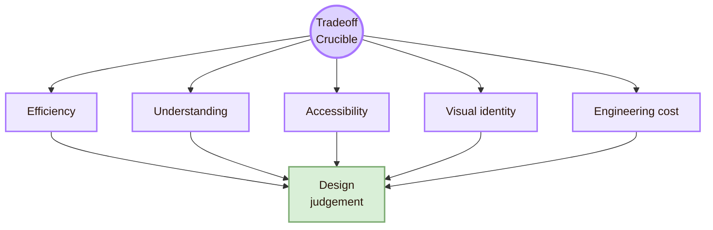

- **Efficiency vs understanding:** design danger: Users move fast but do not know what happened; research question: When does speed reduce comprehension?
- **Minimalism vs discoverability:** design danger: The interface looks clean but hides actions; research question: Which controls must remain visible?
- **Personalisation vs privacy:** design danger: The system adapts but the user loses data control; research question: How much explanation and control is enough?
- **Consistency vs local fit:** design danger: A global pattern ignores local conditions; research question: What can vary without breaking the system?
- **Visual identity vs accessibility:** design danger: Style weakens readability or contrast; research question: How can visual character remain inclusive?
- **Automation vs control:** design danger: The system helps but reduces agency; research question: Where should review, undo, and override appear?

The open problem is documentation. If a tradeoff is not written down, it becomes invisible. A strong system-design page should record the decision, the reason, the risk, and the test used to check it.

## Frontier II: Complexity Furnace

The **Complexity Furnace** is the problem of many states. Modern interfaces are rarely stable pages. They contain loading states, empty states, error states, permission states, offline states, saved and unsaved states, logged-in and logged-out states, synced and unsynced data, and personalised views.

The user does not see the internal architecture. The user sees surface effects: missing information, repeated clicks, vague errors, disabled controls, broken navigation, and uncertain status.

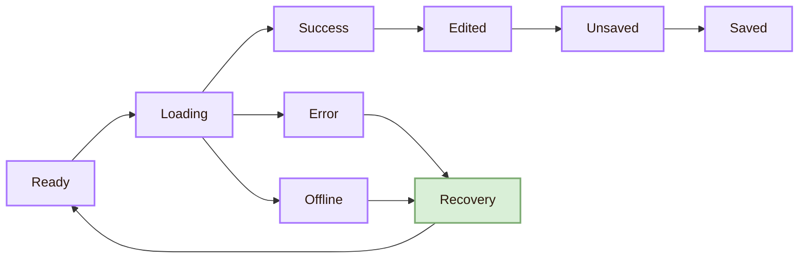

| Complexity source | Interface symptom | Open design question |
|---|---|---|
| Many states | Users do not know what is happening | How should state be shown without clutter? |
| Hidden dependencies | The user cannot tell why an action is unavailable | When should constraints be explained? |
| Cross-device continuity | Different devices show different states | How should sync and conflict be shown? |
| Permission layers | Expected actions are blocked | How should permissions be visible without exposing sensitive information? |
| Offline behaviour | The interface appears broken | How should offline limits and recovery be designed? |
| Personalisation | Users receive different views | How can orientation survive variation? |

EICS and UIST are useful routes for this problem because the issue is both technical and interactive. It is about engineering the system and communicating its behaviour.

## Frontier III: Scalability Vault

The **Scalability Vault** is the problem of design systems over time. A design system should reduce repeated work and create shared language. At scale, new problems appear: component drift, weak governance, accessibility debt, undocumented local variants, token misuse, and mismatches between design files and code.

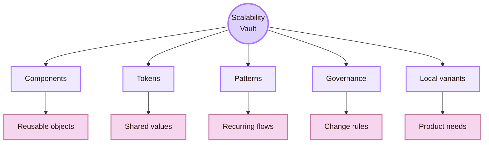

- **Component drift:** Buttons, forms, or dialogs behave differently across products (question: How can teams detect and repair divergence?)
- **Governance tension:** Teams need flexibility and shared control (question: Who decides when a component changes?)
- **Accessibility debt:** One inaccessible component spreads everywhere (question: How can access be tested at component level?)
- **Token misuse:** Colour, spacing, and type become inconsistent (question: How should tokens be documented and audited?)
- **Pattern rigidity:** Old components block new needs (question: How can systems evolve without chaos?)
- **Local contribution:** A product invents a useful local variant (question: When should a local pattern become global?)

NN/g defines design systems as standards for managing design at scale. That makes scalability a core System Design frontier, not a cosmetic issue.

## Frontier IV: Prototype Fidelity Paradox

The **Prototype Fidelity Paradox** is the problem of choosing the right prototype for the right question. A prototype is useful because it makes an idea testable. It is dangerous when the team forgets what it can and cannot prove.

Low-fidelity prototypes are fast and flexible. High-fidelity prototypes feel more realistic. Coded prototypes expose real constraints. Each kind can mislead if used for the wrong question.

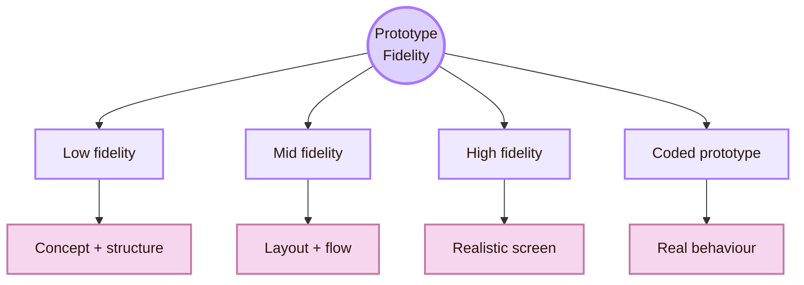

- **Low fidelity:** good for: Early concept, structure, and rough flow; danger: May miss interaction-state problems
- **Mid fidelity:** good for: Layout, hierarchy, and navigation; danger: May hide accessibility and performance issues
- **High fidelity:** good for: Realistic visual and interaction feel; danger: May freeze the design too early
- **Coded prototype:** good for: Real behaviour, responsiveness, access, and performance; danger: Costs more and may become accidental production
- **Wizard-of-Oz prototype:** good for: Future behaviour before full implementation; danger: May hide automation feasibility problems

A useful rule is simple: ask what the prototype is meant to prove before building it. If the question is about navigation labels, a polished animation may add noise. If the question is about keyboard access, a static image is not enough.

## Frontier V: Interaction Technique Frontier

The **Interaction Technique Frontier** appears when input and output methods change. System Design is no longer limited to mouse, keyboard, and flat screens. It includes touch, pen, gesture, voice, haptics, wearables, tangible objects, AR, VR, MR, fabrication, and AI-assisted interfaces.

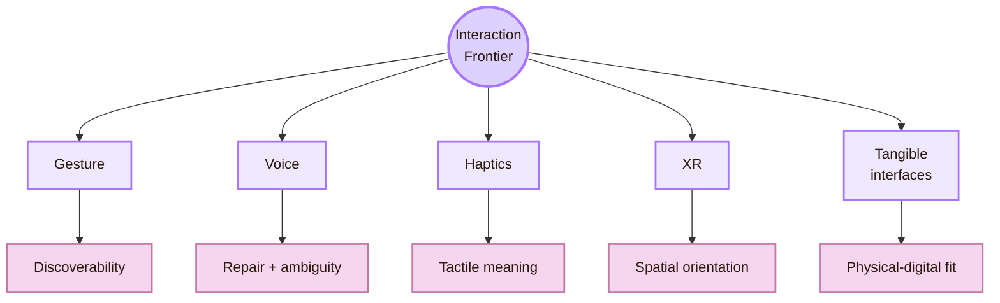

- **Gesture:** Users may not know which movements are available or recognised
- **Voice:** Accents, privacy, turn-taking, ambiguity, and repair remain difficult
- **Haptics:** Designers lack stable languages for tactile meaning
- **AR and MR:** Interfaces must align with space, attention, safety, and body movement
- **VR:** Comfort, orientation, fatigue, and accessibility remain difficult
- **Tangible interfaces:** Physical affordances and digital behaviour must match
- **Fabricated devices:** Novel prototypes may be hard to maintain, scale, or evaluate
- **AI-assisted interfaces:** Generated suggestions need correctness, control, and review

Useful venue routes include UIST for interface techniques, TEI for tangible and embodied interaction, ISS for surfaces and spaces, SUI for spatial interaction, IEEE VR and ISMAR for immersive systems, and SIGGRAPH for graphics-heavy interaction.

## Frontier VI: Adaptive Context Problem

The **Adaptive Context Problem** is the problem of keeping task meaning stable while the interface changes. A design may appear on a laptop, phone, large display, smartwatch, kiosk, AR headset, classroom projector, or shared device. It may be used in bright light, low bandwidth, a second language, or with assistive technology.

Material Design describes adaptive design as techniques that let an interface respond to context such as user preferences, device type, state, and breakpoints. The deeper problem is deciding what should change and what must remain stable.

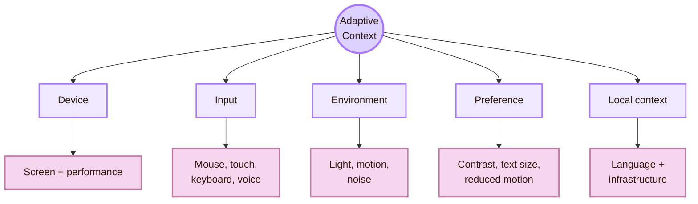

- **Mobile to desktop:** interface risk: Layout stretches but workflow does not improve (question: How should task structure adapt across screens?)
- **Touch to keyboard:** interface risk: Controls become unreachable or inefficient (question: How can input modes be equally supported?)
- **Online to offline:** interface risk: Data and actions become uncertain (question: How should offline limits be communicated?)
- **Localisation:** interface risk: Text expands or changes meaning (question: How should components survive language change?)
- **Reduced motion:** interface risk: Animations need alternatives (question: How can motion be meaningful but optional?)
- **Shared device:** interface risk: Account and privacy state become unclear (question: How should identity and data safety be shown?)

This frontier connects directly to [[Local and Global]]. A system can be globally structured and still locally fragile.

## Frontier VII: Accessibility Drift

**Accessibility Drift** means that a system can become inaccessible over time even if it once passed an accessibility review. A new component, theme, language, animation, AI-generated text, or responsive layout can quietly break focus order, semantics, contrast, labels, and error recovery.

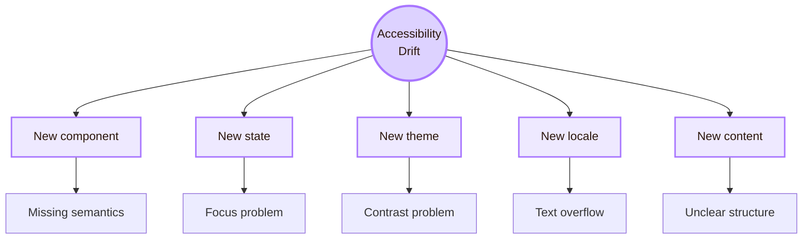

| Drift source | What breaks | Protection |
|---|---|---|
| Component redesign | Role, label, state, or keyboard behaviour | Component-level accessibility tests |
| New theme | Contrast and focus visibility | Token-level contrast checks |
| Responsive variant | Focus order and reading order | Cross-breakpoint keyboard review |
| Localised text | Layout and error meaning | Pseudolocalisation and local review |
| Dynamic content | Screen reader announcements | Careful live-region and focus checks |
| AI-generated content | Structure, clarity, bias, and alt text | Human review and content constraints |

WCAG 2.2 is organised around perceivable, operable, understandable, and robust principles. The System Design problem is how to preserve those principles across updates, variants, and interactive states.

## Frontier VIII: AI-Assisted Interface Making

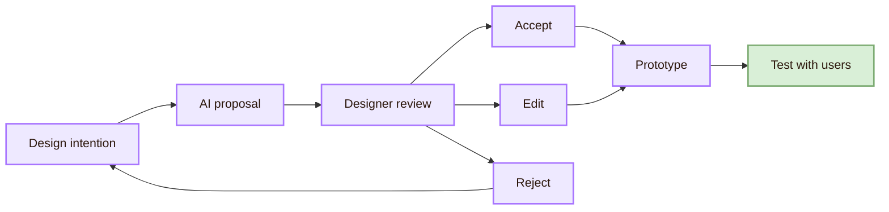

- **Sketch to interface:** Does the model understand layout intention or only surface appearance?
- **Text prompt to UI:** How can vague prompts become usable interaction?
- **Component recommendation:** Does the suggestion respect the design system?
- **Microcopy generation:** Is the text accessible, localisable, and appropriate?
- **Automatic variants:** How should variants be compared and governed?
- **AI-generated code:** Is the implementation semantic, accessible, secure, and maintainable?

System Design produces artifacts: prototypes, components, interaction techniques, design systems, patterns, and interface styles. The open problem is how to evaluate those artifacts without pretending that one metric explains everything.

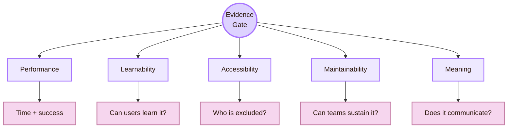

|---|---|---|
| “This layout is clearer.” | Personal preference | Task success, first-click paths, comprehension, user explanation |
| “This component scales.” | It appears in many files | Reuse patterns, contribution process, accessibility audits |
| “This prototype validates the idea.” | Stakeholders liked it | Users completed realistic tasks and understood states |
| “This interaction is natural.” | It feels intuitive to the designer | New users discover, learn, and recover without instruction |
| “This visual style motivates learning.” | It looks cool | Engagement, comprehension, recall, and navigation evidence |

## Tension Matrix

Some open problems remain hard because both sides matter.

- **Low fidelity vs high fidelity:** Low fidelity encourages change, high fidelity tests realism
- **Local fit vs global consistency:** Local users need adaptation, systems need coherence
- **Novelty vs learnability:** New techniques can be powerful but unfamiliar
- **Aesthetics vs accessibility:** Strong visual identity can weaken contrast or clarity
- **Automation vs human control:** Automation reduces effort but can reduce agency
- **Speed vs explanation:** Fast interfaces may hide why something happened
- **Reuse vs specificity:** Components scale, but local tasks need nuance
- **Immersion vs safety:** XR systems can be engaging but physically and cognitively risky

## Research Routes

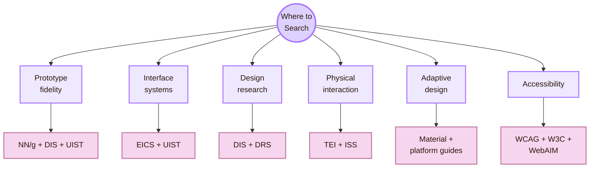

- **Prototyping fidelity:** NN/g prototyping guidance, UIST, DIS, design research literature
- **Engineered complexity:** EICS, UIST, TOCHI, software architecture for UI systems
- **Design-system scale:** NN/g design systems, Material Design, Fluent, design-system research
- **Novel interaction techniques:** UIST, TEI, ISS, SUI, IEEE VR, ISMAR
- **Changing contexts:** Material adaptive design, platform guides, W3C internationalisation
- **Accessibility drift:** WCAG 2.2, W3C WAI, WebAIM, component-level accessibility testing
- **AI-assisted interface making:** UIST, CHI, IUI, TiiS, recent UI generation research
- **Evidence for artifacts:** DIS, CHI, TOCHI, research-through-design literature

## Workbench Checklist

Use this checklist before adding or publishing a System Design page.

- **Official anchor:** Is the CS2023 label visible near the top?
- **Cognitive load:** Are sections short enough to scan?
- **Mermaid readability:** Are diagrams compact, light, and readable in the theme?
- **Source fit:** Do the anchors support this exact page?
- **Accessibility:** Can the page be read, navigated, and understood without relying on style alone?
- **Portability:** Will the page still make sense if CSS or images fail?

## Academic Anchors

| Frontier route | Source |
|---|---|
| CS2023 HCI System Design basis | [CS2023 HCI Version Gamma](https://csed.acm.org/wp-content/uploads/2023/09/HCI-Version-Gamma.pdf) |
| CS2023 Knowledge Areas | [CS2023 Knowledge Areas](https://csed.acm.org/knowledge-areas/) |
| UI software and technology | [ACM UIST](https://uist.acm.org/) |
| Engineering interactive systems | [ACM EICS](https://eics.acm.org/) |
| Designing interactive systems | [ACM DIS](https://dis.acm.org/) |
| Tangible and embodied interaction | [ACM TEI](https://tei.acm.org/) |
| Spatial interaction | [ACM SUI](https://sigchi.org/events/sui-2025/) |
| Virtual reality and 3D UI | [IEEE VR](https://ieeevr.org/) |
| Mixed and augmented reality | [IEEE ISMAR](https://www.ismar.net/) |
| Graphics and interactive techniques | [ACM SIGGRAPH](https://www.siggraph.org/) |
| Prototyping fidelity | [NN/g: Low-Fidelity vs. High-Fidelity Prototypes](https://www.nngroup.com/articles/ux-prototype-hi-lo-fidelity/) |
| Design systems at scale | [NN/g: Design Systems 101](https://www.nngroup.com/articles/design-systems-101/) |
| Design-system research | [Understanding and Supporting the Design Systems Practice](https://arxiv.org/abs/2205.10713) |
| Adaptive design | [Material Design 3 Adaptive Design](https://m3.material.io/foundations/adaptive-design/overview) |
| Accessibility standard | [WCAG 2.2](https://www.w3.org/TR/WCAG22/) |
| WCAG understanding docs | [Understanding WCAG 2.2](https://www.w3.org/WAI/WCAG22/Understanding/) |
| Research through design | [Histories and Futures of Research through Design](https://www.ijdesign.org/index.php/IJDesign/article/view/3192/875) |
| Sketch-to-code frontier | [Sketch2Code: Evaluating Vision-Language Models for Interactive Web Design Prototyping](https://arxiv.org/abs/2410.16232) |

^open-problems-system-design-end
