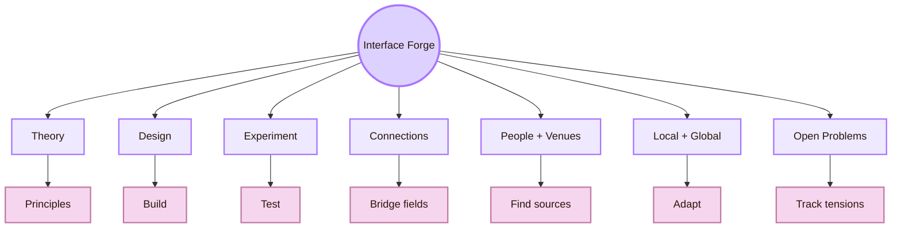
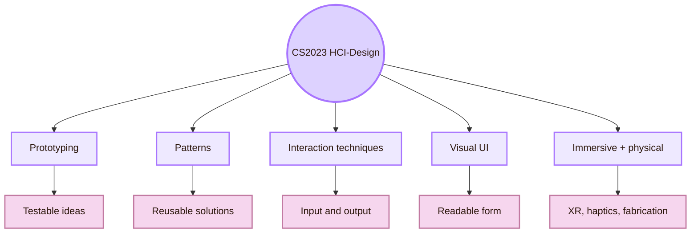
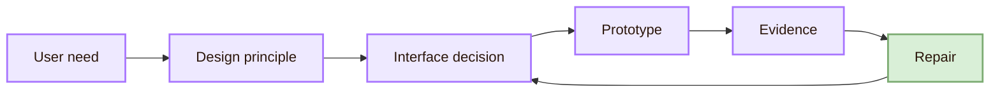
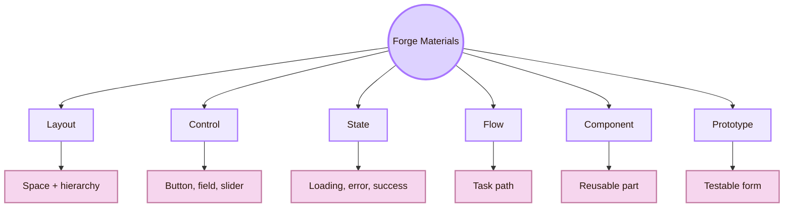
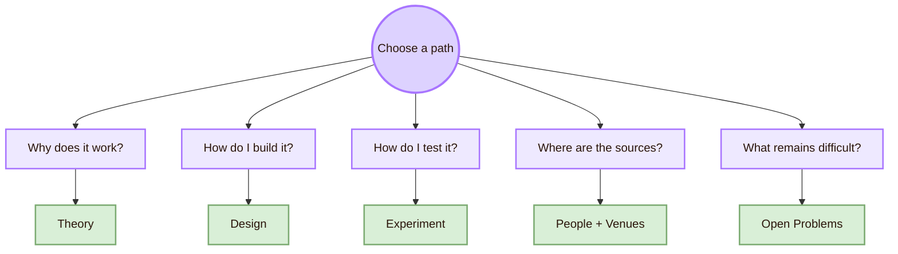
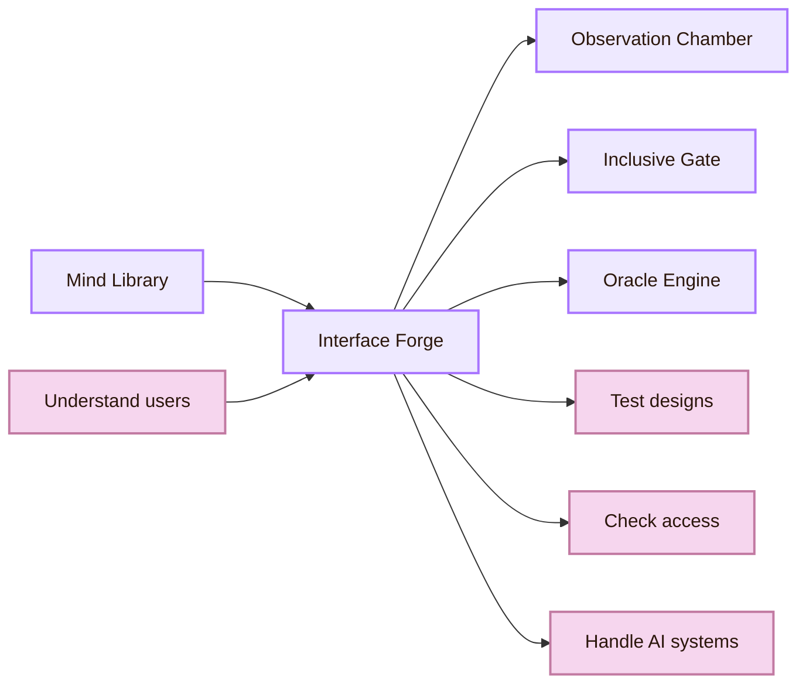
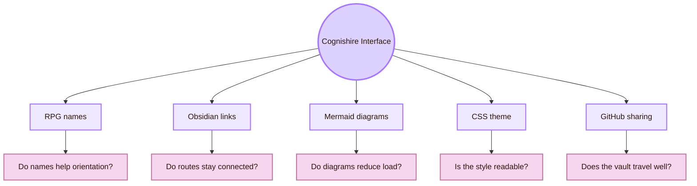

![[train.gif|1000]]
# The Interface Forge

> [!abstract] Forge Entrance
> **The Interface Forge** is the Cognishire name for **CS2023 HCI-Design: System Design**. This room studies how user needs, interface principles, prototypes, visual UI design, interaction techniques, platform limits, and accessibility requirements become working interactive systems.

The official academic area is **Human-Computer Interaction**. The official CS2023 unit is **HCI-Design: System Design**. The fantasy name is **Interface Forge** because this room is about making: shaping, testing, and refining the interface that users actually touch, click, read, hear, control, or inhabit.

This room keeps the RPG map style, but every metaphor has a direct real-life meaning.

| RPG name | Real HCI meaning |
|---|---|
| Interface Forge | The System Design part of HCI |
| Blueprint | A planned interface structure |
| Tool | A control, component, state, or pattern |
| Trial | A prototype test or design evaluation |
| Repair | A redesign based on evidence |

The [[../01_Understanding_the_User/Overview|Mind Library]] explains users. The Interface Forge turns that understanding into interface form. The [[../03_Evaluating_the_Design/Overview|Observation Chamber]] tests whether the form works. The [[../04_Accessibility_and_Accountability/Overview|Inclusive Gate]] checks access, ethics, and accountability. The [[../05_Human_AI_Interaction/Overview|Oracle Engine]] extends the map toward intelligent and AI-mediated systems.

> [!quote] Forge rule

## Quick route through the forge

Use this table first. It lowers the cognitive load before the larger map.

| Need | Go to | What you will find |
|---|---|---|
| I need principles | [[Activities/Theory|Theory]] | Layout, states, affordances, navigation, components, accessibility |
| I need to build | [[Activities/Design|Design]] | Forms, controls, feedback, prototypes, design systems |
| I need to test | [[Activities/Experiment|Experiment]] | Usability tests, probes, comparison studies, accessibility checks |
| I need connections | [[Connections|Connections]] | Software engineering, visual communication, graphics, ubicomp |
| I need sources | [[Important Venues|Important Venues]] | Conferences, journals, labs, studios |
| I need researchers | [[Important People|Important People]] | Professors, labs, and academic routes |
| I need scale | [[Local and Global|Local and Global]] | Local context, global systems, platforms, cultures |
| I need frontiers | [[Open Problems|Open Problems]] | Tradeoffs, complexity, scalability, AI-assisted design |

## Room map

The map has one simple logic: learn the principle, build a form, test the form, then repair it. The fantasy frame makes the folder memorable. The real academic structure keeps it valid.

## CS2023 foundation

CS2023 places **System Design** inside the Human-Computer Interaction knowledge area. It includes topics such as prototyping, design patterns, design constraints, participatory design, co-design, interaction techniques, graphical user interfaces, hardware design, haptics, error handling, visual UI design, layout, Gestalt principles, immersive environments, fabrication, creativity support tools, and voice UI.

This matters because the Interface Forge is not a random UX folder. It is the **System Design** part of HCI. It treats design as a computer science activity: building interactive systems that can be implemented, evaluated, revised, and maintained.

## The forge workflow

The forge workflow keeps the page practical. Every design decision should move through this loop.

| Workflow step | Real action | Check question |
|---|---|---|
| User need | Identify the goal, task, context, and constraint | What problem should the interface solve? |
| Design principle | Choose the HCI idea behind the solution | Which concept justifies the design choice? |
| Interface decision | Create a layout, control, route, state, or component | What changed on the interface? |
| Prototype | Make the idea visible and testable | What fidelity is enough for this question? |
| Evidence | Observe use and collect findings | Did users understand and complete the task? |
| Repair | Improve the design based on evidence | What should change next? |

> [!important] Low-load rule
> Do not add more visual effects until the task path is clear. In Cognishire, the RPG style should help orientation, not compete with learning.

## What the forge builds

System Design builds the materials of interaction. These are the tools on the forge table.

| Material | What it does | Common failure |
|---|---|---|
| Layout | Organises attention and meaning | Everything looks equally important |
| Control | Makes an action possible | Users do not know what can be clicked or changed |
| State | Shows what the system is doing | Users repeat actions or lose trust |
| Navigation | Helps users move and stay oriented | Users get lost or rely only on search |
| Form | Turns intent into structured input | Users guess formats and face vague errors |
| Component | Creates reusable interface behaviour | The same object behaves differently across pages |
| Prototype | Makes design testable | The team debates opinions instead of evidence |
| Design system | Scales interface quality | Components drift or become too rigid |

## Forge stations

Each station is a fantasy name with a practical role.

| Forge station | Real HCI work | Use it for |
|---|---|---|
| Blueprint Table | Planning interface structure | Task flows, information architecture, requirements |
| Layout Anvil | Shaping visible order | Spacing, hierarchy, grouping, alignment |
| Action Furnace | Making possible actions clear | Buttons, fields, gestures, signifiers |
| State Lantern | Showing system status | Loading, success, error, empty, disabled states |
| Path Rail | Supporting wayfinding | Menus, breadcrumbs, links, active states |
| Component Vault | Keeping patterns consistent | Design systems, tokens, reusable components |

This keeps the RPG atmosphere, but it also gives a study route. A reader can move station by station without holding the whole room in memory.

## What this room is, and what it is not

The Interface Forge overlaps with several fields. Its role is specific.

| Field | What it contributes | How the Forge uses it |
|---|---|---|
| Software engineering | State, performance, architecture, reliability | Makes interface ideas implementable |
| Visual communication | Typography, contrast, composition | Makes meaning visible |
| Interaction design | Action, feedback, flow | Shapes what users do |
| Industrial design | Body, device, physical use | Helps interaction fit real bodies and objects |
| Architecture | Wayfinding and structure | Helps users move through complex systems |
| Graphics | Visual representation and motion | Supports diagrams, icons, data, XR, and creative tools |
| Accessibility | Inclusive operation | Prevents components and flows from excluding users |
| User research | Evidence from use | Shows what the forge must repair |

## Page route

Start with [[Activities/Theory|Theory]] when you need the principle behind an interface choice. Use [[Activities/Design|Design]] when you need to construct the interface. Use [[Activities/Experiment|Experiment]] when you need to test a prototype or compare alternatives. Use [[Connections|Connections]] when another discipline explains the problem better. Use [[Important People|Important People]] and [[Important Venues|Important Venues]] when you need academic routes. Use [[Local and Global|Local and Global]] when a design travels across platforms, languages, devices, or cultures. Use [[Open Problems|Open Problems]] when a design tension has no simple rule.

## System Design and the five-room map

System Design is the second room because it depends on user understanding and prepares evaluation.

| Connected room | Relation to the Interface Forge |
|---|---|
| [[../01_Understanding_the_User/Overview|Mind Library]] | Supplies user concepts: mental models, memory, cognitive load, trust, accessibility needs |
| [[../03_Evaluating_the_Design/Overview|Observation Chamber]] | Supplies methods for testing and evidence |
| [[../04_Accessibility_and_Accountability/Overview|Inclusive Gate]] | Supplies accessibility, ethics, and accountability constraints |
| [[../05_Human_AI_Interaction/Overview|Oracle Engine]] | Supplies human-AI interaction, uncertainty, automation, and control problems |

A design that ignores the Mind Library becomes decoration. A design that never reaches the Observation Chamber remains a guess. A design that avoids the Inclusive Gate risks exclusion. A design with AI features needs the Oracle Engine because prediction, automation, and generation change the user’s role.

## Source grounding

The Interface Forge uses three source layers.

| Source layer | Examples | What it gives this room |
|---|---|---|
| Curriculum | CS2023 HCI knowledge area | Official academic structure |
| Research venues | UIST, EICS, DIS, TEI, SUI, IEEE VR, ISMAR, SIGGRAPH | Routes into current system-design research |
| Standards and practice | ISO 9241-210, WCAG 2.2, Material Design, Apple HIG, Fluent 2, NN/g | Practical design, accessibility, and platform guidance |
| Journals | TOCHI, PACM HCI, IJHCS, TiiS | Longer-form and archival research |

## Cognishire self-test

The vault itself is an interface. Its RPG style, links, diagrams, CSS, files, GitHub setup, and reading flow are all System Design decisions.

| Project decision | System Design question | Low-load repair |
|---|---|---|
| Fantasy room names | Do users understand the metaphor and the CS2023 meaning? | Put the real label in every opening callout |
| Mermaid diagrams | Do visuals clarify or distract? | Keep diagrams small and use tables for detail |
| CSS theme | Does the RPG identity remain readable? | Use strong contrast and avoid cramped text |
| Obsidian links | Can users move without getting lost? | Add return paths and clear page names |
| GitHub sharing | Does the vault work after download? | Document setup and keep folders stable |

## Academic anchors

| Route | Source |
|---|---|
| CS2023 HCI System Design basis | [CS2023 HCI Knowledge Area](https://csed.acm.org/knowledge-areas-human-computer-interaction-hci-sigcse-2022-version/) |
| CS2023 Knowledge Areas | [CS2023 Knowledge Areas](https://csed.acm.org/knowledge-areas/) |
| Human-centred design | [ISO 9241-210](https://www.iso.org/standard/77520.html) |
| Accessibility standard | [WCAG 2.2](https://www.w3.org/TR/WCAG22/) |
| Usability and interface heuristics | [NN/g: 10 Usability Heuristics](https://www.nngroup.com/articles/ten-usability-heuristics/) |
| Visual hierarchy | [NN/g: Visual Hierarchy in UX](https://www.nngroup.com/articles/visual-hierarchy-ux-definition/) |
| UI software and technology | [ACM UIST](https://uist.acm.org/) |
| Engineering interactive systems | [ACM EICS](https://eics.acm.org/) |
| Designing interactive systems | [ACM DIS](https://dis.acm.org/) |
| Tangible and embodied interaction | [ACM TEI](https://tei.acm.org/) |
| Material design system | [Material Design 3](https://m3.material.io/) |
| Apple platform guidance | [Apple Human Interface Guidelines](https://developer.apple.com/design/human-interface-guidelines) |
| Microsoft design system | [Fluent 2](https://fluent2.microsoft.design/) |

^overview-system-design-end
