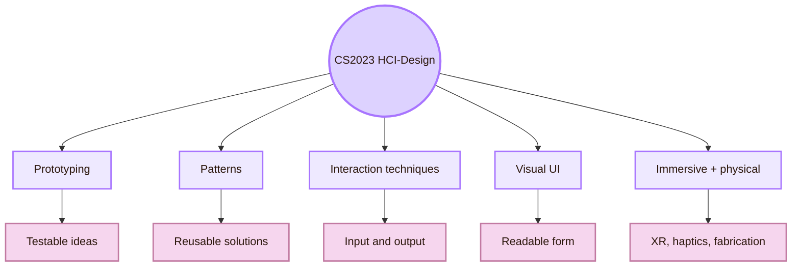
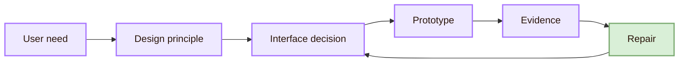
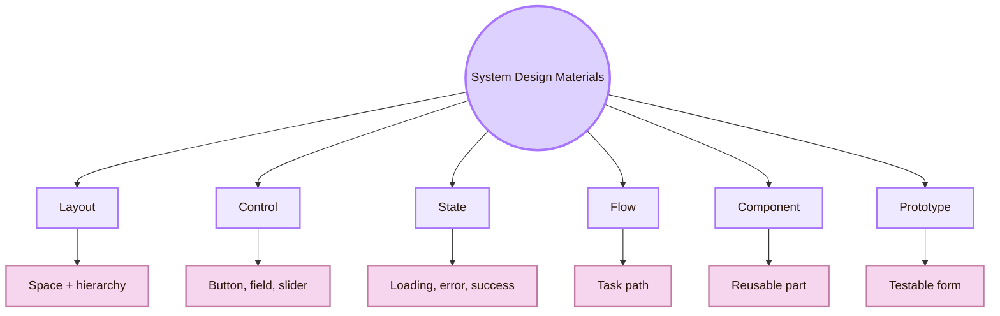

![[overview2.jpg|1000]]
# System Design

> [!quote] System Design rule

## Area map

## CS2023 foundation

CS2023 places **System Design** inside the Human-Computer Interaction knowledge area. It includes topics such as prototyping, design patterns, design constraints, participatory design, co-design, interaction techniques, graphical user interfaces, hardware design, haptics, error handling, visual UI design, layout, Gestalt principles, immersive environments, fabrication, creativity support tools, and voice UI.

## System Design Workflow

System Design Workflow keeps the page practical. Every design decision should move through this loop.

## What System Design builds

System Design builds the materials of interaction. These are the tools on the design workspace.

- **Layout:** what it does: Organises attention and meaning; common failure: Everything looks equally important
- **Control:** what it does: Makes an action possible; common failure: Users do not know what can be clicked or changed
- **State:** what it does: Shows what the system is doing; common failure: Users repeat actions or lose trust
- **Navigation:** what it does: Helps users move and stay oriented; common failure: Users get lost or rely only on search
- **Form:** what it does: Turns intent into structured input; common failure: Users guess formats and face vague errors
- **Component:** what it does: Creates reusable interface behaviour; common failure: The same object behaves differently across pages
- **Prototype:** what it does: Makes design testable; common failure: The team debates opinions instead of evidence
- **Design system:** what it does: Scales interface quality; common failure: Components drift or become too rigid

## What this area is, and what it is not

- **Software engineering:** what it contributes: State, performance, architecture, reliability; how the system design process uses it: Makes interface ideas implementable
- **Visual communication:** what it contributes: Typography, contrast, composition; how the system design process uses it: Makes meaning visible
- **Interaction design:** what it contributes: Action, feedback, flow; how the system design process uses it: Shapes what users do
- **Industrial design:** what it contributes: Body, device, physical use; how the system design process uses it: Helps interaction fit real bodies and objects
- **Architecture:** what it contributes: Wayfinding and structure; how the system design process uses it: Helps users move through complex systems
- **Graphics:** what it contributes: Visual representation and motion; how the system design process uses it: Supports diagrams, icons, data, XR, and creative tools
- **Accessibility:** what it contributes: Inclusive operation; how the system design process uses it: Prevents components and flows from excluding users
- **User research:** what it contributes: Evidence from use; how the system design process uses it: Shows what the system design process must repair

## Source grounding

| Source layer | Examples | What it gives this area |
|---|---|---|
| Curriculum | CS2023 HCI knowledge area | Official academic structure |
| Research venues | UIST, EICS, DIS, TEI, SUI, IEEE VR, ISMAR, SIGGRAPH | Routes into current system-design research |
| Standards and practice | ISO 9241-210, WCAG 2.2, Material Design, Apple HIG, Fluent 2, NN/g | Practical design, accessibility, and platform guidance |
| Journals | TOCHI, PACM HCI, IJHCS, TiiS | Longer-form and archival research |

## Academic anchors

| Route | Source |
|---|---|
| CS2023 HCI System Design basis | [CS2023 HCI Knowledge Area](https://csed.acm.org/knowledge-areas-human-computer-interaction-hci-sigcse-2022-version/) |
| CS2023 Knowledge Areas | [CS2023 Knowledge Areas](https://csed.acm.org/knowledge-areas/) |
| Human-centred design | [ISO 9241-210](https://www.iso.org/standard/77520.html) |
| Accessibility standard | [WCAG 2.2](https://www.w3.org/TR/WCAG22/) |
| Usability and interface heuristics | [NN/g: 10 Usability Heuristics](https://www.nngroup.com/articles/ten-usability-heuristics/) |
| Visual hierarchy | [NN/g: Visual Hierarchy in UX](https://www.nngroup.com/articles/visual-hierarchy-ux-definition/) |
| UI software and technology | [ACM UIST](https://uist.acm.org/) |
| Engineering interactive systems | [ACM EICS](https://eics.acm.org/) |
| Designing interactive systems | [ACM DIS](https://dis.acm.org/) |
| Tangible and embodied interaction | [ACM TEI](https://tei.acm.org/) |
| Material design system | [Material Design 3](https://m3.material.io/) |
| Apple platform guidance | [Apple Human Interface Guidelines](https://developer.apple.com/design/human-interface-guidelines) |
| Microsoft design system | [Fluent 2](https://fluent2.microsoft.design/) |

^overview-system-design-end
