![[como.jpg|1000]]
# Design

The real CS2023 label is **HCI-Evaluation: Evaluating the Design**.  
The real-life meaning is **planning an evaluation before collecting data so the study can produce clear, ethical, and defensible findings**.

> [!quote] Protocol rule
> A study does not become rigorous because it uses many metrics. It becomes rigorous when every task, measure, and instrument serves the evaluation question.

## Protocol Map

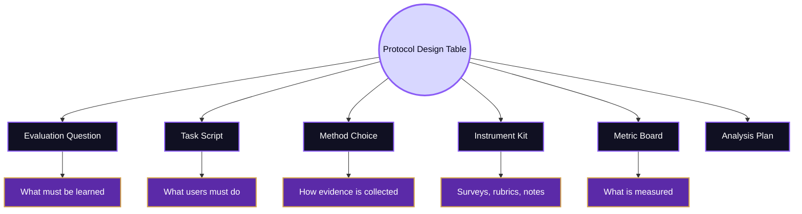

## CS2023 Design Grounding

CS2023 HCI-Evaluation includes methods for evaluation with users, formative and summative assessment, usability testing, qualitative and quantitative methods, surveys, interviews, focus groups, observation, study planning, hypothesis design, heuristic evaluation, and drawing defensible conclusions.

Designing an evaluation protocol is therefore not a side activity. It is part of the CS2023 skill itself.

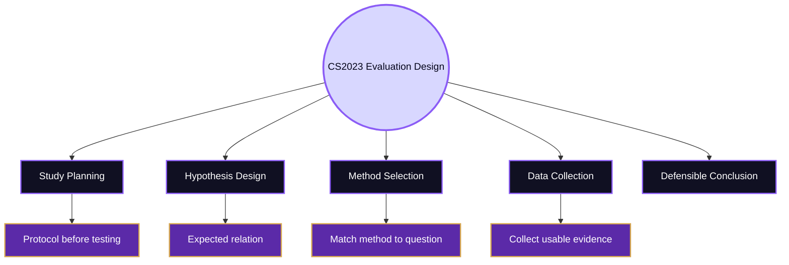

- **Formative assessment:** Design a study that finds problems and improves the interface
- **Summative assessment:** Design a study that judges a stable interface against criteria
- **Functionality and usability testing:** Create tasks that reveal whether the system works and is usable
- **Utility, efficiency, learnability, satisfaction:** Select metrics and instruments that match each construct
- **Qualitative methods:** Prepare observation notes, interview questions, and coding categories
- **Quantitative methods:** Define variables, measures, comparison logic, and data recording
- **Heuristic evaluation:** Prepare evaluator instructions, heuristics, severity ratings, and issue templates

## The Evaluation Question Gate

The Evaluation Question Gate is the first protocol decision. A vague question creates vague evidence. A good question identifies the interface, users, task, context, and outcome.

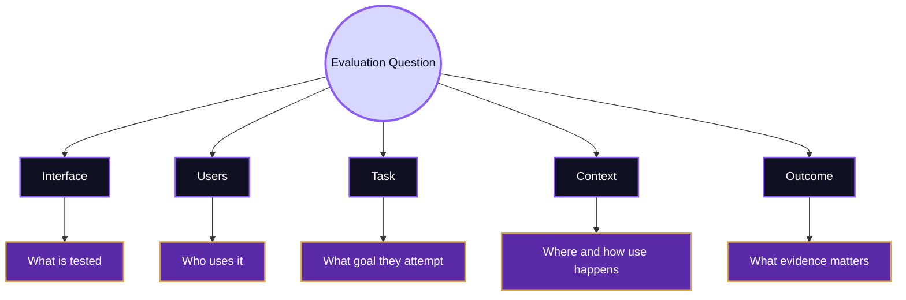

NN/g describes usability testing tasks as realistic activities participants might perform in real life. This matters because the evaluation question should be grounded in real use, not in artificial button-clicking.

## The Method Selection Compass

A protocol must choose the method that fits the question. The wrong method can produce data, but not useful evidence.

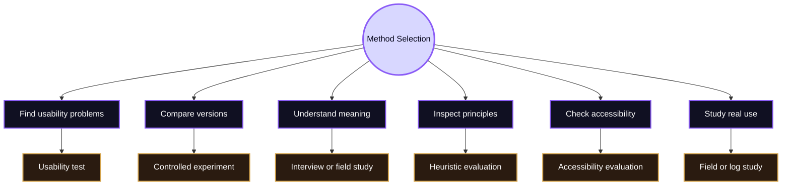

- **Discover interface breakdowns:** best method family: Moderated usability test; why: Shows behaviour, confusion, and recovery
- **Compare two design alternatives:** best method family: Controlled experiment or A/B comparison; why: Supports condition-based comparison
- **Understand user context:** best method family: Interview, diary, or field study; why: Reveals meaning, motivation, and environment
- **Find obvious usability issues quickly:** best method family: Heuristic evaluation; why: Uses expert inspection before user testing
- **Evaluate learnability:** best method family: Cognitive walkthrough or first-use test; why: Focuses on step-by-step understanding
- **Check accessibility:** best method family: WCAG review, keyboard test, screen reader check, user testing with disabled participants; why: Evaluates inclusion beyond average use
- **Study large-scale usage:** best method family: Product analytics or log study; why: Reveals patterns at scale, but not always reasons

NN/g’s UX research method guidance is useful here because it distinguishes methods by purpose, such as discovery, validation, behavioural observation, attitudinal data, qualitative insight, and quantitative measurement.

## The Task Script System Design

Task design is one of the most important parts of an evaluation protocol. The task should give a goal, not instructions for how to use the interface. If the task tells users exactly what to click, the test no longer evaluates navigation or discoverability.

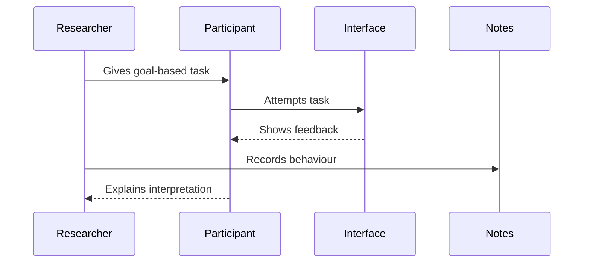

A strong task should be realistic, short enough to understand, and open enough to reveal the user’s strategy. It should not hide the answer inside the wording.

## The Moderator Script

A moderated usability test needs a script so participants receive the same setup. The script protects consistency and reduces accidental hints.

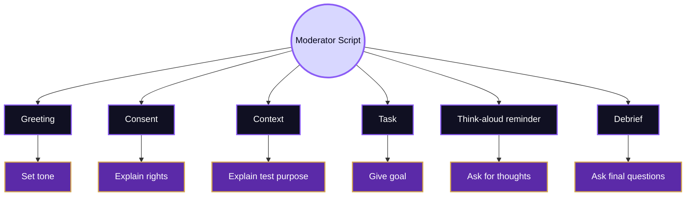

- **Greeting:** “Thank you for helping me test this learning interface.”
- **Non-blame framing:** “We are testing the design, not you.”
- **Consent:** “You can stop at any time and skip any question.”
- **Think-aloud instruction:** “Please say what you are looking for and what you expect to happen.”
- **Neutral help rule:** “I may ask what you are thinking, but I will not guide you unless you are stuck for too long.”
- **Debrief:** “What felt clear, what felt confusing, and what would you change?”

NN/g describes thinking aloud as a simple and powerful usability method because it reveals what users think while interacting. It must still be handled carefully: the moderator should encourage explanation without leading the participant.

## The Instrument Kit

The Instrument Kit is the set of materials used to collect evidence. It may include a consent form, participant screener, task sheet, observation form, post-task questionnaire, post-study questionnaire, accessibility checklist, issue log, severity rubric, and debrief questions.

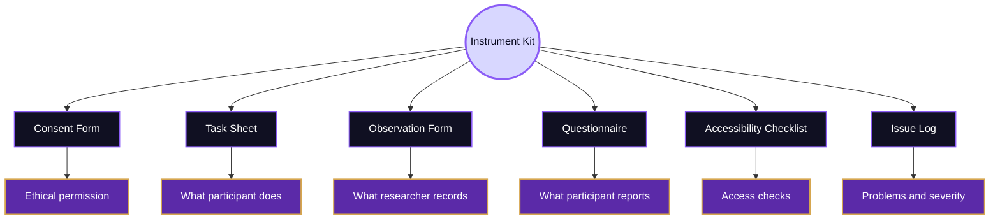

- **Consent form:** Purpose, recording, voluntary participation, privacy, withdrawal
- **Screener:** Participant type, experience level, accessibility needs, device context
- **Task sheet:** Goal-based tasks, not step-by-step instructions
- **Observation form:** Time, success, errors, hesitation, quotes, unexpected behaviour
- **Post-task scale:** Difficulty, confidence, satisfaction, workload, depending on the question
- **Post-study scale:** SUS, UEQ, or custom global ratings when appropriate
- **Accessibility checklist:** Keyboard, focus, contrast, labels, headings, screen reader checks
- **Issue log:** Problem, evidence, severity, likely cause, design implication

A good instrument kit makes the study reproducible. Another person should be able to run the same evaluation and collect comparable evidence.

## The Metric Board

The Metric Board defines what will be counted, rated, or judged.

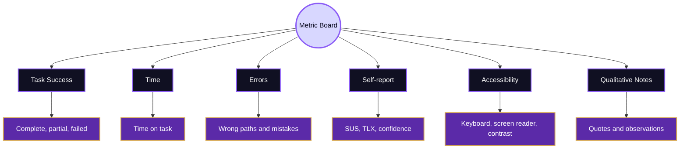

- **Task success:** definition example: Complete, partial, failed; interpretation caution: Success does not prove low effort
- **Time on task:** definition example: Seconds from task start to completion; interpretation caution: Fast can mean efficient or careless
- **Error count:** definition example: Wrong clicks, invalid submissions, route errors; interpretation caution: Errors need cause analysis
- **Assistance needed:** definition example: No help, minor prompt, major help; interpretation caution: Help from moderator can invalidate task success
- **Confidence rating:** definition example: User rates confidence after task; interpretation caution: Confidence may be wrong
- **SUS:** definition example: Global perceived usability after using the system; interpretation caution: Does not identify exact problems
- **NASA-TLX:** definition example: Perceived workload after task; interpretation caution: Workload score does not tell what to fix
- **Accessibility check:** definition example: Keyboard path, focus order, contrast, labels; interpretation caution: Automated checks are not enough

MeasuringU recommends combining study-level and task-based UX metrics when quantifying product or interface experience. NN/g also explains that perceived-usability instruments such as SUS and workload instruments such as NASA-TLX can support evaluation, but they should be paired with behavioural evidence.

## The Rubric Wall

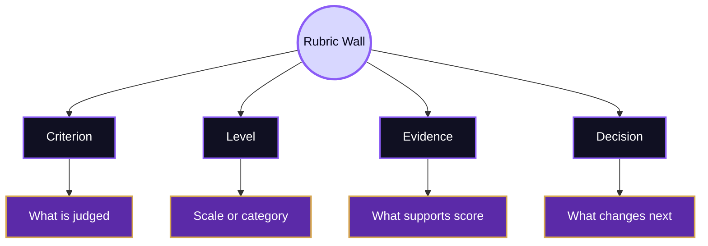

- **Task clarity:** 0: Task cannot be understood; 1: Task is vague; 2: Task is mostly clear; 3: Task is realistic and goal-based
- **Feedback visibility:** 0: No feedback; 1: Feedback appears but is unclear; 2: Feedback is visible; 3: Feedback clearly explains state and next step
- **Error recovery:** 0: No repair path; 1: Repair is hidden; 2: Repair is possible; 3: Repair is clear, local, and respectful
- **Navigation:** 0: User cannot orient; 1: Some routes are unclear; 2: Main routes are usable; 3: Location, routes, and return paths are clear
- **Accessibility:** 0: Major barriers; 1: Some basic access; 2: Mostly accessible; 3: Keyboard, focus, labels, contrast, and semantics are checked

NN/g severity ratings are useful for prioritising usability problems. A severity rubric should include impact, frequency, and persistence. A cosmetic issue is not the same as a problem that blocks task completion or excludes users.

## Accessibility Evaluation Plan

Accessibility must be designed into the evaluation protocol, not added only if time remains. W3C describes accessibility evaluation as assessment, audit, and testing. WCAG 2.2 provides testable success criteria under perceivable, operable, understandable, and robust principles.

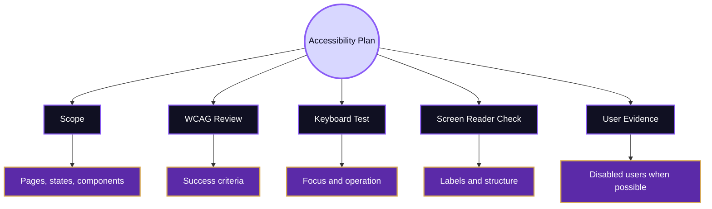

- **Scope:** Which pages, states, components, and breakpoints are checked
- **Standard:** Which WCAG version and level are used
- **Keyboard path:** Which task is completed without mouse
- **Focus review:** Whether focus order, focus visibility, and focus traps are checked
- **Screen reader check:** Which screen reader/browser combination is used
- **Contrast check:** Which text and UI elements are tested
- **Error check:** Whether users can identify and recover from errors
- **Reporting:** Issue, evidence, affected users, severity, repair recommendation

## Study Materials Pack

A complete evaluation should have a small pack of materials.

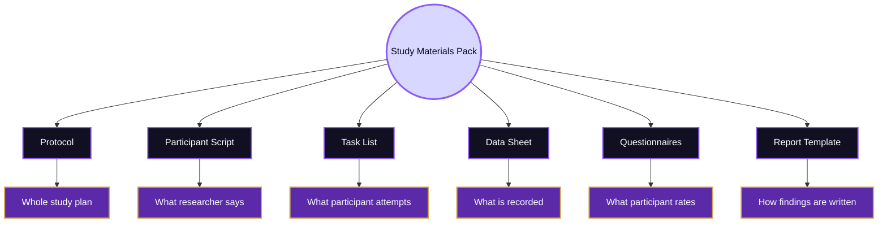

- **Protocol:** Purpose, research question, participants, method, tasks, metrics, analysis plan
- **Participant script:** Introduction, consent, non-blame statement, think-aloud instruction, closing
- **Task list:** Goal-based tasks with success criteria
- **Observation sheet:** Time, success, errors, hesitation, quotes, assistance, notes
- **Questionnaire:** Post-task and post-study ratings
- **Accessibility checklist:** Keyboard, focus, screen reader, contrast, labels, headings
- **Issue log:** Issue, evidence, severity, affected task, design recommendation
- **Report template:** Method, participants, findings, limitations, recommendations

## Analysis Plan

The analysis plan should be written before data collection. It prevents the researcher from inventing interpretations after seeing results.

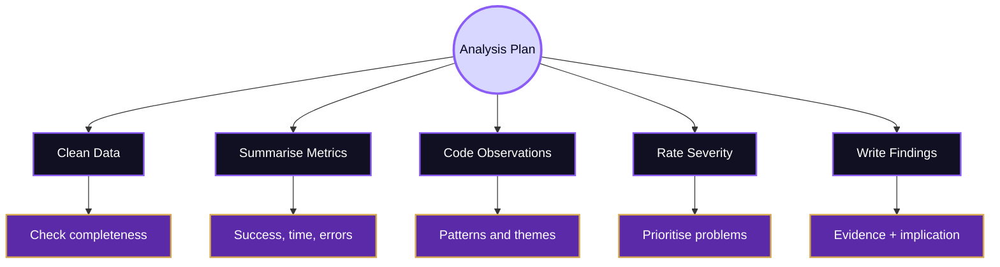

- **Task success:** Count complete, partial, failed attempts
- **Time:** Summarise cautiously, especially with small samples
- **Errors:** Group by interface location and likely cause
- **Think-aloud comments:** Extract quotes that explain confusion or expectation
- **Questionnaire ratings:** Report scale, timing, and what the score means
- **Accessibility issues:** Map issue to WCAG criterion or user impact
- **Observed behaviour:** Convert repeated patterns into findings
- **Findings:** Connect evidence to design implication

A finding should follow this pattern:

## Ethics and Consent Station

Evaluation design must include ethics. Even a small student usability test should explain the purpose, avoid pressure, protect privacy, and avoid making the participant feel judged.

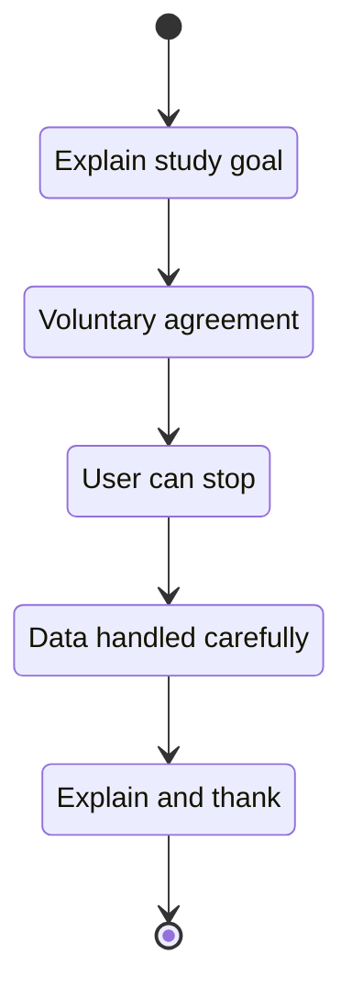

- **Non-blame statement:** Participants know the design is being tested, not their intelligence
- **Voluntary participation:** Participants can refuse or stop
- **Minimal data:** Researcher collects only what is needed
- **Recording permission:** Participants know if audio, video, or screen activity is captured
- **Anonymisation:** Report does not expose unnecessary identity
- **Accessibility accommodation:** Participants can use needed tools and adjustments
- **Debrief:** Participants understand what the study was about

## Protocol Checklist

- **Research question:** Is the evaluation question specific enough?
- **Method:** Does the method match the question?
- **Tasks:** Are tasks realistic and goal-based?
- **Metrics:** Does each metric measure something relevant?
- **Instruments:** Are scripts, sheets, and questionnaires prepared?
- **Accessibility:** Is keyboard, focus, contrast, and assistive technology considered?
- **Ethics:** Is consent, privacy, and non-blame framing included?
- **Analysis:** Is there a plan for turning evidence into findings?

## Academic Anchors

| Route | Source |
|---|---|
| CS2023 HCI Evaluation basis | [CS2023 HCI Version Gamma](https://csed.acm.org/wp-content/uploads/2023/09/HCI-Version-Gamma.pdf) |
| Usability framework | [ISO 9241-11](https://www.iso.org/obp/ui/) |
| Usability testing basics | [NN/g: Usability Testing 101](https://www.nngroup.com/articles/usability-testing-101/) |
| Thinking aloud | [NN/g: Thinking Aloud: The #1 Usability Tool](https://www.nngroup.com/articles/thinking-aloud-the-1-usability-tool/) |
| UX method selection | [NN/g: Which UX Research Methods to Use](https://www.nngroup.com/articles/which-ux-research-methods/) |
| UX research cheat sheet | [NN/g: UX Research Cheat Sheet](https://www.nngroup.com/articles/ux-research-cheat-sheet/) |
| Measuring perceived usability | [NN/g: Measuring Perceived Usability](https://www.nngroup.com/articles/measuring-perceived-usability/) |
| Task-based UX metrics | [MeasuringU: Task-Based UX Metrics](https://measuringu.com/task-based-metrics/) |
| System Usability Scale | [Brooke: SUS, A Quick and Dirty Usability Scale](https://digital.ahrq.gov/sites/default/files/docs/survey/systemusabilityscale%28sus%29_comp%5B1%5D.pdf) |
| Workload instrument | [NASA Task Load Index](https://www.nasa.gov/human-systems-integration-division/nasa-task-load-index-tlx/) |
| User Experience Questionnaire | [UEQ Online](https://www.ueq-online.org/) |
| Severity ratings | [NN/g: Severity Ratings for Usability Problems](https://www.nngroup.com/articles/how-to-rate-the-severity-of-usability-problems/) |
| Accessibility evaluation overview | [W3C: Evaluating Web Accessibility Overview](https://www.w3.org/WAI/test-evaluate/) |
| Accessibility conformance methodology | [W3C: WCAG-EM Overview](https://www.w3.org/WAI/test-evaluate/conformance/wcag-em/) |
| Accessibility standard | [WCAG 2.2](https://www.w3.org/TR/WCAG22/) |
| WCAG overview | [W3C: WCAG Overview](https://www.w3.org/WAI/standards-guidelines/wcag/) |

^design-evaluating-design-end
