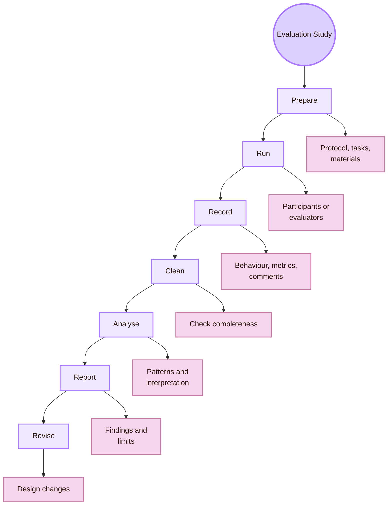
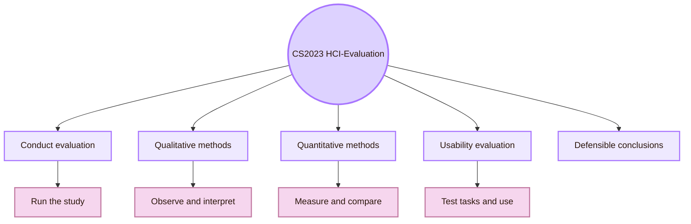
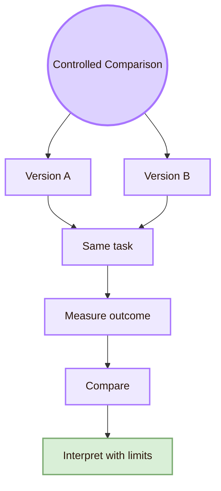
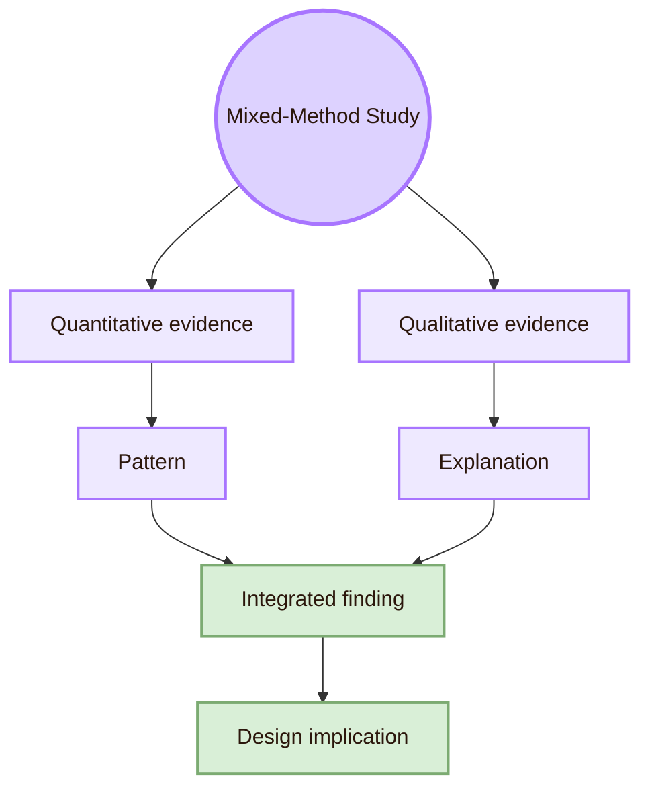
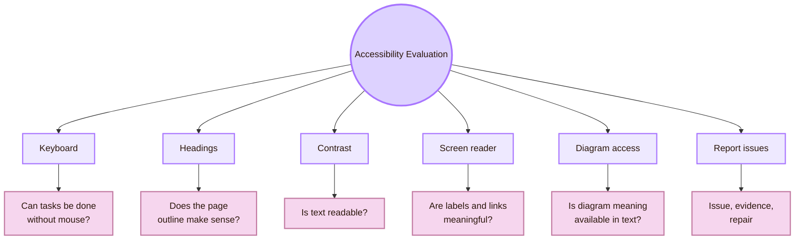

![[grasss.jpg|1000]]
# Experiment

Back to [[../Overview|The Observation Chamber]].

> [!abstract] Experiment in Evaluating the Design
> **Experiment** in **HCI-Evaluation: Evaluating the Design** means running the evaluation and turning planned methods into evidence. This page covers usability tests, controlled experiments, field studies, surveys, interviews, diary studies, log studies, heuristic evaluations, accessibility checks, and mixed-method studies.

The official CS2023 label is **HCI-Evaluation: Evaluating the Design**.  
The project nickname is **Observation Chamber**, used only as a light orientation label.  
The academic meaning is **executing a study carefully enough that the findings can support clear, limited, and useful design conclusions**.

This page is different from [[Theory]] and [[Design]].  
[[Theory]] explains the concepts behind evaluation: usability, validity, measurement, and interpretation.  
[[Design]] prepares the evaluation protocol: question, tasks, instruments, metrics, ethics, and analysis plan.  
**Experiment** is where the protocol is actually run.

> [!quote] Experiment rule
> A good experiment does not prove that a design is “good” in general. It shows what happened with specific users, tasks, tools, conditions, and evidence.

## Why this page matters for a student

| Student goal | How this page helps |
|---|---|
| Run a real HCI study | Explains how to execute usability tests, comparisons, interviews, surveys, accessibility checks, and logs |
| Improve a project | Shows how findings become design repairs |
| Build a UX portfolio | Shows what to save: protocol, task sheet, raw notes, issue log, findings, and before/after changes |
| Prepare for HCI research | Introduces study types used in CHI, TOCHI, PACM HCI, CSCW, ASSETS, ESEM, and applied UX work |

## Experiment workflow

| Stage | What happens | Output |
|---|---|---|
| Prepare | Confirm question, participants, tasks, materials, consent, and data sheet | Ready-to-run study pack |
| Run | Conduct the test, inspection, interview, survey, field observation, or log capture | Raw evidence |
| Record | Capture behaviour, metrics, comments, issues, and context | Observation notes and data |
| Clean | Check missing values, unclear notes, duplicated entries, and unusable records | Clean evidence table |
| Analyse | Find patterns, compare conditions, code comments, rate severity, or summarise metrics | Findings |
| Report | Connect evidence to design implications and limits | Short evaluation report |
| Revise | Change the design based on findings | Improved interface or system |

## CS2023 grounding

CS2023 HCI-Evaluation includes comparing evaluation methods, using qualitative and quantitative methods, planning usability evaluations, conducting evaluations, and drawing defensible conclusions from a study design. Experiment is the part where the evaluation is conducted and the conclusion is built from the collected evidence.

| CS2023 evaluation skill | Experimental interpretation |
|---|---|
| Compare evaluation methods | Decide whether to use usability testing, experiment, field study, survey, inspection, log analysis, or mixed methods |
| Use qualitative methods | Observe behaviour, interview users, code comments, interpret context |
| Use quantitative methods | Count success, errors, time, ratings, workload, and comparison outcomes |
| Plan usability evaluation | Prepare the protocol before running the study |
| Conduct usability evaluation | Run the evaluation with users or evaluators |
| Draw defensible conclusions | State what the evidence supports and what it cannot prove |

## Method selection guide

Experiment does not always mean a laboratory experiment with independent and dependent variables. In HCI, the activity page includes several empirical and analytical study types. The best method depends on the question.

| If your question is | Use this method family | Example |
|---|---|---|
| Where do users struggle? | Moderated usability test | Watch students navigate the HCI map |
| Which version performs better? | Controlled experiment or A/B comparison | Compare two room-name systems |
| Why do users interpret the page differently? | Interview or think-aloud study | Ask users what they expected each page to contain |
| Does the design violate known principles? | Heuristic evaluation | Ask an evaluator to inspect navigation, feedback, and consistency |
| Can users with different abilities access it? | Accessibility evaluation | Keyboard, contrast, heading, screen reader, and WCAG checks |
| How does the system work in real context? | Field study | Observe use during class or project preparation |
| What happens over time? | Diary or longitudinal study | Check whether students return after one week |
| What happens at scale? | Log study or analytics | Track page visits and navigation paths ethically |
| Does the system support learning? | Learning evaluation | Test concept explanation before and after using the map |
| Does the GitHub workflow survive sharing? | Empirical software evaluation | Clone test, setup log, broken-link check |

## Study types

### 1. Moderated usability test

A moderated usability test observes users trying to complete realistic tasks. It is useful when the goal is to find breakdowns, confusion, wrong turns, hesitation, and recovery paths.

| Element | Good practice |
|---|---|
| Participants | Use people similar to the intended users |
| Tasks | Give goals, not click instructions |
| Moderator | Stay neutral and avoid teaching the interface |
| Data | Record success, errors, wrong turns, time, comments, and help needed |
| Output | Issue list, evidence, severity, and design repairs |

Example task for the HCI map:

> Find the room that explains how interfaces are evaluated. Then explain in one sentence what that room studies.

Data to record:

| Data point | Example entry |
|---|---|
| Success | Complete, partial, failed |
| Wrong turns | Opened System Design before Evaluating the Design |
| Time | 2 minutes 14 seconds |
| Quote | “Observation Chamber sounds like psychology, not evaluation.” |
| Confidence | 3 out of 5 |
| Design implication | Add the official CS2023 label near the room name |

### 2. Controlled experiment

A controlled experiment compares conditions. It is useful when the question is whether one design version changes a measurable outcome.

| Part | Example |
|---|---|
| Independent variable | Page version: fantasy-first labels vs academic-first labels |
| Dependent variable | Correct room identification, explanation accuracy, time, confidence |
| Control | Same task, same participant type, similar testing setting |
| Main risk | Small samples may show local patterns, not statistical proof |
| Stronger output | “In this local test, academic-first labels reduced wrong-room choices.” |

For a student project, a controlled experiment can be small and formative. It does not need to pretend to be a full publication-level experiment.

### 3. Heuristic evaluation

Heuristic evaluation is an expert or trained-evaluator inspection. It does not replace user testing, but it can find visible problems quickly.

| Step | Action |
|---|---|
| Choose heuristics | Use Nielsen heuristics or a small project-specific checklist |
| Inspect independently | Evaluators inspect without discussing first |
| Record issues | Each issue gets location, heuristic, evidence, severity |
| Merge issues | Combine duplicates and resolve differences |
| Prioritise | Sort by severity, frequency, and repair value |

Example issue log:

| Issue | Evidence | Severity | Repair |
|---|---|---|---|
| Room nickname hides academic meaning | Evaluator did not know “Observation Chamber” meant evaluation | 3 | Add CS2023 label under title |
| Diagram is too wide | Mermaid graph overflows in reading view | 2 | Use compact flowchart |
| Source route unclear | Official CS2023 link is at bottom only | 2 | Add academic anchor near intro |

### 4. Cognitive walkthrough

A cognitive walkthrough checks whether a new user can understand each step of a task. It is useful for first-use learnability.

| Walkthrough question | HCI map example |
|---|---|
| Will the user know what to do first? | Does the overview clearly show the five HCI rooms? |
| Will the user notice the right action? | Is the link to Evaluating the Design visible? |
| Will the user understand the label? | Does “Observation Chamber” also show “Evaluating the Design”? |
| Will the user know they are progressing? | Are breadcrumbs and return links clear? |
| Will feedback be understandable? | Does the opened page confirm the correct academic area? |

### 5. Accessibility evaluation

Accessibility evaluation checks whether different users can perceive, operate, understand, and use the system. It should include more than automated checks.

| Check | What to test |
|---|---|
| Keyboard navigation | Can the user move through links and controls without a mouse? |
| Focus visibility | Is the current focus visible? |
| Heading structure | Do headings create a logical page outline? |
| Contrast | Is text readable against the background? |
| Screen reader structure | Are headings, links, and labels meaningful? |
| Diagram access | Can the user understand diagram information through text alternatives or tables? |
| Font scaling | Does the page stay readable at larger text sizes? |
| Error recovery | If a link breaks, can the user recover? |

For the HCI map, the minimum accessibility experiment should test keyboard movement, heading order, contrast, link meaning, diagram readability, and text alternatives for important diagrams.

### 6. Survey

A survey is useful for collecting self-report from more people, but it should not be used as the only evidence of usability. Users may report that something is easy while still making errors.

| Survey use | Good question type |
|---|---|
| Confidence | “How confident are you that you found the correct room?” |
| Perceived clarity | “The page title helped me understand the academic topic.” |
| Workload | Short workload or difficulty rating |
| Satisfaction | SUS or short post-task rating |
| Open feedback | “What was the most confusing part?” |

Avoid vague survey items such as:

| Weak item | Better item |
|---|---|
| “Was the page good?” | “How clear was the relationship between the room name and the CS2023 term?” |
| “Did you like the design?” | “Did the visual style help you understand the academic content?” |
| “Was it easy?” | “How difficult was it to find the evaluation page?” |

### 7. Interview

An interview is useful when the researcher needs meaning, explanation, or context. It is not ideal for measuring performance by itself.

| Interview goal | Example question |
|---|---|
| Understand interpretation | “What did you think this room would contain before opening it?” |
| Understand confusion | “Where did you hesitate?” |
| Understand vocabulary | “Which term was unclear?” |
| Understand trust | “What made the sources look credible or not credible?” |
| Understand learning | “What concept do you remember after reading?” |

Good interview data should be coded into themes, not just quoted randomly.

### 8. Field study

A field study observes use in a real or semi-real context. For this project, that might mean observing the map during seminar preparation, class presentation, or project review.

| Field study focus | Evidence |
|---|---|
| Classroom readability | Whether pages work on projector or shared screen |
| Real workflow | Whether students use the map while writing or presenting |
| Setup friction | Whether Obsidian, GitHub, CSS, and links work in practice |
| Social context | Whether professor and classmates understand the purpose |
| Long-term use | Whether the map is useful beyond one session |

### 9. Log study and analytics

A log study uses behavioural traces. It can show which pages users open, where they drop off, and which paths are common. It does not usually explain why.

| Log data | Interpretation caution |
|---|---|
| Page visits | Visits do not prove understanding |
| Link clicks | Clicks do not prove success |
| Search terms | Search terms show need, not necessarily comprehension |
| Time on page | Long time can mean interest or confusion |
| Return visits | Return visits can mean usefulness or unresolved need |

If analytics are used, the project should state what is tracked, why it is tracked, and how privacy is protected.

### 10. Mixed-method study

Mixed methods combine quantitative and qualitative evidence. They are useful when one type of data is not enough.

Example for the HCI map:

| Data type | Example |
|---|---|
| Quantitative | 4 out of 5 students found the correct room; 3 made one wrong turn |
| Qualitative | Students said the nickname was memorable but not self-explanatory |
| Integrated finding | The nickname helps identity but needs the academic label beside it |
| Design implication | Keep light project names, but make CS2023 labels dominant |

## Running a usability test

### Before the session

| Step | Action |
|---|---|
| Prepare consent | Explain purpose, voluntary participation, recording, and privacy |
| Prepare script | Use the same introduction for each participant |
| Prepare tasks | Make tasks goal-based |
| Prepare data sheet | Include success, time, errors, assistance, comments, and confidence |
| Prepare environment | Test device, browser, Obsidian view, GitHub view, and screen recording if used |
| Prepare stop rule | Define what to do if participant is stuck |

### During the session

| Moderator action | Why it matters |
|---|---|
| Say “we are testing the design, not you” | Reduces pressure |
| Ask participant to think aloud | Reveals expectations and confusion |
| Avoid giving hints | Protects evidence |
| Record behaviour before interpretation | Prevents biased notes |
| Mark assistance clearly | Shows when success depended on help |
| Ask short debrief questions | Captures meaning and reflection |

### After the session

| Step | Action |
|---|---|
| Clean notes | Clarify missing entries while memory is fresh |
| Extract issues | Turn observations into issue statements |
| Group patterns | Merge repeated issues |
| Rate severity | Prioritise by impact, frequency, persistence, and exclusion |
| Write findings | Use evidence plus design implication |
| Revise | Change page titles, links, diagrams, layout, or source placement |
| Save artifacts | Keep protocol, tasks, notes, issue log, and revisions |

## Data sheet template

| Participant | Task | Success | Time | Wrong turns | Assistance | Confidence | Notes |
|---|---|---|---|---|---|---|---|
| P1 | Find Evaluating the Design | Complete | 1:42 | 1 | None | 4/5 | Confused by room nickname |
| P1 | Find CS2023 source | Partial | 2:10 | 2 | Minor prompt | 3/5 | Expected source near top |
| P2 | Open vault from GitHub | Failed | 5:00 | N/A | Major help | 2/5 | CSS and folder path unclear |

## Issue log template

| Issue ID | Problem | Evidence | Likely cause | Severity | Repair |
|---|---|---|---|---|---|
| E1 | Users confuse room name | 3 participants asked what Observation Chamber means | Project nickname appears before academic label | 3 | Put CS2023 label directly under title |
| E2 | Source link hard to find | 2 participants could not locate official CS2023 source | Academic anchors only at bottom | 2 | Add key source near intro |
| E3 | Diagram too dense | 4 participants skipped diagram | Too many nodes and low readability | 2 | Replace with smaller diagram and table |
| E4 | GitHub clone unclear | 1 participant could not open vault correctly | Setup steps missing | 3 | Add README setup checklist |

## Severity rating

Severity should help decide what to fix first. It should not be arbitrary.

| Severity | Meaning | Example |
|---|---|---|
| 0 | Not a problem | Cosmetic preference without task effect |
| 1 | Minor issue | Slight confusion, easy recovery |
| 2 | Moderate issue | Slows the user or creates repeated hesitation |
| 3 | Major issue | Blocks task unless user gets help |
| 4 | Critical issue | Excludes users, causes wrong conclusion, or prevents use entirely |

Severity factors:

| Factor | Question |
|---|---|
| Impact | Does the issue block the task or only slow it down? |
| Frequency | How many users encounter it? |
| Persistence | Can users recover? |
| Exclusion | Does it prevent a group of users from participating? |
| Confidence damage | Does it make users distrust the system? |
| Repair cost | Is the repair simple or structural? |

## Analysis methods

### Quantitative analysis

Use quantitative analysis when you have counts, times, ratings, or comparison data.

| Data | Summary |
|---|---|
| Task success | Number and percentage complete, partial, failed |
| Time | Median or range, especially for small samples |
| Error count | Number of wrong turns or invalid actions |
| Assistance | Number of prompts needed |
| Confidence | Median rating and comments |
| SUS or other scale | Score plus interpretation limits |

### Qualitative analysis

Use qualitative analysis when you have observations, quotes, comments, or interview answers.

| Step | Action |
|---|---|
| Read notes | Look for repeated confusion or strategy |
| Code evidence | Mark themes such as naming, source trust, navigation, diagram clarity |
| Group issues | Merge similar observations |
| Connect to design | Explain what the interface made difficult |
| Use quotes carefully | Quotes illustrate a pattern, not replace evidence |

Example:

| Raw note | Code | Finding |
|---|---|---|
| “I thought Observation Chamber was psychology.” | Naming confusion | The room nickname does not communicate evaluation clearly |
| User opened System Design first | Wrong-room route | Academic labels need stronger visibility |
| User liked diagram but could not explain it | Visual preference vs comprehension | Diagram appeal does not prove learning |

### Mixed analysis

Mixed analysis integrates numbers and meaning.

| Quantitative pattern | Qualitative explanation | Integrated finding |
|---|---|---|
| 3 of 5 users opened the wrong room first | Users said the nickname sounded unrelated to evaluation | Room names need academic labels beside them |
| 4 of 5 completed task but confidence was low | Users said they were guessing | Completion alone overstates usability |
| Diagram preference was high but explanation accuracy was low | Users liked the look but ignored the content | Diagram style should be simplified |

|---|---|---|
| 5 classmates tested navigation | These participants had specific navigation problems | The map is usable for all students |
| Professor reviewed source structure | The page appears more academically grounded to this reviewer | The page is academically perfect |
| One clone test worked | The setup worked on one additional machine | The GitHub setup works everywhere |
| Keyboard navigation passed on one browser | Basic keyboard path worked in one context | The vault is fully accessible |
| Users liked the style | Users reported positive preference | The style improves learning |
| Students answered concept questions better after revision | Revision may support comprehension in this group | The map guarantees learning |

## Accessibility experiment

Accessibility should be part of the experiment, not an afterthought.

| Accessibility evidence | How to collect it |
|---|---|
| Keyboard completion | Try each main task without a mouse |
| Focus visibility | Check whether current focus is visible |
| Heading structure | Use page outline or screen reader heading navigation |
| Link meaning | Read links out of context |
| Contrast | Check text and diagram colours |
| Diagram alternative | Provide table or text explanation for diagram content |
| Screen reader basics | Test headings, links, and reading order where possible |
| Report limits | State which tools and disabilities were not tested |

## Reproducibility and artifacts

A student experiment becomes more credible when another person can inspect what happened.

| Artifact | What to save |
|---|---|
| Protocol | Research question, participants, tasks, method, metrics, analysis plan |
| Task sheet | Exact task wording |
| Moderator script | Exact introduction and help rules |
| Consent text | Participation and privacy information |
| Data sheet | Raw notes and metrics |
| Issue log | Problems, evidence, severity, repair |
| Screenshots | Version of the interface tested |
| Git commit hash | Exact repository version |
| Analysis notes | How findings were produced |
| Final report | Findings, limits, and design changes |

## Mini experiment for the HCI map

This is a practical experiment you can run for the Cognishire HCI map.

### Research question

Can first-year students find the correct HCI room, identify its CS2023 meaning, and explain the purpose of that room after using the map?

### Participants

Three to five students who have not worked on the map.

### Tasks

| Task | Success criterion |
|---|---|
| Find the room that studies users | Opens Understanding the User / Mind Library |
| Find the room that designs interfaces | Opens System Design / Interface Forge |
| Find the room that evaluates designs | Opens Evaluating the Design / Observation Chamber |
| Find one official CS2023 source | Opens or identifies CS2023 source link |
| Explain one room in plain English | Gives a correct one-sentence explanation |
| Open the vault from GitHub or copy | Opens project without major setup help |

### Measures

| Measure | Why |
|---|---|
| Task success | Effectiveness |
| Time | Efficiency |
| Wrong turns | Navigation breakdown |
| Assistance needed | Independence |
| Confidence rating | Perceived certainty |
| Explanation accuracy | Comprehension |
| Quotes | Interpretation and confusion |
| Accessibility checks | Inclusion |

### Report format

| Finding | Evidence | Design implication |
|---|---|---|
| Students confused the room nickname | 3 of 5 asked what “Observation Chamber” meant | Make academic label dominant and nickname secondary |
| Source link was hard to find | 2 of 5 could not find CS2023 quickly | Add key academic source near the introduction |
| Diagram was attractive but not explanatory | 4 of 5 liked it, 2 of 5 could explain it | Simplify diagram and add table below it |
| GitHub setup needed help | 1 of 3 failed clone/open task | Add setup checklist to README |

## Local UVT experiment route

For a local UVT project, the experiment should be small, honest, and useful.

| Local experiment | Purpose |
|---|---|
| Student navigation test | Check whether students can use the map |
| Professor review | Check academic structure and source credibility |
| Clone/setup test | Check whether GitHub and Obsidian work on another machine |
| Accessibility check | Check keyboard, headings, contrast, and diagram readability |
| Concept explanation task | Check whether users understand the content |
| Follow-up task | Check whether students remember the structure after a delay |

Local evidence should be reported as local evidence. It can strongly improve the project, but it does not automatically prove global usability.

## Career directions connected to experiment

| Career or academic route | Experimental skills to build | Portfolio evidence |
|---|---|---|
| UX researcher | Usability testing, interviewing, synthesis, reporting | Usability test report and issue log |
| Usability analyst | Task metrics, severity ratings, before/after comparison | Metric table and redesign evidence |
| Accessibility evaluator | WCAG checks, keyboard testing, screen reader basics | Accessibility evaluation report |
| Product analyst | Log events, funnels, retention, ethical analytics | Analytics plan with limitations |
| Empirical software engineering researcher | Tool evaluation, repository testing, reproducibility | Clone test, setup log, artifact package |
| EdTech evaluator | Learning tasks, comprehension, recall, classroom use | Pre/post or delayed explanation task |
| Human-AI evaluation researcher | Trust, verification, uncertainty, oversight | AI-output evaluation task and verification log |

## What to save for a portfolio

| Portfolio artifact | Why it matters |
|---|---|
| Study protocol | Shows you can plan and run research |
| Task sheet | Shows you can write realistic tasks |
| Moderator script | Shows consistency and ethics |
| Consent text | Shows participant-care awareness |
| Raw data table | Shows evidence collection |
| Issue log | Shows translation from observation to design action |
| Accessibility report | Shows inclusive evaluation |
| Before/after design changes | Shows iteration |
| Final evaluation report | Shows communication skill |

## Academic anchors

| Route | Source |
|---|---|
| CS2023 HCI Evaluation basis | [CS2023 HCI SIGCSE 2022 version](https://csed.acm.org/knowledge-areas-human-computer-interaction-hci-sigcse-2022-version/) |
| CS2023 Knowledge Areas | [CS2023 Knowledge Areas](https://csed.acm.org/knowledge-areas/) |
| Usability framework | [ISO 9241-11](https://www.iso.org/obp/ui/) |
| Applied usability testing | [NN/g: Usability Testing 101](https://www.nngroup.com/articles/usability-testing-101/) |
| Think-aloud usability testing | [NN/g: Thinking Aloud](https://www.nngroup.com/articles/thinking-aloud-the-1-usability-tool/) |
| UX research method selection | [NN/g: Which UX Research Methods to Use](https://www.nngroup.com/articles/which-ux-research-methods/) |
| Usability metrics | [NN/g: Usability Metrics](https://www.nngroup.com/articles/usability-metrics/) |
| Severity ratings | [NN/g: Severity Ratings for Usability Problems](https://www.nngroup.com/articles/how-to-rate-the-severity-of-usability-problems/) |
| UX metrics | [MeasuringU](https://measuringu.com/) |
| System Usability Scale | [SUS source PDF](https://digital.ahrq.gov/sites/default/files/docs/survey/systemusabilityscale%28sus%29_comp%5B1%5D.pdf) |
| Workload measurement | [NASA Task Load Index](https://www.nasa.gov/human-systems-integration-division/nasa-task-load-index-tlx/) |
| User Experience Questionnaire | [UEQ Online](https://www.ueq-online.org/) |
| Accessibility evaluation overview | [W3C: Evaluating Web Accessibility Overview](https://www.w3.org/WAI/test-evaluate/) |
| Accessibility conformance methodology | [WCAG-EM Overview](https://www.w3.org/WAI/test-evaluate/conformance/wcag-em/) |
| Accessibility standard | [WCAG 2.2](https://www.w3.org/TR/WCAG22/) |
| Accessibility research venue | [ACM ASSETS](https://dl.acm.org/conference/assets) |
| Core HCI venue | [ACM CHI](https://dl.acm.org/conference/chi) |
| HCI archival journal | [ACM TOCHI](https://dl.acm.org/journal/tochi) |
| HCI proceedings journal | [PACM HCI](https://dl.acm.org/journal/pacmhci) |
| Field and social evaluation venue | [ACM CSCW](https://cscw.acm.org/) |
| Empirical software engineering venue | [ESEM](https://www.esem-conferences.org/) |
| Open science infrastructure | [Open Science Framework](https://www.cos.io/products/osf) |

^experiment-evaluating-design-end
