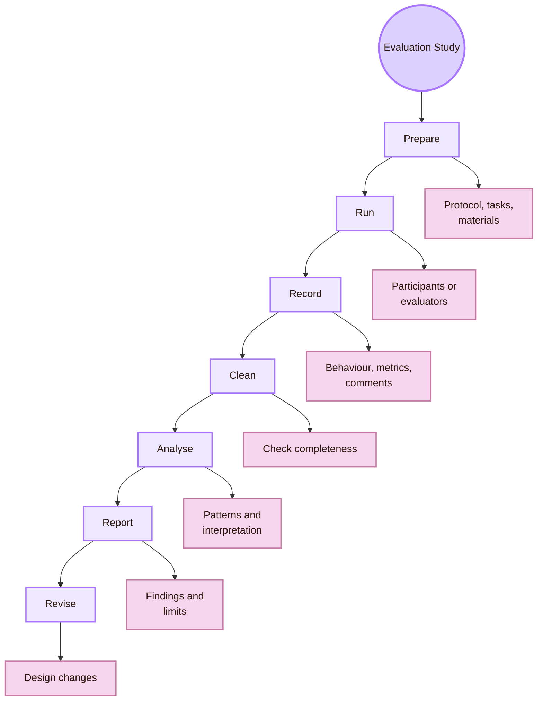
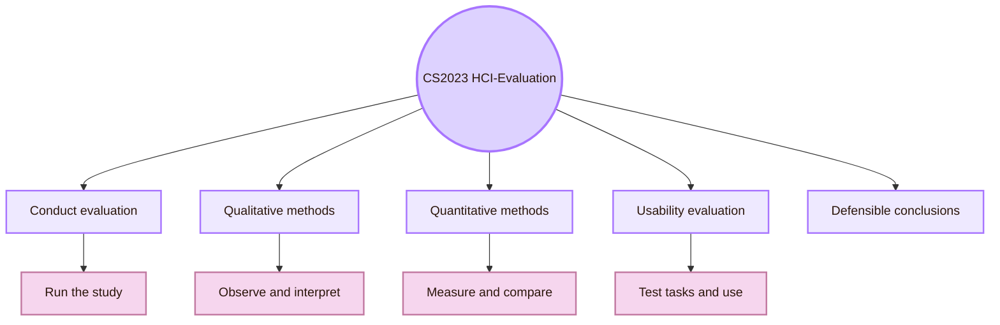
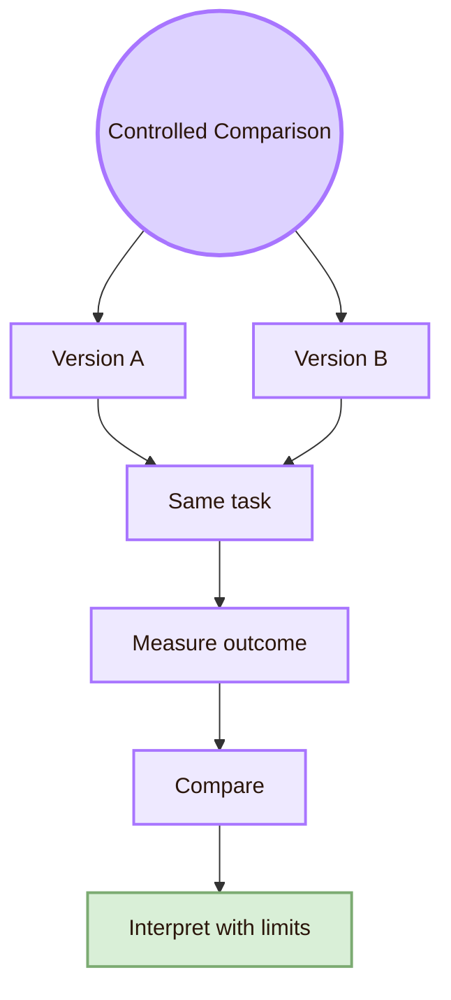
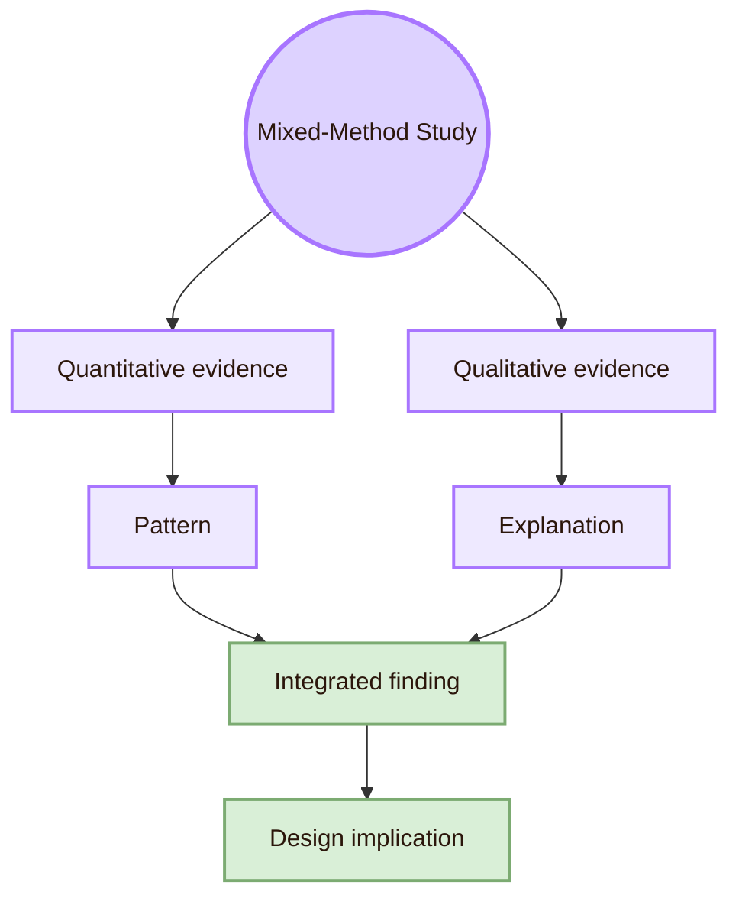
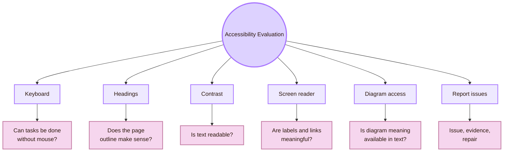

![[grasss.jpg|1000]]
# Experiment

> [!abstract] Experiment in Evaluating the Design
> **Experiment** in **HCI-Evaluation: Evaluating the Design** means running the evaluation and turning planned methods into evidence. This page covers usability tests, controlled experiments, field studies, surveys, interviews, diary studies, log studies, heuristic evaluations, accessibility checks, and mixed-method studies.

This page is different from [[Theory]] and [[Design]].  
[[Theory]] explains the concepts behind evaluation: usability, validity, measurement, and interpretation.  
[[Design]] prepares the evaluation protocol: question, tasks, instruments, metrics, ethics, and analysis plan.  
**Experiment** is where the protocol is actually run.

> [!quote] Experiment rule
> A good experiment does not prove that a design is “good” in general. It shows what happened with specific users, tasks, tools, conditions, and evidence.

## Experiment workflow

## CS2023 grounding

CS2023 HCI-Evaluation includes comparing evaluation methods, using qualitative and quantitative methods, planning usability evaluations, conducting evaluations, and drawing defensible conclusions from a study design. Experiment is the part where the evaluation is conducted and the conclusion is built from the collected evidence.

## Method selection guide

Experiment does not always mean a laboratory experiment with independent and dependent variables. In HCI, the activity page includes several empirical and analytical study types. The best method depends on the question.

## Study types

### 1. Moderated usability test

A moderated usability test observes users trying to complete realistic tasks. It is useful when the goal is to find breakdowns, confusion, wrong turns, hesitation, and recovery paths.

- **Participants:** Use people similar to the intended users
- **Tasks:** Give goals, not click instructions
- **Moderator:** Stay neutral and avoid teaching the interface
- **Data:** Record success, errors, wrong turns, time, comments, and help needed
- **Output:** Issue list, evidence, severity, and design repairs

> Complete a realistic task in the interface. Then explain in one sentence what the system is for.

### 2. Controlled experiment

A controlled experiment compares conditions. It is useful when the question is whether one design version changes a measurable outcome.

- **Dependent variable:** Task success, explanation accuracy, time, confidence
- **Control:** Same task, same participant type, similar testing setting
- **Main risk:** Small samples may show local patterns, not statistical proof
- **Stronger output:** “In this study, clearer labels reduced wrong turns.”

### 3. Heuristic evaluation

Heuristic evaluation is an expert or trained-evaluator inspection. It does not replace user testing, but it can find visible problems quickly.

- **Choose heuristics:** Use Nielsen heuristics or a focused evaluation checklist
- **Inspect independently:** Evaluators inspect without discussing first
- **Record issues:** Each issue gets location, heuristic, evidence, severity
- **Merge issues:** Combine duplicates and resolve differences
- **Prioritise:** Sort by severity, frequency, and repair value

### 4. Cognitive walkthrough

A cognitive walkthrough checks whether a new user can understand each step of a task. It is useful for first-use learnability.

### 5. Accessibility evaluation

Accessibility evaluation checks whether different users can perceive, operate, understand, and use the system. It should include more than automated checks.

- **Keyboard navigation:** Can the user move through links and controls without a mouse?
- **Focus visibility:** Is the current focus visible?
- **Heading structure:** Do headings create a logical page outline?
- **Contrast:** Is text readable against the background?
- **Screen reader structure:** Are headings, links, and labels meaningful?
- **Diagram access:** Can the user understand diagram information through text alternatives or tables?
- **Font scaling:** Does the page stay readable at larger text sizes?
- **Error recovery:** If a link breaks, can the user recover?

### 6. Survey

A survey is useful for collecting self-report from more people, but it should not be used as the only evidence of usability. Users may report that something is easy while still making errors.

- **Confidence:** “How confident are you that you completed the task correctly?”
- **Perceived clarity:** “The page title helped me understand the academic topic.”
- **Workload:** Short workload or difficulty rating
- **Satisfaction:** SUS or short post-task rating
- **Open feedback:** “What was the most confusing part?”

Avoid vague survey items such as:

### 7. Interview

An interview is useful when the researcher needs meaning, explanation, or context. It is not ideal for measuring performance by itself.

- **Understand interpretation:** “What did you think this area would contain before opening it?”
- **Understand confusion:** “Where did you hesitate?”
- **Understand vocabulary:** “Which term was unclear?”
- **Understand trust:** “What made the sources look credible or not credible?”
- **Understand learning:** “What concept do you remember after reading?”

Good interview data should be coded into themes, not just quoted randomly.

### 8. Field study

### 9. Log study and analytics

A log study uses behavioural traces. It can show which pages users open, where they drop off, and which paths are common. It does not usually explain why.

- **Page visits:** Visits do not prove understanding
- **Link clicks:** Clicks do not prove success
- **Search terms:** Search terms show need, not necessarily comprehension
- **Time on page:** Long time can mean interest or confusion
- **Return visits:** Return visits can mean usefulness or unresolved need

If analytics are used, the study should state what is tracked, why it is tracked, and how privacy is protected.

### 10. Mixed-method study

Mixed methods combine quantitative and qualitative evidence. They are useful when one type of data is not enough.

- **Quantitative:** 4 out of 5 participants completed the task; 3 made one wrong turn
- **Qualitative:** Students said the nickname was memorable but not self-explanatory
- **Integrated finding:** The nickname helps identity but needs the academic label beside it

## Running a usability test

### Before the session

### During the session

- **Say “we are testing the design, not you”:** Reduces pressure
- **Ask participant to think aloud:** Reveals expectations and confusion
- **Avoid giving hints:** Protects evidence
- **Record behaviour before interpretation:** Prevents biased notes
- **Mark assistance clearly:** Shows when success depended on help
- **Ask short debrief questions:** Captures meaning and reflection

### After the session

- **Clean notes:** Clarify missing entries while memory is fresh
- **Extract issues:** Turn observations into issue statements
- **Group patterns:** Merge repeated issues
- **Rate severity:** Prioritise by impact, frequency, persistence, and exclusion
- **Write findings:** Use evidence plus design implication
- **Revise:** Change page titles, links, diagrams, layout, or source placement
- **Save artifacts:** Keep protocol, tasks, notes, issue log, and revisions

## Data sheet template

## Issue log template

## Severity rating

Severity should help decide what to fix first. It should not be arbitrary.

- **0:** meaning: Not a problem (example: Cosmetic preference without task effect)
- **1:** meaning: Minor issue (example: Slight confusion, easy recovery)
- **2:** meaning: Moderate issue (example: Slows the user or creates repeated hesitation)
- **3:** meaning: Major issue (example: Blocks task unless user gets help)
- **4:** meaning: Critical issue (example: Excludes users, causes wrong conclusion, or prevents use entirely)

Severity factors:

- **Impact:** Does the issue block the task or only slow it down?
- **Frequency:** How many users encounter it?
- **Persistence:** Can users recover?
- **Exclusion:** Does it prevent a group of users from participating?
- **Confidence damage:** Does it make users distrust the system?
- **Repair cost:** Is the repair simple or structural?

## Analysis methods

### Quantitative analysis

Use quantitative analysis when you have counts, times, ratings, or comparison data.

- **Task success:** Number and percentage complete, partial, failed
- **Time:** Median or range, especially for small samples
- **Error count:** Number of wrong turns or invalid actions
- **Assistance:** Number of prompts needed
- **Confidence:** Median rating and comments
- **SUS or other scale:** Score plus interpretation limits

### Qualitative analysis

Use qualitative analysis when you have observations, quotes, comments, or interview answers.

- **Read notes:** Look for repeated confusion or strategy
- **Code evidence:** Mark themes such as naming, source trust, navigation, diagram clarity
- **Group issues:** Merge similar observations
- **Connect to design:** Explain what the interface made difficult
- **Use quotes carefully:** Quotes illustrate a pattern, not replace evidence

Example:

### Mixed analysis

Mixed analysis integrates numbers and meaning.

## Accessibility experiment

Accessibility should be part of the experiment, not an afterthought.

- **Keyboard completion:** Try each main task without a mouse
- **Focus visibility:** Check whether current focus is visible
- **Heading structure:** Use page outline or screen reader heading navigation
- **Link meaning:** Read links out of context
- **Contrast:** Check text and diagram colours
- **Diagram alternative:** Provide table or text explanation for diagram content
- **Screen reader basics:** Test headings, links, and reading order where possible
- **Report limits:** State which tools and disabilities were not tested

## Reproducibility and artifacts

A student experiment becomes more credible when another person can inspect what happened.

- **Protocol:** Research question, participants, tasks, method, metrics, analysis plan
- **Task sheet:** Exact task wording
- **Moderator script:** Exact introduction and help rules
- **Consent text:** Participation and privacy information
- **Data sheet:** Raw notes and metrics
- **Issue log:** Problems, evidence, severity, repair
- **Screenshots:** Version of the interface tested
- **Git commit hash:** Exact repository version
- **Analysis notes:** How findings were produced
- **Final report:** Findings, limits, and design changes

## Local UVT experiment route

For a local UVT study, the experiment should be small, honest, and useful.

Local evidence should be reported as local evidence. It can strongly improve the study, but it does not automatically prove global usability.

## Career directions connected to experiment

## What to save for a portfolio

- **Study protocol:** Shows you can plan and run research
- **Task sheet:** Shows you can write realistic tasks
- **Moderator script:** Shows consistency and ethics
- **Consent text:** Shows participant-care awareness
- **Raw data table:** Shows evidence collection
- **Issue log:** Shows translation from observation to design action
- **Accessibility report:** Shows inclusive evaluation
- **Before/after design changes:** Shows iteration
- **Final evaluation report:** Shows communication skill

## Academic anchors

| Route | Source |
|---|---|
| CS2023 HCI Evaluation basis | [CS2023 HCI SIGCSE 2022 version](https://csed.acm.org/knowledge-areas-human-computer-interaction-hci-sigcse-2022-version/) |
| CS2023 Knowledge Areas | [CS2023 Knowledge Areas](https://csed.acm.org/knowledge-areas/) |
| Usability framework | [ISO 9241-11](https://www.iso.org/obp/ui/) |
| Applied usability testing | [NN/g: Usability Testing 101](https://www.nngroup.com/articles/usability-testing-101/) |
| Think-aloud usability testing | [NN/g: Thinking Aloud](https://www.nngroup.com/articles/thinking-aloud-the-1-usability-tool/) |
| UX research method selection | [NN/g: Which UX Research Methods to Use](https://www.nngroup.com/articles/which-ux-research-methods/) |
| Usability metrics | [NN/g: Usability Metrics](https://www.nngroup.com/articles/usability-metrics/) |
| Severity ratings | [NN/g: Severity Ratings for Usability Problems](https://www.nngroup.com/articles/how-to-rate-the-severity-of-usability-problems/) |
| UX metrics | [MeasuringU](https://measuringu.com/) |
| System Usability Scale | [SUS source PDF](https://digital.ahrq.gov/sites/default/files/docs/survey/systemusabilityscale%28sus%29_comp%5B1%5D.pdf) |
| Workload measurement | [NASA Task Load Index](https://www.nasa.gov/human-systems-integration-division/nasa-task-load-index-tlx/) |
| User Experience Questionnaire | [UEQ Online](https://www.ueq-online.org/) |
| Accessibility evaluation overview | [W3C: Evaluating Web Accessibility Overview](https://www.w3.org/WAI/test-evaluate/) |
| Accessibility conformance methodology | [WCAG-EM Overview](https://www.w3.org/WAI/test-evaluate/conformance/wcag-em/) |
| Accessibility standard | [WCAG 2.2](https://www.w3.org/TR/WCAG22/) |
| Accessibility research venue | [ACM ASSETS](https://dl.acm.org/conference/assets) |
| Core HCI venue | [ACM CHI](https://dl.acm.org/conference/chi) |
| HCI archival journal | [ACM TOCHI](https://dl.acm.org/journal/tochi) |
| HCI proceedings journal | [PACM HCI](https://dl.acm.org/journal/pacmhci) |
| Field and social evaluation venue | [ACM CSCW](https://cscw.acm.org/) |
| Empirical software engineering venue | [ESEM](https://www.esem-conferences.org/) |
| Open science infrastructure | [Open Science Framework](https://www.cos.io/products/osf) |

^experiment-evaluating-design-end
