# The Observation Chamber

> [!abstract] Chamber Entrance
> **The Observation Chamber** is the project name for **CS2023 HCI-Evaluation: Evaluating the Design**. This room studies how interactive systems are tested, inspected, measured, interpreted, and revised through evidence.

**Fantasy name:** Observation Chamber  
**Real CS2023 label:** HCI-Evaluation: Evaluating the Design  
**Real-life meaning:** choose and apply methods that test whether an interactive system supports human goals.

The official academic area is **Human-Computer Interaction**. The official CS2023 unit for this room is **HCI-Evaluation: Evaluating the Design**. The chamber metaphor works because evaluation is about careful observation: watching users, measuring interaction, inspecting interfaces, interpreting evidence, and deciding what the evidence can actually prove.

The [[../01_Mind_Library/Overview|Mind Library]] explains the user. The [[../02_System_Design/Overview|Interface Forge]] builds the interface. The **Observation Chamber** asks whether that interface works when it meets real tasks, real people, real contexts, and real constraints. The [[../04_Inclusive_Gate/Overview|Inclusive Gate]] adds accessibility, ethics, and accountability. The [[../05_Oracle_Engine/Overview|Oracle Engine]] extends evaluation toward AI-mediated systems.

> [!quote] Chamber rule
> Evaluation is not asking whether people “like” the design. It asks what evidence supports the claim that the design works.

## Quick route

| Chamber station | Real meaning | Use it when you need to |
|---|---|---|
| Evidence Lantern | What evaluation measures | Define effectiveness, efficiency, satisfaction, access, and context |
| Method Hall | Evaluation methods | Choose usability testing, experiments, inspection, field study, survey, interview, or logs |
| Protocol Table | Study design | Plan tasks, participants, scripts, metrics, and analysis |
| Validity Watchtower | Trustworthiness check | Ask whether the study supports the claim |
| Access Lens | Accessibility evaluation | Check keyboard, focus, screen reader, contrast, and WCAG issues |
| Claim Seal | Evidence boundary | State what the findings can and cannot prove |

## Chamber map

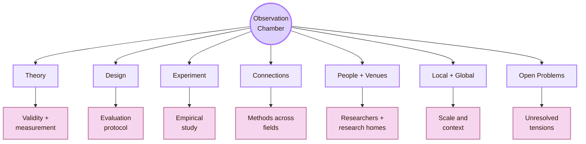

| Page | Role in the chamber | Use it when you need to |
|---|---|---|
| [[Activities/Theory|Theory]] | Concepts, validity concerns, measurement models, and evaluation frameworks | Understand what makes evaluation evidence trustworthy or weak |
| [[Activities/Design|Design]] | Protocols, tasks, instruments, metrics, rubrics, and study materials | Build an evaluation plan before collecting data |
| [[Activities/Experiment|Experiment]] | Usability tests, controlled experiments, field studies, surveys, log studies, and mixed methods | Run or compare empirical evaluation methods |
| [[Connections|Connections]] | Links to statistics, psychology, empirical software engineering, social science methods, product analytics, and ethics | Understand which other fields support evaluation |
| [[Important People|Important People]] | Researcher and practitioner roadmap | Find people associated with HCI evaluation methods |
| [[Important Venues|Important Venues]] | Conference, journal, workshop, lab, and community atlas | Find where evaluation and usability research is published |
| [[Local and Global|Local and Global]] | Scale map for evaluation settings, populations, cultures, deployments, and real-world use | Ask whether findings travel beyond one study |
| [[Open Problems|Open Problems]] | Frontier map for validity, realism, metrics, bias, reproducibility, and long-term outcomes | Track what evaluation still struggles to measure |

## CS2023 foundation

CS2023 places **Evaluating the Design** inside the Human-Computer Interaction knowledge area. This room is therefore not only “testing whether people like something.” It is about methods for evaluating interfaces with users, analytical inspection, study planning, hypotheses, usability evaluation, qualitative evidence, quantitative evidence, and defensible conclusions.

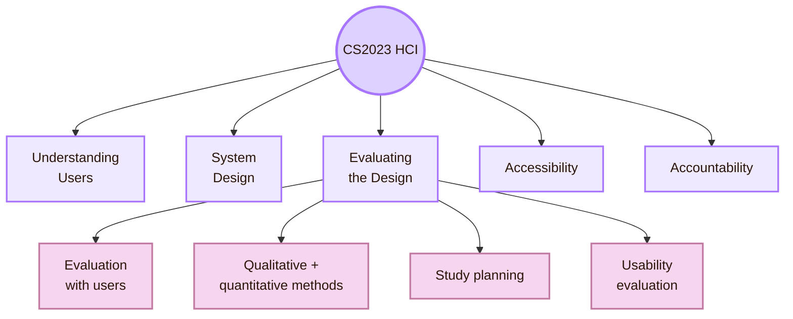

CS2023 describes HCI-Evaluation as including formative and summative assessment, functionality and usability testing, utility, efficiency, learnability, user satisfaction, qualitative methods, quantitative methods, data collection, surveys, interviews, focus groups, observational techniques, study planning, hypothesis design, study design, heuristic evaluation, and drawing defensible conclusions from a study design.

## Evidence Lantern: what evaluation measures

Evaluation is not one number. ISO 9241-11 frames usability around effectiveness, efficiency, and satisfaction in a specified context of use. That definition is useful because it prevents vague claims like “the interface is good.” A design is usable for specific users, goals, tasks, tools, and environments.

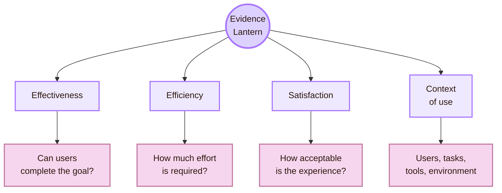

| Evaluation dimension | What it asks | Typical evidence |
|---|---|---|
| Effectiveness | Did the user achieve the goal? | Task success, completion, correctness, error count |
| Efficiency | How much effort, time, or resource did success require? | Time on task, number of steps, repeated actions |
| Satisfaction | How did the user experience the interaction? | Rating scales, comments, confidence, frustration, perceived ease |
| Learnability | Can new users understand and improve? | First-attempt success, repeated-trial performance, explanation quality |
| Accessibility | Who can perceive, operate, understand, and use the system? | Keyboard path, screen reader output, contrast, focus order, WCAG checks |
| Usefulness | Does the system support a meaningful need? | Task relevance, user judgement, field observation, adoption evidence |

## Evaluation workflow

Evaluation begins before the test. A researcher defines the question, chooses the method, designs tasks, selects participants or evaluators, collects evidence, analyses findings, and reports limitations.

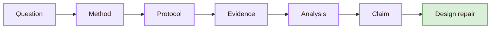

| Stage | Real activity | Failure if skipped |
|---|---|---|
| Question | State what must be learned | Data becomes scattered |
| Method | Match method to question | The study measures the wrong thing |
| Protocol | Prepare tasks, measures, script, consent, and recording plan | The study becomes inconsistent |
| Evidence | Observe, measure, interview, inspect, or log interaction | Findings lack grounding |
| Analysis | Transform raw evidence into patterns and explanations | Results stay anecdotal |
| Claim | State what the evidence supports | The report overclaims |
| Design repair | Translate findings into changes | Evaluation does not improve the system |

## Method Hall

The Observation Chamber uses multiple method families. A usability test is not the same as a controlled experiment. A field study is not the same as an expert inspection. A survey is not the same as log analysis.

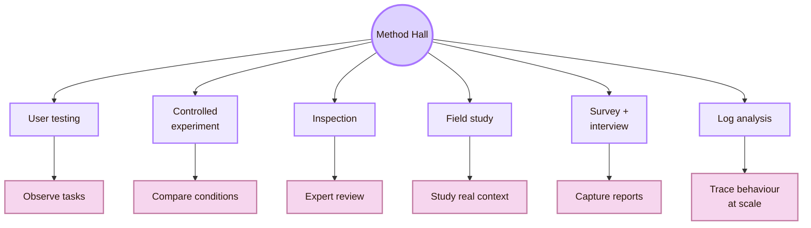

| Method family | Best for | Main limitation |
|---|---|---|
| Usability testing | Finding where users struggle with tasks | Small studies may not generalise statistically |
| Controlled experiments | Testing whether one condition changes an outcome | Control can reduce real-world realism |
| Heuristic evaluation | Finding usability problems through expert inspection | Experts are not the same as real users |
| Cognitive walkthrough | Evaluating learnability step by step | Works best for task sequences |
| Field study | Understanding use in real context | Messier and harder to control |
| Survey | Measuring attitudes or self-reports across more people | Self-report may not match behaviour |
| Interview | Understanding meaning, motivation, and explanation | Depends on interpretation and participant memory |
| Log study | Studying large-scale behavioural traces | Logs show what happened, not always why |

## Formative and summative evaluation

One of the key distinctions in HCI-Evaluation is **formative** versus **summative** assessment. Formative evaluation improves the design while it is still changing. Summative evaluation judges performance after a version is more stable.

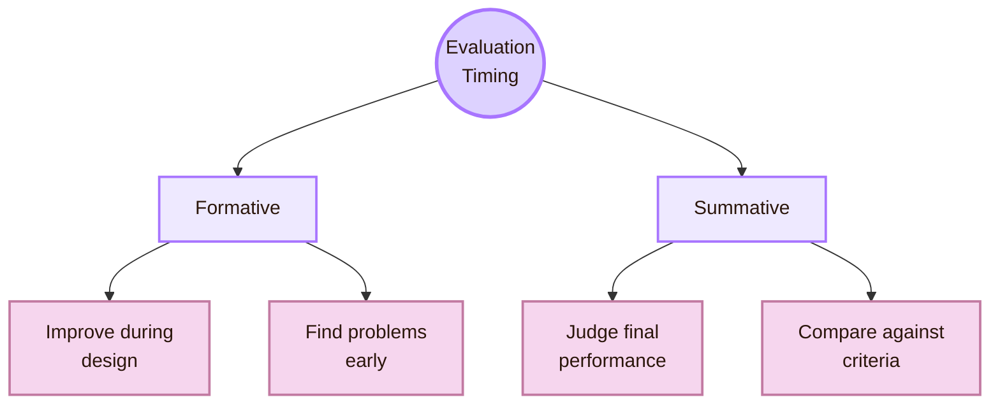

| Evaluation type | Real-life role | Example |
|---|---|---|
| Formative evaluation | Improve the design before it is fixed | Test a prototype to find navigation problems |
| Summative evaluation | Judge whether a stable design meets goals | Compare task success against a benchmark |
| Diagnostic evaluation | Explain why a problem occurs | Analyse errors and user comments |
| Comparative evaluation | Compare two or more alternatives | Test version A against version B |
| Accessibility evaluation | Check whether people with different abilities can use the system | Keyboard, screen reader, contrast, and WCAG review |

## Evidence mix

A strong evaluation usually combines more than one evidence type. A number can show that something happened. Observation and participant explanation often help show why it happened.

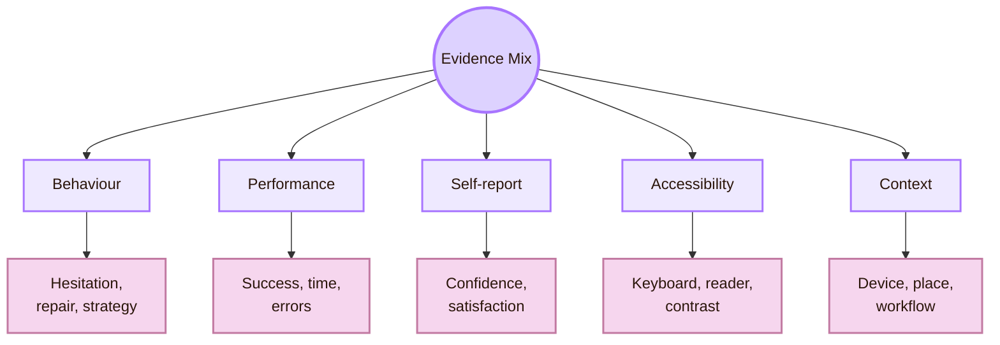

| Evidence type | What it contributes |
|---|---|
| Behavioural observation | Shows hesitation, confusion, repair, repeated action, and task strategy |
| Performance metrics | Shows time, success, errors, steps, and completion |
| Self-report data | Shows confidence, satisfaction, trust, frustration, and perceived effort |
| Accessibility checks | Shows whether the system can be perceived, operated, understood, and used with assistive technologies |
| Context evidence | Shows whether lab findings survive real environments, devices, and workflows |

## Validity Watchtower

The fantasy phrase **Validity Watchtower** means checking whether a study supports the claim it makes. Evaluation is weak when a study collects data but cannot justify the conclusion.

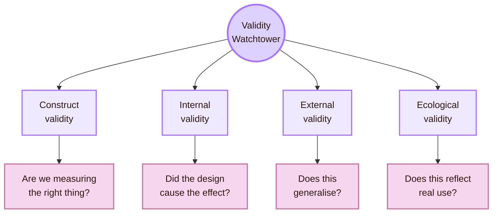

| Validity concern | Example in HCI evaluation |
|---|---|
| Construct validity | A satisfaction survey may not actually measure usability |
| Internal validity | One group may perform better because they had more prior experience |
| External validity | Five classmates may not represent older adults, professionals, or disabled users |
| Ecological validity | A lab task may not reflect noisy, mobile, real-world use |
| Statistical conclusion validity | A quantitative claim may be too strong for the sample size |
| Interpretive validity | Qualitative themes may reflect researcher assumptions |

## Access Lens

The Observation Chamber must include accessibility evaluation, not treat it as an optional extra. W3C describes accessibility evaluation as assessment, audit, and testing. WCAG 2.2 gives criteria for making web content more accessible.

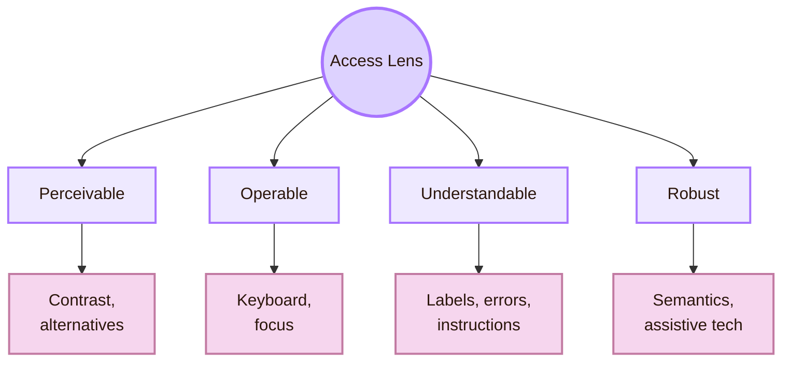

| Accessibility evaluation action | What it reveals |
|---|---|
| Keyboard-only navigation | Whether controls can be reached and operated without a mouse |
| Focus-order review | Whether the interaction path makes sense |
| Screen reader check | Whether labels, headings, roles, and states are meaningful |
| Contrast check | Whether text and UI elements are perceivable |
| Error-message review | Whether users can understand and repair problems |
| WCAG review | Whether the design meets recognised accessibility criteria |
| Testing with disabled users | Whether the design works in real assistive and embodied contexts |

## Chamber and the whole HCI map

Evaluation is the turning point of the map. It receives theories and designs, tests them, and sends evidence back.

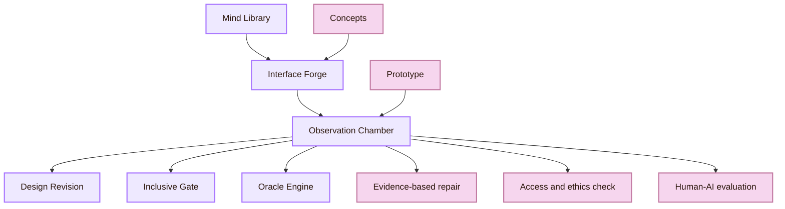

| Connected room | Relation to evaluation |
|---|---|
| [[../01_Mind_Library/Overview|Mind Library]] | Supplies concepts that explain what evaluation finds |
| [[../02_System_Design/Overview|Interface Forge]] | Supplies prototypes, components, tasks, and interface claims to test |
| [[../04_Inclusive_Gate/Overview|Inclusive Gate]] | Adds accessibility, ethics, fairness, consent, and accountability |
| [[../05_Oracle_Engine/Overview|Oracle Engine]] | Adds evaluation problems around AI, uncertainty, trust, explainability, and automation |

## Source grounding

The Observation Chamber uses several source layers. CS2023 gives the curriculum structure. ISO 9241-11 gives the usability frame. NN/g gives practical usability methods. W3C and WCAG give accessibility evaluation routes. HCI conferences and journals provide peer-reviewed research traditions.

| Source layer | Examples | What it gives this room |
|---|---|---|
| CS2023 curriculum | CS2023 Knowledge Areas, HCI Version Gamma | Official academic grounding |
| Usability standards | ISO 9241-11 | Effectiveness, efficiency, satisfaction, and context of use |
| Practical HCI methods | NN/g usability testing, UX methods, heuristics | Usable method explanations for students and practitioners |
| Accessibility evaluation | W3C WAI, WCAG 2.2, WebAIM | Assessment, audit, testing, accessibility criteria |
| HCI research venues | CHI, TOCHI, PACM HCI, IJHCS | Empirical, theoretical, and methodological research |
| Social and empirical methods | Psychology, statistics, empirical software engineering, product analytics | Measurement, validity, study design, and interpretation |

## Cognishire application

The Cognishire HCI map itself can be evaluated. It is an interactive system built from Obsidian pages, links, Mermaid diagrams, CSS, GitHub structure, and fantasy metaphors mapped to CS2023.

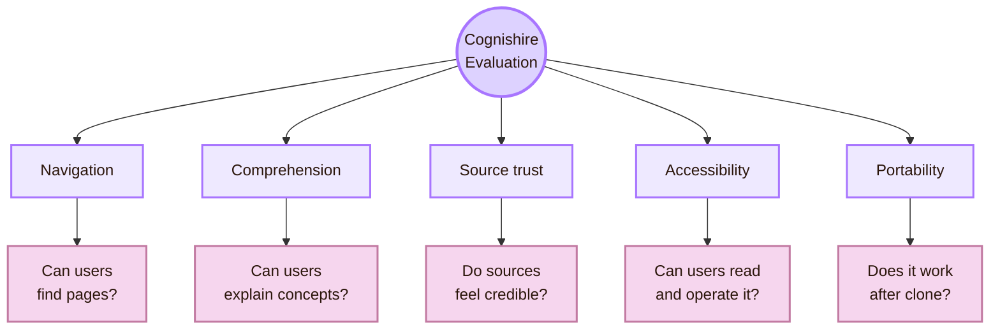

| Evaluation question | Possible method |
|---|---|
| Do users understand what each HCI room means? | Short usability test with explanation task |
| Can users find the System Design page quickly? | Navigation task with time and wrong-turn recording |
| Do Mermaid diagrams help or distract? | Compare diagram-heavy and text/table versions |
| Are CS2023 links clear enough? | Ask users to identify the official academic basis |
| Does the vault work after GitHub download? | Clone test on another machine |
| Is the theme readable and accessible? | Contrast check, font-size check, keyboard navigation, user feedback |

## What this room should not claim

| Do not claim | Safer wording |
|---|---|
| “A test with a few classmates proves usability.” | “A small test can reveal local usability problems.” |
| “A survey score explains the design problem.” | “A survey score needs observation or comments to explain causes.” |
| “Evaluation is only user testing.” | “Evaluation includes user testing, experiments, inspection, field studies, surveys, logs, and accessibility checks.” |
| “Accessibility is solved by WCAG alone.” | “WCAG is essential, but user testing and assistive technology checks are also important.” |
| “A design works globally because it worked locally.” | “Local findings need clear limits before broader claims.” |

## Synthesis

The Observation Chamber is the evaluation room of the HCI map. Its purpose is to turn interface claims into evidence. A design may be attractive, well-intended, or technically impressive, but evaluation asks whether users can actually understand it, complete tasks, recover from errors, trust it appropriately, and use it across abilities and contexts.

The central question of this room is:

> What evidence justifies the claim that this design works?

Back to [[../The five rooms of HCI|The five rooms of HCI]].

## Academic anchors

| Route | Source |
|---|---|
| CS2023 HCI Evaluation basis | [CS2023 HCI Version Gamma](https://csed.acm.org/wp-content/uploads/2023/09/HCI-Version-Gamma.pdf) |
| CS2023 Knowledge Areas | [CS2023 Knowledge Areas](https://csed.acm.org/knowledge-areas/) |
| Usability framework | [ISO 9241-11](https://www.iso.org/obp/ui/) |
| Usability testing | [NN/g: Usability Testing 101](https://www.nngroup.com/articles/usability-testing-101/) |
| Usability basics | [NN/g: Usability 101](https://www.nngroup.com/articles/usability-101-introduction-to-usability/) |
| UX research methods | [NN/g: Which UX Research Methods to Use](https://www.nngroup.com/articles/which-ux-research-methods/) |
| Usability heuristics | [NN/g: 10 Usability Heuristics](https://www.nngroup.com/articles/ten-usability-heuristics/) |
| Accessibility evaluation | [W3C: Evaluating Web Accessibility Overview](https://www.w3.org/WAI/test-evaluate/) |
| WCAG-EM | [W3C: WCAG-EM Overview](https://www.w3.org/WAI/test-evaluate/conformance/wcag-em/) |
| Accessibility standard | [WCAG 2.2](https://www.w3.org/TR/WCAG22/) |
| HCI flagship venue | [ACM CHI](https://dl.acm.org/conference/chi) |
| HCI archival journal | [ACM TOCHI](https://dl.acm.org/journal/tochi) |
| HCI proceedings journal | [PACM HCI](https://dl.acm.org/journal/pacmhci) |
| Human-computer studies journal | [International Journal of Human-Computer Studies](https://www.sciencedirect.com/journal/international-journal-of-human-computer-studies) |

^overview-evaluating-design-end
