# Theory

Back to [[../Overview|The Observation Chamber]].

> [!abstract] Evaluation Theory Chamber
> **Theory** in the Observation Chamber explains what makes evaluation evidence meaningful. It defines usability, measurement, validity, method choice, accessibility evaluation, interpretation, and the limits of what a study can claim.

**Fantasy name:** Evaluation Theory Chamber  
**Real CS2023 label:** HCI-Evaluation: Evaluating the Design  
**Real-life meaning:** the conceptual foundation for deciding whether an evaluation method, metric, or conclusion is trustworthy.

This page does not explain how to build an interface. That belongs to the [[../../02_System_Design/Overview|Interface Forge]]. This page explains how to judge an interface. It asks what counts as usability, what evidence should be collected, how metrics should be interpreted, what can weaken a study, and how findings should return to design.

> [!quote] Chamber rule
> An evaluation result is useful only when the researcher can explain what was measured, why it was measured, how it was collected, and what the evidence can honestly support.

## Quick route

| Chamber station | Real meaning | Use it when you need to |
|---|---|---|
| Usability Lens | Effectiveness, efficiency, satisfaction, and context | Define what “usable” actually means |
| Measurement Forge | Construct to metric | Choose evidence that matches the concept |
| Metric Shelf | Families of measures | Separate task success, time, errors, workload, satisfaction, and access |
| Validity Watchtower | Trustworthiness of claims | Check whether the study supports its conclusion |
| Method Hall | Qualitative, quantitative, mixed, and analytical methods | Match method to question |
| Access Lens | Accessibility evaluation theory | Ask who can perceive, operate, understand, and use the system |
| Interpretation Bridge | Evidence to design meaning | Turn raw data into design repair |
| Claim Ladder | Strength of claims | Avoid jumping from small observations to universal conclusions |

## Theory map

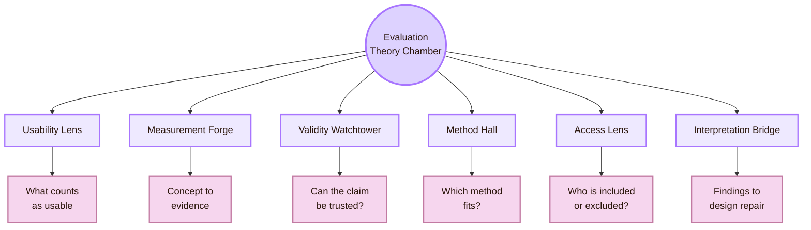

| Theory route | Real-life evaluation question | Why it matters |
|---|---|---|
| Usability model | What does it mean for the system to be usable? | Prevents vague claims like “good UX” |
| Measurement model | Which metric or instrument captures the construct? | Prevents measuring the wrong thing |
| Validity model | Can the study support its conclusion? | Prevents overclaiming |
| Method model | Should the study be qualitative, quantitative, mixed, or analytical? | Matches method to question |
| Accessibility model | Who can perceive, operate, understand, and use the system? | Prevents excluding users from the evaluation |
| Interpretation model | How do findings become design knowledge? | Turns evidence into repair, not just reporting |

## CS2023 foundation

CS2023 places **Evaluating the Design** inside the Human-Computer Interaction knowledge area. The official curriculum includes evaluation with users, formative and summative assessment, functionality and usability testing, utility, efficiency, learnability, user satisfaction, qualitative and quantitative methods, surveys, interviews, focus groups, observation, study planning, hypothesis design, heuristic evaluation, and defensible conclusions.

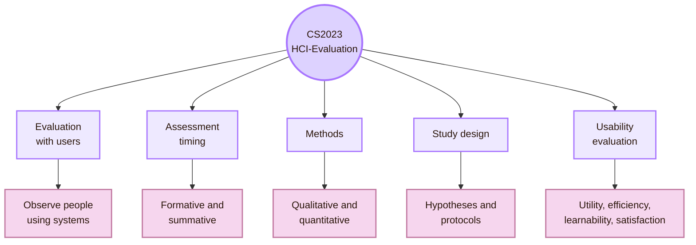

| CS2023 evaluation topic | Theoretical question |
|---|---|
| Methods for evaluation with users | What does observing users reveal that inspection alone cannot? |
| Formative assessment | How can evidence improve a design before it is finished? |
| Summative assessment | How can a stable design be judged against criteria? |
| Qualitative methods | How can meaning, confusion, strategy, and context be interpreted? |
| Quantitative methods | How can performance, ratings, and comparisons be measured? |
| Study planning | How can a study avoid weak evidence and biased conclusions? |
| Heuristic evaluation | How can expert inspection identify usability problems before user testing? |
| Defensible conclusions | What can the evidence honestly claim? |

## Usability Lens: the outcome of use

The core usability model comes from ISO 9241-11. Usability is not an abstract property floating inside a product. It is an outcome of use by specified users, with specified goals, in a specified context.

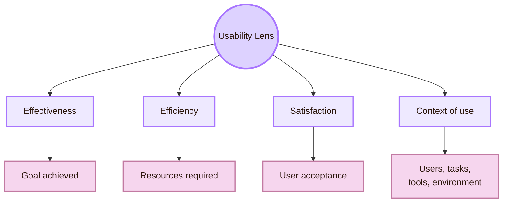

| Usability dimension | Real-life meaning | Example evidence |
|---|---|---|
| Effectiveness | The user can complete the goal accurately and completely | Task success, correctness, error count |
| Efficiency | The user can complete the goal with reasonable effort and resources | Time on task, number of steps, repeated actions |
| Satisfaction | The user finds the system acceptable, comfortable, or confidence-supporting | SUS, post-task ratings, comments, confidence |
| Context of use | Usability depends on users, tasks, tools, and environment | Participant profile, task scenario, device, setting |

> [!important] Usability rule
> A system is never simply “usable” in general. It is usable for specific users, goals, tasks, and contexts.

This matters in student work because it prevents overclaiming. If five classmates complete a task in Obsidian, that supports a local claim about that group and task. It does not automatically prove that the system works for all students, devices, languages, or accessibility needs.

## Measurement Forge: from concept to evidence

A measurement model connects an abstract construct to observable evidence. In HCI evaluation, constructs include usability, workload, satisfaction, trust, learnability, cognitive effort, accessibility, and comprehension. These cannot be directly seen. They must be operationalised through tasks, metrics, instruments, observations, or participant reports.

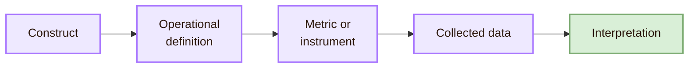

| Construct | Possible operationalisation | Risk |
|---|---|---|
| Usability | Task success, time, SUS, error rate, comments | One metric may hide another problem |
| Workload | NASA-TLX, self-report difficulty, hesitation | Self-report may differ from observed effort |
| Learnability | First attempt versus repeated attempts | Improvement may come from task familiarity |
| Trust | Confidence rating, reliance behaviour, verification behaviour | Users may say they trust but behave differently |
| Accessibility | Keyboard path, focus order, screen reader output, WCAG checks | Automated checks alone miss real barriers |
| Comprehension | Explanation task, recall, concept mapping | Users may complete a task without understanding |

The theoretical danger is **construct mismatch**. If the study claims to measure “understanding” but only records completion time, the measurement model is weak. Time can support an efficiency claim, but not necessarily a comprehension claim.

## Metric Shelf

Metrics are not interchangeable. A metric should be chosen because it matches the research question.

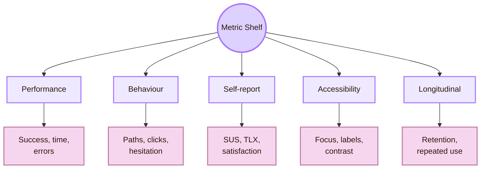

| Metric family | Best used when | Example |
|---|---|---|
| Performance metrics | You need evidence about task completion and efficiency | Success rate, time on task, error count |
| Behavioural metrics | You need evidence about how users move through the interface | Backtracking, repeated clicks, wrong paths, hesitation |
| Self-report metrics | You need perceived usability, workload, satisfaction, or confidence | SUS, NASA-TLX, confidence ratings |
| Accessibility metrics | You need evidence about inclusion and operability | Keyboard completion, focus order, screen reader labels, WCAG findings |
| Longitudinal metrics | You need evidence about use over time | Retention, repeated-use errors, learning curve, abandonment |

The **System Usability Scale** is a widely used ten-item scale for global perceived usability. The **NASA Task Load Index** is a subjective workload assessment tool. These are useful instruments, but they are not magic. They must still match the evaluation question.

## Validity Watchtower

The Validity Watchtower is the real-life process of checking whether a study’s conclusion is justified. It protects the evaluation from false confidence.

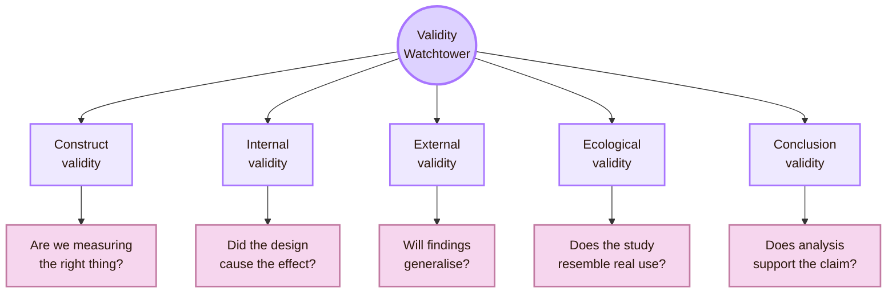

| Validity type | HCI evaluation example | Threat |
|---|---|---|
| Construct validity | Measuring “ease of use” with only completion time | The metric does not capture the concept |
| Internal validity | Interface B performs better because users in that condition were more experienced | A confound explains the result |
| External validity | A study with three classmates is presented as evidence for all users | Sample and setting are too narrow |
| Ecological validity | A quiet lab task is used to represent mobile use under stress | Study context differs from real context |
| Statistical conclusion validity | A tiny sample is used for a strong quantitative claim | Analysis is not strong enough for the conclusion |
| Interpretive validity | Researcher themes do not reflect participant meaning | Qualitative interpretation is biased or unsupported |

> [!warning] Validity boundary
> Weak validity does not always make a study useless. It limits what the study can claim.

A formative usability test with five users can be useful for finding problems. It is not enough for a precise population-level performance claim. A controlled experiment can compare two versions more strongly, but it may miss real-world context. The method shapes the claim.

## Method Hall: qualitative, quantitative, mixed, analytical

Evaluation theory must distinguish method types. Qualitative methods are strong for understanding meaning, strategy, breakdowns, and context. Quantitative methods are strong for comparison, measurement, and patterns. Mixed methods combine both. Analytical methods use expert inspection or structured principles.

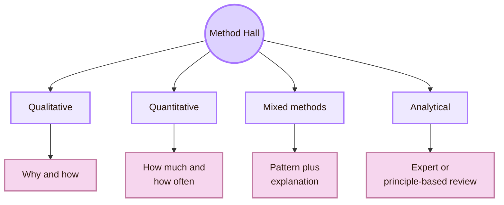

| Method type | Strong for | Weak if used alone |
|---|---|---|
| Qualitative | Understanding confusion, meaning, context, and repair strategies | Cannot easily estimate prevalence or performance difference |
| Quantitative | Comparing conditions, measuring success, time, scores, and frequency | May not explain why the pattern happened |
| Mixed methods | Connecting behavioural patterns with explanation | Requires careful planning so methods answer the same question |
| Analytical | Finding likely problems before or beside user testing | Experts and checklists do not replace user evidence |

In student work, mixed evidence is often strongest: observe what users do, record basic task evidence, and ask short interpretation questions.

## Formative and summative theory

Formative and summative evaluation differ in timing and purpose.

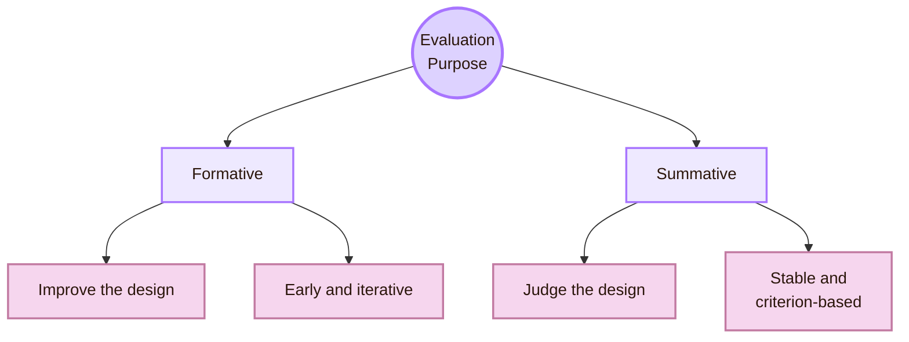

| Evaluation purpose | Real-life use | Example |
|---|---|---|
| Formative | Find problems while design can still change | Test a wireframe to repair navigation |
| Summative | Judge whether a stable system meets goals | Measure whether a final version reaches a benchmark |
| Diagnostic | Explain why a problem occurs | Analyse where users misunderstand a form |
| Comparative | Compare alternatives | Test two navigation labels |
| Exploratory | Discover unknown issues or contexts | Field observation or design probe |

A common mistake is using a formative study as if it were summative proof. Finding five problems in a prototype gives evidence for improvement. It does not prove the final design is good or bad.

## Analytical evaluation

Not all evaluation begins with users. Analytical methods use experts, principles, or structured walkthroughs to inspect a design. These methods are useful before user testing because they can quickly identify likely problems.

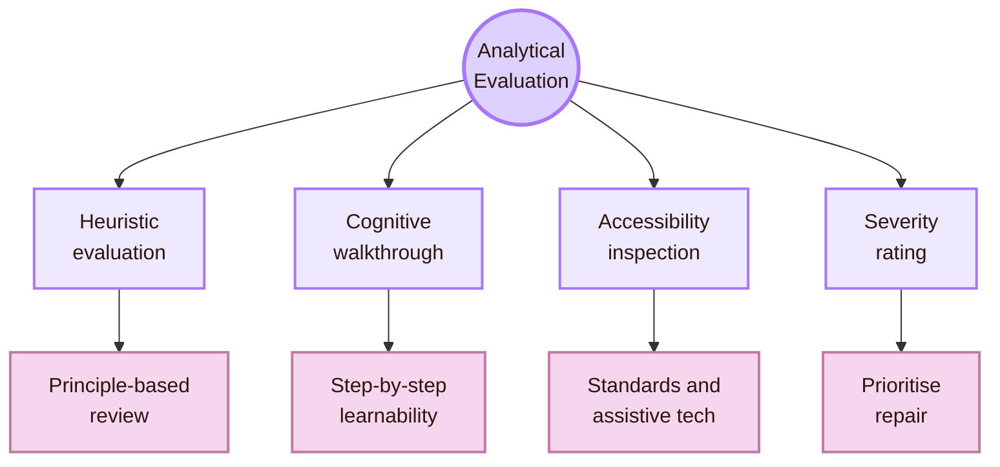

| Analytical method | Theoretical role | Limitation |
|---|---|---|
| Heuristic evaluation | Checks the design against usability principles | Experts may miss user-specific context |
| Cognitive walkthrough | Checks whether a new user can learn each step | Works best for task flows |
| Accessibility inspection | Checks standards, semantics, focus, and assistive technology support | Automated checks cannot replace human accessibility experience |
| Severity rating | Prioritises discovered problems | Severity judgement may vary between evaluators |

Severity is useful because evaluation should lead to prioritised repair. It should consider impact, frequency, and persistence, not only whether an issue is visually annoying.

## Access Lens: accessibility evaluation theory

Accessibility evaluation belongs inside evaluation theory because it changes the meaning of “works.” A design does not work if it works only for a narrow default user.

W3C describes accessibility evaluation as assessment, audit, and testing. WCAG 2.2 organises accessibility around perceivable, operable, understandable, and robust content. The theory is that users must be able to perceive information, operate controls, understand interaction, and rely on robust structure across technologies.

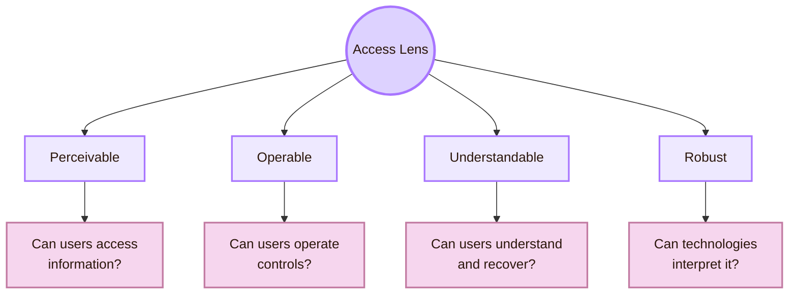

| Evaluation layer | What it checks |
|---|---|
| Automated scan | Some detectable issues such as missing labels or contrast problems |
| Manual inspection | Keyboard order, focus visibility, error recovery, semantic structure |
| Assistive technology check | Screen reader, keyboard, magnification, voice control where relevant |
| User testing with disabled users | Real experience with real strategies, barriers, and workarounds |
| WCAG conformance review | Whether the interface meets specified success criteria |

> [!important] Accessibility rule
> Accessibility evaluation cannot be reduced to an automated score. It needs standards, manual inspection, assistive technology checks, and user evidence when possible.

## Triangulation Bridge

Triangulation means using multiple forms of evidence to understand the same issue. It is useful because each method has blind spots.

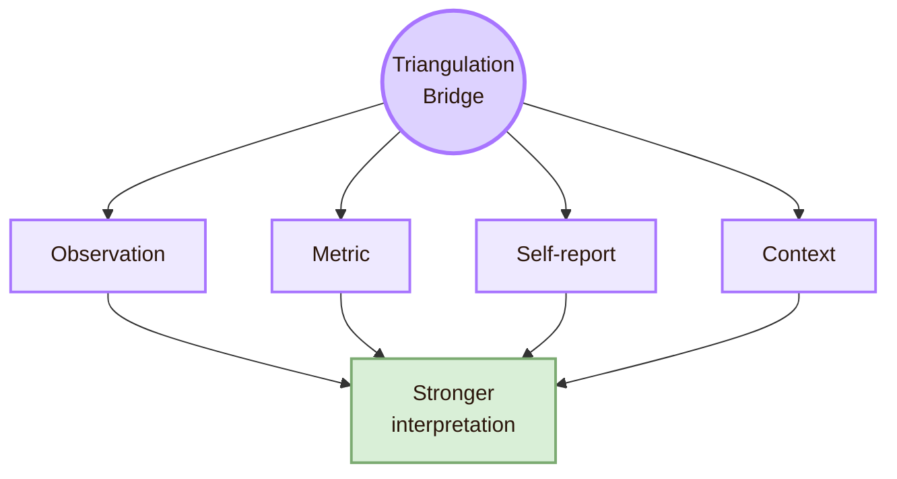

| Evidence combination | Stronger interpretation |
|---|---|
| Task failure plus user comment | Shows both breakdown and possible cause |
| Long time plus repeated scanning | Suggests search or hierarchy problem |
| High success plus low satisfaction | System works but feels difficult or unpleasant |
| Low error rate plus high workload | Users succeed by working too hard |
| Accessibility audit plus user testing | Shows both standards issues and lived barriers |
| Log data plus interviews | Shows large-scale pattern and possible meaning |

Triangulation prevents simplistic conclusions. A user may complete a task but still feel confused. A page may satisfy one metric but fail another. HCI evaluation becomes stronger when evidence types are combined carefully.

## Interpretation Bridge: from data to design

Evaluation does not end with data. It ends when data becomes a design implication.

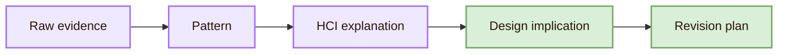

| Raw evidence | Possible HCI explanation | Design implication |
|---|---|---|
| Users click repeatedly during loading | System status is not visible | Add clear progress feedback |
| Users choose wrong menu | Label does not match mental model | Rename route using user language |
| Users complete task but rate workload high | Interface requires too much effort | Reduce steps, memory burden, or density |
| Screen reader skips form label | Semantic relationship is missing | Repair label, role, and field structure |
| Users like the page but cannot recall concept | Visual style motivates but does not support learning | Adjust explanation, hierarchy, and diagram use |

Interpretation should be cautious. A researcher should not write “users are stupid” or “users did not pay attention.” The stronger HCI interpretation asks what the design made hard to perceive, understand, operate, or recover from.

## Claim Ladder

Not every evaluation supports the same strength of claim.

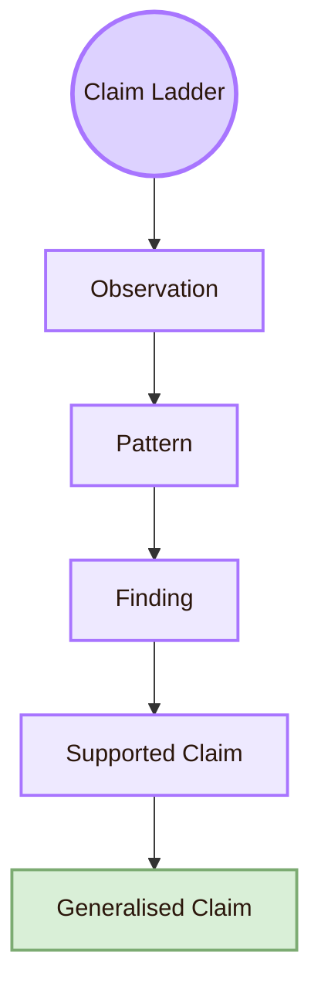

| Claim level | Example |
|---|---|
| Observation | “Two participants hesitated before selecting the route.” |
| Pattern | “Several users hesitated at the same navigation label.” |
| Finding | “The label may not communicate the destination clearly.” |
| Supported claim | “For this participant group and task, the current label caused navigation uncertainty.” |
| Generalised claim | “This label is unclear for the wider target population.” This requires stronger evidence. |

The ladder is important because many student reports jump too quickly from observation to generalisation. Good evaluation theory keeps claims proportional to evidence.

## Cognishire application

The Cognishire HCI map can use evaluation theory to avoid weak claims about its own design.

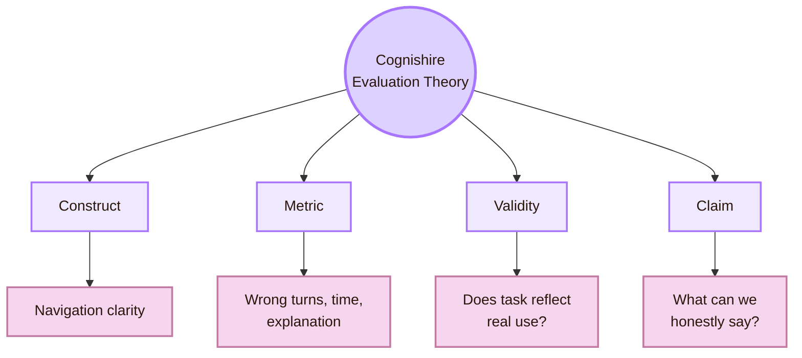

| Project construct | Possible evidence | Validity warning |
|---|---|---|
| Room-name clarity | Ask users to explain Mind Library, Interface Forge, Observation Chamber | Users may repeat wording without understanding |
| Navigation usability | Time, wrong turns, successful page finding | Small sample does not prove general usability |
| Diagram usefulness | Comprehension questions before and after diagram reading | Users may like diagrams but still misunderstand |
| Source credibility | Ask users to identify official CS2023 source and trusted HCI links | Credibility may depend on prior academic experience |
| Theme accessibility | Contrast checks, keyboard movement, font-size review, user feedback | Visual appeal is not accessibility evidence |
| GitHub portability | Clone test on another machine | One successful clone does not prove all environments work |

## What this page should not claim

| Do not claim | Safer wording |
|---|---|
| “Usability is one universal property.” | “Usability depends on specified users, goals, tasks, tools, and context.” |
| “Task time proves understanding.” | “Task time can support an efficiency claim, but comprehension needs separate evidence.” |
| “SUS proves the interface is good.” | “SUS supports a perceived-usability claim and should be interpreted with other evidence.” |
| “Accessibility is just a checklist.” | “Accessibility evaluation needs standards, manual checks, assistive technology, and user evidence when possible.” |
| “Five classmates prove global usability.” | “Five classmates can reveal local problems and support formative redesign.” |
| “The user failed.” | “The design did not support the user’s task well enough.” |

## Theory synthesis

Theory in the Observation Chamber is the logic behind evaluation. It explains what usability means, how constructs become measurements, how methods shape evidence, how validity limits claims, how accessibility changes the definition of success, and how findings become design repair.

The central question is not “Did users like it?” The stronger question is:

> What evidence supports the claim that this design works for these users, goals, tasks, and contexts?

This page connects to [[Design]] because evaluation theory must become protocol design. It connects to [[Experiment]] because methods must be executed carefully. It connects to [[../Connections]] because evaluation draws from statistics, psychology, social science, empirical software engineering, ethics, and product analytics. It connects to [[../Open Problems]] because validity, bias, ecological realism, metric selection, and long-term outcomes remain difficult.

## Academic anchors

| Route | Source |
|---|---|
| CS2023 HCI Evaluation basis | [CS2023 HCI Version Gamma](https://csed.acm.org/wp-content/uploads/2023/09/HCI-Version-Gamma.pdf) |
| CS2023 Knowledge Areas | [CS2023 Knowledge Areas](https://csed.acm.org/knowledge-areas/) |
| Usability framework | [ISO 9241-11](https://www.iso.org/obp/ui/) |
| Usability definition reference | [NIST: Usability Glossary](https://csrc.nist.gov/glossary/term/usability) |
| Usability testing | [NN/g: Usability Testing 101](https://www.nngroup.com/articles/usability-testing-101/) |
| UX methods | [NN/g: Which UX Research Methods to Use](https://www.nngroup.com/articles/which-ux-research-methods/) |
| Usability basics | [NN/g: Usability 101](https://www.nngroup.com/articles/usability-101-introduction-to-usability/) |
| Usability heuristics | [NN/g: 10 Usability Heuristics](https://www.nngroup.com/articles/ten-usability-heuristics/) |
| Severity ratings | [NN/g: Severity Ratings for Usability Problems](https://www.nngroup.com/articles/how-to-rate-the-severity-of-usability-problems/) |
| System Usability Scale | [Brooke: SUS, A Quick and Dirty Usability Scale](https://digital.ahrq.gov/sites/default/files/docs/survey/systemusabilityscale%28sus%29_comp%5B1%5D.pdf) |
| Workload measure | [NASA Task Load Index](https://www.nasa.gov/human-systems-integration-division/nasa-task-load-index-tlx/) |
| User Experience Questionnaire | [UEQ Online](https://www.ueq-online.org/) |
| Accessibility evaluation | [W3C: Evaluating Web Accessibility Overview](https://www.w3.org/WAI/test-evaluate/) |
| Accessibility standard | [WCAG 2.2](https://www.w3.org/TR/WCAG22/) |
| WCAG principles overview | [W3C: WCAG 2 Overview](https://www.w3.org/WAI/standards-guidelines/wcag/) |

^theory-evaluating-design-end
