# Connections

Back to [[Overview|The Observation Chamber]].

> [!abstract] Method Bridge
> **Connections** in the Observation Chamber maps the disciplines that support HCI evaluation: statistics, psychology, social science methods, empirical software engineering, measurement, product analytics, research ethics, accessibility, and reproducibility.

**Fantasy name:** Method Bridge  
**Real CS2023 label:** HCI-Evaluation: Evaluating the Design  
**Real-life meaning:** connect HCI evaluation to the fields that make evidence credible, ethical, interpretable, and reusable.

The Observation Chamber should not treat usability testing as an isolated trick. Evaluation becomes stronger when it borrows carefully from other fields. Statistics helps with comparison and uncertainty. Psychology helps define human constructs. Social science methods help interpret context. Empirical software engineering helps evaluate technical systems and tools. Ethics protects participants. Accessibility evaluation expands who is included. Reproducibility makes evidence inspectable.

> [!quote] Bridge rule
> Evaluation is interdisciplinary because evidence is interdisciplinary. A good HCI study needs both design knowledge and method discipline.

## Quick route

| Bridge station | Real meaning | Use it when you need to |
|---|---|---|
| Statistics Tower | Quantitative reasoning | Compare conditions, summarise data, handle uncertainty |
| Psychology Hall | Human constructs | Study workload, trust, attention, memory, learning, and satisfaction |
| Social Science Field | Context and meaning | Use interviews, observation, diary studies, and thematic analysis |
| Software Evidence Workshop | Empirical software engineering | Evaluate tools, repositories, workflows, and developer systems |
| Measurement Vault | Instruments and constructs | Choose SUS, NASA-TLX, UEQ, rubrics, or custom measures carefully |
| Analytics Tower | Behaviour at scale | Study funnels, events, retention, cohorts, and deployed use |
| Ethics Gate | Human-subject protection | Plan consent, privacy, dignity, and risk reduction |
| Access Bridge | Accessibility evidence | Combine standards, manual checks, assistive technology, and users |
| Artifact Room | Reproducibility | Preserve protocols, data, code, materials, and documentation |

## Method Bridge map

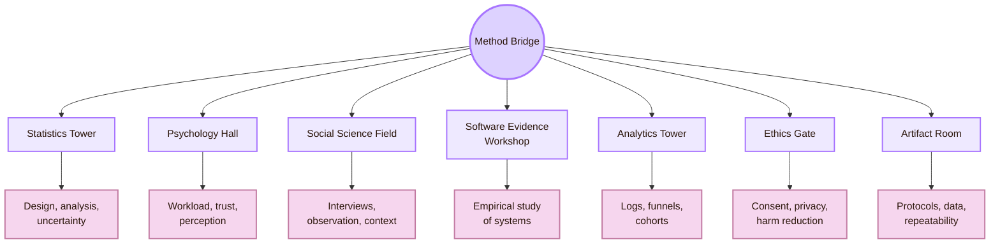

| Connected field | What it gives HCI evaluation | What can go wrong if ignored |
|---|---|---|
| Statistics | Study design, uncertainty, comparison, sampling, effect size, error | Quantitative claims become weak or misleading |
| Psychology | Validated constructs, workload, attention, perception, cognition, trust | The study measures human experience poorly |
| Social science methods | Interviewing, ethnography, field observation, qualitative interpretation | Context and meaning are flattened |
| Empirical software engineering | Rigorous empirical study of software systems, tools, processes, developers | Technical systems are evaluated without empirical discipline |
| Product analytics | Logs, funnels, cohorts, retention, behavioural traces at scale | Evaluation misses long-term and deployed-use patterns |
| Research ethics | Consent, privacy, risk, fairness, participant dignity | Studies can harm or pressure participants |
| Accessibility evaluation | Inclusive evidence about diverse users and assistive technologies | “Works” becomes true only for a narrow default user |
| Reproducibility | Data, artifacts, protocols, analysis scripts, documentation | Results become hard to inspect or repeat |

## CS2023 Connection Gate

CS2023 HCI-Evaluation already implies interdisciplinary work. It asks students to compare evaluative methods, use qualitative and quantitative methods, plan usability evaluations, justify study goals and hypotheses, conduct evaluation, and draw defensible conclusions. Each of those tasks needs support from other fields.

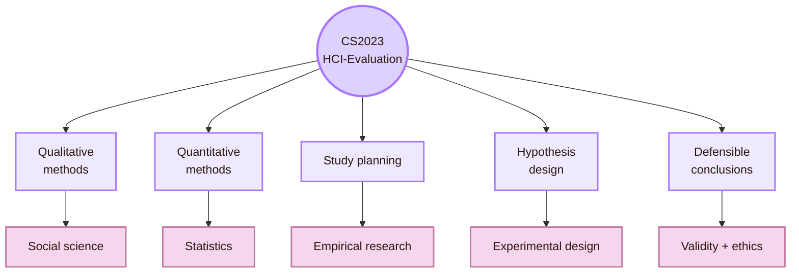

| CS2023 evaluation skill | Supporting discipline |
|---|---|
| Plan a usability evaluation | Research design, HCI methods, ethics |
| Justify study goals | HCI theory, measurement, validity |
| Design hypotheses | Experimental design, statistics, psychology |
| Conduct usability evaluation | HCI practice, observation, protocol design |
| Use qualitative methods | Social science methods, psychology, ethnography |
| Use quantitative methods | Statistics, psychometrics, analytics |
| Draw defensible conclusions | Validity theory, reproducibility, ethics |
| Discuss broader impacts | Ethics, accessibility, CSCW, policy, society |

## Statistics Tower

The Statistics Tower connects evaluation to experimental design, measurement uncertainty, comparison, sampling, and data analysis. It helps HCI researchers avoid treating numbers as self-explanatory.

A usability score, task time, error count, or success rate is not automatically meaningful. It depends on sample size, task design, data distribution, variability, measurement error, and the claim being made.

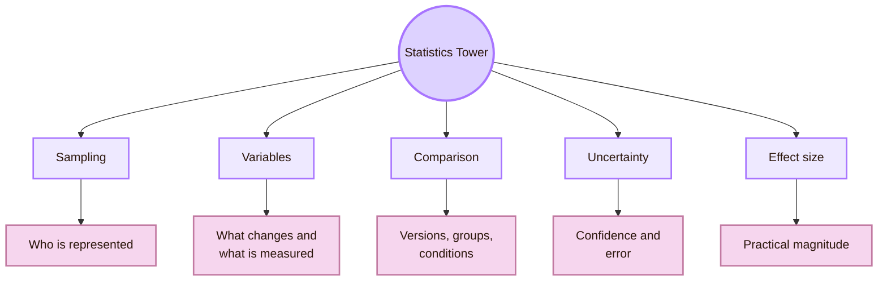

| Statistical idea | HCI evaluation use | Example |
|---|---|---|
| Variable | Defines what changes and what is measured | Navigation version as independent variable, task time as dependent variable |
| Sampling | Defines who evidence represents | First-year students versus expert designers |
| Descriptive statistics | Summarises what happened | Median task time, success rate, error count |
| Inferential statistics | Supports cautious population claims | Testing whether one condition differs from another |
| Effect size | Shows practical magnitude | A faster version may not be meaningfully faster |
| Confidence interval | Shows uncertainty around an estimate | Task success estimate is not exact |
| Power | Helps plan sample size for quantitative comparison | Avoids underpowered experiments |

Statistics is most relevant when the evaluation makes a quantitative claim. It is less central when the goal is formative discovery, but even formative studies need careful summaries and honest boundaries.

## Psychology Hall

The Psychology Hall connects evaluation to human perception, attention, memory, workload, learning, decision-making, trust, and subjective experience. Many HCI measures come from psychology and human factors because interfaces are used by minds and bodies, not abstract “users.”

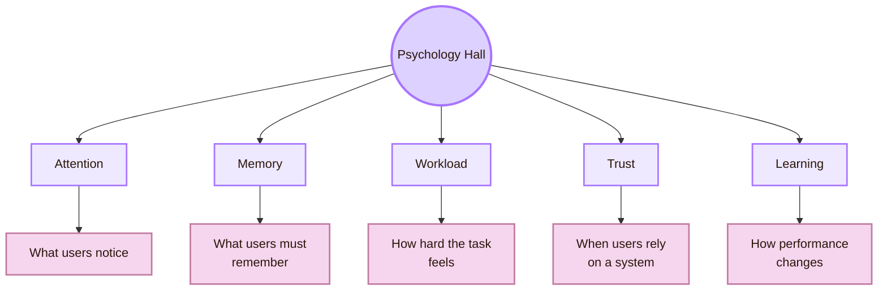

| Psychological construct | Evaluation connection |
|---|---|
| Attention | Eye movement, first-click behaviour, noticing feedback, missing controls |
| Working memory | Recall burden, multi-step tasks, hidden state |
| Cognitive workload | NASA-TLX, perceived difficulty, hesitation, fatigue |
| Trust | Reliance, verification behaviour, confidence, overtrust and undertrust |
| Learning | First-use success, repeated-task improvement, error reduction |
| Satisfaction | SUS, UEQ, post-task ratings, interviews |
| Perception | Contrast, visual hierarchy, icons, motion sensitivity |

Psychology also contributes reporting standards. APA’s Journal Article Reporting Standards help structure qualitative, quantitative, and mixed-method research reports. That matters for HCI because evaluation reports need to explain participants, measures, procedure, analysis, findings, and limitations.

## Social Science Field

The Social Science Field connects HCI evaluation to interviews, ethnography, observation, diary studies, thematic analysis, fieldwork, and context-sensitive interpretation. This is essential because many HCI questions are not only about whether a task was completed. They are about what the system means in a social setting.

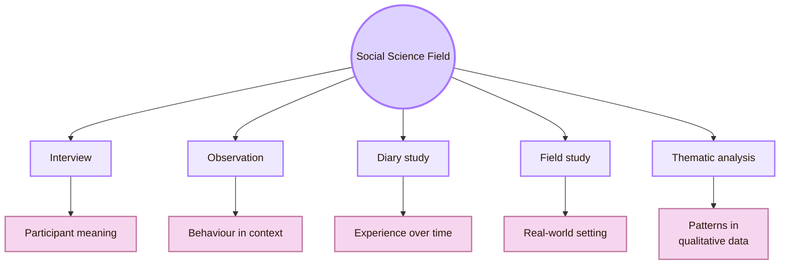

| Social science method | What it adds to HCI evaluation |
|---|---|
| Interview | Reveals explanations, expectations, values, and interpretation |
| Observation | Shows behaviour in natural or semi-natural settings |
| Ethnography | Studies technology inside culture, work, and everyday practice |
| Diary study | Captures experience across time rather than one session |
| Focus group | Shows shared attitudes and group discussion |
| Thematic analysis | Turns qualitative data into structured patterns |
| Case study | Gives depth for one setting, team, tool, or deployment |

CSCW is an important neighbouring field here because it studies collaboration, social computing, work, communication, coordination, and sociotechnical settings. Evaluation of collaborative systems cannot be reduced to one user completing one task.

## Software Evidence Workshop

The Software Evidence Workshop connects HCI evaluation to empirical software engineering. This is important when the artifact is not only a screen, but a software tool, programming environment, development workflow, dashboard, repository, or system architecture.

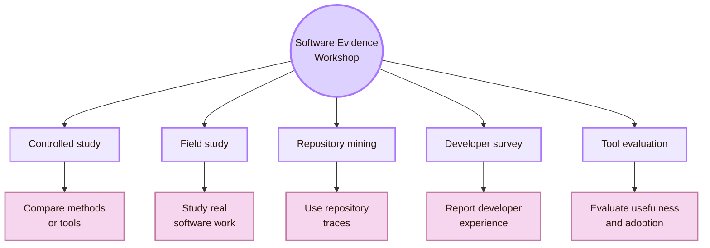

| ESE contribution | HCI evaluation use |
|---|---|
| Empirical method discipline | Helps evaluate software tools with rigorous qualitative, quantitative, or mixed methods |
| Field studies of developers | Useful for programming tools, IDEs, dashboards, and work systems |
| Repository mining | Reveals large-scale behaviour in code, issues, pull requests, and collaboration |
| Controlled comparisons | Tests whether a tool or workflow changes performance |
| Replication packages | Supports reproducibility and inspection |
| Industrial realism | Connects lab findings to software practice |

ESEM is a useful venue route here because it focuses on empirical software engineering and measurement. It is relevant when the evaluated object is a software process, development tool, repository workflow, or technical system.

## Measurement Vault

The Measurement Vault is where evaluation turns human concepts into instruments. It connects HCI to psychometrics, scale construction, reliability, validity, workload measures, usability scales, and experience questionnaires.

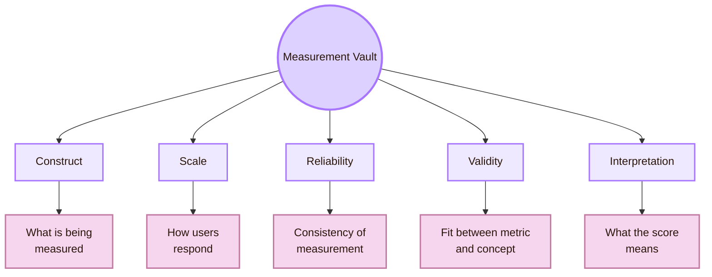

| Instrument | Measures | Use carefully because |
|---|---|---|
| SUS | Global perceived usability | It gives a broad score, not exact design diagnosis |
| NASA-TLX | Subjective workload | Workload source still needs interpretation |
| UEQ | User experience dimensions such as attractiveness and efficiency | Translation and context affect interpretation |
| Post-task confidence rating | Perceived certainty after a task | Confidence may be inaccurate |
| Custom rubric | Project-specific quality judgement | Rubric must define levels and evidence clearly |

Measurement connects to [[Activities/Theory]] because constructs must be defined before they are measured. It connects to [[Activities/Design]] because instruments must be prepared in the protocol. It connects to [[Activities/Experiment]] because measurement happens during the study.

## Analytics Tower

Product analytics connects evaluation to large-scale behavioural data: events, funnels, retention, cohorts, segmentation, drop-off, and deployed-use traces. It is useful after deployment, when the system has enough users to produce behavioural data.

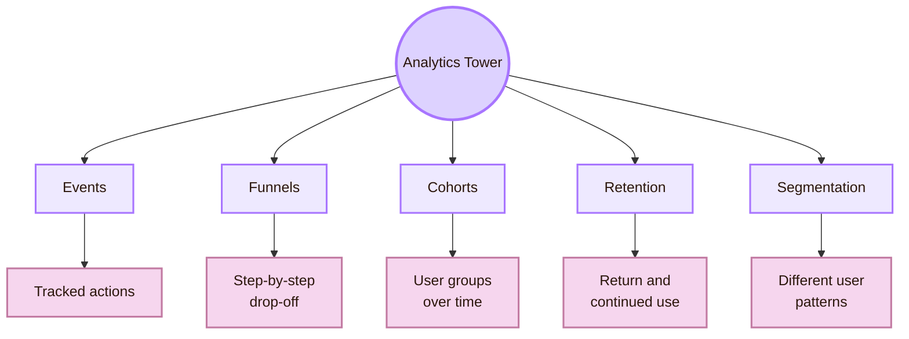

| Analytics concept | HCI evaluation use | Limitation |
|---|---|---|
| Event | Records a user action | Does not explain motivation |
| Funnel | Shows where users drop out | Drop-off cause needs qualitative follow-up |
| Cohort | Compares groups over time | Group definition can bias interpretation |
| Retention | Shows repeated use | Continued use is not always satisfaction |
| Segmentation | Reveals different user patterns | Can stereotype or oversimplify users |
| A/B result | Compares deployed variants | Local metric gains may hurt broader experience |

Product analytics should not replace usability testing. Logs can show what happened at scale, but they rarely explain why. Strong evaluation often combines analytics with interviews, usability tests, and contextual evidence.

## Ethics Gate

The Ethics Gate connects evaluation to consent, privacy, risk, fairness, dignity, and participant protection. Even small usability studies involve people. That means the evaluator must think about what data is collected, how it is stored, whether participation is voluntary, and whether the study creates pressure or harm.

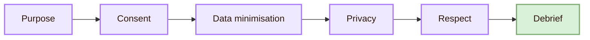

| Ethics concept | HCI evaluation meaning |
|---|---|
| Respect for persons | Users should participate voluntarily and understand what is happening |
| Beneficence | The study should minimise harm and unnecessary risk |
| Justice | Participant selection should not unfairly burden or exclude groups |
| Privacy | Data should be limited, protected, and reported responsibly |
| Non-blame framing | Participants must know the design is being tested, not their intelligence |
| Accessibility accommodation | Participants should be able to use necessary tools and support |

The Belmont Report is a major ethics source for human-subject research. The ACM Code of Ethics is also relevant because HCI evaluation is computing work with social consequences.

## Access Bridge

Accessibility connects evaluation to standards, assistive technologies, disability studies, inclusive design, and real user diversity. It is not just a checklist. It is a method bridge between technical inspection and lived experience.

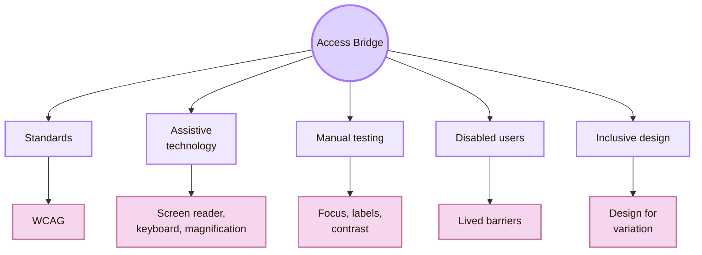

| Accessibility source | What it contributes |
|---|---|
| WCAG | Testable criteria for web accessibility |
| W3C WAI evaluation | Process guidance for assessing accessibility |
| WebAIM | Practical accessibility articles, checklists, and tools |
| Assistive technology testing | Evidence about screen readers, keyboard navigation, magnification, voice input |
| Disabled-user testing | Evidence from lived experience, strategies, and barriers |

Accessibility evaluation is connected to [[../04_Accessibility_and_Accountability/Overview|Inclusive Gate]], but it also belongs inside this room because “evaluating the design” is incomplete without evaluating who can use it.

## Artifact Room

The Artifact Room connects HCI evaluation to open science and computational reproducibility. If a study uses software, scripts, datasets, logs, coding schemes, or analysis notebooks, those artifacts shape whether the result can be inspected and repeated.

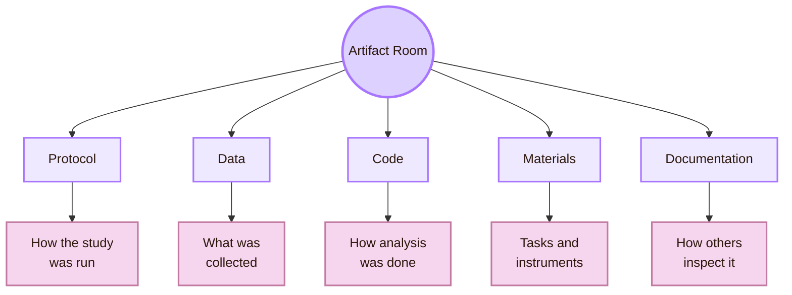

| Artifact | Why it matters |
|---|---|
| Protocol | Shows exactly how participants were tested |
| Task list | Shows what users were asked to do |
| Survey instrument | Shows how constructs were measured |
| Data dictionary | Explains variables and coding |
| Analysis script | Makes quantitative or qualitative processing inspectable |
| Coding scheme | Shows how qualitative themes were generated |
| Versioned prototype | Shows what interface was actually evaluated |

ACM provides artifact review and badging terminology for publications that choose to review research artifacts. This matters because evaluation claims are stronger when materials and analysis can be inspected.

## Connection pattern

The Observation Chamber uses a repeated pattern: each connected field contributes a method material, HCI translates it into an evaluation decision, and the result becomes evidence.

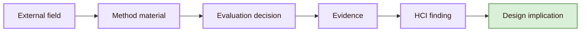

| External field | Method material | HCI evaluation decision |
|---|---|---|
| Statistics | Variables, uncertainty, effect size | Choose metrics and analysis strategy |
| Psychology | Constructs, workload, trust, perception | Choose instruments and interpret human response |
| Social science | Interviews, observation, fieldwork | Capture context and meaning |
| Empirical software engineering | Tool evaluation, repository mining, replication | Evaluate technical systems and developer tools |
| Product analytics | Logs, funnels, cohorts | Study deployed behaviour at scale |
| Research ethics | Consent, privacy, justice | Protect participants and data |
| Accessibility | Standards, assistive technology, disabled-user evidence | Evaluate inclusion and barriers |
| Reproducibility | Artifacts, scripts, protocols | Make study evidence inspectable |

## Cognishire application

The Cognishire HCI map can use this bridge directly.

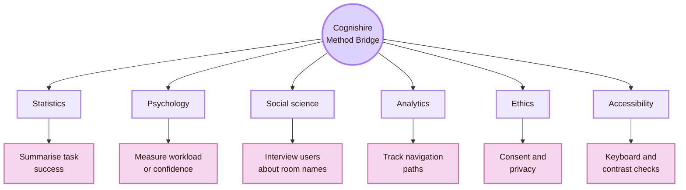

| Project question | Connected field | Method choice |
|---|---|---|
| Do users understand the five room names? | Psychology and social science | Explanation task plus short interview |
| Can users find the System Design page? | Usability and statistics | Task success, time, wrong turns |
| Does the theme improve motivation? | Psychology | Self-report plus behavioural engagement |
| Do diagrams help comprehension? | Experimental design | Compare diagram version with text/table version |
| Does the vault work after GitHub sharing? | Empirical software engineering | Reproducible clone test and issue log |
| Does the map remain accessible? | Accessibility evaluation | Keyboard, focus, contrast, screen reader checks |
| Which pages are actually used? | Product analytics | Link tracking or local navigation logs, only with ethical setup |

## What this page should not claim

| Do not claim | Safer wording |
|---|---|
| “Statistics proves the design is good.” | “Statistics can support specific quantitative claims when the study is designed well.” |
| “Qualitative work is less rigorous.” | “Qualitative work is rigorous when sampling, procedure, analysis, and interpretation are explicit.” |
| “Analytics replaces user research.” | “Analytics shows behavioural traces at scale, but usually does not explain why.” |
| “Accessibility is a final checklist.” | “Accessibility evaluation combines standards, manual checks, assistive technology, and user evidence when possible.” |
| “Ethics is only for medical research.” | “Any study involving people needs consent, privacy, and participant dignity.” |
| “Artifacts are optional decoration.” | “Protocols, materials, data dictionaries, and code help others inspect the evidence.” |

## Bridge synthesis

Connections in the Observation Chamber show that HCI evaluation is not one isolated technique. It is a method ecosystem. Statistics helps evaluation compare and quantify. Psychology helps define human constructs. Social science methods reveal context and meaning. Empirical software engineering studies technical systems and tools. Product analytics reveals real-world behavioural traces. Research ethics protects participants. Accessibility evaluation expands what “works” means. Reproducibility makes evidence inspectable.

The central lesson is that evaluation is not just collecting data. It is building a bridge from method to evidence to design action.

This page connects to [[Activities/Theory]] because every connection depends on measurement and validity. It connects to [[Activities/Design]] because protocols must choose methods, instruments, and ethics. It connects to [[Activities/Experiment]] because those methods become real studies. It connects to [[Important Venues]] because each connected field has its own publication homes. It connects to [[Open Problems]] because bias, validity, reproducibility, ecological realism, and long-term outcomes remain unresolved.

## Academic anchors

| Route | Source |
|---|---|
| CS2023 HCI Evaluation basis | [CS2023 HCI Version Gamma](https://csed.acm.org/wp-content/uploads/2023/09/HCI-Version-Gamma.pdf) |
| CS2023 HCI learning outcomes | [CS2023 HCI SIGCSE 2022 version](https://csed.acm.org/knowledge-areas-human-computer-interaction-hci-sigcse-2022-version/) |
| Statistical methods | [NIST/SEMATECH e-Handbook of Statistical Methods](https://www.itl.nist.gov/div898/handbook/) |
| Engineering statistics handbook | [NIST Engineering Statistics Handbook](https://www.nist.gov/programs-projects/nistsematech-engineering-statistics-handbook) |
| Journal article reporting standards | [APA JARS](https://apastyle.apa.org/jars) |
| Mixed-method reporting | [APA JARS Mixed Methods](https://apastyle.apa.org/jars/mixed-methods) |
| Qualitative and mixed reporting | [APA qualitative and mixed-method reporting standards](https://www.equator-network.org/reporting-guidelines/journal-article-reporting-standards-for-qualitative-primary-qualitative-meta-analytic-and-mixed-methods-research-in-psychology-the-apa-publications-and-communications-board-task-force-report/) |
| Workload measurement | [NASA Task Load Index](https://www.nasa.gov/human-systems-integration-division/nasa-task-load-index-tlx/) |
| Usability scale | [System Usability Scale PDF](https://digital.ahrq.gov/sites/default/files/docs/survey/systemusabilityscale%28sus%29_comp%5B1%5D.pdf) |
| User Experience Questionnaire | [UEQ Online](https://www.ueq-online.org/) |
| Social computing and field methods | [ACM CSCW 2026](https://cscw.acm.org/2026/papers.html) |
| Empirical software engineering | [ESEM conference series](https://conf.researchr.org/series/esem) |
| ESEM official site | [Empirical Software Engineering and Measurement](https://www.esem-conferences.org/) |
| Research ethics | [The Belmont Report](https://www.hhs.gov/ohrp/regulations-and-policy/belmont-report/index.html) |
| Computing ethics | [ACM Code of Ethics](https://www.acm.org/code-of-ethics) |
| Accessibility evaluation | [W3C: Evaluating Web Accessibility Overview](https://www.w3.org/WAI/test-evaluate/) |
| Accessibility standard | [WCAG 2.2](https://www.w3.org/TR/WCAG22/) |
| Accessibility overview | [W3C: WCAG 2 Overview](https://www.w3.org/WAI/standards-guidelines/wcag/) |
| Reproducibility and artifacts | [ACM Software and Data Artifacts](https://www.acm.org/publications/artifacts) |
| Product analytics events | [Google Analytics Events](https://support.google.com/analytics/answer/9322688) |
| Product analytics tracking | [Amplitude Event Tracking](https://amplitude.com/docs/data/sources/instrument-track-unique-users) |
| Product analytics event model | [Mixpanel Events](https://docs.mixpanel.com/docs/data-structure/events-and-properties) |

^connections-evaluating-design-end
