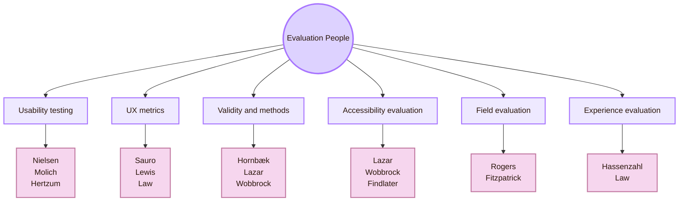
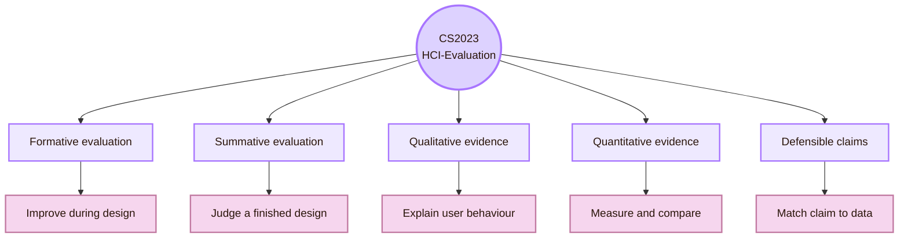
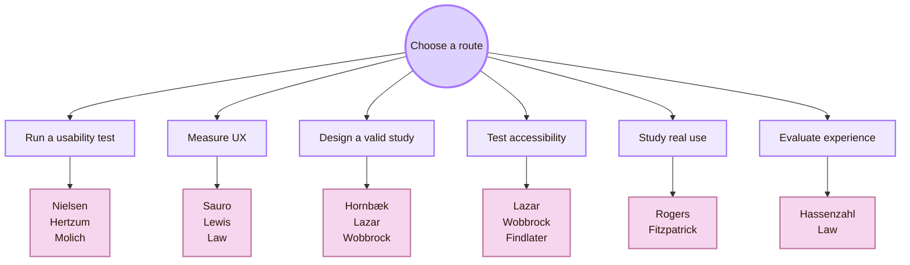
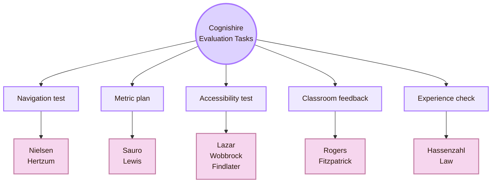

# Important People

Back to [[Overview|The Observation Chamber]].

> [!abstract] Researcher Roadmap
> This page is a study map for **CS2023 HCI-Evaluation: Evaluating the Design**. It points to researchers and practitioners whose work can help you learn usability testing, UX metrics, study validity, accessibility evaluation, field studies, and experience evaluation.

The fantasy label is **Researcher Roadmap**.  
The academic label is **HCI-Evaluation: Evaluating the Design**.  
The practical question is simple: **Who should I read if I want to learn how interactive systems are evaluated?**

This is not a celebrity list. It is a route map. Each person is included because their work helps answer one evaluation question: How do we test usability? How do we measure experience? How do we evaluate accessibility? How do we interpret field evidence? How do we make claims that match the data?

> [!warning] Contact rule
> Use public contact details only when they appear on official university, lab, or organisation pages. Do not mass email. Read the person’s work first. Then send one short, specific question.

## Roadmap Compass

| Evaluation route | What it helps you learn | Start with |
|---|---|---|
| Usability testing | How to observe users, record problems, and report findings | Jakob Nielsen, Rolf Molich, Morten Hertzum |
| UX metrics | How to measure task success, time, errors, satisfaction, and confidence | Jeff Sauro, James R. Lewis, Effie Law |
| Validity and methods | How to design studies and limit unsupported claims | Kasper Hornbæk, Jonathan Lazar, Jacob Wobbrock |
| Accessibility evaluation | How to test systems with disabled users, assistive technologies, and standards | Jonathan Lazar, Jacob Wobbrock, Leah Findlater |
| Field evaluation | How to study technology in real settings | Yvonne Rogers, Geraldine Fitzpatrick |
| Experience evaluation | How to study meaning, affect, motivation, and social acceptability | Marc Hassenzahl, Effie Law |

## CS2023 Evaluation Anchor

CS2023 describes HCI-Evaluation as a unit about evaluating design with users and evidence. It includes formative and summative evaluation, qualitative and quantitative methods, usability evaluation, observation, interviews, surveys, focus groups, study planning, hypothesis design, and defensible conclusions.

The people below are organised around this curriculum logic. Some are professors. Some are professional researchers or consultants. The shared value is methodological: each route helps you decide what to test, how to test it, and how far your evidence can support your conclusion.

## Route I: Usability Testing and Evaluation Practice

Usability testing examines how people use an interface to complete tasks. It helps evaluators find breakdowns, confusion, delays, and errors. In HCI, this route matters because a design can look clear to its creator and still fail during real use.

### Jakob Nielsen

| Field | Details |
|---|---|
| Main context | Nielsen Norman Group; UX Tigers |
| Current status | Co-founder of NN/g; retired from NN/g in 2023 |
| Evaluation focus | Usability testing, heuristic evaluation, web usability, practical UX guidance |
| Why to read him | Nielsen helped make usability methods teachable and usable in industry settings |
| Best first reading | NN/g articles on usability testing, heuristic evaluation, severity ratings, and method choice |
| Use with care | Use this route for applied method vocabulary. Do not treat every NN/g rule as a universal law |
| Official sources | [NN/g profile](https://www.nngroup.com/people/jakob-nielsen/), [NN/g Jakob Nielsen articles](https://www.nngroup.com/articles/author/jakob-nielsen/), [UX Tigers profile](https://www.uxtigers.com/about/people) |

### Rolf Molich

| Field | Details |
|---|---|
| Main context | DialogDesign |
| Evaluation focus | Comparative Usability Evaluation studies, usability test quality, evaluation reproducibility |
| Why to read him | The CUE studies show that different usability teams can evaluate the same system and find different problems |
| What this teaches | Usability findings depend on evaluator skill, method choices, task design, and reporting decisions |
| Best project use | Compare two evaluation reports for the same interface and ask why their findings differ |
| Official sources | [DialogDesign CUE Studies](https://www.dialogdesign.dk/cue-studies/), [About Rolf Molich](https://www.dialogdesign.dk/about-rolf-molich/), [ACM Interactions CUE article](https://dl.acm.org/doi/fullHtml/10.1145/3278154) |

### Morten Hertzum

| Field | Details |
|---|---|
| University | Roskilde University |
| Public email | `mhz@ruc.dk` |
| Current role | Professor of Digital Technologies and Welfare |
| Evaluation focus | Usability testing, HCI, CSCW, health informatics, information seeking, work systems |
| Why to read him | Hertzum is useful when usability testing must be treated as a structured research method |
| Best first reading | *Usability Testing: A Practitioner’s Guide to Evaluating the User Experience* |
| Before contacting | Ask a focused question about usability testing, work systems, healthcare contexts, or CSCW |
| Official sources | [Roskilde profile](https://forskning.ruc.dk/en/persons/mhz/), [personal page](https://mortenhertzum.dk/), [book record](https://forskning.ruc.dk/en/publications/usability-testing-a-practitioners-guide-to-evaluating-the-user-ex/) |

## Route II: UX Metrics and Quantitative Evaluation

UX metrics turn parts of user behaviour and perception into numbers. Examples include task success, completion time, error rate, confidence, perceived usability, and workload. Metrics help HCI researchers compare designs, but they must match the claim being made.

### Jeff Sauro

| Field | Details |
|---|---|
| Organisation | MeasuringU |
| Current role | Founder and CEO |
| Evaluation focus | Quantitative UX, usability metrics, benchmarking, survey interpretation, confidence intervals |
| Why to read him | Sauro gives an applied route into making UX evidence measurable |
| Best first reading | MeasuringU guides on task success, SUS, confidence intervals, sample size, and benchmarking |
| Use with care | Metrics are useful only when the task, sample, and construct are clear |
| Official sources | [MeasuringU About](https://measuringu.com/about/), [Jeff Sauro author page](https://measuringu.com/author/admin/), [Essential UX metrics](https://measuringu.com/essential-metrics/) |

### James R. Lewis

| Field | Details |
|---|---|
| Organisation | MeasuringU; formerly IBM |
| Current role | Distinguished User Experience Researcher at MeasuringU |
| Evaluation focus | Perceived usability, SUS, CSUQ, UMUX, confidence intervals, sample size estimation |
| Why to read him | Lewis is a strong route for standard questionnaires and practical statistics in usability studies |
| Best project use | Choose a questionnaire, explain what it measures, and state what it cannot prove |
| Before contacting | Ask about a measurement choice, not a general UX career question |
| Official sources | [personal website](https://www.jimlewisux.com/), [MeasuringU author page](https://measuringu.com/author/james-r-lewis-phd/), [MeasuringU About](https://measuringu.com/about/) |

### Effie Lai-Chong Law

| Field | Details |
|---|---|
| University | Durham University |
| Current role | Professor in Human-Computer Interaction |
| Evaluation focus | HCI methodologies, usability, user experience methodologies, games, learning technology evaluation |
| Why to read her | Law connects UX evaluation with method choice and user-group differences |
| Best project use | Compare whether different users experience the same system in different ways |
| Before contacting | Ask about UX methodology, learning technologies, games, or evaluation design |
| Official sources | [Durham profile](https://www.durham.ac.uk/staff/lai-chong-law/), [Durham HCI group](https://aihs.webspace.durham.ac.uk/human-computer-interaction/) |

## Route III: Validity, HCI Methods, and Study Design

Validity asks whether the study supports the claim. A study can collect real data and still make a weak claim if the construct, task, sample, or analysis is wrong. This route is central for academic HCI because evaluation is evidence-based argument.

### Kasper Hornbæk

| Field | Details |
|---|---|
| University | University of Copenhagen |
| Public email | `kash@di.ku.dk` |
| Current role | Professor, Human-Centred Computing |
| Evaluation focus | HCI, usability research, empirical methods, interaction theory, measurement |
| Why to read him | Hornbæk is useful for thinking carefully about usability measures and HCI claims |
| Best first reading | Papers on usability measurement, HCI theory, empirical methods, and interaction research |
| Before contacting | Ask a precise question about measures, theory, or study validity |
| Official sources | [University of Copenhagen staff profile](https://di.ku.dk/english/staff/?pure=en%2Fpersons%2F141851), [personal research page](https://www.kasperhornbaek.dk/) |

### Jonathan Lazar

| Field | Details |
|---|---|
| University | University of Maryland |
| Current role | Professor in the College of Information; Executive Director of the Maryland Initiative for Digital Accessibility |
| Evaluation focus | HCI research methods, ICT accessibility, user-centred design, assistive technologies, accessibility law and policy |
| Why to read him | Lazar connects research methods with accessibility, policy, and social impact |
| Best first reading | *Research Methods in Human-Computer Interaction* and work on digital accessibility |
| Before contacting | Ask about research methods, accessibility evaluation, policy, or assistive technology |
| Official sources | [UMD profile](https://ischool.umd.edu/directory/jonathan-lazar/), [MIDA](https://mida.umd.edu/) |

### Jacob O. Wobbrock

| Field | Details |
|---|---|
| University | University of Washington |
| Public email | `wobbrock@uw.edu` |
| Current role | Professor in the Information School; Adjunct Professor in the Paul G. Allen School of Computer Science & Engineering; Director of ACE Lab |
| Evaluation focus | HCI methods, accessible computing, input techniques, human performance measurement, interaction modelling |
| Why to read him | Wobbrock is useful when an evaluation involves performance, input, accessibility, and statistical method choice |
| Best project use | Evaluate an input technique and justify the task, measure, and analysis |
| Before contacting | Bring a clear method question about an interaction technique or accessibility study |
| Official sources | [UW personal page](https://faculty.washington.edu/wobbrock/), [CREATE profile](https://create.uw.edu/people-directors-wobbrock/) |

## Route IV: Accessibility Evaluation

Accessibility evaluation asks whether people with disabilities can use the system. It includes standards checks, assistive technology testing, keyboard testing, user studies, and barrier analysis. In HCI, accessibility is a design and evaluation responsibility, not a final decoration.

### Leah Findlater

| Field | Details |
|---|---|
| University | University of Washington |
| Public email | `leahkf@uw.edu` |
| Current role | Professor in Human Centered Design & Engineering; Research Scientist in Apple’s Human-Centered Machine Intelligence group |
| Evaluation focus | Accessible technologies, inclusive design, adaptive systems, human-centred machine learning |
| Why to read her | Findlater is useful for accessibility studies that involve real users, adaptive interfaces, and AI-supported interaction |
| Best project use | Evaluate whether an adaptive or AI-assisted interface works for users with different abilities |
| Before contacting | Prepare a specific accessibility evaluation question |
| Official sources | [UW HCDE profile](https://www.hcde.washington.edu/findlater), [Inclusive Design Lab](https://inclusivedesignlabuw.github.io/), [CREATE profile](https://create.uw.edu/people-directors-findlater/) |

### Jonathan Lazar

| Field | Details |
|---|---|
| Why repeated here | Lazar links accessibility evaluation to process, policy, law, and user-centred design |
| Use this route when | You need to explain accessibility as a technical, organisational, and legal issue |
| Good student task | Build an accessibility issue log that records barrier, affected user, WCAG reference, and design repair |
| Official sources | [UMD profile](https://ischool.umd.edu/directory/jonathan-lazar/), [MIDA](https://mida.umd.edu/) |

### Jacob O. Wobbrock

| Field | Details |
|---|---|
| Why repeated here | Wobbrock’s work is especially relevant for accessible input, touch, gesture, text entry, and performance measurement |
| Use this route when | You need to evaluate an interaction technique for people with different abilities |
| Good student task | Compare two input methods using task success, time, error rate, and user comments |
| Official sources | [UW personal page](https://faculty.washington.edu/wobbrock/), [CREATE profile](https://create.uw.edu/people-directors-wobbrock/) |

## Route V: Field, Qualitative, and Real-World Evaluation

Field evaluation studies technology in natural or semi-natural settings. It looks at work practices, routines, social interaction, setting, and long-term use. This route matters because many HCI problems appear only when systems meet real context.

### Yvonne Rogers

| Field | Details |
|---|---|
| University | University College London, UCL Interaction Centre |
| Current role | Professor of Interaction Design |
| Evaluation focus | HCI, interaction design, ubiquitous computing, human-centred AI, research in the wild |
| Why to read her | Rogers is a strong route for evaluating technology in everyday, learning, work, and public settings |
| Best first reading | Work on interaction design, ubiquitous computing, and research in the wild |
| Best project use | Design a field observation or classroom evaluation rather than a lab-only task |
| Official sources | [UCL profile](https://profiles.ucl.ac.uk/33314-yvonne-rogers), [Royal Society profile](https://royalsociety.org/people/yvonne-rogers-35840/) |

### Geraldine Fitzpatrick

| Field | Details |
|---|---|
| Main public route | TU Wien Informatics and personal website |
| Current wording | Former Professor of Technology Design and Assessment and former Head of the HCI Group at TU Wien; public profile route remains available |
| Evaluation focus | HCI, CSCW, technology design and assessment, health informatics, social interaction, collaboration |
| Why to read her | Fitzpatrick is useful for evaluation that connects technical systems with social practice |
| Best project use | Study how a technology fits into a collaborative, health, or everyday routine |
| Before contacting | Use the public profile route and ask a focused question about social or health-related technology evaluation |
| Official sources | [TU Wien profile](https://informatics.tuwien.ac.at/people/geraldine-fitzpatrick), [personal page](https://www.geraldinefitzpatrick.com/home/about-me/) |

## Route VI: Experience, Meaning, and Affective Evaluation

Experience evaluation studies more than task completion. It asks whether interaction feels meaningful, motivating, pleasant, appropriate, or socially acceptable. This route is useful when a system is meant to support learning, creativity, wellbeing, entertainment, or long-term engagement.

### Marc Hassenzahl

| Field | Details |
|---|---|
| University | University of Siegen |
| Current role | Professor of Ubiquitous Design / Experience and Interaction |
| Evaluation focus | User experience, experience design, meaning, pleasure, motivation, social acceptability |
| Why to read him | Hassenzahl is a strong route for studying experience as more than efficiency |
| Best project use | Ask whether the RPG layer in Cognishire supports orientation or distracts from learning |
| Before contacting | Ask about experience design, social acceptability, or evaluating meaning in interaction |
| Official sources | [University of Siegen HCI profile](https://hci-siegen.de/faculty-profile/), [Experience and Interaction Design group](https://www.experienceandinteraction.com/) |

### Effie Lai-Chong Law

| Field | Details |
|---|---|
| Why repeated here | Law is relevant for UX methodology and evaluation in games and learning systems |
| Use this route when | Your system depends on enjoyment, motivation, perceived quality, or learning experience |
| Good student task | Combine a small task study with an experience questionnaire and two interview questions |
| Official sources | [Durham profile](https://www.durham.ac.uk/staff/lai-chong-law/), [Durham HCI group](https://aihs.webspace.durham.ac.uk/human-computer-interaction/) |

## Study Route by Evaluation Interest

| If you want to learn... | Start with... | Build this small project |
|---|---|---|
| How to run a usability test | Nielsen, Hertzum, Molich | A 3-user think-aloud test with an issue log and severity ratings |
| How to quantify UX | Sauro, Lewis, Law | A small benchmark with task success, time, SUS, and confidence intervals |
| How to design valid HCI studies | Hornbæk, Lazar, Wobbrock | A protocol that defines constructs, variables, threats, and claim limits |
| How to evaluate accessibility | Lazar, Wobbrock, Findlater | A keyboard test, screen reader check, WCAG issue log, and user-impact summary |
| How to study real use | Rogers, Fitzpatrick | A field observation or diary study in a real setting |
| How to evaluate experience | Hassenzahl, Law | A study that combines task evidence, experience ratings, and short interviews |

## Contact Protocol

| Email part | What to include |
|---|---|
| Subject | “Question about HCI evaluation methods” |
| Opening | Who you are and what you are studying |
| Specific fit | One sentence connecting your interest to their work |
| Evidence | One paper, book, article, or lab page you actually read |
| Your project | A small evaluation project you are building |
| Ask | One precise question about method choice, reading path, or study design |
| Close | Thank them. Add a portfolio or GitHub link only if it helps the question |

### Minimal email template

> [!example] Evaluation-method email
> Dear Professor [Name],  
> I am building a CS2023-based HCI map and I am studying **HCI-Evaluation: Evaluating the Design**. I read your work on [specific topic], especially [method, paper, or project].  
>  
> I am designing a small evaluation of [interface/project]. I want to choose better methods for [specific issue]. Would you recommend one or two papers, courses, or lab resources as a starting point?  
>  
> Best regards,  
> [Name]

## Reading Sequence

| Step | What to read | Why |
|---|---|---|
| 1 | CS2023 HCI-Evaluation | Learn the official curriculum scope |
| 2 | NN/g usability testing articles | Learn basic applied method vocabulary |
| 3 | Hertzum or Lazar methods texts | Learn structured research-method thinking |
| 4 | Sauro and Lewis on UX metrics | Learn quantitative UX measurement |
| 5 | Hornbæk and Wobbrock | Learn validity, measurement, and method limits |
| 6 | W3C/WCAG plus Lazar, Findlater, and Wobbrock | Learn accessibility evaluation |
| 7 | Rogers and Fitzpatrick | Learn field and qualitative evaluation |
| 8 | Hassenzahl and Law | Learn experience and meaning-focused evaluation |

## Cognishire Application

For the Cognishire map, the people routes can become direct evaluation tasks.

| Cognishire question | Best route |
|---|---|
| Do users understand the room names? | Nielsen, Hertzum, Hornbæk |
| Are the evaluation tasks clear? | Lazar, Hertzum, Rogers |
| Which metrics should be recorded? | Sauro, Lewis, Law |
| Are the findings valid enough? | Hornbæk, Wobbrock, Lazar |
| Is the vault accessible? | Lazar, Wobbrock, Findlater, W3C/WCAG |
| Does the vault work in classroom use? | Rogers, Fitzpatrick |
| Does the light RPG layer help or distract? | Hassenzahl, Law |

## Roadmap Synthesis

Important People for Evaluating the Design is a methods roadmap. It shows that HCI evaluation is not one method. Usability testing, UX metrics, validity analysis, accessibility evaluation, field research, and experience evaluation answer different questions.

Nielsen, Molich, and Hertzum help with practical usability testing. Sauro, Lewis, and Law help with measurement. Hornbæk, Lazar, and Wobbrock help with method validity. Lazar, Wobbrock, and Findlater help with accessibility evaluation. Rogers and Fitzpatrick help with field and qualitative evaluation. Hassenzahl and Law help with experience and meaning.

This page connects to [[Activities/Theory]] because evaluation depends on constructs and assumptions. It connects to [[Activities/Design]] because evaluation protocols must be designed before data collection. It connects to [[Activities/Experiment]] because methods become concrete studies. It connects to [[Connections]] because evaluation uses statistics, psychology, accessibility, ethics, software engineering, and social science. It connects to [[Important Venues]] because these routes lead to conferences, journals, and communities where HCI evaluation research is published.

## Academic Anchors

| Route | Source |
|---|---|
| CS2023 HCI-Evaluation basis | [CS2023 HCI Version Gamma PDF](https://csed.acm.org/wp-content/uploads/2023/09/HCI-Version-Gamma.pdf) |
| Human-centred design standard | [ISO 9241-210:2019](https://www.iso.org/standard/77520.html) |
| Human-centred design summary | [NIST Human Centered Design](https://www.nist.gov/itl/iad/human-centered-technologies/human-factors-human-centered-design) |
| Accessibility standard | [W3C WCAG 2.2](https://www.w3.org/TR/WCAG22/) |
| WCAG overview | [W3C WAI WCAG Overview](https://www.w3.org/WAI/standards-guidelines/wcag/) |
| Applied usability methods | [Nielsen Norman Group Articles](https://www.nngroup.com/articles/) |
| Jakob Nielsen | [NN/g profile](https://www.nngroup.com/people/jakob-nielsen/) |
| Comparative Usability Evaluation | [DialogDesign CUE Studies](https://www.dialogdesign.dk/cue-studies/) |
| CUE reproducibility discussion | [ACM Interactions article](https://dl.acm.org/doi/fullHtml/10.1145/3278154) |
| Morten Hertzum | [Roskilde University profile](https://forskning.ruc.dk/en/persons/mhz/) |
| Quantitative UX practice | [MeasuringU About](https://measuringu.com/about/) |
| Jeff Sauro | [MeasuringU author page](https://measuringu.com/author/admin/) |
| James R. Lewis | [personal website](https://www.jimlewisux.com/) |
| Effie Law | [Durham University profile](https://www.durham.ac.uk/staff/lai-chong-law/) |
| Kasper Hornbæk | [University of Copenhagen profile](https://di.ku.dk/english/staff/?pure=en%2Fpersons%2F141851) |
| Jonathan Lazar | [UMD profile](https://ischool.umd.edu/directory/jonathan-lazar/) |
| Jacob Wobbrock | [UW personal page](https://faculty.washington.edu/wobbrock/) |
| Leah Findlater | [UW HCDE profile](https://www.hcde.washington.edu/findlater) |
| Yvonne Rogers | [UCL profile](https://profiles.ucl.ac.uk/33314-yvonne-rogers) |
| Geraldine Fitzpatrick | [TU Wien profile](https://informatics.tuwien.ac.at/people/geraldine-fitzpatrick) |
| Marc Hassenzahl | [University of Siegen HCI profile](https://hci-siegen.de/faculty-profile/) |

^important-people-evaluating-design-end
