![[gta.jpg|1000]]
# Important Venues

Back to [[Overview|The Observation Chamber]].

> [!abstract] Venue Atlas
> This page maps the main places where **HCI evaluation knowledge** is published, reviewed, taught, and used. It is focused on **CS2023 HCI-Evaluation: Evaluating the Design**.

The fantasy label is **Venue Atlas**.  
The academic label is **HCI-Evaluation: Evaluating the Design**.  
The practical question is simple: **Where should I search when I need evidence about whether an interactive system works?**

This page is not a general list of HCI venues. It is a route map for evaluation. It helps you decide where to look for usability testing, accessibility evaluation, UX metrics, field studies, human factors, software-tool evaluation, behavioural data, and reproducible research.

> [!quote] Atlas rule

## Evaluation Venue Map

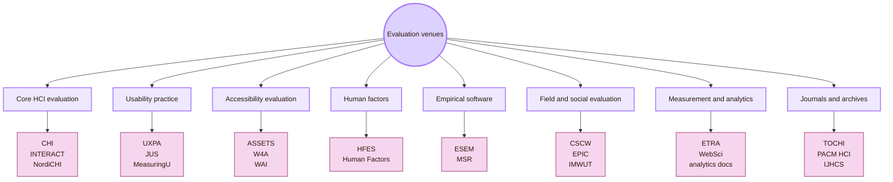

| Venue route | What it helps you find | Use it when the evaluation question is about... |
|---|---|---|
| Core HCI evaluation | Main HCI research with user studies and design evaluation | usability, interaction, mixed methods, human-AI evaluation |
| Usability practice | Professional UX research and applied usability methods | test plans, issue logs, severity, UX metrics, reports |
| Accessibility evaluation | Disability, assistive technology, standards, and inclusion | screen readers, keyboard access, WCAG, barriers, disabled users |
| Human factors | Human-system performance and ergonomics | workload, safety, attention, fatigue, high-stakes work |
| Empirical software | Evidence about software tools and developer workflows | programming tools, plugins, repositories, developer experience |
| Field and social evaluation | Real-world technology use | collaboration, organisations, routines, deployment, social context |
| Measurement and analytics | Behavioural traces and specialised measurement | eye tracking, web behaviour, events, funnels, logs |
| Journals and archives | Longer and more stable research records | theory, mature methods, deeper literature, validated studies |

## CS2023 Evaluation Anchor

CS2023 treats HCI-Evaluation as the study of how designs are evaluated with users and evidence. It includes formative and summative evaluation, usability testing, qualitative and quantitative methods, observation, interviews, surveys, focus groups, study planning, hypothesis design, heuristic evaluation, and defensible conclusions.

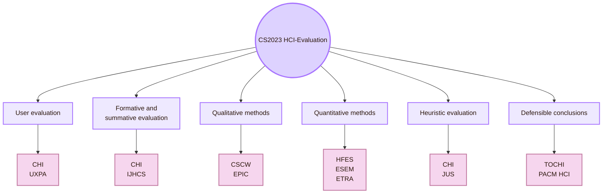

| CS2023 topic | Useful venue route |
|---|---|
| Usability testing | CHI, UXPA, Journal of Usability Studies, IJHCS |
| Formative and summative evaluation | CHI, TOCHI, PACM HCI, IJHCS |
| Interviews and observation | CSCW, EPIC, CHI, Interacting with Computers |
| Surveys and quantitative methods | HFES, ESEM, IJHCS, Behaviour & Information Technology |
| Heuristic evaluation | CHI, Journal of Usability Studies, NN/g practice resources |
| Accessibility evaluation | ASSETS, W4A, W3C WAI, WebAIM |
| Field studies and deployment | CSCW, IMWUT, UbiComp, PACM HCI |
| Long-term and large-scale behaviour | CSCW, WebSci, CHI, analytics documentation |
| Reproducibility and artifacts | ACM artifact review routes, OSF, ESEM |

## Core HCI Evaluation: CHI, INTERACT, NordiCHI

Core HCI venues publish research where evaluation is part of a larger HCI contribution. These venues are useful when a study includes an interface, a user group, a research question, a method, and evidence about use.

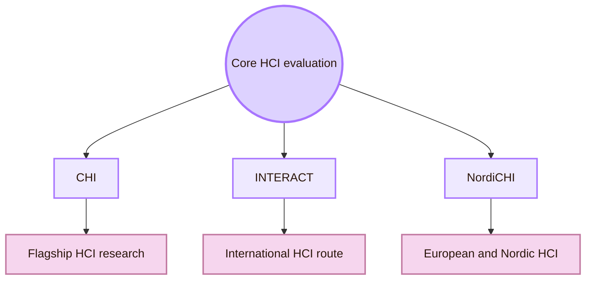

| Venue | What it contributes to evaluation |
|---|---|
| [ACM CHI](https://dl.acm.org/conference/chi) | A central HCI venue for empirical studies, user research, design evaluation, accessibility, usability, and human-AI interaction. |
| [ACM SIGCHI](https://sigchi.org/) | The main ACM special interest group for HCI. It sponsors CHI and many related HCI conferences. |
| [IFIP INTERACT](https://interact2025.org/) | An international HCI conference route. Use it for HCI work across domains, methods, and cultural contexts. |
| [NordiCHI](https://www.nordichi.org/) | A Nordic and European HCI route, often useful for design-oriented, participatory, and empirical HCI work. |

Use this route when the question is broad: **How do people understand, use, fail, adopt, trust, or experience this system?**

## Usability Practice: UXPA, JUS, MeasuringU

Usability practice venues connect research methods to applied UX work. They are useful when you need a test plan, a report structure, task metrics, or professional research language.

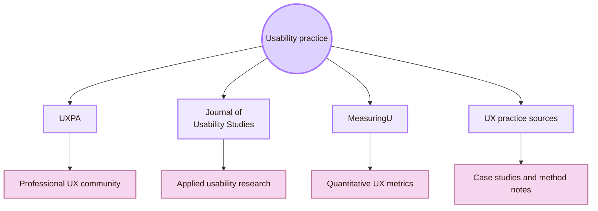

| Venue or route | What it contributes |
|---|---|
| [UXPA International](https://uxpa.org/) | Professional community for people who research, design, and evaluate user experience. |
| [Journal of Usability Studies](https://uxpajournal.org/) | Applied usability and UX research journal connected to UXPA. |
| [MeasuringU](https://measuringu.com/) | Practical route for quantitative UX, task metrics, SUS, sample size, confidence intervals, and benchmarking. |
| [User Experience Magazine](https://uxpamagazine.org/) | Practice-focused articles and case studies about UX work. |
| [Nielsen Norman Group Articles](https://www.nngroup.com/articles/) | Applied usability and UX method explanations. Use them as practice guidance, not as peer-reviewed evidence. |

Use this route when the question is practical: **How do I run and report a usable evaluation study?**

## Accessibility Evaluation: ASSETS, W4A, W3C WAI, WebAIM

Accessibility evaluation asks whether a design works across disability, assistive technology, input modes, output modes, and context of use. This route combines research venues, standards, and practice resources.

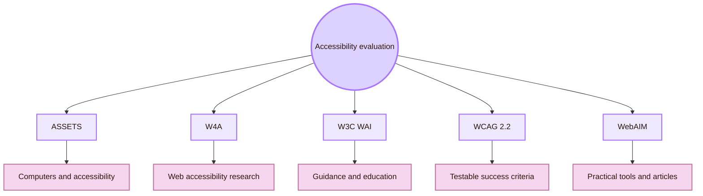

| Venue or organisation | What it contributes |
|---|---|
| [ACM ASSETS](https://www.sigaccess.org/assets/) | Major venue for computing and accessibility research. It includes design, evaluation, use, and education related to disabled people and older adults. |
| [ACM SIGACCESS](https://www.sigaccess.org/) | ACM community for computing and information technologies that empower disabled people and older adults. |
| [Web4All](https://www.w4a.info/) | Web accessibility research conference. Use it when the system is web-based or standards-facing. |
| [W3C Web Accessibility Initiative](https://www.w3.org/WAI/) | Standards, education, and evaluation guidance for web accessibility. |
| [WCAG 2.2](https://www.w3.org/TR/WCAG22/) | Testable web content accessibility success criteria. Use it when evaluating conformance. |
| [WebAIM](https://webaim.org/) | Practical accessibility evaluation tools, surveys, articles, and checklists. |

## Human Factors and Ergonomics: HFES and Human Factors

Human factors venues connect HCI evaluation to performance, workload, fatigue, safety, attention, cognition, and physical fit. This route is important when an interface affects work quality or risk.

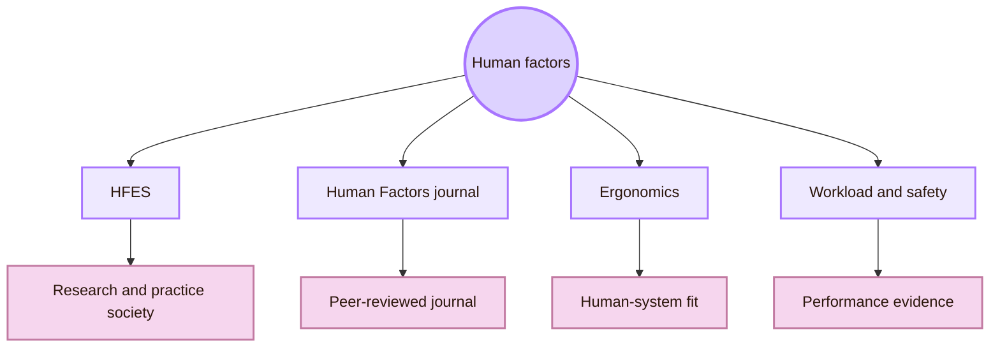

| Venue or route | What it contributes |
|---|---|
| [Human Factors and Ergonomics Society](https://www.hfes.org/) | Professional society for human factors and ergonomics research, education, and practice. |
| [HFES ASPIRE Annual Meeting](https://www.hfes.org/Events/ASPIRE-International-Annual-Meeting/ASPIRE-International-Annual-Meeting-Home) | Annual meeting route for human-system performance, ergonomics, safety, and applied research. |
| [Human Factors journal](https://journals.sagepub.com/home/hfs) | Peer-reviewed route for human factors, ergonomics, system performance, workload, safety, and cognition. |
| [HFES Europe](https://www.hfes-europe.org/) | European human factors route for applied evaluation beyond classic HCI. |
| [Applied Ergonomics](https://www.sciencedirect.com/journal/applied-ergonomics) | Journal route for ergonomics and applied human-system evaluation. |

Use this route when the question is: **Can people perform safely, accurately, and sustainably with this system?**

## Empirical Software Evaluation: ESEM, MSR, ICSE-SEIP

Empirical software venues help when the evaluated system is a software tool, programming environment, plugin, repository workflow, or developer-facing interface. These venues are relevant because many HCI systems are also software systems.

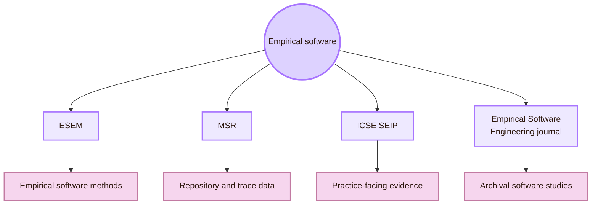

| Venue | What it contributes |
|---|---|
| [ESEM](https://www.esem-conferences.org/) | Empirical software engineering and measurement. Useful for studying software tools, processes, metrics, and methods. |
| [Mining Software Repositories](https://conf.researchr.org/series/msr) | Repository mining and software trace analysis. Useful for GitHub, commits, issues, pull requests, and developer behaviour. |
| [ICSE Software Engineering in Practice](https://conf.researchr.org/track/icse-2026/icse-2026-software-engineering-in-practice) | Practice-facing software engineering route. Useful when evaluation needs industry relevance or applied evidence. |
| [Empirical Software Engineering journal](https://www.springer.com/journal/10664) | Archival route for empirical studies of software development, tools, and processes. |

Use this route when the question is: **Does this software tool or workflow improve real development work?**

## Field and Social Evaluation: CSCW, EPIC, IMWUT, UbiComp

Field and social evaluation studies technology in real settings. This includes collaboration, organisations, communities, homes, workplaces, mobile use, wearable systems, and long-term deployment.

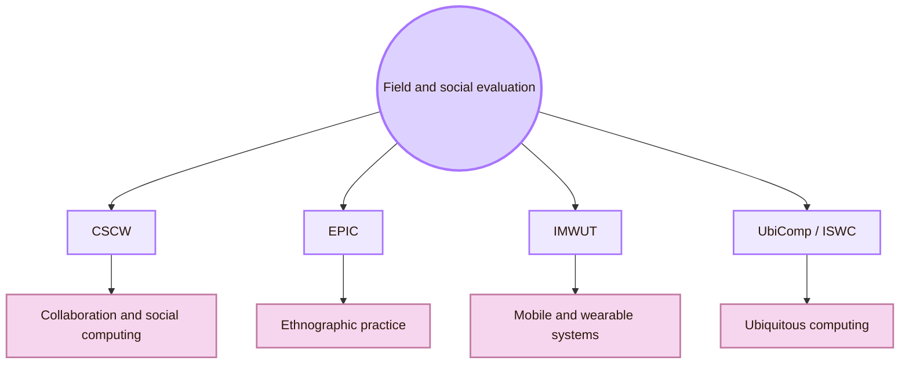

| Venue | What it contributes |
|---|---|
| [ACM CSCW](https://cscw.acm.org/) | Research on technologies that affect groups, organisations, communities, networks, collaboration, and social life. |
| [PACM HCI CSCW track](https://dl.acm.org/journal/pacmhci/tracks/cscw) | Journal-style publication route for CSCW papers. Useful for deeper field and social computing studies. |
| [EPIC](https://www.epicpeople.org/) | Ethnographic practice route. Useful for qualitative research in organisations, services, and design contexts. |
| [ACM IMWUT](https://dl.acm.org/journal/imwut) | Journal route for interactive, mobile, wearable, and ubiquitous technologies. Useful for field deployments and sensor-based studies. |
| [UbiComp / ISWC](https://www.ubicomp.org/) | Venue route for ubiquitous, pervasive, and wearable computing. Useful for systems outside normal desktop use. |

Use this route when the question is: **What happens when the system is used in real life, over time, with other people and constraints?**

## Measurement and Behavioural Data: ETRA, WebSci, Analytics Routes

Measurement and behavioural data venues focus on traces of action. These traces can include gaze, clicks, sessions, events, repositories, and web-scale behaviour. They are useful, but they do not explain everything by themselves.

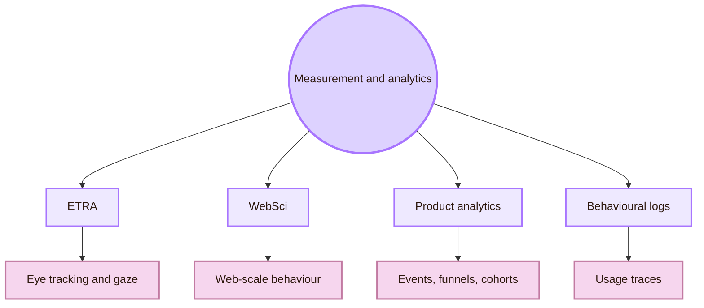

| Venue or route | What it contributes |
|---|---|
| [ACM ETRA](https://etra.acm.org/) | Eye tracking research and applications. Useful for attention, gaze, visual search, reading, and visual interaction. |
| [ACM Web Science](https://dl.acm.org/conference/websci) | Web-scale social and technical systems. Useful for studying behaviour in networked environments. |
| [Google Analytics event model](https://support.google.com/analytics/answer/9322688) | Product analytics documentation for events and behavioural traces. Use as tool documentation, not academic evidence. |
| [Amplitude tracking docs](https://amplitude.com/docs/data/sources/instrument-track-unique-users) | Product analytics documentation for users, events, and tracking structure. |
| [Mixpanel events](https://docs.mixpanel.com/docs/data-structure/events-and-properties) | Product analytics documentation for event data and properties. |

Use this route when the question is: **What do behavioural traces show about use?** Then combine the trace data with observation, interviews, task analysis, or usability testing.

## Journal Archive: Evaluation Research That Lasts

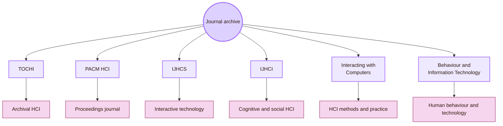

| Journal | Why it matters for evaluation |
|---|---|
| [ACM TOCHI](https://dl.acm.org/journal/tochi) | Covers software, hardware, and human aspects of interaction with computers. Useful for deeper HCI evaluation work. |
| [PACM HCI](https://dl.acm.org/journal/pacmhci) | Proceedings journal for research at the intersection of human factors and computing systems. |
| [International Journal of Human-Computer Studies](https://www.sciencedirect.com/journal/international-journal-of-human-computer-studies) | Publishes research on the design and use of interactive computer technology. |
| [International Journal of Human-Computer Interaction](https://www.tandfonline.com/journals/hihc20) | Covers cognitive, creative, social, health, and ergonomic aspects of interactive computing. |
| [Interacting with Computers](https://academic.oup.com/iwc) | HCI journal route for theories, methods, tools, techniques, and practices. |
| [Behaviour & Information Technology](https://www.tandfonline.com/journals/tbit20) | Useful for studying human behaviour, technology use, organisations, and applied interaction. |
| [Journal of Usability Studies](https://uxpajournal.org/) | Applied usability research and professional UX evaluation. |
| [Human Factors](https://journals.sagepub.com/home/hfs) | Human performance, workload, safety, ergonomics, and system evaluation. |

## Labs, Institutes, and Method Communities

Labs and method communities help students learn how evaluation is practised. They publish papers, toolkits, guides, lab pages, course material, and project examples.

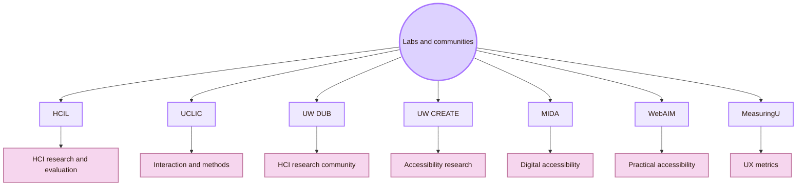

| Lab or community | Evaluation value |
|---|---|
| [University of Maryland HCIL](https://hcil.umd.edu/) | HCI lab route for design, user studies, accessibility, and evaluation. |
| [UCL Interaction Centre](https://www.ucl.ac.uk/uclic/) | Interaction design, HCI, human-centred AI, and evaluation route. |
| [UW DUB](https://dub.washington.edu/) | Interdisciplinary HCI community, including evaluation, design, accessibility, and social computing. |
| [UW CREATE](https://create.uw.edu/) | Accessibility research, evaluation, and inclusive technology route. |
| [Maryland Initiative for Digital Accessibility](https://mida.umd.edu/) | Digital accessibility research, education, policy, and practice. |
| [WebAIM](https://webaim.org/) | Practical accessibility evaluation tools and educational resources. |
| [MeasuringU](https://measuringu.com/) | Quantitative UX, metrics, benchmarking, and practical measurement methods. |

Use this route when the question is: **Who teaches or demonstrates this evaluation method in public resources?**

## Venue Selection Route

Use this route when you have a concrete evaluation question and need to choose where to search first.

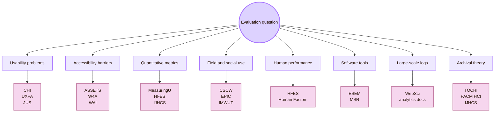

| If the question is... | Start here | Then broaden to |
|---|---|---|
| How do I find usability problems? | CHI, UXPA, Journal of Usability Studies | NN/g, IJHCS, TOCHI |
| How do I evaluate accessibility? | ASSETS, W4A, W3C WAI, WebAIM | CHI, SIGACCESS, WCAG |
| How do I quantify UX? | MeasuringU, JUS, IJHCS | HFES, Human Factors, TOCHI |
| How do I study real-world collaboration? | CSCW | EPIC, IMWUT, CHI |
| How do I evaluate workload or safety? | HFES, Human Factors | Ergonomics, Applied Ergonomics, CHI |
| How do I evaluate developer tools? | ESEM, MSR | CHI, ICSE-SEIP, TOCHI |
| How do I analyse use after deployment? | Product analytics docs, WebSci | CSCW, CHI, IMWUT |
| How do I find mature research? | TOCHI, PACM HCI, IJHCS | Interacting with Computers, IJHCI |

## Reading Across Venues

A strong evaluation usually combines more than one venue type. A usability study of an accessibility feature should check HCI venues, accessibility venues, WCAG guidance, and practical accessibility resources. A study of a developer tool should check HCI venues and empirical software engineering venues.

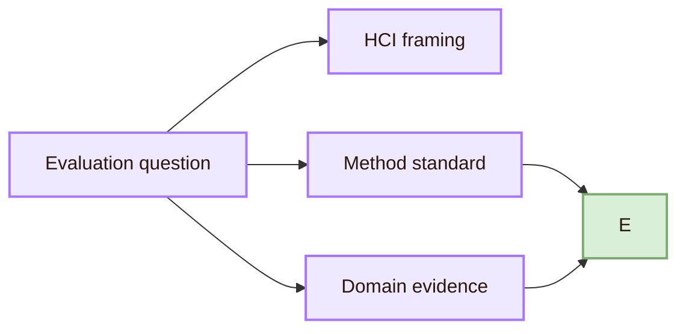

| Evaluation project | Useful venue combination |
|---|---|
| Testing Cognishire navigation | CHI, UXPA, JUS, NN/g methods |
| Evaluating accessibility of the Obsidian vault | W3C WAI, WCAG, WebAIM, ASSETS |
| Measuring whether diagrams improve comprehension | CHI, IJHCS, psychology and measurement sources |
| Studying classroom use over several weeks | CSCW, IMWUT, education-HCI venues |
| Evaluating a GitHub and Obsidian workflow | ESEM, MSR, CHI |
| Studying gaze and visual hierarchy | ETRA, CHI, IJHCS |
| Evaluating workload in a complex interface | HFES, Human Factors, NASA-TLX sources |

## Source Reliability Ladder

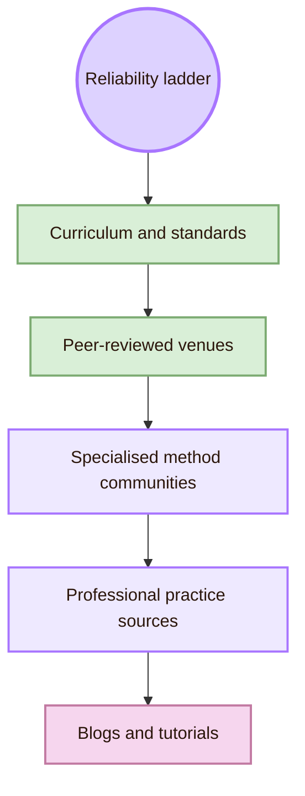

| Source type | Use it for | Caution |
|---|---|---|
| Curriculum and standards | Official scope, accessibility criteria, usability definitions | They define structure. They do not answer every practical question. |
| Peer-reviewed venues | Research evidence and method development | Papers may be narrow, advanced, or context-specific. |
| Specialised method communities | Accessibility, human factors, analytics, empirical software methods | Methods may need translation into an HCI study. |
| Professional sources | Practical usability and UX research methods | Useful for practice, but usually not peer-reviewed. |
| Blogs and tutorials | Quick learning and tool setup | Do not use them as the main academic foundation. |

## Broad Evaluation Atlas

| Territory | Core venues and communities | What they map |
|---|---|---|
| General HCI evaluation | CHI, INTERACT, NordiCHI | User studies, usability, mixed methods, design evaluation |
| Professional UX evaluation | UXPA, JUS, MeasuringU | Applied usability, UX metrics, professional research practice |
| Accessibility evaluation | ASSETS, W4A, W3C WAI, WCAG, WebAIM | Disability, assistive technology, web accessibility, standards |
| Human factors evaluation | HFES, Human Factors, Applied Ergonomics | Workload, safety, performance, human-system interaction |
| Empirical software evaluation | ESEM, MSR, ICSE-SEIP | Developer tools, software processes, repository traces |
| Social and field evaluation | CSCW, EPIC, IMWUT, UbiComp | Field studies, collaboration, organisations, real-world use |
| Behavioural measurement | ETRA, WebSci, product analytics routes | Eye tracking, web-scale behaviour, event data, logs |
| Journals and archives | TOCHI, PACM HCI, IJHCS, IJHCI, IwC, BIT | Mature studies, theory, methods, evidence |
| Reproducibility | ACM artifact badging, OSF | Protocols, data, analysis, artifacts |

## Cognishire Venue Route

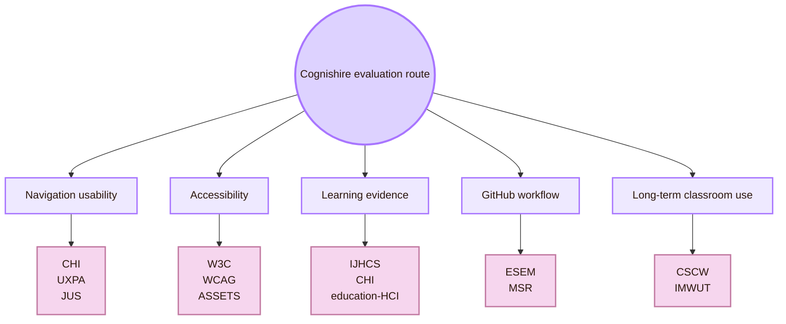

|---|---|
| Users can find the right HCI room | CHI, UXPA, JUS, NN/g methods |
| The CSS theme is readable and accessible | W3C WAI, WCAG, WebAIM, ASSETS |
| Diagrams improve understanding | CHI, IJHCS, psychology and measurement sources |
| The GitHub sharing workflow works | ESEM, MSR, software engineering practice |
| Students use the vault over time | CSCW, IMWUT, field-study routes |
| The evaluation protocol is defensible | TOCHI, PACM HCI, IJHCS, research-methods texts |

## Academic Anchors

| Route | Source |
|---|---|
| CS2023 HCI Evaluation basis | [CS2023 Version Gamma PDF](https://csed.acm.org/wp-content/uploads/2023/09/Version-Gamma.pdf) |
| CS2023 Knowledge Areas | [CS2023 Knowledge Areas](https://csed.acm.org/knowledge-areas/) |
| ACM SIGCHI community | [ACM SIGCHI](https://sigchi.org/) |
| Core HCI conference | [ACM CHI](https://dl.acm.org/conference/chi) |
| CHI current conference route | [CHI 2026](https://chi2026.acm.org/) |
| International HCI conference | [IFIP INTERACT](https://interact2025.org/) |
| Nordic HCI route | [NordiCHI](https://www.nordichi.org/) |
| Professional UX community | [UXPA International](https://uxpa.org/) |
| Applied usability journal | [Journal of Usability Studies](https://uxpajournal.org/) |
| Applied UX methods | [Nielsen Norman Group Articles](https://www.nngroup.com/articles/) |
| Quantitative UX practice | [MeasuringU](https://measuringu.com/) |
| Accessibility conference | [ACM ASSETS](https://www.sigaccess.org/assets/) |
| Accessibility community | [ACM SIGACCESS](https://www.sigaccess.org/) |
| Web accessibility conference | [Web4All](https://www.w4a.info/) |
| Accessibility standards and education | [W3C Web Accessibility Initiative](https://www.w3.org/WAI/) |
| Web content accessibility standard | [WCAG 2.2](https://www.w3.org/TR/WCAG22/) |
| Practical accessibility | [WebAIM](https://webaim.org/) |
| Human factors society | [HFES](https://www.hfes.org/) |
| Human factors journal | [Human Factors](https://journals.sagepub.com/home/hfs) |
| Applied ergonomics journal | [Applied Ergonomics](https://www.sciencedirect.com/journal/applied-ergonomics) |
| Empirical software engineering | [ESEM](https://www.esem-conferences.org/) |
| Software repository mining | [MSR](https://conf.researchr.org/series/msr) |
| Software engineering in practice | [ICSE SEIP](https://conf.researchr.org/track/icse-2026/icse-2026-software-engineering-in-practice) |
| Empirical software journal | [Empirical Software Engineering](https://www.springer.com/journal/10664) |
| Social computing and field evaluation | [ACM CSCW](https://cscw.acm.org/) |
| CSCW publication route | [PACM HCI CSCW track](https://dl.acm.org/journal/pacmhci/tracks/cscw) |
| Ethnographic practice | [EPIC](https://www.epicpeople.org/) |
| Ubiquitous technology journal | [ACM IMWUT](https://dl.acm.org/journal/imwut) |
| Ubiquitous and wearable computing | [UbiComp / ISWC](https://www.ubicomp.org/) |
| Eye-tracking evaluation | [ACM ETRA](https://etra.acm.org/) |
| Web-scale behaviour | [ACM Web Science](https://dl.acm.org/conference/websci) |
| HCI archival journal | [ACM TOCHI](https://dl.acm.org/journal/tochi) |
| HCI proceedings journal | [PACM HCI](https://dl.acm.org/journal/pacmhci) |
| Human-computer studies journal | [IJHCS](https://www.sciencedirect.com/journal/international-journal-of-human-computer-studies) |
| International HCI journal | [IJHCI](https://www.tandfonline.com/journals/hihc20) |
| HCI methods and practice journal | [Interacting with Computers](https://academic.oup.com/iwc) |
| Human behaviour and technology journal | [Behaviour & Information Technology](https://www.tandfonline.com/journals/tbit20) |
| Research artifacts | [ACM Software and Data Artifacts](https://www.acm.org/publications/artifacts) |
| Open science infrastructure | [Open Science Framework](https://osf.io/) |

^important-venues-evaluating-design-end
