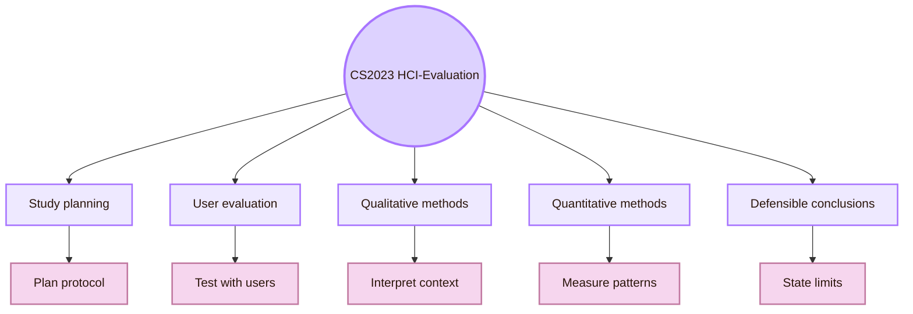
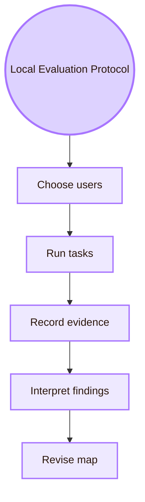
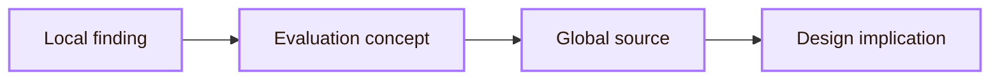
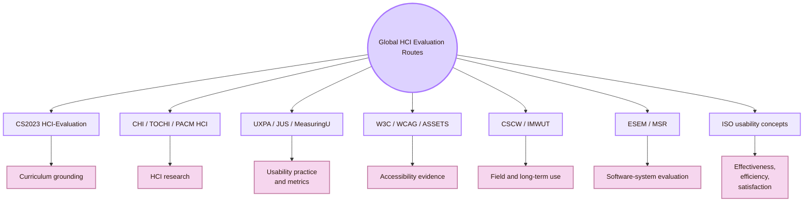
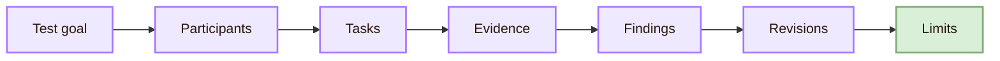

![[natural.jpg|1000]]
# Local and Global

> [!abstract] Local and Global Evaluation Guide
> This page explains how **HCI-Evaluation: Evaluating the Design** can be studied in a local university study and connected to global HCI evaluation practice. The page is written for students who want to test real interactive systems, report evidence carefully, and build a credible academic or portfolio study.

Global means the wider HCI evaluation field: CS2023 HCI-Evaluation, usability testing, accessibility evaluation, empirical methods, validity, metrics, CHI, ASSETS, CSCW, ESEM, ISO usability concepts, W3C/WCAG, and applied UX research practice.

> [!quote] Scale rule
> A local evaluation is useful when it clearly states what was tested, who tested it, what evidence was collected, and how far the conclusion can travel.

## Local and global structure

## CS2023 grounding

CS2023 places **Evaluating the Design** inside the HCI knowledge area. The relevant outcomes include comparing evaluation methods, using qualitative and quantitative methods, planning usability evaluations, conducting evaluations, and drawing defensible conclusions from the study design.

## Local anchor: UVT Faculty of Informatics

The careful local question is not:

> “Does UVT have a dedicated HCI evaluation lab?”

The safer question is:

> “Which UVT Computer Science routes can help a student think about evidence, usability, software tools, AI systems, and local evaluation?”

## Local UVT evaluation routes

## Local people and evaluation links

Use this table as a route map. It is not a list of official HCI evaluation supervisors. Verify current roles, courses, availability, and research fit through official UVT pages before contacting anyone.

| Local person / route | Public UVT information | How it can support evaluation thinking |
|---|---|---|
| Teodor Florin Fortiș | Workflows, web technologies, ontologies | Useful for evaluating workflow systems, information structure, and web-like tools |
| Cristina Mîndruță | Workflows, web services, ontologies | Useful for evaluating information architecture, service-based systems, and structured workflows |
| Dana Petcu | Distributed computing, grid computing, cloud computing, parallel computing | Useful for evaluating infrastructure, distributed systems, reliability, and system behaviour |
| Ciprian Pungilă | Intelligent systems, anomaly detection | Useful for evaluating intelligent systems, alerts, errors, and system behaviour |
| Marc Frîncu | Cloud computing, task scheduling, big data | Useful for data-heavy system evaluation, reliability, and performance contexts |
| Gabriel Iuhasz | Multi-agent systems, machine learning, cloud computing, strategic games | Useful for evaluating intelligent, multi-agent, and cloud-supported systems |
| Daniela Zaharie | Evolutionary computing, machine learning, data mining | Useful for evaluation metrics, optimisation, modelling, and data-driven evidence |
| Darian Onchiș | Signal and image processing, bioinformatics, machine learning | Useful for evaluating prediction systems, uncertainty, and human interpretation of outputs |
| Sebastian Ștefănigă | Image processing, high-performance computing, medical informatics, machine learning | Useful for evaluating medical, visual, and high-stakes computing contexts |
| Todor Ivașcu | Multi-agent systems, e-health systems, machine learning | Useful for evaluating health monitoring, trust, and human-context systems |
| Alexandru Vlasiu | Machine learning, data mining, applications in psychology | Useful for connecting evaluation to behaviour and psychological data |
| Bogdan Butunoi | Computational intelligence, prediction models, diabetes monitoring systems | Useful for evaluating health monitoring and user-facing prediction contexts |
| Codruț Chiș | Virtual reality | Useful for evaluating VR interaction, presence, comfort, and spatial usability |
| Roxana Dogaru | Knowledge discovery, medical data analysis | Useful for evaluation in medical data and decision-support contexts |

## What to evaluate locally

## Practical local evaluation protocol

## Local finding to global interpretation

## Global routes for students

Global sources give the local evaluation a recognised method structure. They help students find papers, communities, standards, and career-relevant practices.

- **CS2023 HCI-Evaluation:** Gives the official computer science curriculum basis
- **CHI / TOCHI / PACM HCI:** Gives broad HCI evaluation research and archival literature
- **UXPA / Journal of Usability Studies / MeasuringU:** Gives applied usability methods and metrics used by practitioners
- **W3C WAI / WCAG / ASSETS:** Gives accessibility evaluation standards and research routes
- **CSCW / IMWUT:** Gives field, social, collaborative, ubiquitous, and long-term evaluation routes
- **ESEM / MSR:** Gives empirical software engineering routes for evaluating tools, repositories, and workflows
- **ISO 9241-11 and ISO 9241-210:** Give usability and human-centred design concepts for context of use and evaluation

## Career directions connected to this page

## What to save for a portfolio

## Local and global comparison

## Contact protocol

For **Evaluating the Design**, local contact should ask about evidence and method. Avoid vague questions like “Is my study good?”

## Minimal evaluation report structure

Use this structure when turning the local test into a report.

## Academic anchors

| Route | Source |
|---|---|
| CS2023 HCI Evaluation basis | [CS2023 HCI SIGCSE 2022 version](https://csed.acm.org/knowledge-areas-human-computer-interaction-hci-sigcse-2022-version/) |
| CS2023 Body of Knowledge | [CS2023 Body of Knowledge PDF](https://csed.acm.org/wp-content/uploads/2024/04/3.1-Body-of-Knowledge-1.pdf) |
| UVT Faculty of Informatics | [Faculty of Informatics](https://info.uvt.ro/en/) |
| UVT Faculty departments | [Faculty of Informatics Departments](https://info.uvt.ro/en/departamente/) |
| UVT CSAI Department | [Department of Computational Sciences and Artificial Intelligence](https://info.uvt.ro/en/departamente/csai/) |
| UVT DTSE Department | [Department of Digital Technologies and Software Engineering](https://info.uvt.ro/en/departamente/dtse/) |
| UVT research center | [Research Center in Computer Science](https://research.info.uvt.ro/) |
| UVT researcher routes | [UVT Informatics Researchers](https://research.info.uvt.ro/researchers/) |
| UVT AI and ML research route | [Artificial Intelligence and Machine Learning](https://research.info.uvt.ro/artificial-intelligence-and-machine-learning/) |
| Usability and context of use | [ISO 9241-11](https://www.iso.org/standard/63500.html) |
| Human-centred design | [ISO 9241-210](https://www.iso.org/standard/77520.html) |
| Human-centred design summary | [NIST Human Centered Design](https://www.nist.gov/itl/iad/human-centered-technologies/human-factors-human-centered-design) |
| Applied usability testing | [NN/g: Usability Testing 101](https://www.nngroup.com/articles/usability-testing-101/) |
| UX metrics | [MeasuringU](https://measuringu.com/) |
| Accessibility evaluation overview | [W3C: Evaluating Web Accessibility Overview](https://www.w3.org/WAI/test-evaluate/) |
| Accessibility standard | [WCAG 2.2](https://www.w3.org/TR/WCAG22/) |
| Core HCI evaluation venue | [ACM CHI](https://dl.acm.org/conference/chi) |
| Accessibility research venue | [ACM ASSETS](https://dl.acm.org/conference/assets) |
| Empirical software engineering venue | [ESEM](https://www.esem-conferences.org/) |
| Field and social evaluation venue | [ACM CSCW](https://cscw.acm.org/) |
| HCI archival journal | [ACM TOCHI](https://dl.acm.org/journal/tochi) |
| HCI proceedings journal | [PACM HCI](https://dl.acm.org/journal/pacmhci) |

^local-global-evaluating-design-end
