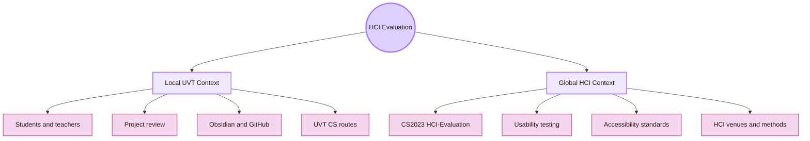
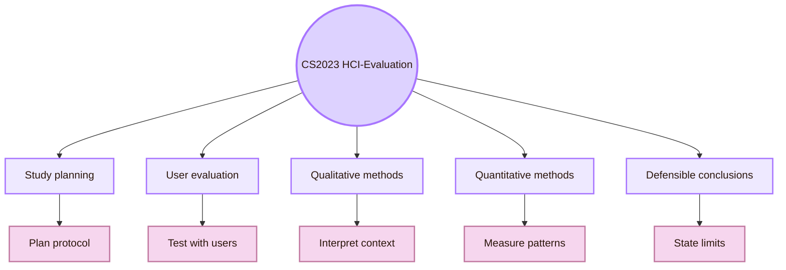
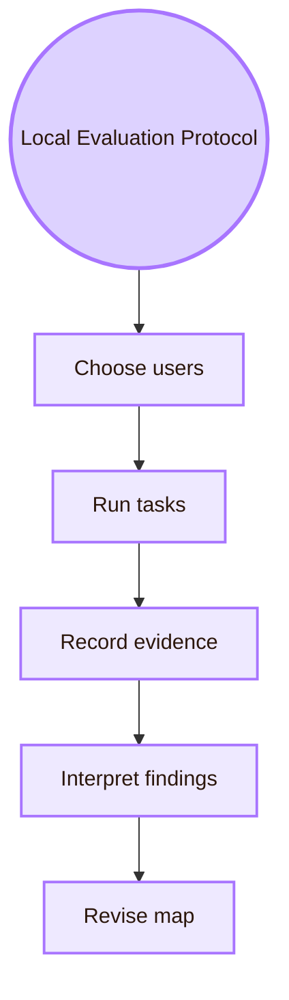
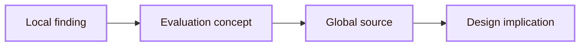
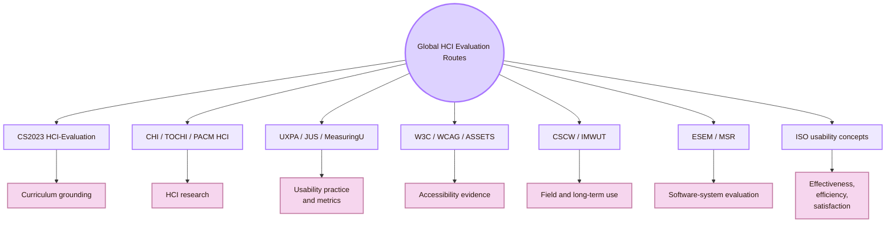
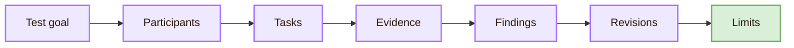

![[colos.jpg|1000]]
# Local and Global

Back to [[Overview|The Observation Chamber]].

> [!abstract] Local and Global Evaluation Guide
> This page explains how **HCI-Evaluation: Evaluating the Design** can be studied in a local university project and connected to global HCI evaluation practice. The page is written for students who want to test real interactive systems, report evidence carefully, and build a credible academic or portfolio project.

The official CS2023 label is **HCI-Evaluation: Evaluating the Design**.  
The project nickname is **Observation Chamber**. Use it only as a light orientation label.  

Local means the real context around this project: **Universitatea de Vest din Timișoara**, the **Faculty of Informatics**, students, teachers, classroom expectations, Obsidian, GitHub, local devices, and local research routes.

Global means the wider HCI evaluation field: CS2023 HCI-Evaluation, usability testing, accessibility evaluation, empirical methods, validity, metrics, CHI, ASSETS, CSCW, ESEM, ISO usability concepts, W3C/WCAG, and applied UX research practice.

> [!quote] Scale rule
> A local evaluation is useful when it clearly states what was tested, who tested it, what evidence was collected, and how far the conclusion can travel.

## Why this page matters

| Student goal | How this page helps |
|---|---|
| Understand HCI evaluation | Connects local testing to recognised HCI methods |
| Improve a real project | Gives concrete tests for the Obsidian and GitHub HCI map |
| Prepare academic work | Connects CS2023, validity, accessibility, and research methods |
| Build a portfolio | Shows what evidence to save: protocol, task sheet, issue log, findings, and revisions |
| Explore careers | Links evaluation to UX research, usability testing, accessibility, analytics, software-tool evaluation, and human-AI evaluation |
| Contact people responsibly | Gives safer questions for asking about methods, courses, and research routes |

## Local and global structure

| Scale | Meaning for this project | Evaluation question |
|---|---|---|
| Local UVT | The professor, students, faculty context, software setup, GitHub workflow, and local academic expectations | Does the HCI map work for the people and conditions that will actually use or judge it? |
| Local evidence | Data from classmates, UVT students, professor review, clone tests, and local accessibility checks | What happened in this specific environment? |
| Global evidence | CS2023, usability standards, accessibility standards, HCI venues, and published method guidance | How should the local results be interpreted? |

## CS2023 grounding

CS2023 places **Evaluating the Design** inside the HCI knowledge area. The relevant outcomes include comparing evaluation methods, using qualitative and quantitative methods, planning usability evaluations, conducting evaluations, and drawing defensible conclusions from the study design.

| CS2023 topic | Local UVT interpretation | Global HCI interpretation |
|---|---|---|
| Study planning | Plan the test before showing the HCI map to users or a professor | Define protocol, tasks, consent, metrics, analysis, and limits |
| Usability testing | Ask students to navigate the map and explain page meanings | Use task-based evidence and observation |
| Heuristic evaluation | Ask a teacher or advanced student to inspect clarity, source use, and navigation | Use inspection methods and severity ratings |
| Qualitative methods | Interview students about confusion, expectations, and vocabulary | Interpret context without turning one quote into a general law |
| Quantitative methods | Count success, wrong turns, time, errors, confidence, and ratings | Use metrics carefully, especially with small samples |
| Accessibility evaluation | Test contrast, keyboard navigation, headings, readable diagrams, and page structure | Use W3C/WCAG as a baseline |
| Defensible conclusions | State what the local test supports and what it does not support | Connect findings to validity and generalisation limits |

## Local anchor: UVT Faculty of Informatics

The local institution for this page is the **Faculty of Informatics at UVT**. The faculty publicly lists two departments that are useful for connecting this project to Computer Science:

| Local department | Why it matters for HCI evaluation |
|---|---|
| Department of Computational Sciences and Artificial Intelligence | Connects evaluation to AI, recommender systems, medical informatics, anomaly detection, explainability, uncertainty, monitoring systems, and evaluation of intelligent systems |
| Department of Digital Technologies and Software Engineering | Connects evaluation to software tools, workflows, distributed systems, cloud systems, implementation quality, GitHub workflows, and evaluation of technical systems |

The careful local question is not:

> “Does UVT have a dedicated HCI evaluation lab?”

The safer question is:

> “Which UVT Computer Science routes can help a student think about evidence, usability, software tools, AI systems, and local evaluation?”

## Local UVT evaluation routes

| Local route | Public UVT basis | Evaluation connection |
|---|---|---|
| Student and classroom evaluation | The project is built in a UVT learning context | Test navigation, comprehension, source credibility, and academic fit |
| Software workflow evaluation | Research routes include workflows, web technologies, cloud computing, distributed systems, and software systems | Test whether the vault, GitHub repository, and setup workflow work on another machine |
| AI and ML evaluation | UVT research routes include recommender systems, anomaly detection, prediction, uncertainty, and explainable AI | Connect evaluation to metrics, model behaviour, uncertainty, recommendation quality, and trust |
| Health and human-context systems | UVT AI and ML routes include health monitoring, healthcare systems, medical data, and e-health systems | Study stricter evaluation, human interpretation, trust, and user safety |
| Psychology-related applications | UVT researcher routes include data and ML work connected to psychology applications | Connect technical evaluation to human behaviour and user characteristics |
| Virtual reality | UVT researcher routes include virtual reality | Connect evaluation to presence, comfort, attention, spatial usability, and embodied interaction |
| Teaching with technology | Local publications and routes can connect computing to teaching contexts | Connect evaluation to educational technology, learning, comprehension, and adoption |

## Local people and evaluation links

Use this table as a route map. It is not a list of official HCI evaluation supervisors. Verify current roles, courses, availability, and research fit through official UVT pages before contacting anyone.

| Local person / route | Public UVT information | How it can support evaluation thinking |
|---|---|---|
| Teodor Florin Fortiș | Workflows, web technologies, ontologies | Useful for evaluating workflow systems, information structure, and web-like tools |
| Cristina Mîndruță | Workflows, web services, ontologies | Useful for evaluating information architecture, service-based systems, and structured workflows |
| Dana Petcu | Distributed computing, grid computing, cloud computing, parallel computing | Useful for evaluating infrastructure, distributed systems, reliability, and system behaviour |
| Ciprian Pungilă | Intelligent systems, anomaly detection | Useful for evaluating intelligent systems, alerts, errors, and system behaviour |
| Marc Frîncu | Cloud computing, task scheduling, big data | Useful for data-heavy system evaluation, reliability, and performance contexts |
| Gabriel Iuhasz | Multi-agent systems, machine learning, cloud computing, strategic games | Useful for evaluating intelligent, multi-agent, and cloud-supported systems |
| Daniela Zaharie | Evolutionary computing, machine learning, data mining | Useful for evaluation metrics, optimisation, modelling, and data-driven evidence |
| Darian Onchiș | Signal and image processing, bioinformatics, machine learning | Useful for evaluating prediction systems, uncertainty, and human interpretation of outputs |
| Sebastian Ștefănigă | Image processing, high-performance computing, medical informatics, machine learning | Useful for evaluating medical, visual, and high-stakes computing contexts |
| Todor Ivașcu | Multi-agent systems, e-health systems, machine learning | Useful for evaluating health monitoring, trust, and human-context systems |
| Alexandru Vlasiu | Machine learning, data mining, applications in psychology | Useful for connecting evaluation to behaviour and psychological data |
| Bogdan Butunoi | Computational intelligence, prediction models, diabetes monitoring systems | Useful for evaluating health monitoring and user-facing prediction contexts |
| Codruț Chiș | Virtual reality | Useful for evaluating VR interaction, presence, comfort, and spatial usability |
| Roxana Dogaru | Knowledge discovery, medical data analysis | Useful for evaluation in medical data and decision-support contexts |

## What to evaluate locally

Local evaluation should start with the system that exists: the HCI vault, its GitHub repository, Obsidian appearance, diagrams, sources, and academic presentation.

| Local evaluation target | What to test |
|---|---|
| Obsidian vault navigation | Can UVT students find the right HCI room and understand its CS2023 label? |
| Project names | Do users understand “Mind Library,” “Interface Forge,” and “Observation Chamber” after reading the page? |
| Professor review | Does the structure, wording, and source grounding look academically credible? |
| GitHub clone workflow | Can another user clone or download the repository and open the vault correctly? |
| CSS/theme portability | Does the theme apply, or at least remain readable, on another machine? |
| Mermaid diagrams | Are diagrams readable, useful, and visually consistent? |
| Source links | Can users identify official CS2023 and trusted HCI sources? |
| Accessibility | Can users navigate by keyboard, read contrast, and understand headings? |
| Local infrastructure | Does the vault work on the devices and software likely to be used by the student or professor? |

## Practical local evaluation protocol

| Protocol step | Local action |
|---|---|
| Recruit | Ask three to five students or classmates to test the map |
| Task one | Find the room that studies users |
| Task two | Find the room that builds interfaces |
| Task three | Find the room that evaluates designs |
| Task four | Find one official CS2023 source |
| Task five | Open the vault from GitHub or a copied folder |
| Evidence | Record success, wrong turns, time, confusion, quotes, and confidence |
| Accessibility check | Test keyboard movement, headings, font size, contrast, and diagram readability |

## Local finding to global interpretation

| Local finding | Global evaluation concept | Design implication |
|---|---|---|
| Students confuse project names | Construct validity and comprehension testing | Add real CS2023 labels and short explanation tasks |
| Students find pages slowly | Efficiency and navigation usability | Repair hierarchy, links, headings, and page routes |
| Professor asks for sources | Credibility and defensible conclusions | Add official CS2023 and trusted HCI anchors |
| Theme fails after clone | Context of use and system reliability | Test on another machine and document setup |
| Diagrams are liked but not understood | Metric mismatch | Measure comprehension, not only preference |
| Keyboard navigation is difficult | Accessibility evaluation | Add heading, focus, keyboard, and contrast checks |
| Users complete a task but feel uncertain | Satisfaction and confidence | Add post-task confidence ratings and a short debrief |
| GitHub viewer differs from Obsidian | External validity and platform variation | State the supported viewing environment and test alternatives |

## Global routes for students

Global sources give the local evaluation a recognised method structure. They help students find papers, communities, standards, and career-relevant practices.

| Global route | Why it matters for a student |
|---|---|
| CS2023 HCI-Evaluation | Gives the official computer science curriculum basis |
| CHI / TOCHI / PACM HCI | Gives broad HCI evaluation research and archival literature |
| UXPA / Journal of Usability Studies / MeasuringU | Gives applied usability methods and metrics used by practitioners |
| W3C WAI / WCAG / ASSETS | Gives accessibility evaluation standards and research routes |
| CSCW / IMWUT | Gives field, social, collaborative, ubiquitous, and long-term evaluation routes |
| ESEM / MSR | Gives empirical software engineering routes for evaluating tools, repositories, and workflows |
| ISO 9241-11 and ISO 9241-210 | Give usability and human-centred design concepts for context of use and evaluation |

## Career directions connected to this page

| Career or academic route | Skills to build | Portfolio evidence |
|---|---|---|
| UX researcher | Usability testing, interviews, task design, synthesis, reporting | Protocol, task script, findings report, design recommendations |
| Usability analyst | Metrics, task success, time, errors, severity rating | Before-and-after usability report and issue log |
| Accessibility evaluator | WCAG, keyboard testing, screen reader basics, contrast, semantic structure | Accessibility checklist, issue report, repair notes |
| Product analyst | Events, funnels, cohorts, retention, ethical analytics | Event plan and interpretation limits |
| HCI researcher | Study design, validity, mixed methods, literature review | Research question, method justification, small empirical study |
| Empirical software engineering researcher | Tool evaluation, repository analysis, reproducibility | GitHub clone test, setup log, artifact package |
| Human-AI evaluation researcher | Trust, uncertainty, correctness, explainability, verification | AI-output evaluation protocol and source-check tasks |
| EdTech evaluator | Learning tasks, comprehension, recall, classroom use | Concept test, explanation task, delayed recall plan |

## What to save for a portfolio

A student should not only say “I made an HCI map.” They should save evidence that shows method skill.

| Portfolio artifact | Why it matters |
|---|---|
| Evaluation protocol | Shows that you can plan a study |
| Participant task sheet | Shows that you can write goal-based tasks |
| Observation form | Shows that you can collect behavioural evidence |
| Issue log | Shows that you can turn observations into repair priorities |
| Accessibility checklist | Shows that inclusion is part of evaluation |
| GitHub clone/setup test | Shows that you can evaluate system portability |
| Before/after screenshots | Shows design iteration |
| Short findings report | Shows that you can write defensible conclusions |

## Local and global comparison

| Dimension | Local UVT evaluation | Global HCI evaluation |
|---|---|---|
| Institution | UVT Faculty of Informatics, local project context, local software setup | International HCI, UX research, software engineering, accessibility, and human factors communities |
| Users | UVT students, classmates, professor, local GitHub viewers | Learners, researchers, practitioners, disabled users, cross-cultural users, deployed-system users |
| Methods | Local usability test, professor review, clone test, accessibility check | Usability testing, field studies, experiments, heuristic evaluation, analytics, WCAG evaluation |
| Evidence | Task success, wrong turns, confusion, quotes, professor feedback, local setup results | Peer-reviewed research, standards, validated instruments, published method guidance |
| Best use | Start with local formative evidence | Interpret it through global methods and state limits clearly |

## Contact protocol

For **Evaluating the Design**, local contact should ask about evidence and method. Avoid vague questions like “Is my project good?”

| Local route | Better question |
|---|---|
| Software engineering / workflows | “How should I evaluate whether this GitHub/Obsidian workflow is maintainable and reproducible?” |
| AI / ML | “What metrics or evaluation questions matter when a system produces predictions or recommendations?” |
| E-health / medical informatics | “What makes evaluation stricter when a system affects health or monitoring?” |
| VR route | “What would be important to evaluate in an immersive version of this HCI map?” |
| Teaching technology route | “How can I evaluate whether this map helps students learn, not just navigate?” |

> [!example] Local UVT evaluation email
> Dear Professor [Name],  
> I am building a CS2023-based HCI map for a student project. The section I am improving is **HCI-Evaluation: Evaluating the Design**. I want to connect global HCI evaluation methods to the local UVT Computer Science context.  
>  
> I saw that your public UVT route connects to [software workflows / AI / health systems / VR / teaching technology]. Could you recommend one local course, project, seminar, or reading direction that would help me evaluate this project more rigorously?  
>  
> Best regards,  
> [Name]

## Application to the HCI map

| Map decision | Local evaluation | Global interpretation |
|---|---|---|
| Room names | Ask students what each name means | Compare with mental models and information scent |
| CS2023 labels | Ask a professor whether the official mapping is visible | Compare with CS2023 HCI knowledge units |
| Diagrams | Ask users to explain a diagram after reading it | Compare with visual hierarchy and cognitive-load concepts |
| GitHub sharing | Clone on another local computer | Compare with reproducibility and system portability principles |
| Theme | Test on professor or student machines | Compare with accessibility and platform variation requirements |
| Sources | Ask whether sources seem credible | Compare with global venue and standards routes |
| Learning value | Ask students to answer short concept questions | Compare with evaluation methods for comprehension and learning |

## Minimal evaluation report structure

Use this structure when turning the local test into a report.

| Report part | What to write |
|---|---|
| Goal | What part of the map was tested |
| Participants | Who tested it and why they were relevant |
| Tasks | What each participant had to do |
| Evidence | Success, time, wrong turns, comments, ratings, and screenshots |
| Findings | The main problems, grouped by severity |
| Revisions | What was changed after the test |

## Academic anchors

| Route | Source |
|---|---|
| CS2023 HCI Evaluation basis | [CS2023 HCI SIGCSE 2022 version](https://csed.acm.org/knowledge-areas-human-computer-interaction-hci-sigcse-2022-version/) |
| CS2023 Body of Knowledge | [CS2023 Body of Knowledge PDF](https://csed.acm.org/wp-content/uploads/2024/04/3.1-Body-of-Knowledge-1.pdf) |
| UVT Faculty of Informatics | [Faculty of Informatics](https://info.uvt.ro/en/) |
| UVT Faculty departments | [Faculty of Informatics Departments](https://info.uvt.ro/en/departamente/) |
| UVT CSAI Department | [Department of Computational Sciences and Artificial Intelligence](https://info.uvt.ro/en/departamente/csai/) |
| UVT DTSE Department | [Department of Digital Technologies and Software Engineering](https://info.uvt.ro/en/departamente/dtse/) |
| UVT research center | [Research Center in Computer Science](https://research.info.uvt.ro/) |
| UVT researcher routes | [UVT Informatics Researchers](https://research.info.uvt.ro/researchers/) |
| UVT AI and ML research route | [Artificial Intelligence and Machine Learning](https://research.info.uvt.ro/artificial-intelligence-and-machine-learning/) |
| Usability and context of use | [ISO 9241-11](https://www.iso.org/standard/63500.html) |
| Human-centred design | [ISO 9241-210](https://www.iso.org/standard/77520.html) |
| Human-centred design summary | [NIST Human Centered Design](https://www.nist.gov/itl/iad/human-centered-technologies/human-factors-human-centered-design) |
| Applied usability testing | [NN/g: Usability Testing 101](https://www.nngroup.com/articles/usability-testing-101/) |
| UX metrics | [MeasuringU](https://measuringu.com/) |
| Accessibility evaluation overview | [W3C: Evaluating Web Accessibility Overview](https://www.w3.org/WAI/test-evaluate/) |
| Accessibility standard | [WCAG 2.2](https://www.w3.org/TR/WCAG22/) |
| Core HCI evaluation venue | [ACM CHI](https://dl.acm.org/conference/chi) |
| Accessibility research venue | [ACM ASSETS](https://dl.acm.org/conference/assets) |
| Empirical software engineering venue | [ESEM](https://www.esem-conferences.org/) |
| Field and social evaluation venue | [ACM CSCW](https://cscw.acm.org/) |
| HCI archival journal | [ACM TOCHI](https://dl.acm.org/journal/tochi) |
| HCI proceedings journal | [PACM HCI](https://dl.acm.org/journal/pacmhci) |

^local-global-evaluating-design-end
