![[problemo.gif|1000]]
# Open Problems

> [!abstract] Open Questions in Evaluation
> This page explains unresolved problems in **CS2023 HCI-Evaluation: Evaluating the Design**. It focuses on the hard parts of proving that a design works: validity, evidence quality, metric choice, accessibility, reproducibility, long-term use, and evaluation of AI-supported systems.

In practical terms, this page asks:

The main student skill is **bounded interpretation**. You should learn to say what your evaluation showed, what it did not show, and what the next test should check.

## Problem map

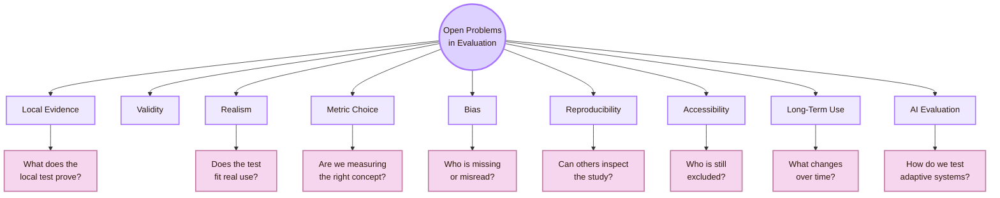

## CS2023 grounding

CS2023 places **Evaluating the Design** inside the HCI knowledge area. The topic includes evaluation with users, formative and summative assessment, usability testing, qualitative and quantitative methods, observation, interviews, surveys, focus groups, study planning, hypothesis design, heuristic evaluation, and defensible conclusions.

The open problems begin when these normal skills are applied to messy real projects.

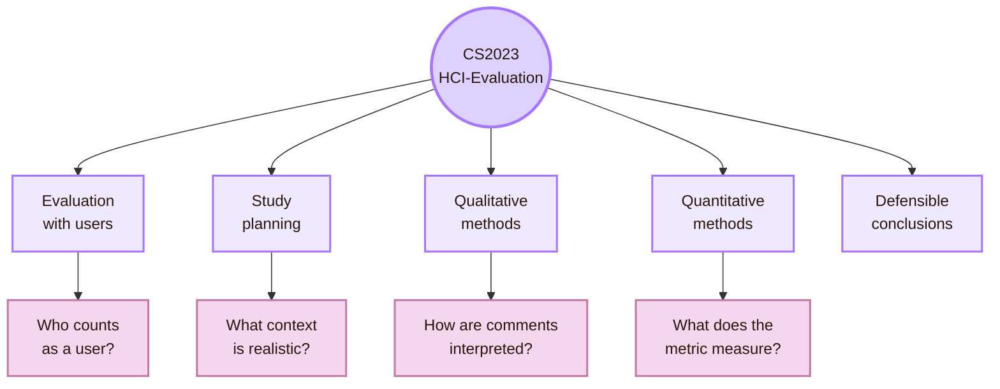

## Problem 1: Local evidence

Local evidence is useful because it finds real problems in the actual setting. It is limited because the sample and context are narrow.

## Local UVT research routes

UVT Informatics pages can support evaluation thinking through Computer Science routes. These routes should be described carefully. They are not automatically HCI evaluation labs unless an official page says so. They are local routes that connect to software, AI, infrastructure, data, health systems, learning tools, and virtual environments.

- **DTSE and CSAI departments:** public basis: UVT Faculty of Informatics department pages; evaluation connection: Local structure for software systems, AI, digital technologies, and technical evaluation
- **Workflows, web technologies, and ontologies:** public basis: UVT researcher listings; evaluation connection: Evaluating whether the HCI vault works as an information and workflow system
- **Distributed, cloud, grid, and high-performance computing:** public basis: UVT research routes; evaluation connection: Evaluating portability, setup, reliability, latency, and infrastructure conditions
- **Machine learning, data mining, and recommender systems:** public basis: UVT AI and ML routes; evaluation connection: Evaluating prediction, personalisation, uncertainty, and user trust
- **Medical informatics and e-health:** public basis: UVT researcher and publication routes; evaluation connection: Evaluating high-stakes interfaces, monitoring systems, interpretation, and safety
- **Virtual reality:** public basis: UVT researcher routes; evaluation connection: Evaluating spatial usability, presence, comfort, attention, and embodied interaction
- **Psychology-related applications:** public basis: UVT research routes connected to data and ML; evaluation connection: Connecting technical evaluation to human behaviour and user evidence
- **Trust in prediction systems:** public basis: UVT publication route; evaluation connection: Studying trust, interpretation, and reliance in AI-supported decisions

> [!important] Local route rule

## Problem 2: Validity

The core question is:

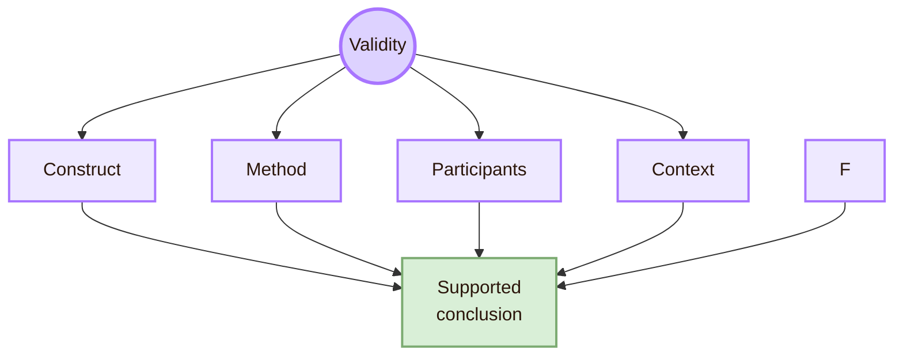

## Problem 3: Realism

Realism asks whether the study resembles the intended use situation. A highly controlled test is easier to observe. A realistic test may show messier but more relevant problems.

## Problem 4: Metric choice

HCI evaluation often measures what is easy: task success, time, clicks, errors, ratings, and page visits. These measures can be useful. They can also miss understanding, trust, effort, uncertainty, and exclusion.

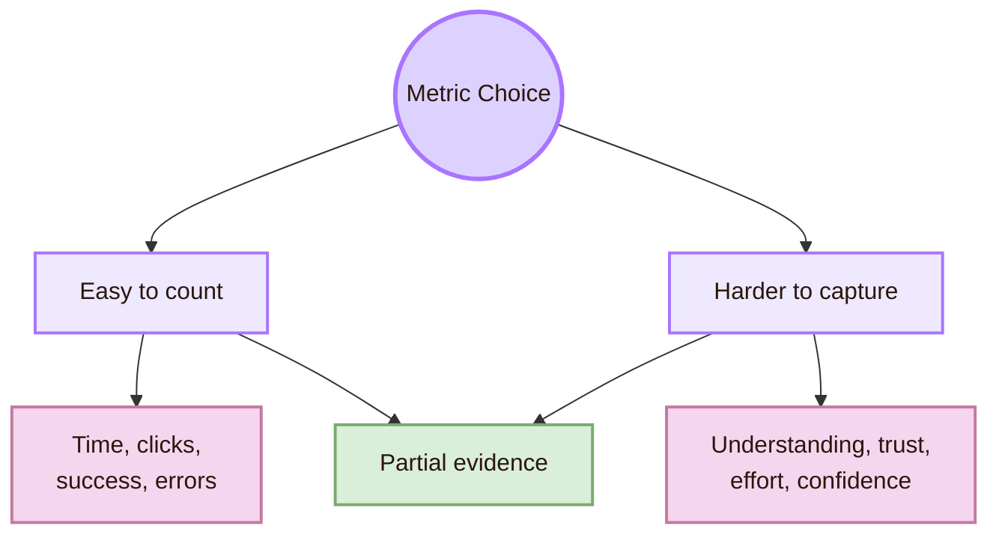

- **Task success:** what it can show: Whether users completed a task; what it can hide: Excessive effort, guessing, or low confidence
- **Time on task:** what it can show: Speed or efficiency; what it can hide: Careful reading, confusion, or fear of making mistakes
- **Error count:** what it can show: Visible mistakes; what it can hide: Hesitation, near-errors, and silent uncertainty
- **Click count:** what it can show: Path length; what it can hide: Whether the user understood the content
- **SUS or rating score:** what it can show: Perceived usability; what it can hide: Exact causes of difficulty
- **Workload score:** what it can show: Felt effort; what it can hide: Which page element caused the effort
- **Analytics:** what it can show: Behavioural traces at scale; what it can hide: Motivation, comprehension, and missing users

## Problem 5: Bias

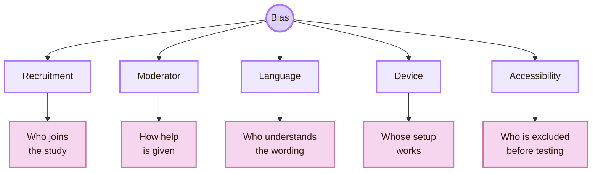

## Problem 6: Reproducibility

HCI studies are hard to reproduce because they depend on people, context, prototypes, versions, task wording, moderator behaviour, and analysis choices. A small study can still improve reproducibility by saving the right artifacts.

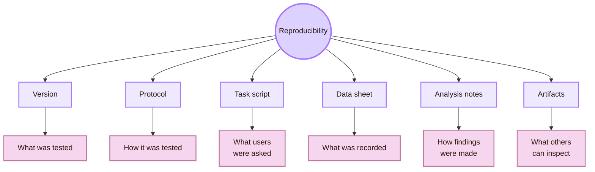

- **Git commit hash:** Identifies the exact vault version tested
- **Task sheet:** Shows what participants were asked to do
- **Moderator script:** Shows how instructions and help were standardised
- **Observation sheet:** Shows what evidence was collected
- **Issue log:** Shows how problems were recorded and prioritised
- **Analysis notes:** Shows how observations became findings
- **Accessibility checklist:** Shows what access checks were performed
- **Screenshots or short recordings:** Show the tested interface state, when ethical and allowed

ACM artifact badging and open-science practices support this principle. They encourage researchers to make artifacts available, evaluated, or validated when the community can inspect them.

## Problem 7: Accessibility evidence

Accessibility evaluation is difficult because no single method is enough. Automated tools find some problems. Manual inspection finds others. Assistive technology testing can reveal semantic and interaction barriers. Users with disabilities can reveal barriers that tools and checklists miss.

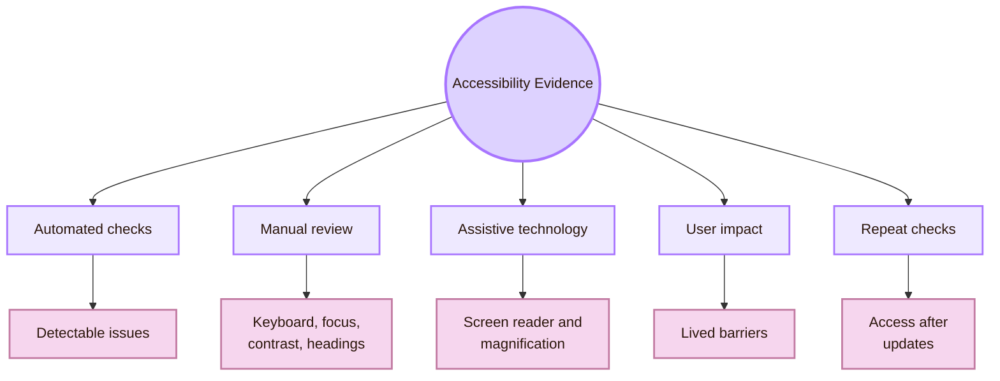

## Problem 8: Long-term use

Many student evaluations are short. Users perform a few tasks once. Learning systems need more evidence because usefulness can change after novelty fades.

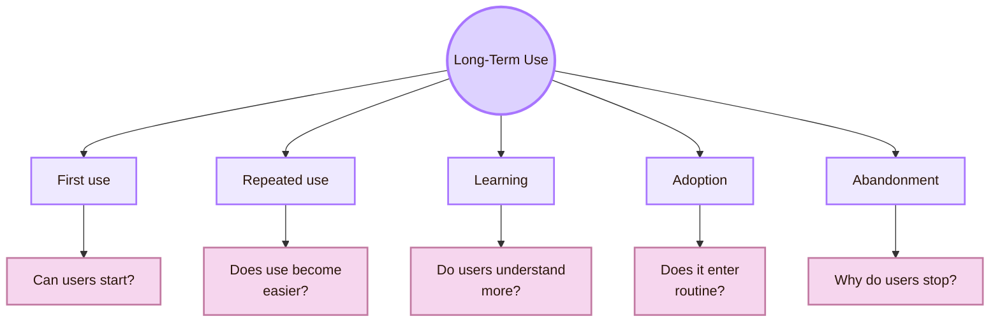

## Problem 9: AI-mediated evaluation

Classical usability testing still matters, but AI evaluation also needs checks for correctness, uncertainty, transparency, user control, bias, reproducibility, and recovery from errors.

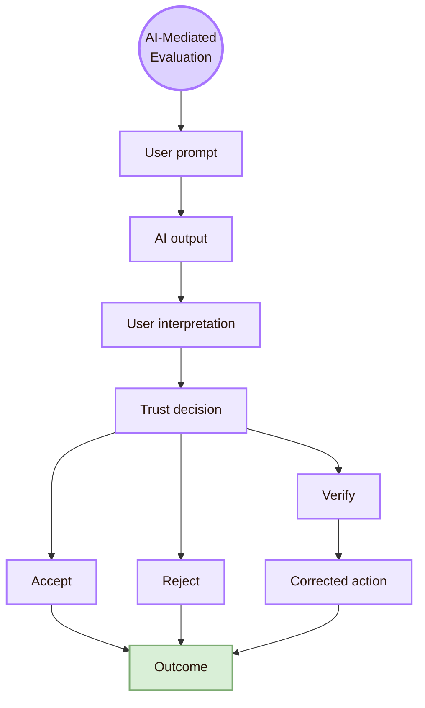

- **Output variability:** The same task may produce different answers
- **Hallucination:** Users may not detect false but fluent information
- **Trust calibration:** Users may overtrust or undertrust the system
- **Explanation quality:** Explanations can sound convincing but weakly supported
- **Bias:** Output quality can vary by language, user group, or topic
- **Reproducibility:** Prompts, model versions, settings, and sources change
- **Drift:** The system or user behaviour changes over time
- **Accountability:** Responsibility for wrong output can become unclear

## Problem 10: Mixed methods

Mixed methods can make an evaluation stronger because they combine measurable patterns with explanation. They can also become weak if the study collects numbers and comments but does not connect them.

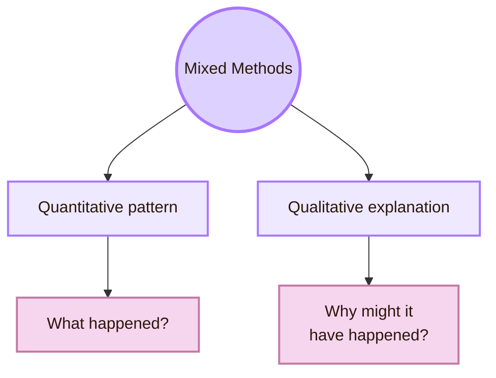

- **Collecting random comments after tasks:** Writing interview questions that explain task failures
- **Reporting time and quotes separately:** Linking time, wrong turns, and user explanations
- **Using ratings without interpretation:** Explaining what the rating can and cannot show
- **Treating one quote as proof:** Using quotes to explain patterns
- **Ignoring contradictions:** Investigating why numbers and comments disagree

## Problem 11: Severity and prioritisation

Evaluation usually finds more problems than can be fixed at once. A useful report must prioritise issues. Severity should not be based only on the researcher’s personal preference.

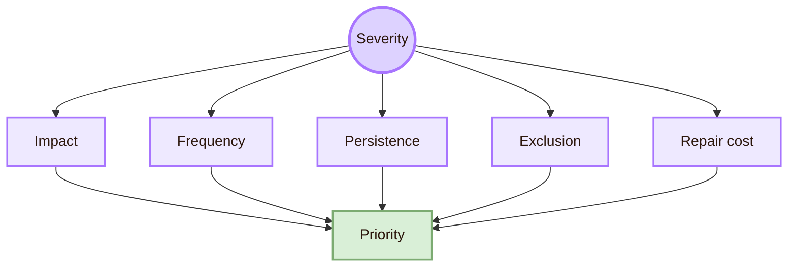

- **Impact:** Does the issue block the task or slow it down?
- **Frequency:** How many users encountered it?
- **Persistence:** Can users recover, or does the issue continue?
- **Exclusion:** Does the issue prevent a group from participating?
- **Confidence damage:** Does it make users distrust the system?
- **Repair cost:** Can it be fixed quickly, or does it require structural redesign?

Accessibility-related exclusion should not be treated as minor only because few local users noticed it. Small samples often miss access barriers.

## Where to search

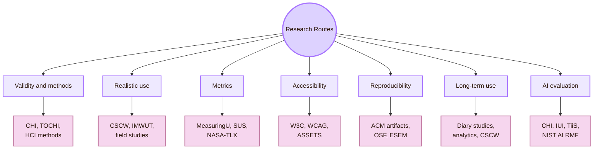

| Problem | Best source route |
|---|---|
| Validity | HCI methods literature, research-methods textbooks, CHI, TOCHI |
| Realism | Field studies, CSCW, IMWUT, ecological-validity research |
| Metric choice | MeasuringU, SUS, NASA-TLX, UX metrics, psychometrics |
| Bias and representation | Accessibility research, inclusive design, research ethics, CSCW |
| Reproducibility | ACM artifact review, OSF, ESEM, empirical methods |
| Long-term outcomes | Diary studies, longitudinal field studies, product analytics |
| Accessibility evidence | W3C WAI, WCAG-EM, ASSETS, WebAIM, user evidence |
| AI-mediated evaluation | CHI, IUI, TiiS, Microsoft HAI guidelines, NIST AI RMF |

## Academic anchors

| Route | Source |
|---|---|
| CS2023 HCI Evaluation basis | [CS2023 HCI SIGCSE 2022 version](https://csed.acm.org/knowledge-areas-human-computer-interaction-hci-sigcse-2022-version/) |
| CS2023 Body of Knowledge | [CS2023 Body of Knowledge PDF](https://csed.acm.org/wp-content/uploads/2024/04/3.1-Body-of-Knowledge-1.pdf) |
| CS2023 Knowledge Areas | [CS2023 Knowledge Areas](https://csed.acm.org/knowledge-areas/) |
| UVT Faculty of Informatics departments | [Faculty of Informatics Departments](https://info.uvt.ro/en/departamente/) |
| UVT CSAI Department | [Department of Computational Sciences and Artificial Intelligence](https://info.uvt.ro/en/departamente/csai/) |
| UVT DTSE Department | [Department of Digital Technologies and Software Engineering](https://info.uvt.ro/en/departamente/dtse/) |
| UVT research routes | [UVT Informatics Researchers](https://research.info.uvt.ro/researchers/) |
| UVT publications route | [UVT Informatics Publications](https://research.info.uvt.ro/publications/) |
| Usability and context of use | [ISO 9241-11](https://www.iso.org/obp/ui/) |
| Applied usability testing | [NN/g: Usability Testing 101](https://www.nngroup.com/articles/usability-testing-101/) |
| UX method selection | [NN/g: Which UX Research Methods to Use](https://www.nngroup.com/articles/which-ux-research-methods/) |
| Task success as a metric | [NN/g: Success Rate](https://www.nngroup.com/articles/success-rate-the-simplest-usability-metric/) |
| UX metrics | [MeasuringU Essential UX Metrics](https://measuringu.com/essential-metrics/) |
| System Usability Scale | [AHRQ SUS PDF](https://digital.ahrq.gov/sites/default/files/docs/survey/systemusabilityscale%28sus%29_comp%5B1%5D.pdf) |
| Workload measurement | [NASA Task Load Index](https://www.nasa.gov/human-systems-integration-division/nasa-task-load-index-tlx/) |
| Accessibility evaluation overview | [W3C: Evaluating Web Accessibility Overview](https://www.w3.org/WAI/test-evaluate/) |
| Accessibility conformance methodology | [WCAG-EM Overview](https://www.w3.org/WAI/test-evaluate/conformance/wcag-em/) |
| Accessibility standard | [WCAG 2.2](https://www.w3.org/TR/WCAG22/) |
| Accessibility research venue | [ACM ASSETS](https://dl.acm.org/conference/assets) |
| Core HCI venue | [ACM CHI](https://dl.acm.org/conference/chi) |
| Field and social evaluation venue | [ACM CSCW](https://cscw.acm.org/) |
| Ubiquitous and longitudinal technology studies | [ACM IMWUT](https://dl.acm.org/journal/imwut) |
| Empirical software engineering venue | [ESEM](https://www.esem-conferences.org/) |
| Reproducibility and artifacts | [ACM Software and Data Artifacts](https://www.acm.org/publications/artifacts) |
| Artifact review and badging | [ACM Artifact Review and Badging](https://www.acm.org/publications/policies/artifact-review-and-badging-current) |
| Open science infrastructure | [Open Science Framework](https://www.cos.io/products/osf) |
| Human-AI interaction guidelines | [Microsoft Guidelines for Human-AI Interaction](https://www.microsoft.com/en-us/research/project/guidelines-for-human-ai-interaction/) |
| HAX Toolkit | [Microsoft HAX Toolkit](https://www.microsoft.com/en-us/haxtoolkit/ai-guidelines/) |
| AI risk management | [NIST AI Risk Management Framework](https://www.nist.gov/itl/ai-risk-management-framework) |
| AI RMF resource center | [NIST AI RMF](https://airc.nist.gov/airmf-resources/airmf/) |

^open-problems-evaluating-design-end
