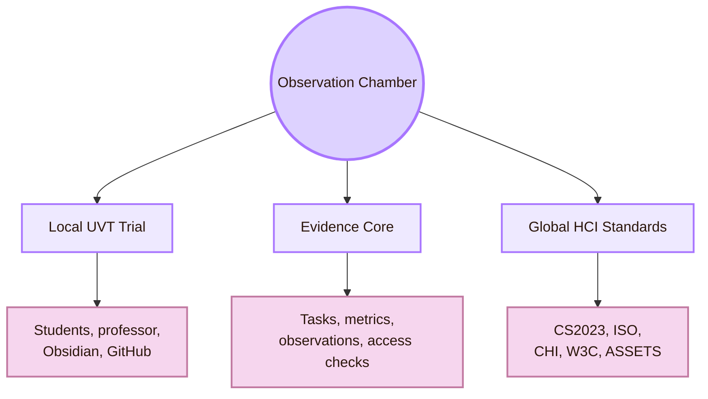
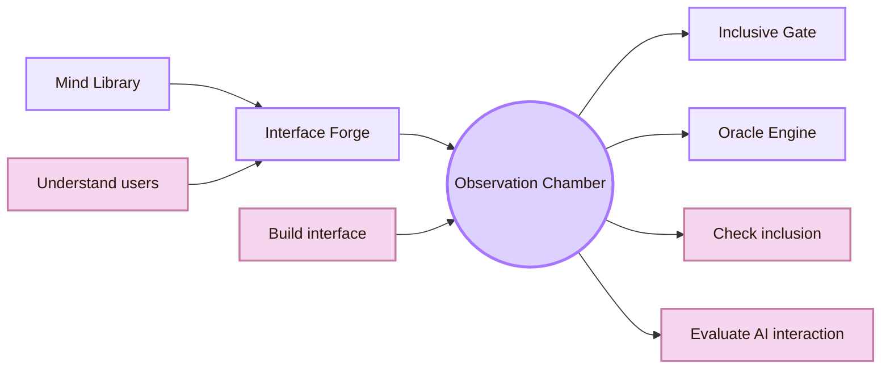
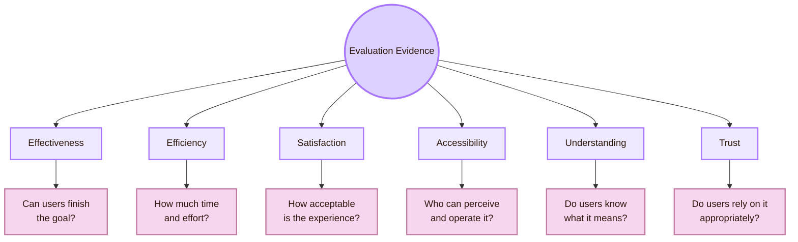
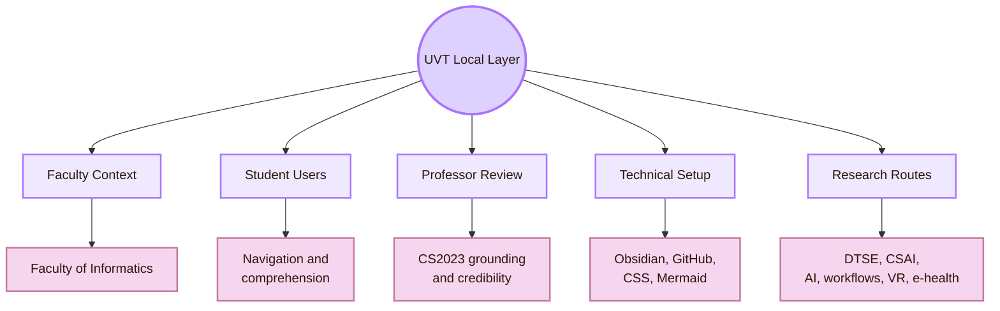
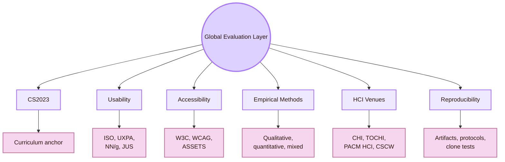
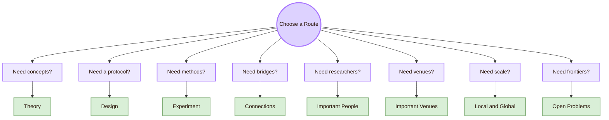
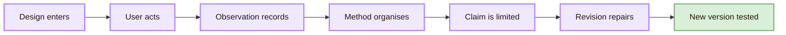
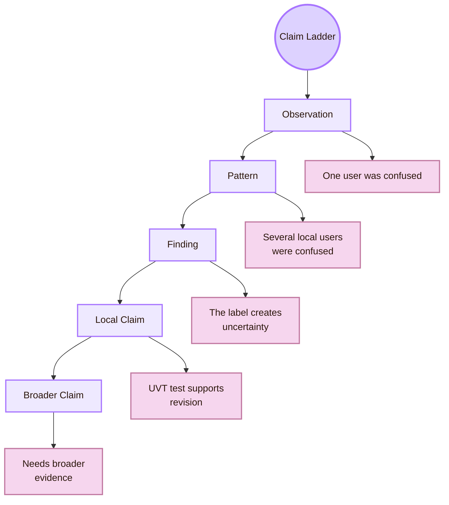
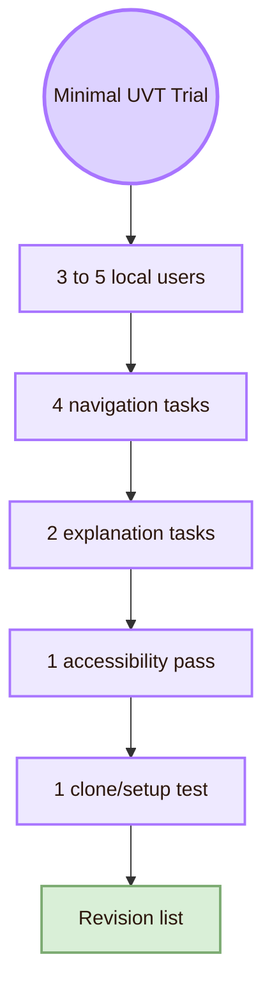
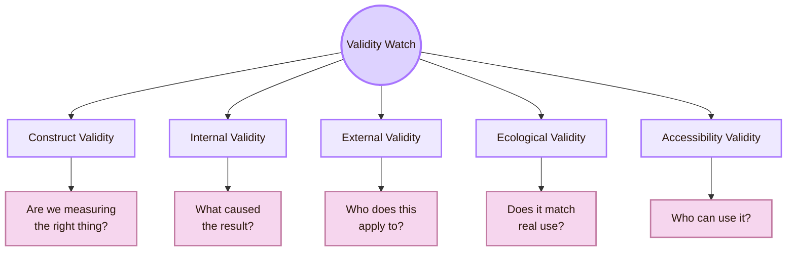

# The Observation Chamber

> [!abstract] CS2023 Evaluating the Design
> **The Observation Chamber** is the Cognishire name for **CS2023 HCI-Evaluation: Evaluating the Design**. This room studies how interactive systems are judged with evidence. It covers usability testing, heuristic evaluation, accessibility checks, experiments, interviews, surveys, field studies, analytics, and mixed-method research.

The official academic area is **Human-Computer Interaction**.  
The official CS2023 unit is **HCI-Evaluation: Evaluating the Design**.  
The map name is **Observation Chamber** because evaluation starts with careful observation. A good evaluator watches how people use a system, records evidence, and checks whether the design supports real goals.

The local dimension is the **Faculty of Informatics / Computer Science context at UVT**.  
The global dimension is the wider HCI evaluation field: CS2023, CHI, UXPA, ASSETS, CSCW, ESEM, W3C/WCAG, usability testing, validity, accessibility evaluation, reproducibility, and long-term evidence.

> [!quote] Chamber rule
> A design is not good because it looks good. It is good when evidence shows that real users can understand it, use it, recover from problems, and reach their goals in a defined context.

## What this room does

This page is the overview for the evaluation part of the HCI map. It explains the main question behind evaluation:

> What evidence shows that this design works, and what are the limits of that evidence?

A design can be attractive and still fail. Users may not understand the labels. They may take too long to find a page. They may use the system only because the researcher helps them. They may complete a task but feel uncertain. They may be excluded by poor contrast, missing headings, broken keyboard navigation, or a diagram that cannot be read by assistive technology.

Evaluation turns these problems into evidence. It helps a student move from opinion to method.

## Chamber entrance

| Chamber layer | Real meaning | Main question |
|---|---|---|
| Local UVT trial | The project is tested with the people, devices, tools, and academic expectations around UVT | Does the map work for the people who will use or evaluate it? |
| Evidence core | The study records behaviour, task success, confusion, comments, access issues, and setup failures | What happened during use, and what does it mean? |
| Global HCI standards | Local evidence is interpreted through CS2023, usability definitions, accessibility standards, and HCI methods | What can this evidence honestly claim? |

## Room identity

| Connected room | What it gives to evaluation | What evaluation gives back |
|---|---|---|
| [[../01_Understanding_the_User/Overview|Mind Library]] | User needs, mental models, cognitive load, language, and expectations | Evidence about whether those assumptions were correct |
| [[../02_System_Design/Overview|Interface Forge]] | Prototype, interface, navigation, visual structure, and components | Findings that guide redesign |
| [[../04_Accessibility_and_Accountability/Overview|Inclusive Gate]] | Accessibility, ethics, fairness, responsibility, and inclusion | Evidence about barriers, exclusion, or harm |
| [[../05_Human_AI_Interaction/Overview|Oracle Engine]] | AI behaviour, uncertainty, trust, explainability, and automation | Methods for evaluating AI-mediated interaction |

## What this room measures

Evaluation does not measure only whether users like a design. It can measure effectiveness, efficiency, satisfaction, accessibility, understanding, trust, and learning. These are different constructs. A study must choose methods that match the claim.

| Evidence type | What it can show | What it cannot show alone |
|---|---|---|
| Task success | Users reached the goal | Whether the process felt clear, safe, or low-effort |
| Time on task | A rough efficiency signal | Whether users understood or guessed |
| Error count | Visible breakdowns | Near-errors, hesitation, anxiety, or hidden confusion |
| Confidence rating | How certain users felt | Whether their certainty was correct |
| Think-aloud comments | Expectations, interpretation, and confusion | Population-level frequency |
| Accessibility inspection | Some structural access barriers | The full lived experience of all disabled users |
| Professor review | Academic fit, credibility, and source quality | Student comprehension |
| GitHub clone test | Local portability of the project | Guaranteed success across all setups |

## Local UVT evaluation layer

The Observation Chamber starts locally because the project has a real context. It will be opened, judged, and possibly used around UVT. A local test should reflect that situation.

| Local UVT target | Evaluation focus |
|---|---|
| Students | Can they navigate the map, understand the room names, and explain the CS2023 labels? |
| Professor or evaluator | Does the project look academically grounded, sourced, coherent, and readable? |
| Obsidian vault | Do pages, links, diagrams, CSS, and file paths work locally? |
| GitHub repository | Can another person clone or download the project without losing structure? |
| Faculty context | Does the map connect to local Computer Science routes at UVT? |
| UVT research routes | Can the map point to local CS topics such as software workflows, AI, data, VR, e-health, and system reliability? |

## Global HCI evaluation layer

The global layer keeps the project academically grounded. It helps prevent local impressions from becoming unsupported claims.

| Global route | What it contributes |
|---|---|
| CS2023 HCI-Evaluation | Official Computer Science curriculum structure for evaluation methods and learning outcomes |
| ISO 9241-11 | Usability framing around effectiveness, efficiency, satisfaction, users, goals, and context of use |
| NN/g / UXPA / JUS / MeasuringU | Applied usability methods, task testing, severity ratings, and UX metrics |
| W3C / WCAG / ASSETS / WebAIM | Accessibility evaluation, standards, assistive technology, and inclusive testing |
| CHI / TOCHI / PACM HCI / IJHCS | Peer-reviewed HCI evaluation research |
| CSCW / IMWUT | Field studies, social contexts, long-term use, and situated evaluation |
| ESEM / MSR | Software-system, workflow, repository, and tool-evaluation methods |

## Page route board

| Page | Chamber role | Use it when the question is... |
|---|---|---|
| [[Activities/Theory|Theory]] | Validity, measurement, usability, accessibility, and interpretation | What makes this evidence meaningful? |
| [[Activities/Design|Design]] | Protocols, tasks, instruments, rubrics, consent, and analysis plans | How do I design the evaluation itself? |
| [[Activities/Experiment|Experiment]] | Usability tests, experiments, field studies, surveys, and analytics | Which empirical method should I run? |
| [[Connections|Connections]] | Statistics, psychology, social science, empirical software engineering, ethics, and analytics | Which external fields support evaluation? |
| [[Important People|Important People]] | Evaluation researchers, UX metrics specialists, and accessibility researchers | Whose work should I follow? |
| [[Important Venues|Important Venues]] | CHI, UXPA, ASSETS, HFES, ESEM, CSCW, and journals | Where is evaluation research published? |
| [[Local and Global|Local and Global]] | UVT evidence compared with global HCI claims | How far can local evidence travel? |
| [[Open Problems|Open Problems]] | Validity, realism, metrics, bias, reproducibility, and AI evaluation | What remains unresolved? |

## The evidence engine

| Engine stage | What happens in this project |
|---|---|
| Design enters | A page, vault section, diagram style, source route, or GitHub workflow is ready to test |
| User acts | A student, professor, or local viewer tries to use or understand it |
| Observation records | The study captures wrong turns, success, confusion, comments, time, confidence, and access problems |
| Method organises | A protocol turns raw behaviour into findings |
| Claim is limited | The result is reported as local, global, formative, summative, qualitative, or quantitative evidence |
| Revision repairs | The map is changed because of evidence, not taste alone |
| New version tested | The revised version enters a new evaluation cycle |

## The claim ladder

| Claim level | Example for this map |
|---|---|
| Observation | One student interpreted “Observation Chamber” as a video-recording room |
| Pattern | Several students could not connect the room names to CS2023 terms |
| Finding | The metaphor needs an immediate academic translation |
| Local claim | In the UVT test context, fantasy names should be paired with CS2023 labels |
| Broader claim | Fantasy-based HCI maps need academic labels for all students. This needs broader evidence |

## Chamber trial: minimal local study

A minimal local study is enough for formative improvement. It is not enough for universal claims. The goal is to find problems, repair them, and state the limits clearly.

| Trial piece | Concrete task |
|---|---|
| Navigation task | “Find the room that evaluates designs.” |
| Navigation task | “Find the page that explains local versus global evidence.” |
| Source task | “Find one official CS2023 source.” |
| Setup task | “Open the vault from a copied or cloned folder.” |
| Explanation task | “Explain what Observation Chamber means in normal academic language.” |
| Explanation task | “Explain what evidence would prove that a page works.” |
| Accessibility pass | Check keyboard movement, contrast, headings, diagram readability, and font size |
| Output | A ranked list of fixes with evidence for each one |

## Validity watch

Validity asks whether a study supports the claim it makes. It is the main academic guardrail for this page.

| Validity danger | Local example |
|---|---|
| Construct mismatch | Measuring speed when the real goal is understanding |
| Internal validity problem | A friend succeeds because they already know the project |
| External validity problem | A test with three classmates is treated as proof for all users |
| Ecological validity problem | A test on one laptop is treated as equal to professor review on another machine |
| Accessibility validity problem | “Readable for me” is treated as “accessible for users” |

## Portfolio value

This room is useful for career preparation because evaluation produces artifacts that show method skill. A student interested in UX research, accessibility evaluation, HCI research, empirical software engineering, or human-AI evaluation should save the materials, not only the final design.

| Portfolio artifact | What it proves |
|---|---|
| Evaluation protocol | You can plan a study before collecting data |
| Task script | You can write user tasks without leading the participant |
| Observation sheet | You can collect behavioural evidence |
| Issue log | You can turn observations into repair priorities |
| Accessibility checklist | You understand access as part of evaluation |
| Clone/setup test | You can evaluate portability and reproducibility |
| Before/after screenshots | You can show design iteration |
| Claim-boundary table | You understand what the evidence does and does not prove |

## Local and global synthesis

The Observation Chamber exists to stop the map from becoming only aesthetic. It asks: who tested it, what they did, what evidence was collected, what failed, what improved, and what the evidence can honestly prove.

Locally, this means testing the HCI map inside the UVT Faculty of Informatics context: students, professor, GitHub, Obsidian, CSS, diagrams, sources, and classroom expectations.

Globally, this means interpreting the local findings through CS2023 HCI-Evaluation, usability theory, accessibility standards, HCI methods, and peer-reviewed research.

The central question of this room is:

> What evidence shows that this design works, and what are the limits of that evidence?

Back to [[00_Index/Human-Computer Interaction|The five rooms of HCI]].

## Academic anchors

| Route | Source |
|---|---|
| CS2023 HCI-Evaluation | [CS2023 HCI SIGCSE 2022 version](https://csed.acm.org/knowledge-areas-human-computer-interaction-hci-sigcse-2022-version/) |
| CS2023 HCI Version Gamma | [Human-Computer Interaction PDF](https://csed.acm.org/wp-content/uploads/2023/09/HCI-Version-Gamma.pdf) |
| CS2023 Knowledge Areas | [CS2023 Knowledge Areas](https://csed.acm.org/knowledge-areas/) |
| UVT Faculty of Informatics | [Faculty of Informatics UVT](https://info.uvt.ro/en/) |
| UVT Faculty departments | [Faculty of Informatics Departments](https://info.uvt.ro/en/departamente/) |
| UVT CSAI Department | [Department of Computational Sciences and Artificial Intelligence](https://info.uvt.ro/en/departamente/csai/) |
| UVT DTSE Department | [Department of Digital Technologies and Software Engineering](https://info.uvt.ro/en/departamente/dtse/) |
| UVT researcher routes | [UVT Informatics Researchers](https://research.info.uvt.ro/researchers/) |
| Usability and context of use | [ISO 9241-11](https://www.iso.org/obp/ui/) |
| Usability definition route | [NIST usability glossary](https://csrc.nist.gov/glossary/term/usability) |
| Usability testing | [NN/g: Usability Testing 101](https://www.nngroup.com/articles/usability-testing-101/) |
| UX method selection | [NN/g: Which UX Research Methods to Use](https://www.nngroup.com/articles/which-ux-research-methods/) |
| UX metrics | [MeasuringU Essential Metrics](https://measuringu.com/essential-metrics/) |
| Accessibility evaluation | [W3C: Evaluating Web Accessibility Overview](https://www.w3.org/WAI/test-evaluate/) |
| Accessibility standard | [WCAG 2.2](https://www.w3.org/TR/WCAG22/) |
| WCAG understanding documents | [Understanding WCAG 2.2](https://www.w3.org/WAI/WCAG22/Understanding/) |
| Core HCI venue | [ACM CHI](https://dl.acm.org/conference/chi) |
| Accessibility research venue | [ACM ASSETS](https://dl.acm.org/conference/assets) |
| Empirical software evaluation | [ESEM](https://www.esem-conferences.org/) |
| Field and social evaluation | [ACM CSCW](https://cscw.acm.org/) |
| HCI archival journal | [ACM TOCHI](https://dl.acm.org/journal/tochi) |
| HCI proceedings journal | [PACM HCI](https://dl.acm.org/journal/pacmhci) |

^overview-evaluating-design-cool-end
