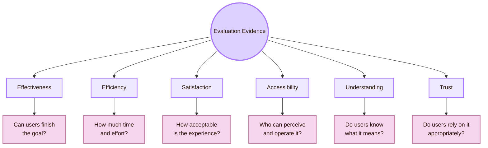
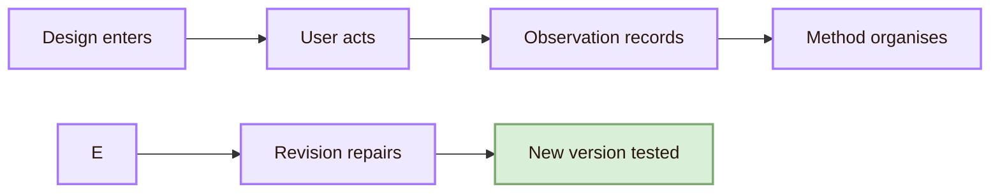
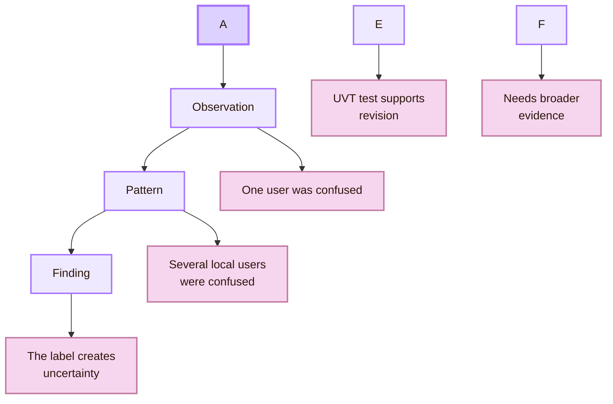
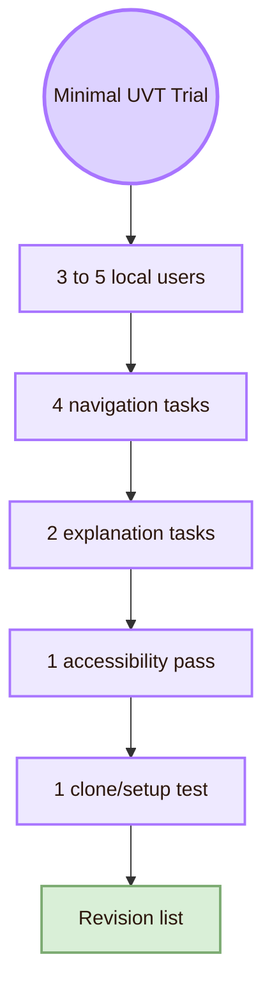
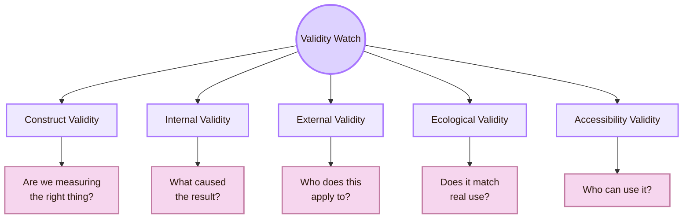

![[experiment_room.jpg|1000]]
# Evaluating the Design

The local dimension is the **Faculty of Informatics / Computer Science context at UVT**.  
The global dimension is the wider HCI evaluation field: CS2023, CHI, UXPA, ASSETS, CSCW, ESEM, W3C/WCAG, usability testing, validity, accessibility evaluation, reproducibility, and long-term evidence.

> [!quote] Section rule
> A design is not good because it looks good. It is good when evidence shows that real users can understand it, use it, recover from problems, and reach their goals in a defined context.

## What this area does

> What evidence shows that this design works, and what are the limits of that evidence?

A design can be attractive and still fail. Users may not understand the labels. They may take too long to find a page. They may use the system only because the researcher helps them. They may complete a task but feel uncertain. They may be excluded by poor contrast, missing headings, broken keyboard navigation, or a diagram that cannot be read by assistive technology.

Evaluation turns these problems into evidence. It helps a student move from opinion to method.

## Section entrance

## Area identity

## What this area measures

## Local UVT evaluation layer

## Global HCI evaluation layer

- **CS2023 HCI-Evaluation:** Official Computer Science curriculum structure for evaluation methods and learning outcomes
- **ISO 9241-11:** Usability framing around effectiveness, efficiency, satisfaction, users, goals, and context of use
- **NN/g / UXPA / JUS / MeasuringU:** Applied usability methods, task testing, severity ratings, and UX metrics
- **W3C / WCAG / ASSETS / WebAIM:** Accessibility evaluation, standards, assistive technology, and inclusive testing
- **CHI / TOCHI / PACM HCI / IJHCS:** Peer-reviewed HCI evaluation research
- **CSCW / IMWUT:** Field studies, social contexts, long-term use, and situated evaluation
- **ESEM / MSR:** Software-system, workflow, repository, and tool-evaluation methods

## The evidence engine

## Section trial: minimal local study

## Validity watch

## Portfolio value

This area is useful for career preparation because evaluation produces artifacts that show method skill. A student interested in UX research, accessibility evaluation, HCI research, empirical software engineering, or human-AI evaluation should save the materials, not only the final design.

- **Evaluation protocol:** You can plan a study before collecting data
- **Task script:** You can write user tasks without leading the participant
- **Observation sheet:** You can collect behavioural evidence
- **Issue log:** You can turn observations into repair priorities
- **Accessibility checklist:** You understand access as part of evaluation
- **Clone/setup test:** You can evaluate portability and reproducibility
- **Before/after screenshots:** You can show design iteration

## Academic anchors

| Route | Source |
|---|---|
| CS2023 HCI-Evaluation | [CS2023 HCI SIGCSE 2022 version](https://csed.acm.org/knowledge-areas-human-computer-interaction-hci-sigcse-2022-version/) |
| CS2023 HCI Version Gamma | [Human-Computer Interaction PDF](https://csed.acm.org/wp-content/uploads/2023/09/HCI-Version-Gamma.pdf) |
| CS2023 Knowledge Areas | [CS2023 Knowledge Areas](https://csed.acm.org/knowledge-areas/) |
| UVT Faculty of Informatics | [Faculty of Informatics UVT](https://info.uvt.ro/en/) |
| UVT Faculty departments | [Faculty of Informatics Departments](https://info.uvt.ro/en/departamente/) |
| UVT CSAI Department | [Department of Computational Sciences and Artificial Intelligence](https://info.uvt.ro/en/departamente/csai/) |
| UVT DTSE Department | [Department of Digital Technologies and Software Engineering](https://info.uvt.ro/en/departamente/dtse/) |
| UVT researcher routes | [UVT Informatics Researchers](https://research.info.uvt.ro/researchers/) |
| Usability and context of use | [ISO 9241-11](https://www.iso.org/obp/ui/) |
| Usability definition route | [NIST usability glossary](https://csrc.nist.gov/glossary/term/usability) |
| Usability testing | [NN/g: Usability Testing 101](https://www.nngroup.com/articles/usability-testing-101/) |
| UX method selection | [NN/g: Which UX Research Methods to Use](https://www.nngroup.com/articles/which-ux-research-methods/) |
| UX metrics | [MeasuringU Essential Metrics](https://measuringu.com/essential-metrics/) |
| Accessibility evaluation | [W3C: Evaluating Web Accessibility Overview](https://www.w3.org/WAI/test-evaluate/) |
| Accessibility standard | [WCAG 2.2](https://www.w3.org/TR/WCAG22/) |
| WCAG understanding documents | [Understanding WCAG 2.2](https://www.w3.org/WAI/WCAG22/Understanding/) |
| Core HCI venue | [ACM CHI](https://dl.acm.org/conference/chi) |
| Accessibility research venue | [ACM ASSETS](https://dl.acm.org/conference/assets) |
| Empirical software evaluation | [ESEM](https://www.esem-conferences.org/) |
| Field and social evaluation | [ACM CSCW](https://cscw.acm.org/) |
| HCI archival journal | [ACM TOCHI](https://dl.acm.org/journal/tochi) |
| HCI proceedings journal | [PACM HCI](https://dl.acm.org/journal/pacmhci) |

^overview-evaluating-design-cool-end
