# Open Problems

Back to [[Overview|The Observation Chamber]].

> [!abstract] Open Questions in Evaluation
> This page explains unresolved problems in **CS2023 HCI-Evaluation: Evaluating the Design**. It focuses on the hard parts of proving that a design works: validity, evidence quality, metric choice, accessibility, reproducibility, long-term use, and evaluation of AI-supported systems.

The official CS2023 label is **HCI-Evaluation: Evaluating the Design**.  
The local project name is **Observation Chamber**.  
The light orientation name is **Evaluation Frontier Map**.

In practical terms, this page asks:

> What evidence is enough to support a design claim, and where does that evidence stop?

This matters for the Cognishire HCI vault because a small student project can collect useful evidence, but it must not overclaim. A test with three classmates can reveal local usability problems. It cannot prove that the vault is usable for every student, accessible for every user, or effective as a long-term learning tool.

The main student skill is **bounded interpretation**. You should learn to say what your evaluation showed, what it did not show, and what the next test should check.

## Quick route

| Open problem | Student question | Local Cognishire example |
|---|---|---|
| Local evidence | What can a UVT test honestly prove? | Three students test the vault and reveal confusing room names |
| Validity | Does the method support the claim? | A navigation test is used to claim learning, even though learning was not measured |
| Realism | Does the study resemble real use enough? | A clean laptop test is used to represent GitHub download, Obsidian use, and classroom reading |
| Metric choice | Are the measures matched to the concept? | Time on task is used when the real question is comprehension |
| Bias | Who is missing or misread? | Friends, advanced users, or English-comfortable students dominate the sample |
| Reproducibility | Can others inspect the method and repeat the test? | The tested commit, task sheet, and issue log are not saved |
| Accessibility evidence | Does the design work across real access needs? | Automated checks are treated as full accessibility proof |
| Long-term use | What happens after the first session? | Students like the map once but never return to it |
| AI-mediated evaluation | How do we evaluate systems that generate, adapt, or change? | An AI guide sounds useful but gives unsupported or changing answers |
| Mixed methods | How do numbers and comments support one claim? | Task times and interview quotes are reported separately without integration |

## Problem map

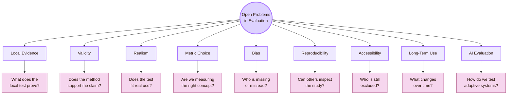

| Problem area | Core issue | Why it matters in HCI |
|---|---|---|
| Local evidence | A local test gives local findings | Small student samples support formative claims, not universal claims |
| Validity | Evidence must match the claim | A study can collect data and still answer the wrong question |
| Realism | A study must match the intended use context | Lab success may not transfer to classroom, GitHub, or independent study contexts |
| Metric choice | Measures must fit the construct | Easy metrics can hide confusion, effort, anxiety, trust, and exclusion |
| Bias | Evaluation can privilege some users | Recruitment, language, device, and ability differences affect results |
| Reproducibility | Methods and artifacts must be inspectable | Others need to know what version, tasks, and analysis produced the findings |
| Accessibility evidence | Access needs more than visual judgment | WCAG checks, keyboard use, screen structure, and user impact all matter |
| Long-term use | First use is not the whole story | Learning tools can look successful once but fail over time |
| AI-mediated evaluation | AI behaviour may change across prompts, users, and versions | Correctness, uncertainty, trust, drift, and accountability must be tested |

## CS2023 grounding

CS2023 places **Evaluating the Design** inside the HCI knowledge area. The topic includes evaluation with users, formative and summative assessment, usability testing, qualitative and quantitative methods, observation, interviews, surveys, focus groups, study planning, hypothesis design, heuristic evaluation, and defensible conclusions.

The open problems begin when these normal skills are applied to messy real projects.

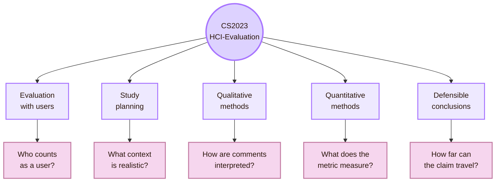

| CS2023 element | Open problem |
|---|---|
| Evaluation with users | Which users are included, excluded, or overrepresented? |
| Formative evaluation | How do we keep early findings from sounding like final proof? |
| Summative evaluation | What benchmark makes a design good enough? |
| Qualitative methods | How do we interpret comments without forcing a preferred answer? |
| Quantitative methods | Which metric reflects the intended construct? |
| Study planning | How much control, realism, and scale are needed? |
| Hypothesis design | What counts as a meaningful effect in human interaction? |
| Defensible conclusions | Which parts of the finding are local, tentative, or limited? |

## Problem 1: Local evidence

The first problem is local. The Cognishire vault is built in a UVT student context. It may be judged by a professor, used by classmates, cloned through GitHub, opened in Obsidian, and read on different laptops.

Local evidence is useful because it finds real problems in the actual setting. It is limited because the sample and context are narrow.

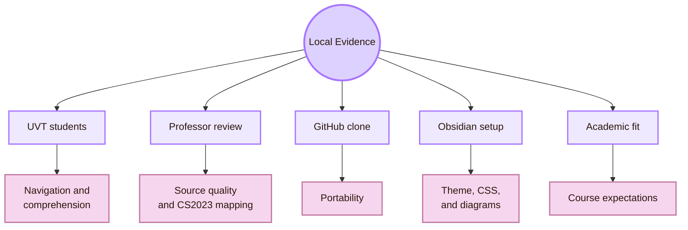

| Local question | Why it is difficult | Suitable evidence |
|---|---|---|
| Do students understand the room names? | The metaphor may be memorable but unclear | Explanation task after reading |
| Does the professor see the academic structure? | Visual style can hide the CS2023 basis | Expert review of headings, sources, and labels |
| Does GitHub sharing work? | Theme files, CSS snippets, assets, and links may fail after download | Clone test on another computer |
| Are diagrams helpful? | A diagram can look good but fail to teach | Comprehension questions after diagram use |
| Is the vault readable locally? | Projector, screen size, theme, and font settings change the reading experience | Readability check on local devices |
| Is the local test enough? | Small samples are useful for repair, but weak for broad proof | Claim-boundary table |

> [!warning] Local claim rule
> Write “This local test found these problems in this context.” Do not write “This proves the system is usable.”

## Local UVT research routes

UVT Informatics pages can support evaluation thinking through Computer Science routes. These routes should be described carefully. They are not automatically HCI evaluation labs unless an official page says so. They are local routes that connect to software, AI, infrastructure, data, health systems, learning tools, and virtual environments.

| UVT route | Public basis | Evaluation connection |
|---|---|---|
| DTSE and CSAI departments | UVT Faculty of Informatics department pages | Local structure for software systems, AI, digital technologies, and technical evaluation |
| Workflows, web technologies, and ontologies | UVT researcher listings | Evaluating whether the HCI vault works as an information and workflow system |
| Distributed, cloud, grid, and high-performance computing | UVT research routes | Evaluating portability, setup, reliability, latency, and infrastructure conditions |
| Machine learning, data mining, and recommender systems | UVT AI and ML routes | Evaluating prediction, personalisation, uncertainty, and user trust |
| Medical informatics and e-health | UVT researcher and publication routes | Evaluating high-stakes interfaces, monitoring systems, interpretation, and safety |
| Virtual reality | UVT researcher routes | Evaluating spatial usability, presence, comfort, attention, and embodied interaction |
| Psychology-related applications | UVT research routes connected to data and ML | Connecting technical evaluation to human behaviour and user evidence |
| Trust in prediction systems | UVT publication route | Studying trust, interpretation, and reliance in AI-supported decisions |

> [!important] Local route rule
> Use the wording **UVT CS routes that connect to evaluation questions**. Avoid claiming a formal HCI-evaluation lab unless you have a direct official source.

## Problem 2: Validity

Validity is the most important problem in evaluation. A study can be organised and still support the wrong claim.

The core question is:

> Valid for what claim, about which users, under which conditions?

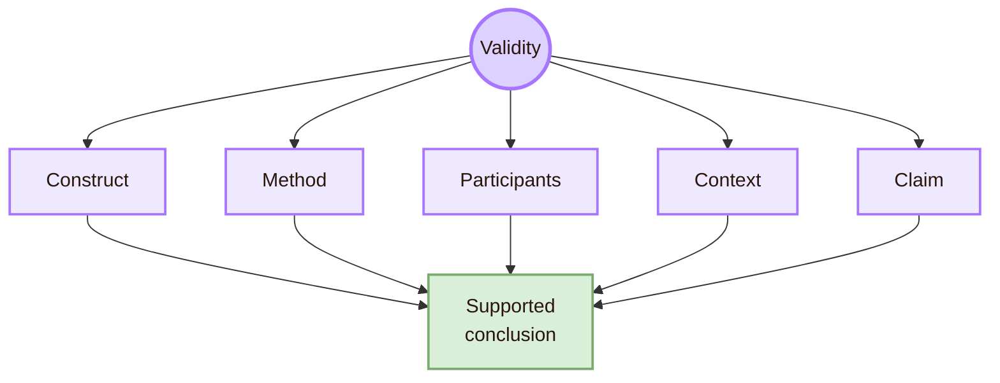

| Validity problem | Cognishire example | Better handling |
|---|---|---|
| Construct mismatch | The report claims learning but measures only navigation speed | Add comprehension or recall tasks |
| Internal validity weakness | Users perform well because they already know the folder structure | Include users unfamiliar with the vault |
| External validity weakness | Three classmates are used to represent all students | State that findings are local and formative |
| Ecological validity weakness | A quiet test on the author’s laptop is used to represent classroom and GitHub use | Test in the target setting or state the limitation |
| Statistical conclusion weakness | A strong percentage claim is made from a tiny sample | Report counts and uncertainty instead of broad statistical claims |
| Interpretive validity weakness | Quotes are selected only when they support the preferred conclusion | Report contradictions and negative cases |

## Problem 3: Realism

Realism asks whether the study resembles the intended use situation. A highly controlled test is easier to observe. A realistic test may show messier but more relevant problems.

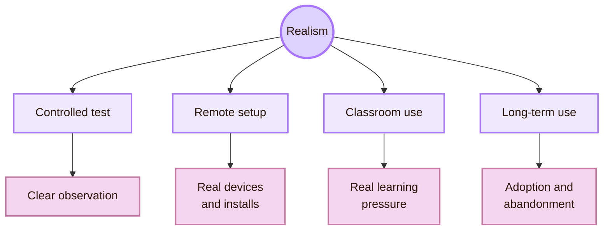

| Setting | What it reveals | What it can miss |
|---|---|---|
| Controlled local test | Task success, errors, confusion, and first reactions | Setup problems, classroom pressure, long-term use |
| Professor review | Academic fit, source grounding, and conceptual structure | Student comprehension and independent navigation |
| Remote clone test | GitHub and Obsidian portability | Classroom reading and discussion |
| Classroom use | Local learning context and social conditions | Clean causal comparison |
| Long-term check | Return use, retention, and maintenance issues | Fast design iteration |

The open problem is matching realism to the claim. A setup claim needs clone testing. A learning claim needs comprehension or retention evidence. An accessibility claim needs accessibility checks and, where possible, evidence from users with relevant access needs.

## Problem 4: Metric choice

HCI evaluation often measures what is easy: task success, time, clicks, errors, ratings, and page visits. These measures can be useful. They can also miss understanding, trust, effort, uncertainty, and exclusion.

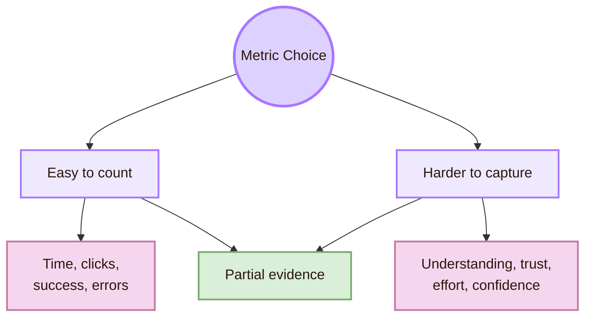

| Metric | What it can show | What it can hide |
|---|---|---|
| Task success | Whether users completed a task | Excessive effort, guessing, or low confidence |
| Time on task | Speed or efficiency | Careful reading, confusion, or fear of making mistakes |
| Error count | Visible mistakes | Hesitation, near-errors, and silent uncertainty |
| Click count | Path length | Whether the user understood the content |
| SUS or rating score | Perceived usability | Exact causes of difficulty |
| Workload score | Felt effort | Which page element caused the effort |
| Analytics | Behavioural traces at scale | Motivation, comprehension, and missing users |

For Cognishire, the metric must match the claim.

| Claim | Weak metric | Better metric |
|---|---|---|
| Students understand the five HCI areas | Page views | Short explanation task |
| Navigation is clear | Personal opinion | Task success, wrong turns, and confidence |
| Diagrams help learning | Preference rating only | Concept question before and after diagram use |
| GitHub sharing works | Works on author’s PC | Clone and open test on another machine |
| Theme is accessible | Looks readable to author | Contrast, headings, keyboard, zoom, and diagram readability checks |

## Problem 5: Bias

Evaluation bias appears when some users are easier to recruit, hear, or interpret than others. Local student projects often overrepresent friends, classmates, advanced users, and people who do not want to criticise the author.

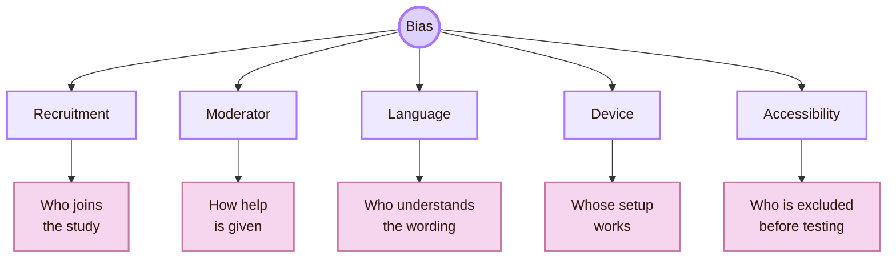

| Bias source | Local example | Repair |
|---|---|---|
| Friend sample | Friends avoid criticism | Use neutral wording and invite unfamiliar users |
| Expertise bias | GitHub users perform better than beginners | Separate beginner and advanced users |
| English bias | Students vary in academic English comfort | Ask users to explain concepts in their own words |
| Device bias | Testing only on the author’s laptop hides setup problems | Test another laptop and at least one different browser or Obsidian setup |
| Moderator bias | The author helps too early | Use a script and define when help is allowed |
| Accessibility bias | Users with access needs are absent | Run baseline accessibility checks and state what was not tested |

## Problem 6: Reproducibility

HCI studies are hard to reproduce because they depend on people, context, prototypes, versions, task wording, moderator behaviour, and analysis choices. A small project can still improve reproducibility by saving the right artifacts.

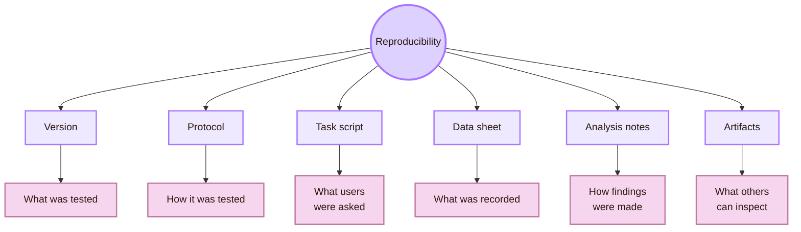

| Artifact | Why it matters |
|---|---|
| Git commit hash | Identifies the exact vault version tested |
| Task sheet | Shows what participants were asked to do |
| Moderator script | Shows how instructions and help were standardised |
| Observation sheet | Shows what evidence was collected |
| Issue log | Shows how problems were recorded and prioritised |
| Analysis notes | Shows how observations became findings |
| Accessibility checklist | Shows what access checks were performed |
| Screenshots or short recordings | Show the tested interface state, when ethical and allowed |

ACM artifact badging and open-science practices support this principle. They encourage researchers to make artifacts available, evaluated, or validated when the community can inspect them.

## Problem 7: Accessibility evidence

Accessibility evaluation is difficult because no single method is enough. Automated tools find some problems. Manual inspection finds others. Assistive technology testing can reveal semantic and interaction barriers. Users with disabilities can reveal barriers that tools and checklists miss.

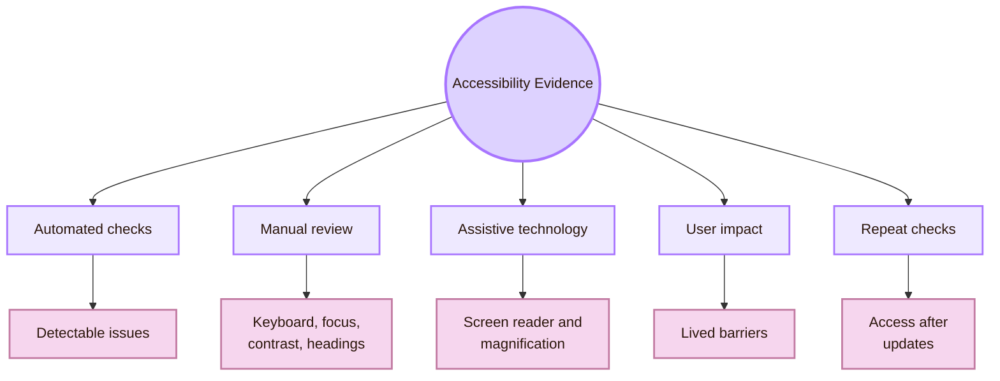

| Accessibility problem | Why it is difficult | Local minimum for Cognishire |
|---|---|---|
| Automated tools are incomplete | Many barriers need human judgment | Use tools as a first pass, not final proof |
| WCAG conformance is not full usability | A user may still struggle with a conforming interface | Add task-based checks where possible |
| Disabled users are diverse | Access needs differ across people and tools | Avoid claiming “accessible for all” |
| Visual themes can break access | CSS, contrast, and diagrams may change readability | Test contrast, headings, zoom, and diagram text |
| Updates can create new barriers | New pages and Mermaid diagrams may regress | Repeat checks after major edits |
| AI-generated content can break structure | Generated headings, alt text, or summaries may be inconsistent | Review structure manually |

For this vault, the minimum evidence should include contrast, keyboard navigation, heading structure, zoom behaviour, Mermaid readability, and a clear note on what was not tested.

## Problem 8: Long-term use

Many student evaluations are short. Users perform a few tasks once. Learning systems need more evidence because usefulness can change after novelty fades.

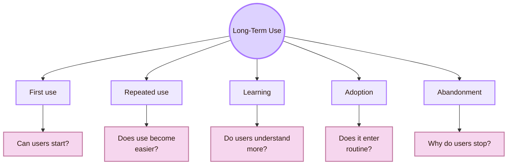

| Long-term question | Local method |
|---|---|
| Do students return to the map after the presentation? | Follow-up check after one week |
| Do students remember the five HCI areas? | Delayed recall task |
| Does the map help with project preparation? | Short concept task before and after map use |
| Do diagrams still help after novelty fades? | Compare first reaction with later comprehension |
| Does the GitHub workflow remain maintainable? | Track commits, broken links, and setup issues |
| Does accessibility drift appear? | Repeat contrast, keyboard, and rendering checks after updates |

## Problem 9: AI-mediated evaluation

If Cognishire later includes AI guidance, evaluation becomes harder. AI systems can produce variable outputs. They can sound confident while being wrong. They can change after model updates. Users may overtrust them or ignore useful help.

Classical usability testing still matters, but AI evaluation also needs checks for correctness, uncertainty, transparency, user control, bias, reproducibility, and recovery from errors.

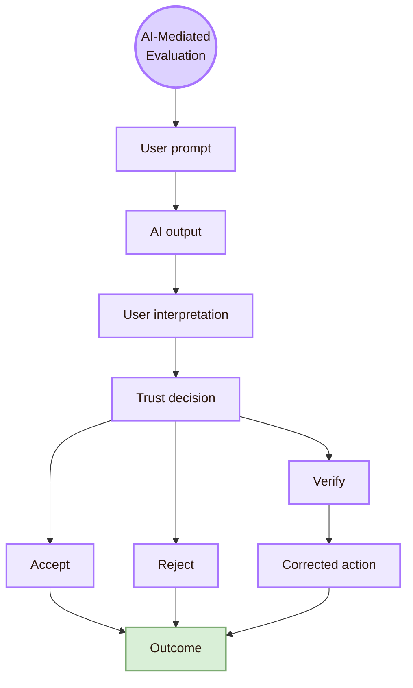

| AI evaluation problem | Why it matters |
|---|---|
| Output variability | The same task may produce different answers |
| Hallucination | Users may not detect false but fluent information |
| Trust calibration | Users may overtrust or undertrust the system |
| Explanation quality | Explanations can sound convincing but weakly supported |
| Bias | Output quality can vary by language, user group, or topic |
| Reproducibility | Prompts, model versions, settings, and sources change |
| Drift | The system or user behaviour changes over time |
| Accountability | Responsibility for wrong output can become unclear |

For a local UVT project, an AI guide should be evaluated for usability, factual correctness, citation quality, uncertainty, and whether users know when to verify claims.

## Problem 10: Mixed methods

Mixed methods can make an evaluation stronger because they combine measurable patterns with explanation. They can also become weak if the project collects numbers and comments but does not connect them.

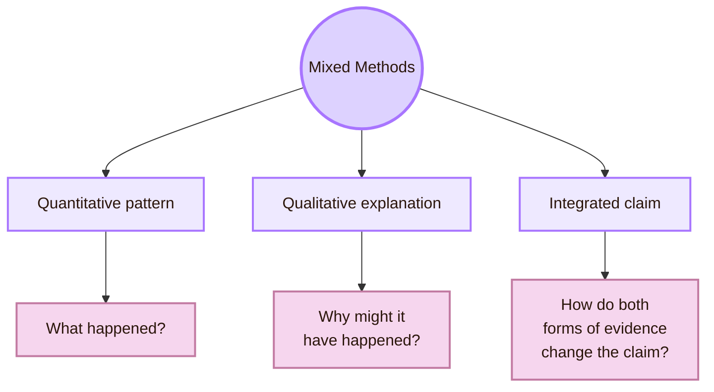

| Weak mixed-methods use | Stronger use |
|---|---|
| Collecting random comments after tasks | Writing interview questions that explain task failures |
| Reporting time and quotes separately | Linking time, wrong turns, and user explanations |
| Using ratings without interpretation | Explaining what the rating can and cannot show |
| Treating one quote as proof | Using quotes to explain patterns |
| Ignoring contradictions | Investigating why numbers and comments disagree |

For Cognishire, a simple mixed-methods design can use task success, wrong turns, post-task confidence, and a short explanation question about each room name.

## Problem 11: Severity and prioritisation

Evaluation usually finds more problems than can be fixed at once. A useful report must prioritise issues. Severity should not be based only on the researcher’s personal preference.

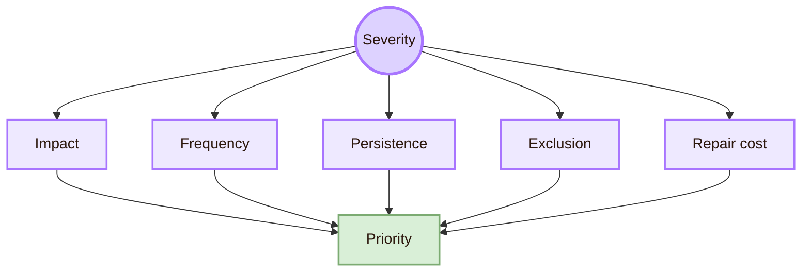

| Severity factor | Question |
|---|---|
| Impact | Does the issue block the task or slow it down? |
| Frequency | How many users encountered it? |
| Persistence | Can users recover, or does the issue continue? |
| Exclusion | Does the issue prevent a group from participating? |
| Confidence damage | Does it make users distrust the system? |
| Repair cost | Can it be fixed quickly, or does it require structural redesign? |

Accessibility-related exclusion should not be treated as minor only because few local users noticed it. Small samples often miss access barriers.

## Cognishire-specific open problems

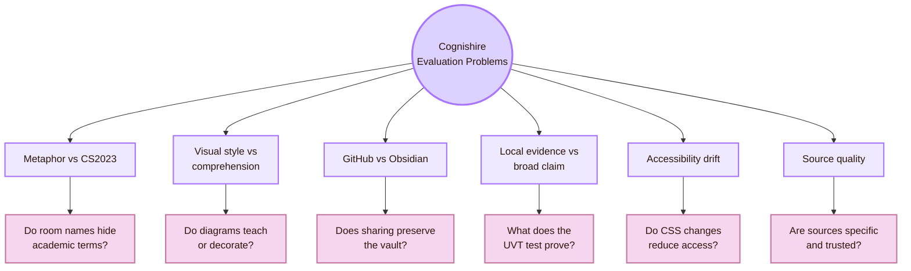

| Cognishire problem | Evaluation question | Possible evidence |
|---|---|---|
| Metaphor vs academic clarity | Do users understand both the room name and the CS2023 label? | Explanation task and professor review |
| Visual style vs comprehension | Does the style help reading or distract from content? | Compare comprehension after styled and simpler sections |
| GitHub vs Obsidian | Does the project work after download or clone? | Clone test, theme check, and link check |
| Local evidence vs broad claim | What can UVT users prove about the map? | Claim-boundary table |
| Accessibility drift | Do CSS, Mermaid, or theme edits reduce readability? | Repeated accessibility checklist |
| Source quality | Does each page use sources specific to its topic? | Source audit against CS2023, standards, and HCI venues |
| Long-term learning | Does the map help students remember HCI structure? | Delayed recall and concept explanation task |
| Professor evaluation | Does the academic structure remain visible? | Expert review checklist |

## Frontier log template

Use this table in the final report or in project notes.

| Open problem | Local evidence | Global source route | Current risk | Next test |
|---|---|---|---|---|
| Room-name clarity | Students explain or fail to explain each room | Mental models, information scent, CS2023 labels | Metaphor hides academic meaning | Explanation task with three students |
| Diagram usefulness | Users answer concept questions after reading | Visual hierarchy, cognitive load, HCI evaluation | Diagrams decorate more than teach | Compare with a simpler version |
| GitHub portability | Another machine clones and opens the vault | Reproducibility and empirical software evaluation | Theme/settings fail outside local PC | Clone test and setup checklist |
| Accessibility | Keyboard, contrast, headings, and diagram text are checked | WCAG, W3C evaluation, WebAIM | Visual style excludes users | Basic accessibility review |
| Long-term learning | Users remember rooms after a delay | Learning and longitudinal HCI evaluation | One-session success fades | Follow-up task after one week |
| AI guidance | AI answers are checked for correctness and sources | Human-AI evaluation and AI risk management | Users overtrust generated text | Verification task and source check |

## Where to search

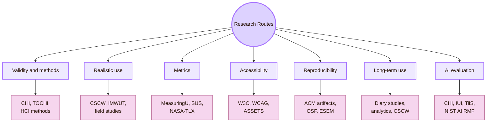

| Problem | Best source route |
|---|---|
| Validity | HCI methods literature, research-methods textbooks, CHI, TOCHI |
| Realism | Field studies, CSCW, IMWUT, ecological-validity research |
| Metric choice | MeasuringU, SUS, NASA-TLX, UX metrics, psychometrics |
| Bias and representation | Accessibility research, inclusive design, research ethics, CSCW |
| Reproducibility | ACM artifact review, OSF, ESEM, empirical methods |
| Long-term outcomes | Diary studies, longitudinal field studies, product analytics |
| Accessibility evidence | W3C WAI, WCAG-EM, ASSETS, WebAIM, user evidence |
| AI-mediated evaluation | CHI, IUI, TiiS, Microsoft HAI guidelines, NIST AI RMF |

## What this page should not claim

| Do not claim | Safer wording |
|---|---|
| A local UVT test proves the map is globally usable | A local UVT test can reveal local usability issues and support bounded claims |
| More realism is always better | Realism must match the claim; control and realism involve tradeoffs |
| Task time proves learning | Task time can support efficiency claims; learning needs comprehension or retention evidence |
| WCAG conformance proves full accessibility | WCAG conformance is important, but lived usability and assistive-technology evidence may also matter |
| Analytics explains user motivation | Analytics shows behavioural traces; qualitative follow-up helps explain motivation |
| AI evaluation is ordinary usability testing | AI evaluation also needs correctness, uncertainty, trust, reproducibility, bias, and drift checks |
| A positive rating proves success | Ratings need task evidence, comments, and claim boundaries |

## Synthesis

Open Problems in **Evaluating the Design** are problems of evidence. The main issue is not whether a usability test can be run. The main issue is what that test proves.

For Cognishire, the local UVT context matters. Students must understand the room names, the professor must see the CS2023 structure, GitHub and Obsidian must work outside the author’s machine, and the visual style must remain readable and accessible.

Global HCI methods help interpret that local evidence. They give language for validity, ecological realism, metric selection, accessibility evaluation, reproducibility, long-term outcomes, and AI-mediated interaction.

The central question is:

> What can the local UVT evaluation honestly prove, and what further evidence is needed before the claim becomes broader?

This page connects to [[Theory]] because open problems reveal limits in validity and measurement. It connects to [[Design]] because better protocols can reduce many of these problems. It connects to [[Experiment]] because the problems appear during real studies. It connects to [[Connections]] because statistics, psychology, software engineering, ethics, accessibility, and analytics all help interpret uncertain evidence. It connects to [[Local and Global]] because every finding has a scale boundary.

## Academic anchors

| Route | Source |
|---|---|
| CS2023 HCI Evaluation basis | [CS2023 HCI SIGCSE 2022 version](https://csed.acm.org/knowledge-areas-human-computer-interaction-hci-sigcse-2022-version/) |
| CS2023 Body of Knowledge | [CS2023 Body of Knowledge PDF](https://csed.acm.org/wp-content/uploads/2024/04/3.1-Body-of-Knowledge-1.pdf) |
| CS2023 Knowledge Areas | [CS2023 Knowledge Areas](https://csed.acm.org/knowledge-areas/) |
| UVT Faculty of Informatics departments | [Faculty of Informatics Departments](https://info.uvt.ro/en/departamente/) |
| UVT CSAI Department | [Department of Computational Sciences and Artificial Intelligence](https://info.uvt.ro/en/departamente/csai/) |
| UVT DTSE Department | [Department of Digital Technologies and Software Engineering](https://info.uvt.ro/en/departamente/dtse/) |
| UVT research routes | [UVT Informatics Researchers](https://research.info.uvt.ro/researchers/) |
| UVT publications route | [UVT Informatics Publications](https://research.info.uvt.ro/publications/) |
| Usability and context of use | [ISO 9241-11](https://www.iso.org/obp/ui/) |
| Applied usability testing | [NN/g: Usability Testing 101](https://www.nngroup.com/articles/usability-testing-101/) |
| UX method selection | [NN/g: Which UX Research Methods to Use](https://www.nngroup.com/articles/which-ux-research-methods/) |
| Task success as a metric | [NN/g: Success Rate](https://www.nngroup.com/articles/success-rate-the-simplest-usability-metric/) |
| UX metrics | [MeasuringU Essential UX Metrics](https://measuringu.com/essential-metrics/) |
| System Usability Scale | [AHRQ SUS PDF](https://digital.ahrq.gov/sites/default/files/docs/survey/systemusabilityscale%28sus%29_comp%5B1%5D.pdf) |
| Workload measurement | [NASA Task Load Index](https://www.nasa.gov/human-systems-integration-division/nasa-task-load-index-tlx/) |
| Accessibility evaluation overview | [W3C: Evaluating Web Accessibility Overview](https://www.w3.org/WAI/test-evaluate/) |
| Accessibility conformance methodology | [WCAG-EM Overview](https://www.w3.org/WAI/test-evaluate/conformance/wcag-em/) |
| Accessibility standard | [WCAG 2.2](https://www.w3.org/TR/WCAG22/) |
| Accessibility research venue | [ACM ASSETS](https://dl.acm.org/conference/assets) |
| Core HCI venue | [ACM CHI](https://dl.acm.org/conference/chi) |
| Field and social evaluation venue | [ACM CSCW](https://cscw.acm.org/) |
| Ubiquitous and longitudinal technology studies | [ACM IMWUT](https://dl.acm.org/journal/imwut) |
| Empirical software engineering venue | [ESEM](https://www.esem-conferences.org/) |
| Reproducibility and artifacts | [ACM Software and Data Artifacts](https://www.acm.org/publications/artifacts) |
| Artifact review and badging | [ACM Artifact Review and Badging](https://www.acm.org/publications/policies/artifact-review-and-badging-current) |
| Open science infrastructure | [Open Science Framework](https://www.cos.io/products/osf) |
| Human-AI interaction guidelines | [Microsoft Guidelines for Human-AI Interaction](https://www.microsoft.com/en-us/research/project/guidelines-for-human-ai-interaction/) |
| HAX Toolkit | [Microsoft HAX Toolkit](https://www.microsoft.com/en-us/haxtoolkit/ai-guidelines/) |
| AI risk management | [NIST AI Risk Management Framework](https://www.nist.gov/itl/ai-risk-management-framework) |
| AI RMF resource center | [NIST AI RMF](https://airc.nist.gov/airmf-resources/airmf/) |

^open-problems-evaluating-design-end
