![[house.png|1000]]
# Design

This page is about design. The [[Experiment]] page checks whether the design works for real users. This page explains how to shape the interface so that fewer barriers appear in the first place.

> [!quote] Design rule
> Accessible design is not a decoration layer. It is a set of structural choices that help people perceive, operate, understand, and rely on a system.

## What inclusive design means here

Inclusive design starts from human variation. Users differ in vision, hearing, mobility, attention, language, memory, device access, technical skill, stress, fatigue, and context. A design becomes more inclusive when it reduces unnecessary demands on those users.

> What barrier could this page create, and how can the design remove or reduce that barrier?

This does not mean that one page can solve every accessibility need. It means that design choices should not create avoidable exclusion.

## Inclusive design map

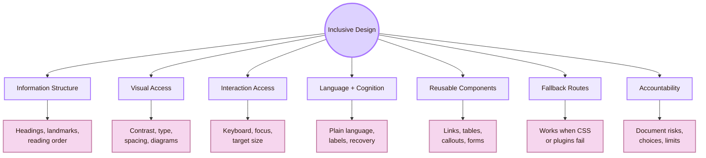

## CS2023 grounding

CS2023 places accessibility inside HCI. In this guide, that means accessibility is part of how interactive systems are designed, implemented, evaluated, and justified. It is not an optional polish step after the interface is finished.

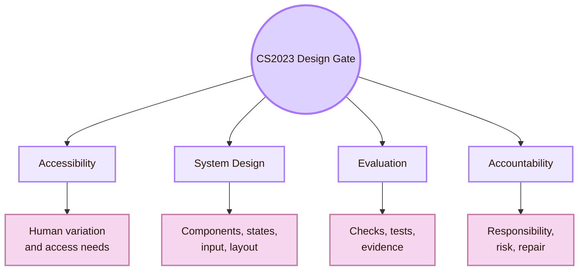

- **HCI-Accessibility:** Design for disability, assistive technology, flexible use, and participation
- **HCI-Design:** Build accessibility into navigation, layout, components, states, and prototypes
- **HCI-Evaluation:** Test whether access actually works in practice
- **HCI-Accountability:** Document design choices, remaining barriers, repair plans, and limits

## Local UVT design layer

## Principle 1: Start from exclusion

Inclusive design begins by asking who is excluded by the current design. The useful question is not “How can this look better?” The useful question is “What demand does this design make, and who cannot meet that demand?”

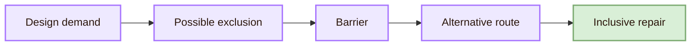

## Principle 2: Use POUR as a design skeleton

WCAG organises accessibility around four principles: perceivable, operable, understandable, and robust. These principles are useful for design because they turn accessibility into concrete interface questions.

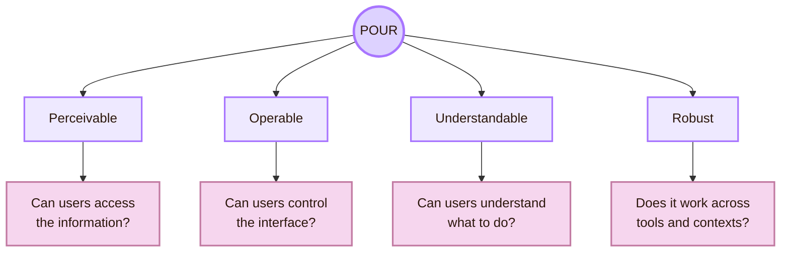

- **Perceivable:** Text, diagrams, labels, and sources must be readable and not depend only on colour
- **Operable:** Links and routes must be reachable by keyboard and not rely on hover-only behavior
- **Robust:** Markdown, links, assets, and CSS should remain usable across viewers

## Information structure design

Structure is part of accessibility. It helps screen reader users, keyboard users, tired students, and professors who scan the page quickly.

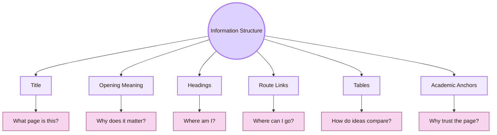

- **Opening callout:** State the CS2023 label, page purpose, and local-global role
- **Headings:** Use headings as navigation, not decoration
- **Backlink:** Every page should have a clear route back to its area overview
- **Tables:** Use tables for comparisons and decisions
- **Academic anchors:** Separate curriculum, standards, research venues, practice guidance, and local UVT sources
- **End synthesis:** Close with one clear question or design principle

## Visual access design

Visual design should reduce effort. It should not ask the user to decode low contrast, crowded diagrams, tiny labels, or meaning carried only by colour.

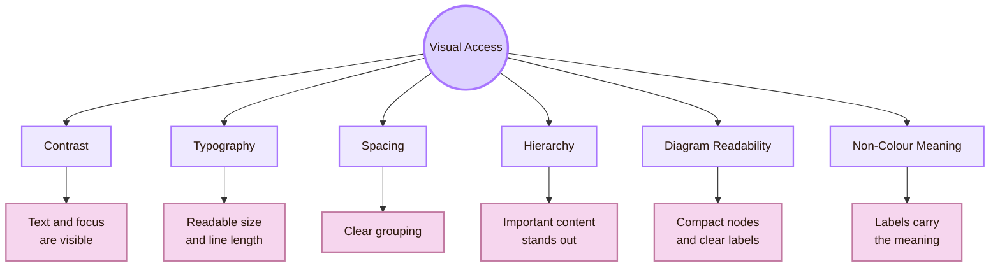

## Interaction access design

Interaction access means that users can act. A page is not accessible if users can read it but cannot move through it, open links, recover from mistakes, or understand where they are.

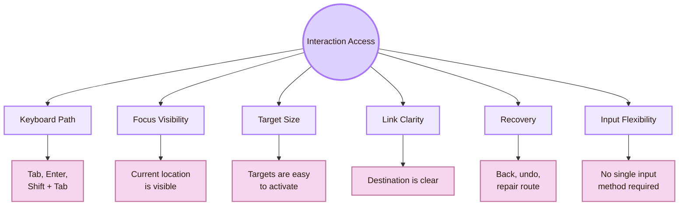

## Component design rules

Accessibility scales through components. A consistent accessible link pattern, table pattern, callout pattern, and diagram pattern improves the whole vault. A broken pattern spreads the same barrier across pages.

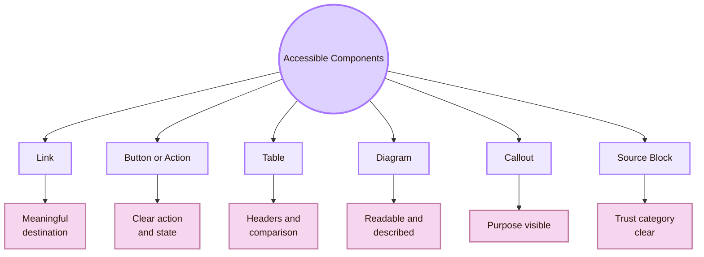

- **Link:** Link text should describe the destination or purpose
- **Button or action:** The user should know what will happen before activation
- **Table:** Use a header row and keep comparisons simple
- **Diagram:** Keep it compact and repeat the core idea in text
- **Source block:** Group sources by role: curriculum, standard, research, local UVT, practice

## Accessible Mermaid design

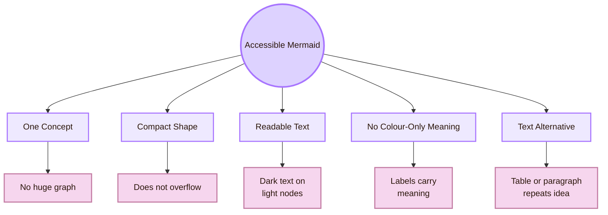

## Cognitive design rules

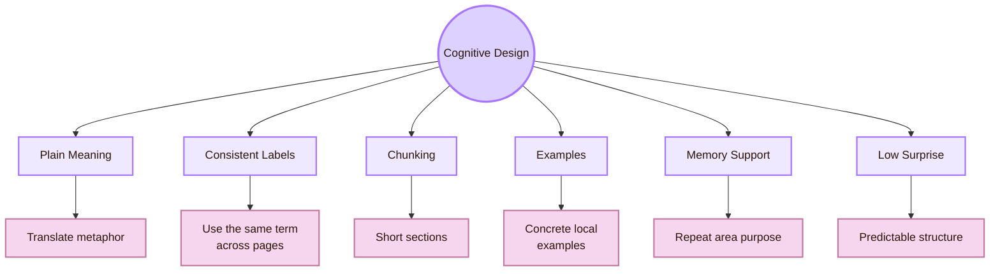

- **User forgets where they are:** Add consistent backlinks and area identity
- **User is overwhelmed by sources:** Group sources by type
- **User cannot connect local and global ideas:** Put UVT and global HCI in the same comparison table
- **User sees a diagram but misses the concept:** Add a short explanation after the diagram
- **User cannot distinguish theory from experiment:** Use page-role callouts at the top
- **User reads on a small screen:** Use shorter paragraphs and compact visual blocks

## Form and error design

Even if the current vault is mostly Markdown pages, accessibility design should include forms and errors. Real systems often ask users to enter, submit, correct, and recover.

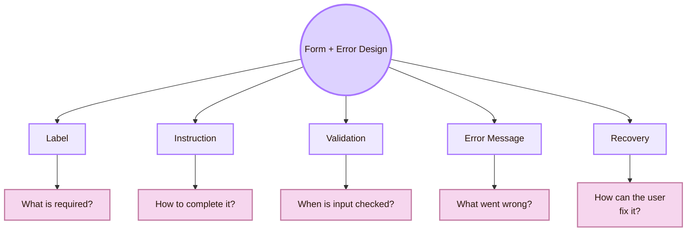

- **Label:** Visible and programmatically connected to the input
- **Required field:** Marked in text, not only by colour
- **Instruction:** Placed before the user makes the error
- **Validation:** Does not erase user input
- **Error message:** Explains what happened and how to fix it
- **Focus after error:** Moves users to the problem or clearly identifies it
- **Recovery:** Allows correction without restarting

## Design-system tokens

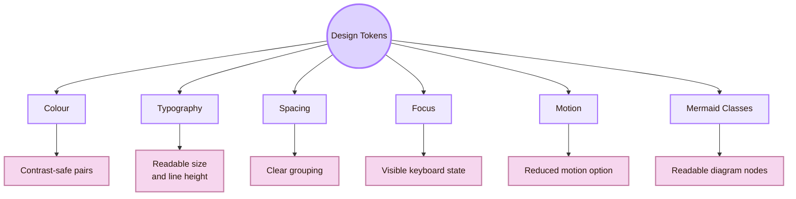

- **Text colour:** High contrast against the page background
- **Accent colour:** Helps emphasis but does not carry meaning alone
- **Background colour:** Supports long reading
- **Font size:** Large enough and user-adjustable
- **Line height:** Comfortable for academic pages
- **Focus outline:** Visible against all relevant backgrounds
- **Spacing:** Separates routes, sections, diagrams, and source blocks
- **Mermaid class:** Uses light fills and dark readable text

## Robustness and fallback design

## Recommended page pattern

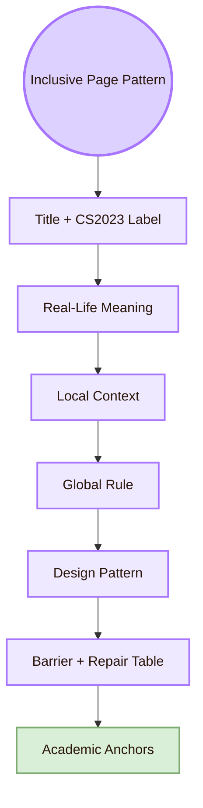

- **Title + CS2023 label:** Prevents metaphor confusion
- **Real-life meaning:** Gives immediate cognitive access
- **Local context:** Grounds the page in real users and tools
- **Global rule:** Connects the page to field knowledge
- **Design pattern:** Shows how to build the interface
- **Barrier + repair table:** Makes exclusion and repair visible
- **Academic anchors:** Shows source credibility

## Inclusive design checklist

Use this checklist before evaluation.

- **Does the page state its official CS2023 meaning?:** The academic label appears near the title
- **Is the heading structure logical?:** Headings describe the page path
- **Is link text meaningful?:** Links describe destination or purpose
- **Are diagrams readable?:** They are compact, light, high-contrast, and explained in text
- **Is colour used safely?:** Meaning does not depend only on colour
- **Can the page be navigated by keyboard?:** Links and controls are reachable and focus is visible
- **Is the text cognitively manageable?:** Sections are chunked and supported by examples
- **Does the page work without custom CSS?:** Core content remains readable in fallback view
- **Are local and global sources clear?:** UVT, CS2023, standards, venues, and practice sources are grouped

## Local and global design comparison

## Academic anchors

| Route | Source |
|---|---|
| CS2023 HCI Accessibility basis | [CS2023 HCI Version Gamma](https://csed.acm.org/wp-content/uploads/2023/09/HCI-Version-Gamma.pdf) |
| WCAG 2.2 standard | [W3C WCAG 2.2](https://www.w3.org/TR/WCAG22/) |
| WCAG overview | [W3C WAI WCAG 2 Overview](https://www.w3.org/WAI/standards-guidelines/wcag/) |
| WCAG quick reference | [How to Meet WCAG 2.2](https://www.w3.org/WAI/WCAG22/quickref/) |
| Understanding WCAG 2.2 | [W3C Understanding WCAG 2.2](https://www.w3.org/WAI/WCAG22/Understanding/) |
| WCAG techniques | [W3C WCAG Techniques](https://www.w3.org/WAI/WCAG22/Techniques/) |
| Accessibility principles | [W3C WAI Accessibility Principles](https://www.w3.org/WAI/fundamentals/accessibility-principles/) |
| Accessibility evaluation | [W3C Evaluating Web Accessibility](https://www.w3.org/WAI/test-evaluate/) |
| Inclusive design method | [Microsoft Inclusive Design](https://inclusive.microsoft.design/) |
| Inclusive design guidebook | [Microsoft Inclusive 101 Guidebook](https://inclusive.microsoft.design/tools-and-activities/Inclusive101Guidebook.pdf) |
| Universal Design principles | [The Center for Universal Design](https://design.ncsu.edu/research/center-for-universal-design/) |
| Ability-Based Design paper | [Ability-Based Design: Concept, Principles and Examples](https://kgajos.seas.harvard.edu/papers/wobbrock11abd.pdf) |
| Apple accessibility guidance | [Apple HIG: Accessibility](https://developer.apple.com/design/human-interface-guidelines/accessibility) |
| Apple inclusion guidance | [Apple HIG: Inclusion](https://developer.apple.com/design/human-interface-guidelines/inclusion) |
| Material accessibility | [Material Design Accessibility](https://m2.material.io/design/usability/accessibility.html) |
| Material target size guidance | [Material Design Structure](https://m3.material.io/foundations/designing/structure) |
| GOV.UK accessible services | [GOV.UK: Making your service accessible](https://www.gov.uk/service-manual/helping-people-to-use-your-service/making-your-service-accessible-an-introduction) |
| IBM Carbon accessibility | [Carbon Design System Accessibility](https://carbondesignsystem.com/guidelines/accessibility/overview/) |
| Practical accessibility | [WebAIM](https://webaim.org/) |
| Accessibility research community | [ACM SIGACCESS](https://www.sigaccess.org/) |
| Accessibility conference | [ACM ASSETS](https://dl.acm.org/conference/assets) |
| UVT accessibility for students with disabilities | [UVT: Accessibility for students with disabilities](https://uvt.ro/en/educatie/info-studenti-proces-educational/accesibilitate-pentru-studentii-cu-dizabilitati/) |
| UVT Faculty of Informatics | [Faculty of Informatics UVT](https://info.uvt.ro/en/) |

^design-accessibility-inclusive-design-end
