# Experiment

Back to [[../Overview|The Inclusive Gate]].

> [!abstract] Inclusive Experiment Lab
> Experiment in the **Inclusive Gate** means testing whether a design stays accessible when different users, abilities, devices, tools, contexts, and barriers are introduced. This page turns accessibility theory into structured checks, observations, local UVT trials, and repair cycles.

The fantasy name is **Inclusive Experiment Lab**.  
The real CS2023 label is **HCI-Accessibility: Accessibility and Inclusive Design**.  
The connected responsibility route is **HCI-Accountability: Accountability and Responsibility in Design**.  
The real-life meaning is **collecting evidence about who can perceive, operate, understand, and rely on an interactive system**.

This page goes beyond running one automated accessibility checker. Automated tools are useful, but they detect only part of the problem. Inclusive experimentation also needs manual inspection, keyboard testing, screen reader checks, cognitive accessibility tasks, local user feedback, and honest reporting about what was not tested.

> [!quote] Lab rule
> An accessibility experiment is useful when it reveals barriers clearly enough that the design can be repaired and retested.

## Experiment Map

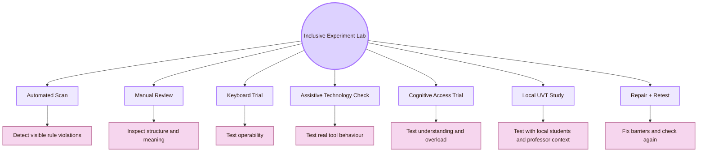

| Experiment route | What it tests | Main limitation |
|---|---|---|
| Automated scan | Some code-level or markup-level accessibility issues | Cannot prove real usability or full accessibility |
| Manual review | Headings, link text, reading order, contrast, structure, visible focus | Depends on evaluator skill |
| Keyboard trial | Whether tasks can be completed without a mouse | Does not cover all assistive technologies |
| Screen reader structure check | Whether content is announced with useful structure | Needs real tool testing and careful interpretation |
| Cognitive access trial | Whether users understand labels, structure, instructions, and diagrams | Small local samples support local claims only |
| Local UVT study | Whether the map works for students, professor, and local project context | Does not automatically generalise globally |
| Repair and retest | Whether fixes actually remove barriers | Must be repeated after design changes |

## CS2023 Experiment Gate

CS2023 treats accessibility and inclusive design as part of HCI, and evaluation as part of deciding whether a design works. This experiment page connects those units. Accessibility concepts must become testable evidence.

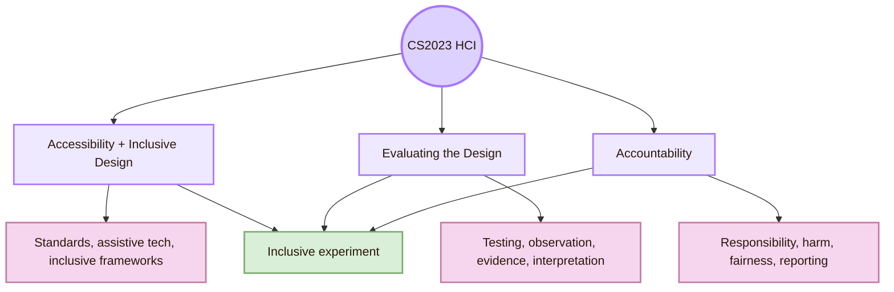

| CS2023 idea | Experimental translation |
|---|---|
| Accessibility standards | Test selected pages against WCAG-oriented criteria |
| Assistive technologies | Check screen reader, keyboard, zoom, and other relevant access paths |
| Inclusive frameworks | Identify who is excluded and what mismatch creates the barrier |
| Universal design | Test whether one design supports multiple ways of using it |
| Accountability | Record evidence, limits, risk, and responsibility honestly |
| Evaluation methods | Use tasks, observation, metrics, notes, and repair cycles |

## Local UVT Experiment Layer

The local dimension is the **Faculty of Informatics / Computer Science context at UVT**. For this project, the first accessibility experiment should not be abstract. It should test the actual HCI map, in the actual tools and conditions where it may be opened: Obsidian, GitHub, local computer setup, classroom presentation, professor review, and student navigation.

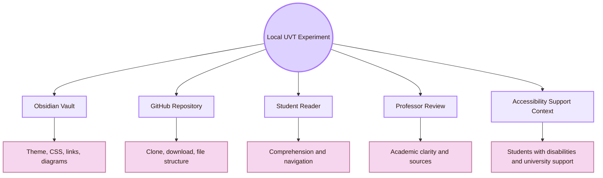

| Local target | Experiment question |
|---|---|
| Obsidian vault | Can users read, navigate, zoom, and understand the pages with the chosen theme? |
| GitHub repository | Can the project still be accessed if Obsidian styling or CSS does not load? |
| Mermaid diagrams | Are diagrams readable, useful, and understandable without relying only on colour? |
| Professor review | Is the academic meaning visible without extra explanation from the author? |
| Student reading | Can first-year students understand the CS2023 meaning of the page? |
| Local disability support context | Does the design respect the idea that students may need accommodations, assistive tools, or alternative formats? |

## Experiment Protocol Spine

Every experiment in this page should follow the same spine.

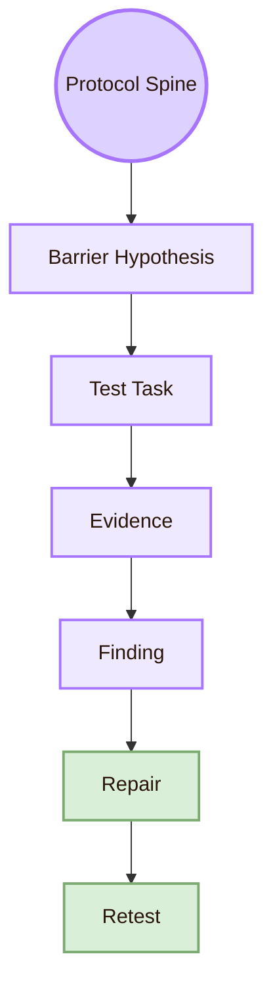

| Protocol part | Example |
|---|---|
| Barrier hypothesis | Some users may not understand fantasy room names without academic translation |
| Test task | Ask the user to explain what “Inclusive Gate” means after reading the opening section |
| Evidence | Explanation accuracy, hesitation, quotes, wrong interpretation, confidence rating |
| Finding | The metaphor is memorable but not self-explanatory |
| Repair | Add the official CS2023 label and real-life meaning near the title |
| Retest | Ask a new user to repeat the explanation task |

## Experiment I: Automated Accessibility Scan

An automated scan is a useful starting point, not a complete experiment. It can identify some missing labels, contrast issues, heading problems, and code-level barriers. It cannot understand all design meaning, cognitive load, assistive-technology behaviour, or user experience.

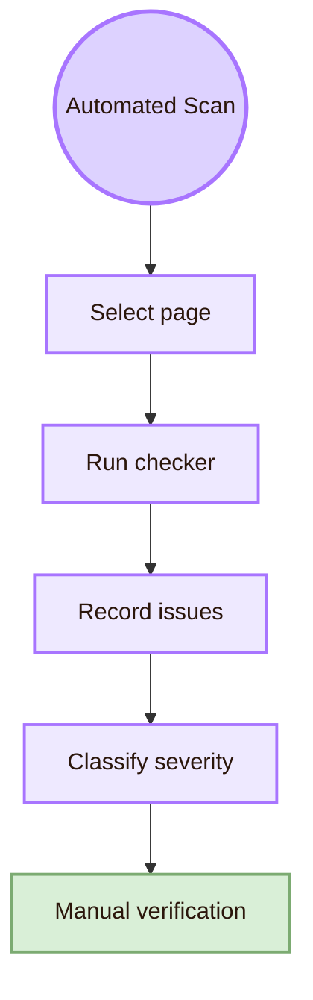

| Test item | What to record |
|---|---|
| Page or view tested | Obsidian reading view, GitHub Markdown view, exported HTML, or browser page |
| Tool used | WAVE, axe DevTools, Lighthouse accessibility, browser dev tools, or another checker |
| Detected issue | Missing alternative text, contrast problem, heading order, form label, ARIA issue |
| Location | Page title, section, component, diagram, navigation area |
| Severity | Blocks use, creates serious friction, creates moderate confusion, or cosmetic |
| Manual verification | Whether the issue is real and how it affects a user |

> [!warning] Automated scan boundary
> A scan result is evidence of detectable issues. It does not prove that the system is accessible. W3C and WebAIM both treat quick checks and automated tools as starting points that need manual review and user-aware interpretation.

## Experiment II: Keyboard-Only Navigation Trial

Keyboard access is a core operability test. The user should complete main tasks without a mouse.

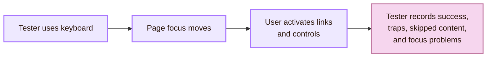

| Keyboard task | Success criterion |
|---|---|
| Open the overview page | User can reach and activate the target link |
| Move through page links | Focus order follows visible reading order |
| Open a source link | Link can be reached and activated without mouse |
| Return to previous page | User can navigate back without losing context |
| Read a Mermaid diagram section | User can skip past the diagram or access equivalent explanation |
| Complete a local navigation task | User can find Theory, Experiment, Local and Global, and Open Problems |

| Failure type | Evidence |
|---|---|
| Invisible focus | User cannot see where keyboard focus is |
| Keyboard trap | User enters a component and cannot leave |
| Illogical order | Focus jumps unpredictably |
| Mouse-only action | An action cannot be completed from keyboard |
| Ambiguous link text | User cannot tell where a link goes |
| Overloaded navigation | Too many links create fatigue without structure |

## Experiment III: Screen Reader Structure Check

A screen reader structure check tests whether the page has meaningful structure. This also supports navigation, search, scanning, and fallback reading. Good semantic structure also improves navigation, search, scanning, and robustness.

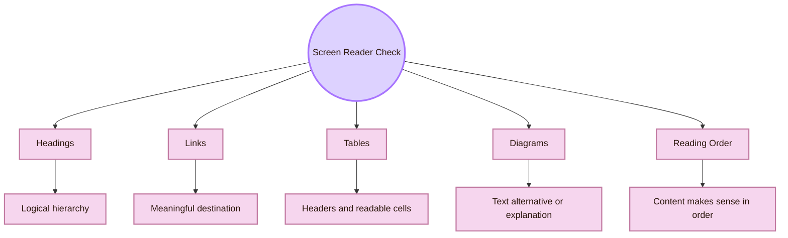

| Check | Question |
|---|---|
| Heading navigation | Can the user jump by headings and understand the page structure? |
| Link text | Does the link text describe the destination without needing surrounding text? |
| Table reading | Are table headers meaningful and not decorative only? |
| Diagram fallback | Is the diagram explained in nearby text or table? |
| Source section | Can the user identify official sources, standards, research venues, and practice sources? |
| Reading order | Does the page make sense from top to bottom without visual layout? |

For a Markdown vault, the core repair is often structural: use real headings, meaningful links, tables with headers, and explanation near diagrams.

## Experiment IV: Contrast, Zoom, and Visual Readability

Visual accessibility includes more than colour. It includes contrast, font size, spacing, diagram text, line length, theme dependence, and readability after zooming.

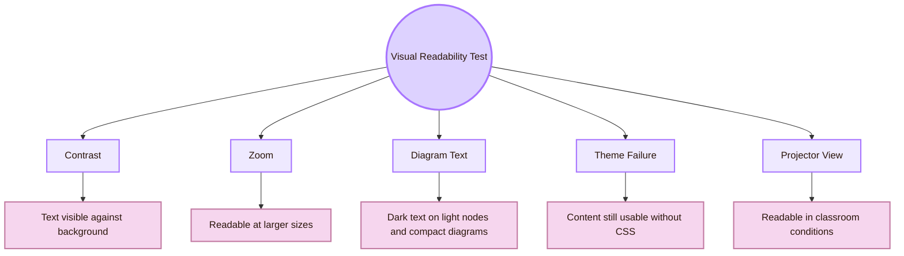

| Visual test | Pass condition |
|---|---|
| Normal text contrast | Text has sufficient contrast against the background |
| Link contrast | Links are visible and distinguishable |
| Focus visibility | Keyboard focus is clearly visible |
| Zoom to 200% | Content remains readable without horizontal scrolling where possible |
| Diagram readability | Mermaid text is readable, compact, and not dependent on colour alone |
| Theme disabled | Main content still works when CSS or theme styling fails |
| Projector test | Title, callouts, diagrams, and tables remain legible from classroom distance |

## Experiment V: Cognitive Accessibility Comprehension Trial

Cognitive accessibility tests whether users understand the structure, labels, concepts, instructions, and purpose. This is essential for the HCI map because fantasy naming can increase motivation but also create ambiguity.

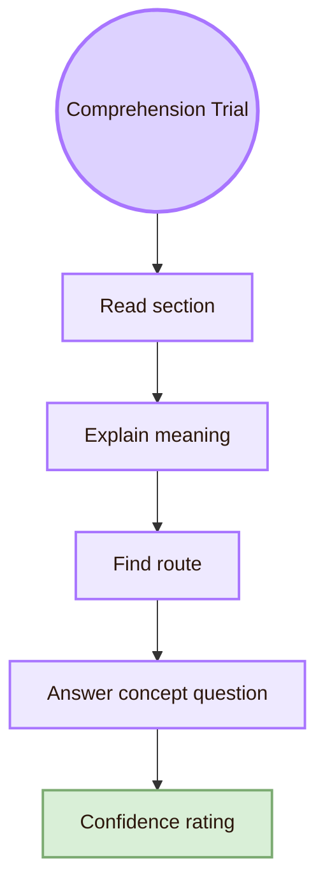

| Task | Evidence |
|---|---|
| Explain “Inclusive Gate” in normal academic words | Whether metaphor is understood |
| Find the page that explains accessibility theory | Navigation success and wrong turns |
| Explain the POUR principles after reading | Concept comprehension |
| Identify one local UVT accessibility connection | Local-global understanding |
| Identify one global standard | Source credibility and academic grounding |
| Explain one barrier and one repair | Applied understanding |
| Rate confidence | Whether users feel certain or lost |

| Cognitive barrier | Repair |
|---|---|
| Fantasy name hides academic meaning | Put official CS2023 label immediately below the title |
| Too many concepts at once | Use section summaries and smaller visual groups |
| Diagrams are impressive but unclear | Pair every diagram with a table and explanation |
| Source list feels random | Group sources by curriculum, standard, research, practice, and local UVT |
| User forgets room role | Repeat “what this room does” near page route board |

## Experiment VI: Inclusive Mismatch Probe

The mismatch probe asks where the design demands something that some users cannot provide.

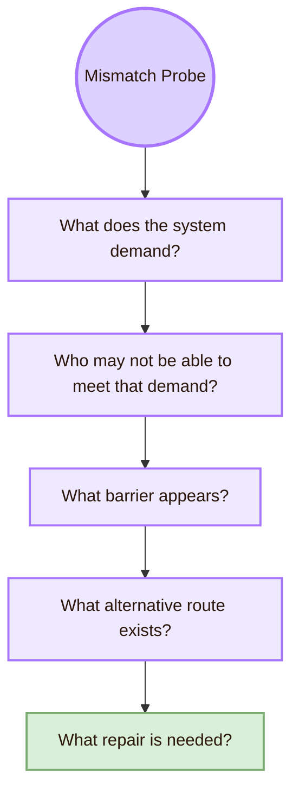

| System demand | Possible exclusion | Repair |
|---|---|---|
| User must see colour differences | Colour-blind users or low-contrast displays | Use labels, shapes, text, and contrast |
| User must use mouse | Motor-disabled users, keyboard users, broken mouse | Full keyboard path |
| User must understand English academic terms | Students with weaker English or new CS vocabulary | Short definitions and real-life translations |
| User must read dense long pages | Users with cognitive load, fatigue, ADHD, stress | Section summaries, route maps, smaller chunks |
| User must use Obsidian correctly | Viewers unfamiliar with Obsidian | GitHub or exported fallback instructions |
| User must understand fantasy metaphors | Professor or student may miss academic mapping | Pair fantasy name with CS2023 label |
| User must zoom visually into diagrams | Low vision users or small screens | Text alternatives and compact diagrams |

## Experiment VII: Diagram Accessibility Experiment

The HCI map uses many diagrams. Diagrams are useful only if they support comprehension. The experiment should test whether diagrams help users understand or only make the page look impressive.

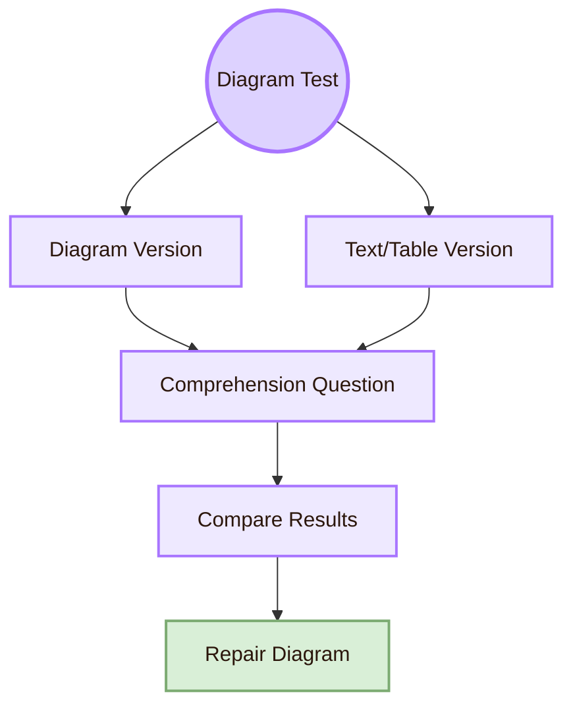

| Diagram experiment item | What to test |
|---|---|
| Readability | Can the user read the text without zooming? |
| Comprehension | Can the user explain the concept after seeing it? |
| Redundancy | Is the same concept available in text or table? |
| Colour dependence | Does meaning survive without colour? |
| Screen size | Does the diagram fit in Obsidian Reading View? |
| Screen reader support | Is there a nearby explanation for non-visual access? |
| Cognitive load | Does the diagram simplify or overload the concept? |

## Experiment VIII: Local UVT Accessibility Trial

This is the practical local study for the Cognishire HCI map.

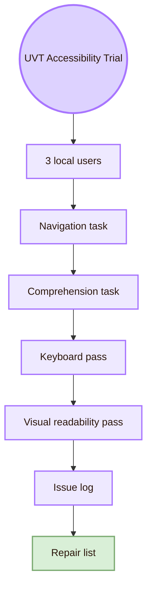

| Trial part | Concrete task |
|---|---|
| Local user | A UVT student, classmate, or project viewer |
| Navigation task | Find the page about Accessibility and Inclusive Design |
| Comprehension task | Explain what Inclusive Gate means in academic terms |
| Source task | Find one WCAG/W3C source and one UVT local source |
| Keyboard task | Navigate from Overview to Theory using only keyboard |
| Readability task | Read one diagram and explain it |
| Setup task | Open the file from the repository or copied folder |
| Output | Issue log with barrier, evidence, severity, repair, and retest status |

## Experiment IX: Assistive Technology Smoke Test

A smoke test is a small first pass. It does not replace expert testing or disabled-user testing, but it catches obvious failures.

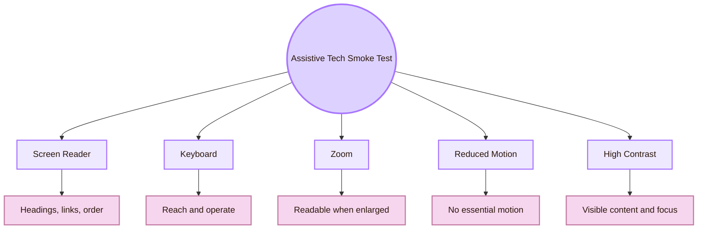

| Smoke test | Minimum check |
|---|---|
| Screen reader | Navigate headings, links, and tables on one page |
| Keyboard | Complete one page-finding task without mouse |
| Browser zoom | Increase zoom and inspect wrapping, scrolling, and diagram readability |
| High contrast mode | Check whether text, links, and focus remain visible |
| Reduced motion | Confirm that no critical information depends on animation |
| Plain Markdown fallback | Check whether the page still makes sense if CSS fails |

## Experiment X: Accountability Report

An inclusive experiment must report limits. This is where accessibility connects to accountability.

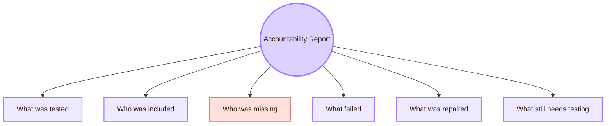

| Report field | What to write |
|---|---|
| Scope | Which pages, tools, devices, and views were tested |
| Participants | Who participated and what user groups were not represented |
| Methods | Automated scan, manual review, keyboard test, comprehension task, screen reader check |
| Findings | Barrier, evidence, affected users, severity, and location |
| Repairs | What changed in the design |
| Retest | Whether the repair was checked again |
| Limits | What the study cannot prove |
| Next step | What should be tested later |

## Evidence Matrix

| Experiment | Evidence collected | Strong claim | Weak claim to avoid |
|---|---|---|---|
| Automated scan | Detected issues and manual verification | Some detectable barriers were found and repaired | The system is fully accessible |
| Keyboard trial | Completion, focus problems, traps, unreachable controls | The tested tasks can or cannot be completed by keyboard | All motor access needs are solved |
| Screen reader check | Heading path, link meaning, table structure, diagram fallback | The tested page has or lacks usable semantic structure | All screen reader users will have the same experience |
| Contrast/zoom test | Readability at normal and enlarged views | The tested view has or lacks visual readability under selected settings | The theme is accessible for everyone |
| Cognitive trial | Explanation accuracy, confusion, confidence | Local users understood or misunderstood specific concepts | All users will understand the map |
| Local UVT trial | Student/professor evidence in the local context | The design works or fails for this local project context | The design is globally validated |
| Diagram test | Comprehension and readability | The tested diagram helped or failed to help understanding | All diagrams are effective |
| Assistive smoke test | Basic tool compatibility | Obvious barriers were checked | Expert accessibility testing is complete |

## Issue Log Template

| Issue ID | Barrier | Evidence | Affected users | Severity | Repair | Retest status |
|---|---|---|---|---|---|---|
| A01 | Diagram text too small | User could not read Mermaid labels at normal zoom | Low-vision users, projector viewers, small-screen users | Serious | Increase text contrast, reduce diagram width, add table explanation | Not retested |
| A02 | Fantasy label unclear | User could not explain “Inclusive Gate” | First-time users, professor, non-HCI readers | Moderate | Add CS2023 label and real-life translation | Retest needed |
| A03 | Link text vague | Screen reader link list gives unclear destinations | Screen reader users, keyboard users, scanners | Serious | Rewrite link text with destination meaning | Not retested |
| A04 | Theme fails after clone | CSS not loaded on another machine | GitHub viewers, professor, external users | Serious | Include CSS and setup note, test clone | Retest needed |

## Cognishire Application

The Cognishire vault should treat accessibility experimentation as part of the project, not as a late correction.

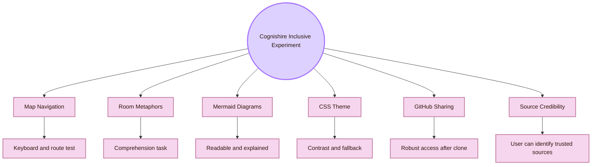

| Cognishire target | Inclusive experiment |
|---|---|
| Room route | Can users reach each room by keyboard and understand where they are? |
| Fantasy names | Can users translate the fantasy name into the CS2023 academic label? |
| Mermaid diagrams | Can users read, understand, and bypass diagrams if needed? |
| Theme | Does the visual style preserve contrast, font size, and clarity? |
| GitHub sharing | Does the content remain accessible when cloned or viewed outside the author’s machine? |
| Academic anchors | Can users identify official standards and trusted sources? |
| Long pages | Do users find section summaries and route maps, or get lost? |

## Experiment Synthesis

Experiment in Accessibility and Inclusive Design is the process of making barriers visible. It begins with theory but must end with evidence: what was tested, who was included, what failed, what was repaired, and what remains uncertain.

A strong experiment path is layered. Start with automated and manual checks. Then test keyboard access, screen-reader structure, visual readability, and cognitive comprehension. Run a local UVT trial with students, professor context, Obsidian, GitHub, CSS, and diagrams. Report the limits clearly and retest after repairs.

The central question is:

> What barrier did the experiment reveal, who does it affect, and how did the design change?

This page connects to [[Theory]] because experiments operationalise accessibility concepts. It connects to [[Design]] because every finding must become a design repair. It connects to [[../Overview|Overview]] because the Inclusive Gate protects the whole HCI map. It connects outward to [[../../03_Evaluating_the_Design/Overview|Observation Chamber]] because accessibility experiments are also evaluation methods.

## Academic Anchors

| Route | Source |
|---|---|
| CS2023 HCI Accessibility basis | [CS2023 HCI Version Gamma](https://csed.acm.org/wp-content/uploads/2023/09/HCI-Version-Gamma.pdf) |
| WCAG 2.2 standard | [W3C WCAG 2.2](https://www.w3.org/TR/WCAG22/) |
| WCAG overview | [W3C WCAG Overview](https://www.w3.org/WAI/standards-guidelines/wcag/) |
| Accessibility principles | [W3C WAI Accessibility Principles](https://www.w3.org/WAI/fundamentals/accessibility-principles/) |
| First accessibility checks | [W3C Easy Checks](https://www.w3.org/WAI/test-evaluate/preliminary/) |
| Accessibility evaluation overview | [W3C Evaluating Web Accessibility](https://www.w3.org/WAI/test-evaluate/) |
| WCAG conformance evaluation | [W3C WCAG-EM Overview](https://www.w3.org/WAI/test-evaluate/conformance/wcag-em/) |
| ARIA authoring practices | [WAI-ARIA Authoring Practices Guide](https://www.w3.org/WAI/ARIA/apg/) |
| Inclusive design method | [Microsoft Inclusive Design](https://inclusive.microsoft.design/) |
| Ability-Based Design paper | [Ability-Based Design: Concept, Principles and Examples](https://kgajos.seas.harvard.edu/papers/wobbrock11abd.pdf) |
| Accessibility research community | [ACM SIGACCESS](https://www.sigaccess.org/) |
| Accessibility conference | [ACM ASSETS](https://dl.acm.org/conference/assets) |
| Web accessibility conference | [Web4All](https://www.w4a.info/) |
| Practical accessibility resource | [WebAIM](https://webaim.org/) |
| UVT accessibility for students with disabilities | [UVT: Accessibility for students with disabilities](https://uvt.ro/en/educatie/info-studenti-proces-educational/accesibilitate-pentru-studentii-cu-dizabilitati/) |
| UVT Faculty of Informatics | [Faculty of Informatics UVT](https://info.uvt.ro/en/) |

^experiment-accessibility-inclusive-design-end
