![[turtle.jpg|1000]]
# Experiment

The real CS2023 label is **HCI-Accessibility: Accessibility and Inclusive Design**.  
The connected responsibility route is **HCI-Accountability: Accountability and Responsibility in Design**.  
The real-life meaning is **collecting evidence about who can perceive, operate, understand, and rely on an interactive system**.

This page goes beyond running one automated accessibility checker. Automated tools are useful, but they detect only part of the problem. Inclusive experimentation also needs manual inspection, keyboard testing, screen reader checks, cognitive accessibility tasks, local user feedback, and honest reporting about what was not tested.

> [!quote] Lab rule
> An accessibility experiment is useful when it reveals barriers clearly enough that the design can be repaired and retested.

## Experiment Map

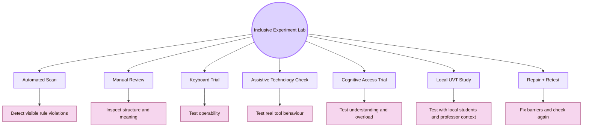

## CS2023 Experiment Gate

CS2023 treats accessibility and inclusive design as part of HCI, and evaluation as part of deciding whether a design works. This experiment page connects those units. Accessibility concepts must become testable evidence.

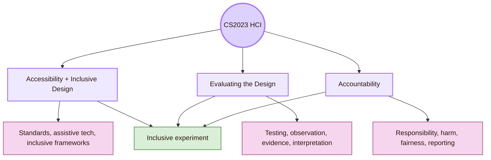

- **Accessibility standards:** Test selected pages against WCAG-oriented criteria
- **Assistive technologies:** Check screen reader, keyboard, zoom, and other relevant access paths
- **Inclusive frameworks:** Identify who is excluded and what mismatch creates the barrier
- **Universal design:** Test whether one design supports multiple ways of using it
- **Accountability:** Record evidence, limits, risk, and responsibility honestly
- **Evaluation methods:** Use tasks, observation, metrics, notes, and repair cycles

## Local UVT Experiment Layer

## Experiment Protocol Spine

Every experiment in this page should follow the same spine.

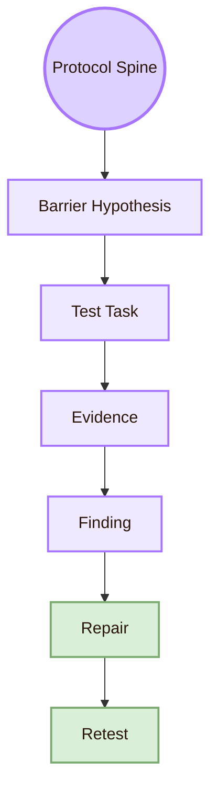

## Experiment I: Automated Accessibility Scan

An automated scan is a useful starting point, not a complete experiment. It can identify some missing labels, contrast issues, heading problems, and code-level barriers. It cannot understand all design meaning, cognitive load, assistive-technology behaviour, or user experience.

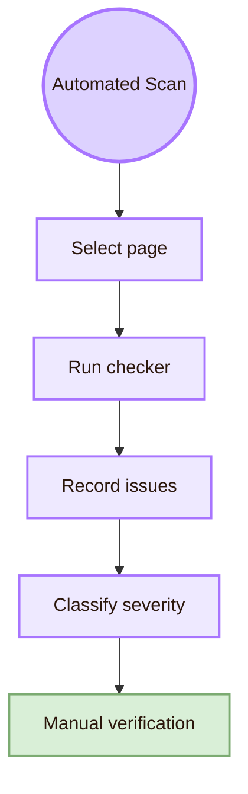

## Experiment II: Keyboard-Only Navigation Trial

Keyboard access is a core operability test. The user should complete main tasks without a mouse.

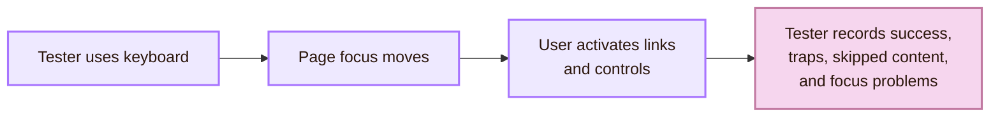

- **Open the overview page:** User can reach and activate the target link
- **Move through page links:** Focus order follows visible reading order
- **Open a source link:** Link can be reached and activated without mouse
- **Return to previous page:** User can navigate back without losing context
- **Read a Mermaid diagram section:** User can skip past the diagram or access equivalent explanation
- **Complete a local navigation task:** User can find Theory, Experiment, Local and Global, and Open Problems

- **Invisible focus:** User cannot see where keyboard focus is
- **Keyboard trap:** User enters a component and cannot leave
- **Illogical order:** Focus jumps unpredictably
- **Mouse-only action:** An action cannot be completed from keyboard
- **Ambiguous link text:** User cannot tell where a link goes
- **Overloaded navigation:** Too many links create fatigue without structure

## Experiment III: Screen Reader Structure Check

A screen reader structure check tests whether the page has meaningful structure. This also supports navigation, search, scanning, and fallback reading. Good semantic structure also improves navigation, search, scanning, and robustness.

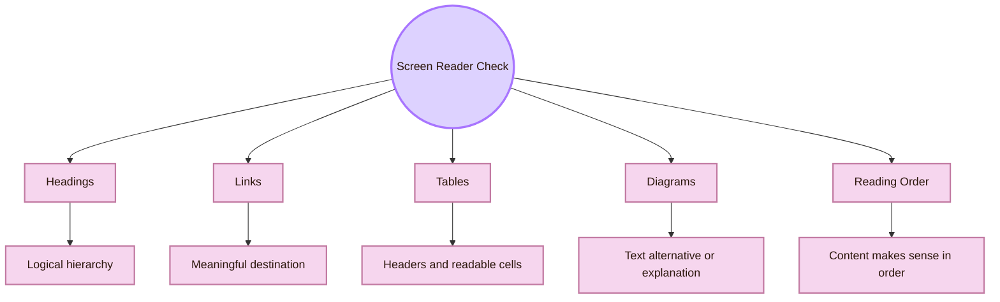

- **Heading navigation:** Can the user jump by headings and understand the page structure?
- **Link text:** Does the link text describe the destination without needing surrounding text?
- **Table reading:** Are table headers meaningful and not decorative only?
- **Diagram fallback:** Is the diagram explained in nearby text or table?
- **Source section:** Can the user identify official sources, standards, research venues, and practice sources?
- **Reading order:** Does the page make sense from top to bottom without visual layout?

For a Markdown vault, the core repair is often structural: use real headings, meaningful links, tables with headers, and explanation near diagrams.

## Experiment IV: Contrast, Zoom, and Visual Readability

Visual accessibility includes more than colour. It includes contrast, font size, spacing, diagram text, line length, theme dependence, and readability after zooming.

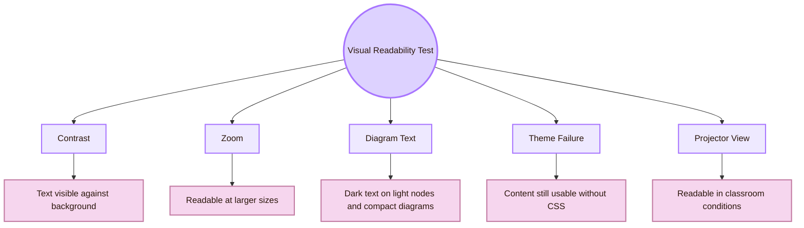

- **Normal text contrast:** Text has sufficient contrast against the background
- **Link contrast:** Links are visible and distinguishable
- **Focus visibility:** Keyboard focus is clearly visible
- **Zoom to 200%:** Content remains readable without horizontal scrolling where possible
- **Diagram readability:** Mermaid text is readable, compact, and not dependent on colour alone
- **Theme disabled:** Main content still works when CSS or theme styling fails
- **Projector test:** Title, callouts, diagrams, and tables remain legible from classroom distance

## Experiment V: Cognitive Accessibility Comprehension Trial

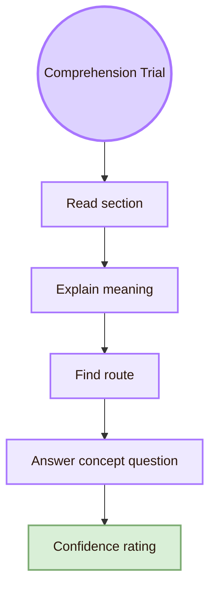

## Experiment VI: Inclusive Mismatch Probe

The mismatch probe asks where the design demands something that some users cannot provide.

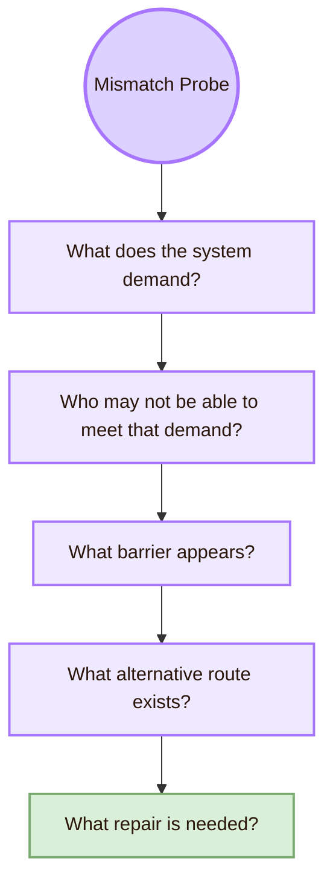

## Experiment VII: Diagram Accessibility Experiment

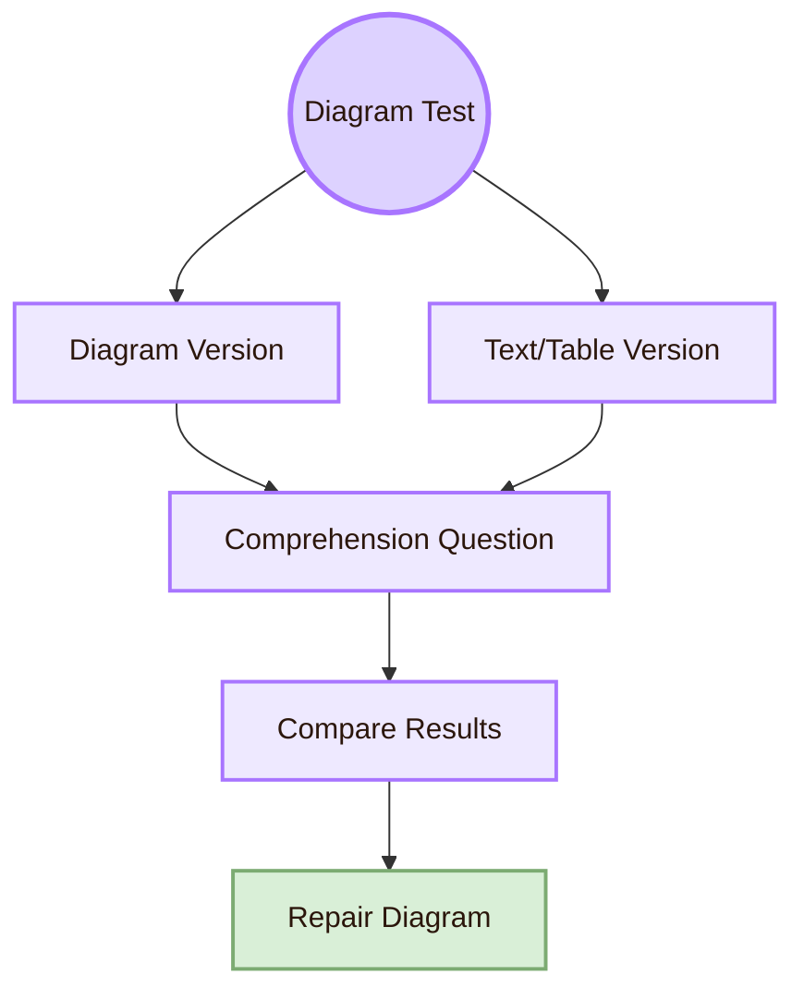

## Experiment VIII: Local UVT Accessibility Trial

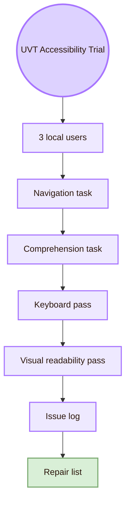

## Experiment IX: Assistive Technology Smoke Test

A smoke test is a small first pass. It does not replace expert testing or disabled-user testing, but it catches obvious failures.

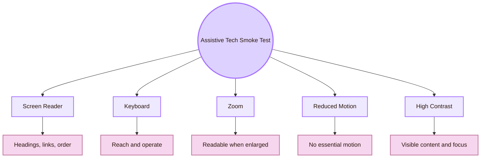

- **Screen reader:** Navigate headings, links, and tables on one page
- **Keyboard:** Complete one page-finding task without mouse
- **Browser zoom:** Increase zoom and inspect wrapping, scrolling, and diagram readability
- **High contrast mode:** Check whether text, links, and focus remain visible
- **Reduced motion:** Confirm that no critical information depends on animation
- **Plain Markdown fallback:** Check whether the page still makes sense if CSS fails

## Experiment X: Accountability Report

An inclusive experiment must report limits. This is where accessibility connects to accountability.

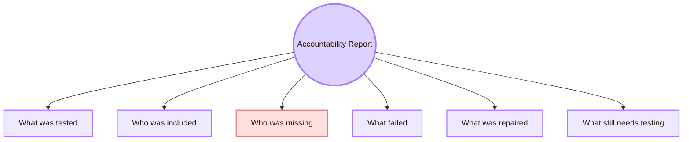

- **Scope:** Which pages, tools, devices, and views were tested
- **Participants:** Who participated and what user groups were not represented
- **Methods:** Automated scan, manual review, keyboard test, comprehension task, screen reader check
- **Findings:** Barrier, evidence, affected users, severity, and location
- **Repairs:** What changed in the design
- **Retest:** Whether the repair was checked again
- **Limits:** What the study cannot prove
- **Next step:** What should be tested later

## Evidence Matrix

## Issue Log Template

## Academic Anchors

| Route | Source |
|---|---|
| CS2023 HCI Accessibility basis | [CS2023 HCI Version Gamma](https://csed.acm.org/wp-content/uploads/2023/09/HCI-Version-Gamma.pdf) |
| WCAG 2.2 standard | [W3C WCAG 2.2](https://www.w3.org/TR/WCAG22/) |
| WCAG overview | [W3C WCAG Overview](https://www.w3.org/WAI/standards-guidelines/wcag/) |
| Accessibility principles | [W3C WAI Accessibility Principles](https://www.w3.org/WAI/fundamentals/accessibility-principles/) |
| First accessibility checks | [W3C Easy Checks](https://www.w3.org/WAI/test-evaluate/preliminary/) |
| Accessibility evaluation overview | [W3C Evaluating Web Accessibility](https://www.w3.org/WAI/test-evaluate/) |
| WCAG conformance evaluation | [W3C WCAG-EM Overview](https://www.w3.org/WAI/test-evaluate/conformance/wcag-em/) |
| ARIA authoring practices | [WAI-ARIA Authoring Practices Guide](https://www.w3.org/WAI/ARIA/apg/) |
| Inclusive design method | [Microsoft Inclusive Design](https://inclusive.microsoft.design/) |
| Ability-Based Design paper | [Ability-Based Design: Concept, Principles and Examples](https://kgajos.seas.harvard.edu/papers/wobbrock11abd.pdf) |
| Accessibility research community | [ACM SIGACCESS](https://www.sigaccess.org/) |
| Accessibility conference | [ACM ASSETS](https://dl.acm.org/conference/assets) |
| Web accessibility conference | [Web4All](https://www.w4a.info/) |
| Practical accessibility resource | [WebAIM](https://webaim.org/) |
| UVT accessibility for students with disabilities | [UVT: Accessibility for students with disabilities](https://uvt.ro/en/educatie/info-studenti-proces-educational/accesibilitate-pentru-studentii-cu-dizabilitati/) |
| UVT Faculty of Informatics | [Faculty of Informatics UVT](https://info.uvt.ro/en/) |

^experiment-accessibility-inclusive-design-end
