![[moon.jpg|1000]]
# Theory

This page is theory. It explains the ideas behind the design rules and the accessibility checks. Accessibility is more than colour contrast or screen reader support. It studies mismatches between people, environments, tools, bodies, cognition, language, culture, and technology.

> [!quote] Gate rule
> Accessibility is not a patch added after design. It is a theory of who the system allows to enter, act, understand, and belong.

## What this theory explains

Accessibility theory gives students a way to reason about barriers before they become defects. It asks what the interface demands from the user and whether that demand is necessary. It also asks who carries the cost when the design fails: the user, the teacher, the developer, or the institution.

## Theory Map

## CS2023 grounding

CS2023 places accessibility and inclusive design inside Human-Computer Interaction. This means accessibility belongs inside computer science. It is part of how interactive systems are designed, evaluated, and justified.

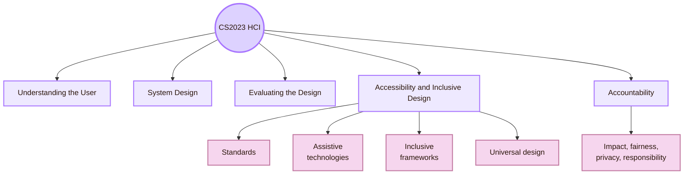

## Local UVT lens

UVT publicly describes support for students with disabilities and also presents accessibility as an institutional goal connected to assistive technologies, accessible educational spaces, and adapted teaching and assessment methods.

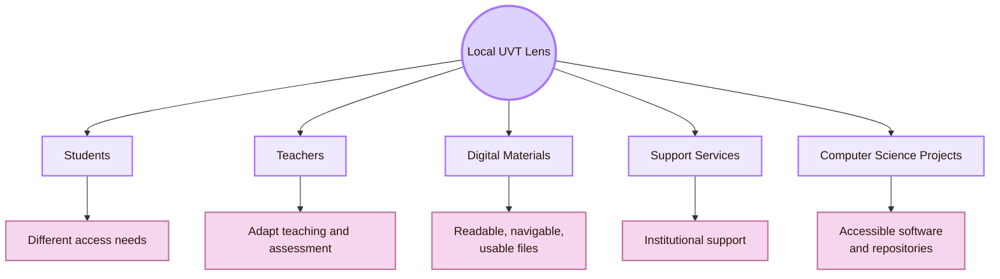

## Disability as mismatch

The first theory is mismatch. A barrier appears when a person’s abilities, tools, environment, or situation do not match what the system demands. The problem is not located only in the person. It is often created by the design.

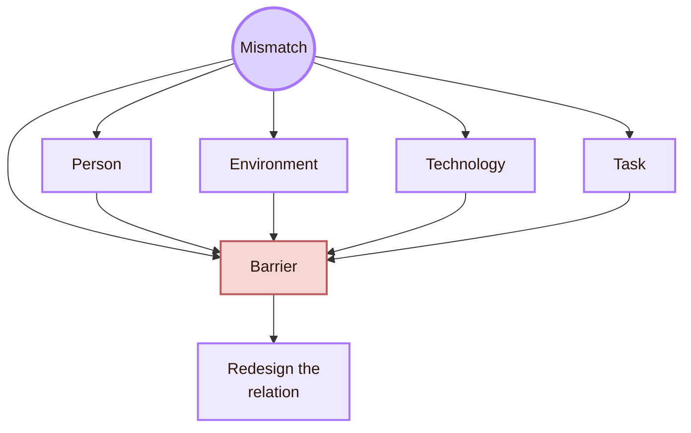

- **Visual mismatch:** example in an interface: Low-contrast text on dark background; design response: Increase contrast and support text scaling
- **Motor mismatch:** example in an interface: Tiny clickable targets; design response: Larger targets, keyboard access, alternative input
- **Hearing mismatch:** example in an interface: Video explains content only through speech; design response: Captions, transcript, visual explanation
- **Cognitive mismatch:** example in an interface: Dense page with unclear hierarchy; design response: Chunking, headings, examples, simpler paths
- **Language mismatch:** example in an interface: Technical labels without explanation; design response: Plain language, glossary, real-life translation
- **Technology mismatch:** example in an interface: Content works only in one app or plugin; design response: Robust formats, fallback content, tested sharing
- **Situational mismatch:** example in an interface: User is tired, outside, under pressure, or on a small screen; design response: Responsive layout, clear feedback, reduced memory load

## Permanent, temporary, and situational barriers

Inclusive design often distinguishes permanent, temporary, and situational barriers. The same design repair can help more than one group.

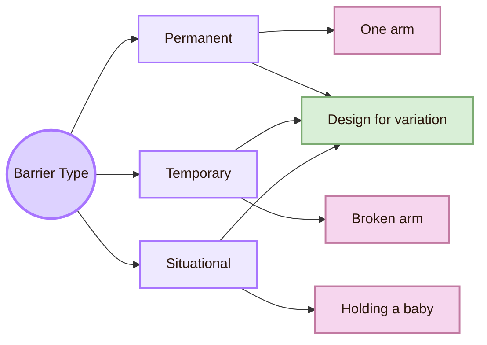

- **Permanent:** Long-term disability or stable access need; interface implication: The system must not rely on one sensory or motor path
- **Temporary:** Short-term injury, illness, fatigue, or stress; interface implication: The system should allow flexible input, recovery, and reduced effort
- **Situational:** Context creates limitation, such as glare, noise, or one-handed use; interface implication: The system should remain usable across environments
- **Invisible:** Mental health, cognitive load, neurodiversity, chronic pain, fatigue; interface implication: The system should avoid unnecessary complexity, pressure, and ambiguity

This theory is powerful because it shows that accessibility is not only for a small separate group. Human ability changes across life, context, device, health, attention, and environment.

## Accessibility: the POUR core

WCAG organises accessibility around four principles: **Perceivable**, **Operable**, **Understandable**, and **Robust**. These are often called POUR. They are the core technical theory of web accessibility.

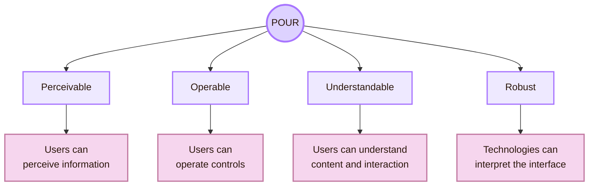

WCAG is not the whole theory of inclusion, but it gives a concrete accessibility baseline. A design that ignores POUR already has basic access risks before deeper inclusion is discussed.

## Accessibility, usability, and inclusion

Accessibility, usability, and inclusion overlap, but they are not identical.

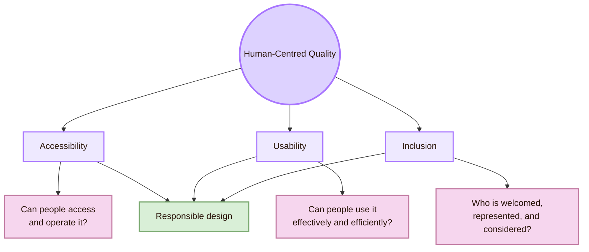

- **Accessibility:** main concern: Removing barriers to access, operation, comprehension, and compatibility; weak interpretation: “A checklist after the design is done”
- **Usability:** main concern: Effectiveness, efficiency, satisfaction, and context of use; weak interpretation: “Users liked it”
- **Inclusion:** main concern: Designing with human diversity, power, context, and participation; weak interpretation: “One design magically fits everyone”
- **Accountability:** main concern: Explaining design consequences and responsibility; weak interpretation: “The user should adapt”

A page can be usable for some users and inaccessible for others. A page can meet selected accessibility criteria and still feel confusing or excluding. Strong HCI work treats these ideas as connected, not interchangeable.

## Inclusive design theory

Microsoft’s inclusive design approach treats exclusion as a result that can appear when designers solve problems mainly from their own assumptions. Its core principles are to recognise exclusion, learn from diversity, and solve for one in ways that extend to many.

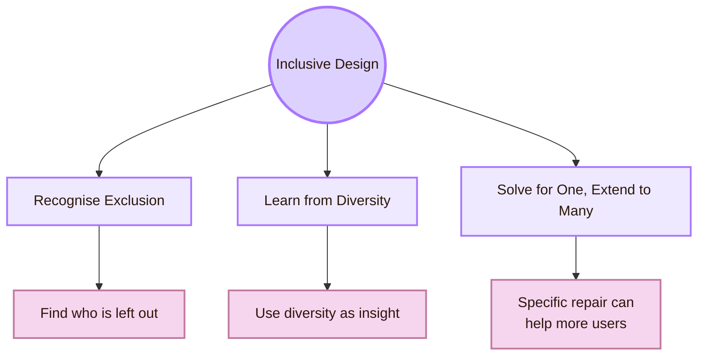

Inclusive design is not the same as making everything neutral. It means finding where the design creates exclusion and using that discovery to make the system better.

## Universal Design theory

Universal Design is a broad design approach for environments, products, and systems that aims to support the widest practical range of people. The classic seven principles include equitable use, flexibility in use, simple and intuitive use, perceptible information, tolerance for error, low physical effort, and size and space for approach and use.

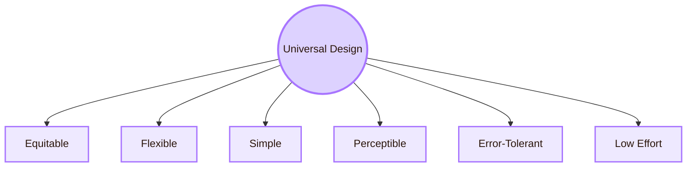

- **Equitable use:** Users should not be separated into “normal” and “special” paths when a shared path can work
- **Flexibility in use:** Multiple ways to navigate, read, input, and recover
- **Simple and intuitive use:** The system should not depend on hidden knowledge
- **Perceptible information:** Important information should not depend on only colour, sound, or subtle layout
- **Tolerance for error:** Users need undo, recovery, clear errors, and safe exploration
- **Low physical effort:** The interface should avoid unnecessary precision, repetition, and fatigue
- **Size and space:** Targets, spacing, and layouts should support different bodies, devices, and contexts

## Ability-Based Design

Ability-Based Design argues that systems should focus on what users can do and adapt to those abilities. It shifts attention from a disability label to the actual interaction abilities available in the moment.

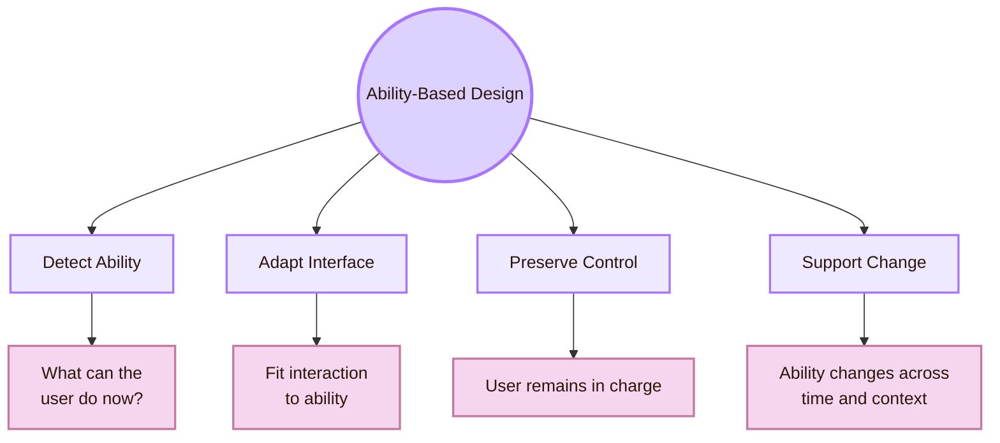

- **Focus on ability:** Design around what the user can currently perceive, move, read, remember, or control
- **Adaptation:** Offer keyboard, touch, screen reader, zoom, captions, reduced motion, or simplified view
- **User control:** Do not force automatic adaptation that disorients users
- **Dynamic ability:** Fatigue, stress, injury, device, lighting, and attention change what the user can do
- **Multiple routes:** A good interface gives more than one path to the goal

Ability-Based Design is useful because it avoids treating disabled users as one category. It asks for a more exact question: what does this user need the system to do differently so the goal remains possible?

## Assistive technology layer

Assistive technologies are not “extra.” They are part of the actual interface for many users. A system that does not work with assistive technology is incomplete.

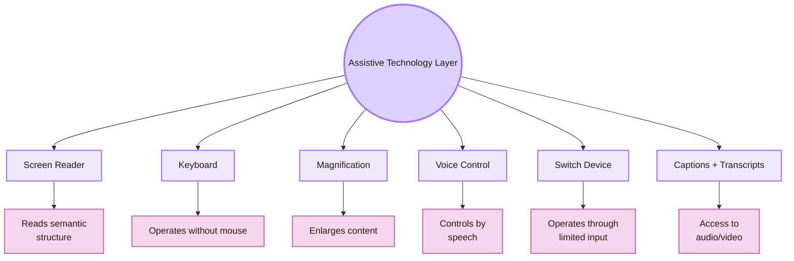

- **Screen reader:** Headings, labels, roles, link text, reading order, meaningful structure
- **Keyboard:** All actions reachable, visible focus, no keyboard traps
- **Magnification:** Layout does not break when zoomed
- **Voice control:** Controls have visible, speakable labels
- **Switch device:** Interface supports sequential navigation and does not require complex gestures
- **Captions and transcripts:** Audio and video content has text equivalents
- **Reduced motion settings:** Animation is not required for understanding and can be reduced

## Accessibility barriers by user dimension

Accessibility theory becomes clearer when barriers are mapped by dimension. These are not fixed groups. One user can experience several barriers at once.

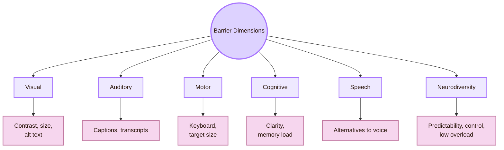

- **Visual:** common design barrier: Meaning depends only on colour, tiny text, no alt text; better theory question: How else can the same information be perceived?
- **Auditory:** common design barrier: Important content exists only in sound; better theory question: Where is the text equivalent?
- **Motor:** common design barrier: Interface requires precise mouse movement or gestures; better theory question: What alternative input path exists?
- **Cognitive:** common design barrier: Dense, ambiguous, memory-heavy interface; better theory question: How can the system reduce load and clarify structure?
- **Speech:** common design barrier: System requires voice input; better theory question: What non-speech route exists?
- **Neurodiversity:** common design barrier: Unexpected motion, clutter, time pressure, unclear feedback; better theory question: How can predictability and control be improved?
- **Temporary/situational:** common design barrier: Glare, fatigue, stress, noisy area, broken mouse; better theory question: How does the system handle real-life variation?

## Cognitive Accessibility

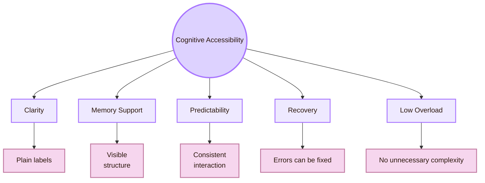

Cognitive accessibility is not “making things childish.” It is making complex systems understandable without unnecessary mental friction.

## Inclusive design and power

Accessibility theory is also about power. Designers decide defaults. They decide who must adapt, who gets a smooth path, who needs a workaround, and whose frustration counts as evidence.

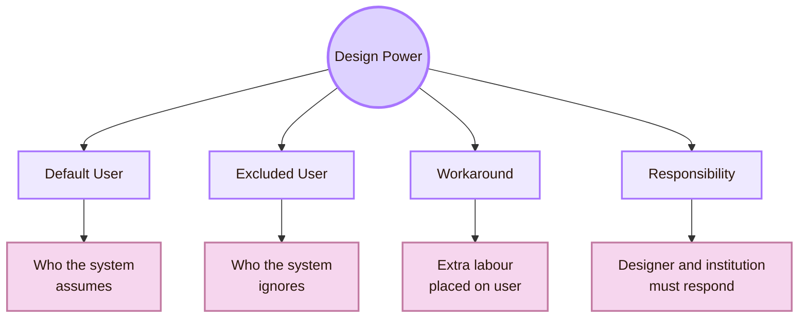

- **Who is treated as the default user?:** The default user receives the easiest path
- **Who must ask for help?:** Extra labour is placed on excluded users
- **Who is not tested?:** Untested users become invisible in design decisions
- **Who controls adaptation?:** Automatic changes can help or disorient
- **Who is blamed when access fails?:** Responsible design blames barriers, not users
- **Who benefits from the repair?:** A repair for one group often improves the system for many

This is where accessibility connects to CS2023 Accountability. Inclusive design is technical, but it is also a responsibility structure.

## Accessibility evaluation theory

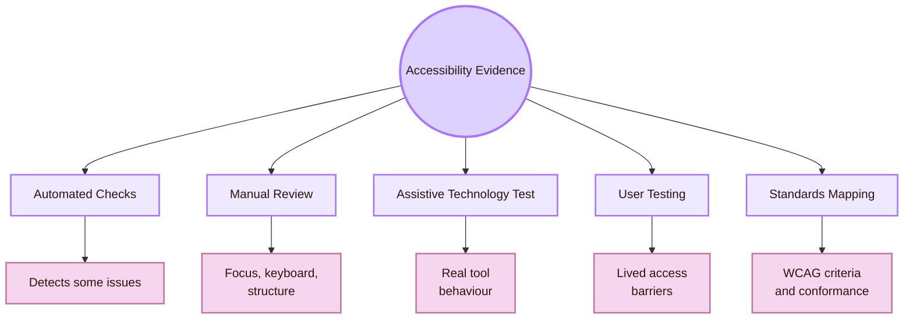

- **Automated check:** what it can show: Some missing labels, contrast issues, structural problems; what it cannot show alone: Real comprehension, assistive-technology experience, all barriers
- **Manual review:** what it can show: Keyboard access, focus, heading logic, content clarity; what it cannot show alone: Full diversity of lived access needs
- **Assistive technology test:** what it can show: How screen readers or other tools interpret the interface; what it cannot show alone: All disabilities or all situations
- **User testing:** what it can show: Real strategies, fatigue, confusion, and workarounds; what it cannot show alone: Complete standards conformance
- **WCAG mapping:** what it can show: Recognised accessibility criteria; what it cannot show alone: Full inclusive experience

## Local to global bridge

The local UVT study should use global theory to improve the local design.

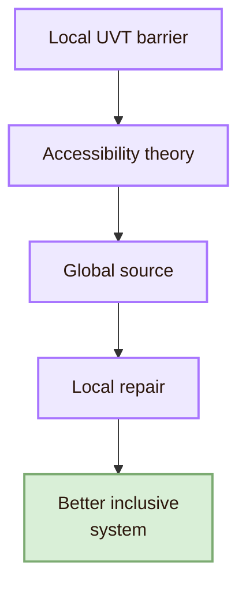

## Academic anchors

| Route | Source |
|---|---|
| CS2023 HCI basis | [CS2023 HCI Version Gamma](https://csed.acm.org/wp-content/uploads/2023/09/HCI-Version-Gamma.pdf) |
| CS2023 Knowledge Areas | [CS2023 Knowledge Areas](https://csed.acm.org/knowledge-areas/) |
| WCAG 2.2 standard | [W3C WCAG 2.2](https://www.w3.org/TR/WCAG22/) |
| WCAG overview | [W3C WCAG Overview](https://www.w3.org/WAI/standards-guidelines/wcag/) |
| Accessibility principles | [W3C WAI Accessibility Principles](https://www.w3.org/WAI/fundamentals/accessibility-principles/) |
| Understanding WCAG 2.2 | [W3C Understanding WCAG 2.2](https://www.w3.org/WAI/WCAG22/Understanding/) |
| First accessibility checks | [W3C Easy Checks](https://www.w3.org/WAI/test-evaluate/preliminary/) |
| Accessibility evaluation | [W3C Evaluating Web Accessibility](https://www.w3.org/WAI/test-evaluate/) |
| Inclusive design method | [Microsoft Inclusive Design](https://inclusive.microsoft.design/) |
| Ability-Based Design paper | [Ability-Based Design: Concept, Principles and Examples](https://kgajos.seas.harvard.edu/papers/wobbrock11abd.pdf) |
| Ability-Based Design overview | [Communications of the ACM: Ability-Based Design](https://cacm.acm.org/research/ability-based-design/) |
| Universal Design principles | [The Center for Universal Design: Principles of Universal Design](https://design.ncsu.edu/research/center-for-universal-design/) |
| Accessibility research community | [ACM SIGACCESS](https://www.sigaccess.org/) |
| Accessibility conference | [ACM ASSETS](https://dl.acm.org/conference/assets) |
| Web accessibility conference | [Web4All](https://www.w4a.info/) |
| UVT accessibility for students with disabilities | [UVT: Accessibility for students with disabilities](https://uvt.ro/en/educatie/info-studenti-proces-educational/accesibilitate-pentru-studentii-cu-dizabilitati/) |
| UVT social inclusion | [UVT actively promotes social inclusion](https://www.uvt.ro/en/blog/uvt-promoveaza-activ-incluziunea-sociala/) |
| UVT tactile accessibility initiative | [UVT tactile models accessibility initiative](https://uvt.ro/en/comunicate-presa/in-cadrul-strategiei-institutionale-orientata-spre-accesibilizare-uvt-instaleaza-machetele-tactile-in-toate-spatiile-principale-din-sediul-principal/) |
| UVT Faculty of Informatics | [Faculty of Informatics UVT](https://info.uvt.ro/en/) |

^theory-accessibility-inclusive-design-end
