# Theory

Back to [[../Overview|The Inclusive Gate]].

> [!abstract] Accessibility and Inclusive Design Guide
> Theory in the **Inclusive Gate** explains why accessibility is part of HCI, not an optional add-on. It covers disability as mismatch, barriers, assistive technologies, inclusive design, universal design, ability-based design, WCAG, accessibility evaluation, and accountability.

The project nickname is **Inclusive Gate**.  
The real CS2023 label is **HCI-Accessibility: Accessibility and Inclusive Design**.  
The connected responsibility route is **HCI-Accountability: Accountability and Responsibility in Design**.  
The practical meaning is **designing interactive systems that treat human variation as normal, not exceptional**.

This page is theory. It explains the ideas behind the design rules and the accessibility checks. Accessibility is more than colour contrast or screen reader support. It studies mismatches between people, environments, tools, bodies, cognition, language, culture, and technology.

> [!quote] Gate rule
> Accessibility is not a patch added after design. It is a theory of who the system allows to enter, act, understand, and belong.

## What this theory explains

Accessibility theory gives students a way to reason about barriers before they become defects. It asks what the interface demands from the user and whether that demand is necessary. It also asks who carries the cost when the design fails: the user, the teacher, the developer, or the institution.

For Cognishire, this theory has a concrete purpose. The vault should be readable, navigable, portable, understandable, and usable even when users have different devices, abilities, language levels, attention states, or technical knowledge.

## Theory Map

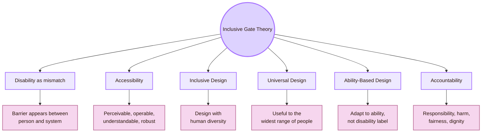

| Theory route | Real-life question | Why it matters |
|---|---|---|
| Disability as mismatch | Where does the barrier appear between person and system? | Moves the problem away from blaming the user |
| Accessibility | Can people perceive, operate, understand, and use the system with current and future technologies? | Gives technical and evaluation structure |
| Inclusive Design | Who is excluded by the current design, and how can diversity guide better design? | Makes exclusion visible early |
| Universal Design | Can the design work for the widest possible range of people without special adaptation? | Connects accessibility to general design quality |
| Ability-Based Design | What can this user do now, and how can the system adapt to that ability? | Treats ability as dynamic and situated |
| Accountability | Who is responsible when a design excludes, harms, hides, or misleads? | Connects accessibility to ethics and responsibility |

## CS2023 grounding

CS2023 places accessibility and inclusive design inside Human-Computer Interaction. This means accessibility belongs inside computer science. It is part of how interactive systems are designed, evaluated, and justified.

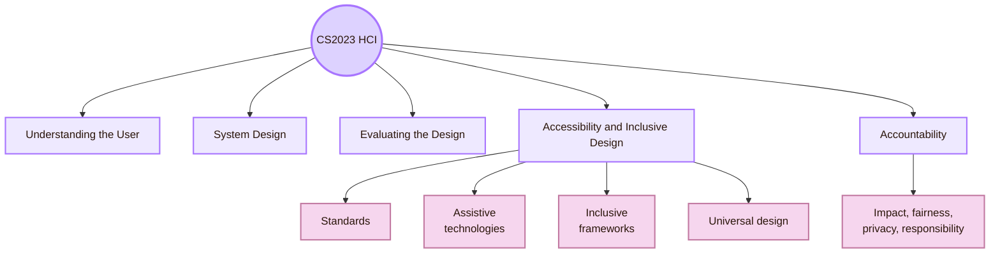

| CS2023 connection | How it enters this page |
|---|---|
| Understanding the User | Users have different bodies, senses, languages, cognition, experience, tools, and contexts |
| System Design | Accessibility becomes structure, components, states, semantics, labels, focus, input, and feedback |
| Evaluating the Design | Accessibility must be checked with standards, assistive technologies, and user evidence |
| Accessibility and Inclusive Design | The core subarea: standards, inclusive frameworks, assistive technologies, and universal design |
| Accountability | Designers and developers must explain consequences, risks, fairness, and responsibility |

## Local UVT lens

The local dimension for this project is the **Faculty of Informatics / Computer Science context at UVT**. Accessibility theory should therefore speak to local students, professors, learning platforms, digital materials, GitHub repositories, Obsidian vaults, classroom presentation, and university accessibility support.

UVT publicly describes support for students with disabilities and also presents accessibility as an institutional goal connected to assistive technologies, accessible educational spaces, and adapted teaching and assessment methods.

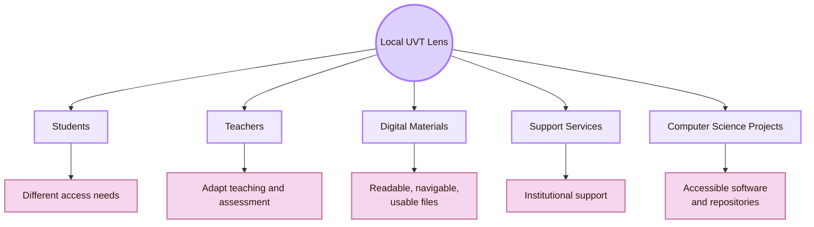

| Local UVT question | Accessibility theory behind it |
|---|---|
| Can a student read the HCI vault comfortably? | Perceivability, contrast, typography, cognitive load |
| Can the professor navigate the project without setup help? | Operability, discoverability, robustness |
| Can a student using keyboard navigation move through the map? | Keyboard access, focus order, operable interface |
| Can a screen reader interpret headings, links, and page structure? | Semantic structure, robust content |
| Can diagrams be understood without relying only on colour? | Multiple representation, non-text alternatives |
| Can digital project materials be shared through GitHub or Obsidian without breaking access? | Robustness, portability, context of use |
| Can local university support practices inform the map? | Inclusion, accommodation, institutional responsibility |

## Disability as mismatch

The first theory is mismatch. A barrier appears when a person’s abilities, tools, environment, or situation do not match what the system demands. The problem is not located only in the person. It is often created by the design.

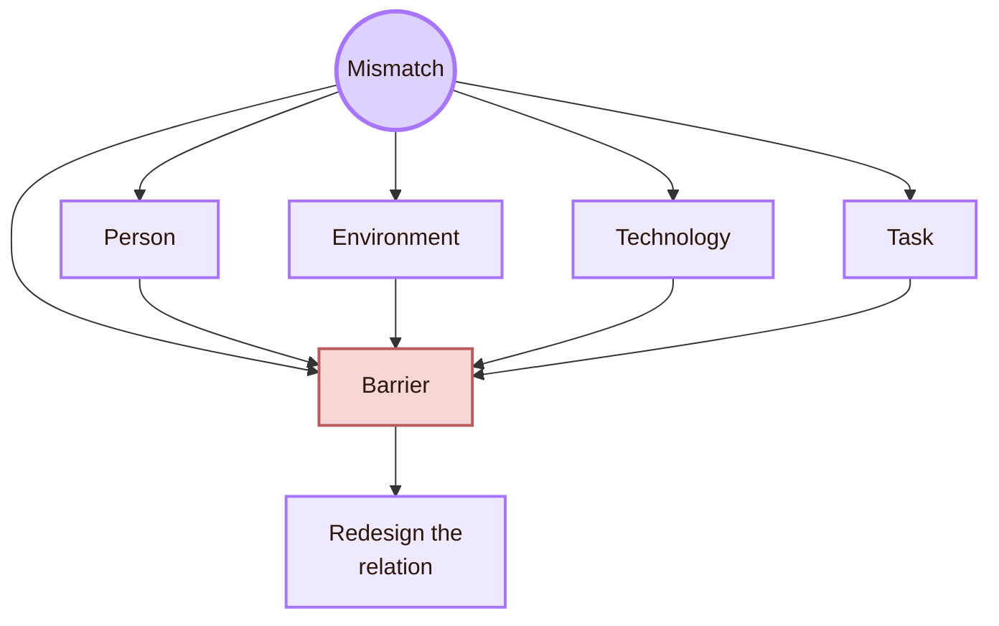

| Mismatch | Example in an interface | Design response |
|---|---|---|
| Visual mismatch | Low-contrast text on dark background | Increase contrast and support text scaling |
| Motor mismatch | Tiny clickable targets | Larger targets, keyboard access, alternative input |
| Hearing mismatch | Video explains content only through speech | Captions, transcript, visual explanation |
| Cognitive mismatch | Dense page with unclear hierarchy | Chunking, headings, examples, simpler paths |
| Language mismatch | Technical labels without explanation | Plain language, glossary, real-life translation |
| Technology mismatch | Content works only in one app or plugin | Robust formats, fallback content, tested sharing |
| Situational mismatch | User is tired, outside, under pressure, or on a small screen | Responsive layout, clear feedback, reduced memory load |

## Permanent, temporary, and situational barriers

Inclusive design often distinguishes permanent, temporary, and situational barriers. The same design repair can help more than one group.

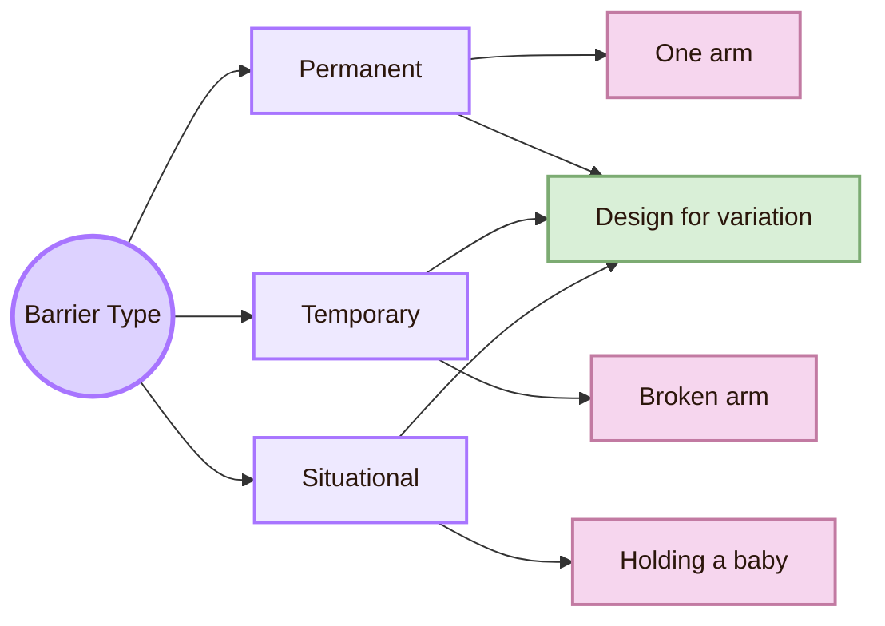

| Barrier type | Real meaning | Interface implication |
|---|---|---|
| Permanent | Long-term disability or stable access need | The system must not rely on one sensory or motor path |
| Temporary | Short-term injury, illness, fatigue, or stress | The system should allow flexible input, recovery, and reduced effort |
| Situational | Context creates limitation, such as glare, noise, or one-handed use | The system should remain usable across environments |
| Invisible | Mental health, cognitive load, neurodiversity, chronic pain, fatigue | The system should avoid unnecessary complexity, pressure, and ambiguity |

This theory is powerful because it shows that accessibility is not only for a small separate group. Human ability changes across life, context, device, health, attention, and environment.

## Accessibility: the POUR core

WCAG organises accessibility around four principles: **Perceivable**, **Operable**, **Understandable**, and **Robust**. These are often called POUR. They are the core technical theory of web accessibility.

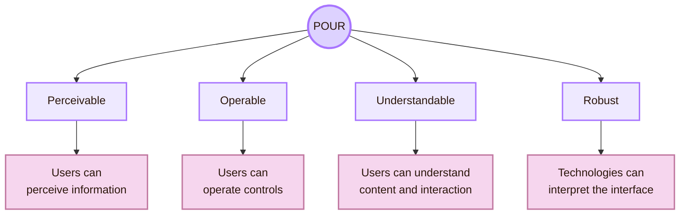

| POUR principle | Theory question | Example in this HCI map |
|---|---|---|
| Perceivable | Can users access the information through available senses and tools? | Text contrast, readable diagrams, alt text, captions for media |
| Operable | Can users control the interface through different input methods? | Keyboard navigation, visible focus, large enough link targets |
| Understandable | Can users understand content, labels, errors, and navigation? | Clear room names, real CS2023 labels, simple explanations |
| Robust | Can different technologies interpret the content reliably? | Proper headings, Markdown structure, stable links, screen reader-friendly layout |

WCAG is not the whole theory of inclusion, but it gives a concrete accessibility baseline. A design that ignores POUR already has basic access risks before deeper inclusion is discussed.

## Accessibility, usability, and inclusion

Accessibility, usability, and inclusion overlap, but they are not identical.

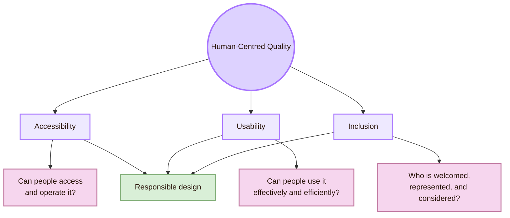

| Concept | Main concern | Weak interpretation |
|---|---|---|
| Accessibility | Removing barriers to access, operation, comprehension, and compatibility | “A checklist after the design is done” |
| Usability | Effectiveness, efficiency, satisfaction, and context of use | “Users liked it” |
| Inclusion | Designing with human diversity, power, context, and participation | “One design magically fits everyone” |
| Accountability | Explaining design consequences and responsibility | “The user should adapt” |

A page can be usable for some users and inaccessible for others. A page can meet selected accessibility criteria and still feel confusing or excluding. A strong HCI project treats these ideas as connected, not interchangeable.

## Inclusive design theory

Microsoft’s inclusive design approach treats exclusion as a result that can appear when designers solve problems mainly from their own assumptions. Its core principles are to recognise exclusion, learn from diversity, and solve for one in ways that extend to many.

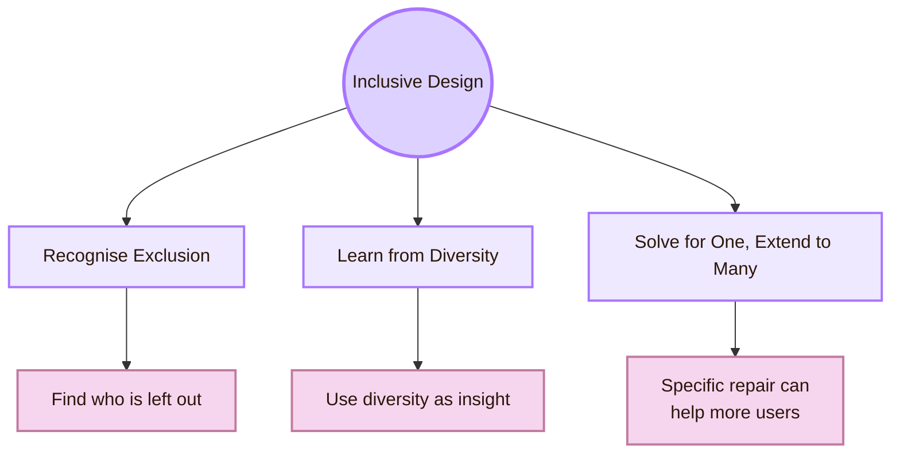

| Inclusive design move | Meaning for a student project |
|---|---|
| Recognise exclusion | Ask who cannot read, open, navigate, understand, or trust the map |
| Learn from diversity | Treat different access needs as design knowledge, not inconvenience |
| Solve for one, extend to many | A keyboard-access fix helps motor-disabled users, power users, and broken mouse situations |
| Start early | Accessibility theory should guide structure before the theme becomes complex |
| Design with, not only for | User feedback matters, especially from people with access needs |

Inclusive design is not the same as making everything neutral. It means finding where the design creates exclusion and using that discovery to make the system better.

## Universal Design theory

Universal Design is a broad design approach for environments, products, and systems that aims to support the widest practical range of people. The classic seven principles include equitable use, flexibility in use, simple and intuitive use, perceptible information, tolerance for error, low physical effort, and size and space for approach and use.

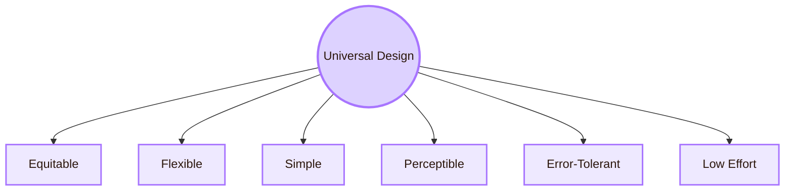

| Universal Design principle | HCI interpretation |
|---|---|
| Equitable use | Users should not be separated into “normal” and “special” paths when a shared path can work |
| Flexibility in use | Multiple ways to navigate, read, input, and recover |
| Simple and intuitive use | The system should not depend on hidden knowledge |
| Perceptible information | Important information should not depend on only colour, sound, or subtle layout |
| Tolerance for error | Users need undo, recovery, clear errors, and safe exploration |
| Low physical effort | The interface should avoid unnecessary precision, repetition, and fatigue |
| Size and space | Targets, spacing, and layouts should support different bodies, devices, and contexts |

Universal Design is especially relevant in education. A student project should not require perfect vision, motor control, English, Git knowledge, or device setup to be understandable.

## Ability-Based Design

Ability-Based Design argues that systems should focus on what users can do and adapt to those abilities. It shifts attention from a disability label to the actual interaction abilities available in the moment.

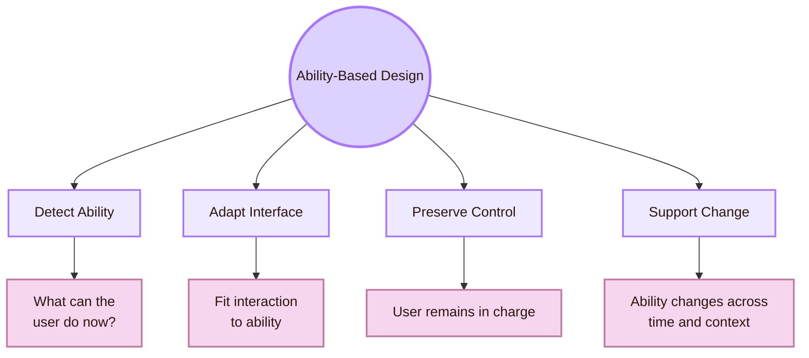

| Ability-based idea | Interface example |
|---|---|
| Focus on ability | Design around what the user can currently perceive, move, read, remember, or control |
| Adaptation | Offer keyboard, touch, screen reader, zoom, captions, reduced motion, or simplified view |
| User control | Do not force automatic adaptation that disorients users |
| Dynamic ability | Fatigue, stress, injury, device, lighting, and attention change what the user can do |
| Multiple routes | A good interface gives more than one path to the goal |

Ability-Based Design is useful because it avoids treating disabled users as one category. It asks for a more exact question: what does this user need the system to do differently so the goal remains possible?

## Assistive technology layer

Assistive technologies are not “extra.” They are part of the actual interface for many users. A system that does not work with assistive technology is incomplete.

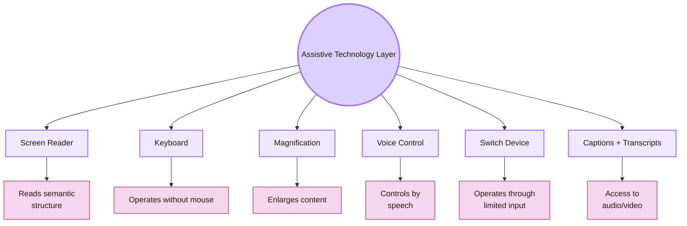

| Assistive technology | Design requirement |
|---|---|
| Screen reader | Headings, labels, roles, link text, reading order, meaningful structure |
| Keyboard | All actions reachable, visible focus, no keyboard traps |
| Magnification | Layout does not break when zoomed |
| Voice control | Controls have visible, speakable labels |
| Switch device | Interface supports sequential navigation and does not require complex gestures |
| Captions and transcripts | Audio and video content has text equivalents |
| Reduced motion settings | Animation is not required for understanding and can be reduced |

For an Obsidian/GitHub HCI vault, the practical theory is simple: Markdown structure matters. Headings, link text, diagrams, alt text, and reading order are not just formatting. They are access infrastructure.

## Accessibility barriers by user dimension

Accessibility theory becomes clearer when barriers are mapped by dimension. These are not fixed groups. One user can experience several barriers at once.

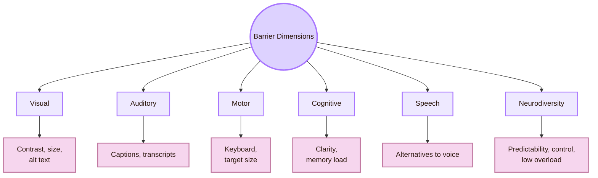

| Dimension | Common design barrier | Better theory question |
|---|---|---|
| Visual | Meaning depends only on colour, tiny text, no alt text | How else can the same information be perceived? |
| Auditory | Important content exists only in sound | Where is the text equivalent? |
| Motor | Interface requires precise mouse movement or gestures | What alternative input path exists? |
| Cognitive | Dense, ambiguous, memory-heavy interface | How can the system reduce load and clarify structure? |
| Speech | System requires voice input | What non-speech route exists? |
| Neurodiversity | Unexpected motion, clutter, time pressure, unclear feedback | How can predictability and control be improved? |
| Temporary/situational | Glare, fatigue, stress, noisy room, broken mouse | How does the system handle real-life variation? |

## Cognitive Accessibility

Cognitive accessibility deserves its own theoretical attention because many student projects over-focus on visual contrast and forget comprehension.

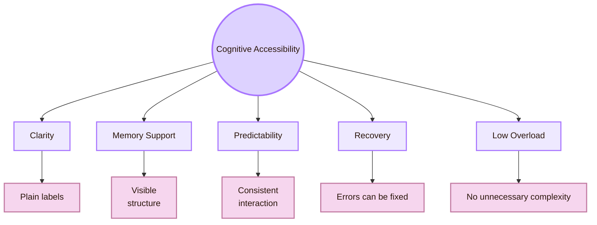

| Cognitive barrier | Example in the HCI map | Repair |
|---|---|---|
| Ambiguous metaphor | “Inclusive Gate” without academic translation | Add “Accessibility and Inclusive Design” near the title |
| Overloaded page | Too many diagrams and sources without explanation | Use smaller sections and clear synthesis |
| Weak navigation | User cannot tell where they are | Add backlinks, consistent page route, room label |
| Memory burden | User must remember what CS2023 terms mean | Repeat labels and provide glossary |
| Unclear source trust | User cannot tell which source is official | Separate CS2023, standards, venues, and practice sources |
| Diagram dependence | User must understand complex Mermaid graph | Pair diagram with readable table and prose |

Cognitive accessibility is not “making things childish.” It is making complex systems understandable without unnecessary mental friction.

## Inclusive design and power

Accessibility theory is also about power. Designers decide defaults. They decide who must adapt, who gets a smooth path, who needs a workaround, and whose frustration counts as evidence.

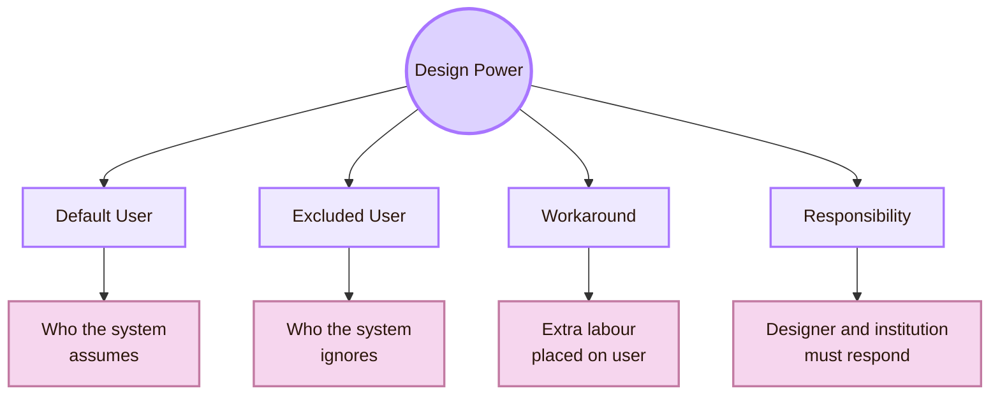

| Power question | Why it matters |
|---|---|
| Who is treated as the default user? | The default user receives the easiest path |
| Who must ask for help? | Extra labour is placed on excluded users |
| Who is not tested? | Untested users become invisible in design decisions |
| Who controls adaptation? | Automatic changes can help or disorient |
| Who is blamed when access fails? | Responsible design blames barriers, not users |
| Who benefits from the repair? | A repair for one group often improves the system for many |

This is where accessibility connects to CS2023 Accountability. Inclusive design is technical, but it is also a responsibility structure.

## Accessibility evaluation theory

Evaluation belongs later in the map, but theory must explain the basic idea: accessibility cannot be proven by a single automated score.

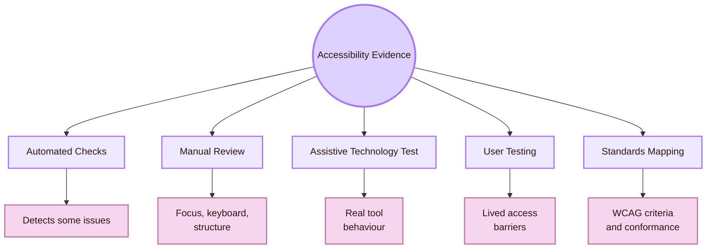

| Evidence layer | What it can show | What it cannot show alone |
|---|---|---|
| Automated check | Some missing labels, contrast issues, structural problems | Real comprehension, assistive-technology experience, all barriers |
| Manual review | Keyboard access, focus, heading logic, content clarity | Full diversity of lived access needs |
| Assistive technology test | How screen readers or other tools interpret the interface | All disabilities or all situations |
| User testing | Real strategies, fatigue, confusion, and workarounds | Complete standards conformance |
| WCAG mapping | Recognised accessibility criteria | Full inclusive experience |

For the Cognishire vault, the minimum evidence should include keyboard navigation, heading structure, link text, contrast, font scaling, diagram readability, and whether the page remains meaningful without visual styling.

## Local to global bridge

The local UVT project should use global theory to improve the local design.

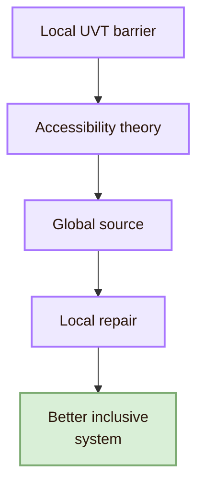

| Local UVT barrier | Global theory | Repair |
|---|---|---|
| Professor cannot see the academic meaning behind fantasy names | Understandable content, cognitive accessibility | Add official CS2023 label near every metaphor |
| Student cannot read Mermaid text because contrast is weak | Perceivable content, contrast | Use light nodes, dark text, compact labels, and tested contrast in Mermaid classes |
| Keyboard user cannot move through links logically | Operable interface | Check focus order and link structure |
| GitHub download loses CSS | Robustness and portability | Keep CSS in repo and provide setup notes |
| Diagram is decorative but unclear | Inclusive visual communication | Pair every diagram with a table or explanation |
| English academic text is dense | Cognitive and language accessibility | Add short real-life translations and examples |
| Page depends on colour categories | Perceivable information | Use labels, shapes, headings, and text, not colour alone |

## Cognishire theory application

The Inclusive Gate should protect the whole map, not only one page.

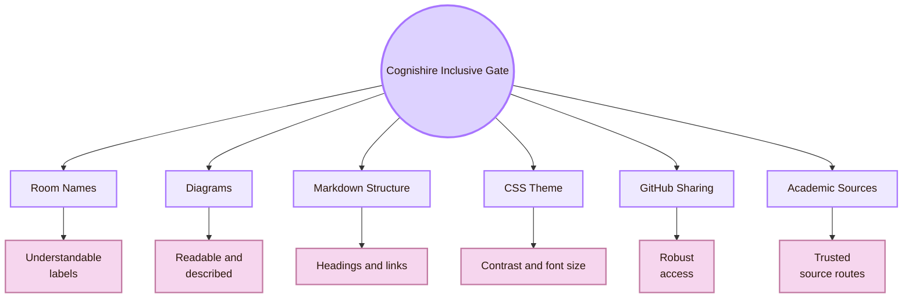

| Map element | Inclusive theory test |
|---|---|
| Fantasy room title | Does it include the academic meaning immediately? |
| Mermaid diagram | Can it be read, zoomed, and understood without colour alone? |
| Page structure | Are headings clear and in logical order? |
| Links | Does link text explain the destination? |
| CSS theme | Does contrast remain readable across screens? |
| GitHub/Obsidian setup | Can the viewer access content even if styling fails? |
| Sources | Can the user distinguish official curriculum, standards, research, and practice sources? |
| Long pages | Are summaries and routes provided so users do not get lost? |

## Theory synthesis

Accessibility and Inclusive Design theory starts from a simple but strict idea: barriers are created by mismatches between people and systems. A responsible design does not ask users to disappear, struggle silently, or adapt alone. It changes the system.

The Inclusive Gate uses several theories together. WCAG gives the technical accessibility baseline through perceivable, operable, understandable, and robust design. Inclusive Design asks who is excluded and how diversity can guide better design. Universal Design asks how one system can work for the widest range of people. Ability-Based Design asks what a user can do now and how the system can adapt. Accountability asks who is responsible when the design excludes or harms.

For the local UVT project, this means the HCI map must be readable, navigable, understandable, portable, and academically clear for the real people who will use it. For the global HCI field, it must connect to CS2023, W3C/WCAG, inclusive design, ability-based design, assistive technologies, and accessibility evaluation.

The central question is:

> Who is excluded by this design, what barrier excludes them, and how can the system change?

## Academic anchors

| Route | Source |
|---|---|
| CS2023 HCI basis | [CS2023 HCI Version Gamma](https://csed.acm.org/wp-content/uploads/2023/09/HCI-Version-Gamma.pdf) |
| CS2023 Knowledge Areas | [CS2023 Knowledge Areas](https://csed.acm.org/knowledge-areas/) |
| WCAG 2.2 standard | [W3C WCAG 2.2](https://www.w3.org/TR/WCAG22/) |
| WCAG overview | [W3C WCAG Overview](https://www.w3.org/WAI/standards-guidelines/wcag/) |
| Accessibility principles | [W3C WAI Accessibility Principles](https://www.w3.org/WAI/fundamentals/accessibility-principles/) |
| Understanding WCAG 2.2 | [W3C Understanding WCAG 2.2](https://www.w3.org/WAI/WCAG22/Understanding/) |
| First accessibility checks | [W3C Easy Checks](https://www.w3.org/WAI/test-evaluate/preliminary/) |
| Accessibility evaluation | [W3C Evaluating Web Accessibility](https://www.w3.org/WAI/test-evaluate/) |
| Inclusive design method | [Microsoft Inclusive Design](https://inclusive.microsoft.design/) |
| Ability-Based Design paper | [Ability-Based Design: Concept, Principles and Examples](https://kgajos.seas.harvard.edu/papers/wobbrock11abd.pdf) |
| Ability-Based Design overview | [Communications of the ACM: Ability-Based Design](https://cacm.acm.org/research/ability-based-design/) |
| Universal Design principles | [The Center for Universal Design: Principles of Universal Design](https://design.ncsu.edu/research/center-for-universal-design/) |
| Accessibility research community | [ACM SIGACCESS](https://www.sigaccess.org/) |
| Accessibility conference | [ACM ASSETS](https://dl.acm.org/conference/assets) |
| Web accessibility conference | [Web4All](https://www.w4a.info/) |
| UVT accessibility for students with disabilities | [UVT: Accessibility for students with disabilities](https://uvt.ro/en/educatie/info-studenti-proces-educational/accesibilitate-pentru-studentii-cu-dizabilitati/) |
| UVT social inclusion | [UVT actively promotes social inclusion](https://www.uvt.ro/en/blog/uvt-promoveaza-activ-incluziunea-sociala/) |
| UVT tactile accessibility initiative | [UVT tactile models accessibility initiative](https://uvt.ro/en/comunicate-presa/in-cadrul-strategiei-institutionale-orientata-spre-accesibilizare-uvt-instaleaza-machetele-tactile-in-toate-spatiile-principale-din-sediul-principal/) |
| UVT Faculty of Informatics | [Faculty of Informatics UVT](https://info.uvt.ro/en/) |

^theory-accessibility-inclusive-design-end
